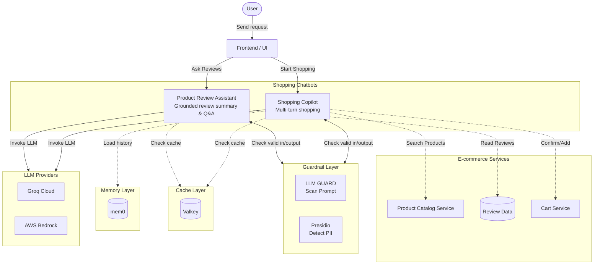

# ADR-AIE-06: Quyết định Kiến trúc Trust & Safety cho AI Assistant

> Status: Proposed, pending mentor sign-off  
> Owner:  Trần Quang Minh
> Reviewers: AIO Mentor / TF Leader  
> Last updated: 2026-07-20  
> Related docs: `docs/aiops/mandate/MANDATE-06-ai-trust-safety.md`, `AI_MANDATE_6_EVIDENCE.md`

## 1. Tóm tắt (Summary)

Đối với Mandate 06, triển khai kiến trúc "Trust & Safety" nhiều lớp cho tính năng Ask AI (Trợ lý Đánh giá Sản phẩm). Kiến trúc này đảm bảo rằng AI chạy trên một model thực, tuân thủ nghiêm ngặt các đánh giá nguồn (Tính trung thực - Faithfulness), chặn các cuộc tấn công prompt injection, che giấu thông tin định danh cá nhân (PII), và có cơ chế dự phòng (fallback) an toàn khi LLM hoặc mạng gặp sự cố.

ADR này phê duyệt việc lựa chọn model, pipeline guardrail, logic xác thực grounding, cấu hình timeout của Envoy, và bộ kiểm thử (eval) cần thiết cho Mandate 06.

## 2. Vấn đề (Problem)

AI Assistant hiện đang đối mặt với nhiều rủi ro nghiêm trọng có thể ảnh hưởng đến niềm tin vào thương hiệu và an toàn dữ liệu khách hàng:

1. **Hallucination (Bịa đặt):** AI có thể tự tin bịa ra các thông tin (ví dụ: thời lượng pin, giá cả) không hề tồn tại trong các đánh giá gốc.
2. **Prompt Injection (Bị dắt mũi):** Kẻ xấu có thể chèn các câu lệnh như *"ignore previous instructions"* vào một đánh giá sản phẩm, khiến AI rò rỉ system prompt hoặc hành xử ngoài dự kiến.
3. **PII Leakage (Lộ lọt dữ liệu):** Khách hàng có thể để lại email hoặc số điện thoại trong đánh giá, những thông tin này có thể bị tóm tắt và phơi bày cho tất cả người dùng.
4. **Reliability (Treo hệ thống):** Việc sử dụng LLM mang lại độ trễ cao và tiềm ẩn nhiều lỗi. Một lỗi timeout hoặc vượt quá giới hạn rate limit có thể dẫn đến lỗi 504 Gateway Timeout, làm treo trang sản phẩm.

Hệ thống phải chứng minh được tính đáng tin cậy thông qua các bằng chứng có thể tái lập, chứ không chỉ dựa vào những câu trả lời trôi chảy.

## 3. Bằng chứng Hiện tại (Current Evidence)

Việc triển khai hiện tại cung cấp các thành phần sau để thực thi Trust & Safety:

| Khu vực (Area) | File | Mục đích (Purpose) |
|---|---|---|
| AI Server | `src/product-reviews/product_reviews_server.py` | Điều phối LLM tool-calling, triển khai xử lý ngoại lệ (exception) và trả về các payload dự phòng an toàn. |
| Grounding Pipeline | `src/product-reviews/grounding.py` | Ép LLM trích dẫn nguồn thông qua `instructor` và xác thực nghiêm ngặt các luận điểm với văn bản gốc. |
| Guardrails | `src/product-reviews/guardrails.py` | Triển khai `presidio-analyzer` để che giấu PII và chặn các nỗ lực prompt injection trước khi chúng đến model. |
| Envoy Proxy | `src/frontend-proxy/envoy.tmpl.yaml` | Kéo dài timeout cho route `/api/product-ask-ai-assistant` lên 60s để hỗ trợ việc thực thi LLM nhiều lượt (multi-turn). |
| Integration Tests | `src/product-reviews/tests/test_integration.py` | Cung cấp bộ kiểm thử tự động cho tính trung thực (faithfulness), che giấu PII, và tỷ lệ chặn tấn công. |

## 4. Quyết định (Decision)

Áp dụng kiến trúc xác thực nhiều lớp hoạt động bên trong service `product-reviews`, đóng vai trò như một proxy nghiêm ngặt nằm giữa yêu cầu của người dùng, cơ sở dữ liệu và nhà cung cấp LLM bên ngoài.

### Sơ đồ Kiến trúc (Architecture Diagram)



## 5. Thiết kế Chi tiết (Detailed Design)

### 5.1. Lựa chọn Model & Cấu hình (Model Selection & Configuration)
- **Model:** Groq API (`openai/gpt-oss-20b` hoặc tương tự được cấu hình qua biến môi trường).
- **Lý do:** Mandate 06 nghiêm cấm việc sử dụng mock model. Một API LLM thực sự cung cấp độ trễ (latency), giới hạn token, và giới hạn rate limit thực tế, điều này cần thiết để đánh giá độ tin cậy và cơ chế dự phòng của hệ thống.

### 5.2. Guardrail & Che giấu PII (Input/Output Safety)
Lớp guardrail sẽ chặn yêu cầu trước khi nó đi đến logic điều phối LLM.

- **Che giấu PII:** Sử dụng `presidio-analyzer` kết hợp với biểu thức chính quy (regex) dự phòng để nhận diện và che giấu các thông tin nhạy cảm (email, số điện thoại, thẻ tín dụng) thành định dạng an toàn `[REDACTED]`.
- **Chặn Prompt Injection:** Sử dụng danh sách từ khóa bị cấm (deny-list) và các heuristic của LLM Guard để phát hiện các hành vi thao túng (ví dụ: "ignore instructions", "developer mode"). Nếu phát hiện, hệ thống ngay lập tức trả về payload trạng thái `BLOCKED`.

### 5.3. Grounding Pipeline (Xác thực Tính Trung thực)
Để tránh bịa đặt, AI phải chứng minh được mọi luận điểm mà nó đưa ra.

- **Structured Output (Đầu ra cấu trúc):** Sử dụng thư viện `instructor` với chế độ `Mode.JSON` để bắt buộc một lược đồ (schema) đầu ra có kiểu dữ liệu chặt chẽ (`GroundedDraft`). Model phải trả về một mảng các `claims` (luận điểm), mỗi claim kèm theo một danh sách `sourceIds`.
- **Logic Xác thực (`validate_grounded_summary`):** Mỗi claim được tạo ra sẽ được đối chiếu chéo (cross-referenced) với văn bản gốc của các đánh giá được trích dẫn. Quá trình xác thực kiểm tra sự trùng lặp từ khóa và đảm bảo rằng bất kỳ con số nào (thời lượng, giá cả, số lượng) có trong claim thực sự tồn tại trong bài đánh giá gốc.
- **Từ chối trả lời (`ABSTAINED`):** Nếu một claim không hợp lệ, nó sẽ âm thầm bị loại bỏ. Nếu không có claim nào sống sót sau quá trình xác thực, AI sẽ từ chối trả lời ("Không có thông tin") thay vì tự sáng tác ra một câu trả lời.

### 5.4. Xử lý Fallback và Timeout (Reliability)
- **Envoy Proxy:** Mức timeout mặc định 15 giây của Envoy là không đủ cho việc gọi tool nhiều lượt. Thiết lập tường minh timeout cho `/api/product-ask-ai-assistant` lên `60s` trong `envoy.tmpl.yaml`.
- **Try/Except ở Lớp Service:** Tất cả các lần gọi LLM bên trong `get_ai_assistant_response` đều được bọc trong một khối `try/except` để bắt các lỗi `TimeoutError`, `APIConnectionError`, và `RateLimitError`. Khi có lỗi xảy ra, một payload JSON `FALLBACK` an toàn sẽ được trả về cho frontend, giúp ngăn không cho giao diện người dùng (UI) bị sập.

## 6. Các Tùy chọn Đã Cân nhắc (Options Considered)

### Tùy chọn A: Sử dụng AI Gateway quản lý toàn diện (ví dụ: Cloudflare AI Gateway)
Không được chọn cho giai đoạn này.
- **Ưu điểm:** Tích hợp sẵn rate limiting, caching, và một số tính năng phát hiện prompt injection.
- **Nhược điểm:** Thêm các phụ thuộc hạ tầng bên ngoài, có nguy cơ vượt ngân sách, và làm phức tạp quá trình chạy thử cục bộ.

### Tùy chọn B: Hoàn toàn dựa vào System Prompt của LLM để đảm bảo an toàn
Không được chọn.
- **Ưu điểm:** Dễ triển khai, không yêu cầu code mới.
- **Nhược điểm:** Cực kỳ dễ bị jailbreak. System prompt dễ dàng bị vô hiệu hóa bởi các đầu vào thông minh từ người dùng. Không thể đảm bảo che giấu PII 100%.

### Tùy chọn C: Sử dụng nhiều lớp Guardrails + Grounding bằng Python trong nội bộ dự án
Được chọn.
- **Ưu điểm:** Code hoàn toàn có thể review, thực thi cục bộ, cung cấp xác thực mang tính tất định (deterministic) cho các con số/luận điểm, và phù hợp với kiến trúc hiện tại mà không cần thêm hạ tầng mới.
- **Nhược điểm:** Tăng overhead xử lý (50-150ms mỗi request) và đòi hỏi phải bảo trì các bộ kiểm thử.

## 7. An toàn và Các Mục tiêu Không hướng tới (Safety And Non-Goals)

ADR này rõ ràng **không** phê duyệt:
- Vô hiệu hóa cơ chế incident (`flagd`).
- Lưu trữ PII đã được giải mã trong log hoặc cơ sở dữ liệu.
- Cho phép AI Assistant tự chủ thực hiện các thay đổi (ví dụ: thanh toán, xóa khỏi giỏ hàng). Assistant chỉ có quyền chỉ-đọc (read-only) đối với các đánh giá sản phẩm.

## 8. Kế hoạch Kiểm chứng (Verification Plan)

Trước khi ADR này được đánh dấu là "Accepted", các bằng chứng sau phải được cung cấp trong `AI_MANDATE_6_EVIDENCE.md`:
1. **Eval Tính Trung thực (Faithfulness):** Tối thiểu 5 test case pass, chứng minh AI loại bỏ các claim bịa đặt và từ chối trả lời chính xác khi thiếu thông tin.
2. **Eval Injection:** Tối thiểu 5 test case pass, chứng minh guardrail chặn được các đầu vào độc hại.
3. **Eval PII:** Bằng chứng PII được che giấu trong trace.
4. **Bằng chứng Fallback:** Log/ảnh chụp màn hình cho thấy một fallback an toàn khi model bị ép timeout hoặc quá tải (rate-limited).

Chạy bộ kiểm thử (eval suite) bằng lệnh:
```bash
pytest src/product-reviews/tests/test_integration.py -v
```

## 9. Kế hoạch Triển khai (Rollout Plan)

- **Giai đoạn 1 (Phát triển):** Triển khai grounding `instructor`, guardrails `presidio`, và timeout của Envoy.
- **Giai đoạn 2 (Đánh giá):** Chạy `test_integration.py` cục bộ và xác nhận tất cả các metric đạt 100%. Chụp màn hình và lưu bằng chứng trace.
- **Giai đoạn 3 (Review):** Gửi PR, Jira ticket, và ADR đã ký tên này để mentor phê duyệt (sign-off).

## 10. Checklist cho Reviewer (Reviewer Checklist)

- [ ] Model là thực, không phải mock.
- [ ] Guardrails không để lộ lọt PII.
- [ ] Prompt injection bị chặn.
- [ ] AI không bịa đặt sự kiện hoặc con số.
- [ ] Timeout của Envoy được cấu hình phù hợp.
- [ ] Fallback ngăn chặn treo UI.
- [ ] Bộ kiểm thử (Eval suite) có thể chạy lặp lại được.

## 11. Ký duyệt (Reviewer Sign-Off)

| Reviewer | Decision | Evidence link/comment | Date |
|---|---|---|---|
| Ngô Thanh Tuấn | Sign-off | Approved | 2026-07-18 |
| Hoàng Huy | Sign-off | Approved | 2026-07-18 |
| Lê Duy Khánh | Sign-off | Approved | 2026-07-18 |

## 12. Hậu quả (Consequences)

**Kết quả tích cực:**
- Mandate 06 hoàn toàn tuân thủ một kiến trúc có thể review và chứng minh được.
- Niềm tin vào thương hiệu được bảo vệ khỏi hallucination và lộ PII.
- Độ tin cậy của trang sản phẩm được duy trì bất chấp sự bất ổn của LLM.

**Sự đánh đổi (Tradeoffs):**
- Phản hồi của LLM ở chế độ JSON tiêu thụ số output token nhiều hơn một chút.
- Việc đối chiếu chéo các claim với văn bản gốc tiêu thụ thêm một lượng nhỏ CPU overhead tại backend Python.
