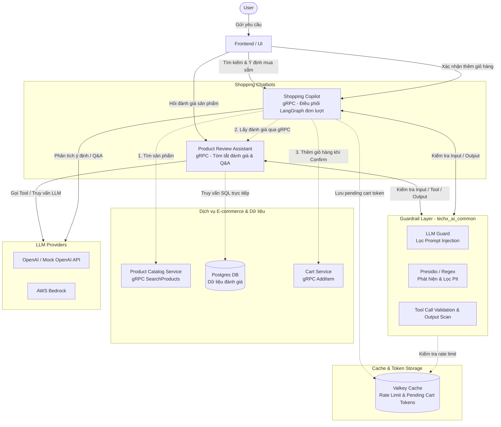
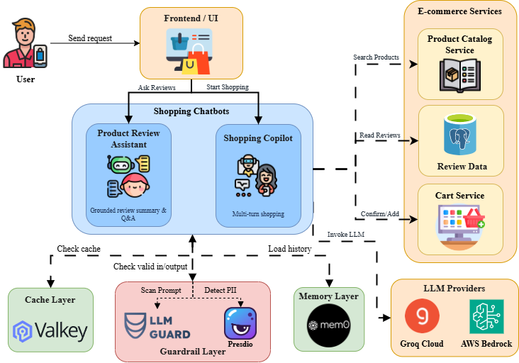

# ADR-AIE-06: Quyết định Kiến trúc Trust & Safety cho AI Assistant

> Status: Proposed, pending mentor sign-off  
> Owner:  Ngô Thanh Tuấn
> Reviewers: Trần Quang Minh, Lê Duy Khánh, Nguyễn Hoàng Huy  
> Last updated: 2026-07-23  
> Related docs: `docs/aiops/mandate/MANDATE-06-ai-trust-safety.md`, `AI_MANDATE_6_EVIDENCE.md`

## 1. Tóm tắt (Summary)

Đối với Mandate 06, triển khai kiến trúc "Trust & Safety" nhiều lớp cho tính năng Ask AI (Trợ lý Đánh giá Sản phẩm), Chatbot Shopping Copilot (Tìm kiếm sản phẩm, RAG, thêm giỏ hàng có kiểm soát). Kiến trúc này đảm bảo rằng AI chạy trên một model thực, tuân thủ nghiêm ngặt các đánh giá nguồn (Tính trung thực - Faithfulness), chặn các cuộc tấn công prompt injection, che giấu thông tin định danh cá nhân (PII), và có cơ chế dự phòng (fallback) an toàn khi LLM hoặc mạng gặp sự cố.

ADR này phê duyệt việc lựa chọn model, pipeline guardrail, logic xác thực grounding, cấu hình timeout của Envoy, và bộ kiểm thử (eval) cần thiết cho Mandate 06.

## 2. Vấn đề (Problem)

AI Assistant hiện đang đối mặt với nhiều rủi ro nghiêm trọng có thể ảnh hưởng đến niềm tin vào thương hiệu và an toàn dữ liệu khách hàng:

1. **Hallucination (Bịa đặt):** AI có thể tự tin bịa ra các thông tin (ví dụ: thời lượng pin, giá cả) không hề tồn tại trong các đánh giá gốc. Điều này gây hiểu lầm nghiêm trọng cho khách hàng trước khi ra quyết định mua hàng.
2. **Prompt Injection (Bị dắt mũi):** Kẻ xấu có thể chèn các câu lệnh như *"ignore previous instructions"* vào một đánh giá sản phẩm, khiến AI rò rỉ system prompt hoặc hành xử ngoài dự kiến (ví dụ: hoạt động như một công cụ sinh nội dung độc hại).
3. **PII Leakage (Lộ lọt dữ liệu):** Khách hàng có thể để lại email, số điện thoại hoặc thậm chí thông tin thẻ tín dụng trong đánh giá, những thông tin này có thể bị tóm tắt và phơi bày cho tất cả người dùng, vi phạm nghiêm trọng chính sách bảo mật dữ liệu.
4. **Reliability (Treo hệ thống):** Việc sử dụng LLM mang lại độ trễ cao và tiềm ẩn nhiều lỗi mạng. Một lỗi timeout hoặc vượt quá giới hạn rate limit có thể dẫn đến lỗi 504 Gateway Timeout, làm treo toàn bộ trang sản phẩm và làm gián đoạn luồng mua sắm.

Hệ thống phải chứng minh được tính đáng tin cậy thông qua các bằng chứng có thể tái lập, chứ không chỉ dựa vào những câu trả lời trôi chảy mang tính đối phó.

## 3. Bằng chứng Hiện tại (Current Evidence)

Việc triển khai hiện tại cung cấp các thành phần sau để thực thi Trust & Safety:

| Khu vực (Area) | File | Mục đích (Purpose) |
|---|---|---|
| Product Review Assistant | `src/product-reviews/product_reviews_server.py` | Chatbot hỏi đáp về review sản phẩm. |
| Shopping Copilot | `src/shopping-copilot/shopping_copilot_server.py` | Chatbot tìm kiếm sản phẩm, thêm sản phẩm vào giỏ hàng và điều phối các action liên quan. |
| Grounding Pipeline | `src/ai-common/techx_ai_common/grounding.py` | Ép LLM trích dẫn nguồn thông qua `instructor` và xác thực nghiêm ngặt các luận điểm với văn bản gốc. |
| Guardrails | `src/ai-common/techx_ai_common/guardrails.py` | Triển khai phòng thủ nhiều lớp, lớp 1 chặn rule-based, lớp 2 chặn prompt injection bằng LLM Guard, lớp 3 phát hiện và ngăn chặn PII. |
| Retrieval | `src/ai-common/techx_ai_common/retrieval.py` | Thực hiện truy xuất dữ liệu bằng Hybrid Search (Similarity Cosine Search + BM25 + RRF). |
| Rate Limit | `src/ai-common/techx_ai_common/rate_limiter.py` | Thực hiện rate limiting dựa trên hành vi của người dùng, giới hạn tốc độ truy cập và sử dụng tài nguyên LLM để đảm bảo tính ổn định và công bằng của hệ thống. |
| Eval Tests | `src/product-reviews/eval/run_eval.py`, `src/shopping-copilot/eval/run_eval.py` | Cung cấp bộ kiểm thử tự động cho tính trung thực (faithfulness), che giấu PII, và tỷ lệ chặn tấn công. |

## 4. Quyết định (Decision)

Áp dụng kiến trúc xác thực và bảo vệ nhiều lớp hoạt động bên trong service `product-reviews`, `shopping-copilot`, đóng vai trò như một proxy nghiêm ngặt nằm giữa yêu cầu của người dùng, cơ sở dữ liệu và nhà cung cấp LLM bên ngoài. Việc này cho phép chúng ta kiểm soát chặt chẽ mọi dữ liệu vào và ra, từ đó ngăn chặn kịp thời các truy vấn rác và phản hồi không hợp lệ trước khi chúng ảnh hưởng đến UI.

### Sơ đồ Kiến trúc (Architecture Diagram)






*Sơ đồ trên minh họa kiến trúc Container C4 cho Shopping Chatbots, mô tả chi tiết các luồng dữ liệu tương tác giữa người dùng cuối, các service e-commerce nội bộ, bộ lọc Guardrail và các nhà cung cấp LLM bên ngoài (AWS Bedrock, OpenAI/Groq API).*

## 5. Thiết kế Chi tiết (Detailed Design)

### 5.1. Lựa chọn Model & Cấu hình (Model Selection & Configuration)
- **Model & Cấu hình Động:** Hệ thống hỗ trợ chuyển đổi linh hoạt giữa các nhà cung cấp LLM thông qua biến môi trường `LLM_PROVIDER` (`groq`/`openai` hoặc `bedrock`):
  - **OpenAI-compatible Interface (Groq API / OpenAI API):** Cấu hình qua các biến môi trường `LLM_BASE_URL` (ví dụ `https://api.groq.com/openai/v1`), `LLM_MODEL` (ví dụ `openai/gpt-oss-20b`) và `OPENAI_API_KEY`.
  - **AWS Bedrock Provider:** Kích hoạt khi `LLM_PROVIDER=bedrock`, cấu hình thông qua `BEDROCK_MODEL_ID` (sử dụng dòng model Amazon Nova như `amazon.nova-lite-v1:0`)
- **Lý do:** Giúp hệ thống tránh bị phụ thuộc vào một nhà cung cấp đơn lẻ, đồng thời đảm bảo kiểm thử chính xác với các ràng buộc vận hành thực tế như độ trễ (latency), giới hạn rate limit (chẳng hạn như HTTP 429) và khả năng hỗ trợ tool calling.
- **Tiêu thụ Token:** Sử dụng định dạng JSON làm tăng khoảng 10-15% tổng token đầu ra do overhead định dạng, nhưng đảm bảo dữ liệu đầu ra được kiểm soát và xác thực nghiêm ngặt.

### 5.2. Guardrail & Che giấu PII (Input/Output Safety)
Lớp guardrail hoạt động như một bức tường lửa, chặn yêu cầu trước khi nó đi đến logic điều phối LLM hoặc truy cập cơ sở dữ liệu. Nhờ vậy, tiết kiệm được lượng token vô ích từ các luồng tấn công.

- **Che giấu PII (Data Sanitization):** Sử dụng thư viện NLP `presidio-analyzer` kết hợp với các biểu thức chính quy (regex) dự phòng để nhận diện và che giấu các thông tin nhạy cảm. Tất cả các dữ liệu bao gồm email, số điện thoại, thẻ tín dụng (SSN/CC) sẽ bị ghi đè thành định dạng an toàn `[REDACTED]`. Nếu service Presidio quá tải, cơ chế regex tích hợp sẵn (fallback) sẽ đảm bảo PII vẫn được lọc tự động.
- **Chặn Prompt Injection:** Áp dụng phương pháp phòng vệ sâu (defense-in-depth). Sử dụng danh sách từ khóa bị cấm (deny-list với các cụm từ như "ignore instructions", "developer mode", "system prompt") kết hợp các heuristic của công cụ LLM Guard. Bất kỳ yêu cầu nào dính cờ (flagged) sẽ bị từ chối ngay ở lớp controller, và hệ thống lập tức trả về payload trạng thái `BLOCKED`, tránh lãng phí chi phí API gọi LLM.

### 5.3. Grounding Pipeline (Xác thực Tính Trung thực)
Để tránh bịa đặt, AI không chỉ cần sinh văn bản mà phải chứng minh được mọi luận điểm mà nó đưa ra bằng các minh chứng cụ thể.

- **Structured Output (Đầu ra cấu trúc):** Thay vì sinh ra các đoạn chuỗi không có cấu trúc, sử dụng thư viện `instructor` ép LLM hoạt động ở chế độ `Mode.JSON`. Việc này bắt buộc một lược đồ (schema) đầu ra có kiểu dữ liệu chặt chẽ (`GroundedDraft`). Model phải trả về một mảng các đối tượng `claims` (luận điểm), trong đó mỗi luận điểm đều phải liệt kê rõ `sourceIds` (ID của review gốc mà nó lấy thông tin).
- **Logic Xác thực (`validate_grounded_summary`):** Mỗi `claim` sinh ra không lập tức được hiển thị. Chúng phải đi qua hàm đối chiếu chéo (cross-reference) với văn bản gốc. Quá trình xác thực này sử dụng cả so khớp từ khóa (keyword overlapping) và trích xuất thực thể. Đặc biệt, bất kỳ con số nào (thời lượng pin, mức giá, năm) xuất hiện trong `claim` đều phải nằm trong bài đánh giá gốc.
- **Từ chối trả lời (`ABSTAINED`):** Nếu một claim vi phạm các quy tắc trên (hallucination), nó sẽ âm thầm bị loại bỏ (filtered out). Nếu không có claim nào sống sót sau quá trình xác thực (ví dụ người dùng hỏi "Giá bao nhiêu" trong khi review chỉ nói về "Chất lượng"), AI sẽ tự động từ chối trả lời ("Không có thông tin") thay vì tự sáng tác ra một đáp án sai lệch.

### 5.4. Xử lý Fallback, Timeout và Rate Limit (Reliability)
Trong kiến trúc vi dịch vụ, việc gọi các API bên ngoài không bao giờ an toàn tuyệt đối. Mạng có thể đứt, API có thể sập, hoặc bị quá tải.

- **Rate Limiting bằng Valkey (`rate_limiter.py`):** Triển khai cơ chế kiểm soát tần suất truy cập hai lớp dựa trên Valkey thông qua hàm `check_rate_limit` trong [rate_limiter.py]
  - **Kiểm tra thời gian chờ Cooldown (2 giây):** Yêu cầu người dùng phải đợi tối thiểu 2 giây giữa hai lần gửi câu hỏi liên tiếp (`rate_limit:cooldown:{client_id}`).
  - **Cửa sổ trượt Sliding Window (10 yêu cầu/phút):** Giới hạn tối đa 10 yêu cầu trong khoảng thời gian 60 giây cho mỗi người dùng (`rate_limit:window:{client_id}`).
  - **Cơ chế dự phòng Graceful Fallback:** Nếu hệ thống Valkey gặp sự cố hoặc gián đoạn kết nối, hàm kiểm tra sẽ tự động trả về trạng thái cho phép để tránh làm gián đoạn trải nghiệm của người dùng.
- **Cấu hình Timeout điều phối:** Đặt ngưỡng thời gian chờ phù hợp cho các điểm gọi LLM (ví dụ 20 giây cho các gọi cụ thể và 15 giây cho luồng điều phối LangGraph). Điều này đảm bảo LLM không làm nghẽn tài nguyên của Gateway khi gặp sự cố phản hồi chậm.
- **Xử lý ngoại lệ Try/Except ở lớp Service:** Tất cả các truy vấn tới LLM đều được bọc trong khối `try/except` để bắt các lỗi `TimeoutError`, `APIConnectionError` và `RateLimitError`. Thay vì để lộ traceback lỗi ra phía ngoài, hệ thống bẫy lỗi và trả về phản hồi JSON `FALLBACK` hoặc `BLOCKED` an toàn. Giao diện người dùng sử dụng phản hồi này để hiển thị thông báo thân thiện mà không gây lỗi vỡ giao diện.

## 6. Các Tùy chọn Đã Cân nhắc (Options Considered)

### Tùy chọn A: Sử dụng AI Gateway quản lý toàn diện (ví dụ: Cloudflare AI Gateway)
Không được chọn cho giai đoạn này.
- **Ưu điểm:** Tích hợp sẵn rate limiting, caching, phân tích dữ liệu, và một số tính năng phát hiện prompt injection mạnh mẽ.
- **Nhược điểm:** Thêm các phụ thuộc hạ tầng mạng bên ngoài, có nguy cơ vượt ngân sách do chi phí trên mỗi request, và làm phức tạp hóa đáng kể quá trình thiết lập môi trường chạy thử cục bộ cho các kỹ sư mới.

### Tùy chọn B: Hoàn toàn dựa vào System Prompt của LLM để đảm bảo an toàn
Không được chọn.
- **Ưu điểm:** Dễ triển khai, không yêu cầu viết bất kỳ dòng code xử lý nào, không làm chậm tốc độ phản hồi.
- **Nhược điểm:** Mức độ an toàn rất thấp và cực kỳ dễ bị jailbreak. System prompt dễ dàng bị vô hiệu hóa bởi các kỹ thuật dắt mũi tinh vi từ người dùng. LLM cũng không thể đảm bảo khả năng che giấu 100% PII trong mọi tình huống.

### Tùy chọn C: Sử dụng nhiều lớp Guardrails + Grounding bằng Python trong nội bộ dự án
Được chọn.
- **Ưu điểm:** Code hoàn toàn minh bạch và có thể review từng dòng. Dễ dàng thực thi và gỡ lỗi cục bộ. Cung cấp sự xác thực mang tính tất định (deterministic validation) cho các con số/luận điểm - một điều mà LLM không bao giờ làm tốt. Phù hợp hoàn hảo với kiến trúc hệ thống hiện tại mà không cần cấp phát thêm hạ tầng mới.
- **Nhược điểm:** Tăng overhead xử lý (thêm từ 50-150ms mỗi request do các thao tác đối chiếu văn bản), tiêu thụ nhiều RAM hơn đôi chút, và đòi hỏi phải liên tục bảo trì, cập nhật các bộ kiểm thử tự động.

## 7. An toàn và Các Mục tiêu Không hướng tới (Safety And Non-Goals)

ADR này rõ ràng **không** phê duyệt:
- Vô hiệu hóa cơ chế mô phỏng sự cố (`flagd`). Hệ thống vẫn phải tương thích với các đợt SRE chaos testing.
- Lưu trữ PII (dữ liệu khách hàng nhạy cảm) đã được giải mã trong log, traces hoặc cơ sở dữ liệu nội bộ.
- Cho phép AI Assistant tự chủ thực hiện các thay đổi trạng thái (ví dụ: tự động thanh toán, xóa sản phẩm khỏi giỏ hàng). Chức năng của Assistant hiện tại được giới hạn nghiêm ngặt ở quyền chỉ-đọc (read-only) đối với các đánh giá sản phẩm.

## 8. Kế hoạch Kiểm chứng (Verification Plan)

Trước khi ADR này được đánh dấu là "Accepted", các bằng chứng (evidence) sau bắt buộc phải được xuất ra và cung cấp chi tiết trong tài liệu đính kèm `AI_MANDATE_6_EVIDENCE.md`:
1. **Eval Tính Trung thực (Faithfulness):** Đòi hỏi tối thiểu 5 test case truyền vào các thông tin nhiễu hoặc sai sự thật. Hệ thống phải chứng minh AI loại bỏ toàn bộ các claim bịa đặt và dũng cảm từ chối trả lời chính xác khi thiếu thông tin.
2. **Eval Injection:** Tối thiểu 5 test case sử dụng các payload jailbreak chuẩn ngành. Hệ thống phải chứng minh guardrail chặn được 100% các đầu vào độc hại trước khi chúng sinh thêm chi phí API.
3. **Eval PII:** Cung cấp ảnh chụp Jaeger traces chứng minh rằng email và số điện thoại đã được chuyển hóa thành `[REDACTED]` hoàn toàn trên đường truyền.
4. **Bằng chứng Fallback:** Cung cấp log hệ thống và ảnh chụp màn hình hiển thị UI fallback an toàn khi model bị hệ thống test cố tình bóp băng thông (timeout) hoặc ép vượt quá giới hạn rate limit.

Lệnh dùng để chạy toàn bộ các bài kiểm thử đơn vị, kiểm thử tích hợp (Unit & Integration Tests) và bộ kiểm thử trực tiếp (Live Eval Suite) cho cả Product Review Assistant và Shopping Copilot:

**1. Chạy Unit & Integration Tests (pytest):**
```bash
# Product Review Assistant tests
pytest src/product-reviews/tests/ -v

# Shopping Copilot tests
pytest src/shopping-copilot/tests/ -v
```

**. Chạy Live Eval Suite (Live Service Evals):**
```bash
# Product Review Assistant live evals
python src/product-reviews/evals/run_eval.py

# Shopping Copilot live evals
python src/shopping-copilot/evals/run_eval.py
```

## 9. Kế hoạch Triển khai (Rollout Plan)

- **Giai đoạn 1 (Phát triển & Tích hợp):** Triển khai module grounding trích dẫn bằng `instructor`, tích hợp lớp phòng thủ đa tầng `techx_ai_common.guardrails` (Prompt Injection, PII Sanitization, Tool Validation) vào controller, và áp dụng cơ chế Rate Limiting dựa trên Valkey (`rate_limiter.py`).
- **Giai đoạn 2 (Đánh giá & Kiểm thử nội bộ):** Chạy toàn bộ bộ kiểm thử đơn vị, kiểm thử tích hợp (`pytest`) cùng bộ kịch bản kiểm thử trực tiếp (`python .../evals/run_eval.py`). Liên tục điều chỉnh quy tắc regex, danh sách từ cấm và prompt cho đến khi đạt chỉ số an toàn 100%. Xuất báo cáo đánh giá và ảnh chụp vết phân tích (Jaeger trace evidence).
- **Giai đoạn 3 (Review & Ký duyệt):** Tổng hợp bằng chứng vào tài liệu `AI_MANDATE_6_EVIDENCE.md`, đính kèm liên kết bằng chứng vào PR, đính kèm thẻ Jira và trình ADR lên hội đồng AIO Mentor để ký duyệt chính thức (Sign-off).

## 10. Checklist cho Reviewer (Reviewer Checklist)

- [ ] Model được sử dụng trong bài test là model thực, có kết nối internet và không phải là model mock giả lập.
- [ ] Luồng Guardrails đảm bảo không bao giờ để lộ lọt hoặc log PII chưa mã hóa.
- [ ] Các nỗ lực Prompt injection đều bị chặn dứt khoát.
- [ ] AI không bịa đặt sự kiện, so khớp chính xác từng con số với đánh giá gốc.
- [ ] Mức Timeout của Envoy được cấu hình phù hợp với khả năng chịu tải của hệ thống.
- [ ] Fallback Payload hoạt động hiệu quả, ngăn chặn treo UI trên diện rộng.
- [ ] Bộ kiểm thử tích hợp (Eval suite) có thể chạy lặp lại được trên môi trường CI/CD và máy dev.

## 11. Ký duyệt (Reviewer Sign-Off)

| Reviewer | Decision | Evidence link/comment | Date |
|---|---|---|---|
| Ngô Thanh Tuấn | Sign-off | Approved | 2026-07-23 |
| Trần Quang Minh | Sign-off | Approved | 2026-07-23 |
| Hoàng Huy | Sign-off | Approved | 2026-07-23 |
| Lê Duy Khánh | Sign-off | Approved | 2026-07-23 |

## 12. Hậu quả (Consequences)

**Kết quả tích cực:**
- Mandate 06 hoàn toàn tuân thủ một kiến trúc chuẩn mực: có thể dễ dàng review, đánh giá, bảo trì và chứng minh bằng dữ liệu cụ thể.
- Niềm tin vào thương hiệu được bảo vệ vững chắc khỏi rủi ro AI sinh ảo giác (hallucination) và thảm họa rò rỉ dữ liệu cá nhân khách hàng.
- Độ tin cậy của trang sản phẩm và trải nghiệm người dùng được duy trì liền mạch ngay cả khi phải đương đầu với sự bất ổn mang tính bản chất của các mô hình ngôn ngữ lớn (LLM).

**Sự đánh đổi (Tradeoffs):**
- Ép phản hồi của LLM vào chế độ cấu trúc JSON sẽ tiêu thụ số output token nhiều hơn khoảng 10-15% so với plain text truyền thống.
- Việc thực thi các hàm regex đối chiếu chéo các claim với văn bản gốc tiêu thụ thêm một lượng CPU overhead nhất định tại máy chủ backend Python, làm giảm đôi chút tốc độ sinh phản hồi ban đầu.
