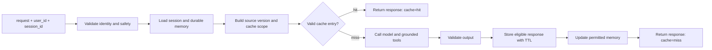

# AI MANDATE #23 — GenAI Caching and Memory

> **Status:** `DRAFT — evidence pending`
>
> Đây là dàn ý body Jira. Thay mọi `[TODO]` bằng link, số đo thực tế hoặc `N/A`
> trước khi chuyển trạng thái sang `PASS`.

## 1. Outcome at a Glance

Tầng AI tránh gọi lại model khi có thể tái sử dụng an toàn một kết quả cũ, giữ
hội thoại mạch lạc trong một session, và truy hồi preference được phép lưu ở
session sau của đúng người dùng. Cache và memory được cô lập theo user; khi nguồn
grounding thay đổi, các cache entry bị ảnh hưởng không còn hợp lệ.

Phạm vi cache gồm Review Summary và Shopping Copilot; phần memory được kiểm chứng trên
Shopping Copilot. Mục tiêu không phải chỉ làm câu trả lời nhanh hơn: mỗi cache hit phải
chỉ ra được là kết quả cũ vẫn an toàn để tái sử dụng, còn dữ liệu đã đổi thì phải buộc hệ
thống tạo câu trả lời mới. Các scenario ở mục 5 và số đo ở mục 6 là bằng chứng cho các
tuyên bố này.

Chi tiết approach triển khai nằm tại [Caching implementation](caching/mandate-23-cache-implementation.md)
và [Memory implementation](memory/mandate-23-memory-implementation.md).

## 2. Why this Change Matters

Người dùng thường lặp lại một câu hỏi, hỏi tiếp dựa trên câu trả lời trước đó, hoặc quay
lại vào một session khác. Nếu mỗi request đều bắt đầu từ đầu, hệ thống vừa tốn token và
chậm hơn cần thiết, vừa khiến trải nghiệm như đang nói với một trợ lý không nhớ gì.

Vấn đề không chỉ là performance. Reuse nhầm một câu trả lời của người khác là rò dữ liệu;
reuse câu trả lời dựa trên catalog hoặc review đã đổi là trả lời sai. Vì vậy cache phải có
ranh giới user và kiểm tra freshness, còn memory phải phân biệt rõ context tạm thời của
một cuộc hội thoại với preference được phép nhớ lâu hơn.

Implementation này có ba tính chất sản phẩm:

1. **Reuse safely:** request lặp và đủ điều kiện trả `cache=hit`, không gọi lại
   model.
2. **Maintain continuity:** Copilot hiểu tham chiếu và constraint qua tối thiểu
   ba lượt liên quan trong cùng session.
3. **Remember only for the right user:** session mới truy hồi permitted durable
   facts của cùng `user_id`; `user_id` khác không nhận cache response hoặc memory
   của người dùng đầu tiên.

## 3. Scope and Data Boundaries

Mỗi lời gọi qua replay hoặc production path đều mang `user_id`, `session_id` và request.
Ba giá trị này xác định dữ liệu nào được phép đọc, cache entry nào có thể tái sử dụng, và
context nào phải bị bỏ đi khi session kết thúc. Với replay, chúng là test identities do
mentor cung cấp; production path ánh xạ chúng từ identity đã được xác thực.

### 3.1 Identity Contract

| Field | Ý nghĩa | Ranh giới được áp dụng |
|---|---|---|
| `user_id` | Ranh giới sở hữu dữ liệu bền | Cache và durable memory không đi qua user khác. Raw ID không dùng làm metric label. |
| `session_id` | Ranh giới một hội thoại | Chỉ giữ conversational context tạm thời. |
| `request` | Yêu cầu của user cho replay/cache lookup | Được normalize trước exact hash hoặc semantic lookup. |
| Source version/hash | Phiên bản catalog/review/source dùng để trả lời | Source thay đổi làm response cũ không còn đủ điều kiện dùng lại. |

Cache key, thứ tự lookup và cách source version tham gia vào cache scope được mô tả trong
[Caching implementation](caching/mandate-23-cache-implementation.md).

### 3.2 Memory Continuity and User Isolation

Memory xuất hiện như một capability thống nhất của Copilot, nhưng có hai vòng đời
và hai phạm vi dữ liệu riêng:

| Scope | Key | Nội dung lưu | Có thể truy hồi ở session mới? |
|---|---|---|---|
| Session context | `user_id + session_id` | Nhu cầu hiện tại, tham chiếu, item đã chọn, conversational context đang chờ | Không |
| Durable user memory | `user_id` | Preference hoặc shopping constraint đã được policy cho phép | Có |

Chỉ durable fact tối thiểu mới được lưu. PII bị từ chối hoặc sanitize theo policy.
Memory khi truy hồi luôn được xem là untrusted data, không phải instruction.
Chi tiết storage, retrieval, retention và PII guard nằm trong
[Memory implementation](memory/mandate-23-memory-implementation.md).

## 4. Design Summary

Thiết kế tách hai việc dễ bị nhầm lẫn: cache tái sử dụng một response còn hợp lệ để tránh
gọi model, còn memory chỉ cung cấp context thuộc đúng user cho một request mới. Cache không
được dùng như kho preference toàn cục, và memory không làm một response cũ trở nên hợp lệ
khi source grounding đã đổi. Hai capability gặp nhau tại request path, nhưng cùng tuân theo
identity boundary ở mục 3.

### 4.1 Request Path

Luồng dưới đây cho thấy thứ tự kiểm soát: hệ thống xác định đúng user và context trước,
sau đó mới quyết định một entry cache còn hợp lệ hay không. Chỉ response đã qua grounding
và validation mới có thể được lưu; một cache hit trả thẳng response hợp lệ, còn cache miss
đi qua model rồi cập nhật cache và memory đủ điều kiện.



### 4.2 Caching Approach

#### Caching là gì?

Trong luồng không có cache, một câu hỏi luôn đi qua guardrail, tools và model dù hệ
thống vừa trả lời đúng câu đó trước đó. Cache thêm một đường đi ngắn hơn: lưu lại một
response đã được kiểm tra và chỉ reuse khi request mới có cùng ranh giới an toàn với
entry cũ.

Cache ở đây không phải memory:

- Cache trả lại một response đã tạo trước đó để tránh gọi model lại.
- Memory lấy context hoặc preference của user để tạo một response mới.

Ví dụ, user hỏi “Recommend telescope options priced below $150” lần đầu thì hệ thống
vẫn gọi model và lưu response đủ điều kiện. Nếu cùng user hỏi lại đúng câu đó trong
cùng context và source chưa đổi, hệ thống có thể trả exact hit. Nếu user đổi cách diễn
đạt thành “Find telescope options under $150”, hệ thống có thể trả semantic hit nếu độ
tương đồng nằm trong threshold.

#### Motivation và Problem cần giải quyết

| Problem | Nếu không xử lý | Kỹ thuật được dùng |
|---|---|---|
| Request lặp vẫn gọi model | Tốn token, model call và thời gian xử lý | Exact cache |
| User diễn đạt lại cùng intent | Exact string key luôn miss | Embedding và semantic KNN |
| Câu giống nhau nhưng khác user | Có nguy cơ rò response giữa user | HMAC user scope |
| Câu giống nhau nhưng khác conversation/intent | Có thể reuse sai conversational state | HMAC conversation + request scope |
| Catalog, review hoặc memory đã đổi | Cache có thể trả dữ liệu cũ | Source snapshot/hash |
| Prompt, model hoặc embedding thay đổi | Entry cũ có thể không còn tương thích | Version scopes và hybrid filters |
| Entry tồn tại quá lâu | Tăng nguy cơ stale response | TTL |
| Valkey hoặc embedding lỗi | Cache làm hỏng toàn bộ Copilot | Fail-open về model path |
| Cart action hoặc output không grounded bị lưu | Có thể replay thao tác hoặc response không an toàn | Cacheability policy |

#### Implementation đang được dùng

Implementation chia thành hai lớp:

- `techx_ai_common.semantic_cache.SemanticCache` là adapter dùng chung. Lớp này quản
  lý Valkey index, deterministic exact key, embedding, filtered KNN, TTL và fail-open.
- `shopping_cache.py` là policy của Shopping Copilot. Lớp này quyết định request nào
  được cache, tạo conversation scope, chụp source snapshot, serialize state an toàn và
  hydrate state khi hit.

Mỗi lookup được cô lập bằng các giá trị sau:

| Scope/filter | Cách tạo | Problem được giải quyết |
|---|---|---|
| `user_scope` | HMAC-SHA256 từ `user_id` | Không để user khác dùng cùng cache entry; không lộ raw user ID trong key. |
| Conversation scope | HMAC từ `conversation_id` và nhóm intent như discovery, product hoặc memory | Không trộn state giữa conversation hoặc loại request. |
| `source_hash` | SHA-256 của stable conversation state, memory fingerprint và catalog/review snapshot liên quan | Source/context đổi thì entry cũ không còn match. |
| `prompt_scope` | `shopping-react-agent:v1` | Prompt version đổi không reuse entry cũ. |
| `model_scope` | Provider và model đang chạy | Model đổi không reuse output không tương thích. |
| `embedding_scope` | Tên/version embedding model | Vector từ embedding version khác không bị trộn. |

#### Lookup diễn ra như thế nào?

Exact lookup chạy trước vì rẻ và không cần vector search. Semantic lookup chỉ chạy khi
exact miss. KNN lấy candidate gần nhất nhưng candidate vẫn phải khớp đồng thời user,
conversation/resource, source, prompt, model và embedding scope. Threshold mặc định là
`0.12`; distance càng nhỏ thì hai request càng gần nhau.

Chỉ response `GROUNDED`, read-only và không có pending action mới được lưu. Anonymous
request, cart mutation và response như `NO_RESULTS` không được biến thành reusable cache
entry. Evidence hiện tại cho thấy hai request `NO_RESULTS` liên tiếp đều miss.

### 4.3 Cache Safety Rules

Các giá trị cấu hình và flow xử lý chi tiết của các quy tắc dưới đây được ghi trong
[shared semantic cache guide](caching/semantic-cache-implementation-guide.md).

| Rule | Giá trị implementation | Evidence |
|---|---|---|
| Cache scope | `user_id` scope + resource/session scope + normalized request + source version + prompt/model version | `[TODO]` |
| Match modes | `[TODO: exact; semantic nếu bật]` | `[TODO]` |
| TTL | `[TODO: giá trị và configuration]` | `[TODO]` |
| Invalidation | Source version/hash được kiểm tra trước lookup | `[TODO]` |
| Cacheable output | `[TODO: ví dụ grounded read-only answer]` | `[TODO]` |
| Never cached | Blocked, fallback, rate-limited, mutation/pending-action responses | `[TODO]` |

#### Verification Source Record

Đây là bản ghi được chọn để đội chạy invalidation replay và để người review có thể
sửa an toàn khi cần xác minh lại.

| Field | Value |
|---|---|
| Service/store | `[TODO]` |
| Record ID | `[TODO: stable ID]` |
| Field có thể sửa khi xác minh | `[TODO]` |
| Giá trị gốc | `[TODO]` |
| Test value / giá trị mới phải xuất hiện trong answer | `[TODO]` |
| Lệnh sửa và restore | `[TODO]` |

## 5. Replay and Reproduction

Replay là cửa kiểm chứng dùng cùng input contract cho mọi case. Nó cho phép người chạy tự
chọn request, user và session thay vì dựa vào câu trả lời được seed sẵn. Vì vậy mentor có
thể lặp lại một request để quan sát hit, đổi source record để buộc miss, hoặc thay identity
để kiểm tra isolation mà không cần hiểu implementation nội bộ.

### 5.1 Replay Schema and Contract

Team cung cấp một replay entry point có thể gọi từ bên ngoài. Không được pre-seed
answer: cache hit phải là kết quả của một request thật trước đó.

**Input**

```json
{
  "request": "Find an option under $150",
  "user_id": "mentor-user-a",
  "session_id": "88888888-8888-4888-8888-888888888888"
}
```

**Response Fields**

```json
{
  "sequence": 1,
  "request": "Find an option under $150",
  "user_id": "mentor-user-a",
  "session_id": "88888888-8888-4888-8888-888888888888",
  "status": "GROUNDED",
  "cache": "hit",
  "cache_status": "hit",
  "cache_match": "exact",
  "cache_distance": 0.0,
  "latency_ms": 12.4,
  "product_ids": ["[product-id]"]
}
```

`cache` luôn nhận một trong hai giá trị `hit` hoặc `miss`. `cache_match` có thể
nhận `exact`, `semantic` hoặc `none`. `cache_status` được giữ lại để tương thích
với evidence cũ và luôn có cùng giá trị với `cache`.

`session_id` phải là UUID v4 hợp lệ. Service bỏ qua conversation state, cache và
memory khi nhận một giá trị session không hợp lệ; dùng UUID khác khi tạo session mới.

**Entry point:** CLI gọi Shopping Copilot gRPC qua `--host` và `--port`. CLI nhận
`user_id` và `session_id` bên ngoài, rồi map `session_id` thành gRPC
`conversation_id`; mỗi request tự tạo một `turn_id` mới.

**Reproduction command**

Lệnh dưới đây chạy replay bằng input bên ngoài. `--request` có thể lặp lại; mỗi
lần xuất hiện sẽ được thêm thành một phần tử trong request list, theo đúng thứ tự.
Ví dụ này tạo cold miss rồi gửi lại cùng Q để kiểm chứng exact hit.

```powershell
$env:PYTHONPATH = "src/ai-common;src/shopping-copilot;src/product-reviews"

$port = (
  (docker compose -f docker-compose.yml -f docker-compose.ai-dev.yml `
    port shopping-copilot 3552) -split ":"
)[-1]

python src/shopping-copilot/scripts/replay_shopping_cache.py `
  --host localhost --port $port `
  --user-id mentor-user-a `
  --session-id 88888888-8888-4888-8888-888888888888 `
  --request 'Find a portable telescope under $150.' `
  --request 'Find a portable telescope under $150.' `
  --output mandate23-replay.jsonl
```

**Expected output:** Mỗi request tạo một JSONL row gồm `sequence`, `request`,
`user_id`, `session_id`, `status`, `cache`, `cache_status`, `cache_match`,
`cache_distance`, `latency_ms` và `product_ids`. Raw JSONL là bằng chứng cache
flag; nội dung response/source đã đổi được chụp ở Screenshot A. `model_calls`,
token và cost được lấy từ metric tổng để điền mục 6, không phải từ một row replay.
Lệnh invalidation dùng source record ở mục 4.3 và luôn có bước restore.

**Memory replay pattern:** dùng ba `--request` khác nhau cùng `--user-id` và
`--session-id` cho Scenario B. Chạy lại lệnh với cùng `--user-id` nhưng
`--session-id` mới cho Scenario C; đổi cả `--user-id` lẫn `--session-id` cho
Scenario D.

### 5.2 Evidence Capture Scenarios

Bốn scenario dưới đây là cách team chụp evidence cho ticket. Chúng dùng cùng entry point
ở mục 5.1; mỗi ảnh phải hiển thị input identity, output quan sát được và `cache=hit|miss`
khi cache có liên quan. Raw output và ảnh được đính kèm ngay tại scenario tương ứng.

### Scenario A — Repeated Request and Cache Invalidation

**Mục tiêu:** chứng minh cache hit thật, sau đó chứng minh source freshness.

**Điều kiện bắt đầu:** cache rỗng; source record chỉ định đang có giá trị gốc;
User A và Session A đã sẵn sàng.

| Step | Action | Expected Observable Result |
|---:|---|---|
| 1 | Gửi request Q với User A / Session A | `cache=miss`; response có source value A. |
| 2 | Gửi lại y hệt request Q | `cache=hit`; answer được reuse; model-call count không tăng. |
| 3 | Sửa source record chỉ định từ A sang B | Source mutation thành công. |
| 4 | Gửi lại Q | `cache=miss`; answer có value B, không còn value A. |
| 5 | Restore source record | Test data quay về giá trị ban đầu. |

> **Screenshot A — [TODO: đính kèm ảnh replay cache và source mutation]**
>
> *Caption: Q lần đầu trả `cache=miss`; Q lặp lại trả `cache=hit` mà model-call
> count không tăng. Sau khi source đổi từ A sang B, Q trả `cache=miss` và answer
> phản ánh value B.*

### Scenario B — Context Across Three Turns

**Mục tiêu:** chứng minh session continuity mà user không phải nhắc lại constraint.

| Turn | Cùng `user_id` và `session_id` | Expected Observable Result |
|---:|---|---|
| 1 | Nêu nhu cầu và durable constraint, ví dụ: “Tôi cần kính thiên văn gọn nhẹ, ngân sách $150.” | Copilot xác nhận hoặc dùng đúng constraint đã nêu. |
| 2 | Hỏi theo ngữ cảnh, ví dụ: “Tìm lựa chọn phù hợp với nhu cầu đó.” | Copilot áp dụng nhu cầu và mức $150 mà không hỏi lại. |
| 3 | Tham chiếu kết quả trước, ví dụ: “So sánh sản phẩm đầu tiên với lựa chọn khác.” | Copilot hiểu “sản phẩm đầu tiên” từ đúng session. |

> **Screenshot B — [TODO: đính kèm ảnh ba lượt cùng session]**
>
> *Caption: Ba request dùng cùng `user_id` và `session_id`. Turn 2 kế thừa nhu
> cầu/ngân sách ở turn 1; turn 3 hiểu đúng tham chiếu tới kết quả trước đó.*

### Scenario C — Durable Recall in a New Session

**Mục tiêu:** chứng minh durable memory được phép lưu vẫn tồn tại qua ranh giới
session.

| Step | Action | Expected Observable Result |
|---:|---|---|
| 1 | Khởi tạo Session B với cùng User A | Session B có `session_id` mới. |
| 2 | Hỏi lựa chọn mà không nhắc lại durable preference/constraint | Copilot truy hồi và áp dụng đúng fact được phép từ Session A. |
| 3 | Xác nhận temporary reference của Session A không tồn tại | Copilot không xem “sản phẩm đầu tiên” của Session A là đã biết ở Session B. |

> **Screenshot C — [TODO: đính kèm ảnh recall ở session mới]**
>
> *Caption: Session B dùng `session_id` mới nhưng cùng `user_id` với Session A;
> Copilot truy hồi đúng durable fact mà không mang theo temporary reference của
> Session A.*

### Scenario D — Cross-User Isolation and PII Boundary

**Mục tiêu:** chứng minh User B không thể đọc dữ liệu của User A.

| Step | Action | Expected Observable Result |
|---:|---|---|
| 1 | User B gửi cùng request của User A | Không reuse cache entry của User A; `cache=miss` khi phù hợp. |
| 2 | User B hỏi preference của User A | Không trả User-A memory hoặc private data. |
| 3 | Gửi một fact có PII | Fact bị reject hoặc sanitize theo policy và không xuất hiện khi recall sau đó. |

> **Screenshot D — [TODO: đính kèm ảnh cross-user và PII boundary]**
>
> *Caption: User B không nhận cache response, durable memory hoặc PII của User A;
> fact có PII bị reject hoặc sanitize theo policy.*

## 6. Measured Results

Phần này trả lời câu hỏi cache có thực sự giảm lời gọi model, latency và cost hay không.
Baseline và cache-enabled chạy cùng request set, model configuration và source snapshot;
cache-enabled bắt đầu với cache rỗng để request đầu là miss thật. Request set có cả request
không lặp và request lặp; hit-rate vì vậy được tính trên toàn bộ tập chạy, không chỉ chọn
những request dễ hit. Raw replay output, thời điểm chạy và công thức cost được đính kèm
cùng bảng khi điền số thực tế.

| Metric | Baseline (cache off) | Cache enabled | Change |
|---|---:|---:|---:|
| Requests | `[TODO]` | `[TODO]` | — |
| Repeated requests | `[TODO]` | `[TODO]` | — |
| Cache hits | `0` | `[TODO]` | `[TODO]` |
| Hit-rate | `0%` | `[TODO]` | `[TODO: pp]` |
| Model calls | `[TODO]` | `[TODO]` | `[TODO]` |
| Input tokens | `[TODO]` | `[TODO]` | `[TODO]` |
| Output tokens | `[TODO]` | `[TODO]` | `[TODO]` |
| Model cost | `[TODO: currency]` | `[TODO: currency]` | `[TODO: currency / %]` |
| Mean latency | `[TODO: ms]` | `[TODO: ms]` | `[TODO: ms / %]` |
| p95 latency | `[TODO: ms]` | `[TODO: ms]` | `[TODO: ms / %]` |

**Cost calculation và price source:** `[TODO: model, region, price source, date,
và formula]`

## 7. Decisions, Ownership, and References

Mục này ghi lại ai chịu trách nhiệm cho implementation và các quyết định không được thay
đổi âm thầm sau khi evidence đã được chụp. Phần ADR bên dưới là record ký trực tiếp trên
Jira; các link kỹ thuật chỉ giải thích cách implementation thực hiện các quyết định đó.

**Implementation PR:** [tf2-team/tf2-corp-platform#140](https://github.com/tf2-team/tf2-corp-platform/pull/140)
**Commit:** `[TODO]`
**Design owner:** `[TODO]`
**Reviewers/sign-off date:** `[TODO]`

### 7.1 ADR Record and Sign-off

| Decision | Status | Sign-off |
|---|---|---|
| Cache key luôn chứa user boundary, source version và TTL; hit không gọi model. | `Accepted` | `[TODO: name, date]` |
| Session context dùng `user_id + session_id`; durable memory chỉ truy hồi trong cùng `user_id`. | `Accepted` | `[TODO: name, date]` |
| Chỉ durable fact được policy cho phép mới được lưu; PII bị reject hoặc sanitize trước persistence. | `Accepted` | `[TODO: name, date]` |

### 7.2 Technical References

- [Caching implementation](caching/mandate-23-cache-implementation.md)
- [Memory implementation](memory/mandate-23-memory-implementation.md)
- `[TODO: Directive #23 — normative requirement]`
