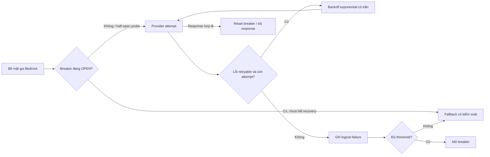
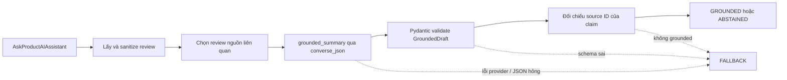
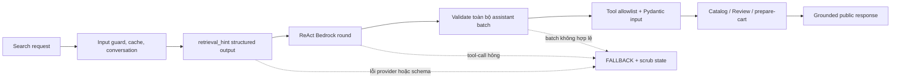

# AI MANDATE #25 — Bedrock Resilience and Controlled Degradation

## 1. Outcome at a Glance

Shopping Copilot và Product Reviews cùng dùng Bedrock adapter tại
`src/ai-common/techx_ai_common/bedrock.py`. Adapter giới hạn lời gọi provider
bằng logical deadline, retry có số lần tối đa, backoff có trần, và circuit
breaker theo process. Cả hai service chuyển lỗi Bedrock thành response công khai
có kiểm soát thay vì để lộ lỗi provider hoặc exception chưa xử lý.

Product Reviews chỉ chấp nhận summary sau khi JSON qua Pydantic và claim được
đối chiếu với review nguồn. Shopping Copilot validate toàn bộ batch tool-call
của Bedrock trước khi thay đổi state hoặc gọi tool. Input tool sai không thể tạo
cart action; fallback cũng xóa pending cart action.

## 2. Why this Change Matters

Bedrock là dependency bên ngoài. Timeout, throttling, 5xx, hoặc output model
hỏng không được làm bề mặt khách hàng treo, trả raw 500, bịa câu trả lời, hoặc
gọi tool với tham số không an toàn.

Mandate 25 yêu cầu degrade có kiểm soát: dừng retry trong ngân sách hữu hạn,
trả fallback trung thực, ngừng gọi provider khi outage kéo dài, và tự probe lại
khi provider hồi phục.

## 3. Scope and Runtime Configuration

### 3.1 In Scope

| Bề mặt | Điểm vào | Phần Bedrock được kiểm soát |
|---|---|---|
| Product Reviews | `AskProductAIAssistant` | `grounded_summary`, structured generation, và grounding validation |
| Shopping Copilot | `ShoppingCopilotService.Search` | `retrieval_hint`, `react_round`, grounded review answer, và memory extraction |
| Shared adapter | `techx_ai_common.bedrock` | Timeout, retry, backoff, deadline, breaker, schema validation, telemetry, và fault injection |

### 3.2 Production Baseline

`.env.override` là nguồn cấu hình runtime bình thường. Compose truyền file này
vào service thật.

| Biến | Baseline hiện tại | Tác dụng |
|---|---:|---|
| `BEDROCK_CONNECT_TIMEOUT_SECONDS` | 2 | Giới hạn kết nối mỗi attempt |
| `BEDROCK_READ_TIMEOUT_SECONDS` | 10 | Giới hạn đọc phản hồi provider mỗi attempt |
| `BEDROCK_MAX_ATTEMPTS` | 2 | Một attempt đầu và tối đa một retry ở adapter |
| `BEDROCK_BACKOFF_BASE_SECONDS` / `MAX` | 0.25 / 1 | Backoff exponential có trần |
| `BEDROCK_SCHEMA_MAX_ATTEMPTS` | 2 | Số lần thử structured output trong một deadline |
| `BEDROCK_TOTAL_DEADLINE_SECONDS` | 15 | Logical deadline mặc định của shared adapter |
| `BEDROCK_BREAKER_FAILURE_THRESHOLD` | 3 | Số logical failure để mở breaker |
| `BEDROCK_BREAKER_RECOVERY_SECONDS` | 30 | Thời gian OPEN trước một half-open probe |

`AI_CACHE_ENABLED`, `MEM0_READ_ENABLED`, `MEM0_WRITE_ENABLED`, và
`AI_GUARDRAIL_REQUIRE_MODEL` là feature flag production, không phải biến ép lỗi.

## 4. Design Summary

### 4.1 Shared Bedrock Control Flow



`converse_raw` quản lý vòng provider attempt. Botocore được cấu hình một attempt
để không nhân retry ở hai tầng. Các lỗi retryable gồm network/read timeout,
throttling, và Bedrock 5xx tạm thời. Adapter ghi metric và log cho retry,
breaker, deadline, schema rejection, và fault injection.

Breaker được key theo `BEDROCK_MODEL_ID:AWS_REGION` và chỉ sống trong process.
Nó chuyển `CLOSED → OPEN → HALF_OPEN → CLOSED`; half-open probe thành công sẽ
reset failure count. Các replica không chia sẻ breaker state.

### 4.2 Product Reviews Flow



`_get_bedrock_response` bắt lỗi trên nhánh Bedrock và trả `FALLBACK` cố định.
Payload công khai không có exception provider, stack trace, claim của model, hay
nội dung thay thế được bịa. Fallback có `claims=[]` và thông báo: “AI summary is
temporarily unavailable. Please try again shortly.”

`converse_json(GroundedDraft, ...)` parse JSON bằng Pydantic. JSON hỏng bị từ
chối, đếm metric, và chỉ được thử lại trong giới hạn
`BEDROCK_SCHEMA_MAX_ATTEMPTS` cùng logical deadline. Draft hợp lệ còn phải qua
grounding validation với source ID của review đã sanitize mới được trả
`GROUNDED`.

### 4.3 Shopping Copilot Flow and Tool-Call Boundary



`_validate_bedrock_message` kiểm tra assistant envelope, từng content block,
tool allowlist, tool-use ID, tool name, kiểu input, và Pydantic model của tool.
Toàn bộ batch phải hợp lệ trước khi tool đầu tiên chạy. Vì vậy batch lẫn call
hợp lệ và không hợp lệ sẽ không thực thi tool nào.

Cart tool chỉ chuẩn bị pending action. RPC `ConfirmCartAction` riêng mới ghi
cart thật. Khi Bedrock lỗi hoặc output sai, graph revoke pending token rồi trả
fallback với products, claims, sources, criteria, và pending-action token rỗng.


## 5. Replay and Reproduction

Điểm vào test là `src/product-reviews/tests/test_mandate25.py`. Test recreate
service thật bằng `.env.override` cộng fault plan của scenario. Test không patch
Python object, không thay service bằng mock. Outcome `pass` gọi Amazon Bedrock
thật.

### 5.1 Replay Schema and Contract

Team cung cấp 1 file scenario.py có thể sửa các scenario input đầu vào sau đó chạy lệnh py với từng kịch bản phù hợp. 

**Ví dụ về kịch bản có thể sửa trong file mandate25_scenario_input.py**

```json
#kịch bản 1
"shopping-copilot/provider-failure": {
        "BEDROCK_FAULT_INJECTION_ENABLED": "true",
        "BEDROCK_FAULT_WORKFLOW_STEP": "retrieval_hint",
        "BEDROCK_FAULT_SEQUENCE": "[],[]", #có thể điền timeout để test kịch bản timeout của bedrock hoặc điền server_error để test kịch bản lỗi 5XX của bedrock
    },
```

**Input**

```json
python src/product-reviews/tests/test_mandate25.py `
  ShoppingCopilotMandate25Tests.test_01_single_provider_failure_falls_back
```

**Response Fields**

```json
>>   ShoppingCopilotMandate25Tests.test_01_single_provider_failure_falls_back
test_01_single_provider_failure_falls_back (__main__.ShoppingCopilotMandate25Tests)
One provider error returns a bounded, safe fallback. ... {"scenario": "shopping_copilot_single_provider_failure", "status": "FALLBACK", "latency_ms": 12879.9, "product_count": 0, "claim_count": 0, "pending_action": false, "surface": "shopping-copilot", "workflow_step": "retrieval_hint", "fault_sequence": "timeout,timeout", "configured_attempts": 2, "output_valid": true}
Restored shopping-copilot without fault injection at 127.0.0.1:60472.
ok

----------------------------------------------------------------------
Ran 1 test in 114.185s

OK
```

**Scenario**

| Scenario | Fault plan | Quan sát bắt buộc |
|---|---|---|---|
| Shopping provider failure | `timeout,timeout` tại `retrieval_hint` | `FALLBACK`; không products, claims, sources, pending token |
| Shopping sustained failure | Sáu timeout rồi `pass` tại `retrieval_hint` | Ba logical failure; OPEN reject không tiêu thụ `pass`; half-open hồi phục |
| Shopping malformed tool call | `malformed_tool_call` tại `react_round` | Fallback; cart không đổi; không pending action token |
| Product Reviews provider failure | `server_error,server_error` tại `grounded_summary` | `FALLBACK` có kiểm soát; claims rỗng |
| Product Reviews sustained failure | Sáu timeout rồi `pass` tại `grounded_summary` | Ba logical failure; OPEN reject; half-open hồi phục |
| Product Reviews malformed JSON | Một `malformed_json` tại `grounded_summary` | JSON hỏng bị reject; schema retry nội bộ trả public response hợp lệ |

### 5.2 Evidence Capture Scenarios

Trước khi chạy từng scenario, khởi động Compose stack và bật file evidence. Giữ
biến `MANDATE25_EVIDENCE_FILE` cho toàn bộ lượt chạy để các kết quả cùng được
lưu trong một file JSON.

```powershell
docker compose --env-file .env --env-file .env.override up -d
docker compose ps

$env:MANDATE25_EVIDENCE_FILE = "evidence/mandate25-live.json"
```

### Scenario A — Shopping Copilot single provider failure

**Mô tả ngắn:** Ép hai lỗi timeout liên tiếp tại `retrieval_hint` để làm cạn
hai Bedrock attempt của một request Shopping Copilot.

**Mục tiêu:** Chứng minh một lỗi provider không trả 500, không phát sinh action
cart, và trả `FALLBACK` trung thực.

**Các bước xử lý:**

1. Test recreate `shopping-copilot` với `BEDROCK_FAULT_SEQUENCE=timeout,timeout`.
2. Client gửi `ShoppingCopilotService.Search` với product thật từ Product Catalog.
3. `retrieval_hint` dùng hết hai attempt Bedrock, sau đó shared adapter ném
   `BedrockUnavailableError`.
4. Graph scrub partial state và trả `FALLBACK` không products, claims, sources,
   criteria, hoặc pending token.

```powershell
python src/product-reviews/tests/test_mandate25.py `
  ShoppingCopilotMandate25Tests.test_01_single_provider_failure_falls_back
```

### Scenario B — Shopping Copilot sustained provider failure and breaker recovery

**Mô tả ngắn:** Ép sáu timeout rồi một `pass` tại `retrieval_hint` để mở
circuit breaker và kiểm tra half-open recovery.

**Mục tiêu:** Chứng minh breaker mở sau ba logical failure, từ chối request khi
OPEN mà không gọi Bedrock, rồi tự hồi khi provider khỏe lại.

**Các bước xử lý:**

1. Request 1, 2, và 3 lần lượt tiêu thụ hai timeout; mỗi request trả `FALLBACK`.
2. Failure count đạt `BEDROCK_BREAKER_FAILURE_THRESHOLD=3`; breaker chuyển OPEN.
3. Request 4 bị breaker từ chối. Outcome `pass` chưa bị tiêu thụ.
4. Test đợi `BEDROCK_BREAKER_RECOVERY_SECONDS=30` giây.
5. Request probe vào HALF_OPEN, tiêu thụ `pass`, gọi Bedrock thật, và trả
   `GROUNDED`, `NO_RESULTS`, hoặc `ABSTAINED` hợp lệ. Breaker trở lại CLOSED.

```powershell
python src/product-reviews/tests/test_mandate25.py `
  ShoppingCopilotMandate25Tests.test_02_sustained_failure_opens_breaker_then_recovers
```

### Scenario C — Shopping Copilot malformed tool call is blocked

**Mô tả ngắn:** Ép Bedrock trả `prepare_cart_action` có input sai schema tại
`react_round`.

**Mục tiêu:** Chứng minh output model rác không crash service, không tạo pending
action, và không thể ghi cart thật.

**Các bước xử lý:**

1. Test lấy snapshot cart của một `user_id` mới.
2. Test recreate `shopping-copilot` với outcome `malformed_tool_call`.
3. Bedrock trả tool-call thiếu product reference và có `quantity=0`.
4. `_validate_bedrock_message` từ chối Pydantic input trước mọi tool dispatch.
5. Graph trả `FALLBACK`; test lấy snapshot cart lần hai và so sánh với trước đó.

```powershell
python src/product-reviews/tests/test_mandate25.py `
  ShoppingCopilotMandate25Tests.test_03_malformed_tool_call_is_blocked
```

### Scenario D — Product Reviews single provider failure

**Mô tả ngắn:** Ép hai `server_error` tại `grounded_summary` để làm cạn hai
provider attempt của Product Reviews AI Assistant.

**Mục tiêu:** Chứng minh Product Reviews trả fallback có kiểm soát, không lộ
exception provider, và không trả claim bịa.

**Các bước xử lý:**

1. Test chọn một product thật có review thật.
2. Service lấy, sanitize, và chọn review liên quan.
3. `grounded_summary` gặp hai lỗi 5xx retryable; adapter cạn retry.
4. `_get_bedrock_response` bắt lỗi và trả payload `FALLBACK` với `claims=[]`.

```powershell
python src/product-reviews/tests/test_mandate25.py `
  ProductReviewMandate25Tests.test_01_single_provider_failure_falls_back
```

### Scenario E — Product Reviews sustained failure and breaker recovery

**Mô tả ngắn:** Ép sáu timeout rồi `pass` tại `grounded_summary` để kiểm chứng
breaker trên luồng Product Reviews.

**Mục tiêu:** Chứng minh Product Reviews không dội provider trong thời gian
breaker OPEN và tự gọi Bedrock thật lại qua half-open probe.

**Các bước xử lý:**

1. Ba request đầu tiêu thụ sáu timeout, mỗi request trả `FALLBACK`.
2. Failure threshold `3` đạt được; breaker mở.
3. Request kế tiếp vẫn có thể lấy/sanitize review trước, nhưng bị breaker từ
   chối khi đến `grounded_summary`; outcome `pass` không bị tiêu thụ.
4. Sau 30 giây, half-open probe dùng `pass`, gọi Bedrock thật, và trả output hợp
   lệ. Breaker đóng nếu probe thành công.

```powershell
python src/product-reviews/tests/test_mandate25.py `
  ProductReviewMandate25Tests.test_02_sustained_failure_opens_breaker_then_recovers
```

### Scenario F — Product Reviews malformed JSON is rejected and recovered

**Mô tả ngắn:** Ép một JSON sai schema tại `grounded_summary`; schema retry sau
đó dùng outcome `pass` để gọi Bedrock thật.

**Mục tiêu:** Chứng minh JSON model hỏng không đi ra public response. Hệ thống
reject output sai ở biên schema và chỉ trả response sau khi output mới hợp lệ.

**Các bước xử lý:**

1. Lần structured generation đầu nhận `{"wrong_schema":true}`.
2. `GroundedDraft.model_validate_json` từ chối output và ghi schema failure.
3. `converse_json` thực hiện schema retry thứ hai trong cùng logical deadline.
4. Outcome `pass` gọi Bedrock thật; draft hợp lệ còn được đối chiếu claim với
   review source trước khi trả public response.

```powershell
python src/product-reviews/tests/test_mandate25.py `
  ProductReviewMandate25Tests.test_03_malformed_json_is_rejected_then_recovers
```

Sau khi đã chạy xong tất cả scenario, tất cả các kết quả của 6 kịch bản trên được lưu trong [evidence/mandate25-live.json](https://github.com/tf2-team/tf2-corp-platform/pull/140)

## 6. ADR and Sign-off

Status: Accepted
Design owner: Ngô Thanh Tuấn
Decision date: 2026-07-30
Scope: Review Summary, Shopping Copilot, Bedrock

| Quyết định | Trạng thái | Owner / sign-off |
|---|---|---|
| Dùng shared Bedrock resilience adapter cho hai bề mặt | `Accepted` | `Huy, 30/7/20206` |
| Trả fallback có kiểm soát, không lộ provider detail hoặc bịa nội dung | `Accepted` | `Huy, 30/7/20206` |
| Validate đầy đủ Copilot tool-call batch trước dispatch | `Accepted` | `Tuấn, 30/7/20206` |
| Breaker process-local, key theo model và region | `Accepted; operational trade-off accepted` | `Tuấn, 30/7/20206` |
| Duyệt Mandate 25 sau khi đính kèm live artifact | `Accepted` | `Minh, 30/7/20206` |


## 9. Technical References

- [Shared Bedrock adapter](../../src/ai-common/techx_ai_common/bedrock.py)
- [Product Reviews server](../../src/product-reviews/product_reviews_server.py)
- [Shopping Copilot graph](../../src/shopping-copilot/copilot_graph.py)
- [Shopping Copilot ReAct tool validation](../../src/shopping-copilot/react_agent.py)
- [Mandate 25 scenario configuration](../../src/product-reviews/tests/mandate25_scenario_input.py)
- [Mandate 25 live tests](../../src/product-reviews/tests/test_mandate25.py)
- [Result scenario Bedrock flow](../../evidence/mandate25-live.json)
