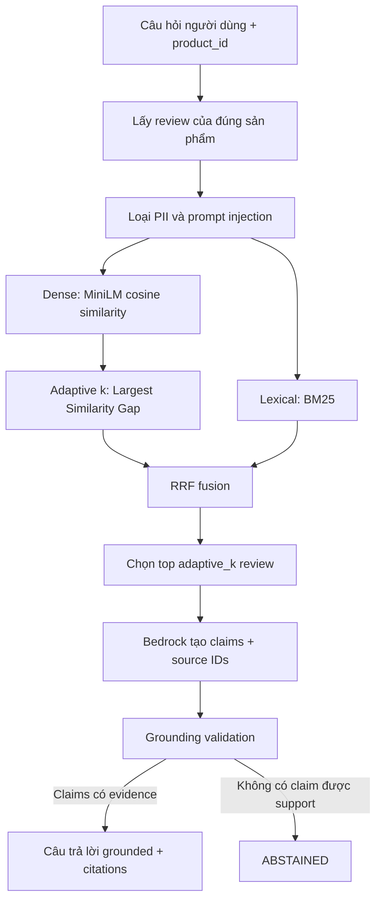
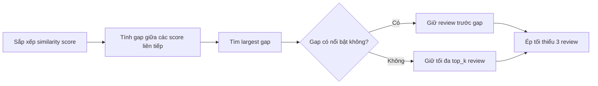
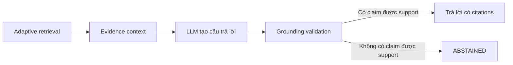

# Hybrid Retrieval and Dynamic k for Product Review Q&A

> Giải thích từ đầu cách Product Reviews chọn evidence cho AI.

## 1. Why Fixed `top_k` Fails

Trong RAG, `k` là số review được đưa vào context của LLM.

- `k` quá nhỏ: có thể bỏ sót evidence cần thiết.
- `k` quá lớn: đưa vào nhiều review không liên quan, làm context nhiễu, tăng chi phí và tăng khả năng LLM trả lời lạc đề.
- `k` cố định: không phản ánh việc mỗi câu hỏi có một mức độ tập trung khác nhau.

Ví dụ, câu hỏi "Tóm tắt review" cần góc nhìn rộng từ nhiều review. Ngược lại, câu hỏi "Pin có hao không?" có thể chỉ cần vài review liên quan trực tiếp. Vì vậy, Product Reviews dùng `top_k=5` làm trần, rồi chọn số evidence thực tế một cách thích nghi.

## 2. System Flow



`product_id` là ranh giới đầu tiên: hệ thống chỉ đọc review của sản phẩm đang xem. Sau đó review được sanitize trước khi dùng để retrieval hoặc gửi cho Bedrock.

## 3. What Is Hybrid Retrieval?

Hybrid retrieval kết hợp hai cách xếp hạng bổ sung cho nhau.

| Thành phần | Cách hoạt động | Điểm mạnh |
| --- | --- | --- |
| Dense retrieval | MiniLM biến câu hỏi và review thành vector, sau đó tính cosine similarity. | Hiểu gần đúng về nghĩa, kể cả khi không trùng từ. |
| BM25 | So khớp từ sau khi tokenization, lọc một số stop word và stemming tiếng Anh. | Tốt khi câu hỏi chứa từ khóa chính xác như `battery`, `age`, `return`. |
| RRF | Gộp thứ hạng từ Dense và BM25. | Không cần ép các score khác thang đo vào cùng một công thức. |

### Tokenization and Stemming

BM25 không dùng thư viện NLP nặng cho phần tokenization. Nó dùng regex để giữ từ, số, dấu nháy đơn và dấu gạch nối; sau đó dùng một stop-word set nhỏ có kiểm soát. Những từ phủ định như `not`, `no`, `without` được giữ lại vì chúng có thể đảo nghĩa review.

Stemming dùng `nltk==3.10.0` với `SnowballStemmer("english")`. Ví dụ `connect`, `connected`, `connecting` được quy về dạng gần nhau. Stemmer này không cần tải thêm NLTK corpus khi container chạy.

### Reciprocal Rank Fusion

Dense score và BM25 score có đơn vị khác nhau, nên không cộng trực tiếp. Thay vào đó, mỗi phương pháp đóng góp theo vị trí xếp hạng:

```text
RRF(review) = 1 / (60 + rank_dense) + 1 / (60 + rank_bm25)
```

Review đứng cao ở cả hai danh sách sẽ có tổng RRF cao. `60` là hằng số làm độ chênh giữa các thứ hạng ít cực đoan hơn.

## 4. Adaptive k via Largest Similarity Gap

Sau khi tính similarity giữa câu hỏi và từng review, hệ thống sắp xếp score theo thứ tự giảm dần rồi quan sát khoảng rơi giữa hai score liên tiếp.



Giả sử dense similarity đã sắp xếp là:

```text
0.91, 0.77, 0.24, 0.18, 0.15
```

Các gap là `0.14, 0.53, 0.06, 0.03`. Gap `0.53` lớn nhất và tách hai review đầu khỏi phần còn lại. Tuy nhiên, code hiện giữ tối thiểu 3 review để tránh context quá mỏng; kết quả là `k=3`, không phải `k=2`.

Nếu score khá phẳng, ví dụ `0.70, 0.69, 0.68, 0.67, 0.66`, không gap nào nổi bật. Khi đó hệ thống giữ toàn bộ tối đa `top_k=5` review. Đây thường là hành vi phù hợp với câu hỏi rộng như "Tóm tắt review".

### What Counts as a Significant Gap?

Không có một ngưỡng cố định như `gap > 0.2`. Với mỗi câu hỏi, code tính:

```text
dynamic_cutoff = mean(all_gaps) + standard_deviation(all_gaps)
```

Largest gap chỉ được dùng để cắt nếu nó lớn hơn `dynamic_cutoff`. Điều này làm tiêu chí tự điều chỉnh theo phân bố score của chính câu hỏi đó, thay vì hard-code theo keyword hoặc một cosine threshold dùng chung.

## 5. Implementation Pseudocode

```python
reviews = load_reviews(product_id, order_by="id")
safe_reviews = sanitize(reviews)

dense_scores = mini_lm_cosine(question, safe_reviews)
bm25_scores = bm25(question, safe_reviews)

selection_scores = dense_scores if dense_available else bm25_scores
adaptive_k = largest_similarity_gap(selection_scores, max_k=5, min_k=3)

rrf_scores = reciprocal_rank_fusion(dense_scores, bm25_scores)
selected_reviews = order_by(rrf_scores)[:adaptive_k]

answer = bedrock(question, selected_reviews)
return validate_grounding(answer, selected_reviews)
```

Trong code thực tế, nếu Dense hoặc BM25 lỗi, service vẫn dùng phương pháp còn lại và log rõ mode degraded (`bm25_only` hoặc `dense_only`). Chỉ khi cả hai lỗi, nó mới rơi về thứ tự input có giới hạn và log `unranked`.

## 6. Walkthrough: Two Question Types

Hãy xem cùng một sản phẩm có năm review, nhưng hai câu hỏi khác nhau.

### Example A: A broad question

Câu hỏi: **"Bạn hãy tóm tắt review của sản phẩm này."**

Đây là câu hỏi rộng. Dense similarity thường khá sát nhau vì đa số review đều có ích cho phần tóm tắt. Largest Similarity Gap không thấy một điểm rơi nổi bật, nên `adaptive_k` giữ tối đa năm review. RRF vẫn sắp xếp chúng để những review đại diện nhất đứng trước.

Kết quả mong muốn là một bản tóm tắt cân bằng: điểm tốt, điểm chưa tốt và citation đến các review đã dùng.

### Example B: A focused question

Câu hỏi: **"Pin của ứng dụng có hao không?"**

Nếu chỉ hai hoặc ba review nhắc đến pin, dense score của nhóm này có thể cao hơn hẳn các review còn lại. Largest Similarity Gap thu nhỏ context sau nhóm liên quan, nhưng `min_k=3` vẫn giữ ít nhất ba review. Điều này giúp AI có evidence tập trung mà không chỉ dựa vào một câu đơn lẻ.

Điểm quan trọng: `adaptive_k` không đoán intent bằng keyword. Nó chỉ nhìn vào phân bố similarity thực tế của câu hỏi và review.

## 7. Why Not Early-Abstain in Retrieval?

Retrieval không dùng relevance gate kiểu "cosine thấp thì trả rỗng". Một gate như vậy dễ làm hỏng câu hỏi rộng: câu "Tóm tắt review" có thể không giống hẳn từng review riêng lẻ, dù tất cả review vẫn là context hợp lệ.

Adaptive `k` giải quyết bài toán khác: nó giảm context khi ranking cho thấy có một cụm review liên quan rõ, nhưng không tự kết luận rằng người dùng phải nhận câu trả lời "không đủ thông tin". Quyết định abstain vẫn thuộc lớp grounding sau Bedrock: mỗi claim cần có source ID hợp lệ và được evidence support.



## 8. How to Read the Logs

Mỗi lần hỏi AI về review, log retrieval cho biết service đã thực sự dùng cách xếp hạng nào.

| Log field | Ý nghĩa | Cách diễn giải |
| --- | --- | --- |
| `retrieval_mode=dense+bm25` | Cả hai retriever đều chạy. | Đây là hybrid retrieval bình thường. |
| `adaptive_k=3` | Ba review được gửi làm evidence. | Có gap nổi bật hoặc số candidate chỉ có ba. |
| `adaptive_k=5` | Năm review được gửi làm evidence. | Score khá phẳng hoặc câu hỏi cần phạm vi rộng. |
| `retrieval_mode=bm25_only` | Dense lỗi, BM25 vẫn hoạt động. | Câu trả lời vẫn có thể chạy, nhưng semantic matching không còn. |
| `retrieval_mode=dense_only` | BM25 lỗi, Dense vẫn hoạt động. | Câu trả lời vẫn có thể chạy, nhưng exact keyword matching không còn. |
| `retrieval_mode=unranked` | Cả Dense và BM25 đều lỗi. | Đây là fallback khẩn cấp; cần kiểm tra lỗi dịch vụ. |

`adaptive_k` nói về **số lượng** evidence. `RRF` nói về **thứ tự** evidence. Đây là hai quyết định độc lập nhưng bổ sung cho nhau.

## 9. Try It Yourself

1. Mở trang chi tiết của một sản phẩm có review.
2. Hỏi: **"Bạn hãy tóm tắt review của sản phẩm này."**
3. Kiểm tra câu trả lời có citation `[1]`, `[2]`... và các citation này trỏ đến review hiển thị bên dưới.
4. Hỏi tiếp một câu cụ thể, ví dụ: **"Có review nào nói pin hao không?"** hoặc **"Sản phẩm này phù hợp cho người mới không?"**
5. Xem log của service `product-reviews`; so sánh `adaptive_k` và `retrieval_mode` giữa hai lần hỏi.

Bạn không nên kỳ vọng câu hỏi cụ thể luôn có `adaptive_k=3`. Nếu tất cả review đều liên quan gần như nhau, giữ năm review là kết quả hợp lý. Adaptive `k` phản ứng với dữ liệu, không ép kết quả theo loại câu hỏi.

## 10. Key Takeaways

- Dense score là cosine similarity giữa embedding câu hỏi và embedding review.
- BM25 bổ sung cho Dense bằng khả năng bắt từ khóa chính xác.
- RRF gộp hai bảng xếp hạng mà không cần chuẩn hóa score của chúng về cùng thang đo.
- Largest Similarity Gap chọn số review theo dữ liệu của từng câu hỏi, thay vì luôn gửi cố định năm review.
- `min_k=3` là hàng rào an toàn cho PoC: context có thể thu nhỏ, nhưng không được quá mỏng.
- Grounding validation mới là nơi quyết định có đủ evidence để trả lời hay phải `ABSTAINED`.

## Further Reading

- Taguchi, Maekawa, Bhutani. [Efficient Context Selection for Long-Context QA: No Tuning, No Iteration, Just Adaptive-k](https://arxiv.org/abs/2506.08479), EMNLP 2025. Paper là nguồn cảm hứng cho ý tưởng largest similarity gap; implementation ở đây được rút gọn cho tối đa năm product review.
