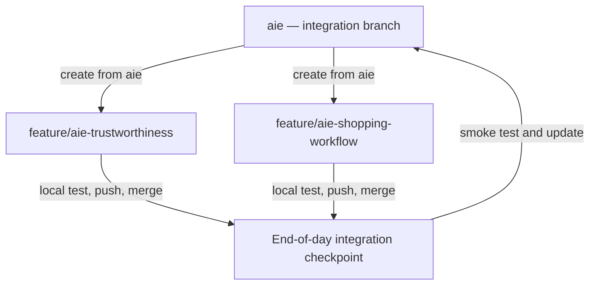
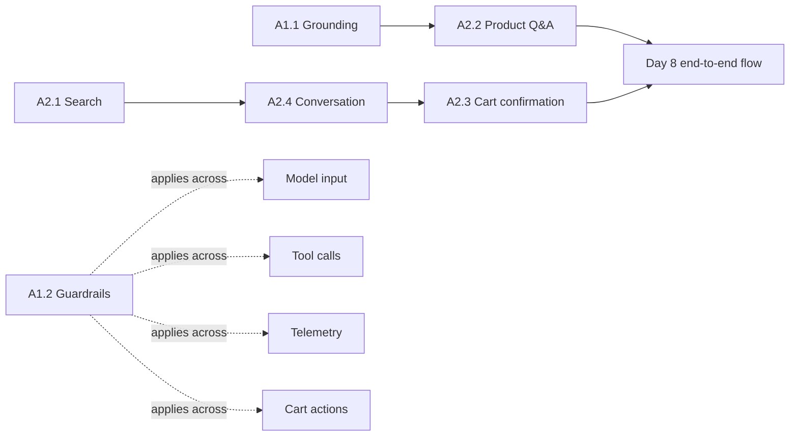

# Eight-Day AI Shopping Experience Implementation Plan

> Owner: AI Engineering. Kế hoạch này triển khai các backlog trong [AI Shopping Experience Backlog](./ai-shopping-experience-backlog.md) theo hướng dẫn tại [Implementation Guide](./implementation-guide.md).

## Sprint summary

- **Mục tiêu:** xây dựng nền tảng AI đáng tin cậy và shopping workflow có thể tìm sản phẩm, trả lời dựa trên review, duy trì ngữ cảnh hội thoại và chỉ thêm sản phẩm vào giỏ sau khi người dùng xác nhận.
- **Thời lượng:** 8 ngày làm việc.
- **Nhân sự:** 2 AI Engineers.
- **Năng lực kế hoạch:** 16 person-days, giả định cả hai thành viên làm việc đầy đủ và không có nhiệm vụ ngoài kế hoạch.
- **Phạm vi mỗi người:** lập trình, kiểm thử local, kiểm tra giao diện liên quan và sửa lỗi cho backlog được giao.
- **Nhịp tích hợp:** merge tăng dần vào integration branch tại các checkpoint cuối ngày; không chờ đến Day 8 mới tích hợp toàn bộ.
- **Buffer:** Day 8 ưu tiên end-to-end stabilization. Cache của A1.3 và execution limits nâng cao chỉ là stretch goals sau khi luồng chính ổn định.

## Definition of Done

Một hạng mục được xem là sẵn sàng để merge tại checkpoint khi:

- Code của hạng mục đã hoàn thành trong phạm vi cam kết của ngày.
- Local test và các repro cases liên quan đã pass.
- API, gRPC hoặc giao diện liên quan đã được kiểm tra.
- Thay đổi shared contract đã được người còn lại review.
- Không commit secret, raw PII hoặc nội dung nhạy cảm vào code, log hay test fixture.
- Feature branch đã được push và integration branch vẫn build, khởi động và vượt qua smoke test sau merge.

## Daily implementation plan

| No. | Person 1: AI Trustworthiness | Person 2: Shopping Workflow |
| ---: | --- | --- |
| 1 | **Day 1, Shared Design:** Xác định cấu trúc câu trả lời có dẫn nguồn, quy tắc kiểm chứng nội dung và điều kiện từ chối trả lời khi thiếu bằng chứng. Thống nhất cách xử lý nội dung đánh giá như dữ liệu không đáng tin cậy. | **Day 1, Shared Design:** Xác định cấu trúc kết quả tìm kiếm, mã hội thoại, danh sách sản phẩm được nhắc tới và hành động chờ xác nhận. Hai người thống nhất thay đổi giao diện kết nối trước khi lập trình. |
| 2 | **Day 2, Input Protection:** Thực hiện A1.2. Phân biệt nội dung đánh giá với chỉ dẫn cho mô hình. Giới hạn công cụ được phép gọi, kiểm tra mã sản phẩm và che dữ liệu cá nhân trong nhật ký hệ thống. Tự kiểm thử và kiểm tra giao diện liên quan. | **Day 2, Product Search:** Bắt đầu A2.1. Kết nối dịch vụ danh mục sản phẩm. Chuyển yêu cầu của người dùng thành từ khóa, mức giá và đặc tính sản phẩm. Bắt đầu lọc kết quả bằng mã chương trình. |
| 3 | **Day 3, Grounding Foundation:** Bắt đầu A1.1. Gắn mã nguồn cho từng đánh giá. Yêu cầu mô hình trả kết quả theo cấu trúc xác định. Xây dựng bộ kiểm tra liên kết giữa nhận định và nguồn dẫn chứng. | **Day 3, Product Search Completion:** Hoàn thành A2.1. Thực hiện lọc theo giá, xếp hạng kết quả và xử lý trường hợp không tìm thấy sản phẩm. Hoàn thành kiểm thử và kiểm tra giao diện tìm kiếm. |
| 4 | **Day 4, Grounded Response:** Hoàn thành A1.1. Chỉ trả về nhận định có nguồn hợp lệ. Sử dụng câu trả lời thay thế khi đánh giá không có đủ thông tin. Hoàn thành hiển thị nguồn và kiểm thử luồng liên quan. | **Day 4, Conversation State:** Bắt đầu phần conversation state của A2.4 sau khi A2.1 ổn định. Lưu trạng thái hội thoại có thời hạn, tách biệt dữ liệu giữa người dùng và lưu thứ tự sản phẩm từ kết quả tìm kiếm. |
| 5 | **Day 5, Product Question Answering:** Bắt đầu A2.2 sau khi A1.1 hoàn thành. Tái sử dụng cơ chế kiểm chứng để trả lời câu hỏi về một sản phẩm cụ thể. Câu trả lời cần có nguồn hợp lệ hoặc thông báo thiếu bằng chứng. | **Day 5, Reference Resolution:** Tiếp tục phần reference resolution của A2.4. Xử lý các tham chiếu như sản phẩm đầu tiên và sản phẩm thứ hai. Trong thời gian chờ A2.2, thực hiện giới hạn thời gian gọi mô hình và số liệu theo dõi lỗi. |
| 6 | **Day 6, Conversation Integration:** Kết nối A2.2 với bộ xử lý tham chiếu của A2.4. Kiểm thử câu hỏi liên quan đến sản phẩm trong lượt hội thoại trước và trường hợp đánh giá không cung cấp thông tin. | **Day 6, Cart Action Foundation:** Hoàn thành phần conversation state và reference resolution của A2.4. Sau khi trạng thái hội thoại hoạt động, bắt đầu A2.3 bằng việc xây dựng hành động chờ và mã xác nhận cho thao tác thêm vào giỏ hàng. |
| 7 | **Day 7, AI Validation:** Kiểm thử A1.1, A1.2 và A2.2. Bao gồm chỉ dẫn độc hại, dữ liệu cá nhân, nguồn không hợp lệ, thiếu bằng chứng, lỗi mô hình và phản hồi chậm. Sửa lỗi trong phạm vi phụ trách. | **Day 7, Cart Confirmation:** Hoàn thành A2.3. Xử lý xác nhận, từ chối, mã hết hạn và mã đã được sử dụng. Kiểm tra hệ thống không thay đổi giỏ hàng trước khi nhận xác nhận hợp lệ. |
| 8 | **Day 8, Integration Stabilization:** Sửa lỗi khi kết hợp hỏi đáp, nguồn dẫn chứng và trạng thái hội thoại. Nếu các hạng mục chính đã đạt yêu cầu, thực hiện phần lưu tạm câu trả lời đã được kiểm chứng của A1.3. | **Day 8, Workflow Stabilization:** Sửa lỗi khi kết hợp tìm kiếm, hội thoại và giỏ hàng. Nếu các hạng mục chính đã đạt yêu cầu, bổ sung giới hạn số bước xử lý và số lần gọi công cụ. |

## Integration checkpoints

Các checkpoint được thực hiện vào cuối ngày, sau khi mỗi người hoàn thành code dự kiến, chạy local test và push feature branch.

### Branch workflow

`aie` là integration branch của AI Engineering. Hai feature branch được tạo từ cùng một commit ổn định của `aie`:

- `feature/aie-trustworthiness`: nhánh của Person 1 cho A1.1, A1.2 và A2.2.
- `feature/aie-shopping-workflow`: nhánh của Person 2 cho A2.1, A2.3 và phần conversation state/reference resolution của A2.4.

Sau mỗi checkpoint, hai feature branch cập nhật lại từ `aie` trước khi tiếp tục phát triển.

| Ngày | Integration checkpoint |
| ---: | --- |
| 1 | Merge shared contract. |
| 3 | Merge guardrails, structured-response foundation và product search. |
| 5 | Merge grounding, conversation references và Q&A foundation. |
| 6 | Verify integration giữa product Q&A và reference resolution. |
| 7 | Merge cart confirmation và AI validation fixes. |
| 8 | End-to-end stabilization. |

Quy trình tại mỗi checkpoint:

1. Hoàn thành code và local test trên feature branch.
2. Push feature branch và review nhanh các thay đổi shared contract.
3. Merge vào integration branch.
4. Chạy smoke test cho các luồng vừa tích hợp.
5. Nếu smoke test không đạt, giữ integration branch tại commit ổn định gần nhất và sửa lỗi trên feature branch.

## Dependency and critical path

- Shared contract của Day 1 là điều kiện để hai workstream phát triển song song.
- A2.2 tái sử dụng grounding, citation và abstention của A1.1.
- Phần conversation state và reference resolution của A2.4 cần kết quả tìm kiếm thật từ A2.1; bounded orchestration đầy đủ chỉ hoàn thiện sau khi A2.2 và A2.3 ổn định.
- A2.3 chỉ bắt đầu sau khi conversation state và reference resolution hoạt động.
- Cart write chỉ được thực hiện sau khi backend xác minh confirmation hợp lệ.

## Key risks and mitigations

| Rủi ro | Ảnh hưởng | Giảm thiểu |
| --- | --- | --- |
| Shared contract thay đổi muộn | Hai nhánh không tương thích hoặc phát sinh nhiều conflict | Chốt schema và example payload trong Day 1; mọi thay đổi sau đó cần review chéo. |
| Cả hai người cùng sửa proto, generated stubs hoặc orchestration entry point | Merge conflict tại checkpoint | Chỉ định owner cho từng shared file và merge thay đổi contract theo một commit riêng. |
| Dependency của người còn lại chưa có trên feature branch | Không thể local-test luồng phụ thuộc | Dùng interface, fixture, stub hoặc mock tuân theo shared contract. |
| Product search hoặc cart/session integration phức tạp hơn dự kiến | Chặn critical path của A2.4/A2.3 | Thực hiện spike kết nối ngay Day 1 và báo blocker trước khi bắt đầu implementation chính. |
| Stretch goals làm mất thời gian ổn định | Luồng chính chưa đạt end-to-end | Day 8 ưu tiên regression và stabilization; chỉ triển khai stretch goal sau khi smoke test chính pass. |

## Day 8 success criteria

Kế hoạch đạt mục tiêu khi integration branch chứng minh được các luồng sau:

1. Người dùng tìm sản phẩm bằng yêu cầu ngôn ngữ tự nhiên và chỉ nhận product ID có thật từ catalog.
2. Người dùng hỏi về một sản phẩm đã được nhắc tới; hệ thống resolve đúng product ID và trả câu trả lời có nguồn hợp lệ hoặc abstain.
3. Nội dung độc hại, tool argument ngoài phạm vi và raw PII bị chặn hoặc xử lý an toàn.
4. Yêu cầu thêm sản phẩm vào giỏ chỉ tạo pending action; cart không thay đổi trước confirmation hợp lệ.
5. Confirmation hợp lệ chỉ tạo một lần ghi; từ chối, token hết hạn và replay không thay đổi cart.
