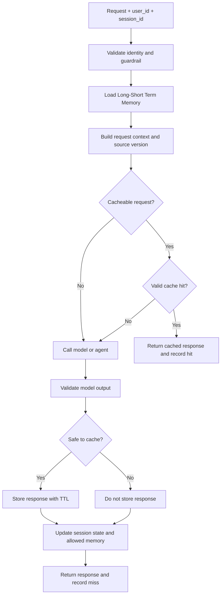
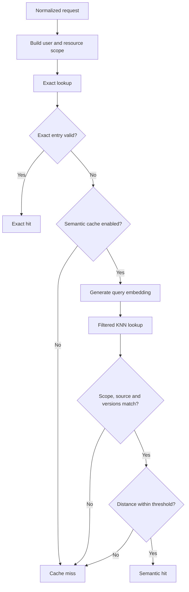
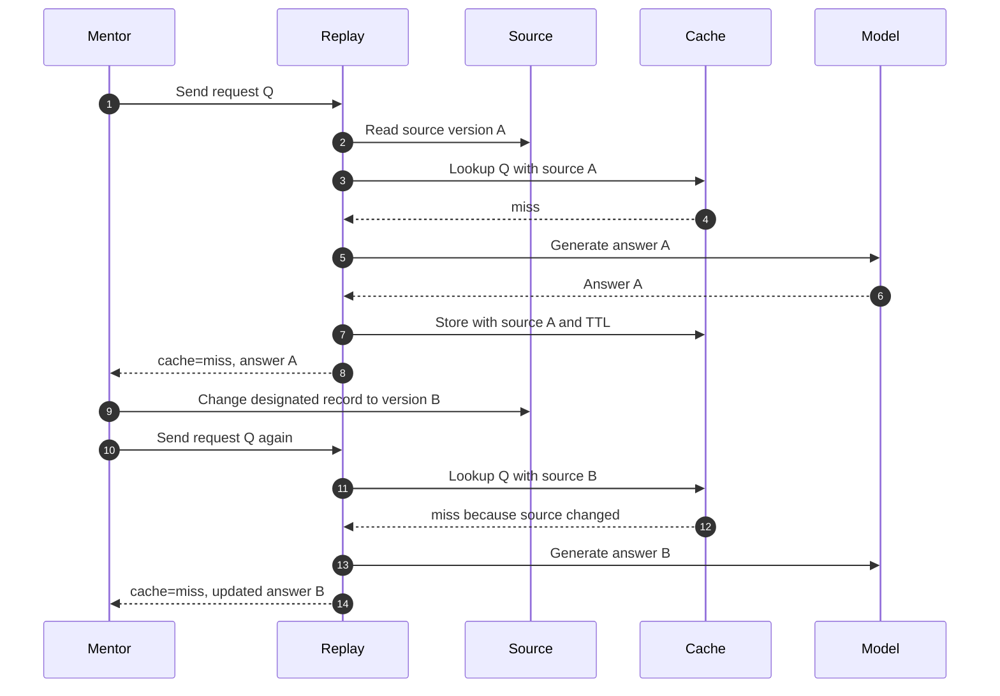
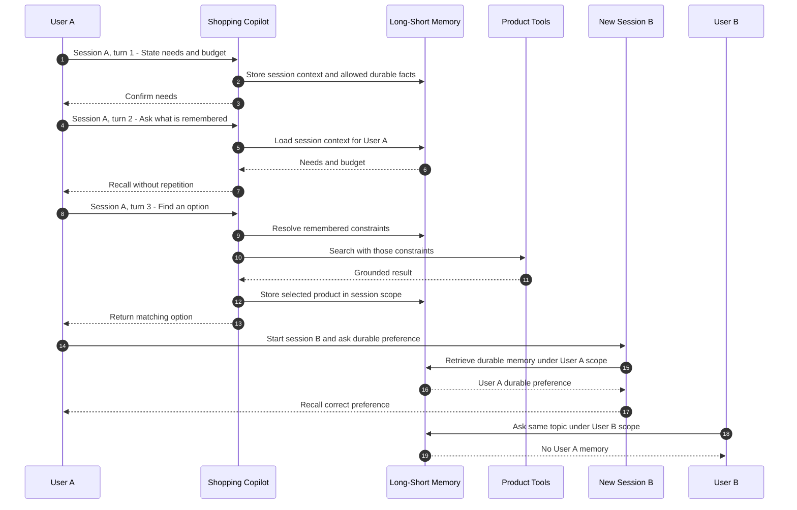

# Mandate #23 GenAI Caching and Memory Report

> **Status:** Draft evidence template. Chỉ đổi trạng thái sang `PASS` sau khi đã
> chạy replay và có artifact chứng minh.
>
> **Source directive:** [MANDATE-23-genai-caching-memory.md](./MANDATE-23-genai-caching-memory.md)

## Executive Summary

Mandate #23 yêu cầu tầng AI:

1. không gọi lại model cho request lặp nếu có thể phục vụ an toàn từ cache;
2. cung cấp Long-Short Term Memory: vừa giữ ngữ cảnh qua ít nhất ba lượt trong
   cùng session, vừa nhớ thông tin bền qua session mới của cùng user;
3. không làm rò cache hoặc memory sang user khác;
4. chứng minh lợi ích bằng hit-rate, latency và cost đo từ lần chạy thật.

Implementation được áp dụng trên `[TODO: Review Summary, Shopping Copilot hoặc cả hai]`.
Replay set gồm `[TODO: số request]` request và `[TODO: số request lặp]` request lặp.
Kết quả cache-enabled đạt hit-rate `[TODO: %]`, thay đổi p95 latency từ
`[TODO: baseline]` thành `[TODO: cache-enabled]`, và thay đổi chi phí từ
`[TODO: baseline]` thành `[TODO: cache-enabled]`.

Long-Short Term Memory đã được kiểm tra bằng `[TODO: số lượt, tối thiểu 3]` lượt
phụ thuộc ngữ cảnh trong cùng session, sau đó lưu `[TODO: loại thông tin bền]`
ở session A và truy hồi ở session B của cùng user. Cross-user test dùng một user
khác và phải không truy hồi được dữ liệu đó.

### Completion Snapshot

| DoD | Status | Evidence |
|---|---|---|
| Cache thật trên ít nhất một AI surface | `TODO` | `[TODO: replay result]` |
| Có hit-rate, latency và cost trước/sau | `TODO` | `[TODO: metrics table]` |
| Source đổi làm cache miss và trả dữ liệu mới | `TODO` | `[TODO: invalidation replay]` |
| Long-Short Term Memory giữ context ≥3 lượt và truy hồi qua session mới | `TODO` | `[TODO: combined memory replay]` |
| User khác không thấy cache hoặc memory của user trước | `TODO` | `[TODO: isolation replay]` |
| ADR đã ký | `TODO` | `[TODO: ADR link]` |

---

## Problem and Objective

Nếu không có cache, mỗi request lặp vẫn gọi model, làm tăng latency, token usage
và cost. Nếu không có memory, Copilot không thể hiểu các câu tham chiếu như
“sản phẩm này” trong cùng session và quên sở thích người dùng khi session thay đổi.

Mục tiêu của implementation:

- request giống nhau tạo cache hit thật và không gọi model lần hai;
- cache có TTL và không trả dữ liệu cũ sau khi source thay đổi;
- cache và memory được cô lập theo user;
- Long-Short Term Memory giúp Copilot vừa hiểu ít nhất ba lượt phụ thuộc ngữ
  cảnh trong cùng session, vừa truy hồi thông tin bền ở session mới của cùng user;
- PII không bị lưu hoặc trả ra ngoài policy;
- mentor có thể chạy toàn bộ acceptance cases qua một replay entry point.

---

## Scope

| Surface | Cache | Long-Short Term Memory |
|---|---|---|
| Review Summary | `[TODO: in/out]` | N/A |
| Shopping Copilot | `[TODO: in/out]` | `[TODO: in/out]` |

Minimum scope để đạt Mandate:

- cache thật trên ít nhất một AI surface;
- Long-Short Term Memory hoạt động cả trong session và xuyên session trên Copilot;
- cache và memory đều có user isolation;
- có replay và số đo thật.

### Identity Boundaries

| Identifier | Vai trò | Yêu cầu |
|---|---|---|
| `user_id` | Ranh giới dữ liệu giữa người dùng | Không dùng raw value trong metric label; cache nên dùng HMAC scope |
| `session_id` | Ranh giới context trong session | Session khác chỉ được truy hồi durable memory, không nhận ephemeral state |
| `request` | Nội dung đầu vào cho cache lookup | Chuẩn hóa nhất quán trước khi hash/embed |
| Resource scope | Product, catalog hoặc review scope | Không reuse kết quả giữa các resource không tương thích |
| Source version/hash | Phiên bản dữ liệu nguồn | Thay đổi source phải làm entry cũ không còn hợp lệ |

### Out of Scope

- `[TODO: surface chưa triển khai]`;
- `[TODO: loại memory không được phép lưu]`;
- `[TODO: giới hạn của semantic cache nếu chưa triển khai]`;
- `[TODO: giới hạn khác]`.

---

## Architecture and Request Flows

### End-to-End Request Flow



| Component | Responsibility | Failure behavior |
|---|---|---|
| Cache adapter | Lookup, store, TTL và invalidation boundary | `[TODO: fail-open behavior]` |
| Long-Short Term Memory layer | Quản lý session context và durable facts theo user | `[TODO: unavailable behavior]` |
| PII/memory policy | Cho phép, sanitize hoặc từ chối memory | Không được bypass privacy boundary |
| Metrics | Ghi hit/miss, latency, calls, tokens và errors | Không làm request chính thất bại |

---

## Cache Design

### Cache Scope and Key

| Field | Giá trị implementation | Mục đích |
|---|---|---|
| User scope | `[TODO: HMAC hoặc phương án tương đương]` | Ngăn cross-user cache hit |
| Request hash | `[TODO: thuật toán và normalization]` | Exact lookup |
| Resource scope | `[TODO: product/catalog/review key]` | Ngăn reuse sai resource |
| Source version/hash | `[TODO: cách tính]` | Invalidation khi source đổi |
| Prompt version | `[TODO]` | Không reuse output từ prompt cũ |
| Model version | `[TODO]` | Không reuse output không tương thích |
| Embedding version | `[TODO hoặc N/A]` | Cô lập semantic index |

Mandate chỉ bắt buộc exact và/hoặc semantic cache. Nếu semantic cache không được
triển khai, ghi rõ `N/A` thay vì mô tả một KNN flow không tồn tại.

### Lookup Flow



### Cacheability and TTL

| Response type | Cache? | Reason |
|---|---|---|
| Successful grounded response | yes | Có thể reuse trong đúng scope |
| Blocked response | no | Không persist guardrail outcome |
| Fallback response | no | Provider failure có thể chỉ là tạm thời |
| Rate-limited response | no | Không persist throttling state |
| Abstained response | no | Tránh lưu response thiếu evidence |
| Cart mutation hoặc pending action | no | Không replay action state |

| Entry type | TTL | Configuration source | Evidence |
|---|---:|---|---|
| AI response cache | `[TODO: seconds]` | `[TODO: env/config]` | `[TODO: TTL command or test]` |
| Long-Short memory — session scope | `[TODO: seconds]` | `[TODO: env/config]` | `[TODO]` |
| Long-Short memory — durable user scope | `[TODO: retention policy]` | `[TODO: config/policy]` | `[TODO]` |

### Source Invalidation



Mentor-editable source record:

| Field | Value |
|---|---|
| Service/store | `[TODO]` |
| Record ID | `[TODO: exact stable ID]` |
| Safe field to edit | `[TODO]` |
| Original value | `[TODO]` |
| Test value | `[TODO]` |
| Edit command/API | `[TODO]` |
| Restore command/API | `[TODO]` |

> 📷 **IMAGE REQUIRED — Cache hit:** chụp hai request giống nhau, lần đầu
> `cache=miss`, lần hai `cache=hit`, kèm bằng chứng model call không tăng.
>
> Tên file đề xuất: `01-cache-hit.png`.

> 📷 **IMAGE REQUIRED — Source invalidation:** chụp source trước/sau và replay
> sau khi đổi source trả `cache=miss` cùng dữ liệu mới.
>
> Tên file đề xuất: `02-source-invalidation.png`.

---

## Long-Short Term Memory

Long-Short Term Memory là một lớp memory thống nhất nhưng có hai scope dữ liệu:

| Scope | Identity boundary | Nội dung | Vòng đời |
|---|---|---|---|
| Session context | `user_id + session_id` | Nhu cầu hiện tại, product vừa hiển thị, tham chiếu pending | TTL hoặc giới hạn số turn |
| Durable user memory | `user_id` | Sở thích hoặc constraint bền đã qua policy | Retention/deletion policy |

Session mới không được nhận ephemeral state như “sản phẩm này”, nhưng có thể truy
hồi durable facts của cùng user. Memory chỉ lưu dữ liệu cần thiết, không lưu toàn
bộ prompt hoặc PII ngoài policy. Nội dung truy hồi được xem là untrusted data,
không phải system instruction.

### Unified Memory Flow



| Case | User | Session | Expected | Actual |
|---|---|---|---|---|
| Context turn 1 | User A | A | Store needs and budget | `[TODO]` |
| Context turn 2 | User A | A | Recall turn 1 without repetition | `[TODO]` |
| Context turn 3 | User A | A | Apply prior constraints to search | `[TODO]` |
| Cross-session recall | User A | B | Recall allowed durable fact from session A | `[TODO]` |
| Ephemeral isolation | User A | B | Không tự động nhận selected product của session A | `[TODO]` |
| Cross-user isolation | User B | C | Không nhận memory của User A | `[TODO]` |
| PII boundary | User A | D | Reject hoặc sanitize theo policy | `[TODO]` |

> 📷 **IMAGE REQUIRED — Long-Short Term Memory:** chụp một evidence sequence gồm
> ít nhất ba lượt trong session A và một lượt ở session B mới của cùng user.
>
> Tên file đề xuất: `03-long-short-term-memory.png`.

> 📷 **IMAGE REQUIRED — Cross-user isolation:** chụp user B không truy hồi được
> cache hoặc memory của user A.
>
> Tên file đề xuất: `04-cross-user-isolation.png`.

---

## Replay Contract

Replay entry point phải nhận dữ liệu từ bên ngoài, không hardcode test case.

Input:

```json
{
  "request": "Find an option for me",
  "user_id": "mentor-user-a",
  "session_id": "mentor-session-a"
}
```

Output tối thiểu:

```json
{
  "answer": "[response]",
  "cache": "hit",
  "cache_match": "exact",
  "model_calls": 0,
  "latency_ms": 12.4
}
```

`cache_match` là optional và có thể nhận `exact`, `semantic` hoặc `none`.
Trường bắt buộc theo directive là `cache: hit|miss`.

### Mandatory Replay Cases

| Case | Input variation | Expected |
|---|---|---|
| Cold request | Request mới | `cache=miss`, model gọi một lần |
| Exact repeat | Cùng request, user, scope và source | `cache=hit`, model calls không tăng |
| Source change | Cùng request sau khi sửa source | `cache=miss`, trả dữ liệu mới |
| Different user | User B gửi cùng request | Không dùng cache/memory của user A |
| Long-Short Term Memory | Ít nhất 3 turn ở session A, sau đó session B cùng user | Giữ context trong session và nhớ durable fact xuyên session |

---

## Measurement and Results

Hai profile phải chạy trên cùng dataset, model configuration và source snapshot.
Baseline tắt cache; cache-enabled bật cache. Không seed trước cache cho profile
cache-enabled.

### Dataset

| Property | Value |
|---|---:|
| Total requests | `[TODO]` |
| Unique requests | `[TODO]` |
| Exact repeats | `[TODO]` |
| Semantic paraphrases | `[TODO hoặc N/A]` |
| Users | `[TODO]` |
| Sessions | `[TODO]` |
| Runs per profile | `[TODO]` |

### Cache Baseline vs Cache-Enabled

| Metric | Baseline | Cache-enabled | Change |
|---|---:|---:|---:|
| Requests | `[TODO]` | `[TODO]` | — |
| Cache hits | 0 | `[TODO]` | `[TODO]` |
| Hit-rate | 0% | `[TODO: %]` | `[TODO: pp]` |
| Model calls | `[TODO]` | `[TODO]` | `[TODO]` |
| Input tokens | `[TODO]` | `[TODO]` | `[TODO]` |
| Output tokens | `[TODO]` | `[TODO]` | `[TODO]` |
| Total model cost | `[TODO]` | `[TODO]` | `[TODO]` |
| Average latency | `[TODO]` | `[TODO]` | `[TODO]` |
| p95 latency | `[TODO]` | `[TODO]` | `[TODO]` |

Cost formula:

```text
cost =
  input_tokens  / 1,000,000 * input_price_per_million
  + output_tokens / 1,000,000 * output_price_per_million
```

| Model/provider | Input price | Output price | Source | Checked date |
|---|---:|---:|---|---|
| `[TODO]` | `[TODO]` | `[TODO]` | `[TODO: official pricing link]` | `[TODO: date]` |

### Correctness Results

| Case | Expected | Actual | Status |
|---|---|---|---|
| Exact repeat | hit, no second model call | `[TODO]` | `TODO` |
| Semantic paraphrase, if implemented | semantic hit in valid scope | `[TODO]` | `TODO/N/A` |
| Different resource | miss | `[TODO]` | `TODO` |
| Different user | no cross-user hit | `[TODO]` | `TODO` |
| Source changed | miss and updated answer | `[TODO]` | `TODO` |
| TTL expired | miss | `[TODO]` | `TODO` |
| Cache unavailable | AI surface remains available | `[TODO]` | `TODO` |

> 📷 **IMAGE REQUIRED — Aggregate metrics:** chụp hoặc export dashboard/table
> thể hiện hit-rate, latency, model calls, token usage và cost trước/sau.
>
> Tên file đề xuất: `05-cache-metrics.png`.

---

## Safety Hard Bars

Các điều kiện sau phải có giá trị bằng 0:

| Violation | Required | Actual | Evidence |
|---|---:|---:|---|
| Fake hoặc hardcoded cache hit | 0 | `[TODO]` | `[TODO]` |
| Cross-user cache hit | 0 | `[TODO]` | `[TODO]` |
| Cross-user memory leak | 0 | `[TODO]` | `[TODO]` |
| PII lưu ngoài policy | 0 | `[TODO]` | `[TODO]` |
| Stale response sau source change | 0 | `[TODO]` | `[TODO]` |
| Cache entry không có TTL | 0 | `[TODO]` | `[TODO]` |

Một run không được đánh dấu đạt nếu bất kỳ hard bar nào bị vi phạm, kể cả khi
hit-rate hoặc latency đạt mục tiêu.

---

## Observability

| Metric | Type | Mục đích |
|---|---|---|
| `[TODO: cache requests metric]` | Counter | Cache hit, miss, error và bypass |
| `[TODO: cache lookup latency metric]` | Histogram | Lookup latency |
| `[TODO: model calls metric]` | Counter | Model calls tránh được nhờ cache |
| `[TODO: input tokens metric]` | Counter | Input token usage |
| `[TODO: output tokens metric]` | Counter | Output token usage |
| `[TODO: memory reads metric]` | Counter | Memory retrieval success/error |
| `[TODO: memory writes metric]` | Counter | Memory accepted/rejected |

Không dùng raw `user_id`, `session_id`, prompt hoặc memory content làm metric
label. Logs/traces cần correlation ID nhưng phải redact PII.

---

## DoD Verification Matrix

| DoD | Acceptance criteria | Evidence | Status |
|---|---|---|---|
| Real cache | Request lặp lần hai hit thật và model calls không tăng | `[TODO]` | `TODO` |
| Measured benefit | Có hit-rate, latency và cost trước/sau từ run thật | `[TODO]` | `TODO` |
| TTL/invalidation | Entry có TTL; source đổi làm miss và trả dữ liệu mới | `[TODO]` | `TODO` |
| Cache isolation | User B không dùng cache của user A | `[TODO]` | `TODO` |
| Long-Short Term Memory | Ít nhất 3 turn trong session A và durable fact được truy hồi ở session B cùng user | `[TODO]` | `TODO` |
| Memory isolation | User B không thấy fact của user A | `[TODO]` | `TODO` |
| PII policy | PII được reject/sanitize và không rò | `[TODO]` | `TODO` |
| Signed ADR | Có owner, reviewer, decision date và Accepted status | `[TODO]` | `TODO` |

---

## ADR: Caching and Memory Decisions

- **ADR ID:** `[TODO]`
- **Status:** `[TODO: Proposed/Accepted]`
- **Design owner:** `[TODO]`
- **Reviewers:** `[TODO]`
- **Decision date:** `[TODO]`
- **Scope:** `[TODO]`

| Decision | Choice | Rationale | Consequence |
|---|---|---|---|
| Cache technology | `[TODO]` | `[TODO]` | `[TODO]` |
| Exact/semantic strategy | `[TODO]` | `[TODO]` | `[TODO]` |
| User isolation | `[TODO]` | `[TODO]` | `[TODO]` |
| Source invalidation | `[TODO]` | `[TODO]` | `[TODO]` |
| TTL policy | `[TODO]` | `[TODO]` | `[TODO]` |
| Long-Short Term Memory architecture | `[TODO: unified API with session and durable scopes]` | `[TODO]` | `[TODO]` |
| PII handling | `[TODO]` | `[TODO]` | `[TODO]` |
| Cache/memory failure | `[TODO]` | `[TODO]` | `[TODO]` |

### Sign-off

| Role | Name | Decision | Date |
|---|---|---|---|
| Design owner | `[TODO]` | `[TODO]` | `[TODO]` |
| Reviewer | `[TODO]` | `[TODO]` | `[TODO]` |
| Privacy/security reviewer | `[TODO]` | `[TODO]` | `[TODO]` |

---

## Reproduction and Evidence

### Preconditions

- Commit: `[TODO: SHA]`
- Branch/PR: `[TODO]`
- Environment: `[TODO: local/staging]`
- Model/provider: `[TODO]`
- Cache configuration: `[TODO]`
- Memory configuration: `[TODO]`
- Designated mutable source record: `[TODO]`

### Commands

Baseline:

```bash
# TODO: command that runs replay with cache disabled
```

Cache-enabled:

```bash
# TODO: command that runs the same replay set with cache enabled
```

Source invalidation:

```bash
# TODO: command that edits the designated source, replays, and restores it
```

Long-Short Term Memory:

```bash
# TODO: one command for at least three turns in session A,
# a new session B for the same user, and a different user
```

### Evidence Inventory

| Artifact | Requirement | Path/link | Ready |
|---|---|---|---|
| Implementation PR/commit | Cache và memory code | `[TODO]` | `[ ]` |
| Replay entry point | Nhận request, user và session từ ngoài | `[TODO]` | `[ ]` |
| Cache hit replay | Miss rồi hit, không gọi model lần hai | `[TODO]` | `[ ]` |
| Source invalidation replay | Source đổi làm miss và trả dữ liệu mới | `[TODO]` | `[ ]` |
| Metrics comparison | Hit-rate, latency và cost trước/sau | `[TODO]` | `[ ]` |
| Long-Short Term Memory replay | Ít nhất 3 lượt trong session A rồi truy hồi ở session B | `[TODO]` | `[ ]` |
| Cross-user replay | Không rò cache/memory | `[TODO]` | `[ ]` |
| PII evidence | Reject/sanitize theo policy | `[TODO]` | `[ ]` |
| Signed ADR | Accepted và có chữ ký/người duyệt | `[TODO]` | `[ ]` |

### Image Checklist

| File đề xuất | Nội dung cần chụp | Đã bổ sung |
|---|---|---|
| `01-cache-hit.png` | Request đầu miss, request lặp hit và model calls không tăng | `[ ]` |
| `02-source-invalidation.png` | Source đổi làm miss và trả dữ liệu mới | `[ ]` |
| `03-long-short-term-memory.png` | Ba lượt trong session A và recall ở session B | `[ ]` |
| `04-cross-user-isolation.png` | User B không thấy cache hoặc memory của user A | `[ ]` |
| `05-cache-metrics.png` | Hit-rate, latency, model calls, tokens và cost | `[ ]` |

---

## Limitations and Follow-up

- `[TODO: surface chưa phủ]`;
- `[TODO: semantic cache limitation hoặc N/A]`;
- `[TODO: invalidation limitation]`;
- `[TODO: retention/deletion limitation của Long-Short Term Memory]`;
- `[TODO: follow-up ticket, owner và target date]`.

---

## Evidence Links

- Implementation PR: `[TODO]`
- Commit: `[TODO]`
- Replay script: `[TODO]`
- Replay results: `[TODO]`
- Metrics summary: `[TODO]`
- Image folder: `[TODO]`
- ADR: `[TODO]`
- Jira ticket `AI MANDATE #23`: `[TODO]`

---

## Ownership

- **Caching implementation:** `[TODO]`
- **Long-Short Term Memory:** `[TODO]`
- **Replay and measurements:** `[TODO]`
- **Evidence review:** `[TODO]`
- **Final sign-off date:** `[TODO]`
