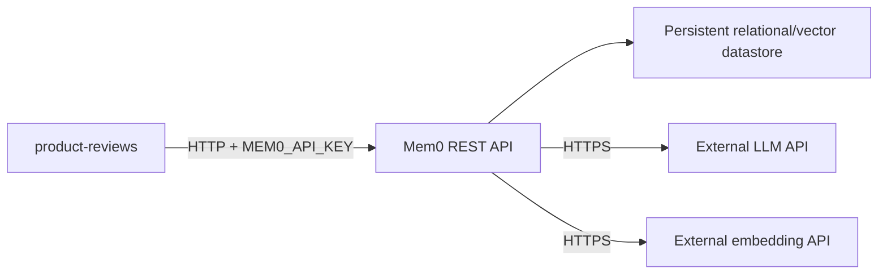
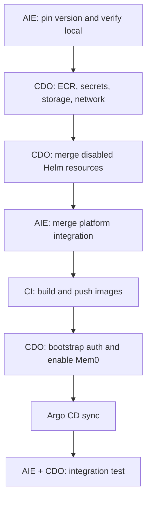

# Mem0 Self-Hosted Setup and Integration Guide

> **Audience:** CDO (CloudOps/DevOps) và AIE
> **Goal:** đưa Mem0 self-hosted từ local lên development cluster và kết nối với `product-reviews`.

## 1. Deployment assumptions

- Mem0 chạy như internal service trong Kubernetes.
- LLM và embedding model đều gọi external API; không cần GPU hoặc model server trong cluster.
- Authentication luôn bật trên cluster. `AUTH_DISABLED=true` chỉ dùng local.
- Mem0 không có public ingress. Dashboard chỉ truy cập tạm thời bằng `kubectl port-forward` khi cần.
- MVP dùng session memory; catalog, review và cart services vẫn là nguồn dữ liệu chính thức.
- MVP không dùng graph memory hoặc graph datastore.
- Mem0 release/image phải được pin version hoặc digest, không dùng `latest`.

## 2. Target setup

CDO cần kiểm tra datastore và biến môi trường chính xác từ Docker Compose của Mem0 release đã pin, đồng thời tắt hoặc loại bỏ graph component khỏi cấu hình deploy.

## 3. Ownership

| AIE | CDO |
| --- | --- |
| Pin Mem0 version và xác nhận API tương thích | Chọn image/registry strategy và triển khai image |
| Tích hợp Mem0 client trong `product-reviews` | Tạo ECR, IAM, secrets, storage và network |
| Cung cấp timeout, fallback và test cases | Tạo Helm Deployment/Service/PVC/probes |
| Xác định `user_id`, `conversation_id` và memory scope | Bootstrap admin/runtime API key và rotation |
| Kiểm thử add/search/isolation từ ứng dụng | Vận hành, backup, restore, dashboard và alerts |

## 4. Application configuration

CDO inject các biến sau vào `product-reviews`:

| Variable | Secret | Example/purpose |
| --- | :---: | --- |
| `MEM0_ENABLED` | No | `true` hoặc `false` để bật/tắt integration |
| `MEM0_BASE_URL` | No | Internal Kubernetes Service URL |
| `MEM0_API_KEY` | Yes | Runtime key, không dùng admin key |
| `MEM0_TIMEOUT_SECONDS` | No | Deadline mỗi request |

CDO inject các secret/config Mem0 server cần theo release đã pin:

- Admin/bootstrap credential.
- Runtime API key hoặc cơ chế tạo runtime key.
- External LLM API endpoint/key/model.
- External embedding API endpoint/key/model.
- Datastore connection credentials.

Không lưu secret trong Git, `.env`, Helm values hoặc image layer.

## 5. Platform repository changes

Trong `tf2-corp-platform`:

1. AIE thêm Mem0 client, timeout, fallback và user/session isolation vào `src/product-reviews`.
2. Thêm Mem0 local service và dependency vào `docker-compose.yml`.
3. Nếu TechX tự build Mem0 image:
   - Thêm pinned Mem0 build context/Dockerfile.
   - Thêm build target vào `docker-bake.hcl`.
   - Thêm `mem0-server` vào `RELEASE_JSON` trong `.github/workflows/build-and-push.yml`.
   - Đổi release count từ 21 thành 22.
4. Thêm test cho authentication, timeout, fallback và user isolation.

Pipeline hiện chỉ biết 21 release images. Chỉ thêm source hoặc Compose service sẽ không tự động làm Mem0 deploy được. Xem [CI/CD documentation](../CICD.md).

## 6. CDO infrastructure setup

### 6.1 Container image

Chọn một trong hai cách:

- **TechX-managed image:** CDO tạo ECR repository `techx-dev-corp/mem0-server`; platform CI build/push image với tag `sha-*`.
- **Upstream image:** CDO pin version và digest, kiểm tra security/license, sau đó để Helm pull trực tiếp hoặc qua internal mirror.

Không merge release-catalog change trước khi ECR repository tồn tại; ECR preflight sẽ fail.

### 6.2 Storage

CDO cung cấp datastore/PVC theo Mem0 release đã pin:

- Dữ liệu tồn tại sau pod restart/reschedule.
- Có backup và restore procedure.
- Có encryption, capacity monitoring và credentials riêng.

### 6.3 Network

- Cho phép `product-reviews` gọi Mem0 internal Service.
- Cho phép Mem0 gọi datastore nội bộ.
- Cho phép Mem0 egress HTTPS tới approved LLM/embedding API endpoints.
- Không tạo public ingress cho Mem0 API/dashboard.
- Nếu có NetworkPolicy, chỉ mở đúng source, destination và port cần thiết.

### 6.4 Authentication

- Không đặt `AUTH_DISABLED=true` trên development cluster.
- Bootstrap một admin bằng cơ chế hỗ trợ bởi Mem0 release đã pin.
- Tạo runtime API key riêng cho `product-reviews`.
- Dùng Secret/ExternalSecret và hỗ trợ rotation không cần rebuild image.
- Bootstrap phải chạy một lần hoặc idempotent; không tạo admin/key mới mỗi lần pod restart.

## 7. Helm/GitOps setup

Trong `techx-corp-chart`, CDO thêm:

- Mem0 Deployment hoặc StatefulSet phù hợp.
- Internal Service.
- ConfigMap và Secret/ExternalSecret references.
- PVC hoặc managed-database connection.
- Startup, readiness và liveness probes.
- Resource requests/limits và security context.
- `mem0.enabled`, ban đầu đặt `false`.
- Image repository/tag hoặc digest.

Nếu Mem0 dùng TechX-managed image, chart cần nhận cùng immutable `sha-*` tag do pipeline promote. Pipeline platform chỉ cập nhật `default.image.tag`; CDO cần bảo đảm Mem0 dùng tag này hoặc có cơ chế override riêng.

## 8. Deployment order

1. AIE pin Mem0 release và chạy local test.
2. CDO tạo image path/ECR, secret, storage và network.
3. CDO merge Helm resources với `mem0.enabled: false`.
4. AIE merge application/build changes vào `techx-dev-corp`.
5. CI build/push image; CDO xác nhận tag có trong registry.
6. CDO bootstrap admin, tạo runtime key và bật Mem0 trong dev values.
7. Argo CD sync; CDO kiểm tra pod, probes, datastore và logs.
8. AIE bật `MEM0_ENABLED=true` và chạy application tests.

## 9. Verification checklist

- [ ] Mem0 image được pin version/digest.
- [ ] Mem0 pod ready và internal Service resolve được DNS.
- [ ] `AUTH_DISABLED` không được bật.
- [ ] Request không có key nhận `401`.
- [ ] `product-reviews` gọi Mem0 bằng runtime key, không dùng admin key.
- [ ] Add/search memory hoạt động.
- [ ] Hai user/session không đọc được memory của nhau.
- [ ] Memory còn tồn tại sau khi restart Mem0 pod.
- [ ] Mem0 gọi được external LLM và embedding APIs.
- [ ] Tắt Mem0 hoặc chặn network không làm product browsing/review retrieval bị lỗi.
- [ ] Không có secret, raw PII hoặc full memory content trong logs/traces.
- [ ] Backup/restore và rollback đã được thử trên development.

## 10. Rollback

1. Đặt `MEM0_ENABLED=false` để `product-reviews` ngừng gọi Mem0.
2. Roll back `product-reviews` image nếu application integration lỗi.
3. Sau khi client đã tắt, đặt `mem0.enabled=false` nếu cần dừng Mem0 workload.
4. Không xóa PVC/database khi rollback application.
5. Revoke và rotate key ngay nếu credential bị lộ.

## 11. Items cần AIE và CDO chốt

- Mem0 release/tag hoặc commit.
- TechX-managed image hay pinned upstream image.
- Datastore topology của release đó.
- External LLM và embedding provider/endpoints.
- Secret backend và cách bootstrap admin/runtime key.
- Memory TTL/retention và backup frequency.
- Mem0 Helm image tag có dùng global `sha-*` hay tag riêng.

## References

- [Mem0 self-hosted setup](https://docs.mem0.ai/open-source/setup)
- [Mem0 REST API server](https://docs.mem0.ai/open-source/features/rest-api)
- [TechX Corp CI/CD](../CICD.md)
