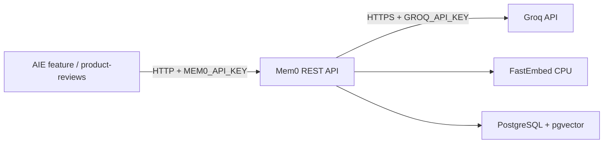

# Mem0 Local Setup and Deployment Handoff

> **Audience:** AIE và CDO
> **Current scope:** chia sẻ một cấu hình Mem0 local thống nhất cho các nhánh AIE. CI/CD và Kubernetes sẽ được xử lý sau.

## 1. Cấu hình đã chốt

| Thành phần | Giá trị |
| --- | --- |
| Mem0 source | `third-party/mem0` Git submodule |
| Fork | `https://github.com/tf2-team/mem0.git` |
| Pinned commit | `bb52f540bfb3386d9689a7ee44231f17d40892ed` |
| LLM | Groq API |
| LLM model | `llama-3.3-70b-versatile` |
| Embedder | FastEmbed chạy local bằng CPU |
| Embedding model | `sentence-transformers/paraphrase-multilingual-MiniLM-L12-v2` |
| Vector dimension | `384` |
| Datastore | PostgreSQL 17 + pgvector |
| Graph store | Không sử dụng |
| Local API | `http://localhost:8888` |
| Local dashboard | `http://localhost:3000` |



## 2. Đồng bộ Mem0 vào nhánh feature

Hai nhánh đang sử dụng setup này:

- `feature/aie-trustworthiness`
- `feature/aie-shopping-workflow`

Từ nhánh feature tương ứng:

```powershell
git fetch origin
git merge origin/aie
git submodule sync --recursive
git submodule update --init --recursive
```

Xác nhận đúng Mem0 commit:

```powershell
git -C third-party/mem0 rev-parse HEAD
```

Kết quả phải là:

```text
bb52f540bfb3386d9689a7ee44231f17d40892ed
```

Nếu clone repository mới, checkout nhánh feature trước rồi lấy setup từ `aie`:

```powershell
git clone https://github.com/tf2-team/tf2-corp-platform.git
cd tf2-corp-platform
git switch feature/aie-trustworthiness # Hoặc feature/aie-shopping-workflow
git merge origin/aie
git submodule update --init --recursive
```

## 3. Tạo cấu hình local

```powershell
cd third-party/mem0/server
Copy-Item .env.example .env
```

Trong `.env`, mỗi developer chỉ cần tự điền ba giá trị sau:

```dotenv
GROQ_API_KEY=<personal-groq-key>
POSTGRES_PASSWORD=<local-postgres-password>
JWT_SECRET=<random-local-secret>
```

Giữ nguyên cấu hình model đã có trong `.env.example`:

```dotenv
MEM0_DEFAULT_LLM_MODEL=llama-3.3-70b-versatile
MEM0_DEFAULT_EMBEDDER_MODEL=sentence-transformers/paraphrase-multilingual-MiniLM-L12-v2
MEM0_EMBEDDING_DIMS=384
```

Tạo `JWT_SECRET`:

```powershell
python -c "import secrets; print(secrets.token_urlsafe(48))"
```

Không commit `server/.env`. File này đã được loại trừ bởi `.gitignore` của Mem0.

## 4. Chạy local

```powershell
cd third-party/mem0/server
docker compose up -d --build
docker compose ps
```

Kỳ vọng:

```text
mem0             Up
mem0-dashboard   Up (healthy)
postgres         Up (healthy)
```

Trong lần chạy đầu tiên, FastEmbed tải model từ Hugging Face và lưu trong volume `fastembed_cache`.

Mở `http://localhost:3000/setup` và thực hiện:

1. Tạo admin local.
2. Giữ LLM provider là `groq` và model là `llama-3.3-70b-versatile`.
3. Giữ embedder là `fastembed` và chọn model `sentence-transformers/paraphrase-multilingual-MiniLM-L12-v2`.
4. Tạo Mem0 runtime API key dạng `m0sk_...`.

Vector dimension `384` được lấy từ `MEM0_EMBEDDING_DIMS` trong `.env`, không nhập trong wizard.

Hai loại key có mục đích khác nhau:

```text
MEM0_API_KEY (m0sk_...)  : application → Mem0
GROQ_API_KEY (gsk_...)   : Mem0 → Groq
```

## 5. Kiểm tra API

Add memory:

```powershell
$headers = @{ "X-API-Key" = "<mem0-runtime-key>" }
$body = @{
    messages = @(@{ role = "user"; content = "I like hiking" })
    user_id = "alice"
} | ConvertTo-Json -Depth 4

Invoke-RestMethod `
    -Method Post `
    -Uri "http://localhost:8888/memories" `
    -Headers $headers `
    -ContentType "application/json" `
    -Body $body
```

Search memory:

```powershell
$body = @{
    query = "What outdoor activity does Alice enjoy?"
    filters = @{ user_id = "alice" }
} | ConvertTo-Json -Depth 4

Invoke-RestMethod `
    -Method Post `
    -Uri "http://localhost:8888/search" `
    -Headers $headers `
    -ContentType "application/json" `
    -Body $body
```

Kết quả tìm kiếm phải chứa memory `User likes hiking`.

## 6. Quy tắc dùng chung cho các nhánh AIE

- Không commit `.env`, Groq key, Mem0 runtime key hoặc admin credential.
- Không đổi embedding model hoặc `MEM0_EMBEDDING_DIMS` riêng trên từng nhánh.
- Không dùng `openai/gpt-oss-120b` cho setup local hiện tại. Khi kiểm thử với Groq account/tier hiện tại, prompt extraction của Mem0 đã vượt giới hạn TPM.
- Không thêm Qdrant hoặc graph store cho MVP.
- Feature code gọi Mem0 qua REST API; không phụ thuộc trực tiếp vào Mem0 Python SDK.
- Khi chạy code từ host, dùng `MEM0_BASE_URL=http://localhost:8888`.
- Khi application và Mem0 nằm chung Docker network, dùng `MEM0_BASE_URL=http://mem0:8000`.
- Mem0 lỗi hoặc timeout không được làm hỏng luồng review/search chính của sản phẩm.

Dừng stack nhưng giữ dữ liệu:

```powershell
docker compose down
```

Reset toàn bộ dữ liệu local chỉ khi chưa có dữ liệu cần giữ:

```powershell
docker compose down -v
```

Lệnh reset này là bắt buộc nếu đổi embedding dimension vì pgvector collection cũ không tương thích dimension mới.

## 7. Cập nhật source Mem0

Không sửa submodule trong một nhánh feature rồi chỉ commit repo platform. Quy trình đúng:

1. Tạo branch trong `tf2-team/mem0`.
2. Commit và push thay đổi Mem0 lên fork.
3. Quay lại `tf2-corp-platform`.
4. Commit submodule pointer mới.
5. Merge thay đổi đó vào `aie` để hai nhánh feature đồng bộ lại.

## 8. Thông tin handoff cho CDO sau này

CDO cần bám theo cùng cấu hình local:

- Dùng TechX-managed image build từ fork/commit đã pin, không cài lại `mem0ai` không pin từ PyPI khi container startup.
- Cấp `GROQ_API_KEY`, `JWT_SECRET`, PostgreSQL credential và runtime key qua secret backend.
- Cấp PostgreSQL + pgvector với vector dimension `384` và persistent storage.
- Cấp CPU/RAM cho FastEmbed; không cần GPU.
- Đóng gói embedding model trong image, hoặc cấp persistent cache và cho phép egress tới Hugging Face.
- Cho Mem0 egress HTTPS tới Groq.
- Không công khai Mem0 API/dashboard; application gọi qua internal Service.
- Giữ authentication bật; không dùng `AUTH_DISABLED=true` ngoài local development.
- Không triển khai graph datastore cho MVP.

Production Dockerfile, Helm, ECR và CI/CD chưa nằm trong phạm vi setup hiện tại.

## References

- [Mem0 self-hosted setup](https://docs.mem0.ai/open-source/setup)
- [Mem0 REST API server](https://docs.mem0.ai/open-source/features/rest-api)
