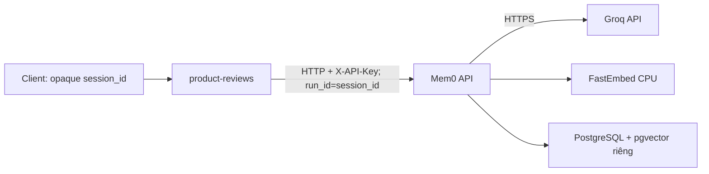

# Mem0 Production Deployment Guide

> Hướng dẫn triển khai Mem0 self-hosted qua ba repository: `tf2-corp-platform`, `tf2-corp-infra` và `tf2-corp-chart`.

## Đọc nhanh

### Vì sao triển khai Mem0?

Hiện tại, RPC `AskProductAIAssistant` chỉ nhận `product_id` và `question`. Mỗi câu hỏi gần như độc lập, nên câu hỏi tiếp theo trong cùng một phiên không có ngữ cảnh từ câu trước.

Mem0 được đưa vào để kiểm chứng một outcome cụ thể:

> Trong một phiên mua sắm ngắn, người dùng có thể hỏi tiếp mà không phải lặp lại ngữ cảnh vừa cung cấp.

Đây là short-term memory cho một phiên ẩn danh, không phải user profile hoặc long-term personalization.

### Memory được gắn với cái gì?

Hệ thống hiện chưa có login và chưa có `user_id`. Frontend đã có `SessionGateway.userId`, nhưng giá trị này là browser/cart identity được lưu lâu dài trong `localStorage`; không dùng trực tiếp nó làm memory session. Client tạo một `memorySessionId` riêng cho phiên hỏi đáp hiện tại và `product-reviews` map giá trị này sang `run_id` của Mem0.

- `session_id` không đại diện cho danh tính người dùng.
- Không dùng email, IP, device fingerprint hoặc `product_id` làm session key.
- Không rotate `SessionGateway.userId`, vì thao tác này có thể làm mất liên kết với cart hiện tại.
- Tạo memory session mới khi không có session hợp lệ, phiên hết hạn do không hoạt động hoặc client chủ động reset.
- Memory phải hết hạn và được dọn sau retention window ngắn.

### Lifecycle của memory session

Frontend lưu memory session riêng trong `sessionStorage`, ví dụ:

```json
{
  "id": "<opaque UUID v4>",
  "lastActiveAt": 0
}
```

Contract lifecycle:

1. Câu hỏi AI đầu tiên trong tab tạo UUID v4 mới và lưu `lastActiveAt`.
2. Các câu hỏi tiếp theo trong cùng tab reuse UUID đó và cập nhật `lastActiveAt`.
3. Refresh trang vẫn giữ memory session; tab khác có memory session riêng.
4. Nếu thời gian không hoạt động vượt `NEXT_PUBLIC_MEM0_SESSION_IDLE_MINUTES`, client rotate sang UUID mới trước khi gửi câu hỏi tiếp theo.
5. Nút **New conversation**, session reset hoặc checkout thành công phải rotate memory session. Đổi sản phẩm không tự reset vì người dùng có thể đang so sánh sản phẩm trong cùng phiên mua sắm.
6. Khi chủ động reset hoặc phát hiện idle expiry, frontend gửi yêu cầu xóa `run_id` cũ theo kiểu best-effort qua backend rồi dùng ID mới ngay; lỗi cleanup không được chặn request chính.
7. Không dựa vào sự kiện đóng tab để xóa đồng bộ vì browser không bảo đảm request unload hoàn tất. `expiration_date` và CronJob cleanup là safety net cho trường hợp này.
8. Nếu `sessionStorage` không khả dụng, request AI vẫn hoạt động nhưng không dùng Mem0; không tạo UUID mới cho từng request.

Giá trị ban đầu đề xuất cho idle window là `60` phút để khớp với vòng đời cart hiện tại. Đây là giới hạn phiên phía client; `MEM0_SESSION_RETENTION_DAYS=1` vẫn là cleanup fallback phía server do Mem0 OSS chỉ hỗ trợ expiration theo ngày.

### Ai làm phần nào?

| Phạm vi | Repository | Phần việc |
| --- | --- | --- |
| Mem0 image, CI/CD, consumer integration | `tf2-corp-platform` | Bước 1, 3 và 7 |
| ECR và secret metadata | `tf2-corp-infra` | Bước 2 |
| PostgreSQL, Mem0 workload và ExternalSecret | `tf2-corp-chart` | Bước 4 và 5 |
| Deploy, kiểm tra và rollout | Cả ba repository | Bước 6, 8 và 9 |

## Vì sao chọn Mem0 thay vì phương án đơn giản hơn?

| Phương án | Phù hợp khi | Hạn chế với use case này |
| --- | --- | --- |
| Request context | Ngữ cảnh chỉ cần tồn tại trong một request | Không hỗ trợ câu hỏi tiếp theo ở request khác |
| Session cache | Chỉ cần lưu nguyên hội thoại trong một phiên | Phương án đơn giản nhất; nên ưu tiên nếu không cần extraction/retrieval |
| PostgreSQL table tự xây | Chỉ lưu một số preference có schema cố định | Phải tự xây extraction, retrieval, update và delete lifecycle |
| Conversation summary | Cần nén vài lượt hội thoại gần nhất | Phải tự quản lý summary update và context selection |
| Mem0 | Cần extraction/retrieval có cấu trúc trong cùng một session | Tăng hạ tầng, Groq calls và cleanup responsibility |

Mem0 chỉ phù hợp nếu structured retrieval tốt hơn việc truyền conversation history hoặc dùng session cache. Nếu không, chọn phương án đơn giản hơn.

## Phạm vi và trade-off

### Làm trong giai đoạn này

- Một use case: nhớ ngữ cảnh giữa các câu hỏi trong cùng phiên `product-reviews`.
- Session ẩn danh được định danh bằng opaque `session_id`.
- Map `session_id` sang Mem0 `run_id`; không gửi `user_id`.
- Retention ngắn, có expiration và cleanup.
- FastEmbed CPU, Groq và PostgreSQL + pgvector riêng.
- Internal-only API, authenticated access và fail-open integration.
- Dark deployment trước, sau đó mới bật write và read riêng biệt.

### Chưa làm

- Không dùng memory cho toàn bộ shopping workflow.
- Không có long-term memory hoặc cross-session personalization.
- Không xây user profile khi chưa có login và consent.
- Không deploy dashboard, graph store hoặc public API.
- Không scale ngang khi history còn dùng SQLite local.
- Không thay thế source of truth của profile, catalog hoặc review bằng Mem0.

Các trade-off này giữ phạm vi nhỏ, giảm chi phí vận hành và cho phép tắt Mem0 mà không ảnh hưởng luồng chính.

## Những điều phải đúng

Trước khi mở rộng rollout, cần kiểm chứng:

1. Một phiên có nhiều câu hỏi liên quan cần chia sẻ ngữ cảnh.
2. Client tạo `memorySessionId` riêng, truyền nhất quán trong suốt phiên và không dùng cart `userId` làm memory scope.
3. Memory retrieval luôn filter theo đúng `run_id` và không đọc session khác.
4. Kết thúc/reset session có thể xóa toàn bộ memory của `run_id` đó.
5. Groq và Mem0 không làm request chính thất bại khi timeout, 429 hoặc 5xx.
6. Structured memory hữu ích hơn conversation history hoặc session cache đơn giản.

## Hướng mở rộng sau MVP

Không mở rộng theo số lượng service. Mở rộng theo use case đã được kiểm chứng:

1. Bắt đầu với follow-up questions trong một phiên `product-reviews`.
2. Mở rộng loại ngữ cảnh được nhớ trong cùng phiên khi retrieval behavior đã ổn định.
3. Dùng chung contract `session_id`, retention và cleanup thay vì để mỗi feature tự tạo session memory riêng.
4. Chỉ xem xét long-term memory sau khi sản phẩm có login, user identity và consent rõ ràng.

Mem0 open source không phải lợi thế riêng. Giá trị nằm ở session contract, guardrails, cleanup behavior và evaluation cases được xây quanh nó.

## Kiến trúc đích



- Mem0 chỉ có internal `ClusterIP`; không có public Ingress.
- Không deploy dashboard hoặc graph store cho MVP.
- Không dùng chung PostgreSQL commerce.
- `product-reviews` phải fail open khi Mem0 hoặc Groq lỗi.
- Memory read và write dùng hai feature flag độc lập.

## Cấu hình cố định

| Thành phần | Giá trị |
| --- | --- |
| Source | `third-party/mem0` Git submodule |
| Fork | `https://github.com/tf2-team/mem0.git` |
| Commit | `bb52f540bfb3386d9689a7ee44231f17d40892ed` |
| LLM | Groq / `llama-3.3-70b-versatile` |
| Embedder | FastEmbed CPU |
| Embedding model | `sentence-transformers/paraphrase-multilingual-MiniLM-L12-v2` |
| Vector dimension | `384` |
| Vector store | PostgreSQL 17 + pgvector |
| Memory scope | `run_id = session_id` |
| Retention | Short-term; explicit expiration + cleanup |

Không đổi embedding model hoặc dimension sau khi có dữ liệu nếu chưa có migration plan.

## Đặt code và script ở đâu?

Có phần cần tách ra để dùng chung, nhưng không phải mọi script liên quan đến model đều giống nhau. Chia logic thành hai nhóm:

| Nhóm | Có dùng chung không? | Lý do |
| --- | --- | --- |
| Build và validate model | Không | Guardrail dùng loader Hugging Face/LLM Guard; Mem0 dùng FastEmbed/ONNX và phải kiểm tra vector dimension `384` |
| Download, checksum, extract và mount artifact | Có | Các bước runtime giống nhau, chỉ khác S3 URI, mount path và ready marker |

Vì vậy, script build model vẫn nằm cạnh workload sở hữu model. Phần runtime model delivery được tách thành Helm helper dùng chung trong `tf2-corp-chart`, không tạo thêm một `common/scripts` mơ hồ trong platform repo.

```text
tf2-corp-platform/
├─ src/
│  ├─ product-reviews/
│  │  └─ scripts/
│  │     └─ build_model_artifact.py
│  └─ mem0/
│     ├─ scripts/
│     │  ├─ build_embedding_model_artifact.py
│     │  └─ validate_embedding_model_artifact.py
│     └─ tests/
│        └─ test_embedding_model_offline.py
├─ third-party/
│  └─ mem0/
│     └─ mem0/embeddings/fastembed.py
└─ docs/
   └─ ai-engineering/mem0/
      └─ mem0-self-hosted-deployment-handoff.md

tf2-corp-chart/
├─ templates/
│  └─ _artifact-delivery.tpl
├─ values.yaml
└─ values-prod.yaml
```

`_artifact-delivery.tpl` là đơn vị tái sử dụng chung. Helper này nhận cấu hình của từng component rồi render volume, init containers và read-only mount. Nó không được chứa tên model, đường dẫn mount hoặc biến môi trường riêng của guardrail.

Ranh giới ownership:

| Repository | Ownership |
| --- | --- |
| `tf2-corp-platform` | Build, validate và test FastEmbed artifact; thay đổi adapter Mem0 ở mức tối thiểu |
| `tf2-corp-chart` | Cung cấp Helm helper chung để download, kiểm tra checksum, extract và mount artifact cho guardrail và Mem0 |
| `tf2-corp-infra` | S3 bucket/prefix, VPC endpoint và IRSA đọc model cho Mem0 |

Giữ `third-party/mem0` gần source upstream nhất có thể. Không đặt script vận hành riêng của công ty trong submodule nếu script đó có thể nằm ở `src/mem0`.

## Cách đưa embedding model vào Mem0

Guardrail đã có sẵn một quy trình an toàn để đưa model từ S3 vào pod: tải artifact, kiểm tra checksum, giải nén rồi mới khởi động ứng dụng. Mem0 sẽ dùng lại quy trình này thay vì xây thêm một cách phân phối model khác.

Điểm quan trọng là **chỉ dùng chung cơ chế**, không dùng chung model, volume hoặc quyền truy cập.

### Phần được dùng chung

- AI model bucket đóng vai trò như kho chứa model chung.
- S3 VPC endpoint cho phép pod tải model qua mạng nội bộ AWS.
- Quy trình `download → verify checksum → extract → mount` được triển khai một lần trong `_artifact-delivery.tpl` và dùng cho nhiều workload.

Mỗi workload chỉ truyền input cho helper chung:

```yaml
components:
  product-reviews:
    artifactDelivery:
      enabled: true
      s3Uri: s3://.../protectai/.../model.tar.gz
      mountPath: /models/huggingface
      readyMarker: .model-ready

  mem0:
    artifactDelivery:
      enabled: true
      s3Uri: s3://.../fastembed/.../model.tar.gz
      mountPath: /models/fastembed
      readyMarker: .model-ready
```

Helper dùng tên tổng quát như `fetch-model-artifact` và `extract-model-artifact`. Không giữ các tên gắn với một workload như `fetch-ai-guardrail-model`.

### Phần dành riêng cho Mem0

- Mem0 có một đường dẫn riêng trong bucket, gọi là S3 prefix, ví dụ:

  ```text
  fastembed/paraphrase-multilingual-MiniLM-L12-v2/<revision>/
  ```

- Mem0 có ServiceAccount và IRSA role riêng. Role này chỉ được đọc prefix của Mem0, không đọc model guardrail.
- Mỗi revision được phát hành thành một artifact bất biến, gồm:
  - model đã pin đúng revision;
  - manifest mô tả model;
  - checksum để phát hiện file sai hoặc hỏng;
  - ready marker xác nhận artifact đã được chuẩn bị đầy đủ.

Cấu trúc thực tế như sau:

```text
S3 bucket dùng chung
├─ protectai/...     → product-reviews đọc guardrail model
└─ fastembed/...     → Mem0 đọc embedding model

product-reviews pod
└─ /models/huggingface   → chỉ có guardrail model

Mem0 pod
└─ /models/fastembed     → chỉ có embedding model
```

Hai pod có filesystem và volume riêng. Vì vậy, việc cùng dùng thư mục gốc `/models` không có nghĩa hai model nằm chung một thư mục vật lý.

### Khi Mem0 pod khởi động

1. Init container tải embedding artifact và file checksum từ S3.
2. Init container xác minh checksum rồi giải nén artifact vào volume của Mem0 pod.
3. Mem0 container mount volume đó ở chế độ read-only tại `/models/fastembed`, tránh việc runtime vô tình thay đổi model.
4. FastEmbed chỉ load model từ đường dẫn local này; runtime không tự tải model từ Internet.

Không truyền các biến riêng của guardrail như `AI_GUARDRAIL_REQUIRE_MODEL` vào Mem0. `HF_HOME` cũng chưa đủ để đảm bảo FastEmbed đọc đúng model, vì FastEmbed quản lý cache theo contract riêng. Adapter phải truyền rõ `cache_dir=/models/fastembed` và `local_files_only=true`; nếu artifact chứa sẵn thư mục ONNX hoàn chỉnh thì có thể dùng `specific_model_path`.

Phần này hoàn tất khi Mem0 pod vẫn khởi động và tạo được vector dimension `384` trong môi trường không có egress tới Hugging Face hoặc nguồn model khác.

## Bước 1 — Tạo production image

**Repository:** `tf2-corp-platform`

1. Tạo production Dockerfile từ root `third-party/mem0` để image chứa đúng source fork đã pin.
2. Không dùng nguyên trạng `server/Dockerfile`: file này cài `mem0ai` từ PyPI và chạy Uvicorn với `--reload`.
3. Pin dependencies và chạy Uvicorn không có `--reload`.
4. Chạy bằng non-root user và hỗ trợ read-only root filesystem.
5. Chỉ cấp writable mount cho `/tmp`, model cache và history path.
6. Tạo `src/mem0/scripts/build_embedding_model_artifact.py` để tải đúng model/revision, tạo manifest, ready marker, archive và checksum.
7. Tạo `src/mem0/scripts/validate_embedding_model_artifact.py` để load artifact bằng đúng `fastembed==0.8.0`, chạy một embedding mẫu và xác nhận vector dimension là `384`.
8. Upload artifact vào S3 prefix riêng của Mem0; không đóng model trực tiếp vào application image.
9. Cập nhật FastEmbed adapter ở mức tối thiểu để nhận `cache_dir` và `local_files_only=true` từ cấu hình. Không hard-code đường dẫn production trong source upstream.
10. Thêm liveness endpoint cho process và readiness endpoint cho app DB + vector store. Readiness không gọi Groq.
11. Tách migration khỏi API startup:
   - tạo `mem0_app` nếu chưa tồn tại;
   - chạy `alembic upgrade head`;
   - chỉ start API sau khi migration thành công.
12. Thêm cleanup command idempotent để xóa vật lý session memories đã hết hạn.
13. Build và smoke test trên cả `linux/amd64` và `linux/arm64`.

## Bước 2 — Cấp ECR và secrets

**Repository:** `tf2-corp-infra`

1. Thêm `mem0` vào ECR service catalog.
2. Apply development để tạo `techx-dev-corp/mem0`.
3. Apply production để tạo `techx-corp/mem0`.
4. Giữ image scan và lifecycle policy hiện tại.
5. Thêm secret shell `mem0` vào module Secrets Manager.
6. Terraform chỉ tạo secret metadata, không ghi value vào state.
7. Bootstrap các giá trị sau ngoài Terraform:

```text
GROQ_API_KEY
JWT_SECRET
ADMIN_API_KEY
POSTGRES_USER
POSTGRES_PASSWORD
POSTGRES_DB
```

8. Mở rộng `modules/ai-model-storage` để hỗ trợ nhiều model consumer thay vì gắn role với `product-reviews`.
9. Thêm consumer `mem0` với ServiceAccount riêng và quyền `s3:GetObject` chỉ trên FastEmbed prefix.
10. Không dùng lại IRSA role hoặc model prefix của guardrail cho Mem0.

GitHub Actions ECR role đã dùng wildcard theo project prefix nên không cần đổi IAM policy cho hai repository trên.

## Bước 3 — Mở rộng CI/CD

**Repository:** `tf2-corp-platform`

1. Checkout Git submodule trong CI.
2. Trigger pipeline khi `.gitmodules`, submodule pointer hoặc Mem0 build files thay đổi.
3. Thêm `mem0` vào Compose/Bake release catalog.
4. Đổi các validation hard-code 21 images thành 22 images.
5. Classify Mem0 change để chỉ build lại `mem0`; các image khác tiếp tục được retag.
6. Thêm CI gate theo thứ tự:
   - build và validate FastEmbed artifact bằng đúng runtime loader;
   - chạy validation khi chặn model egress;
   - build production image;
   - khởi tạo PostgreSQL + pgvector;
   - chạy migration;
   - chờ readiness;
   - authenticated add/search;
   - restart rồi search lại.
7. Chỉ promote chart khi toàn bộ gate pass.

## Bước 4 — Cấp RDS PostgreSQL + pgvector

**Repository:** `tf2-corp-infra`, sau đó cấu hình kết nối trong `tf2-corp-chart`

1. Tạo RDS for PostgreSQL 17 riêng cho Mem0 trong private subnets; không public endpoint.
2. Chỉ cho phép EKS cluster security group kết nối TCP `5432`.
3. Bật storage encryption, SSL bắt buộc, automated backup và CloudWatch PostgreSQL logs.
4. Production dùng Multi-AZ, deletion protection, final snapshot và Performance Insights.
5. Development dùng single-AZ và instance nhỏ hơn nhưng giữ cùng engine/connection contract.
6. Để RDS quản lý master password trong AWS Secrets Manager. Master credential chỉ dùng cho migration/bootstrap, không truyền vào Mem0 API.
7. Giữ application credential trong secret shell `mem0`, được bootstrap ngoài Terraform.
8. Migration Job tạo application role `mem0_app` và extension `vector` theo cách idempotent, sau đó chạy `alembic upgrade head`.
9. Xác nhận add/search vẫn hoạt động sau khi restart Mem0 và failover/reboot database.

Chart không tạo PostgreSQL StatefulSet hoặc PVC cho Mem0. Không dùng chung PostgreSQL commerce để phục vụ Mem0.

## Bước 5 — Thêm Mem0 workload

**Repository:** `tf2-corp-chart`

1. Thêm component `mem0`, một replica, không HPA.
2. Tạo internal `ClusterIP` trên port `8000`; không tạo Ingress.
3. Mount `/tmp` và history storage phù hợp với runtime hardening.
4. Lấy secrets qua ExternalSecret `techx-corp-mem0`.
5. Tách `modelDelivery` hiện tại thành Helm helper `_artifact-delivery.tpl`; helper nhận `s3Uri`, `mountPath`, `readyMarker` và cấu hình volume, không hard-code model hoặc biến môi trường của guardrail.
6. Download archive và checksum từ S3 bằng init container, xác minh checksum, extract rồi kiểm tra ready marker.
7. Mount artifact read-only tại `/models/fastembed` và cấu hình FastEmbed chỉ đọc model local.
8. Đặt cấu hình:

```dotenv
AUTH_DISABLED=false
MEM0_TELEMETRY=false
POSTGRES_HOST=<mem0-rds-private-endpoint>
POSTGRES_PORT=5432
POSTGRES_SSLMODE=require
APP_DB_NAME=mem0
POSTGRES_COLLECTION_NAME=memories
MEM0_DEFAULT_LLM_MODEL=llama-3.3-70b-versatile
MEM0_DEFAULT_EMBEDDER_MODEL=sentence-transformers/paraphrase-multilingual-MiniLM-L12-v2
MEM0_EMBEDDING_DIMS=384
FASTEMBED_CACHE_PATH=/models/fastembed
FASTEMBED_LOCAL_FILES_ONLY=true
```

9. Thêm startup, readiness và liveness probes. Readiness fail nếu model artifact thiếu, sai checksum hoặc không load được.
10. Thêm NetworkPolicy chỉ cho phép:
   - `product-reviews` gọi Mem0;
   - Mem0 gọi private RDS endpoint trên TCP `5432`;
   - Mem0 egress HTTPS tới Groq.
11. Thêm CronJob gọi cleanup command bằng admin credential; không expose cleanup endpoint ra ngoài cluster.
12. Chạy Helm render, runtime-hardening và Gatekeeper checks.

Nếu giữ SQLite history, mount PVC và giữ một replica. Chỉ scale ngang sau khi history dùng shared store hoặc được xác nhận là disposable.

## Bước 6 — Triển khai development và bootstrap auth

Triển khai theo thứ tự:

1. ECR và secret shell.
2. Mem0 image.
3. Secrets chart.
4. RDS PostgreSQL đã available và secret đã đồng bộ.
5. Migration Job tạo role/extension/schema.
6. Mem0 API.

Khi readiness xanh:

1. Dùng `ADMIN_API_KEY` để bootstrap admin access.
2. Tạo runtime API key dạng `m0sk_...` cho `product-reviews`.
3. Lưu runtime key vào AWS Secrets Manager.
4. Chờ External Secrets đồng bộ Kubernetes Secret.
5. Không dùng admin key làm application key lâu dài.

Từ một pod nội bộ, chạy add, search và delete với một test `run_id`. Sau đó restart Mem0, reboot/failover RDS theo quy trình vận hành rồi search lại.

## Bước 7 — Tích hợp `product-reviews`

**Repository:** `tf2-corp-platform`, sau đó cập nhật `tf2-corp-chart`.

1. Mở rộng `AskProductAIAssistantRequest` trong `pb/demo.proto` bằng field mới, không tái sử dụng field number cũ:

```proto
string session_id = 3;
```

2. Mở rộng `SessionGateway` bằng memory-session helper riêng:
   - giữ `userId` và `currencyCode` hiện tại trong `localStorage`;
   - lưu `memorySessionId` và `lastActiveAt` trong `sessionStorage`;
   - cung cấp `getMemorySessionId()` và `resetMemorySession()`;
   - trả về `undefined` nếu storage không khả dụng để caller dùng fallback không memory.
3. `ApiGateway.askProductAIAssistant` lấy `memorySessionId` tại thời điểm gọi và gửi nó trong HTTP body. Không cache ID ở module load vì SSR không có `sessionStorage`.
4. Next API route validate `session_id` là UUID hợp lệ, giới hạn độ dài rồi truyền vào gRPC request. Không lấy business session từ OpenTelemetry baggage `session.id`.
5. Regenerate protobuf clients/servers bị ảnh hưởng.
6. Thêm cấu hình:

```dotenv
MEM0_BASE_URL=http://mem0:8000
MEM0_API_KEY=<from-secret>
MEM0_WRITE_ENABLED=false
MEM0_READ_ENABLED=false
MEM0_SESSION_RETENTION_DAYS=1
NEXT_PUBLIC_MEM0_SESSION_IDLE_MINUTES=60
```

7. Gọi Mem0 qua REST API, không import Mem0 Python SDK.
8. Khi add memory, chỉ truyền `run_id=session_id`; không truyền `user_id`.
9. Khi search, luôn filter bằng đúng `run_id`; thiếu hoặc sai định dạng `session_id` thì bỏ qua Mem0 và dùng fallback hiện tại.
10. Không dùng cart `userId` hoặc `product_id` làm memory scope. Có thể lưu `product_id` trong metadata để hỗ trợ filter bổ sung.
11. Thêm reset flow qua backend để xóa `DELETE /entities/run/{run_id}` bằng Mem0 application credential; frontend không gọi Mem0 trực tiếp.
12. Checkout thành công hoặc thao tác **New conversation** gọi reset flow theo kiểu best-effort rồi rotate `memorySessionId` ngay cả khi delete thất bại.
13. Idle expiry rotate ID trước khi gửi câu hỏi tiếp theo và kích hoạt cleanup ID cũ ở background.
14. Đặt timeout ngắn hơn request budget của `product-reviews`.
15. Mem0 timeout, 429 hoặc 5xx phải trả về fallback hiện tại.
16. Không retry đồng bộ vô hạn.
17. Đặt `expiration_date` theo retention policy làm safety net; CronJob xóa vật lý memory sau khi hết hạn.
18. Lưu ý: Mem0 OSS hiện chỉ hỗ trợ `expiration_date` theo ngày. Xóa theo `run_id` vẫn là cleanup chính khi reset, checkout hoặc idle expiry; expiration chỉ là fallback.
19. Ghi metrics cho add/search latency, error, timeout và fallback.

Rollout flags theo thứ tự:

1. Giữ read và write cùng tắt.
2. Bật write cho các test sessions.
3. Kiểm tra session isolation và cleanup.
4. Bật read cho các test sessions.
5. Mở rộng cohort khi quality và latency đạt yêu cầu.

## Bước 8 — Kiểm tra development

Trước khi promote production, xác nhận:

- Image chạy trên ARM64 node.
- Cold start tải model artifact từ S3, xác minh checksum và không download từ Hugging Face hoặc nguồn model khác.
- FastEmbed load đúng artifact khi `local_files_only=true` và trả vector dimension `384`.
- Mem0 ServiceAccount không đọc được guardrail prefix; `product-reviews` ServiceAccount không đọc được Mem0 prefix.
- Add/search/delete partition đúng theo `run_id=session_id`.
- Request không có `session_id` vẫn hoạt động bằng fallback và không tạo memory.
- Session reset và cleanup không ảnh hưởng session khác.
- Refresh giữ nguyên `memorySessionId`; tab mới nhận ID khác.
- Idle expiry, **New conversation** và checkout thành công đều rotate ID; cart `userId` không đổi.
- Khi `sessionStorage` bị chặn, AI fallback hoạt động và không tạo một ID mới cho mỗi request.
- Delete lỗi không chặn rotate; memory cũ được cleanup bằng expiration/CronJob.
- Pod restart không làm mất memory.
- Migration chạy lại an toàn.
- Groq 429/timeout kích hoạt fallback.
- Read/write flags hoạt động độc lập.
- Mem0 API và dashboard không xuất hiện trên public ALB/CloudFront.
- CPU, RAM, DB connections và disk có metrics/alerts.
- PostgreSQL backup và restore đã được thử.

## Bước 9 — Rollout production

1. Push immutable Mem0 image vào production ECR.
2. Merge chart PR với read/write flags vẫn tắt.
3. Chờ Argo CD sync và health xanh.
4. Chạy add/search/delete bằng production test session riêng.
5. Bật write cho internal/test sessions.
6. Bật read sau khi kiểm tra memory đã ghi.
7. Mở rộng cohort dựa trên error, latency, fallback và quality metrics.

## Cổng quyết định

| Cổng | Được phép làm | Điều kiện bắt buộc |
| --- | --- | --- |
| A — Dark deployment | Deploy Mem0 nhưng chưa có application traffic | Image, migration, auth, persistence và internal access hoạt động |
| B — Internal write | Ghi memory cho test sessions | `session_id → run_id`, expiration và delete flow đã được kiểm chứng |
| C — Internal read | Dùng memory trong câu trả lời nội bộ | Không có cross-session leakage, stale memory nghiêm trọng hoặc lỗi luồng chính |
| D — Production cohort | Mở cho một nhóm người dùng thật | Internal read ổn định và rollback flags đã được thử |
| E — Mở rộng use case | Tái sử dụng memory ngoài `product-reviews` | Use case đầu tiên chứng minh Mem0 tốt hơn phương án đơn giản hơn |

Nếu một cổng không đạt, giữ nguyên cổng trước đó. Hạ tầng chạy ổn không phải là lý do đủ để bật memory read cho người dùng.

## Rollback

1. Tắt `MEM0_READ_ENABLED`.
2. Tắt `MEM0_WRITE_ENABLED`.
3. Revert chart/image promotion nếu workload vẫn lỗi.
4. Giữ PostgreSQL PVC để điều tra và khôi phục.

Không rollback bằng cách xóa PVC hoặc database. Mem0 outage không được làm gián đoạn chức năng review/search hiện có.

## Hoàn tất khi

- Image được build từ đúng submodule commit trên AMD64 và ARM64.
- ECR, Secrets Manager, ExternalSecret và workloads được quản lý bằng code.
- Mem0 và pgvector chỉ có internal access.
- Auth luôn bật; consumer dùng runtime API key.
- Không dùng `user_id`; mọi memory đều scope theo `run_id=session_id`.
- Cart `userId` và `memorySessionId` có lifecycle độc lập; reset memory không làm mất cart.
- Migration, session isolation, add/search/delete, expiration, cleanup, restart và backup/restore tests pass.
- `product-reviews` fail open khi Mem0 hoặc Groq lỗi.
- Read/write rollout flags và rollback đã được kiểm chứng.
