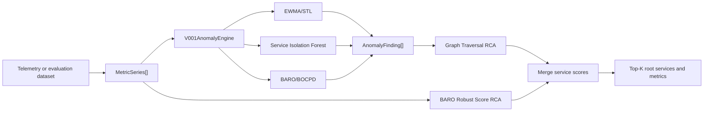

# ADR-DETECT-001 - Mandate 7a Anomaly Detector Architecture

> Status: Proposed, pending reviewer sign-off  
> Owner: Nguyen Quy Hung  
> Reviewers: Pending team review  
> Last updated: 2026-07-17
> Related docs: `docs/aiops/mandate/MANDATE-07a-detection-analysis.md`

## Summary

For Mandate 7a, we will use the in-repository Python AIOps detector as the first anomaly detection architecture. The detector is lightweight, observe-only, and evaluation-first. It reads existing telemetry-shaped metric series, computes a historical baseline, scores abnormal behavior, and passes evidence into the RCA ranking path.

This ADR does not approve production auto-remediation. It only approves the detector architecture and the documentation/evaluation path required for Mandate 7a review.

## Problem

The team needs a baseline anomaly detection approach that can identify abnormal service behavior and provide root-cause candidates without adding operational risk. The task requires:

1. Code evidence that baseline and detector logic exist.
2. A metrics analysis document covering at least three important service metrics.
3. An ADR explaining the detector architecture and how it integrates with the current AIOps prototype.

The detector must satisfy these constraints:

- Do not slow down user-facing services.
- Do not add a new expensive telemetry or ML cluster.
- Do not interfere with SRE fault injection.
- Do not mutate `flagd`.
- Do not require production deployment for this phase.

## Current Evidence

The current AIOps prototype already contains the relevant runtime pieces:


| Area                    | File                               | Purpose                                                                               |
| ----------------------- | ---------------------------------- | ------------------------------------------------------------------------------------- |
| Runtime config          | `src/aio/config/runtime.json`      | Defines topology, signals, detector ids, thresholds, policy, and RCA enablement.      |
| Baseline helpers        | `src/aio/aiops/anomaly/stats.py`   | Provides median, IQR, standard deviation, and robust score helpers.                   |
| Detector implementation | `src/aio/aiops/anomaly/v001.py`    | Contains EWMA/STL, service-level Isolation Forest, and BARO/BOCPD detector paths.      |
| RCA engine              | `src/aio/aiops/rca/engine.py`      | Combines topology/graph evidence and metric scores into ranked root-cause candidates. |
| Evaluation runner       | `src/aio/evaluate/e2e_pipeline.py` | Runs hybrid anomaly/RCA evaluation and emits incident/RCA metrics.                     |
| Ground-truth labels     | `src/aio/evaluate/incident_labels.csv` | Supplies reviewable expected incident, service, metric, and optional action labels. |
| Evaluation evidence     | `docs/aiops/eval/e2e_pipeline_labeled_report.json` | Stores the full-dataset labeled evaluation result.                       |


## Decision

Use the Python AIOps detector path already present in `src/aio` as the Mandate 7a detector architecture.

The selected architecture is:



The detector will run outside the user request path. For Mandate 7a, the output is evidence for review and evaluation, not an automatic production action.

## Detailed Design

### 1. Input Contract

Detector input is normalized into `MetricSeries` objects. Each series represents one metric for one service.

Expected fields:


| Field       | Meaning                                                                          |
| ----------- | -------------------------------------------------------------------------------- |
| `service`   | Service that owns the metric, for example `checkout` or `payment`.               |
| `metric`    | Metric family/name, for example `latency`, `error`, or `checkout_bad_ratio_24h`. |
| `signal_id` | Stable signal identifier used by detector/RCA output.                            |
| `points`    | Ordered timestamp/value points.                                                  |


The detector should not depend on live production-only objects. It can run against existing telemetry or dataset-shaped CSV input.

### 2. Baseline Calculation

For each metric series, the detector compares the latest/current value against historical values.

Baseline policy:

```text
historical_values = all points before the latest/current point
center = median(historical_values)
spread = IQR(historical_values)
score = abs(current_value - center) / spread
```

If the spread is zero, the implementation uses a non-zero fallback so the score does not divide by zero.

Why median/IQR:

- More robust than mean/stddev when there are spikes.
- Cheap to compute.
- Works without training a model.
- Fits the requirement to avoid new infrastructure.

### 3. Anomaly Scoring

The selected detector path uses lightweight statistical scoring:


| Method                | Purpose                                                    | Current evidence                 |
| --------------------- | ---------------------------------------------------------- | -------------------------------- |
| Robust score baseline | Compare latest metric value against historical median/IQR. | `src/aio/aiops/anomaly/stats.py` |
| EWMA residual scoring | Detect drift/spike in one time series after smoothing.     | `src/aio/aiops/anomaly/v001.py`  |
| Service Isolation Forest | Detect multivariate deviation across metrics within one service. | `src/aio/aiops/anomaly/v001.py` |
| BARO/BOCPD changepoint scoring | Detect a multivariate changepoint across services for corroboration. | `src/aio/aiops/anomaly/v001.py` |


The BARO/BOCPD path is treated as a corroborating multivariate signal in Mandate 7a, not as a production auto-remediation trigger. The core approval remains the lightweight in-repository detector architecture and its documented baseline/scoring behavior.

### 4. Runtime Signals And Thresholds

Current configured runtime signals in `src/aio/config/runtime.json` include:


| Detector                            | Signal                           | Service                     | Threshold | Purpose                                               |
| ----------------------------------- | -------------------------------- | --------------------------- | --------- | ----------------------------------------------------- |
| `ops01_checkout_slo`                | `checkout_bad_ratio_24h`         | checkout                    | `0.01`    | Detect checkout SLO breach.                           |
| `ops03_checkout_payment_dependency` | `checkout_payment_error_rate_5m` | checkout/payment dependency | `0.05`    | Detect checkout failure caused by payment dependency. |


These thresholds are prototype/evaluation thresholds. They should be reviewed after real incident replay or reviewer feedback.

### 5. RCA Integration

After anomaly scoring, RCA ranking combines:

- `AnomalyFinding[]` emitted by EWMA/STL, Service Isolation Forest, and BARO/BOCPD.
- Graph/topology evidence from runtime config.
- BARO robust metric-deviation evidence from the original metric series.
- Service dependency information, for example checkout depending on payment.

The evaluation runner now follows the runtime RCA contract:

```python
findings = anomaly_engine.evaluate(series)
result = rca.rank(findings, series, top_k)
```

Incident prediction remains a separate last-point robust-score threshold in the offline evaluator. The hybrid findings feed RCA ranking; they do not yet replace `predicted_incident`.

The expected output shape follows `src/aio/evaluate/e2e_pipeline.py`:


| Output                    | Meaning                                                         |
| ------------------------- | --------------------------------------------------------------- |
| `predicted_incident`      | Offline last-point robust-score threshold decision.              |
| `predicted_root_services` | Ranked top-k suspected root-cause services.                     |
| `predicted_root_causes`   | Service plus metric evidence.                                   |
| `rca_top_k_hit`           | Whether expected root cause appears in top-k during evaluation. |


## Options Considered

### Option A: Grafana Machine Learning or managed anomaly detection

Not selected for Mandate 7a.

Pros:

- Less custom detector code.
- Native dashboard integration.

Cons:

- Adds provisioning/access questions.
- May introduce additional cost.
- Harder to keep the first proof fully repo-reviewable.

### Option B: Prometheus-only static alert rules

Not selected as the primary detector architecture.

Pros:

- Simple and familiar.
- Good for fixed SLO thresholds.

Cons:

- Weak for RCA ranking.
- Harder to compare metric deviations across services.
- Does not fully satisfy the need for detector/RCA evidence.

### Option C: In-repository Python AIOps detector

Selected.

Pros:

- Already exists in the prototype.
- Lightweight and reviewable.
- Runs offline on datasets.
- Does not require new infra.
- Can output RCA evidence, not only alert/no-alert.

Cons:

- Thresholds need tuning.
- Production use still needs a separate live-readiness decision.
- Reviewer sign-off is required before the ADR becomes accepted.

## Safety And Non-Goals

This ADR explicitly does not approve:

- Production auto-remediation.
- Mutation of Kubernetes resources.
- Mutation of `flagd` configuration or fault-injection state.
- Inline execution on the application request path.
- Adding a new telemetry or ML cluster.

Required safety behavior:

- Detector runs as AIOps-side logic.
- Detector output is recommendation/evidence until sign-off.
- Any future automatic action must go through remediation safety policy and a separate approval path.

## Verification Plan

Before this ADR is marked accepted, attach or reference:

1. Metrics analysis doc with at least three user-impact metrics.
2. Code/PR/commit link showing baseline and detector logic.
3. Ground-truth evaluation command and labeled output from the current detector/RCA path.
4. Reviewer comment approving this architecture.

Suggested local evaluation command from `src/aio`, using the existing virtual environment:

```powershell
.venv\Scripts\python.exe -B evaluate\e2e_pipeline.py `
  --dataset evaluate\dataset `
  --labels evaluate\incident_labels.csv `
  --top-k 5 `
  --incident-threshold 1.0 `
  --out ..\..\docs\aiops\eval\e2e_pipeline_labeled_report.json
```

Ground-truth sheet: `src/aio/evaluate/incident_labels.csv`.

Evaluation evidence: `docs/aiops/eval/e2e_pipeline_labeled_report.json`.

## Rollout Plan

Phase 1: Documentation and review

- Complete metrics analysis.
- Review this ADR.
- Capture reviewer sign-off.

Phase 2: Offline evaluation

- Run detector/RCA against available datasets.
- Save output as evidence.
- Tune prototype thresholds only if reviewer requests it.

Phase 3: Future production readiness

- Create separate live-readiness ADR.
- Define alert ownership and rollback.
- Confirm SLI approval.
- Confirm remediation safety gates.

## Reviewer Checklist

- The selected detector path is clear.
- The detector does not depend on `flagd`.
- The detector does not mutate production state.
- Baseline calculation is documented.
- RCA integration is documented.
- Thresholds are identified as prototype/evaluation thresholds.
- Required evidence is attached or linked.

## Reviewer Sign-Off


| Reviewer      | Area                        | Decision       | Evidence link/comment  | Date    |
| ------------- | --------------------------- | -------------- | ---------------------- | ------- |
| team reviewer | AIOps detector architecture | Pending review | Pending review comment | Pending |


## Consequences

Positive outcomes:

- Mandate 7a has a reviewable detector architecture.
- The approach reuses current AIOps prototype code.
- The detector remains lightweight and observe-only for this phase.
- RCA output can explain which service/metric looks suspicious.

Tradeoffs:

- Prototype thresholds may need tuning after incident replay.
- This does not replace official SLO alerting.
- Production deployment and auto-remediation still need separate approval.

