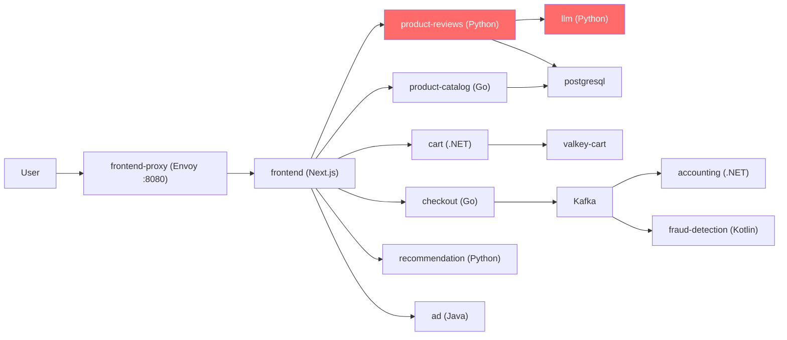

# Phase 3 Summary for AIO4 (TF2)

## 🏢 Bối cảnh

Nhóm **AIO4** nằm trong **TF2** (cùng **CDO03** và **CDO06**). Các bạn tiếp quản **TechX Corp Platform** — một storefront e-commerce chạy ~18 microservices trên Kubernetes (EKS), có hàng đợi Kafka, cơ sở dữ liệu PostgreSQL, tính năng AI tóm tắt review, và full observability stack.

> [!IMPORTANT]
> Đây KHÔNG phải bài tập. Đây là vận hành sản phẩm thật: có SLA, ngân sách $300/tuần, có sự cố do BTC bơm vào, và mọi quyết định phải được bảo vệ trước hội đồng.

---

## 📋 Vai trò của AIO4 trong TF2

| Nhóm | Phụ trách |
|---|---|
| **AIO4 (các bạn)** | **Trụ AI**: AIOps (dùng AI vận hành hệ thống) + AIE (làm AI trong sản phẩm) |
| CDO03 | 2 trụ core platform (Security/Reliability/PerfEff/Cost — tự chọn draft) |
| CDO06 | 2 trụ core còn lại |
| Cả TF2 | Auditability (xuyên suốt), On-call luân phiên |

---

## 🎯 AIO4 cần làm gì — Tổng hợp

### PHẦN 1: AIOps — Dùng AI để vận hành hệ thống

Dựa trên observability đã có sẵn (Prometheus / Jaeger / OpenSearch).

#### Cốt lõi (bắt buộc):
- [ ] **Anomaly detection đa tín hiệu**: phát hiện bất thường từ latency, error rate, saturation, queue lag, cost…
- [ ] **Vòng tự động hóa xử lý sự cố**: Detect → Dry-run/blast-radius check → Execute → Verify qua telemetry → Rollback/Escalate
- [ ] Chạy **liên tục** trong lúc vận hành (không phải demo 1 lần)

#### Mở rộng (đua top):
- [ ] RCA cross-service (phân tích nguyên nhân gốc)
- [ ] Dự báo capacity/cost
- [ ] Phát hiện drift

---

### PHẦN 2: AIE — Làm AI trong sản phẩm

#### A. Vận hành & nâng chất tính năng có sẵn (Tóm tắt review AI)

| Hạng mục | Chi tiết |
|---|---|
| **Đúng đắn** | Eval độ trung thực (tóm tắt khớp review gốc), fallback khi LLM lỗi/chậm → **không bao giờ show tóm tắt sai** |
| **An toàn** | Guardrail chặn prompt-injection trong review, lọc PII, chặn lộ system prompt |
| **Chi phí/độ trễ** | Cache tóm tắt theo sản phẩm, route model rẻ, giảm token, timeout/retry |

#### B. Tự dựng "Shopping Copilot" agentic (BTC KHÔNG phát code, tự xây)

Trợ lý AI biết **gọi công cụ** (tool-calling) trên các service đang chạy:

| # | Intent (bắt buộc) | Ví dụ | Tool cần wire |
|---|---|---|---|
| 1 | **Tìm sản phẩm NL** | "tai nghe chống ồn dưới $50" | `product-catalog` search |
| 2 | **Hỏi-đáp grounded (RAG)** | "pin dùng bao lâu?" → trả lời từ review thật | `product-reviews` + catalog |
| 3 | **Giỏ hàng có kiểm soát** | "thêm 2 cái vào giỏ" → xác nhận trước khi ghi | `cart` |

| # | Intent (mở rộng) | Tool |
|---|---|---|
| 4 | So sánh sản phẩm | catalog + reviews |
| 5 | Gợi ý cross-sell | recommendation + catalog |
| 6 | Giá/ship/quy đổi tiền | currency + quote/shipping |

> [!CAUTION]
> **Yêu cầu xuyên suốt (được chấm)**:
> - **Multi-turn**: nhớ ngữ cảnh ("nó", "cái đầu tiên")
> - **Tool allow-list + confirmation gate** cho hành động ghi
> - **Guardrail excessive-agency**: không tự ý checkout/xoá giỏ
> - **Grounded, không hallucinate**; không lộ PII/system prompt
> - **Fallback** khi LLM lỗi + **giới hạn vòng lặp** + **audit log** mọi tool call

---

## 📅 Timeline 3 tuần

### Tuần 1 — Tiếp quản & Pitch ưu tiên

| Bước | Việc cần làm | Trạng thái |
|---|---|---|
| 1 | Đọc onboarding: Architecture, SLO, Budget, Incident History, AI Feature | ⬜ |
| 2 | Build từ source → đẩy ECR → deploy lên EKS (xem [GETTING_STARTED](file:///d:/work/work/xbrain/capstone%20phase%203/phase3/GETTING_STARTED.md)) | ⬜ |
| 3 | Cắm LLM thật (`values-aio-llm.yaml` + secret `llm-api-key`) | ⬜ |
| 4 | Xem hệ thống chạy thật: storefront, Grafana, Jaeger, logs | ⬜ |
| 5 | Tự đánh giá hệ thống → dựng **backlog ưu tiên** (rủi ro × business impact) | ⬜ |
| 6 | **Pitch bảo vệ ưu tiên** trước hội đồng (PM/CFO/SRE) — mốc đánh giá TƯ DUY quan trọng nhất | ⬜ |

### Tuần 2-3 — Vận hành & Cải tiến

Ba nguồn việc chạy song song:
1. **Việc tự chọn**: thực thi backlog đã pitch (không đủ thời gian làm hết — phải chọn)
2. **Directive bắt buộc** từ BTC: memo xuất hiện trong `mandates/`
3. **Sự cố**: BTC bơm qua flagd — phát hiện & xử lý, giữ ảnh hưởng nhỏ nhất

**Kết thúc**: Service Health Readout trước hội đồng — trình bày + bị phản biện.

---

## 📦 Deliverables (phải nộp)

- [ ] **Backlog ưu tiên** + bản pitch (Tuần 1)
- [ ] **Decision log / ADR ký tên** cho mọi quyết định lớn
- [ ] **Postmortem / COE ký tên** sau mỗi sự cố
- [ ] **Ops Review** hằng tuần
- [ ] **Service Health Readout** cuối kỳ
- [ ] **Eval + script tái tạo** (`repro`) cho mọi hạng mục AI
- [ ] **Endpoint khai rõ** trong bản nộp: tính năng AI (copilot/tóm tắt) + kênh cảnh báo AIOps

---

## ⚠️ Luật chơi — Đọc kỹ

> [!WARNING]
> Vi phạm bất kỳ điều nào sau = **DISQUALIFY**:
> - **NGHIÊM CẤM** tắt/gỡ/đổi hướng flagd hoặc các hook OpenFeature trong service
> - **NGHIÊM CẤM** can thiệp cơ chế tạo sự cố của BTC
> - Mượn kết quả TF khác
> - Vượt ngân sách hoặc phá SLO của nhau

**Sự cố là để xử lý** (fallback, retry, containment), **không phải để tắt**.

---

## 🚀 Gợi ý thứ tự bắt đầu cho AIO4

```
1. Deploy hệ thống lên chạy (cùng CDO03/CDO06)
2. Cắm LLM thật → xem tính năng tóm tắt review hoạt động
3. Dựng eval + guardrail cho tóm tắt (Phần A) — đây là nền
4. Khám phá source: src/product-reviews, src/llm, proto các service
5. Xây Shopping Copilot agentic (Phần B):
   - Chọn framework tool-calling
   - Wire vào rpc/proto có sẵn
   - Thêm guardrail + eval task-success
6. Song song: setup AIOps anomaly detection trên observability stack
7. Đưa eval vào CI
8. Chuẩn bị backlog + pitch cuối tuần 1
```

---

## 🏗️ Kiến trúc hệ thống (tham khảo nhanh)



> [!NOTE]
> **Các node đỏ** (`product-reviews` + `llm`) là bề mặt AI chính mà AIO4 sở hữu. Khám phá source code tại `techx-corp-platform/src/product-reviews` và `techx-corp-platform/src/llm`.

---

## 🔗 Tài liệu gốc

- [README](../../../phase3/README.md)
- [RULES](../../../phase3/RULES.md)
- [GETTING_STARTED](../../../phase3/GETTING_STARTED.md)
- [ARCHITECTURE](../../../phase3/onboarding/ARCHITECTURE.md)
- [SLO](../../../phase3/onboarding/SLO.md)
- [BUDGET](../../../phase3/onboarding/BUDGET.md)
- [INCIDENT_HISTORY](../../../phase3/onboarding/INCIDENT_HISTORY.md)
- [AI_FEATURE](../../../phase3/onboarding/AI_FEATURE.md)
- [PITCH_GUIDE](../../../phase3/onboarding/PITCH_GUIDE.md)
