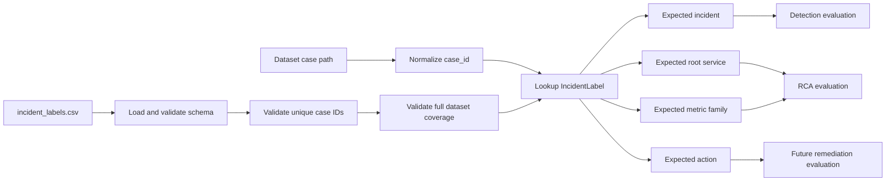

# Incident Label Sheet

## Purpose

`src/aio/evaluate/incident_labels.csv` is the shared expected-result sheet for evaluation dataset cases. It replaces duplicated folder-name inference with an explicit, reviewable input that all three evaluation runners can read.

The committed sheet is an initial weak-label revision generated from dataset folder names. Service and known metric-family labels must be reviewed against authoritative incident descriptions before being treated as final ground truth.

## Schema

| Column | Type | Required | Meaning |
|---|---|---|---|
| `case_id` | string | Yes | Unique dataset-relative POSIX path, for example `RE2-SS/payment_delay/1` |
| `expected_incident` | boolean | Yes | Exactly `true` or `false` |
| `expected_root_service` | string | For incidents | Expected root-cause service |
| `expected_root_metric` | enum/string | No | Known family: `cpu`, `disk`, `error`, `latency`, `mem`, or `socket` |
| `expected_action` | string | No | Expected remediation action when authoritative evidence exists |

Empty optional fields are represented as empty CSV cells, not placeholder values such as `unknown`.

## Current coverage

| Coverage | Count |
|---|---:|
| Dataset cases | 120 |
| Incident labels | 120 |
| Service-level RCA labels | 120 |
| Metric-family labels | 90 |
| Action labels | 0 |

The 30 cases with `_f1`?`_f4` fault names retain service labels but leave metric family empty because that mapping is not known from the directory name. Action labels are empty because this dataset does not provide authoritative remediation outcomes.

## Evaluation flow



## Validation behavior

The loader rejects:

- missing required columns;
- empty, parent-traversing, or duplicate case IDs;
- incident values other than `true` and `false`;
- incident rows without a root service;
- unknown non-empty metric families;
- dataset cases without labels;
- labels that do not correspond to dataset cases.

## Usage

Pass the same sheet to any runner from `src/aio`:

```powershell
.venv\Scripts\python.exe -B evaluate\e2e_pipeline.py `
  --dataset evaluate\dataset `
  --labels evaluate\incident_labels.csv `
  --out ..\..\docs\aiops\eval\e2e_pipeline_report.json
```

The same `--labels` option is supported by:

- `evaluate/naive_threshold_baseline.py`
- `evaluate/service_change_score_baseline.py`
- `evaluate/e2e_pipeline.py`

If `--labels` is omitted, runners retain the previous folder-name inference behavior for backward compatibility.

## Regeneration

Regenerate the initial weak-label revision from folder names:

```powershell
.venv\Scripts\python.exe -B evaluate\generate_incident_labels.py `
  --dataset evaluate\dataset `
  --out evaluate\incident_labels.csv
```

Regeneration overwrites manual review changes, so it should not be used after labels have been curated without first preserving those edits.

