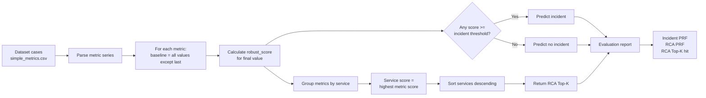

# Naive Threshold Baseline Evaluation

## Purpose

This deliberately simple pipeline is a comparison baseline for the v0.0.3 AIOps detection and RCA pipeline. It answers two questions without using BARO, topology correlation, incident management, or remediation:

1. Is the final point of any metric anomalous relative to its preceding values?
2. Which service has the metric with the highest anomaly score?

It is not intended for production. Its result is a lower-bound reference against which the full pipeline can be evaluated.

## Pipeline



For a metric series `x[0..n]`, the detector uses:

```text
baseline = x[0..n-1]
current  = x[n]
score    = robust_score(baseline, [current])
```

An incident is predicted when at least one metric score is at least `incident_threshold`. RCA groups metrics by service and ranks each service by its highest metric score. The default output contains the top five services.

## Input and labels

Cases are discovered at:

```text
src/aio/evaluate/dataset/<suite>/<fault>/<case>/simple_metrics.csv
```

Expected results are loaded from the shared ground-truth sheet `src/aio/evaluate/incident_labels.csv`. All 120 labeled cases are incidents; the dataset has no normal cases.

## Reproduce with uv

From `src/aio`:

```powershell
uv venv .venv --python 3.13
$env:UV_CACHE_DIR = "C:\Users\husky\Downloads\Capstone3\.uv-cache"
uv pip install --python .venv\Scripts\python.exe "pydantic>=2,<3" "pydantic-settings>=2,<3"

.venv\Scripts\python.exe -B evaluate\naive_threshold_baseline.py `
  --dataset evaluate\dataset `
  --incident-threshold 1.0 `
  --top-k 5 `
  --labels evaluate\incident_labels.csv `
  --out ..\..\docs\aiops\eval\naive_threshold_labeled_report.json
```

## Full-dataset result

Configuration: 120 cases, incident threshold `1.0`, RCA `top_k=5`.

| Metric | Precision | Recall | F1 | TP | FP | FN |
|---|---:|---:|---:|---:|---:|---:|
| Incident detection | 1.0000 | 1.0000 | 1.0000 | 120 | 0 | 0 |
| RCA Top-K service overlap | 0.0617 | 0.3083 | 0.1028 | 37 | 563 | 83 |
| RCA Top-K service + metric hit | 0.2083 | 0.2083 | 0.2083 | 25 | 0 | 95 |

Ground-truth result: [`naive_threshold_labeled_report.json`](naive_threshold_labeled_report.json).

## Interpretation and limitations

- Detecting all 120 incidents does not establish useful precision because there are no normal cases. False-positive rate and true negatives cannot be measured.
- Only 37 of 120 expected root services appeared in the Top-K service results.
- Only 25 of 120 cases matched both expected service and metric family in Top-K, a 20.83% hit rate.
- Final-point ranking ignores temporal patterns, service dependencies, correlated signals, topology, and causal ordering.
- Compare this result with v0.0.3 using the same dataset, labels, threshold policy, and Top-K setting.

## Implementation

Runner: [`src/aio/evaluate/naive_threshold_baseline.py`](../../../src/aio/evaluate/naive_threshold_baseline.py).

