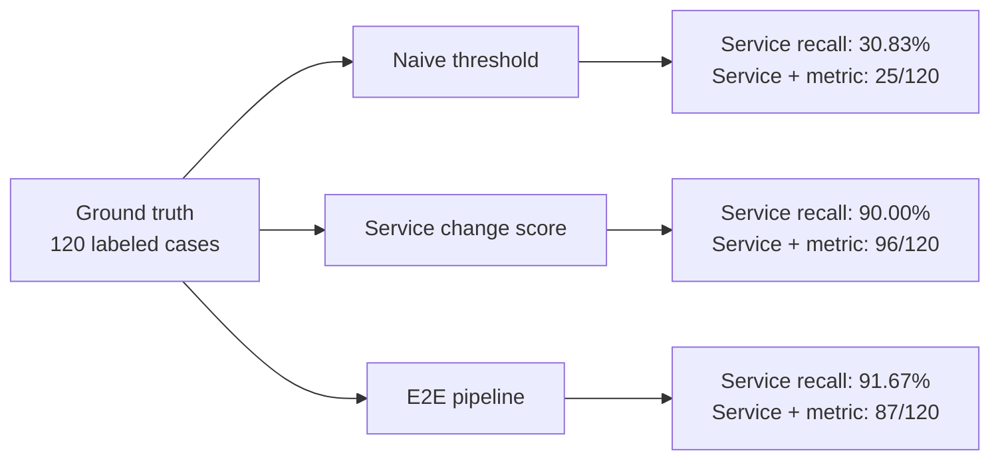

# Ground-Truth Comparison of Three Evaluation Pipelines

## Evaluation setup

All reports use the same 120 cases from RE2-SS and RE3-SS, the same `incident_labels.csv` ground truth, incident threshold `1.0`, and RCA Top-K `5`.

| Pipeline | Result file | Incident detector | RCA ranking |
|---|---|---|---|
| Naive threshold | [`naive_threshold_labeled_report.json`](naive_threshold_labeled_report.json) | Last-point robust score | Highest metric robust score per service |
| Service change score | [`service_change_score_labeled_report.json`](service_change_score_labeled_report.json) | Last-point robust score | Sum of metric last-point changes per service |
| E2E | [`e2e_pipeline_labeled_report.json`](e2e_pipeline_labeled_report.json) | Detector engine | Detector findings, graph traversal, and robust-score RCA |

## Results

| Metric | Naive threshold | Service change score | E2E |
|---|---:|---:|---:|
| Incident F1 | 100.00% | 100.00% | 100.00% |
| RCA Top-K service precision | 6.17% | 18.00% | 18.33% |
| RCA Top-K service recall | 30.83% | 90.00% | 91.67% |
| RCA Top-K service F1 | 10.28% | 30.00% | 30.56% |
| Service + metric hit rate | 20.83% | 80.00% | 72.50% |
| Correct service + metric cases | 25/120 | 96/120 | 87/120 |
| Missed service + metric cases | 95/120 | 24/120 | 33/120 |

## Result overview

## Interpretation

- All three detect all labeled incidents, but the dataset has no normal cases, so false-positive behavior cannot be measured.
- E2E has the best service-level Top-K recall and F1.
- Service change score has the best combined service-and-metric hit rate on this dataset.
- Naive threshold is the weakest lower-bound baseline.
- The reports measure offline incident detection and RCA only; they do not evaluate enrichment, notification, remediation, live self-healing, or verification.

Results are comparable only when the dataset revision, ground-truth sheet, threshold, Top-K, and metric-selection settings remain identical.