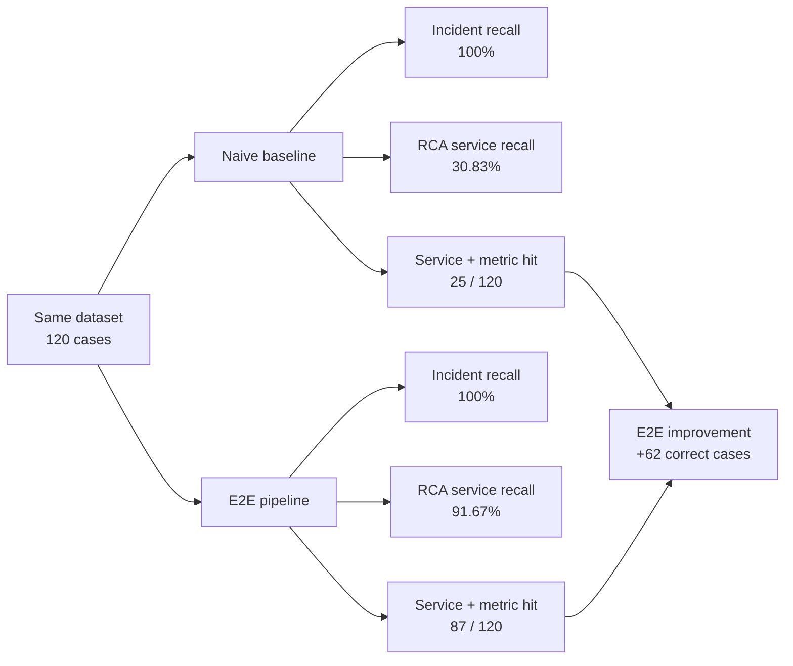

# Naive Baseline vs. E2E Pipeline

## Evaluation setup

Both reports use the same setup, making their results directly comparable.

| Setting | Naive baseline | E2E pipeline |
|---|---:|---:|
| Dataset cases | 120 | 120 |
| Dataset suites | RE2-SS + RE3-SS | RE2-SS + RE3-SS |
| Incident threshold | 1.0 | 1.0 |
| RCA Top-K | 5 | 5 |

Sources: [`naive_threshold_report.json`](naive_threshold_report.json) and [`e2e_pipeline_report.json`](e2e_pipeline_report.json).

## Pipeline differences

| Area | Naive threshold baseline | E2E pipeline |
|---|---|---|
| Purpose | Simple lower-bound comparison | Main anomaly-to-RCA evaluation |
| Incident detection | Final-point `robust_score` and threshold | Same final-point `robust_score` and threshold |
| RCA method | Rank services by highest metric score | `V001RcaEngine`, BARO robust scoring, and dependency evidence |
| BARO | No | Yes |
| Dependency awareness | No | Yes |
| Output schema | Incident PRF, RCA Top-K PRF, RCA hit | Same schema |

The incident detector is effectively the same in both runners. This comparison therefore primarily measures the E2E RCA strategy against naive score ranking.

## Results

| Metric | Naive baseline | E2E pipeline | Absolute change |
|---|---:|---:|---:|
| Incident precision | 100.00% | 100.00% | 0.00 pp |
| Incident recall | 100.00% | 100.00% | 0.00 pp |
| Incident F1 | 100.00% | 100.00% | 0.00 pp |
| RCA Top-K service precision | 6.17% | 18.33% | +12.17 pp |
| RCA Top-K service recall | 30.83% | 91.67% | +60.83 pp |
| RCA Top-K service F1 | 10.28% | 30.56% | +20.28 pp |
| RCA service + metric hit rate | 20.83% | 72.50% | +51.67 pp |
| Correct service + metric cases | 25/120 | 87/120 | +62 cases |
| Missed service + metric cases | 95/120 | 33/120 | -62 cases |

`pp` means percentage points. Values are rounded to two decimal places.

## Result flow

## Interpretation

- Both runners detected all 120 labeled incidents because they use the same final-point robust-score threshold for incident detection.
- E2E placed the expected root service in Top-5 for 110 of 120 cases, compared with 37 of 120 for the baseline.
- Requiring both service and metric family, E2E produced 87 correct cases versus 25 for the baseline: 62 additional correct cases.
- E2E improved service RCA recall by 60.83 percentage points and service-plus-metric hit rate by 51.67 percentage points.
- Service precision is lower than recall because each case returns up to five candidates while only one expected service is labeled; extra candidates count as false positives.

## Limitations

- All cases are incidents. With no normal cases, 100% incident precision cannot measure real false-alert behavior.
- Labels are inferred from directory names rather than a separate authoritative label file.
- This evaluates anomaly decision and RCA, not collection, deduplication, enrichment, remediation, notification, or verification.
- Compare results only when dataset revision, threshold, Top-K, and metric-selection settings are identical.

