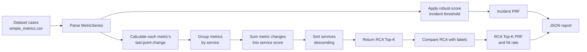

# Service Change Score Baseline Evaluation

## Purpose

This baseline tests whether aggregating changes from multiple metrics in the same service produces useful RCA ranking. It is intentionally cheaper than the BARO and dependency-aware E2E pipeline. Incident detection stays identical to the other evaluators; only RCA ranking changes.

## Scoring method

For every metric series:

```text
metric_change = abs(last_value - mean(previous_values))
```

For each service:

```text
service_score = sum(metric_change for every metric in the service)
```

Services are sorted by score descending and the first five are returned. Metrics inside a service are sorted by their individual contribution.

## Pipeline



## Reproduce

Run from `src/aio` using the existing venv:

```powershell
.venv\Scripts\python.exe -B evaluate\service_change_score_baseline.py `
  --dataset evaluate\dataset `
  --incident-threshold 1.0 `
  --top-k 5 `
  --out ..\..\docs\aiops\eval\service_change_score_report.json
```

Unit tests:

```powershell
.venv\Scripts\python.exe -m unittest tests.test_service_change_score_baseline -v
```

## Full-dataset result

Configuration: RE2-SS + RE3-SS, 120 cases, threshold `1.0`, `top_k=5`.

| Metric | Precision | Recall | F1 | TP | FP | FN |
|---|---:|---:|---:|---:|---:|---:|
| Incident detection | 100.00% | 100.00% | 100.00% | 120 | 0 | 0 |
| RCA Top-K service overlap | 18.00% | 90.00% | 30.00% | 108 | 492 | 12 |
| RCA service + metric hit | 80.00% | 80.00% | 80.00% | 96 | 0 | 24 |

Raw report: [`service_change_score_report.json`](service_change_score_report.json).

## Three-pipeline comparison

| Metric | Naive max score | Service change sum | E2E BARO + graph |
|---|---:|---:|---:|
| Incident recall | 100.00% | 100.00% | 100.00% |
| RCA service precision | 6.17% | 18.00% | 18.33% |
| RCA service recall | 30.83% | 90.00% | 91.67% |
| RCA service F1 | 10.28% | 30.00% | 30.56% |
| Service + metric hit | 20.83% | 80.00% | 72.50% |
| Correct service + metric cases | 25/120 | 96/120 | 87/120 |

Service aggregation substantially improves over selecting only the largest metric score. On this dataset it trades 1.67 percentage points of service recall for 7.50 percentage points more service-plus-metric hits compared with E2E. This shows different ranking behavior, not a universal winner.

## Limitations

- Raw changes are not normalized across metric units, so high-scale metrics can contribute more.
- Summing can favor services that expose more metric series.
- There are no normal cases, so false-alert behavior is not measured.
- Labels are inferred from folder names and contain one expected root service.
- This baseline does not use BARO, topology, dependencies, causal ordering, incident management, remediation, or verification.

## Implementation

Runner: [`src/aio/evaluate/service_change_score_baseline.py`](../../../src/aio/evaluate/service_change_score_baseline.py).

Tests: [`src/aio/tests/test_service_change_score_baseline.py`](../../../src/aio/tests/test_service_change_score_baseline.py).

