# AI MANDATE #7b - API Runtime Live Detection Evidence

## 1. Scope

This document records the clean local live run for `AI MANDATE #7b` using the AIOps API runtime against port-forwarded production-like telemetry.

Primary labeled scenario:

```text
Normal baseline under Locust load -> operator enables local-paymentFailure=50% -> AIOps detects checkout impact -> incident dedup/notification intent -> operator disables fault -> telemetry recovery
```

AIOps ran in `dry-run` mode. The operator manually changed the flag in Flagd Configurator. AIOps did not mutate Kubernetes resources or Flagd state.

## 2. Definition of Done Mapping

- [x] Normal baseline captured before fault with `candidates=0`, `incidents=0`.
- [x] Operator fault injection captured through Flagd UI.
- [x] Detector fired from live Prometheus telemetry.
- [x] First detector fire timestamp and lead-time calculated.
- [x] Incident ID captured through runtime API.
- [x] Dedup shown by stable incident ID with increasing `occurrence_count`.
- [x] Notification intent captured for the same checkout incident.
- [x] User-visible impact captured on SLO dashboard.
- [x] Recovery captured on SLO dashboard.
- [x] Caveats documented for RCA, incident lifecycle, and rolling-24h burn-rate.

## 3. Runtime Configuration

| Field | Value |
| --- | --- |
| Working directory | `src/aio` |
| Runtime command | `python -m uvicorn aiops.api.app:create_app --factory --host 0.0.0.0 --port 8540` |
| API | `http://localhost:8540` |
| Policy mode | `dry-run` |
| Auto-run | `true`, every `5s` |
| Prometheus | `http://localhost:9090` through port-forward |
| Grafana | `http://localhost:3000` through port-forward |
| Jaeger | `http://localhost:16686` through port-forward |
| Kubernetes API | `http://localhost:8001`, read-only enrichment |
| OpenSearch | not used in this run |
| Traffic | Locust `50 users`, ramp/spawn rate `1 user/s`, `10 workers`, about `12.8 RPS` |
| Burn-rate detector in primary clean run | disabled to avoid polluted rolling-24h window from previous tests |

Local `.env` values used for this run:

```env
AIOPS_POLICY_MODE=dry-run
AIOPS_AUTO_RUN_ENABLED=true
AIOPS_AUTO_RUN_INTERVAL_SECONDS=5
AIOPS_PROMETHEUS_BASE_URL=http://localhost:9090
AIOPS_GRAFANA_WEBHOOK_SECRET=local-test-secret
AIOPS_JAEGER_BASE_URL=http://localhost:16686
AIOPS_KUBERNETES_API_URL=http://localhost:8001
AIOPS_OPENSEARCH_BASE_URL=
AIOPS_LIVE_EXECUTOR_URL=
```

The runtime config change for this clean run was limited to disabling `ops01_checkout_slo_burn_rate`. The reason is documented in [Section 10](#10-burn-rate-and-no-spam-caveat).

## 4. Baseline

Baseline was taken under steady Locust load before enabling the fault.

| Field | Evidence |
| --- | --- |
| Locust users | `50` users, `10` workers |
| Locust failures | `0%` |
| Checkout error ratio | `0%` on Grafana baseline |
| AIOps detector candidates | `0` |
| AIOps incidents | `0` |
| RCA root causes | `0` |

Runtime baseline proof:

```text
2026-07-24 01:00:54.255 +07
AIOPS_DEDUP_RESULT input_candidates=0 incidents=0 ids=[] services=[] occurrences=[]
AIOPS_BLOCK rca anomalies=0 root_causes=[]
AIOPS_RUN_END candidates=0 incidents=0 root_causes=0
```


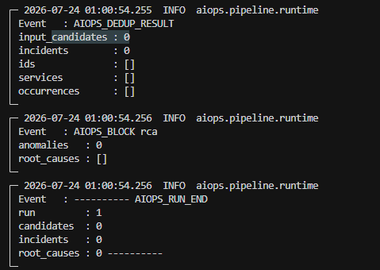

## 5. Fault Injection

The operator enabled `local-paymentFailure` at `50%`.

| Field | Value |
| --- | --- |
| Fault | `local-paymentFailure` |
| Fault value | `50%` |
| Owner/method | Operator through Flagd Configurator UI |
| Fault start timestamp | `2026-07-24 01:03:03.077 +07` |
| Expected affected service | `checkout` |
| Expected dependency | `payment` |


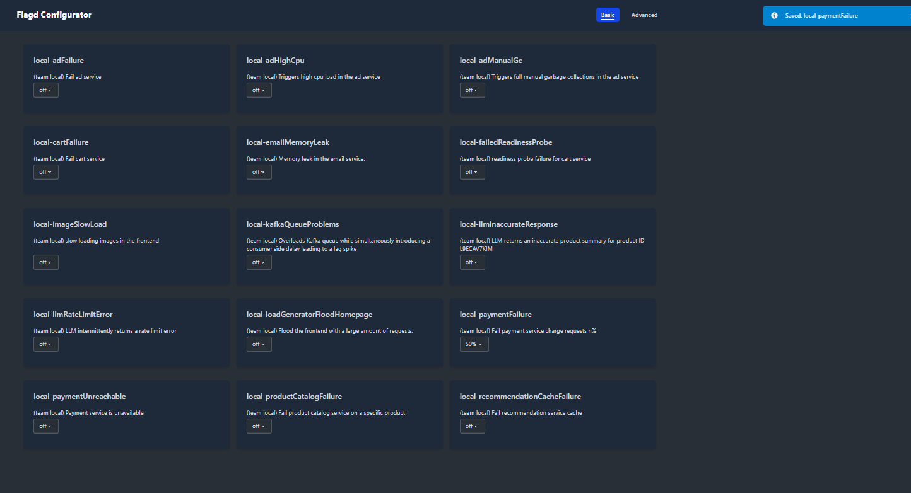

## 6. Detector Fire and Lead-Time

First detector fire:

```text
2026-07-24 01:06:28.494 +07 WARNING aiops.detectors.threshold
AIOPS_DETECT threshold_fire
  detector  : auto_checkout_error_rate
  signal    : checkout_error_rate_5m
  value     : 0.07857711542847343
  threshold : 0.05
  service   : checkout
  severity  : SEV2
```

Lead-time:

```text
lead_time = 01:06:28.494 - 01:03:03.077
          = 205.417 seconds
          ~= 3 minutes 25 seconds
```

| Detector | Signal | Observed | Threshold | Severity | Incident |
| --- | --- | ---: | ---: | --- | --- |
| `auto_checkout_error_rate` | `checkout_error_rate_5m` | `7.86%` | `5%` | `SEV2` | `inc-b3d92ea50475` |

The same runtime cycle also enqueued notification intent for the same checkout incident:

```text
AIOPS_NOTIFY_ENQUEUED_READY
  incident : inc-b3d92ea50475
  service  : checkout
  severity : SEV2
  runbook  : RB-SERVICE-ERROR-RATE
  status   : pending
```


## 7. Incident API and Dedup

First incident API snapshot:

| Field | Value |
| --- | --- |
| `incident_id` | `inc-b3d92ea50475` |
| `state` | `open` |
| `severity` | `SEV2` |
| `flow` | `checkout` |
| `service` | `checkout` |
| `detector` | `auto_checkout_error_rate` |
| `occurrence_count` | `4` |

Later snapshot:

| Field | Value |
| --- | --- |
| `incident_id` | `inc-b3d92ea50475` |
| `occurrence_count` | `9` |
| detector events | same `auto_checkout_error_rate` signal |

Dedup result: `PASS`. The detector fired across multiple cycles while the fault was active, but the runtime kept the same incident ID and increased `occurrence_count` instead of creating duplicate checkout incidents.


## 8. User-Visible Impact

During the fault, the Webstore SLO dashboard showed checkout success degraded below the official SLO.

| Metric | Value |
| --- | ---: |
| Checkout success rate | `63.9%` |
| Checkout SLO | `>= 99.0%` |
| Checkout p95 latency | `132 ms` |
| Checkout p99 latency | `368 ms` |

This is the user-visible impact evidence for the injected checkout/payment fault.


## 9. Recovery

The operator disabled `local-paymentFailure`.

| Field | Value |
| --- | --- |
| Fault disabled timestamp | `2026-07-24 01:10:46.173 +07` |
| Recovery dashboard captured | approx. `2026-07-24 01:17:03 +07` |
| Recovery time from fault disabled | approx. `376.827 seconds` (`6m17s`) |
| Checkout success rate after recovery | `100%` |
| Checkout p95 after recovery | `350 ms` |
| Checkout p99 after recovery | `775 ms`, below `1s` |

Telemetry recovery result: `PASS`.


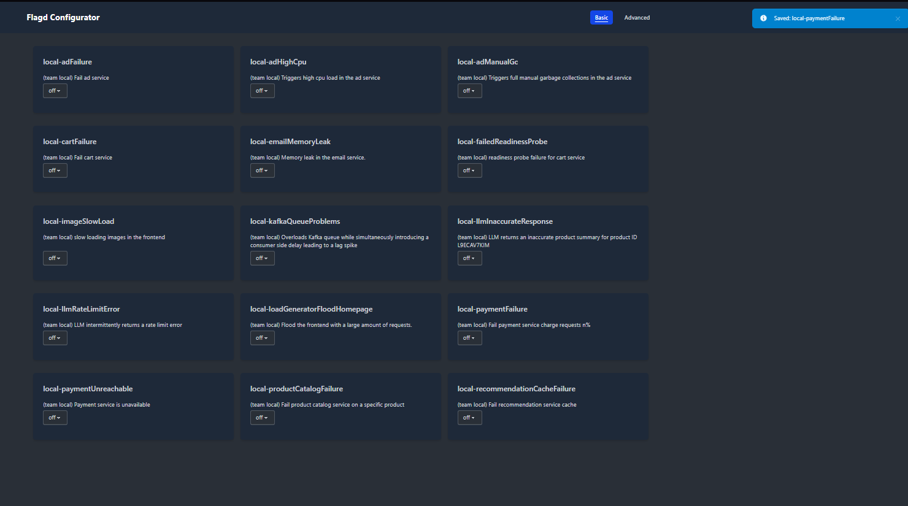

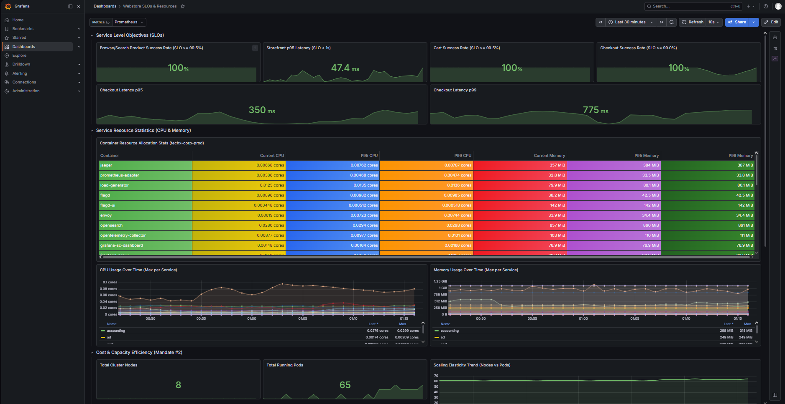

## 10. Burn-Rate and No-Spam Caveat

The mandate asks for impact-based alerting, including burn-rate and no-spam behavior. This clean run intentionally did **not** use `checkout_error_budget_burn_rate_24h` as the primary detector because previous fault tests remained in Prometheus's rolling 24h window. At baseline, the 24h burn-rate still exceeded `1x`, which would have created a false baseline incident for this clean labeled run.

For this run:

- Primary detection was based on the live 5m checkout error-rate detector.
- User-visible impact was proven by checkout SLO success dropping to `63.9%`.
- No duplicate checkout incident IDs were created; `inc-b3d92ea50475` was deduped from occurrence `4` to `9` and later `12`.
- The rolling-24h burn-rate result should be documented separately as supplemental evidence, not as the primary clean-run detector.

Recommended wording for Jira:

```text
The rolling-24h burn-rate detector was excluded from the clean labeled run because previous tests remained inside the 24h Prometheus window. The labeled run uses 5m checkout error-rate for first-fire/lead-time and the SLO dashboard for impact. Burn-rate is tracked as a supplemental impact-based signal and should be retested on a clean Prometheus window or with a shorter demo window.
```

## 11. RCA and Incident Lifecycle Caveats

RCA produced an unexpected `recommendation` root-cause candidate after the checkout incident. This is not counted as the true positive for the injected `local-paymentFailure` case.

Post-recovery API also showed incidents still in `state=open`. Therefore, telemetry recovery is proven, but automatic incident resolution is not claimed.

| Caveat | Evidence | Submission treatment |
| --- | --- | --- |
| RCA unexpected service | `recommendation` root cause | record as caveat; do not count as TP |
| Incident lifecycle | checkout incident still `open` after telemetry recovery | record as caveat; recovery claim is telemetry-only |
| Burn-rate 24h | previous test data polluted rolling window | supplemental only for this clean run |

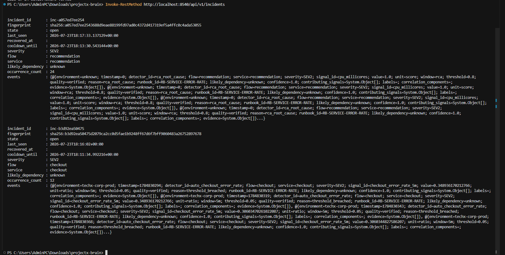

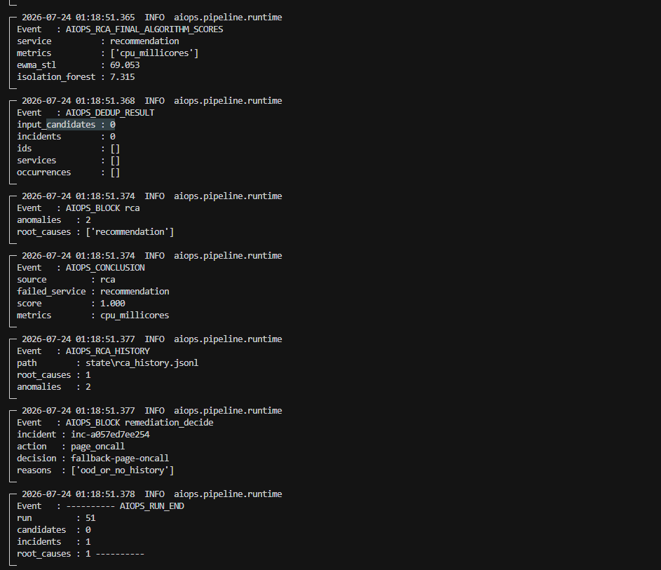


## 12. Supplemental Expanded-Service Proof

This supplemental run proves detector coverage beyond the primary checkout/payment labeled scenario. It used a separate clean state store and is **excluded** from the primary `K=1` precision/recall calculation.

| Field | Value |
| --- | --- |
| Supplemental fault | `local-cartFailure` |
| Fault start timestamp | `2026-07-24 01:38:51.933 +07` |
| Detector | `auto_cart_latency_p99` |
| Signal | `cart_p99_latency_5m` |
| Observed value | `3.0866666666666718s` |
| Threshold | `1s` |
| Service | `cart` |
| Severity | `SEV1` |
| Incident | `inc-c7f94b1816a6` |
| Incident occurrence count | `2` |

The Webstore SLO dashboard also showed `Cart Success Rate = 97.2%`, below its `>=99.5%` SLO. After disabling the flag, cart success returned to `100%`. This demonstrates a second live service path (`cart`) with detector fire, incident creation, and telemetry recovery.

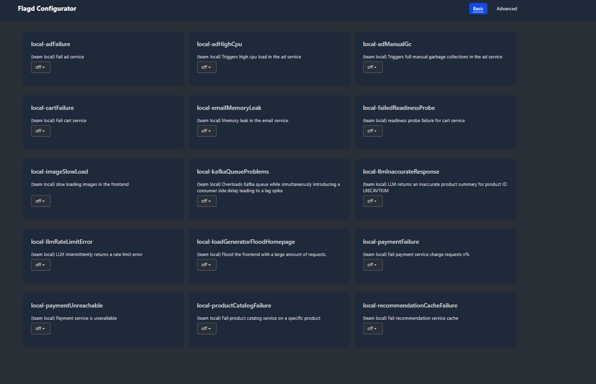

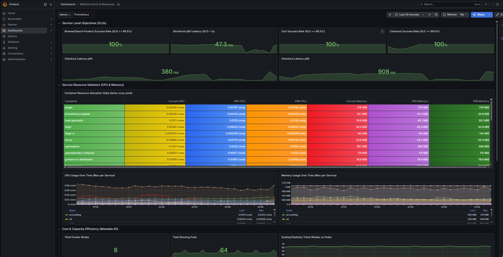

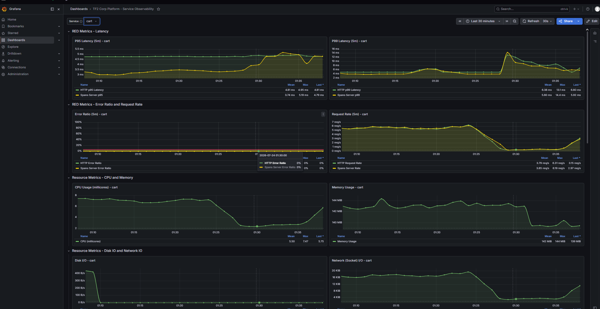


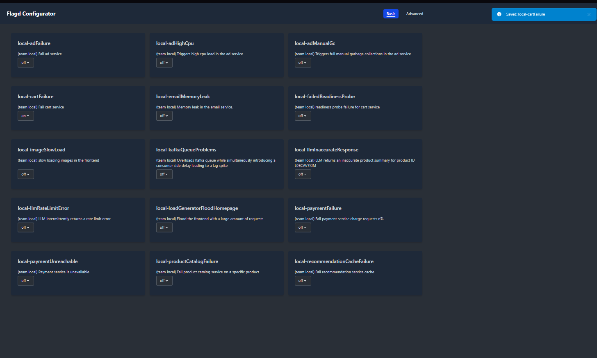


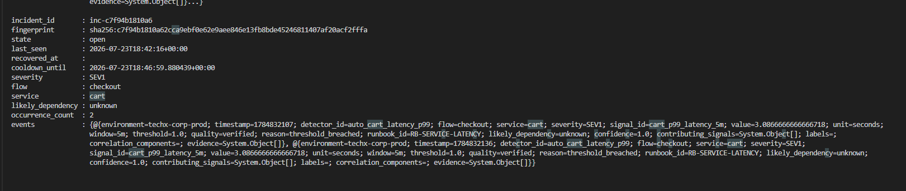


## 13. Labeled Set and Metrics

Definitions from mandate:

```text
recall = caught injected incidents / K
precision = correct fires / total fires
lead-time = first detector fire time - fault start time
```

Labeled cases for this clean run:

| Case | Ground truth | Window | Expected | Result |
| --- | --- | --- | --- | --- |
| `01` | Normal baseline | before `01:03:03.077 +07` | no detector incident | `TN` |
| `02` | `local-paymentFailure=50%` | `01:03:03.077` to `01:10:46.173 +07` | checkout/payment impact | `TP`, caught by checkout error-rate |
| `03` | Recovery | after `01:10:46.173 +07` | telemetry returns normal | `PASS`, telemetry recovered |

Metric summary:

| Metric | Value | Formula / note |
| --- | ---: | --- |
| Injected incidents `K` | `1` | one labeled fault |
| Caught incidents | `1` | checkout error-rate detector fired |
| False negatives | `0` | `K - caught` |
| Incident recall | `100%` | `1 / 1` |
| Primary detector precision | `100%` | `1 correct primary fire / 1 primary labeled fire` |
| Conservative precision with RCA caveat | `50%` | checkout TP + unexpected RCA caveat |
| Lead-time | `205.417s` | first fire - fault start |
| Recovery time | `~376.827s` | recovery dashboard capture - fault disabled |
| RCA payment hit | `False` | RCA did not identify `payment` |

Because `K=1`, these metrics are preliminary and not statistically broad. They are sufficient as a live working proof for #7b but should not be presented as production-quality model evaluation.

## 14. Evidence Index

| File | Purpose |
| --- | --- |
| `04c-baseline-checkout-grafana-50u.png` | Baseline checkout Grafana at 50 users |
| `04d-baseline-locust-50u.png` | Locust 50 users, 0% failures |
| `05b-baseline-runtime-clean-50u.png` | Runtime baseline, `candidates=0`, `incidents=0` |
| `06a-fault-start-timestamp.png` | Fault start timestamp |
| `06b-flagd-before-payment-failure-off.png` | Flagd before fault |
| `06c-flagd-payment-failure-50.png` | Flagd fault enabled at 50% |
| `07b-detector-fired-checkout-error-rate-clean.png` | Checkout error-rate detector fire and notification intent |
| `08b-incident-api-checkout-error-rate-occurrence4.png` | Incident API first snapshot |
| `11b-dedup-repeat-checkout-occurrence9-with-rca-caveat.png` | Dedup repeat and RCA caveat |
| `12c-fault-slo-dashboard-checkout-success-639.png` | User-visible checkout SLO impact |
| `13a-fault-disabled-timestamp.png` | Fault disabled timestamp |
| `13b-flagd-payment-failure-off-clean.png` | Flagd fault disabled |
| `14d-recovery-slo-dashboard-checkout-100.png` | Recovery dashboard |
| `14e-post-recovery-incident-api-open-caveat.png` | Incident lifecycle caveat |
| `14f-post-recovery-rca-recommendation-caveat.png` | RCA caveat |
| `17a-expanded-cart-flag-before-off.png` | Supplemental cart flag baseline |
| `17b-expanded-cart-slo-baseline-healthy.png` | Supplemental healthy SLO baseline |
| `17c-expanded-cart-observability-baseline.png` | Supplemental cart observability baseline |
| `17d-expanded-cart-fault-start-timestamp.png` | Supplemental cart fault timestamp |
| `17e-expanded-cart-flag-enabled.png` | Supplemental cart flag enabled |
| `17f-expanded-cart-fault-slo-impact.png` | Supplemental cart SLO impact |
| `17g-expanded-cart-detector-fired.png` | Supplemental cart detector fire |
| `17h-expanded-cart-incident-api.png` | Supplemental cart incident API |
| `17i-expanded-cart-flag-disabled.png` | Supplemental cart flag disabled |
| `17j-expanded-cart-recovery-slo-dashboard.png` | Supplemental cart recovery SLO dashboard |
| `17k-expanded-cart-recovery-observability.png` | Supplemental cart recovery observability |

## 15. Reproduce

Terminal 1 - port-forward dependencies:

```powershell
cd C:\Users\AdminPC\Downloads\projectx-brain\tf2-corp-platform\src\aio
if (-not (Test-Path .env)) {
    Copy-Item .env.example .env
}
powershell -File scripts\port_forward.ps1
```

Terminal 2 - run AIOps API runtime:

```powershell
cd C:\Users\AdminPC\Downloads\projectx-brain\tf2-corp-platform\src\aio
.\.venv\Scripts\activate
python -m uvicorn aiops.api.app:create_app --factory --host 0.0.0.0 --port 8540
```

Terminal 3 - verify runtime:

```powershell
Invoke-RestMethod http://localhost:8540/health/ready
Invoke-RestMethod http://localhost:8540/api/v1/incidents
```

Run flow:

1. Start Locust with `50` users and ramp/spawn rate `1 user/s`.
2. Wait for a normal baseline and confirm `AIOPS_DEDUP_RESULT input_candidates=0 incidents=0`.
3. Record timestamp with `Get-Date -Format "yyyy-MM-dd HH:mm:ss.fff zzz"`.
4. In Flagd Configurator, set `local-paymentFailure=50%`.
5. Capture first `AIOPS_DETECT threshold_fire` for `auto_checkout_error_rate`.
6. Call `GET /api/v1/incidents` and capture incident ID and occurrence count.
7. Wait more cycles and capture dedup with the same incident ID and higher occurrence count.
8. Capture SLO impact dashboard.
9. Set `local-paymentFailure=off`, record timestamp, and capture recovery dashboard.

## 16. Jira Paste Block

```text
AI MANDATE #7b - API runtime live proof

- Runtime: local AIOps API on http://localhost:8540, Prometheus/Grafana/Jaeger/K8s through port-forward
- Mode: dry-run; no Kubernetes or Flagd mutation by AIOps
- Traffic: Locust 50 users, ramp 1 user/s, 10 workers, about 12.8 RPS, 0% failures during baseline
- Baseline: 2026-07-24 01:00:54 +07; AIOPS_DEDUP_RESULT input_candidates=0 incidents=0; root_causes=[]
- Fault: local-paymentFailure=50%, operator enabled through Flagd
- Fault start: 2026-07-24 01:03:03.077 +07
- First detector fire: 2026-07-24 01:06:28.494 +07
- Lead-time: 205.417s (~3m25s)
- Detector: auto_checkout_error_rate on checkout_error_rate_5m, value 0.078577 > threshold 0.05, SEV2
- Incident: inc-b3d92ea50475, service checkout, runbook RB-SERVICE-ERROR-RATE
- Notification intent: AIOPS_NOTIFY_ENQUEUED_READY for inc-b3d92ea50475, status pending
- Dedup/no duplicate ID: same incident inc-b3d92ea50475, occurrence_count 4 -> 9 -> 12
- Impact: checkout success dropped to 63.9% against SLO >=99.0%
- Fault disabled: 2026-07-24 01:10:46.173 +07
- Recovery: checkout success 100%, p95 350ms, p99 775ms (<1s), captured around 01:17 +07
- Recall: 100% on K=1 labeled injected incident
- Primary precision: 100% for labeled detector fire; conservative precision 50% if counting unexpected RCA recommendation as FP
- Supplemental expanded-service proof: local-cartFailure produced auto_cart_latency_p99 on cart_p99_latency_5m, value 3.0867s > 1s, incident inc-c7f94b1816a6; cart SLO recovered to 100%; excluded from primary K=1 precision/recall
- Caveats: RCA produced recommendation root-cause instead of payment; incident state remains open after telemetry recovery; rolling-24h burn-rate excluded from primary clean run because previous tests polluted the 24h window
- Evidence: docs/aiops/evidence/MANDATE-07b-api-runtime-draft.md and linked screenshots in docs/aiops/evidence
```

## 17. Conclusion

The clean run demonstrates that the AIOps runtime detected a live checkout-impacting injected fault from Prometheus telemetry, created a stable checkout incident, deduped repeated detections, recorded notification intent, and showed user-visible SLO degradation followed by telemetry recovery. The main limitations are RCA quality, lack of automatic incident resolution, and the fact that rolling-24h burn-rate needs a clean Prometheus window or shorter demo window before it can be used as primary labeled-run evidence.