# AI MANDATE #7b — API Runtime Live Detection Evidence

## 1. Mục tiêu

Tài liệu này ghi bằng chứng chạy thật cho `AI MANDATE #7b` trên nhánh
`feat/aio/v0.0.5`. Detector được giữ chạy liên tục trong luồng:

```text
Baseline bình thường → bật fault qua flagd → detection/dedup → tắt fault → recovery
```

AIOps chạy ở chế độ `dry-run`; operator là người duy nhất bật/tắt fault. Không có
Kubernetes mutation hoặc flagd mutation do AIOps thực hiện.

## 2. Definition of Done

- [x] Có normal baseline trước fault và đo false-positive incident.
- [x] Operator bật fault qua flagd, có ảnh và timestamp.
- [x] Detector phát hiện fault từ Prometheus telemetry thật.
- [x] Có timestamp detector kêu lần đầu và lead-time.
- [x] Có incident ID và bằng chứng dedup qua nhiều chu kỳ.
- [x] Có notification intent và bằng chứng chống spam.
- [x] Có dashboard trong fault và sau recovery.
- [x] Có labeled incident case và normal window để tính recall/precision sơ bộ.
- [x] Có caveat trung thực cho RCA, false positive và incident lifecycle.

## 3. Runtime Configuration

| Field | Giá trị |
| --- | --- |
| Branch/commit | `feat/aio/v0.0.5 @ 8f1d1e8` + local burn-rate changes; commit link pending |
| Working directory | `C:\Users\husky\Downloads\Capstone3\tf2-corp-platform\src\aio` |
| Entrypoint | `src/aio/aiops/api/app.py` |
| Environment | `src/aio/.env.live` |
| API | `http://localhost:8540` |
| Auto-run / interval | `true` / `5 seconds` |
| Policy | `dry-run` |
| Prometheus / Grafana | `http://localhost:9090` / `http://localhost:3000` |
| Jaeger | Used for trace enrichment at `http://localhost:16686/jaeger/ui` |
| OpenSearch | Not used; credentials intentionally blank |
| Kubernetes | Read-only enrichment through `http://localhost:8001` |
| Traffic | Existing `load-generator`/Webstore traffic |

```powershell
cd C:\Users\husky\Downloads\Capstone3\tf2-corp-platform\src\aio
$env:AIOPS_ENV_FILE = ".env.live"
.\.venv\Scripts\python.exe -m uvicorn aiops.api.app:create_app `
  --factory --host 0.0.0.0 --port 8540
```

**Port-forward và runtime dependencies sẵn sàng:**

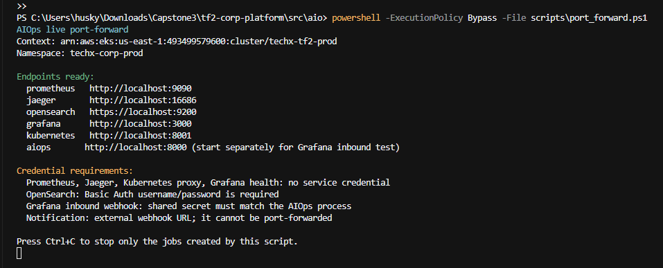

## 4. Scenario và Timeline

| Field | Giá trị thực tế |
| --- | --- |
| Fault | `local-paymentFailure` |
| Injection owner/method | Operator / Flagd Configurator UI |
| Fault percentage | `50%` |
| Expected affected service/root cause | `checkout/payment` |
| Runtime và baseline started | `2026-07-23 12:37:58.645 +07` |
| Baseline ended / fault enabled | `2026-07-23 12:47:18 +07` |
| First detector fire | `2026-07-23 12:51:37.852 +07` |
| Fault disabled | `2026-07-23 12:56:59 +07` |
| Recovery confirmed from telemetry | `2026-07-23 13:07:44 +07` |

## 5. Normal Baseline

Normal baseline được quan sát khoảng `9m19s` trước khi bật fault.

| Field | Giá trị |
| --- | --- |
| Detector candidates / incidents | `0 / 0` |
| Actionable false-positive incidents | `0` |
| Checkout success / error ratio | `100% / 0%` |
| Checkout p95 / p99 | Khoảng `400 ms / 840 ms` |

```text
2026-07-23 12:42:30.471 INFO aiops.pipeline.runtime
AIOPS_DEDUP_RESULT input_candidates=0 incidents=0 ids=[] services=[] occurrences=[]
```

Baseline có non-actionable RCA/anomaly noise cho `product-reviews` và
`fraud-detection`, nhưng không tạo candidate hoặc incident. Vì vậy false-positive
**incident** trong normal window là `0`; RCA noise được ghi nhận riêng.

Evidence: `04-baseline-dashboard.png`, `04b-baseline-slo-dashboard.png`,
`05-baseline-runtime.png`.

**Baseline dashboard:**

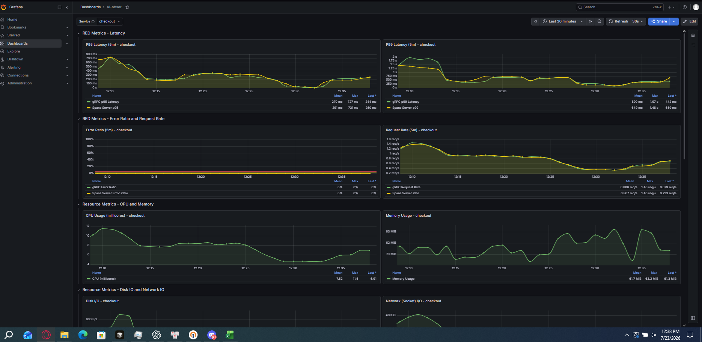

**Baseline SLO dashboard:**

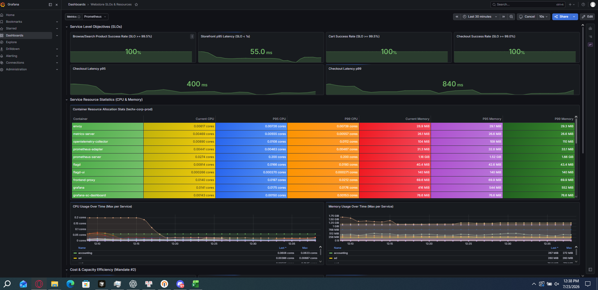

**Runtime không tạo candidate/incident trong baseline:**

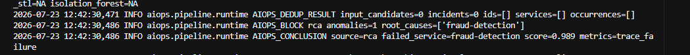

## 6. Fault Active và Detector Result

Operator bật `local-paymentFailure=50%` lúc `12:47:18 +07`. Runtime,
port-forward, traffic và Prometheus query tiếp tục chạy.

```text
2026-07-23 12:51:37.852 WARNING aiops.detectors.threshold
AIOPS_DETECT threshold_fire detector=auto_checkout_error_rate
signal=checkout_error_rate_5m value=0.3360326154066231
threshold=0.05 service=checkout severity=SEV2

2026-07-23 12:51:37.852 WARNING aiops.detectors.threshold
AIOPS_DETECT threshold_fire detector=auto_checkout_latency_p99
signal=checkout_p99_latency_5m value=1.7590005000000002
threshold=1.0 service=checkout severity=SEV1

2026-07-23 12:51:37.859 INFO aiops.pipeline.runtime
AIOPS_BLOCK detect candidates=2
ids=['auto_checkout_error_rate', 'auto_checkout_latency_p99']
```

| Detector | Signal | Observed | Threshold | Severity | Incident |
| --- | --- | ---: | ---: | --- | --- |
| `auto_checkout_error_rate` | `checkout_error_rate_5m` | `33.60%` | `5%` | `SEV2` | `inc-b3d92ea50475` |
| `auto_checkout_latency_p99` | `checkout_p99_latency_5m` | `1.759 s` | `1.0 s` | `SEV1` | `inc-8cd6d19cc778` |

Incident API snapshot:

```json
[
  {"incident_id":"inc-8cd6d19cc778","state":"open","severity":"SEV1","service":"checkout","occurrence_count":4},
  {"incident_id":"inc-b3d92ea50475","state":"open","severity":"SEV2","service":"checkout","occurrence_count":2}
]
```

Dashboard trong fault:

| Metric | Giá trị |
| --- | --- |
| Checkout success rate | `57.8%` |
| Error ratio | Khoảng `18.5%` tại thời điểm chụp |
| Checkout p95 / p99 | Khoảng `695 ms / 1.52 s` |

Evidence: `06-flag-enabled.png`, `07-detector-fired.png`, `08-incident-api.png`,
`12-fault-dashboard.png`, `12b-fault-slo-dashboard.png`.

**Operator bật fault qua Flagd:**

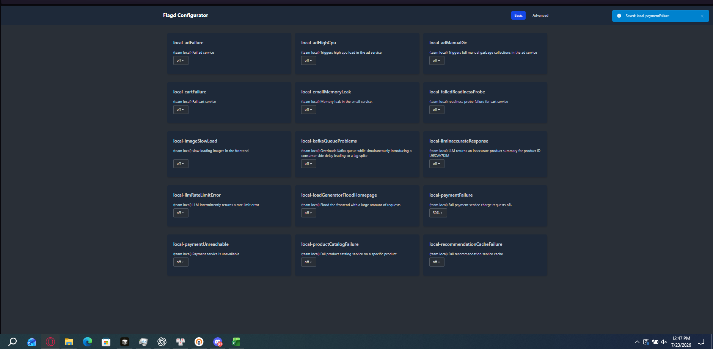

**Detector phát hiện hai checkout signals:**

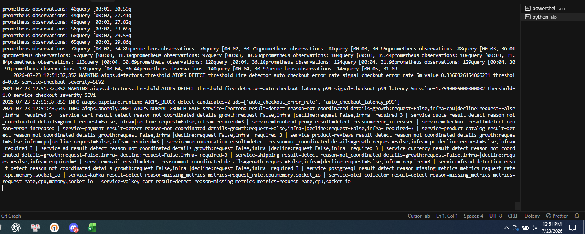

**Incident API trong fault window:**

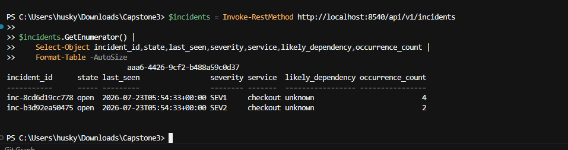

**Grafana trong fault window:**

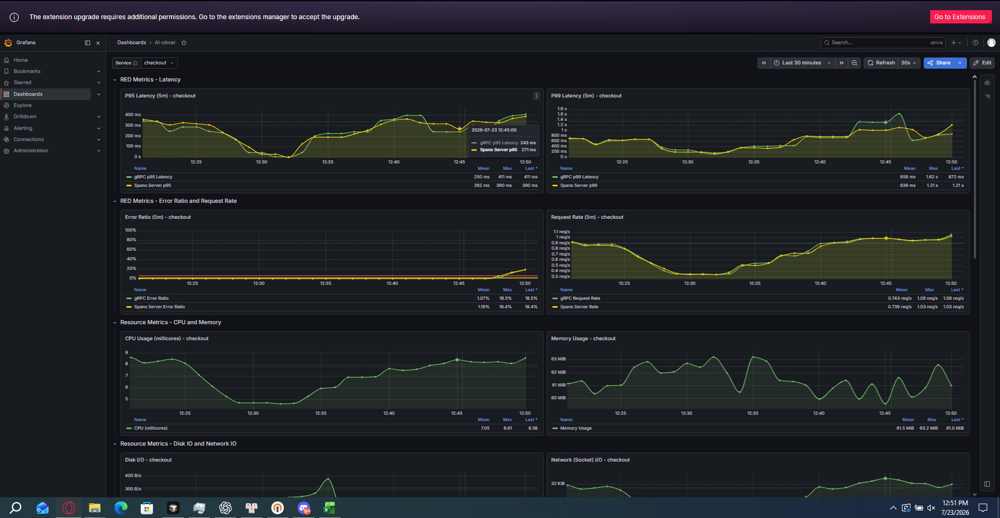

**User-visible SLO impact:**

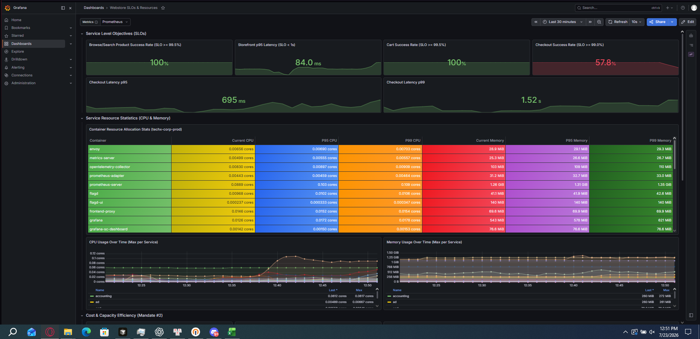

## 7. Lead-Time

```text
lead_time = 12:51:37.852 - 12:47:18
          = 259.852 seconds
          ≈ 4 minutes 20 seconds
```

Timestamp source: Flagd screenshot capture time và runtime log.

## 8. Dedup và chống spam

| Incident | Detector | Snapshot 1 | Snapshot 2 |
| --- | --- | ---: | ---: |
| `inc-8cd6d19cc778` | `auto_checkout_latency_p99` | `4` | `6` |
| `inc-b3d92ea50475` | `auto_checkout_error_rate` | `2` | `4` |

Hai signal giữ nguyên hai incident ID, chỉ tăng `occurrence_count`; không tạo ID
mới mỗi cycle. Dedup result: `PASS`.

Evidence: `08-incident-api.png`, `11-dedup-repeat.png`.

**Cùng incident IDs, occurrence count tăng qua các cycle:**

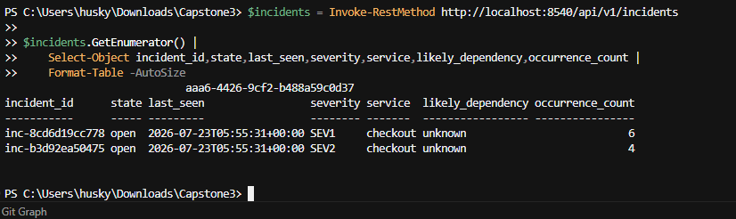

## 9. Impact-based Alerting, RCA và Safety

Impact-based severity:

- `SEV1`: checkout p99 vượt SLO `1 s`.
- `SEV2`: checkout error rate vượt `5%`.
- User-visible impact: checkout success giảm còn `57.8%`.

Notification intent:

```text
2026-07-23 13:32:58.965 INFO aiops.pipeline.runtime
AIOPS_NOTIFY_READY incident=inc-97d2a7043a2b service=checkout
severity=SEV1 runbook=RB-SERVICE-LATENCY route=outbox status=pending
```

Log trên chứng minh notification intent đã đi qua pipeline cho đúng service `checkout`. External webhook không được cấu hình nên `route=outbox status=pending` là kết quả mong đợi; đây không phải bằng chứng gửi thành công tới kênh bên ngoài. Incident API xác nhận `inc-97d2a7043a2b` thuộc detector `auto_checkout_latency_p95`, signal `checkout_p95_latency_5m`, với `value=1.42443139027033s > threshold=1s`, severity `SEV1` và `occurrence_count=3`. Incident này xuất hiện ở runtime cycle sau hai incident ban đầu và sau mốc telemetry recovery đã ghi, vì vậy nó chỉ được dùng làm bằng chứng notification pipeline cho service `checkout`; không được tính thêm là correct fire của injected case và không được đồng nhất với `inc-8cd6d19cc778` hoặc `inc-b3d92ea50475`.

### Burn-rate live E2E proof

Official checkout SLO là success `>=99.0%`, nên error budget là `1%` (`0.01`) trên rolling `24h`. Runtime thu signal dẫn xuất:

```text
checkout_error_budget_burn_rate_24h = checkout_bad_ratio_24h / 0.01
```

Live Prometheus và pipeline run lúc `2026-07-23 14:34:44 +07` trả `8.320836872333707x`, vượt threshold `1x`:

```text
AIOPS_DETECT threshold_fire detector=ops01_checkout_slo_burn_rate
signal=checkout_error_budget_burn_rate_24h value=8.320836872333707
threshold=1.0 service=checkout severity=SEV1

AIOPS_NOTIFY_ENQUEUED_READY incident=inc-ca09d8e8a247 service=checkout
severity=SEV1 runbook=RB-CHECKOUT-SLO status=pending

AIOPS_NOTIFY_READY incident=inc-ca09d8e8a247 service=checkout
severity=SEV1 runbook=RB-CHECKOUT-SLO route=outbox status=pending
```

Cycle thứ hai dùng cùng state store vẫn giữ `inc-ca09d8e8a247`, tăng `occurrence_count` từ `1` lên `2` và không enqueue notification burn-rate lần hai trong cooldown:

```text
AIOPS_DEDUP_RESULT ids=['inc-ca09d8e8a247']
services=['checkout'] occurrences=[2]
```

Kết quả: live calculation `PASS`, threshold detection `PASS`, incident/notification intent `PASS`, dedup/no-spam `PASS`. External webhook không cấu hình nên `outbox pending` là mong đợi. Không có live mutation.

Evidence: [`16-burn-rate-live-e2e.log`](./16-burn-rate-live-e2e.log). Ảnh terminal có thể bổ sung sau nhưng log artifact đã chứa timestamp và chuỗi E2E kiểm chứng được.

### Multi-service live proof

Runtime cycle `run=84` lúc `2026-07-23 14:02:57 +07` tạo threshold fires trên hai service:

| Service | Detector/signal | Observed | Threshold | Kết luận |
| --- | --- | ---: | ---: | --- |
| `checkout` | `auto_checkout_latency_p95` / `checkout_p95_latency_5m` | `2.388 s` | `1 s` | Live detector fire |
| `checkout` | `auto_checkout_latency_p99` / `checkout_p99_latency_5m` | `4.388 s` | `1 s` | Live detector fire |
| `frontend-proxy` | `auto_frontend_proxy_latency_p99` / `frontend_proxy_p99_latency_5m` | `1.181 s` | `1 s` | Live detector fire, unlabeled |

Bằng chứng này xác nhận runtime detector hoạt động trên nhiều service (`checkout` và `frontend-proxy`). Ground truth được inject chỉ là `local-paymentFailure` cho luồng `checkout/payment`; không có labeled fault riêng cho `frontend-proxy`. Vì vậy fire `frontend-proxy` được ghi là **unexpected/unlabeled**, không được dùng để tăng true positive, recall hoặc precision và không được tuyên bố là root cause.

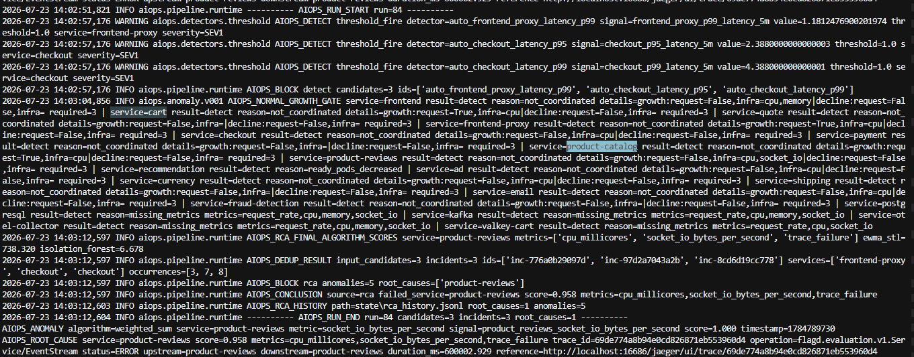

`cart` error-rate và `product-catalog` CPU saturation vẫn có trong thiết kế/implementation #7a nhưng chưa có live injection proof trong run này.
| Safety field | Kết quả |
| --- | --- |
| Policy mode | `dry-run` |
| Live mutation | `No` |
| Flagd mutation by AIOps | `No`; operator bật/tắt |
| Kubernetes | Read-only; checkout `2/2` ready, `0` restarts trong incident evidence |
| Jaeger | Có trace references trong enrichment |
| OpenSearch | `N/A`; không cấu hình credentials |

### RCA caveat

RCA không xác định đúng labeled root cause `payment`. RCA xếp hạng
`recommendation`, `ad` hoặc `product-reviews`; incident có
`likely_dependency=unknown`.

```text
RCA top-k hit for payment: false
Detector hit for affected checkout service: true
```

Evidence: `10a-checkout-notify-ready.png`, `10b-checkout-notification-incident-api.png`, `14c-recovery-api-caveat.png`.

**Checkout notification intent:**

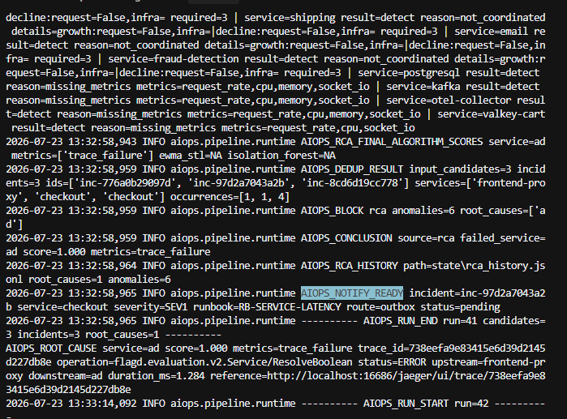

**Notification incident mapped to checkout p95 detector:**

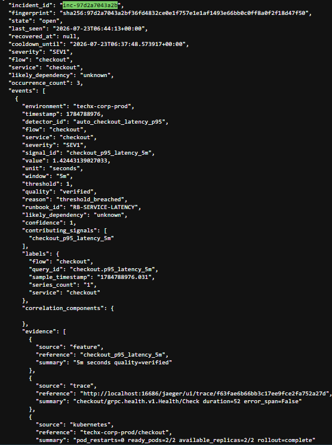

## 10. Recovery

| Field | Giá trị |
| --- | --- |
| Fault disabled | `2026-07-23 12:56:59 +07` |
| Recovery confirmed | `2026-07-23 13:07:44 +07` |
| Recovery time | `645 seconds` (`10m45s`) |
| Checkout success / error ratio | `100% / 0%` current |
| Checkout p95 | Khoảng `426–630 ms` |
| Checkout p99 | Khoảng `795–824 ms`, dưới threshold `1 s` |
| Telemetry recovery | `PASS` |

Prometheus/Grafana telemetry đã hồi phục, nhưng incident API vẫn để
`state=open`, `recovered_at=null`. Một `frontend-proxy SEV1` xuất hiện trong
residual/recovery window. Đây là unexpected fire và incident lifecycle caveat,
không phải bằng chứng checkout metric chưa recovery.

Evidence: `13-flag-disabled.png`, `14a-recovery-in-progress.png`,
`14-recovery-dashboard.png`, `14b-recovery-slo-dashboard.png`,
`14c-recovery-api-caveat.png`.

**Operator tắt fault:**

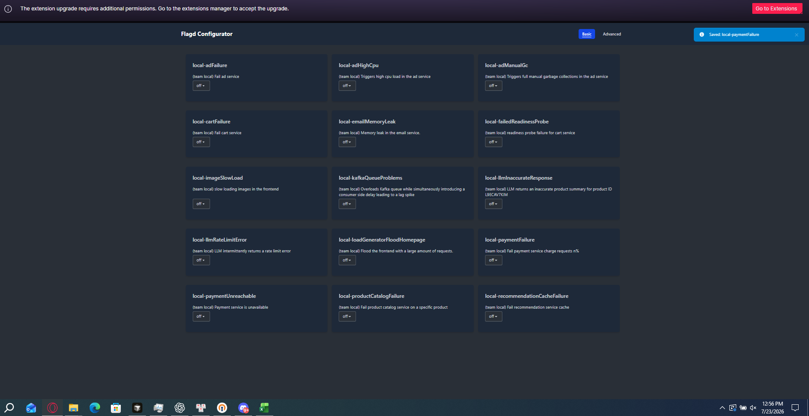

**Telemetry đang hồi phục:**


**Incident API trong recovery window:**

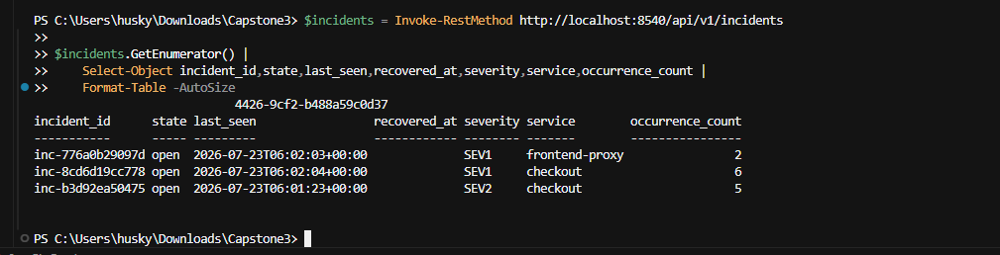

**Grafana sau recovery:**

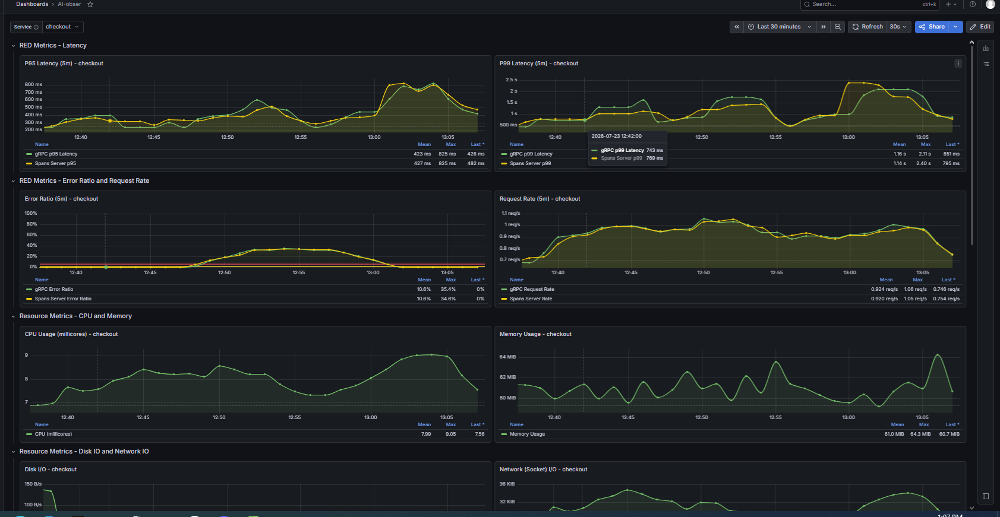

**SLO sau recovery:**

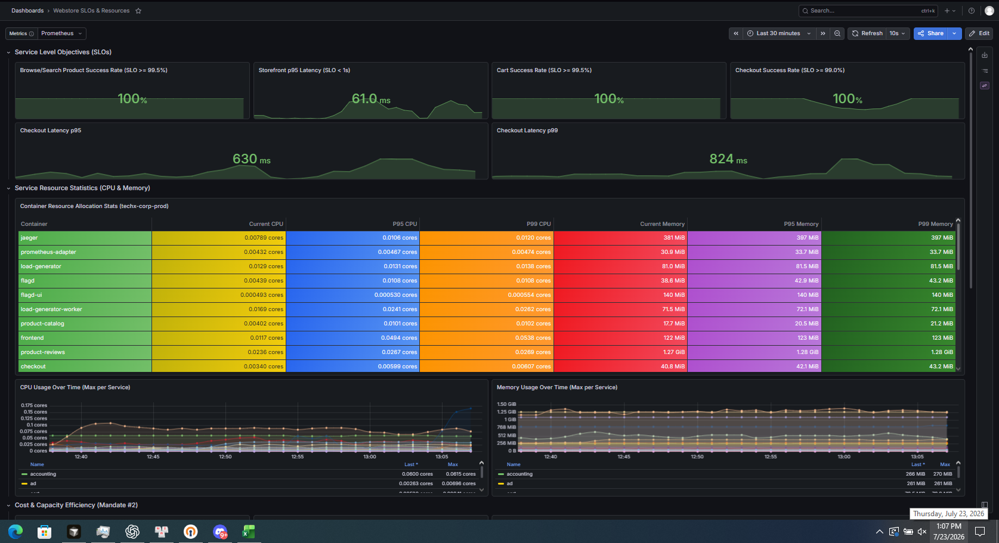

**Incident lifecycle caveat sau recovery:**

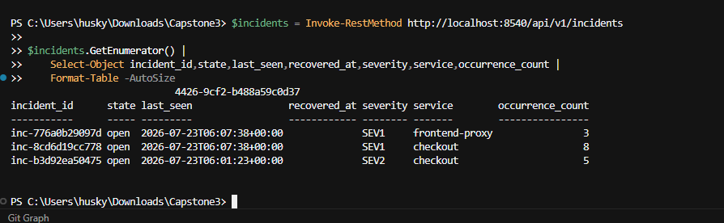

## 11. Labeled Incident Set và Metrics

Directive định nghĩa:

```text
recall = số injected incidents bắt được / K
precision = số lần kêu đúng / tổng số lần kêu
lead-time = thời điểm kêu đầu tiên - thời điểm fault bắt đầu
```

| Case | Ground truth | Window | Expected | Kết quả | First fire | Lead-time |
| --- | --- | --- | --- | --- | --- | --- |
| `01` | Normal baseline | `12:37:58–12:47:18` | Không incident | `TN` | `N/A` | `N/A` |
| `02` | `local-paymentFailure=50%` | `12:47:18–12:56:59` | `checkout/payment` | `TP`, caught | `12:51:37.852` | `259.852 s` |
| `03` | Recovery/normal | Sau `12:56:59` | Không severe fire mới | `FP` conservative: frontend-proxy | `13:01` | `N/A` |

Hai đơn vị đếm được tách riêng để không trộn incident case với signal fire. Một `unique detector fire` được tính theo detector ID duy nhất trong labeled window; hai detector checkout có thể cùng thuộc một injected incident:

| Metric | Giá trị | Công thức |
| --- | ---: | --- |
| Injected incidents `K` / caught / FN | `1 / 1 / 0` | Case `02` |
| Incident recall | `100%` | `1 / 1` |
| Correct / unexpected unique detector fires | `2 / 1` | Hai checkout detector fires / frontend-proxy |
| Unique detector-fire precision | `66.67%` | `2 / (2 + 1)` |
| Detector-fire F1 | `80.00%` | `2PR / (P + R)` |
| Conservative case-level precision | `50.00%` | `1 TP case / (1 TP + 1 FP)` |
| Mean/median lead-time | `259.852 s` | Một injected case |
| RCA top-k hit | `False` | `payment` không được xếp đúng |

`K=1`, vì vậy đây là kết quả preliminary, không có ý nghĩa thống kê rộng. Muốn
đánh giá production-quality cần mentor inject thêm fault types và normal windows.

**Labeled result summary:**

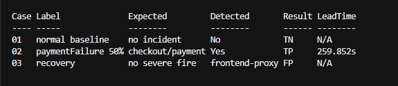

## 12. Screenshot/Artifact Index

Evidence trong repo: `docs/aiops/evidence`

| File | Nội dung | Trạng thái |
| --- | --- | --- |
| `01-port-forward-ready.png` | Port-forward endpoints | Có |
| `04-baseline-dashboard.png` | Normal checkout metrics | Có |
| `04b-baseline-slo-dashboard.png` | Normal SLO values | Có |
| `05-baseline-runtime.png` | `candidates=0`, `incidents=0` | Có |
| `06-flag-enabled.png` | `local-paymentFailure=50%` | Có |
| `07-detector-fired.png` | Hai checkout detector fires | Có |
| `08-incident-api.png` | Hai checkout incident IDs | Có |
| `10a-checkout-notify-ready.png` | Checkout SEV1 notification intent, outbox pending | Có |
| `10b-checkout-notification-incident-api.png` | Maps notification incident to checkout p95 detector/signal | Có |
| `10c-multi-service-live-detection.png` | Live fires trên checkout và frontend-proxy | Có |
| `11-dedup-repeat.png` | Cùng IDs, occurrences tăng | Có |
| `12-fault-dashboard.png` | Error ratio/p99 trong fault | Có |
| `12b-fault-slo-dashboard.png` | Checkout success `57.8%` | Có |
| `13-flag-disabled.png` | Fault về `off` | Có |
| `14a-recovery-in-progress.png` | Partial recovery | Có |
| `14b-recovery-api-in-progress.png` | Incident API trong recovery window | Có |
| `14-recovery-dashboard.png` | Error `0%`, p99 dưới `1s` | Có |
| `14b-recovery-slo-dashboard.png` | Success `100%`, p99 `824ms` | Có |
| `14c-recovery-api-caveat.png` | Incident lifecycle caveat | Có |
| `15-labeled-results.png` | Labeled cases: TN/TP/FP và lead-time | Có |
| `16-burn-rate-live-e2e.log` | Burn-rate detect/incident/notify/dedup live proof | Có |

## 13. Reproduce

Điều kiện trước khi chạy:

- Webstore và traffic generator đang hoạt động.
- Port-forward Prometheus `localhost:9090`, Grafana `localhost:3000`, Jaeger `localhost:16686` và Kubernetes read-only proxy `localhost:8001` đã sẵn sàng như ảnh `01-port-forward-ready.png`.
- Operator có quyền dùng Flagd Configurator UI. AIOps không tự thay đổi flag.

```powershell
cd C:\Users\husky\Downloads\Capstone3\tf2-corp-platform\src\aio
$env:AIOPS_ENV_FILE = ".env.live"
.\.venv\Scripts\python.exe -m uvicorn aiops.api.app:create_app `
  --factory --host 0.0.0.0 --port 8540
```


Kiểm tra runtime và incident API:

```powershell
Invoke-RestMethod http://localhost:8540/health/ready
Invoke-RestMethod http://localhost:8540/api/v1/incidents
```

1. Giữ baseline bình thường tối thiểu 5 phút; xác nhận `candidates=0 incidents=0`.
2. Operator bật `local-paymentFailure=50%` và ghi timestamp.
3. Giữ traffic; theo dõi `AIOPS_DETECT threshold_fire`, `AIOPS_DEDUP_RESULT` và `AIOPS_NOTIFY_READY`.
4. Gọi `GET /api/v1/incidents`; lưu ID, severity, state, `occurrence_count` và dashboard fault.
5. Operator tắt `local-paymentFailure` và ghi timestamp.
6. Chờ checkout success về `100%`, error về `0%`, p99 dưới `1s`; lưu dashboard và incident API recovery.

## 14. Submission Links và Sign-Off

| Evidence | Link/trạng thái |
| --- | --- |
| Commit | [`d8300a5`](https://github.com/tf2-team/tf2-corp-platform/commit/d8300a5) |
| ADR | [`ADR-DETECT-001`](../../../src/aio/docs/mandates/7a/ADR-DETECT-001.md) |
| ADR reviewer sign-off | **Pending review**; chưa được tuyên bố là signed |

Trước khi đóng Jira ticket, reviewer phải cập nhật bảng `Reviewer Sign-Off` trong ADR bằng quyết định và ngày ký thực tế.

## 15. Kết luận

- `local-paymentFailure=50%` làm checkout success giảm `100% → 57.8%`.
- Detector tự phát hiện error rate `33.60% > 5%` và p99 `1.759s > 1s`.
- First fire sau `259.852s`.
- Dedup giữ nguyên hai incident IDs và tăng occurrence thay vì spam ID mới.
- Sau khi tắt fault, success về `100%`, error về `0%`, p99 dưới `1s` sau `645s`.
- Recall `100%` trên `K=1`; fire-level precision `66.67%`.
- RCA miss `payment`, incident chưa auto-resolve và có một unexpected
  `frontend-proxy` fire; các điểm này được ghi thành caveat.
- Burn-rate live E2E đạt `8.3208x > 1x`, tạo `inc-ca09d8e8a247`, notification intent và dedup `1→2`. Multi-service live detection đã được chứng minh trên `checkout` và `frontend-proxy`; fire `frontend-proxy` là unexpected/unlabeled và không được tính vào quality metrics.

## 16. Jira Paste Block

```text
AI MANDATE #7b — API runtime live proof

- Branch/base commit: feat/aio/v0.0.5 @ 8f1d1e8; burn-rate commit link pending
- Runtime: uvicorn aiops.api.app:create_app --factory --host 0.0.0.0 --port 8540
- Flow: baseline → flagd fault → detection/dedup → recovery
- Scenario: local-paymentFailure=50%, expected checkout/payment
- Baseline: 12:37:58–12:47:18 +07; candidates=0, incidents=0
- Fault enabled: 2026-07-23 12:47:18 +07
- First fire: 2026-07-23 12:51:37.852 +07
- Lead-time: 259.852s (~4m20s)
- Detector: checkout error 33.60% > 5% SEV2; checkout p99 1.759s > 1s SEV1
- Incidents: inc-b3d92ea50475 and inc-8cd6d19cc778
- Dedup: same IDs; occurrences 2→4 and 4→6; no duplicate IDs
- Impact: checkout success 100%→57.8%
- Alert: checkout SEV1 notification intent; route=outbox status=pending
- Recovery: fault off 12:56:59; telemetry recovered 13:07:44; 645s
- Labeled set: K=1 injected incident + normal baseline/recovery windows
- Recall: 100% (1/1); unique detector-fire precision: 66.67% (2/3); F1: 80%
- Burn-rate: checkout rolling-24h 8.3208x > 1x SEV1; incident inc-ca09d8e8a247; same ID occurrence 1→2; outbox pending
- Safety: dry-run; no Kubernetes/flagd mutation by AIOps
- ADR: src/aio/docs/mandates/7a/ADR-DETECT-001.md (reviewer sign-off still pending)
- Caveats: K=1; RCA payment miss; frontend-proxy FP; no incident auto-resolution; frontend-proxy multi-service fire is unlabeled and excluded from quality metrics
- Evidence markdown/images: docs/aiops/evidence
- Additional dashboard evidence: C:\Users\husky\Downloads\Capstone3\assets
```
