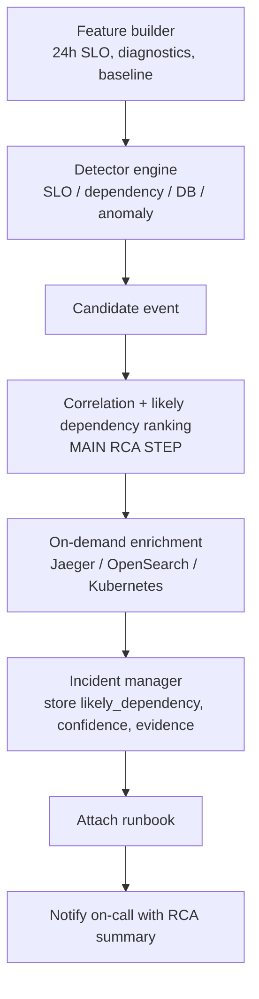

RCA trong thiết kế này không phải là một “hành động” riêng kiểu remediation, mà là một chuỗi xử lý nằm ở đoạn giữa pipeline: sau khi có detector candidate và trước khi incident được notify/escalate.

Cụ thể RCA nằm chủ yếu ở các mục sau:

- [[4. Feature builder]]: chuẩn bị dữ liệu để phân tích.
- [[5. Detector engine]]: phát hiện symptom chính.
- [[6. Correlation và likely dependency ranking]]: phần RCA chính.
- [[7. On-demand enrichment]]: bổ sung bằng chứng trace/log/K8s.
- [[8. Incident manager]]: ghi kết quả RCA vào incident timeline/evidence.
- [[9. Deduplicate, attach runbook, notify]]: gắn hướng xử lý dựa trên likely cause.

Trong Mermaid “2. Luồng Dữ Liệu Và Quyết Định”, RCA nằm ở đoạn này:




**Ví dụ checkout đang lỗi.**

AIOps không chỉ nói:

```text
Checkout SLO breached
```

Nó cố tìm:

```text
Checkout bị ảnh hưởng bởi dependency nào?
```

Nó dùng các yếu tố:

- temporal ordering: lỗi downstream xảy ra trước hoặc cùng lúc checkout lỗi;
- topology: dependency đó có nằm trên checkout path không;
- signal quality: signal verified đáng tin hơn fallback;
- specificity: lỗi theo span/payment operation đáng tin hơn CPU noise;
- corroboration: trace/log/K8s có hỗ trợ không.

Kết quả RCA có dạng:

```json
{
  "flow": "checkout",
  "service": "checkout",
  "likely_dependency": "payment",
  "confidence": 0.88,
  "contributing_signals": [
    "checkout_error_ratio_5m",
    "checkout_payment_span_error_rate_5m",
    "payment_timeout_logs",
    "payment_pod_readiness"
  ]
}
```

Hoặc nếu không đủ bằng chứng:

```json
{
  "flow": "checkout",
  "service": "checkout",
  "likely_dependency": "unknown",
  "confidence": 0.41,
  "contributing_signals": [
    "checkout_error_ratio_5m"
  ]
}
```

**RCA khác remediation như thế nào?**

RCA trả lời:

```text
Vấn đề có khả năng đến từ đâu?
```

Remediation trả lời:

```text
Có được làm gì để giảm thiểu hoặc khôi phục không?
```

Trong pipeline:

```text
Detect -> RCA/correlation/enrichment -> Incident -> Runbook -> Remediation policy -> Dry-run/live action -> Verify
```

Tức là RCA xảy ra trước remediation.

**Ví dụ đầy đủ**

```text
1. Grafana báo Checkout SLO firing.
2. AIOps nhận webhook và query thêm diagnostics.
3. Dependency detector thấy checkout->payment span error tăng.
4. Correlation kiểm tra payment nằm trên checkout topology path.
5. Jaeger cho thấy nhiều trace checkout fail ở payment call.
6. OpenSearch có payment timeout logs.
7. Kubernetes thấy payment pods ready nhưng error tăng.
8. AIOps ghi RCA:
   likely_dependency=payment
   confidence=0.88
9. Incident gắn RB-CHECKOUT-DEPENDENCY.
10. Notification gửi on-call:
   "Checkout degradation, likely dependency: payment."
11. Remediation engine chỉ dry-run/escalate, không tự restart.
```

**Điểm quan trọng**

Trong kiến trúc này nên gọi là:

```text
Likely-cause analysis
```

hơn là “root cause chắc chắn”.

Vì tài liệu quy định rõ:

> Output must say `likely_dependency` or `unknown`, not claim a root cause that has not been verified.

Nên RCA nằm ở mục [[6. Correlation và likely dependency ranking]] và được củng cố bởi [[7. On-demand enrichment]].

