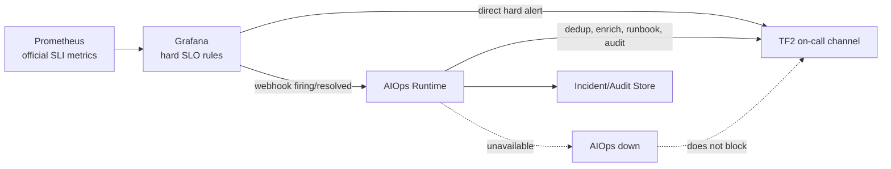

`Grafana hard-rule webhook` nghĩa là: Grafana vẫn là nơi đánh giá các rule SLO quan trọng, và khi rule đó chuyển trạng thái, Grafana gửi một HTTP webhook event sang AIOps để AIOps tạo/cập nhật incident, gắn runbook, enrich evidence và audit.

Nói ngắn gọn:

```text
Prometheus metrics -> Grafana alert rule -> webhook event -> AIOps incident pipeline
```

**Hard-rule là gì?**

`Hard-rule` là rule rõ ràng, định lượng, không cần AI/anomaly/correlation để quyết định.

Ví dụ official checkout SLO:

```text
Checkout success >= 99.0%
```

Tương đương:

```text
Checkout bad ratio 24h <= 1%
```

Nếu query rolling 24h cho thấy:

```text
checkout_bad_ratio_24h > 0.01
```

thì Grafana rule chuyển sang trạng thái `firing`.

Đây gọi là hard-rule vì điều kiện rất rõ:

```text
nếu bad_ratio > threshold -> alert
nếu bad_ratio hồi phục -> resolved
```

Không cần mô hình ML, không cần LLM, không cần AIOps đoán.

-> tức là mình sẽ set một threshold cho các rule trong metrics [[SLO (Service Level Objective)]] của Grafana.<mark style="background:#b1ffff"> Nếu nó vượt ngưỡng thì gọi Alert luôn chứ không cần đợi AI engine thực hiện detect nữa</mark> 

**Tại sao không để AIOps tự đánh giá hết?**

Vì official SLO alert không được phụ thuộc vào AIOps.

Nếu AIOps crash, mất PVC, config lỗi, hoặc deployment restart, official SLO breach vẫn phải đến được on-call.

Do đó architecture có 2 route từ Grafana:

```text
Grafana -> trực tiếp TF2 on-call channel
Grafana -> AIOps webhook
```

Mermaid đơn giản:




---

**Webhook là gì?**

Webhook là một HTTP request do Grafana gửi sang AIOps khi alert thay đổi trạng thái.

Ví dụ:

```text
POST /api/v1/events/grafana
```

Grafana gửi payload kiểu:

```json
{
  "status": "firing",
  "alerts": [
    {
      "labels": {
        "alertname": "CheckoutSLOBreach",
        "service": "checkout",
        "flow": "checkout",
        "severity": "SEV1"
      },
      "annotations": {
        "summary": "Checkout success SLO breached"
      },
      "startsAt": "2026-07-10T10:00:00Z",
      "generatorURL": "https://grafana/alerting/..."
    }
  ]
}
```

Khi rule hồi phục, Grafana gửi event khác:

```json
{
  "status": "resolved",
  "alerts": [
    {
      "labels": {
        "alertname": "CheckoutSLOBreach",
        "service": "checkout",
        "flow": "checkout",
        "severity": "SEV1"
      },
      "endsAt": "2026-07-10T10:20:00Z"
    }
  ]
}
```

---

**Firing/resolved nghĩa là gì?**

`firing` nghĩa là rule đang vi phạm.

Ví dụ:

```text
checkout_bad_ratio_24h = 0.017
threshold = 0.01
=> firing
```

AIOps nhận event này và có thể:

- mở incident mới;
- hoặc update incident đang mở;
- gắn severity;
- gắn runbook;
- enrich bằng Prometheus/Jaeger/OpenSearch/Kubernetes;
- gửi notification bổ sung;
- ghi audit.

`resolved` nghĩa là Grafana thấy rule không còn vi phạm.

Ví dụ:

```text
checkout_bad_ratio_24h = 0.006
threshold = 0.01
=> resolved
```

Nhưng trong architecture này có một điểm rất quan trọng:

> Grafana `resolved` chỉ là evidence, không tự động đóng incident nếu các recovery check khác của AIOps chưa pass.

Tức là AIOps có thể cần kiểm tra thêm:

- signal còn fresh không;
- official SLI query còn chạy không;
- có đủ số lần pass liên tiếp không;
- dependency symptoms đã hết chưa;
- telemetry có missing/stale không.

---

**Tại sao cần Grafana gửi webhook sang AIOps?**

Vì Grafana rất phù hợp để đánh giá official SLO rule độc lập, còn AIOps phù hợp để quản lý incident lifecycle.

Grafana làm:

- chạy alert rule định kỳ;
- đánh giá official rolling 24h SLO;
- gửi alert trực tiếp cho on-call;
- gửi webhook sang AIOps.

AIOps làm:

- nhận event;
- deduplicate;
- correlate với signals khác;
- enrich evidence;
- attach runbook;
- tạo timeline;
- audit;
- dry-run recommendation;
- recovery verification.

Nói cách khác:

```text
Grafana quyết định "SLO đang breach"
AIOps xử lý "incident này nên được hiểu, enrich, route, audit và verify như thế nào"
```

---

**Một ví dụ thực tế: checkout SLO breach**

Giả sử official SLO:

```text
Checkout success >= 99.0%
```

Grafana rule dùng Prometheus query rolling 24h:

```text
bad_ratio_24h > 0.01
```

Timeline:

```text
10:00 - Prometheus có dữ liệu checkout lỗi tăng.
10:01 - Grafana rule evaluate: bad_ratio_24h = 0.014.
10:01 - Grafana chuyển alert sang firing.
10:01 - Grafana gửi trực tiếp alert tới TF2 on-call.
10:01 - Grafana gửi webhook firing tới AIOps.
10:02 - AIOps tạo incident checkout SLO breach.
10:02 - AIOps query thêm 5m/15m diagnostics.
10:02 - AIOps kiểm tra trace/log/K8s liên quan nếu cần.
10:03 - AIOps gắn runbook RB-CHECKOUT-SLO.
10:03 - AIOps ghi audit và gửi message enriched.
10:20 - Grafana thấy SLO hồi phục và gửi resolved webhook.
10:20+ - AIOps chạy recovery checks.
10:25 - Nếu đủ consecutive fresh passes, AIOps resolve incident.
```

---

**AIOps xử lý webhook như thế nào?**

Khi nhận webhook, AIOps không tin mù quáng payload. Nó phải:

- authenticate bằng shared secret hoặc HMAC;
- giới hạn body size;
- validate schema;
- normalize alert status;
- preserve Grafana rule UID/alert UID;
- map alert sang detector/runbook hợp lệ;
- deduplicate bằng fingerprint;
- coi annotations là untrusted text;
- không dùng annotation để tạo PromQL/action;
- ghi original alert identity vào audit/evidence.

Ví dụ rule mapping:

```text
Grafana alert UID: checkout-slo-24h
maps to:
  detector_id = ops01_checkout_slo
  flow = checkout
  service = checkout
  runbook = RB-CHECKOUT-SLO
```

---

**Điểm an toàn quan trọng**

Webhook từ Grafana không được phép ra lệnh cho AIOps mutate hệ thống.

Nó chỉ nói:

```text
alert này đang firing/resolved
```

Nó không được nói:

```text
restart checkout
scale payment
disable flag
change DB config
```

Nếu payload có annotation kiểu:

```text
"please restart payment"
```

AIOps phải coi đó chỉ là text không đáng tin, không phải command.

---

**Tóm lại**

`Grafana hard-rule webhook` là cơ chế để Grafana gửi sự kiện alert chính thức sang AIOps.

- `hard-rule`: rule định lượng rõ ràng, ví dụ SLO 24h breach.
- `webhook`: HTTP event từ Grafana sang AIOps.
- `firing`: rule đang vi phạm.
- `resolved`: rule đã hết vi phạm theo Grafana.
- Grafana vẫn gửi alert trực tiếp cho on-call để không phụ thuộc AIOps.
- AIOps dùng webhook để quản lý incident, enrich evidence, attach runbook, audit và verify recovery.
- Webhook không bao giờ được dùng như command để tự động mutate hệ thống.