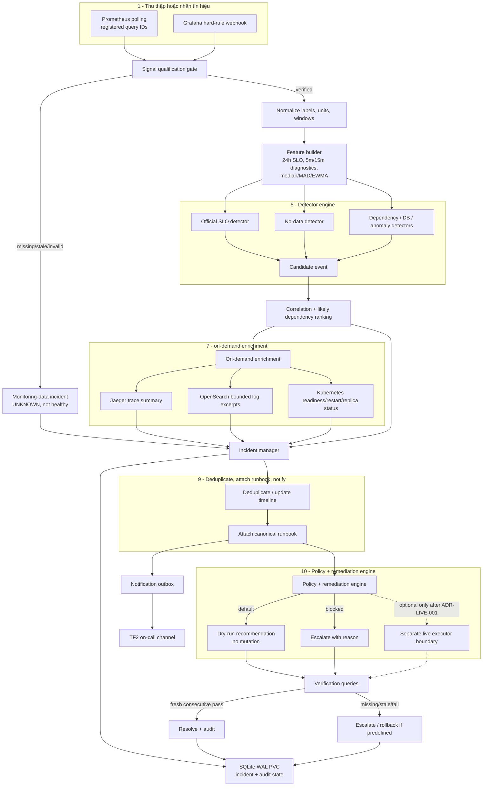

[[1. Thu thập hoặc nhận tín hiệu]] (phần [[Grafana hard-rule webhook]] có thêm 1 luồn nối trực tiếp tới Alert)
[[2. Signal qualification gate]]
[[3. Normalize dữ liệu]]
[[4. Feature builder]]
[[5. Detector engine]]
[[6. Correlation và likely dependency ranking]]
[[7. On-demand enrichment]] (phần này sẽ lấy thêm những nguồn dữ liệu như logs, K8s logs,... để làm giàu thêm thông tin để mô hình có thể cải thiện cũng như là chắc chắn quyết định của mình hơn)
[[8. Incident manager]]
[[9. Deduplicate, attach runbook, notify]]
[[10. Policy + remediation engine]] (giải thích lại phần này)
[[11. Verification]]
[[12. SQLite WAL PVC]]

