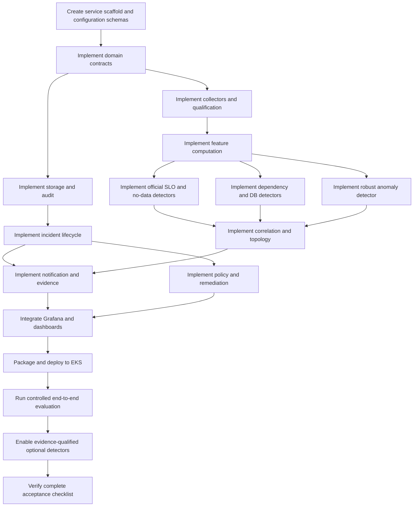

# TF2 / AIO4 AIOps Technical Implementation Guide

> **Purpose:** Detailed engineering instructions for implementing the complete AIOps system proposed in [architect.md](architect.md).  
> **Scope:** Runtime, configuration, signals, detectors, correlation, incident handling, guarded remediation, observability, deployment, testing, and evidence.  
> **Project coordination:** Kept in [aiops_task_plan.md](../../../../docs/aiops/aiops_task_plan.md) and intentionally omitted here.

This guide is ordered by technical dependency. Complete and verify each foundation before enabling components that depend on it. Paths below follow the target structure in the architecture; create them as implementation progresses.

## 1. Completion target

The implementation is complete when the deployed system can execute this loop continuously on TF2 EKS:

```
collect/receive
  -> qualify
  -> normalize
  -> compute features
  -> detect
  -> correlate
  -> create or update incident
  -> enrich and notify
  -> match runbook
  -> safety-check response
  -> dry-run or approved execution
  -> verify
  -> resolve, rollback, or escalate
  -> persist audit and evaluation evidence
```

The complete result must include:

- Independent Grafana coverage for every verified official numeric SLO.
- A continuously running AIOps service with qualified Prometheus inputs.
- Missing/stale telemetry detection.
- Checkout dependency and PostgreSQL pressure detection.
- Explainable multi-signal anomaly detection.
- Topology-based correlation and likely-cause ranking.
- Durable incident state, deduplication, recovery, and audit history.
- Real alert routing with runbook, dashboard, trace, and log-query links.
- Dry-run-first remediation with hard safety gates.
- Current P0 execution is dry-run; the planned later live transition permits only one explicitly approved action after every gate passes.
- Runtime self-observability, EKS deployment assets, reproducible tests, and an evidence pack.

## 2. Non-negotiable implementation rules

Apply these rules in code, configuration validation, tests, and deployment policy:

- Checkout success `>= 99.0%` is official. Checkout latency is diagnostic only.
- Official operational SLO calculations use rolling 24-hour windows.
- Missing, stale, invalid, or unverified signals are never converted to zero or healthy.
- Hard official-SLO alerts do not wait for statistical confirmation or correlation.
- Statistical results cannot override official SLO results.
- Flagd, OpenFeature hooks, flag sources, and BTC incident delivery are read-only protected mechanisms. Do not disable, redirect, mutate, or bypass them.
- Never automatically restart/delete a stateful or single-replica component.
- Never mutate databases, secrets, protected incident infrastructure, or broad Kubernetes scope.
- Scaling or other cost-changing operations require current cost evidence, human approval, and CDO-owned implementation.
- A failed dependency, unavailable verification signal, missing approval, or unknown safety input must block execution and cause escalation.
- LLM output must not choose, approve, execute, or verify operational actions.
- All important decisions and runtime transitions must be attributable and reproducible from versioned configuration and append-only events.

### 2.1 Production-realness guardrails

The deployable service must be wired to real TF2 infrastructure, not sample data or template defaults:

- Runtime adapters use real Prometheus, Grafana, Jaeger, OpenSearch, Kubernetes, notification, AIE-status, and cost-status endpoints supplied by environment-specific configuration and Secrets.
- Production code must not embed endpoint URLs, AWS account IDs, namespaces, alert channels, PromQL metric names, service label values, thresholds, credentials, image repositories, image digests, or remediation targets. These come from schema-validated config, Helm values, Secrets, and signed ADRs.
- Configuration validation must reject unresolved placeholders such as `<...>`, `TODO`, `TBD`, `REPLACE_ME`, empty image repository/digest values, floating image tags for production, `localhost`, and `example` in deployable settings.
- Test doubles, fake backends, synthetic series, and replay fixtures are test assets only. They must live under `tests/` or evaluation output, and no production signal, detector, route, or action policy may reference them.
- A detector is production-enabled only by live TF2 signal qualification plus a runbook, recovery rule, and evidence link. Passing fixtures alone is not enough.
- The production wheel/image excludes `tests`, fake adapters, replay fixtures, and local sample configuration. CI inspects the built artifact and fails when production dependency wiring resolves to a test module or fixture path.
- Official Phase 3 SLO objectives are versioned policy constants. Environment-derived thresholds and all infrastructure identities remain schema-validated configuration with evidence provenance.

### 2.2 Repository and deployment ownership preflight

- `tf2-corp-platform` is the delivery repository for runtime code and local/Docker Grafana assets.
- `tf2-corp-platform/docs/aiops` is the delivery location for ADRs, evaluations, Ops Reviews, postmortems, and evidence indexes; it links to canonical runbooks in `tf2-corp-platform/src/aio/runbooks/`, and the runtime never reads it.
- `phase3/techx-corp-chart` is upstream reference material and is not the TF2 delivery repository.
- The verified delivery checkout is the clean sibling `tf2-corp-chart`, remote `https://github.com/tf2-team/tf2-corp-chart.git`. The inspected baseline is commit `6c49c645a03922d763dd77e54cfe1db6227eaf16` on `main`; refer to this checkout as `TF2_CHART_ROOT` in commands and documentation. `ADR-DEPLOY-001` must additionally record the later implementing commit and live Argo sync revision.
- Stop deployment work if `TF2_CHART_ROOT` is uncommitted, points at the Phase 3 reference by accident, or cannot render the currently deployed TF2 release. This prevents a locally edited template from being mistaken for a real EKS delivery.

### 2.3 Recorded decisions and remaining acceptance gates

The July 13 repository review selected the implementation direction below. Do not replace the remaining live-environment gates with mock endpoints, guessed revisions, placeholder approvals, or permissive credentials:

1. **AIOps self-metrics ingestion:** implement OTLP metric export from `aiops-runtime` to the existing collector, which already receives OTLP metrics and exports them to the Prometheus OTLP endpoint in the inspected chart. Continue to expose `/metrics`, but do not count that endpoint alone as ingestion evidence. Complete `ADR-DEPLOY-001` with the deployed collector revision, query real qualified `aiops_*` series in TF2 Prometheus, and prove the independent runtime-loss alert.
2. **TF2 chart ownership:** use `https://github.com/tf2-team/tf2-corp-chart.git`, with the inspected baseline `6c49c645a03922d763dd77e54cfe1db6227eaf16` on `main`. Production GitOps declares Argo Application/release `techx-corp`, namespace `techx-corp-prod`, and the base/public/prod values layers. Add dedicated AIOps resources to that repository through its CODEOWNER/CDO review; the current inspected revision has no AIOps workload. Record the implementing chart commit and live Argo sync revision in `ADR-DEPLOY-001`. Never deploy the Phase 3 reference copy by assumption.
3. **Remediation mode:** implement P0 as a real continuous dry-run response loop. Record this current choice in `ADR-SAFETY-001` and `ADR-LIVE-001`. Live remediation remains planned for a later gated transition after one exact action, real audited expiring approval, separate least-privilege executor, live target evidence, cost/error-budget permission, deterministic verification, rollback, cooldown, and CDO approval all exist. No mutation identity is deployed in the dry-run baseline.

## 3. Dependency-ordered implementation sequence



Do not enable a detector merely because its code exists. Enablement requires a qualified live signal definition, a validated query, a runbook, recovery behavior, and passing tests. Replay fixtures prove behavior; they do not qualify a production signal by themselves.

## 4. Create the service scaffold

Create the service at `tf2-corp-platform/src/aio/`.

### 4.1 Minimum package files

```text
tf2-corp-platform/src/aio/
├── README.md
├── pyproject.toml
├── Dockerfile
├── .dockerignore
├── aiops/
│   ├── __init__.py
│   ├── main.py
│   ├── api/
│   ├── collectors/
│   ├── core/
│   ├── correlation/
│   ├── detectors/
│   ├── evidence/
│   ├── features/
│   ├── incidents/
│   ├── models/
│   ├── notifications/
│   ├── qualification/
│   ├── remediation/
│   ├── storage/
│   └── telemetry/
├── config/
├── runbooks/
├── scripts/
└── tests/
```

### 4.2 Runtime choices

Use one Python modular-monolith process so configuration, incident transactions, and safety decisions remain consistent. A practical dependency set is:

- FastAPI and Uvicorn for health, metrics, webhook, and read-only incident APIs.
- Pydantic and settings support for domain/config validation.
- `httpx` for bounded asynchronous HTTP clients.
- PyYAML for versioned definitions.
- `prometheus-client` for `aiops_*` metrics.
- OpenTelemetry SDK/exporters for the runtime's own traces/log correlation.
- Kubernetes Python client for namespace-scoped read context and the disabled-by-default live adapter.
- `aiosqlite` (or a bounded dedicated SQLite worker) so database I/O cannot block the async event loop.
- Standard-library `asyncio`, `statistics`, `sqlite3`, `hashlib`, `hmac`, and `logging` where sufficient.
- Pytest plus asynchronous/HTTP test helpers.

Lock dependencies and build with an immutable base-image digest. Do not use floating versions in the production image.

### 4.3 Core engineering abstractions

Implement these interfaces before business detectors:

```python
class Clock(Protocol):
    def now(self) -> datetime: ...

class Collector(Protocol):
    async def collect(self, definition: SignalDefinition) -> Observation: ...

class Detector(Protocol):
    async def evaluate(self, context: DetectionContext) -> list[CandidateEvent]: ...

class IncidentRepository(Protocol):
    async def find_active(self, fingerprint: str) -> Incident | None: ...
    async def save_event(self, event: IncidentEvent) -> None: ...

class ActionAdapter(Protocol):
    async def dry_run(self, request: ActionRequest) -> ActionResult: ...
    async def execute(self, request: ApprovedActionRequest) -> ActionResult: ...
```

Use a fake clock, in-memory collector, in-memory repository, and fake action adapter in tests only. Keep them under `tests/` or test support modules, and wire the runtime to real adapters from validated settings. Business logic must not import FastAPI, SQLite, or Kubernetes directly.

### 4.4 Developer entry points

Expose documented commands, directly or through the repository `Makefile`:

```text
make aiops-format-check
make aiops-lint
make aiops-typecheck
make aiops-config-check
make aiops-unit
make aiops-contract
make aiops-integration
make aiops-replay SCENARIO=<scenario-id>
make aiops-eval
make aiops-image
```

One aggregate command should run every pre-merge check without requiring EKS access.

## 5. Implement configuration and domain contracts

All queries, signals, detectors, topology edges, routing, and response policies must be data-driven. Python code provides behavior; YAML selects and configures it.

### 5.1 Configuration layout

```text
config/
├── schemas/
│   ├── signal.schema.json
│   ├── detector.schema.json
│   ├── topology.schema.json
│   ├── policy.schema.json
│   └── route.schema.json
├── environments/
│   └── tf2.yaml
├── queries/
│   ├── official_slos.yaml
│   ├── checkout.yaml
│   ├── postgresql.yaml
│   ├── kafka.yaml
│   └── llm.yaml
├── signals/
│   ├── official_slos.yaml
│   ├── checkout.yaml
│   ├── postgresql.yaml
│   ├── runtime.yaml
│   ├── kafka.yaml
│   └── llm.yaml
├── detectors/
│   ├── official_slos.yaml
│   ├── no_data.yaml
│   ├── checkout_dependency.yaml
│   ├── db_pressure.yaml
│   ├── anomalies.yaml
│   ├── flag_signatures.yaml
│   ├── kafka.yaml
│   └── llm.yaml
├── topology/
│   └── services.yaml
├── policies/
│   └── actions.yaml
└── notification/
    └── routes.yaml
```

### 5.2 Required enums and models

Implement at least:

```text
SignalQuality:
  unqualified | verified | fallback-only | missing | stale | invalid

CollectionStatus:
  success | timeout | source-error | parse-error | validation-error

DetectorResult:
  normal | firing | recovering | unknown | warming-up | suppressed

IncidentState:
  candidate | open | triaged | mitigating | verifying |
  escalated | resolved | suppressed

ActionState:
  proposed | rejected | safety-checked | dry-run-recorded |
  awaiting-approval | executing | verifying | succeeded |
  rolling-back | failed | escalated | expired

RuntimeMode:
  observe | dry-run | live-approved
```

Domain models must include schema version, environment, timestamps, source/config revision, correlation IDs, and validation methods.

### 5.3 Signal definition validation

Each signal definition must specify:

- Stable `signal_id` and technical owner/escalation target.
- Source adapter and stable query reference.
- Expected unit and result shape.
- Query/evaluation cadence and window.
- Required labels and allowed cardinality.
- Freshness limit.
- Qualification state and evidence reference.
- Minimum event/sample behavior.
- Whether it represents an official SLI, diagnostic signal, or fallback evidence.

Reject configuration when:

- IDs are duplicated.
- A query/runbook/topology reference does not exist.
- An official threshold conflicts with Phase 3.
- Units are ambiguous.
- A detector uses `missing`, `stale`, `invalid`, or `fallback-only` as its official primary SLI.
- An action type or target is not allow-listed.
- Live mode is requested without an exact approval/policy/RBAC reference.

### 5.4 Configuration loading

At startup:

1. Load base schemas and environment settings.
2. Parse every YAML file into typed models.
3. Resolve cross-file references.
4. Validate official SLO invariants and action safety invariants.
5. Compute a canonical configuration digest.
6. Expose the digest through `/api/v1/runtime`, logs, metrics, incidents, and audit events.
7. Fail readiness on invalid configuration; do not partially enable a broken configuration set.

Prefer immutable ConfigMap revisions and pod rollout over uncontrolled hot reload. If hot reload is later added, validate the complete new set before atomically replacing the active set.

## 6. Implement runtime startup, scheduling, and APIs

### 6.1 Startup sequence

Implement this order in `aiops/main.py`:

1. Initialize structured logging and redaction before logging settings.
2. Load and validate settings/configuration.
3. Open the state store and run forward-only migrations.
4. Create shared bounded HTTP clients.
5. Initialize collectors, feature cache, detectors, incident manager, notifier, evidence builder, and response engine.
6. Recover scheduler checkpoints and nonterminal incident state.
7. Mark pending/executing actions as requiring human review; never replay them automatically.
8. Start collection, detection, recovery, notification-outbox, and evidence-export loops.
9. Mark readiness only when the required local components are usable.

### 6.2 Scheduler behavior

Use monotonic scheduling and prevent overlapping execution of the same job. A simple evaluation loop is:

```python
while not shutdown_requested:
    started = clock.now()
    try:
        observations = await collect_registered_signals()
        qualified = qualification_gate.evaluate(observations)
        features = feature_builder.update(qualified)
        candidates = await detector_engine.evaluate(features)
        await incident_pipeline.process(candidates)
        await incident_pipeline.evaluate_recovery(features)
        checkpoint_success(started)
    except Exception as exc:
        record_loop_failure(exc)
    await wait_until_next_interval_without_overlap()
```

Discover deployed EKS scrape/evaluation freshness from configuration or observed sample timestamps. Configure collection/evaluation cadence at or above that value; the checked-in local 60-second setting is not production evidence.

### 6.3 API implementation

Implement:

| Method/path | Required behavior |
|---|---|
| `GET /health/live` | Process/event-loop liveness only; do not restart merely because Prometheus is temporarily unavailable |
| `GET /health/ready` | Configuration, store, scheduler initialization, and ability to accept webhook/read requests |
| `GET /metrics` | Prometheus text output for all `aiops_*` metrics |
| `POST /api/v1/events/grafana` | Authenticate, validate, normalize, deduplicate, and enqueue firing/resolved events |
| `GET /api/v1/incidents` | Read-only filters by state, severity, flow, service, and time |
| `GET /api/v1/incidents/{id}` | Incident summary, timeline, evidence links, and action state |
| `GET /api/v1/runtime` | Mode, build/config revision, adapter availability, scheduler state, and signal freshness summary |

Do not expose a baseline live-action approval endpoint. Keep the service ClusterIP-only.

### 6.4 Graceful shutdown

On termination:

- Stop accepting new scheduled work.
- Do not begin a new action.
- Allow bounded completion of current collection/transaction work.
- Flush audit/outbox state.
- Save scheduler checkpoints.
- Close HTTP/store clients.
- Exit after the configured grace period rather than hanging indefinitely.

## 7. Implement durable state and append-only audit

Use SQLite WAL on a small persistent volume for the baseline described in the architecture. Hide it behind repository interfaces so it can later be replaced.

### 7.1 Tables

Create migrations for:

| Table | Important fields |
|---|---|
| `incidents` | ID, fingerprint, flow, service, likely dependency, state, severity, confidence, first/last seen, occurrence count, config revision |
| `incident_events` | Event ID, incident ID, transition, reason, source event, timestamp, evidence digest |
| `observations` | Signal ID, value, unit, labels digest, observed/query times, window, quality, source revision |
| `notification_outbox` | Notification ID, incident ID, route, payload digest, next attempt, attempt count, terminal status |
| `notification_attempts` | Attempt result, HTTP status/error, timestamp, latency |
| `actions` | Action ID, incident ID, type, exact target, mode, state, policy result, attempt count, verification/rollback references |
| `approvals` | Action ID, approver identity, reason, issued/expiry time, scope digest |
| `audit_events` | Append-only actor, transition/action, reason, input/output digest, revision, result |
| `scheduler_checkpoints` | Job ID, last attempt/success, last error, next due |

### 7.2 Transaction boundaries

Use one transaction to:

1. Insert or update the incident.
2. Append the incident/audit event.
3. Insert the notification into the outbox.

The notification worker sends only committed outbox rows. This prevents an incident from being stored without a corresponding notification intent.

For actions, commit the action request and audit event before any adapter call. Commit adapter results and verification state afterward in a separate transaction.

### 7.3 Audit immutability

- Never update or delete `audit_events` through application repositories.
- Add SQLite triggers that abort updates/deletes on the audit table.
- Record corrections as new audit events referring to the corrected event.
- Emit equivalent structured JSON lifecycle logs to OpenSearch for an independent trail.
- Store digests of sensitive/bulk inputs rather than raw credentials, prompts, or unlimited log bodies.

### 7.4 Restart recovery

On restart:

- Reload open/triaged/mitigating/verifying/escalated incidents.
- Continue recovery evaluation when telemetry is fresh.
- Retry committed notification-outbox items according to retry policy.
- Convert any `executing` action to `failed/inconclusive` or `awaiting-human-review` according to policy.
- Never repeat a Kubernetes mutation based only on pre-restart state.
- Expose recovery results through audit events and metrics.

## 8. Implement collectors

### 8.1 Shared collector behavior

All adapters must:

- Use connection pooling and bounded timeouts.
- Cap response bytes, result count, and time range.
- Retry only safe/idempotent requests with bounded exponential backoff and jitter.
- Add correlation IDs without exposing credentials.
- Return a normalized collection envelope even on failure.
- Emit request count, duration, last-success, and error metrics.
- Never construct a query from untrusted alert/log text.

### 8.2 Prometheus adapter

Implement instant and bounded range queries against registered query IDs. Validate:

- HTTP/API success.
- Prometheus result type.
- Scalar/vector/matrix shape expected by the signal.
- Sample timestamps and freshness.
- Numeric values including `NaN`/infinity rejection.
- Required labels and cardinality.
- Unit conversion rules.

Cache identical query/window requests during one evaluation cycle so multiple detectors do not multiply Prometheus load.

### 8.3 Grafana webhook adapter

- Accept only the configured endpoint and request size.
- Authenticate with a constant-time shared-secret or HMAC check supported by the configured Grafana contact point.
- Validate schema and normalize firing/resolved transitions.
- Preserve Grafana rule UID, alert UID, starts/ends time, labels, and source URL.
- Treat annotations as untrusted display data; never interpret them as a query or action.
- Build the same fingerprint inputs used for polled detector events.

### 8.4 Jaeger adapter

Use Jaeger only for incident enrichment:

- Search by allow-listed service/operation and absolute incident time bounds.
- Cap traces and spans returned.
- Prefer trace IDs, duration, error status, service/operation, and safe attributes.
- Build a UI link with the same time bounds.
- Redact or exclude `app.product.question`, prompt/message content, credentials, and PII.
- Return enrichment failure independently from the primary incident.

### 8.5 OpenSearch adapter

- Store allow-listed query templates in configuration.
- Parameterize only safe values such as service and absolute time bounds.
- Restrict index pattern to the approved telemetry indexes.
- Cap hits and selected fields.
- Return counts, safe excerpts, and a UI/query link.
- Apply field allow-listing and redaction before persistence/logging.

### 8.6 Kubernetes read adapter

Read only the TF2 namespace:

- Deployment desired/available/ready replicas.
- Pod phase, readiness, restart count, node, and owner reference.
- ReplicaSet rollout state.
- StatefulSet identity when needed to block an action.

The normal ServiceAccount must not read Secrets and must not mutate resources.

### 8.7 Optional external-status adapters

Implement simple typed interfaces for:

- AIE review-summary correctness status: value, evaluation revision, evaluated time, expiry, responsible system, evidence URL.
- CDO cost/budget status: spend/headroom, currency, period, observed time, expiry, evidence URL.

An absent or expired status becomes `missing/stale`, not a favorable default.

## 9. Implement signal discovery and qualification

### 9.1 Discovery command

Implement `scripts/discover_signals.py` to query and export:

- Metric names matching registered families.
- Label names and bounded sample label values.
- Units inferred from metric metadata/name and confirmed by configuration.
- Latest timestamps and sample values.
- Result cardinality.
- Environment, query time, and source revision.

The command creates a review artifact but must never automatically promote a signal to `verified`.

### 9.2 Qualification algorithm

For each observation:

```text
if collection failed:
    quality = missing or invalid
elif sample timestamp older than stale_after:
    quality = stale
elif shape/unit/labels/cardinality invalid:
    quality = invalid
elif definition lacks semantic validation evidence:
    quality = fallback-only
else:
    quality = verified
```

Semantic validation for an official SLI requires controlled customer-flow evidence showing the selected counter/histogram changes for the intended route or RPC.

### 9.3 No traffic versus no data

Keep these states separate:

| Condition | Interpretation |
|---|---|
| Series present, source fresh, total events zero | No traffic/insufficient traffic |
| Expected series absent | Missing signal |
| Series last sample expired | Stale signal |
| Prometheus/collector failed | Source unavailable |
| Series present but wrong labels/unit | Invalid signal |

Division guards such as `clamp_min(..., 1)` prevent query errors but cannot by themselves declare health. Carry event count and source freshness alongside every ratio/percentile.

## 10. Implement feature computation

### 10.1 Observation cache

Maintain a bounded in-memory rolling cache keyed by `environment + signal_id + normalized labels`. Prometheus remains the time-series source of truth; persist only observations required for incident evidence and evaluation.

The cache must:

- Reject out-of-order samples beyond an allowed tolerance.
- Avoid double-counting duplicate timestamps.
- Prune beyond the maximum configured feature window.
- Preserve quality state with each sample.
- Reset/warm up safely when configuration revision changes.

### 10.2 Official SLO features

For success SLOs:

```text
bad_ratio_24h = bad_events_24h / total_events_24h
success_ratio_24h = 1 - bad_ratio_24h
budget_consumption = bad_ratio_24h / allowed_bad_ratio
remaining_budget = max(0, 1 - budget_consumption)
```

Return total events, bad events, ratio, threshold, source quality, and window. Never persist only the derived percentage.

For storefront latency, compute p95 from the validated customer-facing histogram over rolling 24 hours. Ensure bucket unit and threshold use the same unit.

### 10.3 Diagnostic features

Compute configurable 5-minute and 15-minute diagnostics:

- QPS/request rate.
- Error ratio.
- p50/p95/p99 latency.
- PostgreSQL backend usage and trend.
- Client connection usage/wait where verified.
- Signal freshness and request volume.
- Dependency error rate by operation.

Short windows are diagnostic/early-warning inputs; do not label them official rolling-24-hour SLO state.

### 10.4 Robust baseline features

Compute:

```text
median = median(clean_history)
mad = median(abs(x - median))
robust_z = 0.6745 * (current - median) / mad
```

When history is insufficient, return `warming-up`. When MAD is zero:

- Use a configured epsilon only when justified, or
- Use a configured EWMA fallback, or
- Return `warming-up/unknown`.

Do not silently divide by zero or produce infinite confidence. Store baseline window, history count, median/MAD or EWMA parameters, current value, and resulting score.

## 11. Implement official SLO and no-data coverage

### 11.1 Validate customer-event mappings

Before activating rules, prove:

- Browse/search availability maps to the customer-facing routes/RPCs and excludes control/long-poll traffic.
- Storefront p95 maps to the actual browse response path and excludes flagd EventStream.
- Cart success includes the agreed customer operations and their success status.
- Checkout success maps to completed `PlaceOrder` attempts and correct gRPC status semantics.
- AI correctness comes from AIE evaluation or is displayed as unavailable.

Record the final expressions and limitations in `ADR-SLI-001` and the signal definitions.

### 11.2 Candidate checkout expression

Use this only after validating labels and semantics in TF2:

```promql
sum(increase(rpc_server_duration_milliseconds_count{
  service_name="checkout",
  rpc_method="PlaceOrder",
  rpc_grpc_status_code!="0"
}[24h]))
/
clamp_min(
  sum(increase(rpc_server_duration_milliseconds_count{
    service_name="checkout",
    rpc_method="PlaceOrder"
  }[24h])),
  1
)
```

The official firing condition is `bad_ratio > 0.01`. Carry a separate query for total attempts and no-data/low-traffic state.

### 11.3 Browse/search and cart expressions

Do not copy a generic service-level metric blindly. Build expressions from the validated customer routes/RPC methods:

```text
bad events for included operation/status over 24h
-------------------------------------------------
all attempts for the same operation set over 24h
```

Official firing conditions:

- Browse/search bad ratio `> 0.005`.
- Cart bad ratio `> 0.005`.

### 11.4 Storefront p95 expression

Use the validated histogram and customer-route filter:

```promql
histogram_quantile(
  0.95,
  sum by (le) (
    increase(<validated_storefront_histogram_bucket>{<validated_route_filter>}[24h])
  )
)
```

The placeholder tokens above are documentation-only. The enabled query must use the concrete bucket metric name and route filter recorded in `ADR-SLI-001`; configuration validation must reject the literal `<validated_storefront_histogram_bucket>` or `<validated_route_filter>` values. Fire at `>= 1 second` after converting the result to seconds if necessary. Explicitly exclude unrelated APIs and long-poll/EventStream spans.

### 11.5 Grafana provisioning

Create:

- `aiops-slo-rules.yaml` using the `.yaml` extension expected by the chart glob.
- `aiops-slo-dashboard.json`.
- A monitoring-loss rule for required source/series freshness.

Provision two routes for hard official alerts:

1. Directly to the real TF2 operations channel.
2. To `/api/v1/events/grafana` for incident lifecycle, enrichment, and audit.

Keep EKS assets in `${TF2_CHART_ROOT}/grafana/provisioning/` and local/Docker counterparts in `tf2-corp-platform/src/grafana/provisioning/`. Add a digest comparison script so identically named AIOps assets cannot drift silently. Never deploy from the Phase 3 reference chart unless `ADR-DEPLOY-001` explicitly proves that it is the TF2-owned delivery repository.

### 11.6 SLO dashboard

Show:

- Rolling-24-hour value, objective, pass/breach/unknown state, total attempts, bad events, and error-budget consumption.
- Signal quality and last sample time.
- Low/no traffic separately from no telemetry.
- Short-window diagnostics.
- Checkout QPS/error/p50/p95/p99 labeled “diagnostic — not an official latency SLO.”
- AIE correctness value or `N/A / dependency missing` with timestamp.

## 12. Implement detector engine

### 12.1 Detector execution contract

Each detector receives immutable qualified features and returns zero or more candidate events. It must not directly create incidents, send notifications, or execute actions.

Every candidate includes:

- Detector/config revision.
- Environment, customer flow, primary service, and possible dependency.
- Signal values, units, windows, quality, threshold/baseline, and event count.
- Severity and reason code.
- Contributing signal IDs.
- Suggested runbook ID.
- Firing/recovery transition.

### 12.2 Official SLO detector

- Evaluate every verified numeric official SLI.
- Fire immediately at official boundaries.
- Return `unknown` when source quality is not verified/fresh.
- Return low/no-traffic status separately.
- Attach official objective, allowed bad ratio, and error-budget consumption.
- Require configured consecutive fresh passes for recovery; do not delay firing.

### 12.3 No-data detector

Detect:

- Required Prometheus query/source failure.
- Expected series disappearance.
- Sample staleness.
- AIOps scheduler/collector stalled.
- Optional AIE/cost/Kafka/LLM signal gaps without misclassifying them as customer SLO failure.

Group related missing signals into one monitoring-pipeline incident where they share a source failure.

### 12.4 Checkout dependency detector

Begin with qualified span/RPC error signals:

```promql
sum by (span_name) (
  rate(traces_span_metrics_calls_total{
    service_name="checkout",
    status_code="STATUS_CODE_ERROR"
  }[5m])
)
```

Add qualified latency by operation:

```promql
histogram_quantile(
  0.95,
  sum by (le, span_name) (
    rate(traces_span_metrics_duration_milliseconds_bucket{
      service_name="checkout"
    }[5m])
  )
)
```

Verify exact span names and service/peer labels. Map evidence for cart, product-catalog, currency, shipping/quote, payment, email, and Kafka publish. A parent checkout failure without supported downstream evidence must yield `likely_dependency=unknown`.

### 12.5 PostgreSQL pressure detector

Use server-side evidence first:

```promql
sum by (postgresql_database_name) (postgresql_backends)
```

Implement the threshold only after recording:

- Actual `max_connections`.
- Normal backend range.
- Controlled-load observation.
- Receiver freshness.
- Approved warning threshold and recovery/hysteresis.

Discover client metrics with a metric-name query and enable only those present. Missing client pool metrics remain `N/A`. Corroborate pressure with deadlocks, connection waits, service errors/latency, traces, and logs. Never automate a PostgreSQL restart or configuration change.

### 12.6 Robust multi-signal anomaly detector

Implement configurable policies such as:

```yaml
id: checkout_degradation_early_warning
type: robust-anomaly
primarySignal: checkout_error_ratio_5m
supportingSignals:
  - checkout_p95_5m
  - db_backend_usage
method: median-mad
minimumHistory: value_from_ADR_DETECT_001
scoreThreshold: value_from_ADR_DETECT_001
consecutiveCycles: value_from_ADR_DETECT_001
confirmation:
  minimumVerifiedSignals: 2
direction: high-is-bad
```

The `value_from_ADR_DETECT_001` names show the required source of the value, not deployable YAML. Enabled configuration must contain concrete ADR-approved numbers and must fail validation if any placeholder-like token remains. Thresholds and windows must come from labeled baseline/anomaly evidence and `ADR-DETECT-001`, not hidden code constants.

The output explanation must include current value, baseline, score, required/observed confirmations, excluded/missing signals, and confidence.

### 12.7 Flag incident signatures

Treat this as conditional P1 work after the mandatory P0 gate. Create the symptom inventory without enabling a signature until its real evidence is qualified. The detector observes effects; it does not control flag state.

| Flag | Primary symptom/evidence to qualify |
|---|---|
| `llmInaccurateResponse` | AIE correctness evaluation failure or authorized known test evidence; operational latency cannot prove inaccuracy |
| `llmRateLimitError` | AI assistant span error/fallback and rate-limit logs |
| `productCatalogFailure` | Catalog RPC errors and browse/checkout effects |
| `recommendationCacheFailure` | Recommendation errors/latency without assuming checkout impact |
| `adManualGc` | Ad latency/GC/CPU evidence where exported |
| `adHighCpu` | Ad/container CPU plus ad latency/error |
| `adFailure` | Ad service error spans/RPC status |
| `kafkaQueueProblems` | Producer error, consumer lag, or bounded log evidence |
| `cartFailure` | Cart operation/checkout dependency errors |
| `paymentFailure` | Payment operation and checkout errors |
| `paymentUnreachable` | Connection/unavailable error plus checkout dependency evidence |
| `loadGeneratorFloodHomepage` | Traffic/QPS jump attributed to load generator and resource/latency effects |
| `imageSlowLoad` | Image-provider/browser-facing latency evidence where available |
| `failedReadinessProbe` | Readiness loss/restart/rollout evidence |
| `emailMemoryLeak` | Email container memory trend/restart/OOM evidence |

Validate signatures with recorded/redacted API fixtures and controlled test series, but production enablement still requires live TF2 signal qualification. Do not exercise BTC flags unless BTC explicitly authorizes a controlled flag exercise.

### 12.8 LLM visibility detector

Treat this as conditional P1 work after the mandatory P0 gate.

Use qualified evidence from `product-reviews` first:

- `app_ai_assistant_counter_total` request volume.
- `get_ai_assistant_response` span latency and errors.
- Rate-limit/fallback logs.
- AIE correctness artifact.

Discover `gen_ai_client_*` and token metrics. If absent, display `N/A`; do not write queries that silently return zero. Do not create an official LLM latency SLO.

### 12.9 Kafka detector

Treat this as conditional P2 work unless a live incident, verified evidence, or BTC mandate promotes it.

Discover actual EKS metric names/labels before enabling. If a consumer-lag series is verified:

- Track lag by group/topic/partition at bounded cardinality.
- Establish normal range from controlled traffic.
- Define warning/firing/recovery through a signed threshold decision.
- Corroborate with checkout producer errors and accounting/fraud-detection consumer logs.

If lag metrics are unavailable, use documented bounded log evidence for incident enrichment and leave numeric lag state `N/A`.

## 13. Implement topology and correlation

### 13.1 Topology model

Represent nodes and edges in `config/topology/services.yaml`:

```yaml
services:
  checkout:
    flow: checkout
    kind: stateless-service
    evidence:
      metrics: [checkout_rpc_errors, checkout_span_latency]
      runbook: RB-CHECKOUT-DEPENDENCY
    remediationClass: guarded-stateless
  postgresql:
    kind: stateful-store
    remediationClass: never-automatic
edges:
  - from: checkout
    to: payment
    type: synchronous
    critical: true
  - from: checkout
    to: kafka
    type: asynchronous-publish
    critical: true
```

Include frontend, checkout, cart/Valkey, product-catalog/PostgreSQL, currency, shipping/quote, payment, email, Kafka, accounting, and fraud-detection. Validate it against source code, official architecture, a current Jaeger trace, and deployed resource evidence.

Store per node:

- Customer flows and business effect.
- Upstream/downstream edges.
- Stateful/stateless classification.
- Deployed replica/durability evidence reference.
- Metric/trace/log evidence IDs.
- Runbook and escalation target.
- Remediation restriction.

Do not label a service a SPOF solely from a stale values file; use deployed replica/state evidence.

### 13.2 Correlation window

Group candidate events when they share environment/customer flow within a configured bounded window. Preserve original timestamps and events.

### 13.3 Likely-cause scoring

Calculate transparent contributions, for example:

```text
confidence =
  verified_primary_signal_weight
  + temporal_precedence_weight
  + checkout_topology_weight
  + operation_specificity_weight
  + trace_or_log_corroboration_weight
  - stale_or_missing_evidence_penalty
```

Keep weights in configuration and normalize to `[0, 1]`. Include the component list in the incident. If no candidate passes the configured confidence threshold, use `unknown`.

### 13.4 Cascade handling

When one downstream failure triggers many parent/service alerts:

- Create/update one incident for the customer flow and likely dependency.
- Attach child candidate events as evidence.
- Preserve an official SLO alert's severity/context.
- Avoid suppressing unrelated simultaneous incidents only because timestamps overlap.

## 14. Implement incident lifecycle and deduplication

### 14.1 Fingerprint

Build a stable SHA-256 digest from normalized values:

```text
environment | detector_id | customer_flow | primary_service | likely_dependency
```

Do not include volatile values such as current metric value, timestamp, pod name, or trace ID.

### 14.2 State transitions

Implement and validate:

```text
candidate -> open -> triaged -> mitigating -> verifying -> resolved
                         \-> escalated --------------------/
candidate -> suppressed
resolved -> open only after a new firing transition and cooldown policy
```

Reject illegal transitions and append an audit event describing the rejection.

### 14.3 Create/update algorithm

```python
async with repository.transaction():
    incident = repository.find_active(candidate.fingerprint)
    if incident is None:
        incident = Incident.open_from(candidate)
    else:
        incident.apply(candidate)
        incident.occurrence_count += 1
    repository.save(incident)
    repository.append_event(incident.transition_event())
    repository.enqueue_notification(incident.notification_snapshot())
```

### 14.4 Recovery

- Define recovery queries per detector/runbook.
- Require fresh verified inputs.
- Require configured consecutive successful checks.
- Use hysteresis where warning/firing thresholds otherwise flap.
- Treat a Grafana resolved event as evidence, not the only recovery condition.
- If verification is unavailable, remain open/escalated rather than claiming resolution.

### 14.5 Suppression and cooldown

Suppress only with explicit reason codes such as warming up, unqualified input, duplicate within active incident, authorized maintenance, or configured cooldown. Never use suppression to hide a hard official SLO breach.

## 15. Implement notification, evidence, and runbooks

### 15.1 Notification payload

Include:

- Incident ID, state, severity, environment, customer flow, and service.
- Likely dependency or `unknown`.
- Current value/unit, threshold or statistical baseline, and measurement window.
- Official SLO/error-budget context when applicable.
- Signal quality, confidence, and contributing evidence.
- First/last seen and occurrence count.
- Dashboard, trace, log-query, runbook, and ADR links.
- Runtime action mode and response status.
- Escalation target.

Do not include credentials, webhook URLs, prompts, user questions, full messages, or unrestricted raw logs.

### 15.2 Outbox delivery

- Read committed outbox rows.
- Send with bounded timeout.
- Mark success only after a valid receiver response.
- Retry 429/temporary 5xx/network errors with bounded exponential backoff.
- Stop after configured attempts, record terminal failure, expose a metric, and use the documented backup route.
- Use incident fingerprint as the receiver grouping/dedup key where supported.

### 15.3 Evidence builder

For every incident, produce a bounded redacted bundle:

```text
evidence/incidents/<incident-id>/
├── incident.json
├── timeline.jsonl
├── observations.json
├── notifications.json
├── actions.jsonl
├── verification.json
├── queries.md
├── links.md
└── redaction-report.json
```

Each item records source, stable query ID/expression, absolute time bounds, capture time, environment, result digest, and adapter status. Commit only synthetic/redacted fixtures and summary indexes to Git.

### 15.4 Runbook format

Use Markdown with machine-readable YAML front matter. `tf2-corp-platform/src/aio/runbooks/` is the only canonical runbook location. Runtime matching, validation, packaging, operator links, and documentation must resolve there; `tf2-corp-platform/docs/aiops` may link to canonical runbooks but must not contain copies.

```yaml
---
runbookId: RB-CHECKOUT-DEPENDENCY
title: Checkout dependency failure
flows: [checkout]
services: [checkout, cart, product-catalog, currency, shipping, quote, payment, email, kafka]
detectors: [ops03_checkout_dependency]
severity: SEV1
escalationTarget: tf2-operations
---
```

Every runbook must contain:

1. Customer/business impact.
2. Preconditions and signal-quality checks.
3. Evidence queries and expected interpretation.
4. First-response/containment instructions.
5. Dry-run recommendation.
6. Prohibited actions.
7. Verification query/window/consecutive passes.
8. Rollback when applicable.
9. Escalation conditions and target.
10. Required incident/COE evidence.

Implement at least:

- `RB-CHECKOUT-SLO.md`.
- `RB-CHECKOUT-DEPENDENCY.md`.
- `RB-DB-SATURATION.md`.
- `RB-MONITORING-LOSS.md`.
- Complete signature-specific runbooks for every enabled flag/LLM/Kafka detector.

## 16. Implement guarded remediation

### 16.1 Separate recommendation from execution

Implement three distinct modes:

| Mode | Behavior |
|---|---|
| `observe` | Detect/store internally; use test routing only |
| `dry-run` | Route real incidents and evaluate a non-mutating action proposal against current real resource/telemetry state; no Kubernetes writes |
| `live-approved` | Permit one exact allow-listed action through separate RBAC after all gates pass |

Default every configuration, image, and Helm values file to `dry-run`.

### 16.2 Action registry

Each registered action defines:

- Stable action type/ID.
- Exact allowed resource kind, namespace, and target pattern/name.
- Preconditions.
- Stateful/stateless and replica constraints.
- Required approvals/evidence.
- Blast-radius limit.
- Cooldown and maximum attempts.
- Verification queries and timeout.
- Rollback implementation.
- Cost/error-budget policy.

The baseline registry contains recommendation-only actions. Keep `kubernetes_live.py` disabled and uncredentialed in P0. If conditional P1 live execution is approved, it becomes only a typed client to the separate executor defined by `ADR-LIVE-001`; Kubernetes mutation credentials never enter the ordinary runtime.

### 16.3 Policy evaluation order

Evaluate gates in this fail-closed order:

```python
assert runtime_mode_allows_request()
assert action_type_is_allow_listed()
assert incident_is_current_and_not_suppressed()
assert exact_target_matches_policy()
assert target_is_not_protected_or_stateful()
assert target_has_verified_multi_replica_readiness()
assert blast_radius_is_one_service()
assert no_other_live_action_is_running()
assert cooldown_and_max_attempts_pass()
assert official_error_budget_policy_passes()
assert current_cost_status_passes_if_required()
assert approval_matches_action_digest_and_is_not_expired()
assert verification_and_rollback_are_defined()
assert required_dependencies_are_available()
```

Record every input and exact rejection reason.

### 16.4 Always-blocked actions

Implement non-bypassable code-level and configuration-validation blocks for:

- Flagd/OpenFeature/flag-source/BTC incident mutation.
- Stateful or single-replica restart/delete.
- Database/schema/data mutation.
- Secret mutation or API access.
- Wildcard/broad namespace or cluster mutation.
- Multiple concurrent live actions.
- Scaling without current cost evidence, approval, and CDO-controlled implementation.
- Actions without deterministic verification and rollback.
- Expired/mismatched approvals.

### 16.5 Dry-run result

A dry-run records:

- Proposed action and exact target.
- Policy gates and inputs.
- Command/API operation that would be requested, with secrets removed.
- Expected blast radius.
- Pre-action telemetry snapshot.
- Verification and rollback definitions.
- Final result `dry-run-recorded` followed by escalation/human handoff.

### 16.6 Optional live execution

If one action is approved and the approval-provider/executor decision in Section 2.3 is complete:

- Send the exact approved request to the separately scoped executor defined by `ADR-LIVE-001`; the ordinary runtime remains read-only.
- Scope verbs/resources/resourceNames as narrowly as Kubernetes permits.
- Require an expiring approval whose digest matches incident, action type, target, policy revision, and verification plan.
- Acquire a store-backed single-action lock.
- Recheck all gates immediately before execution.
- Persist the executing state before calling Kubernetes.
- Perform exactly one attempt unless policy explicitly permits another.
- Begin verification immediately.
- Remove/disable mutation RBAC when live mode ends.

If these conditions cannot be proven, do not enable live mode.

### 16.7 Verification and rollback

Verification must use predeclared telemetry:

```text
pre-snapshot
  -> action/dry-run
  -> wait configured stabilization period
  -> run fresh verification queries
  -> require consecutive pass criteria
  -> succeeded OR rollback OR failed/escalated
```

If telemetry becomes missing/stale, verification is inconclusive and the action escalates. Roll back only when a predefined reversible rollback exists and its own safety check passes.

## 17. Implement AIOps self-observability

### 17.1 Metrics

Expose at least:

```text
aiops_build_info{version,revision}
aiops_config_revision_info{revision}
aiops_collection_total{source,status}
aiops_collection_duration_seconds{source}
aiops_signal_last_success_timestamp_seconds{signal_id}
aiops_signal_quality{signal_id,state}
aiops_detector_evaluations_total{detector_id,result}
aiops_detector_evaluation_duration_seconds{detector_id}
aiops_incidents_open{severity,flow}
aiops_incident_transitions_total{from_state,to_state}
aiops_notifications_total{route,status}
aiops_actions_total{mode,action_type,result}
aiops_live_action_in_progress
aiops_scheduler_last_success_timestamp_seconds{job}
aiops_store_errors_total{operation}
```

Avoid high-cardinality labels such as incident ID, trace ID, pod UID, free-form error, or query text.

### 17.2 Structured logs

Log JSON with timestamp, level, component, event name, environment, incident/action correlation IDs, revision, reason code, and safe error classification. Apply redaction before serialization.

### 17.3 Operations dashboard

Create `aiops-operations-dashboard.json` showing:

- Runtime mode/build/config revision.
- Scheduler and collector last success.
- Signal freshness/quality and gaps.
- Detector evaluation/firing/warm-up state.
- Open incidents, age, severity, flow, and dedup occurrences.
- Notification attempts/failures.
- Dry-run/live action state and guardrail rejections.
- MTTD/MTTR fields derived from incident events.
- Store errors/PVC usage and pod restarts.
- Link to the official SLO dashboard.

### 17.4 Runtime-loss alert

Configure an independent Grafana alert for missing AIOps runtime metrics/health. Do not route it only through the runtime it monitors.

This item is incomplete until the self-metrics ingestion decision in Section 2.3 is implemented and real `aiops_*` series plus the missing-runtime alert are verified in TF2.

## 18. Package and deploy on EKS

### 18.1 Container image

- Use a multi-stage Dockerfile.
- Install only runtime dependencies in the final stage.
- Run as a fixed non-root UID/GID.
- Write only to the mounted state/evidence temp paths.
- Set read-only-root-compatible Python settings.
- Include health endpoint support, not shell-based liveness.
- Record source revision and build version in image metadata and `aiops_build_info`.
- Build and push to TF2 ECR according to Phase 3 rules.

### 18.2 Helm values

In the supplied reference chart, the generic component Deployment template uses the chart-wide ServiceAccount and does not expose the `Recreate` strategy or digest-form image reference required by this design. Reconfirm this against `TF2_CHART_ROOT`; do not assume the reference copy equals the deployed chart. Avoid changing those defaults for every application component. Add a schema-validated top-level AIOps section and render dedicated AIOps resources:

```yaml
aiops:
  enabled: false
  mode: dry-run
```

Keep the reusable base chart disabled and free of guessed environment values. A TF2 environment values file may enable it only when it supplies the real ECR repository and `sha256:` digest, namespace/service identity, existing Secret reference, PVC/storage class and measured size, service port, and evidence-backed CPU/memory requests and limits. The schema must conditionally require those fields when enabled and reject empty/placeholders, floating production tags, invalid digests, and unbounded resources.

The files described below are implementation source, not proof of deployment. Do not render or release them as TF2 assets until the chart-ownership decision in Section 2.3 identifies the real chart and its integration mechanism.

### 18.3 Kubernetes resources

Add and render:

- `templates/aiops-deployment.yaml` with Deployment `aiops-runtime`, digest image, `Recreate`, probes, mounts, and dedicated ServiceAccount.
- `templates/aiops-service.yaml` with a ClusterIP Service.
- `templates/aiops-config.yaml` or an existing immutable/checksum-mounted ConfigMap.
- `templates/aiops-pvc.yaml` for the SQLite/evidence volume.
- `templates/aiops-rbac.yaml` for the read-only identity and the absent-by-default live-action identity.
- `templates/aiops-networkpolicy.yaml` where the cluster network policy baseline supports it.
- Immutable/versioned ConfigMap or checksum-triggered rollout.
- Existing Secret reference, never inline secret data.
- Grafana alert/dashboard ConfigMaps through the existing chart mechanism.

Do not force this service through the generic component template by dropping the dedicated identity, digest pin, PVC, or single-writer strategy. Keep the explicit templates gated by `.Values.aiops.enabled` and validate their values in `values.schema.json`.

### 18.4 Pod security

Configure:

- `runAsNonRoot: true`.
- Fixed `runAsUser`/`runAsGroup` and suitable `fsGroup` for the PVC.
- `readOnlyRootFilesystem: true`.
- `allowPrivilegeEscalation: false`.
- Drop all Linux capabilities.
- RuntimeDefault seccomp.
- No host network/PID/IPC, host paths, privileged mode, or service-account token when not needed.
- Explicit writable volume mounts only.

### 18.5 Probes and strategy

- Liveness checks process/event-loop health.
- Readiness checks validated configuration, state store, scheduler initialization, and API availability.
- Temporary Prometheus/Jaeger/OpenSearch failure should show degraded/unknown signals rather than cause a liveness restart loop.
- Use one active replica and `Recreate` while SQLite/PVC is used.
- Preserve direct Grafana SLO alerts during AIOps deployment/restart.

### 18.6 RBAC verification

Prove with `kubectl auth can-i` or equivalent that the normal identity:

- Can get/list/watch only required Kubernetes resource metadata in the TF2 namespace.
- Cannot get/list Secrets.
- Cannot create/update/patch/delete Deployments, Pods, StatefulSets, ConfigMaps, Secrets, or flagd resources.
- Has no cluster-wide wildcard permission.

Store redacted command output in the evidence index.

## 19. Implement security and fail-safe behavior

### 19.1 Input security

- Limit webhook body size and content type.
- Authenticate before expensive parsing/work.
- Validate every external payload with typed schemas.
- Escape notification templates.
- Use stable query IDs and parameter allow-lists.
- Never execute strings from alert/log/trace data.

### 19.2 Secret handling

- Use Kubernetes Secrets or approved secret management.
- Never commit or print webhook URLs, API keys, passwords, tokens, authorization headers, or full environment dumps.
- Ensure exception formatting and HTTP debug logs redact sensitive headers/URLs.

### 19.3 PII handling

Exclude/redact:

- `app.product.question`.
- Raw LLM messages/prompts/responses.
- Usernames, email, payment/order/customer data unless an approved minimal identifier is required.
- Stack traces/log bodies containing credentials or personal data.

Test redaction with nested dicts, JSON strings, URL query parameters, headers, and exception objects.

### 19.4 Required failure behavior

| Failure | Implementation response |
|---|---|
| Prometheus request fails | Bounded retry; mark dependent signals unknown; monitoring-loss incident after configured condition |
| Series missing/stale | Never substitute zero; suppress dependent anomaly conclusion; expose gap |
| Grafana webhook fails | Direct Grafana channel remains active; runtime-loss/webhook metrics alert independently |
| Jaeger/OpenSearch fails | Route primary incident with reduced confidence and enrichment error evidence |
| Kubernetes API fails | Block live action; continue metric-based detection if possible |
| SQLite/PVC fails | Fail readiness for stateful processing; execute no action; keep direct Grafana alerting |
| Notification route fails | Retry/outbox/audit; expose failure; use documented backup route |
| Configuration invalid | Fail readiness/startup; retain prior working Helm revision |
| Cost/AIE status expires | Mark stale/unknown; block dependent claims/actions |
| Verification unavailable | Mark inconclusive and escalate; never claim recovery |

## 20. Build the test and evaluation suite

### 20.1 Unit tests

Cover:

- Config schema and cross-reference validation.
- Unit conversion, ratios, histogram thresholds, event counts.
- Fresh/missing/stale/invalid/low-traffic qualification.
- Median/MAD, zero MAD, EWMA fallback, warm-up, drift, and spike behavior.
- Detector threshold boundaries and recovery/hysteresis.
- Topology traversal, confidence contribution, and `unknown` cause.
- Fingerprint stability, dedup, reopen, cooldown, and illegal transitions.
- Redaction and audit digest stability.
- Every remediation policy gate and prohibited action.

### 20.2 Collector contract tests

Use recorded/redacted fixtures for:

- Prometheus scalar/vector/matrix, empty result, `NaN`, timeout, 4xx/5xx, malformed response, stale timestamp, and cardinality excess.
- Grafana firing/resolved/duplicate/invalid-secret payloads.
- Jaeger no trace/multiple trace/error/oversized response.
- OpenSearch no hit/error/PII-containing hit/result cap.
- Kubernetes Deployment/Pod/StatefulSet status and forbidden response.

### 20.3 Integration tests

Run the full service against test-only HTTP backends and temporary SQLite. These backends must be unavailable to production runtime wiring:

- Collection -> qualification -> detector -> incident -> outbox -> notification.
- Grafana webhook -> incident update/recovery.
- Duplicate/cascade -> one incident with occurrences.
- Storage restart -> incident/outbox recovery without action replay.
- Enrichment failure -> primary notification still sent.
- Dry-run response -> verification/escalation/audit.

### 20.4 Grafana/PromQL tests

- Validate provisioning YAML/JSON and chart inclusion.
- Evaluate PromQL against synthetic or controlled time-series input.
- Test just below, at, and above every official boundary.
- Test no data, zero traffic, stale data, counter reset, low volume, and unit conversion.
- Verify long-poll/EventStream exclusions.
- Start a test Grafana instance or use the deployed non-customer test rule to validate provisioning and webhook shape.

### 20.5 Replay scenarios

Store labeled scenarios in `tests/fixtures/scenarios/`. These scenarios are replay/evaluation inputs only and must never be routed as production incidents:

```yaml
id: checkout-payment-failure
source: controlled-test-fixture
labels: [positive, checkout, dependency]
inputs:
  - fixture: checkout-errors.json
  - fixture: payment-span-errors.json
expected:
  detectorIds: [ops03_checkout_dependency]
  incidentCount: 1
  likelyDependency: payment
  runbookId: RB-CHECKOUT-DEPENDENCY
  actionMode: dry-run
  terminalState: escalated
```

Required scenarios:

| Scenario | Expected behavior |
|---|---|
| Normal qualified traffic | No customer-impact incident; freshness healthy |
| Browse/search SLO breach | Immediate official alert with 24h/error-budget context |
| Storefront p95 breach | Official browse latency alert; long-poll excluded |
| Cart success breach | Immediate official alert |
| Checkout success breach | Immediate official alert; latency diagnostic only |
| Checkout dependency failures | Supported likely dependency and one grouped incident |
| Unknown checkout failure | `likely_dependency=unknown`; no fabricated RCA |
| PostgreSQL pressure | Threshold-backed incident with client/supporting evidence |
| Prometheus/series missing | Monitoring-loss incident; dependent state unknown |
| Duplicate cascade | One incident and occurrence updates |
| Notification failure | Retry/audit/failure metric and backup escalation behavior |
| Runtime restart | State/outbox recover; action is not replayed |
| Prohibited action | Exact policy rejection and audit event |
| Verification pass | Consecutive fresh checks then resolved |
| Verification fail/unavailable | Failed/inconclusive and escalated |
| LLM/Kafka signal missing | `N/A`, not zero/healthy |

### 20.6 Evaluation output

Generate machine-readable JSON and Markdown summaries containing:

- Scenario coverage and recall.
- False alerts per labeled normal observation hour.
- MTTD from scenario start to incident open.
- Runbook-match accuracy.
- Likely-dependency accuracy where labels exist.
- Missing/stale-data correctness.
- Dry-run recommendation correctness.
- Guardrail rejection coverage.
- Verification/escalation correctness.
- Timeline/audit completeness.
- Precision only when labeled positive and negative windows exist.

Every result records scenario revision, code/config revision, environment, command, start/end time, and raw result artifact path.

## 21. Deploy, verify, and roll back safely

### 21.1 Pre-deployment technical checks

- All configuration, unit, contract, integration, replay, image, and manifest checks pass.
- `TF2_CHART_ROOT` identity/revision matches `ADR-DEPLOY-001`; the rendered release uses committed delivery assets, not the Phase 3 reference copy.
- Production artifact inspection proves that test adapters, fixtures, and sample configuration are not packaged or selectable.
- Image digest and configuration digest are fixed.
- Official SLI expressions are validated.
- Secrets exist through references only.
- Mode is `observe` or `dry-run`.
- Normal RBAC is read-only and verified.
- Resource/PVC requests are approved within platform constraints.
- Direct Grafana official-SLO route is active.
- A prior Helm revision/rollback method is recorded.

### 21.2 Deployment progression

1. Render/lint the chart and review security/RBAC/network resources.
2. Deploy in `observe` mode with test routing.
3. Verify health, config revision, scheduler, collection freshness, storage, resources, and dashboards.
4. Send a labeled Grafana test event and verify authentication, incident creation, dedup, evidence, and audit.
5. Switch to `dry-run` while retaining direct Grafana routing.
6. Run the full controlled replay/E2E suite against the deployed service.
7. Restart/reschedule the pod and confirm persistence/outbox recovery and no action replay.
8. Keep optional detectors disabled until their live signals are qualified.
9. Enable only evidence-qualified detectors/configurations and rerun affected scenarios.
10. Send an authenticated controlled event through the deployed Grafana contact point and prove the runtime used real Prometheus, notification, persistent store, and verification adapters. Mark the event as controlled evidence, never as a real customer incident.

### 21.3 Rollback triggers

Rollback or disable the AIOps component when it:

- Creates harmful load on observability backends.
- Generates an alert storm or incorrect customer-impact alerts.
- Exposes a secret or PII.
- Consumes unsafe resources/cost.
- Uses an incorrect official SLI/threshold.
- Receives unexpected mutation permission.
- Corrupts state/audit or reaches an unsafe action state.

### 21.4 Rollback procedure

1. Disable the AIOps-generated notification route if it is storming; keep the direct official-SLO route.
2. Force `dry-run` and remove optional mutation RoleBinding if present.
3. Roll back the AIOps Helm release/component revision.
4. Preserve PVC and structured-log evidence.
5. Verify core customer SLO and observability health.
6. Record rollback reason, evidence, verification, and corrective decision.
7. Do not alter flagd/OpenFeature incident paths as part of rollback.

## 22. Produce required technical documentation and evidence

Create under `tf2-corp-platform/docs/aiops/`:

```text
aiops/
├── adr/
│   ├── ADR-SLI-001.md
│   ├── ADR-DETECT-001.md
│   ├── ADR-SAFETY-001.md
│   ├── ADR-ROUTING-001.md
│   ├── ADR-DEPLOY-001.md
│   ├── ADR-THRESHOLD-DB-001.md
│   └── ADR-LIVE-001.md              # current dry-run + later live gate
├── topology/
├── eval/
├── ops-reviews/
├── postmortems/
└── evidence-index.md
```

This documentation tree stores decisions and evidence only. Canonical operational runbooks remain exclusively in `tf2-corp-platform/src/aio/runbooks/`; the evidence index links to those files instead of copying them.

The evidence index should link:

- Validated signal inventory and official SLI mapping.
- Query expressions with absolute capture windows.
- Dashboard/rule revisions and screenshots/exports.
- Real test-alert delivery proof without webhook secret.
- EKS image digest, Helm revision, Deployment/Pod/health, resource, PVC, and RBAC evidence.
- Incident timelines and redacted evidence bundles.
- Dry-run action and prohibited-action rejection examples.
- Detection/remediation evaluation commands and results.
- Current runtime endpoint and channel name.
- Known gaps, limitations, and deferred architecture extensions.

Create a signed COE/postmortem for every real incident handled. Synthetic/replay scenarios belong in evaluation reports, not fake production postmortems.

## 23. Final technical acceptance checklist

### 23.1 Mandatory P0 acceptance

P0 is the required Phase 3 baseline. Conditional P1/P2 items below do not block P0 completion.

#### Runtime and configuration

- [ ] Service starts from fully schema-validated, cross-referenced configuration.
- [ ] Every enabled environment value records its source as Phase 3 policy, deployed discovery, approved baseline, Secret reference, or signed ADR; no unexplained literal remains.
- [ ] Build/config revisions appear in metrics, logs, APIs, incidents, actions, and evidence.
- [ ] Scheduler jobs cannot overlap and expose last-success/failure state.
- [ ] Graceful shutdown checkpoints safely and never begins/replays an action.

#### Signals and official SLOs

- [ ] Every enabled primary signal is verified and fresh.
- [ ] Browse/search, storefront p95, cart, and checkout customer-event mappings are recorded and reproducible.
- [ ] Official rolling-24-hour thresholds match Phase 3 exactly.
- [ ] Checkout latency is labeled diagnostic everywhere.
- [ ] AI correctness is AIE-sourced or explicitly `N/A`.
- [ ] No traffic, missing, stale, invalid, and fallback-only states are distinct.
- [ ] Direct Grafana and AIOps webhook routes are both verified.

#### Detection and correlation

- [ ] Official SLO and monitoring-loss detectors pass boundary/no-data/recovery tests.
- [ ] Checkout dependency detector returns supported likely dependency or `unknown`.
- [ ] PostgreSQL threshold is based on actual configuration/baseline evidence.
- [ ] Robust anomaly detector explains baseline, score, confirmation, and confidence.
- [ ] Minimum checkout topology used by P0 dependency correlation matches source, traces, and deployed state.
- [ ] Cascade events group correctly without suppressing unrelated incidents.

#### Incident, evidence, and notifications

- [ ] Fingerprinting/dedup/reopen/recovery state survives restart.
- [ ] Audit events are append-only and corrections are new events.
- [ ] Transactional notification outbox prevents lost notification intent.
- [ ] Real notification payload contains required context and no secret/PII.
- [ ] Enrichment failures do not suppress primary alerts.
- [ ] Runbooks include preconditions, evidence, response, prohibited actions, verification, rollback, and escalation.

#### Remediation safety

- [ ] Default deployed mode is `dry-run`.
- [ ] Flagd/OpenFeature, stateful, single-replica, DB, Secret, broad-RBAC, unsafe-scale, and unverifiable actions are rejected.
- [ ] Cooldown, maximum attempts, one-live-action lock, approval expiry/digest, and restart behavior are tested.
- [ ] Each response ends in verified success, rollback, failure, or escalation; never an untracked state.
- [ ] Live action is absent from the P0 baseline, the dry-run decision is signed, and the later live-remediation gate remains documented.

#### Deployment and security

- [ ] AIOps runs continuously on EKS with bounded resources and persistent state.
- [ ] Pod runs non-root with read-only root filesystem, dropped capabilities, and seccomp.
- [ ] Normal ServiceAccount is namespace-scoped read-only and cannot read Secrets or mutate application resources.
- [ ] No public ingress exposes the runtime.
- [ ] Runtime-loss and official-SLO alerts do not depend solely on AIOps itself.
- [ ] The selected real self-metrics ingestion path produces queryable `aiops_*` series in TF2 Prometheus and the runtime-loss alert is proven.
- [ ] `ADR-DEPLOY-001` identifies the real TF2 chart repository/revision and the deployed release consumes the committed AIOps assets.
- [ ] Grafana local/EKS AIOps assets are synchronized and validated.

#### Tests and evidence

- [ ] Unit, config, contract, integration, Grafana/PromQL, replay, image, manifest, and EKS checks pass.
- [ ] Production image/manifests contain no test adapter, fixture path, mock endpoint, sample credential, or dependency on `tf2-corp-platform/docs/aiops`/the Phase 3 reference chart.
- [ ] A deployed controlled event proves the real adapter chain end to end; replay evidence is reported separately.
- [ ] Required replay scenarios produce reproducible JSON/Markdown results.
- [ ] Detection and remediation evaluation metrics are reported without unsupported claims.
- [ ] ADRs, runbooks, topology, evaluation, incident COEs, deployment evidence, endpoints, and remaining gaps are indexed.

### 23.2 Conditional P1 acceptance

P1 is admitted only after all mandatory P0 checks pass. Report only the P1 capabilities actually selected and delivered:

- [ ] Enabled high-risk flag signatures use qualified real symptoms and canonical runbooks; protected flag state is never read, changed, or exercised without authorization.
- [ ] LLM operational visibility uses verified TF2 signals and reports unavailable GenAI/token data as `N/A`.
- [ ] Extended checkout topology and likely-cause ranking match current source, traces, and deployed state.
- [ ] Before the planned live transition, `ADR-LIVE-001` defines one exact action, real expiring approval provider, separate least-privilege executor identity, verification, rollback, cost, error-budget, and audit evidence. Until every item passes, the signed dry-run P0 result remains authoritative.

### 23.3 Conditional P2 and stretch acceptance

P2/stretch work is optional and must not delay or weaken P0/P1:

- [ ] Kafka detection is enabled only from qualified TF2 metrics or promoted evidence; otherwise it remains disabled and `N/A`.
- [ ] Any broader topology, forecasting, drift, seasonal-baseline, or other extension has a signed scope decision and reproducible evaluation.
- [ ] Optional work remains within SLO, budget, safety, and operational-evidence constraints.

When every applicable item passes—or a genuinely unavailable optional signal is explicitly represented as `N/A` with evidence—the architecture in [architect.md](architect.md) has been fully implemented for the Phase 3 AIOps scope.
