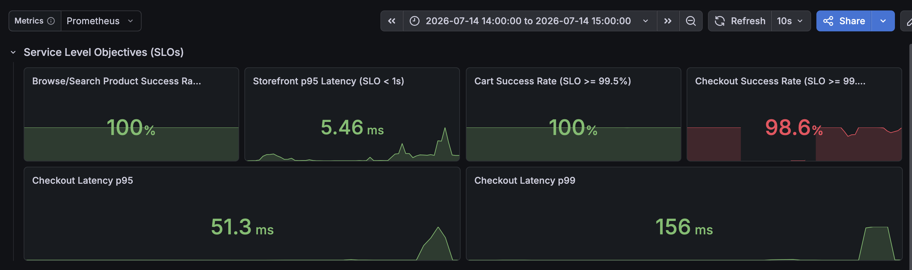
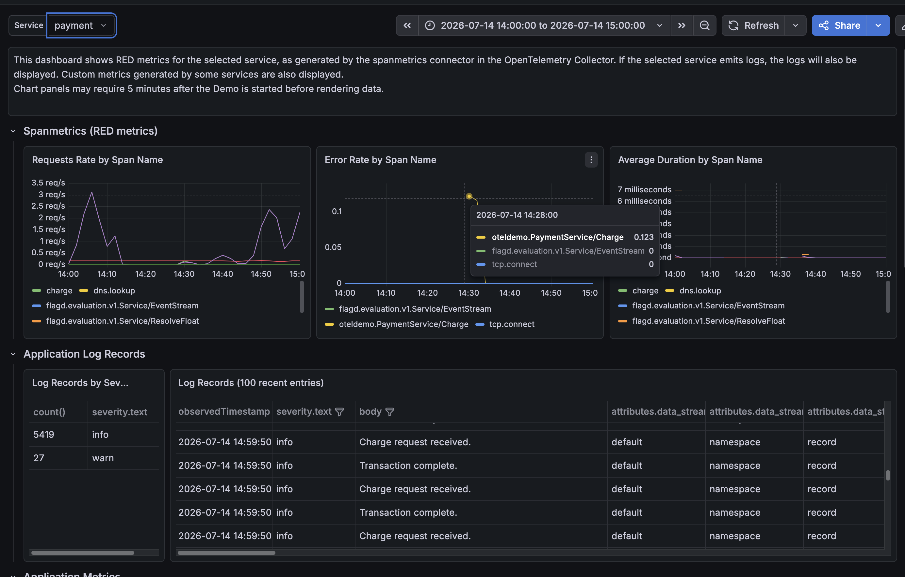
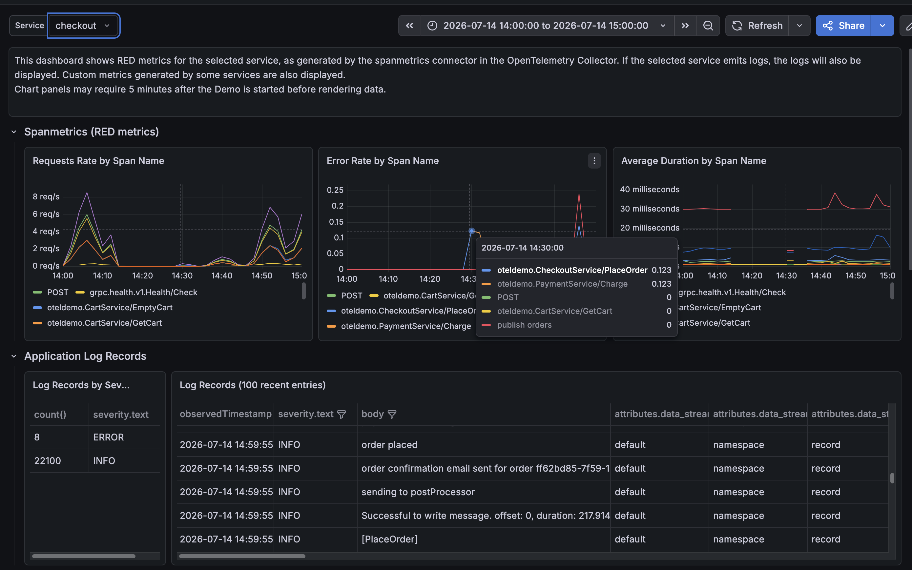
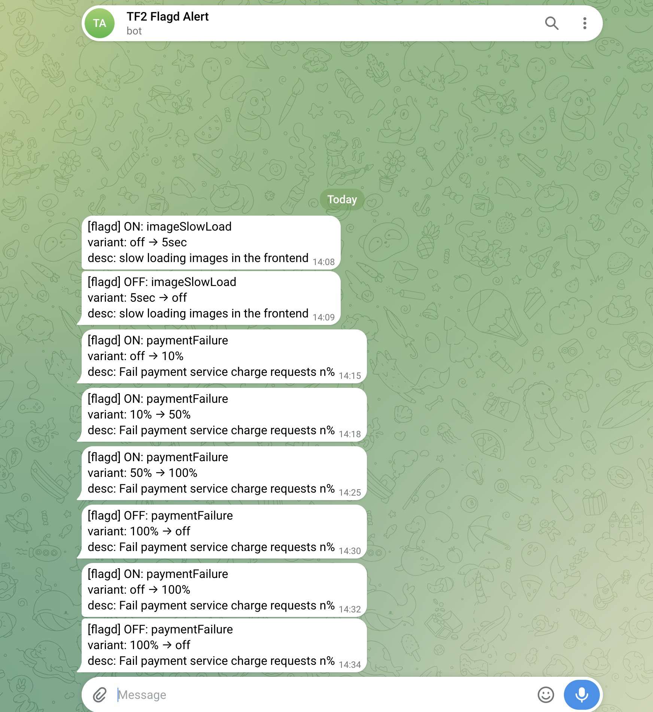
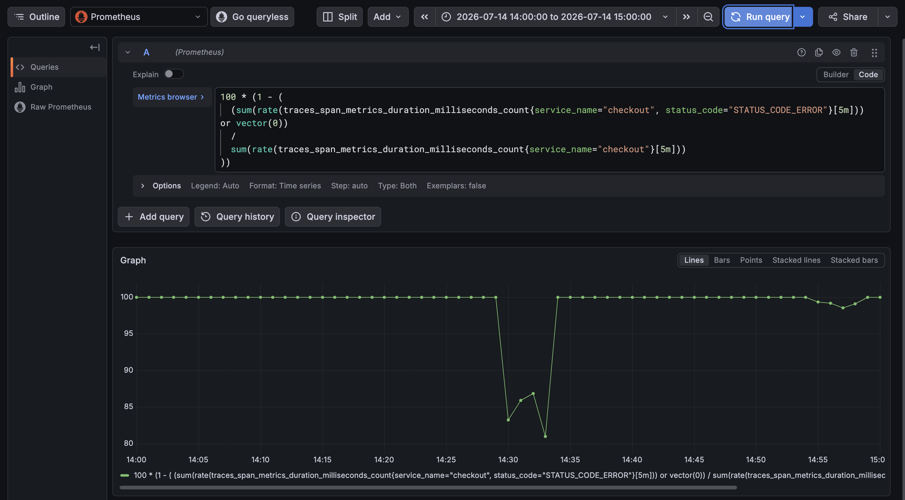
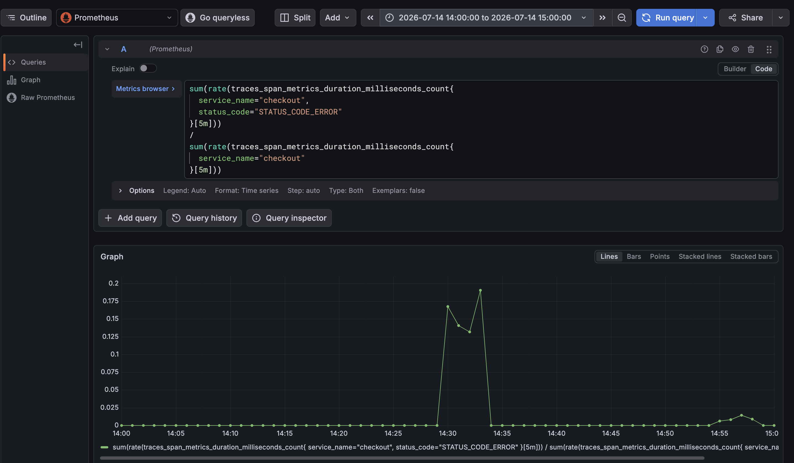
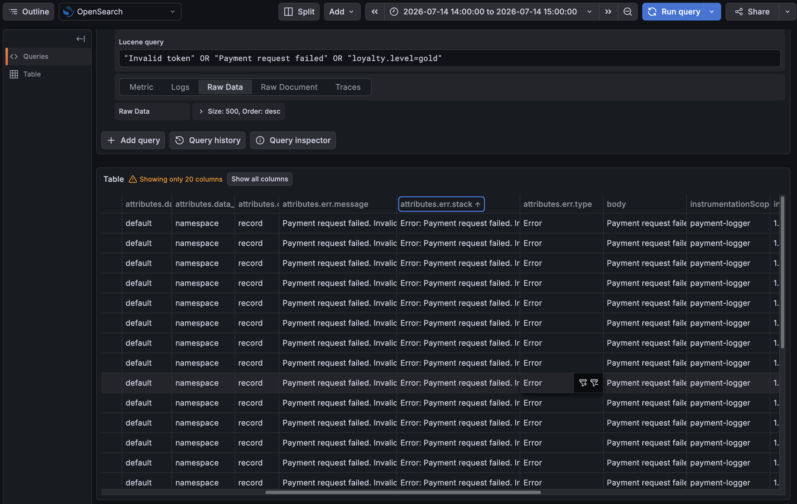
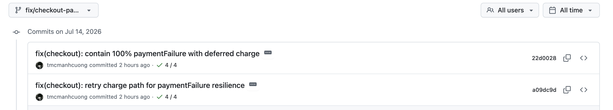

# Incident report — `paymentFailure` (2026-07-14)

| Field | Value |
| --- | --- |
| **Incident ID** | TF2-FLAGD-2026-07-14-paymentFailure |
| **Ngày** | 2026-07-14 |
| **Timezone** | Asia/Ho_Chi_Minh (UTC+7) |
| **Cửa sổ user báo** | **~14:15–14:30** — “không thanh toán được” |
| **Flag** | `paymentFailure` (BTC central flagd) |
| **Mô tả flag** | Fail payment service charge requests n% |
| **Service bị inject** | `payment` — `src/payment/charge.js` |
| **Caller** | `checkout` — `chargeCard()` → gRPC `PaymentService/Charge` |
| **Chính sách BTC flag** | **Không** tắt / bypass / re-point flagd hay OpenFeature hook |
| **Trạng thái** | Flag **OFF** sau ~14:34; SLO hồi phục sau khi flag off |

---

## 1. Tóm tắt

Khoảng **14:15–14:30 (+07)**, user phản ánh không thanh toán được. Radar team đã bắt được fault-injection BTC:

- **Grafana Webstore SLOs** ghi **Checkout Success Rate = 98.6%** trong `14:00–15:00` (**dưới SLO ≥ 99.0%**).
- **Explore Prometheus** xác nhận checkout **error rate → ~1.0** và **success rate → 0%** quanh **14:25–14:35**, rồi hồi sau flag OFF.
- **Explore OpenSearch** còn log body `Payment request failed. Invalid token. app.loyalty.level=gold` (severity ERROR) trong cửa sổ incident.
- **Demo Dashboard (spanmetrics)** thấy **Error Rate** tăng trên `oteldemo.PaymentService/Charge` và checkout `PlaceOrder` / `charge`.
- **Jaeger** **không còn trace** cửa sổ 14:15–14:35 lúc tra cứu (in-memory ring buffer eviction) — gap forensic, không phải “lúc đó không lỗi”.

Containment (không tắt flag): checkout **retry + deferred-charge** đã merge `main` (PR #16 / #17).

---

## 2. Radar có cảm nhận / tự động không?

| Kênh | Tự động? | Bắt được? | Ghi chú |
| --- | --- | --- | --- |
| **Grafana Webstore SLOs** | Metrics panel | **Có (triệu chứng)** | Checkout success **98.6%** (vi phạm SLO) 14:00–15:00 |
| **Explore Prometheus** | Metrics query | **Có (định lượng)** | Error rate ~1.0; success rate ~0% lúc 14:25–14:35 |
| **Explore OpenSearch** | Logs query | **Có (message fault)** | Body `Invalid token` / `loyalty.level=gold` |
| **Grafana Demo / spanmetrics** | Metrics panel | **Có (triệu chứng)** | Error rate payment `Charge` + checkout spans |
| **Jaeger historical traces** | N/A | **Không dùng được** | Memory backend `max_traces`; cửa sổ đã bị eviction |

**Trả lời mentor:** dư chấn **có** trên dashboard / metrics / log và **có auto-alert** qua Telegram flagd.

---

## 3. Root cause

| Hạng mục | Chi tiết |
| --- | --- |
| **Cơ chế** | OpenFeature `getNumberValue("paymentFailure", 0)` trong payment `charge.js` |
| **Fault** | Random throw: `Payment request failed. Invalid token. app.loyalty.level=gold` |
| **Luồng user** | Place order → checkout → `Charge` → fail theo xác suất = % flag |
| **Không phải** | `paymentUnreachable`, cart, frontend image, cạn CPU/memory |

---

## 4. Impact (evidence observability)

### 4.1 Webstore SLOs & Resources — `14:00–15:00`



| Panel | Giá trị | Ý nghĩa |
| --- | --- | --- |
| **Checkout Success Rate** | **98.6%** (đỏ) | **Dưới SLO ≥ 99.0%** — khớp “không thanh toán được” |
| Browse / Cart success | 100% | Phạm vi checkout/payment, không phải browse/cart |
| Storefront p95 | ~5.5 ms | Latency ổn |
| Checkout latency p95/p99 | ~51–156 ms | Vấn đề là **error**, không phải chậm |

### 4.2 Demo Dashboard — service `payment` — `14:00–15:00`



| Tín hiệu | Quan sát |
| --- | --- |
| **Error Rate by Span Name** | `oteldemo.PaymentService/Charge` tăng (~0.1+) quanh **~14:30**, rồi giảm sau flag OFF |
| Request rate | Vẫn có traffic `charge` |
| Duration | Thấp (ms) — mode **fail**, không phải slow |

### 4.3 Demo Dashboard — service `checkout` — `14:00–15:00`



| Tín hiệu | Quan sát |
| --- | --- |
| **Error Rate** | Spike `oteldemo.CheckoutService/PlaceOrder`, `charge`, `grpc.oteldemo.PaymentService/Charge` khoảng **14:20–14:35** |
| Duration | `charge` / PlaceOrder tăng khi fail (retry / error path) |
| Correlation | Lỗi checkout bám theo payment `Charge` fail |

### 4.4 Telegram auto-alert



Message watcher có full chuỗi escalate `paymentFailure` (10% → 50% → 100% → off → 100% → off) → chứng minh **detect tự động** dư chấn flag BTC.

### 4.5 Explore Prometheus — checkout error rate — `14:00–15:00`



Query:

```promql
sum(rate(traces_span_metrics_duration_milliseconds_count{
  service_name="checkout",
  status_code="STATUS_CODE_ERROR"
}[5m]))
/
sum(rate(traces_span_metrics_duration_milliseconds_count{
  service_name="checkout"
}[5m]))
```

| Quan sát | Ý nghĩa |
| --- | --- |
| ~14:00–14:20 | Error rate gần **0** |
| **~14:25–14:35** | Error rate vọt lên **~1.0** (gần như mọi request lỗi) |
| Sau ~14:35 | Error rate **về 0** — khớp flag OFF |

Khớp escalate `paymentFailure` → **100%** và user window 14:15–14:30.

### 4.6 Explore Prometheus — checkout success rate — `14:00–15:00`



Query:

```promql
100 * (1 - (
  (sum(rate(traces_span_metrics_duration_milliseconds_count{service_name="checkout", status_code="STATUS_CODE_ERROR"}[5m])) or vector(0))
  /
  sum(rate(traces_span_metrics_duration_milliseconds_count{service_name="checkout"}[5m]))
))
```

| Quan sát | Ý nghĩa |
| --- | --- |
| Đầu cửa sổ | Success ~**100%** |
| **~14:25–14:35** | Success **rơi về ~0%** (vi phạm nặng SLO ≥ 99%) |
| Sau ~14:35 | Success **hồi ~100%** |

Củng cố panel Webstore Checkout **98.6%** (aggregate cả giờ) — peak fail nằm giữa cửa sổ.

### 4.7 Explore OpenSearch — log payment fail — `14:00–15:00`



| Field | Evidence |
| --- | --- |
| Query / filter | Message chứa `Invalid token` / `Payment request failed` / `loyalty` |
| **severity** | **ERROR** |
| **Body (signature fault)** | `Payment request failed. Invalid token. app.loyalty.level=gold` |
| Timestamp mẫu | `2026-07-14 14:26:xx` → `14:32:xx` (+07) — **trong** user window + wave 100% |
| Volume | Hàng loạt dòng ERROR liên tiếp (scroll list đầy) |

→ Log **chứng minh message** đúng inject path `payment/charge.js` (không chỉ error rate metric).

### 4.8 Jaeger (tra sau sự cố)

| Kiểm tra | Kết quả |
| --- | --- |
| Service `payment` / `checkout`, lookback Last 3–6h, `error=true` / tags trống | **Không còn trace** cửa sổ **14:15–14:35** |
| Trace gần nhất còn thấy | ~**15:54** |
| **Vì sao** | Jaeger backend **in-memory** (`memory_backend`, `MEMORY_MAX_TRACES`); traffic liên tục **evict** trace cũ. Không có nghĩa lúc 14:15–14:30 không lỗi. |
| **Evidence thay thế** | Prometheus (error/success rate) + OpenSearch ERROR logs + Webstore SLO + flagd Telegram |

---

## 5. Response (containment — giữ nguyên flag)

| Hành động | Chi tiết | Ref |
| --- | --- | --- |
| Retry | `checkout.chargeCard`: max **8** attempts, backoff 25ms × 2ⁿ | commit `a09dc9d` |
| Containment @100% | Sau ≥2 hit signature fault → `deferred-payment-<uuid>` (checkout tiếp tục) | commit `22d0028` |
| Ship | Branch `fix/checkout-payment-retry-paymentFailure` → **main** | PR #16, #17 → merge `20dd45f` |
| Cấm | Tắt flagd, gỡ OpenFeature, scale-to-zero payment, chặn network flagd | RULES |

Code: `src/checkout/main.go` (`chargeCard`, `degradedPaymentTransactionID`, classifiers).

### 5.1 GitHub commits (evidence fix)



| Commit | Message | CI |
| --- | --- | --- |
| `a09dc9d` | `fix(checkout): retry charge path for paymentFailure resilience` | ✅ 4/4 |
| `22d0028` | `fix(checkout): contain 100% paymentFailure with deferred charge` | ✅ 4/4 |

Branch: `fix/checkout-payment-retry-paymentFailure` · author `tmcmanhcuong` · **2026-07-14**.

---

## 6. Mục lục evidence

| # | Artifact | Path / vị trí |
| --- | --- | --- |
| 1 | Screenshot Webstore SLO | [`evidence/evidence1/webstore-dashboard.png`](./evidence/evidence1/webstore-dashboard.png) |
| 2 | Demo · payment spanmetrics | [`evidence/evidence1/demo-payment.png`](./evidence/evidence1/demo-payment.png) |
| 3 | Demo · checkout spanmetrics | [`evidence/evidence1/demo-checkout.png`](./evidence/evidence1/demo-checkout.png) |
| 4 | Telegram flagd alerts | [`evidence/evidence1/alert-telegram.png`](./evidence/evidence1/alert-telegram.png) |
| 5 | Explore Prometheus — error rate | [`evidence/evidence1/prometheus-errorrate.png`](./evidence/evidence1/prometheus-errorrate.png) |
| 6 | Explore Prometheus — success rate | [`evidence/evidence1/prometheus-sucessrate.png`](./evidence/evidence1/prometheus-sucessrate.png) |
| 7 | Explore OpenSearch — payment fail logs | [`evidence/evidence1/paymentfail-opensearch.png`](./evidence/evidence1/paymentfail-opensearch.png) |
| 8 | **GitHub commits fix** | [`evidence/evidence1/commit-fix.png`](./evidence/evidence1/commit-fix.png) |
| 9 | Platform fix PRs | GitHub `tf2-corp-platform` PR #16 / #17 |
| 10 | Jaeger historical | **Không còn** trong cửa sổ incident (đã ghi) |

---

## 7. Gap & follow-up

1. **Jaeger storage** — memory-only không đủ forensic sau 1–2h; cân nhắc backend retention dài hơn nếu budget cho phép.
2. **Deploy lag** — code containment trên `main` cần rollout image `checkout` mới mới bảo vệ prod khi flag 100% lần sau.

---

## 8. One-liner gửi nhóm TF / mentor

> **2026-07-14 ~14:15–14:30 (+07):** user không thanh toán được. **Detect:** Telegram flagd-alert `paymentFailure` 10%→50%→100%. **Dashboard:** Checkout Success **98.6%**. **Metrics:** Prometheus error rate ~1.0 / success ~0% lúc 14:25–14:35. **Log:** OpenSearch ERROR `Invalid token. app.loyalty.level=gold`. **RCA:** BTC flag inject `payment/charge.js`. **Response:** checkout retry + deferred charge (PR #16/#17), **không** tắt flag. **Jaeger:** không còn trace.
