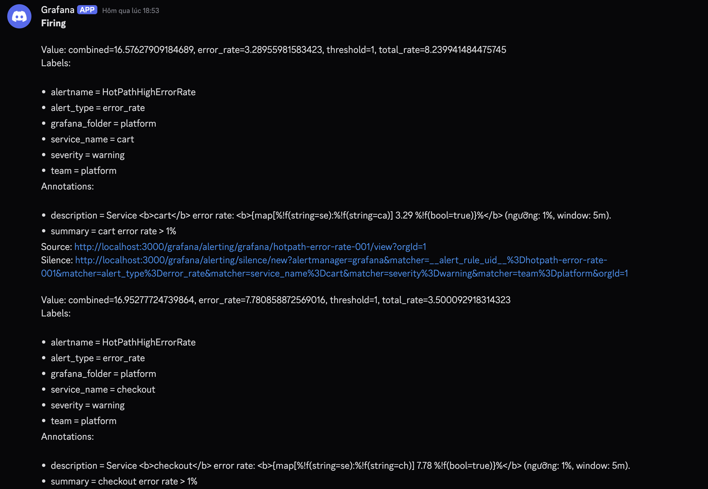
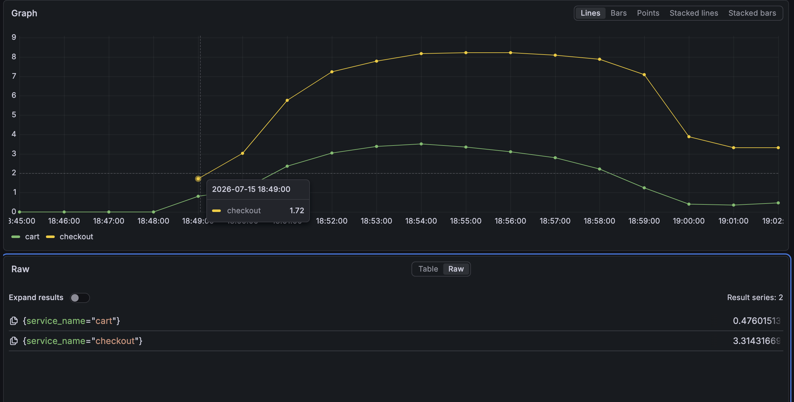
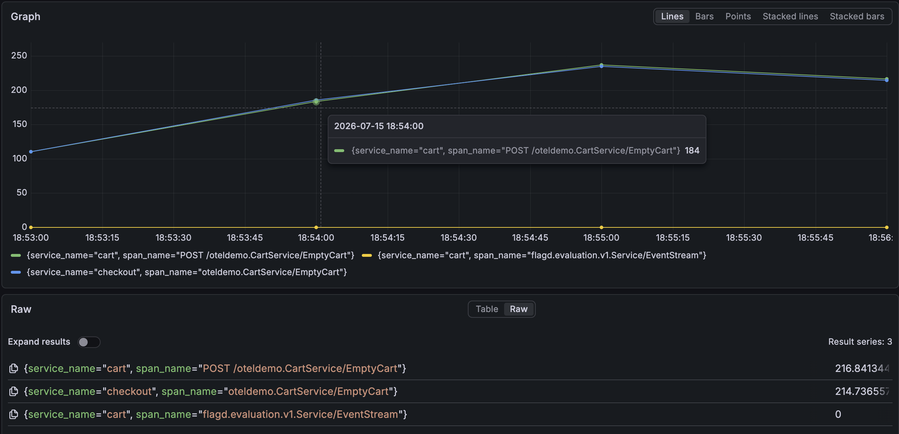
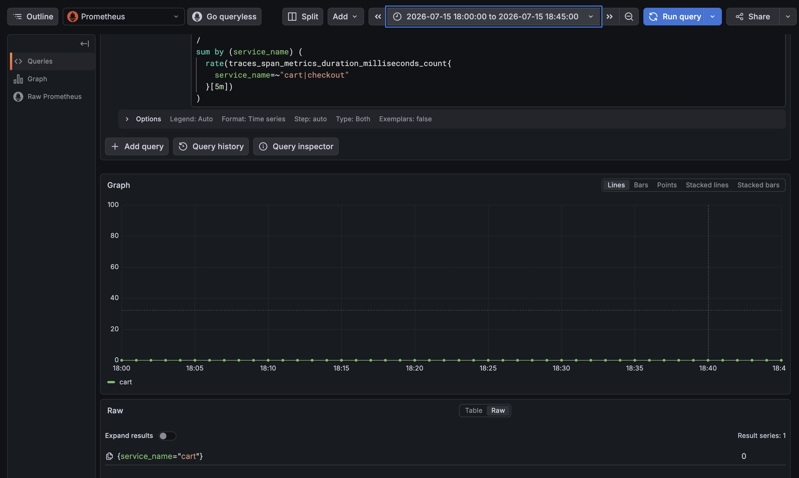
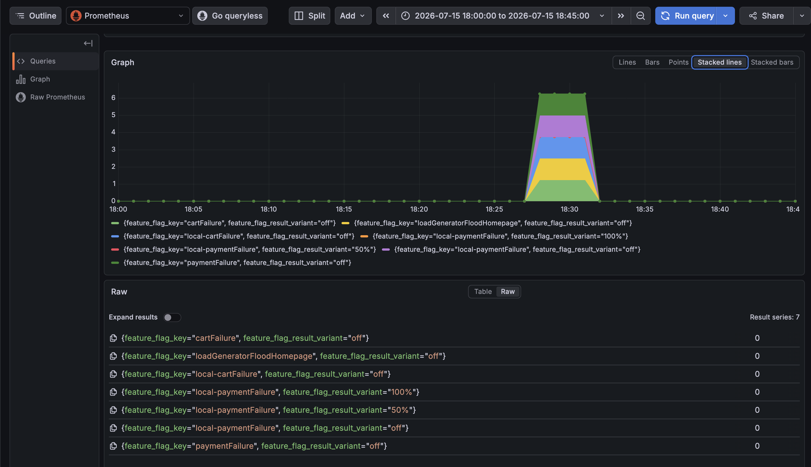
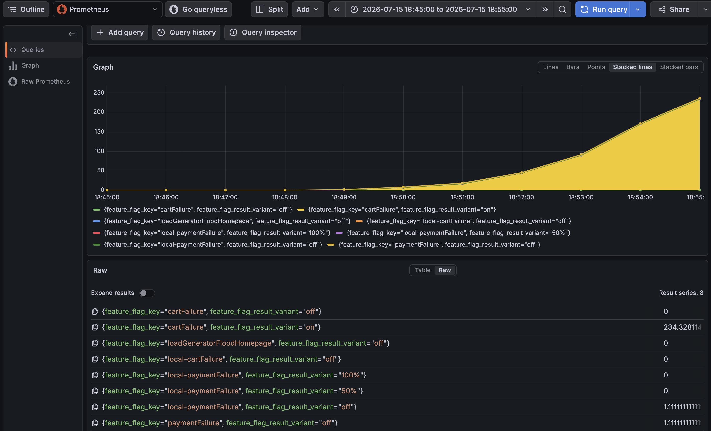
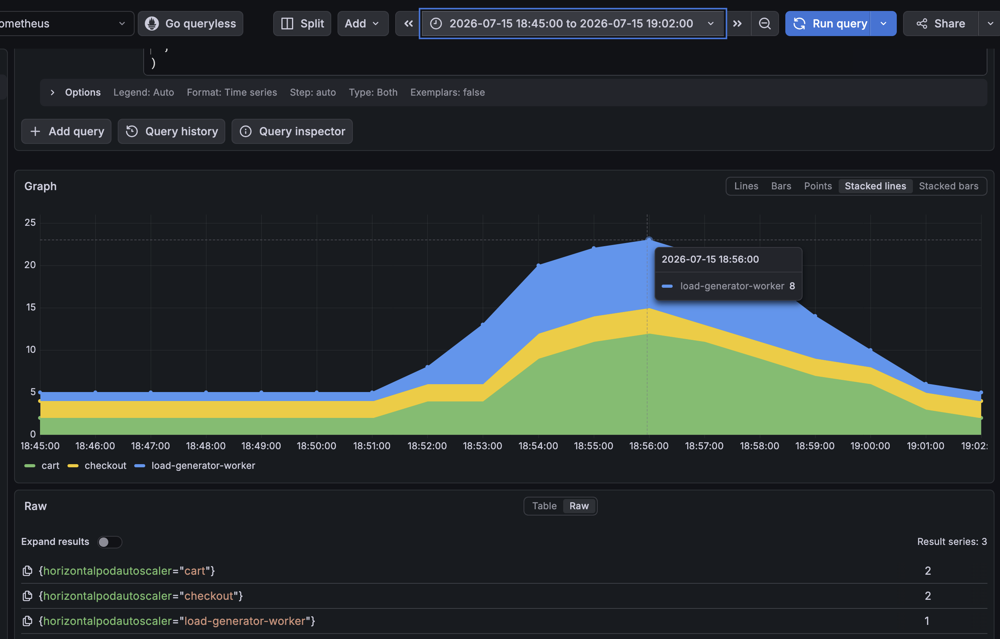
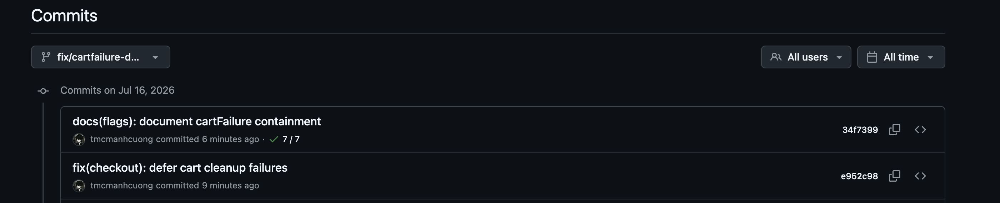

# Incident report — `cartFailure` (2026-07-15)

| Field | Value |
| --- | --- |
| **Incident ID** | TF2-FLAGD-2026-07-15-cartFailure |
| **Ngày** | 2026-07-15 |
| **Timezone** | Asia/Ho_Chi_Minh (UTC+7) |
| **Cửa sổ mentor thông báo** | **~19:02** — "incident vừa mới diễn ra", "nhiều kho lương, quân dụng đang pending nhiều tiếng" |
| **Cửa sổ điều tra chính** | **18:45-19:02 (+07)** |
| **Baseline đã kiểm tra** | **18:00-18:45 (+07)** — chưa thấy error spike / chưa thấy `cartFailure=on` |
| **Kết luận flag** | `cartFailure` (BTC central flagd) |
| **Service bị inject** | `cart` — `src/cart/src/services/CartService.cs` |
| **Caller bị ảnh hưởng** | `checkout` — `emptyUserCart()` gọi gRPC `CartService/EmptyCart` |
| **Trạng thái** | Khớp alert `HotPathHighErrorRate` trên `cart` và `checkout` |

---

## 1. Tóm tắt

Khoảng **18:53-19:02 (+07)**, radar bắt alert **HotPathHighErrorRate** trên hai service **cart** và **checkout**.

1. Grafana alert cho thấy `cart` và `checkout` đều vượt ngưỡng error-rate **1%**.
2. Prometheus error-rate cho thấy `cart` tăng lên khoảng **3.5%**, `checkout` tăng lên khoảng **8.2%**.
3. Span metrics khoanh vùng lỗi vào **`CartService/EmptyCart`**.
4. Code path cho thấy `checkout` gọi `cart.EmptyCart`, nên lỗi ở cart có thể lan sang checkout.
5. Sau khi khoanh vùng path, feature-flag metrics confirm **BTC central flag `cartFailure` trả variant `on`**, trong khi các flag nghi vấn khác không khớp.

Kết luận hợp lý nhất: incident BTC tim vào là **`cartFailure`**, làm fail đường `CartService/EmptyCart`, gây error-rate tăng trên `cart` và ảnh hưởng lan sang `checkout`.

---

## 2. Alert evidence — `HotPathHighErrorRate`



| Tín hiệu | Quan sát |
| --- | --- |
| Thời điểm alert | **18:53 (+07)** |
| Alert | `HotPathHighErrorRate` |
| Service bị alert | `cart`, `checkout` |
| Ngưỡng | `error_rate > 1%`, window 5m |
| `cart` | error_rate khoảng **3.29%** |
| `checkout` | error_rate khoảng **7.78%** |

Diễn giải: alert đầu tiên chỉ vào hot path của `cart` và `checkout`, không phải payment, homepage hay AI/product-reviews.

---

## 3. Impact evidence — error-rate cart/checkout



| Service | Quan sát |
| --- | --- |
| `cart` | Error-rate tăng từ gần **0%** lên peak khoảng **3.5%** quanh **18:54-18:55 (+07)** |
| `checkout` | Error-rate tăng lên peak khoảng **8.2%** quanh **18:55-18:56 (+07)** |

PromQL tham khảo:

```promql
100 *
sum by (service_name) (
  rate(traces_span_metrics_duration_milliseconds_count{
    service_name=~"cart|checkout",
    status_code="STATUS_CODE_ERROR"
  }[5m])
)
/
sum by (service_name) (
  rate(traces_span_metrics_duration_milliseconds_count{
    service_name=~"cart|checkout"
  }[5m])
)
```

Diễn giải: đây là impact chính của incident. `checkout` tăng cao hơn vì checkout là caller chịu lỗi dependency từ cart trong checkout flow.

---

## 4. Path evidence — lỗi tập trung ở `CartService/EmptyCart`



| Service | Span lỗi nổi bật |
| --- | --- |
| `cart` | `POST /oteldemo.CartService/EmptyCart` |
| `checkout` | `oteldemo.CartService/EmptyCart` |

PromQL tham khảo:

```promql
sum by (service_name, span_name) (
  increase(traces_span_metrics_duration_milliseconds_count{
    service_name=~"cart|checkout",
    status_code="STATUS_CODE_ERROR"
  }[5m])
)
```

Diễn giải: lỗi không trải rộng toàn bộ service. Nó tập trung vào operation **EmptyCart**, đúng với đường checkout gọi sang cart khi đặt hàng.

---

## 5. Code evidence

### 5.1 Cart service đọc flag `cartFailure`

Trong `src/cart/src/services/CartService.cs`, method `EmptyCart` đọc cả BTC flag và local twin:

```csharp
bool cartFailure = await _featureFlagHelper.GetBooleanValueAsync("cartFailure", false)
    || await _featureFlagHelper.GetBooleanValueAsync("local-cartFailure", false);
if (cartFailure)
{
    await _badCartStore.EmptyCartAsync(request.UserId);
}
else
{
    await _cartStore.EmptyCartAsync(request.UserId);
}
```

Diễn giải: khi `cartFailure` hoặc `local-cartFailure` bật, `EmptyCart` sẽ đi vào bad cart store (`badhost:1234`) và tạo lỗi. Vì vậy nếu metrics chỉ vào `CartService/EmptyCart`, flag ứng viên khớp nhất là `cartFailure`.

### 5.2 Checkout gọi `CartService/EmptyCart`

Trong `src/checkout/main.go`, checkout flow gọi:

```go
if _, err := cs.cartSvcClient.EmptyCart(ctx, &pb.EmptyCartRequest{UserId: userID}); err != nil {
    return fmt.Errorf("failed to empty user cart during checkout: %+v", err)
}
```

Diễn giải: khi `cart.EmptyCart` fail, checkout nhận error từ dependency và error-rate của checkout tăng theo. Điều này khớp với alert đồng thời trên `cart` và `checkout`.

---

## 6. Baseline evidence — trước 18:45 chưa có dấu hiệu

### 6.1 Baseline error-rate `18:00-18:45`



Quan sát: trong khung **18:00-18:45 (+07)** chưa thấy spike error-rate đáng kể trên `cart` / `checkout`.

### 6.2 Baseline feature flag `18:00-18:45`



Quan sát: trước **18:45 (+07)** không thấy `cartFailure/on`; các flag nghi vấn khác cũng không có non-off signal phù hợp với incident hiện tại.

Diễn giải: baseline sạch giúp chứng minh incident không diễn ra liên tục từ 18:00, mà bắt đầu sau 18:45 và gần với alert trước lúc mentor thông báo.

---

## 7. Correlation với BTC flag — confirm sau khi đã khoanh vùng



Sau khi alert và span metrics đã chỉ về `cart` / `CartService/EmptyCart`, nhóm kiểm tra các feature flag có khả năng tạo symptom tương ứng:

- `cartFailure`
- `local-cartFailure`
- `paymentFailure`
- `local-paymentFailure`
- `loadGeneratorFloodHomepage`

PromQL tham khảo:

```promql
sum by (feature_flag_key, feature_flag_result_variant) (
  increase(feature_flag_flagd_impression_total{
    feature_flag_key=~"cartFailure|local-cartFailure|loadGeneratorFloodHomepage|paymentFailure|local-paymentFailure"
  }[10m])
)
```

| Flag / variant | Quan sát |
| --- | --- |
| `cartFailure` / `on` | **234.328...** impressions trong 10 phút trước **18:55 (+07)** |
| `cartFailure` / `off` | `0` |
| `local-cartFailure` / `off` | `0`, không thấy `local-cartFailure/on` |
| `loadGeneratorFloodHomepage` / `off` | `0`, không thấy flood homepage là root cause |
| `paymentFailure`, `local-paymentFailure` | Chỉ thấy `off` / không có signal non-off phù hợp |

Diễn giải: đây là bằng chứng confirm sau khi đã khoanh vùng bằng alert và span metrics. `cartFailure/on` là flag duy nhất khớp với symptom `CartService/EmptyCart` lỗi trên `cart` và lan sang `checkout`.

---

## 8. HPA / scale evidence



| HPA | Quan sát |
| --- | --- |
| `cart` | Tăng từ baseline **2** lên khoảng **12** quanh **18:55-18:56** |
| `checkout` | Tăng nhẹ quanh cửa sổ incident |
| `load-generator-worker` | Tăng từ baseline **1** lên **8** quanh **18:56** |

Diễn giải: scale-up này là **dư chấn / autoscaling response** trong lúc error/load tăng. Vì `loadGeneratorFloodHomepage` không có signal bật, HPA/node scale không phải root cause chính.

---

## 9. Response / containment



| Hạng mục | Xử lý |
| --- | --- |
| **Nguyên tắc BTC** | Không tắt flagd, không sửa flag, không bypass OpenFeature, không chặn traffic BTC |
| **Code path xử lý** | `checkout.emptyUserCart()` |
| **Cách xử lý** | Retry ngắn `CartService/EmptyCart` tối đa **3 lần**, backoff 25ms, 50ms |
| **Degraded mode** | Nếu vẫn fail, ghi log/trace `cart cleanup deferred` và **không làm fail checkout response** |
| **Telemetry** | Set span attributes `app.cart.cleanup.status=succeeded/deferred`, `app.cart.cleanup.attempts` |
| **Commit fix** | `e952c98` — `fix(checkout): defer cart cleanup failures` |
| **Commit docs** | `34f7399` — `docs(flags): document cartFailure containment` |
| **CI** | GitHub checks **7/7** pass trên branch fix |

### 9.1 Vì sao cách này giảm ảnh hưởng khách hàng tốt nhất?

Trong incident này, lỗi nằm ở bước **dọn giỏ hàng sau khi order đã được xử lý**, không phải ở bước lấy cart, tính tiền hay charge payment. Nếu để lỗi `EmptyCart` làm fail toàn bộ `checkout`, khách sẽ thấy đặt hàng thất bại dù các bước quan trọng đã xong.

Containment mới chuyển `EmptyCart` thành **best-effort cleanup**:

- Nếu cart chỉ lỗi thoáng qua, retry ngắn sẽ tự hồi.
- Nếu BTC `cartFailure` vẫn làm `EmptyCart` fail, checkout vẫn trả order success cho khách.
- Dư chấn còn lại chỉ là cart có thể chưa được dọn ngay; mức ảnh hưởng này nhỏ hơn nhiều so với chặn khách đặt hàng.
- Log/trace vẫn giữ đủ tín hiệu để radar thấy cleanup bị deferred, không che giấu incident.

Điểm quan trọng: cách này **giữ nguyên cơ chế BTC** và chỉ tăng resilience ở application layer, đúng yêu cầu "phát hiện và xử lý, giữ ảnh hưởng tới khách nhỏ nhất (không tắt cơ chế)".

---

## 10. Loại trừ các hướng khác

| Hướng nghi ngờ | Kết quả | Lý do loại trừ |
| --- | --- | --- |
| `paymentFailure` | Không phải incident hiện tại | Incident paymentFailure đã xảy ra và xử lý trước đó; symptom hiện tại không nằm ở `payment/Charge` |
| `loadGeneratorFloodHomepage` | Không khớp | Flag này không có non-off signal; alert là hot path error trên `cart` / `checkout` |
| `local-cartFailure` | Không khớp nguồn local | Không thấy `local-cartFailure/on`; root cause phù hợp hơn là BTC central `cartFailure` |
| Product reviews / AI issue | Không khớp | Lỗi team AI/model-side riêng, không giải thích `CartService/EmptyCart` và alert `cart/checkout` |
| Node scale lên 5 | Dư chấn hạ tầng | Có thể là hệ quả autoscaling, không phải root cause khi flag/path đã khớp hơn |

---

## 11. Mục lục evidence

| # | Artifact | Path |
| --- | --- | --- |
| 1 | Grafana alert `HotPathHighErrorRate` | [`evidence/evidence2/alert-error.png`](./evidence/evidence2/alert-error.png) |
| 2 | Prometheus error-rate `cart|checkout` | [`evidence/evidence2/error-rate.png`](./evidence/evidence2/error-rate.png) |
| 3 | Span operation `EmptyCart` | [`evidence/evidence2/emptycart.png`](./evidence/evidence2/emptycart.png) |
| 4 | Baseline error-rate `18:00-18:45` | [`evidence/evidence2/baseline-error.png`](./evidence/evidence2/baseline-error.png) |
| 5 | Baseline flags trước incident | [`evidence/evidence2/cartflag-off.png`](./evidence/evidence2/cartflag-off.png) |
| 6 | Flag correlation `cartFailure/on` | [`evidence/evidence2/cartflagd-on.png`](./evidence/evidence2/cartflagd-on.png) |
| 7 | HPA scale during incident | [`evidence/evidence2/hpa-scale.png`](./evidence/evidence2/hpa-scale.png) |
| 8 | Commits fix containment | [`evidence/evidence2/commit-fix.png`](./evidence/evidence2/commit-fix.png) |

---

## 12. One-liner gửi mentor

> **2026-07-15 ~18:53-19:02 (+07):** Radar bắt alert `HotPathHighErrorRate` trên `cart` và `checkout` (`cart` ~3.29%, `checkout` ~7.78%, ngưỡng 1%). Prometheus cho thấy error-rate `cart` peak ~3.5%, `checkout` peak ~8.2%; span metrics khoanh vùng lỗi vào `CartService/EmptyCart`. Baseline `18:00-18:45` sạch. Sau khi khoanh vùng path, flag metrics confirm BTC central `cartFailure` trả variant `on`, trong khi `local-cartFailure`, `paymentFailure`, `loadGeneratorFloodHomepage` không khớp. RCA: BTC inject `cartFailure` làm fail `cart.EmptyCart`, ảnh hưởng lan sang checkout. **Response:** checkout retry `EmptyCart` ngắn, nếu vẫn fail thì defer cart cleanup và vẫn trả order success, giảm impact khách hàng mà không tắt/bypass cơ chế BTC.
