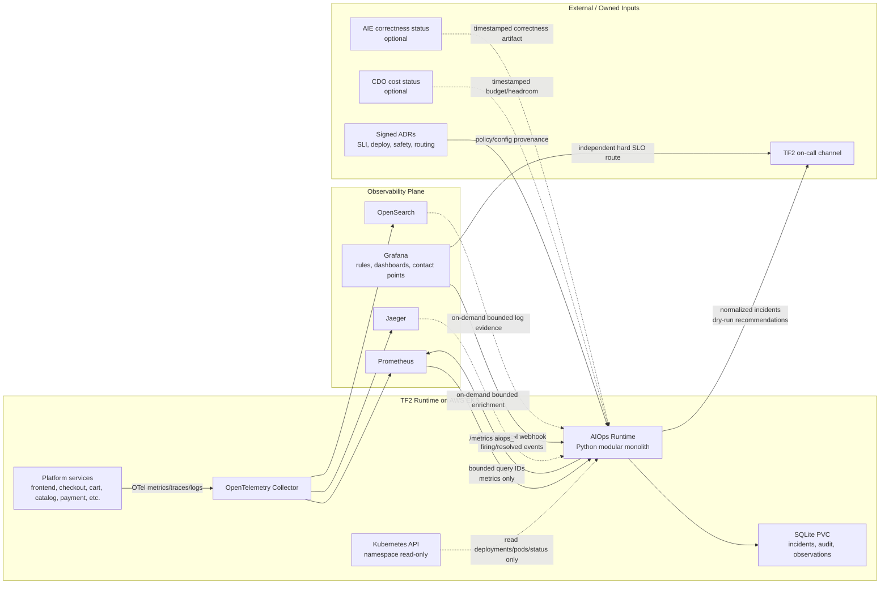
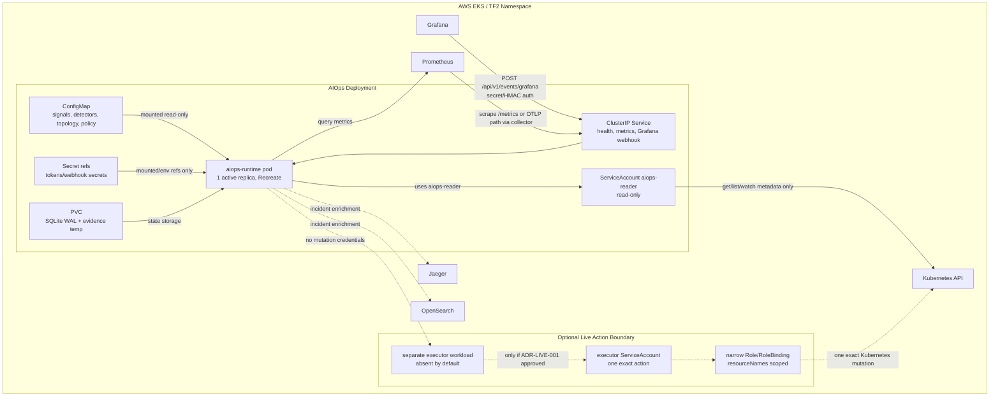

## Kết Nối Hạ Tầng Tổng Thể

```mermaid
flowchart LR
    subgraph TF2["TF2 Runtime on AWS EKS"]
        APP["Platform services<br/>frontend, checkout, cart, catalog, payment, etc."]
        OTEL["OpenTelemetry Collector"]
        AIOPS["AIOps Runtime<br/>Python modular monolith"]
        STORE["SQLite PVC<br/>incidents, audit, observations"]
        K8S["Kubernetes API<br/>namespace read-only"]
    end

    subgraph OBS["Observability Plane"]
        PROM["Prometheus"]
        GRAFANA["Grafana<br/>rules, dashboards, contact points"]
        JAEGER["Jaeger"]
        OS["OpenSearch"]
    end

    subgraph EXT["External / Owned Inputs"]
        AIE["AIE correctness status<br/>optional"]
        COST["CDO cost status<br/>optional"]
        ONCALL["TF2 on-call channel"]
        ADR["Signed ADRs<br/>SLI, deploy, safety, routing"]
    end

    APP -->|OTel metrics/traces/logs| OTEL
    OTEL --> PROM
    OTEL --> JAEGER
    OTEL --> OS

    PROM -->|bounded query IDs<br/>metrics only| AIOPS
    GRAFANA -->|authenticated webhook<br/>firing/resolved events| AIOPS
    JAEGER -.->|on-demand bounded enrichment| AIOPS
    OS -.->|on-demand bounded log evidence| AIOPS
    K8S -.->|read deployments/pods/status only| AIOPS

    AIE -.->|timestamped correctness artifact| AIOPS
    COST -.->|timestamped budget/headroom| AIOPS
    ADR -->|policy/config provenance| AIOPS

    AIOPS --> STORE
    AIOPS -->|normalized incidents<br/>dry-run recommendations| ONCALL

    GRAFANA -->|independent hard SLO route| ONCALL

    AIOPS -->|/metrics aiops_*| PROM
```

## EKS Deployment Và RBAC Boundary

```mermaid
flowchart TB
    subgraph EKS["AWS EKS / TF2 Namespace"]
        subgraph AIO["AIOps Deployment"]
            POD["aiops-runtime pod<br/>1 active replica, Recreate"]
            SVC["ClusterIP Service<br/>health, metrics, Grafana webhook"]
            CM["ConfigMap<br/>signals, detectors, topology, policy"]
            SEC["Secret refs<br/>tokens/webhook secrets"]
            PVC["PVC<br/>SQLite WAL + evidence temp"]
            SA["ServiceAccount aiops-reader<br/>read-only"]
        end

        subgraph OPTIONAL["Optional Live Action Boundary"]
            EXEC["separate executor workload<br/>absent by default"]
            EXECSA["executor ServiceAccount<br/>one exact action"]
            ROLE["narrow Role/RoleBinding<br/>resourceNames scoped"]
        end

        KAPI["Kubernetes API"]
        PROM["Prometheus"]
        GRAFANA["Grafana"]
        JAEGER["Jaeger"]
        OS["OpenSearch"]
    end

    CM -->|mounted read-only| POD
    SEC -->|mounted/env refs only| POD
    PVC -->|state storage| POD
    SVC --> POD

    GRAFANA -->|POST /api/v1/events/grafana<br/>secret/HMAC auth| SVC
    PROM -->|scrape /metrics or OTLP path via collector| SVC

    POD -->|query metrics| PROM
    POD -.->|incident enrichment| JAEGER
    POD -.->|incident enrichment| OS

    POD -->|uses aiops-reader| SA
    SA -->|get/list/watch metadata only| KAPI

    POD -.->|no mutation credentials| EXEC
    EXEC -.->|only if ADR-LIVE-001 approved| EXECSA
    EXECSA -.-> ROLE
    ROLE -.->|one exact Kubernetes mutation| KAPI
```
