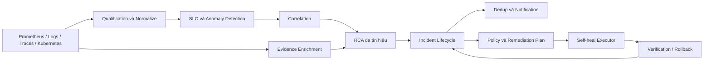

# Báo cáo tiến độ AIOps và Self-heal

**Ngày báo cáo:** 29/07/2026  
**Nhánh Git:** `docs/self-heal-executor-capabilities`  
**Commit hiện tại:** `e5de826`  
**Phạm vi:** Anomaly Detection, RCA, Incident Management, Notification và Self-heal Executor

## 1. Tóm tắt điều hành

Hệ thống AIOps hiện đã hình thành đầy đủ chuỗi xử lý từ thu thập telemetry, phát hiện bất thường, xác định nguyên nhân gốc, quản lý vòng đời incident, gửi thông báo đến lập kế hoạch self-heal. Engine ưu tiên phát hiện sớm và giải thích bằng nhiều nguồn bằng chứng gồm metric, topology, thứ tự thời gian, log, trace và trạng thái Kubernetes.

Trong giai đoạn từ 17/07 đến 29/07, lịch sử Git ghi nhận **178 commit tác động đến thư mục `aio`**. Các thay đổi gần nhất hoàn thiện giao tiếp với CDO qua API contract, action catalog, service-level support catalog, cơ chế allowlist, idempotency, audit và rollback metadata.

Self-heal hiện ở trạng thái **sẵn sàng tích hợp có kiểm soát**, chưa phải tự động mutate toàn bộ production. AIOps đưa ra quyết định và kế hoạch; executor chỉ được thực thi action đã allowlist, qua policy/approval và có dữ liệu phục vụ verification/rollback.

## 2. Những phần đã hoàn thành

### 2.1 Thu thập và chuẩn hóa dữ liệu

- Thu thập metric từ Prometheus theo registry cho từng service.
- Chuẩn hóa dữ liệu về `MetricSeries` và bucket thời gian thống nhất.
- Phân loại dữ liệu `verified`, `missing`, `stale`, `invalid` trước khi chạy detector.
- Hỗ trợ enrichment theo nhu cầu từ OpenSearch, Jaeger và Kubernetes.

### 2.2 Anomaly Detection

- Detector theo SLO/threshold và detector thống kê hoạt động song song.
- Hỗ trợ EWMA, robust drift, Isolation Forest, CUSUM/Page-Hinkley và slow-drift.
- Có current-tail gate để tránh cảnh báo từ bất thường đã kết thúc.
- Có growth gate để loại biến động tài nguyên được giải thích bởi thay đổi request rate.
- OOM counter được giữ làm bằng chứng mạnh và không bị growth gate loại bỏ.
- Hyperparameter được đưa ra cấu hình để có thể tune theo từng nhóm metric.

### 2.3 Root Cause Analysis

- Tạo danh sách service nghi phạm từ anomaly và SLO context.
- Kết hợp dependency graph, thứ tự drift, shape correlation, downstream coverage và evidence strength.
- Chuẩn hóa `graph_score` và dùng weighted Reciprocal Rank Fusion để hạn chế một score đơn lẻ chi phối kết quả.
- Chọn một primary root service thay vì chỉ liệt kê các service đang đỏ.
- Enrichment theo thứ tự: root service trước, dependency một hop sau, rồi mới mở rộng khi RCA yếu hoặc có nhiều ứng viên cạnh tranh.

### 2.4 Incident và Notification

- Incident có vòng đời `open -> ongoing -> recovered`.
- Dedup RCA và notification theo fingerprint/cửa sổ thời gian để giảm spam.
- Notification chứa root service, metric, RCA score, score thành phần, runbook và evidence từ log/trace khi có.
- Hỗ trợ notification bổ sung một lần khi strong evidence xuất hiện sau notification đầu.
- Có audit log cho các trường hợp dedup, suppression và remediation decision.

### 2.5 Self-heal Executor

Ba commit gần nhất thể hiện phần bàn giao chính:

| Commit | Nội dung |
| --- | --- |
| `6b326d6` | Thêm self-heal executor handoff, API, store, action scripts, validation docs và tests |
| `fe71fb8` | Công bố executor action capabilities và JSON action catalog |
| `e5de826` | Thêm service-level executor support catalog và mở rộng kiểm thử |

Executor hiện cung cấp:

- API plan/execute theo contract rõ ràng giữa AI và CDO.
- Allowlist action và target; request ngoài catalog bị từ chối.
- Idempotency để tránh thực thi lặp lại cùng hành động.
- Snapshot trước/sau, `plan_hash`, `rollback_token` và verification metadata.
- Các action đã có script: scale deployment, restore replicas và page on-call.
- Action restart đã có trong contract/catalog nhưng chưa được coi là mutation production hoàn chỉnh nếu chưa có implementation và approval tương ứng.

## 3. Kiến trúc tổng quan



## 4. Bằng chứng đánh giá

### 4.1 Dataset nghiên cứu RE2-SS

Kết quả đã ghi nhận trên 120 case:

| Chỉ số RCA | Baseline | Engine hiện tại |
| --- | ---: | ---: |
| Top-K precision | 0.078 | **0.172** |
| Top-K recall | 0.392 | **0.858** |
| Top-K F1 | 0.131 | **0.286** |
| Top-K hit-rate | 30.8% | **85.0%** |

RCA top-K hit-rate tăng từ 30.8% lên 85.0%, cho thấy engine hiện tại tìm đúng service và metric family tốt hơn baseline. Không dùng incident precision/recall 1.0 của bộ này để tuyên bố hệ thống không có false positive, vì dataset không chứa case normal.

### 4.2 Hệ thống live

Các tài liệu evaluation hiện cảnh báo số liệu live cũ chưa đủ tin cậy do từng bỏ sót một số RCA false positive khỏi mẫu số. Vì vậy các giá trị precision 66.7%-100% trước đây **không được dùng làm số liệu nghiệm thu chính thức** cho đến khi hoàn tất rerun trên tập có cả fault và normal window.

### 4.3 Trạng thái test tại thời điểm báo cáo

Lệnh kiểm thử toàn bộ:

```bash
conda run -n capstone python -m pytest aio/tests -q
```

Lần chạy ngày 29/07/2026 không hoàn tất sau hơn 3 phút và được dừng chủ động, không có failure output trước khi dừng. Vì vậy báo cáo này không tuyên bố full suite pass tại commit `e5de826`; cần chạy lại có timeout/per-test duration để xác định test chậm hoặc bị treo.

## 5. Giá trị mang lại

- Giảm alert rời rạc bằng correlation, incident dedup và RCA notification.
- Cung cấp một root service có lý lẽ thay vì chỉ báo triệu chứng downstream.
- Phát hiện được spike, change-point và xu hướng tăng chậm trên nhiều nhóm metric.
- Cho phép AIOps và CDO tích hợp qua contract ổn định mà không cấp trực tiếp quyền Kubernetes cho AI engine.
- Tạo nền tảng audit được cho mọi quyết định notify, suppress, plan, execute và rollback.

## 6. Rủi ro và giới hạn hiện tại

| Mức độ | Nội dung | Ảnh hưởng |
| --- | --- | --- |
| Cao | Evaluation live cần chạy lại trên cả fault và normal window | Chưa thể chốt precision production |
| Cao | Live mutation chưa được mở rộng ngoài action/target đã allowlist | Chưa thể tự heal mọi service |
| Trung bình | Threshold/hyperparameter vẫn cần tune bằng telemetry production dài ngày | Có thể còn false positive hoặc bỏ sót drift nhỏ |
| Trung bình | Restart action chưa có mức hỗ trợ tương đương scale/restore/page | Một số runbook mới chỉ dừng ở đề xuất |
| Trung bình | Full test suite tại HEAD có dấu hiệu chạy lâu/treo | Cần xác định test hoặc dependency gây chậm |
| Thấp | Một số tài liệu evaluation cũ chứa số liệu đã bị cảnh báo | Có nguy cơ báo cáo nhầm nếu trích dẫn không đúng phiên bản |

## 7. Kế hoạch ưu tiên đề xuất

1. Chạy lại evaluation live có nhãn với normal window, công bố precision, recall, false alerts/hour và lead-time từ cùng một nguồn dữ liệu.
2. Chạy test theo nhóm và bật duration/timeout để xử lý test suite bị chậm trước khi merge.
3. Hoàn thiện restart deployment với cùng guardrail, verification và rollback contract như scale.
4. Chỉ mở live execution cho từng action/service sau khi CDO xác nhận RBAC, approval và rollback drill.
5. Theo dõi false positive theo metric family trong ít nhất một tuần rồi mới chốt hyperparameter production.

## 8. Kết luận

Engine đã đi qua giai đoạn proof-of-concept và hiện có kiến trúc end-to-end, RCA đa tín hiệu, incident lifecycle, notification và contract self-heal có kiểm soát. Giá trị kỹ thuật nổi bật nhất là RCA top-K hit-rate đạt 85% trên RE2-SS và việc tách quyền quyết định của AIOps khỏi quyền thực thi của CDO executor.

Điều kiện còn thiếu để tuyên bố production-ready là số liệu live được re-validate, full test suite ổn định và approval chính thức cho từng action mutation. Khuyến nghị tiếp tục theo hướng mở quyền từng bước, không bật self-heal diện rộng ngay lập tức.
