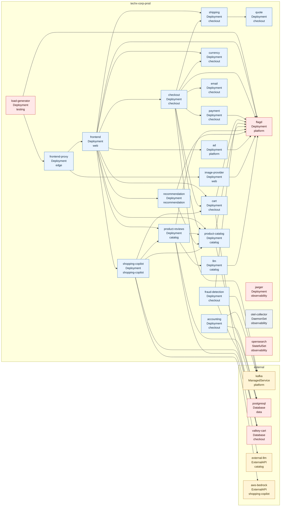

# CDO Runtime Topology

Nguồn chính: `aio/config/runtime.json`.

## Validation

- Runtime topology hiện có 28 services và 48 dependency edges.
- Không có dependency trỏ tới service không tồn tại.
- Không có self-dependency.
- Không có duplicate service name.
- `TopologyGraph` regression hiện kiểm tra các edge trọng yếu: `checkout -> payment`, `frontend -> shipping`, `shipping -> quote`, `payment` blast radius, `accounting`, `fraud-detection`, `product-reviews`, `shopping-copilot`.

## Accuracy Notes

- File này phản ánh runtime topology dùng cho AIOps RCA/remediation, không phải full observability graph.
- `aio/docs/operations/topology/platform-topology.graph.json` là artifact rộng hơn, có thêm `grafana`, `prometheus`, `aiops-runtime`, `aiops-state`, `kubernetes-api`, `tf2-oncall-channel`, `flagd-ui`, `cdo-cost-snapshot`, và observability edges.
- Runtime topology có các node/edge mới hơn artifact rộng: `shopping-copilot`, `aws-bedrock`, `external-llm`, cùng các dependency AI path của `shopping-copilot`.
- Vì vậy độ chính xác runtime hiện ổn cho RCA path; artifact rộng nên được refresh nếu muốn dùng nó làm bản đồ CDO tổng.
