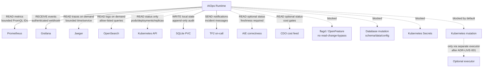

## JSON schema cho các API / integration contract

Các schema dưới đây mô tả contract dữ liệu giữa AIOps Runtime và các hệ thống bên ngoài. Đây là schema cấp kiến trúc để dùng cho validate config, contract test, mock/replay fixture và review bảo mật. Giá trị endpoint, token, namespace, metric name thật phải lấy từ ADR/config triển khai, không hardcode trong code.

Quy ước chung:

- `schema_version` dùng version semver đơn giản cho contract.
- Mọi timestamp dùng RFC3339 UTC.
- Mọi query tới hệ ngoài phải đi qua `query_id` hoặc `query_ref` đã allow-list, không build query từ alert text.
- Các response từ collector luôn cần `status`, `captured_at`, `source`, `time_range` và `evidence_ref` hoặc digest để audit.
- Payload có text/log/annotation được xem là untrusted input và phải redact trước khi lưu hoặc notify.

---

## 1. Common collector envelope

Dùng làm envelope chuẩn cho mọi dữ liệu AIOps thu về từ Prometheus, Jaeger, OpenSearch, Kubernetes, AIE và cost feed.

```json AIO/các API cần kết nối.md
{
  "$schema": "https://json-schema.org/draft/2020-12/schema",
  "$id": "https://aiops.techx.io/schemas/common/collector-envelope.schema.json",
  "title": "CollectorEnvelope",
  "type": "object",
  "additionalProperties": false,
  "required": [
    "schema_version",
    "source",
    "status",
    "query_id",
    "captured_at",
    "time_range",
    "data"
  ],
  "properties": {
    "schema_version": { "type": "string", "pattern": "^1\\.0$" },
    "source": {
      "type": "string",
      "enum": ["prometheus", "grafana", "jaeger", "opensearch", "kubernetes", "aie", "cost"]
    },
    "status": {
      "type": "string",
      "enum": ["success", "partial", "timeout", "error", "no_data", "stale", "invalid", "unauthorized"]
    },
    "query_id": {
      "type": "string",
      "pattern": "^[a-z0-9][a-z0-9_.:-]{2,127}$"
    },
    "captured_at": { "type": "string", "format": "date-time" },
    "time_range": {
      "type": "object",
      "additionalProperties": false,
      "required": ["start", "end"],
      "properties": {
        "start": { "type": "string", "format": "date-time" },
        "end": { "type": "string", "format": "date-time" }
      }
    },
    "source_revision": { "type": ["string", "null"], "maxLength": 128 },
    "evidence_ref": { "type": ["string", "null"], "maxLength": 512 },
    "result_digest": { "type": ["string", "null"], "pattern": "^(sha256:[a-f0-9]{64})$" },
    "error": {
      "type": ["object", "null"],
      "additionalProperties": false,
      "properties": {
        "code": { "type": "string", "maxLength": 64 },
        "message": { "type": "string", "maxLength": 512 },
        "retryable": { "type": "boolean" }
      }
    },
    "data": { "type": ["object", "array", "string", "number", "boolean", "null"] }
  }
}
```

---

## 2. Prometheus API

AIOps gọi Prometheus theo hướng read-only bằng query ID đã đăng ký trong config. Contract này mô tả request nội bộ từ collector tới adapter; adapter sẽ chuyển thành Prometheus HTTP API như `/api/v1/query` hoặc `/api/v1/query_range`.

```json AIO/các API cần kết nối.md
{
  "$schema": "https://json-schema.org/draft/2020-12/schema",
  "$id": "https://aiops.techx.io/schemas/integrations/prometheus-query-request.schema.json",
  "title": "PrometheusQueryRequest",
  "type": "object",
  "additionalProperties": false,
  "required": ["schema_version", "query_id", "mode", "time_range", "timeout_seconds"],
  "properties": {
    "schema_version": { "type": "string", "pattern": "^1\\.0$" },
    "query_id": { "type": "string", "pattern": "^[a-z0-9][a-z0-9_.:-]{2,127}$" },
    "query_ref": { "type": "string", "pattern": "^config/queries/[a-z0-9_./-]+\\.ya?ml#[a-z0-9_.:-]+$" },
    "mode": { "type": "string", "enum": ["instant", "range"] },
    "time_range": {
      "type": "object",
      "additionalProperties": false,
      "required": ["start", "end"],
      "properties": {
        "start": { "type": "string", "format": "date-time" },
        "end": { "type": "string", "format": "date-time" },
        "step_seconds": { "type": "integer", "minimum": 1, "maximum": 3600 }
      }
    },
    "expected_unit": {
      "type": "string",
      "enum": ["ratio", "seconds", "milliseconds", "count", "requests_per_second", "bytes", "percent", "boolean"]
    },
    "required_labels": {
      "type": "array",
      "items": { "type": "string", "pattern": "^[a-zA-Z_][a-zA-Z0-9_]*$" },
      "uniqueItems": true
    },
    "max_series": { "type": "integer", "minimum": 1, "maximum": 1000 },
    "timeout_seconds": { "type": "number", "minimum": 0.1, "maximum": 30 }
  }
}
```

```json AIO/các API cần kết nối.md
{
  "$schema": "https://json-schema.org/draft/2020-12/schema",
  "$id": "https://aiops.techx.io/schemas/integrations/prometheus-query-response.schema.json",
  "title": "PrometheusQueryResponse",
  "type": "object",
  "additionalProperties": false,
  "required": ["schema_version", "source", "status", "query_id", "captured_at", "time_range", "result_type", "series"],
  "properties": {
    "schema_version": { "type": "string", "pattern": "^1\\.0$" },
    "source": { "const": "prometheus" },
    "status": { "type": "string", "enum": ["success", "partial", "timeout", "error", "no_data", "stale", "invalid", "unauthorized"] },
    "query_id": { "type": "string", "pattern": "^[a-z0-9][a-z0-9_.:-]{2,127}$" },
    "captured_at": { "type": "string", "format": "date-time" },
    "time_range": {
      "type": "object",
      "required": ["start", "end"],
      "additionalProperties": false,
      "properties": {
        "start": { "type": "string", "format": "date-time" },
        "end": { "type": "string", "format": "date-time" },
        "step_seconds": { "type": ["integer", "null"], "minimum": 1, "maximum": 3600 }
      }
    },
    "result_type": { "type": "string", "enum": ["scalar", "vector", "matrix"] },
    "unit": { "type": "string" },
    "series": {
      "type": "array",
      "maxItems": 1000,
      "items": {
        "type": "object",
        "additionalProperties": false,
        "required": ["labels", "samples"],
        "properties": {
          "labels": {
            "type": "object",
            "additionalProperties": { "type": "string", "maxLength": 256 }
          },
          "samples": {
            "type": "array",
            "items": {
              "type": "object",
              "additionalProperties": false,
              "required": ["timestamp", "value"],
              "properties": {
                "timestamp": { "type": "string", "format": "date-time" },
                "value": { "type": "number" }
              }
            }
          }
        }
      }
    },
    "error": {
      "type": ["object", "null"],
      "additionalProperties": false,
      "properties": {
        "code": { "type": "string", "maxLength": 64 },
        "message": { "type": "string", "maxLength": 512 },
        "retryable": { "type": "boolean" }
      }
    }
  }
}
```

---

## 3. Grafana webhook API

Grafana gửi alert event vào AIOps tại `POST /api/v1/events/grafana`. Endpoint này phải xác thực bằng shared secret trong cluster. Payload alert text không được dùng để sinh PromQL/action.

Contract triển khai với infra/chart:

- AIOps runtime đọc env `AIOPS_GRAFANA_WEBHOOK_SECRET`.
- Grafana Contact Point gửi header `X-AIOps-Grafana-Secret`.
- Runtime so sánh header với env bằng constant-time compare.
- Header thiếu, env thiếu trong runtime cluster, hoặc giá trị không khớp phải trả `401`.
- Không log secret, raw header, hoặc payload chứa secret.

```json AIO/các API cần kết nối.md
{
  "$schema": "https://json-schema.org/draft/2020-12/schema",
  "$id": "https://aiops.techx.io/schemas/integrations/grafana-webhook.schema.json",
  "title": "GrafanaWebhookEvent",
  "type": "object",
  "additionalProperties": true,
  "required": ["receiver", "status", "alerts"],
  "properties": {
    "receiver": { "type": "string", "minLength": 1, "maxLength": 128 },
    "status": { "type": "string", "enum": ["firing", "resolved"] },
    "orgId": { "type": ["integer", "string"] },
    "groupKey": { "type": "string", "maxLength": 512 },
    "truncatedAlerts": { "type": "integer", "minimum": 0 },
    "alerts": {
      "type": "array",
      "minItems": 1,
      "maxItems": 100,
      "items": {
        "type": "object",
        "additionalProperties": true,
        "required": ["status", "labels", "startsAt"],
        "properties": {
          "status": { "type": "string", "enum": ["firing", "resolved"] },
          "labels": {
            "type": "object",
            "additionalProperties": { "type": "string", "maxLength": 256 },
            "required": ["alertname", "severity"]
          },
          "annotations": {
            "type": "object",
            "additionalProperties": { "type": "string", "maxLength": 2048 }
          },
          "startsAt": { "type": "string", "format": "date-time" },
          "endsAt": { "type": ["string", "null"], "format": "date-time" },
          "generatorURL": { "type": "string", "maxLength": 2048 },
          "fingerprint": { "type": "string", "maxLength": 128 },
          "silenceURL": { "type": "string", "maxLength": 2048 },
          "dashboardURL": { "type": "string", "maxLength": 2048 },
          "panelURL": { "type": "string", "maxLength": 2048 },
          "values": {
            "type": "object",
            "additionalProperties": { "type": ["number", "string", "null"] }
          }
        }
      }
    }
  }
}
```

```json AIO/các API cần kết nối.md
{
  "$schema": "https://json-schema.org/draft/2020-12/schema",
  "$id": "https://aiops.techx.io/schemas/integrations/grafana-normalized-event.schema.json",
  "title": "GrafanaNormalizedEvent",
  "type": "object",
  "additionalProperties": false,
  "required": ["schema_version", "source", "status", "alert_id", "received_at", "labels", "starts_at"],
  "properties": {
    "schema_version": { "type": "string", "pattern": "^1\\.0$" },
    "source": { "const": "grafana" },
    "status": { "type": "string", "enum": ["firing", "resolved"] },
    "alert_id": { "type": "string", "minLength": 1, "maxLength": 256 },
    "rule_uid": { "type": ["string", "null"], "maxLength": 128 },
    "fingerprint": { "type": ["string", "null"], "maxLength": 128 },
    "received_at": { "type": "string", "format": "date-time" },
    "starts_at": { "type": "string", "format": "date-time" },
    "ends_at": { "type": ["string", "null"], "format": "date-time" },
    "labels": {
      "type": "object",
      "additionalProperties": { "type": "string", "maxLength": 256 },
      "required": ["alertname", "severity"]
    },
    "annotations_redacted": {
      "type": "object",
      "additionalProperties": { "type": "string", "maxLength": 2048 }
    },
    "links": {
      "type": "object",
      "additionalProperties": false,
      "properties": {
        "generator": { "type": ["string", "null"], "maxLength": 2048 },
        "dashboard": { "type": ["string", "null"], "maxLength": 2048 },
        "panel": { "type": ["string", "null"], "maxLength": 2048 }
      }
    }
  }
}
```

---

## 4. Jaeger API

Jaeger chỉ được query on-demand sau khi có candidate incident/correlation. Không query liên tục. Query phải giới hạn service, operation, thời gian và số trace.

```json AIO/các API cần kết nối.md
{
  "$schema": "https://json-schema.org/draft/2020-12/schema",
  "$id": "https://aiops.techx.io/schemas/integrations/jaeger-trace-search-request.schema.json",
  "title": "JaegerTraceSearchRequest",
  "type": "object",
  "additionalProperties": false,
  "required": ["schema_version", "query_id", "incident_id", "service", "time_range", "limit", "timeout_seconds"],
  "properties": {
    "schema_version": { "type": "string", "pattern": "^1\\.0$" },
    "query_id": { "type": "string", "pattern": "^[a-z0-9][a-z0-9_.:-]{2,127}$" },
    "incident_id": { "type": "string", "pattern": "^inc-[a-zA-Z0-9_.:-]+$" },
    "service": { "type": "string", "pattern": "^[a-z0-9][a-z0-9-]{1,63}$" },
    "operation": { "type": ["string", "null"], "maxLength": 256 },
    "tags": {
      "type": "object",
      "additionalProperties": { "type": "string", "maxLength": 256 }
    },
    "time_range": {
      "type": "object",
      "additionalProperties": false,
      "required": ["start", "end"],
      "properties": {
        "start": { "type": "string", "format": "date-time" },
        "end": { "type": "string", "format": "date-time" }
      }
    },
    "limit": { "type": "integer", "minimum": 1, "maximum": 50 },
    "timeout_seconds": { "type": "number", "minimum": 0.1, "maximum": 30 }
  }
}
```

```json AIO/các API cần kết nối.md
{
  "$schema": "https://json-schema.org/draft/2020-12/schema",
  "$id": "https://aiops.techx.io/schemas/integrations/jaeger-trace-summary-response.schema.json",
  "title": "JaegerTraceSummaryResponse",
  "type": "object",
  "additionalProperties": false,
  "required": ["schema_version", "source", "status", "query_id", "captured_at", "time_range", "traces"],
  "properties": {
    "schema_version": { "type": "string", "pattern": "^1\\.0$" },
    "source": { "const": "jaeger" },
    "status": { "type": "string", "enum": ["success", "partial", "timeout", "error", "no_data", "unauthorized"] },
    "query_id": { "type": "string", "pattern": "^[a-z0-9][a-z0-9_.:-]{2,127}$" },
    "captured_at": { "type": "string", "format": "date-time" },
    "time_range": {
      "type": "object",
      "required": ["start", "end"],
      "additionalProperties": false,
      "properties": {
        "start": { "type": "string", "format": "date-time" },
        "end": { "type": "string", "format": "date-time" }
      }
    },
    "traces": {
      "type": "array",
      "maxItems": 50,
      "items": {
        "type": "object",
        "additionalProperties": false,
        "required": ["trace_id", "service", "duration_ms", "error", "link"],
        "properties": {
          "trace_id": { "type": "string", "minLength": 8, "maxLength": 128 },
          "service": { "type": "string", "maxLength": 128 },
          "operation": { "type": ["string", "null"], "maxLength": 256 },
          "duration_ms": { "type": "number", "minimum": 0 },
          "error": { "type": "boolean" },
          "error_span_service": { "type": ["string", "null"], "maxLength": 128 },
          "error_span_operation": { "type": ["string", "null"], "maxLength": 256 },
          "link": { "type": "string", "maxLength": 2048 }
        }
      }
    },
    "redaction_applied": { "type": "boolean" },
    "error": { "type": ["object", "null"] }
  }
}
```

---

## 5. OpenSearch API

OpenSearch chỉ dùng cho bounded evidence. Query phải allow-listed, có time range, limit và redaction policy. Không lưu raw log không giới hạn.

```json AIO/các API cần kết nối.md
{
  "$schema": "https://json-schema.org/draft/2020-12/schema",
  "$id": "https://aiops.techx.io/schemas/integrations/opensearch-log-query-request.schema.json",
  "title": "OpenSearchLogQueryRequest",
  "type": "object",
  "additionalProperties": false,
  "required": ["schema_version", "query_id", "incident_id", "index_ref", "time_range", "limit", "redaction_policy", "timeout_seconds"],
  "properties": {
    "schema_version": { "type": "string", "pattern": "^1\\.0$" },
    "query_id": { "type": "string", "pattern": "^[a-z0-9][a-z0-9_.:-]{2,127}$" },
    "incident_id": { "type": "string", "pattern": "^inc-[a-zA-Z0-9_.:-]+$" },
    "index_ref": { "type": "string", "pattern": "^[a-z0-9][a-z0-9_.:-]{2,127}$" },
    "service": { "type": ["string", "null"], "pattern": "^[a-z0-9][a-z0-9-]{1,63}$" },
    "time_range": {
      "type": "object",
      "additionalProperties": false,
      "required": ["start", "end"],
      "properties": {
        "start": { "type": "string", "format": "date-time" },
        "end": { "type": "string", "format": "date-time" }
      }
    },
    "limit": { "type": "integer", "minimum": 1, "maximum": 100 },
    "redaction_policy": { "type": "string", "enum": ["default", "strict", "metadata_only"] },
    "timeout_seconds": { "type": "number", "minimum": 0.1, "maximum": 30 }
  }
}
```

```json AIO/các API cần kết nối.md
{
  "$schema": "https://json-schema.org/draft/2020-12/schema",
  "$id": "https://aiops.techx.io/schemas/integrations/opensearch-log-evidence-response.schema.json",
  "title": "OpenSearchLogEvidenceResponse",
  "type": "object",
  "additionalProperties": false,
  "required": ["schema_version", "source", "status", "query_id", "captured_at", "time_range", "hit_count", "hits", "redaction_applied"],
  "properties": {
    "schema_version": { "type": "string", "pattern": "^1\\.0$" },
    "source": { "const": "opensearch" },
    "status": { "type": "string", "enum": ["success", "partial", "timeout", "error", "no_data", "unauthorized"] },
    "query_id": { "type": "string", "pattern": "^[a-z0-9][a-z0-9_.:-]{2,127}$" },
    "captured_at": { "type": "string", "format": "date-time" },
    "time_range": {
      "type": "object",
      "required": ["start", "end"],
      "additionalProperties": false,
      "properties": {
        "start": { "type": "string", "format": "date-time" },
        "end": { "type": "string", "format": "date-time" }
      }
    },
    "hit_count": { "type": "integer", "minimum": 0 },
    "hits": {
      "type": "array",
      "maxItems": 100,
      "items": {
        "type": "object",
        "additionalProperties": false,
        "required": ["timestamp", "service", "level", "message_redacted"],
        "properties": {
          "timestamp": { "type": "string", "format": "date-time" },
          "service": { "type": ["string", "null"], "maxLength": 128 },
          "level": { "type": ["string", "null"], "maxLength": 32 },
          "message_redacted": { "type": "string", "maxLength": 2048 },
          "fields": {
            "type": "object",
            "additionalProperties": { "type": ["string", "number", "boolean", "null"] }
          },
          "link": { "type": ["string", "null"], "maxLength": 2048 }
        }
      }
    },
    "redaction_applied": { "const": true },
    "error": { "type": ["object", "null"] }
  }
}
```

---

## 6. Kubernetes read API

Runtime thường chỉ dùng ServiceAccount read-only để đọc trạng thái Deployment/Pod/ReplicaSet trong namespace TF2. Không đọc Secret và không mutation.

```json AIO/các API cần kết nối.md
{
  "$schema": "https://json-schema.org/draft/2020-12/schema",
  "$id": "https://aiops.techx.io/schemas/integrations/kubernetes-status-request.schema.json",
  "title": "KubernetesStatusRequest",
  "type": "object",
  "additionalProperties": false,
  "required": ["schema_version", "query_id", "namespace", "resource", "timeout_seconds"],
  "properties": {
    "schema_version": { "type": "string", "pattern": "^1\\.0$" },
    "query_id": { "type": "string", "pattern": "^[a-z0-9][a-z0-9_.:-]{2,127}$" },
    "namespace": { "type": "string", "pattern": "^[a-z0-9]([-a-z0-9]*[a-z0-9])?$" },
    "resource": {
      "type": "object",
      "additionalProperties": false,
      "required": ["kind", "name"],
      "properties": {
        "kind": { "type": "string", "enum": ["Deployment", "ReplicaSet", "Pod"] },
        "name": { "type": "string", "pattern": "^[a-z0-9]([-a-z0-9]*[a-z0-9])?$" }
      }
    },
    "include_pods": { "type": "boolean", "default": true },
    "timeout_seconds": { "type": "number", "minimum": 0.1, "maximum": 30 }
  }
}
```

```json AIO/các API cần kết nối.md
{
  "$schema": "https://json-schema.org/draft/2020-12/schema",
  "$id": "https://aiops.techx.io/schemas/integrations/kubernetes-workload-status-response.schema.json",
  "title": "KubernetesWorkloadStatusResponse",
  "type": "object",
  "additionalProperties": false,
  "required": ["schema_version", "source", "status", "query_id", "captured_at", "namespace", "workload"],
  "properties": {
    "schema_version": { "type": "string", "pattern": "^1\\.0$" },
    "source": { "const": "kubernetes" },
    "status": { "type": "string", "enum": ["success", "partial", "timeout", "error", "no_data", "unauthorized"] },
    "query_id": { "type": "string", "pattern": "^[a-z0-9][a-z0-9_.:-]{2,127}$" },
    "captured_at": { "type": "string", "format": "date-time" },
    "namespace": { "type": "string" },
    "workload": {
      "type": "object",
      "additionalProperties": false,
      "required": ["kind", "name", "desired_replicas", "available_replicas", "ready_replicas"],
      "properties": {
        "kind": { "type": "string", "enum": ["Deployment", "ReplicaSet", "Pod"] },
        "name": { "type": "string" },
        "desired_replicas": { "type": "integer", "minimum": 0 },
        "available_replicas": { "type": "integer", "minimum": 0 },
        "ready_replicas": { "type": "integer", "minimum": 0 },
        "updated_replicas": { "type": ["integer", "null"], "minimum": 0 },
        "conditions": {
          "type": "array",
          "items": {
            "type": "object",
            "additionalProperties": false,
            "required": ["type", "status"],
            "properties": {
              "type": { "type": "string", "maxLength": 128 },
              "status": { "type": "string", "enum": ["True", "False", "Unknown"] },
              "reason": { "type": ["string", "null"], "maxLength": 256 },
              "message": { "type": ["string", "null"], "maxLength": 1024 }
            }
          }
        }
      }
    },
    "pods": {
      "type": "array",
      "items": {
        "type": "object",
        "additionalProperties": false,
        "required": ["name", "phase", "ready", "restart_count"],
        "properties": {
          "name": { "type": "string" },
          "phase": { "type": "string", "enum": ["Pending", "Running", "Succeeded", "Failed", "Unknown"] },
          "ready": { "type": "boolean" },
          "restart_count": { "type": "integer", "minimum": 0 },
          "node_name": { "type": ["string", "null"], "maxLength": 256 }
        }
      }
    },
    "error": { "type": ["object", "null"] }
  }
}
```

---

## 7. Notification webhook / on-call channel

AIOps gửi normalized incident message tới kênh on-call thông qua route đã cấu hình. Notification phải đi qua outbox để tránh mất alert khi process crash.

```json AIO/các API cần kết nối.md
{
  "$schema": "https://json-schema.org/draft/2020-12/schema",
  "$id": "https://aiops.techx.io/schemas/integrations/notification-message.schema.json",
  "title": "NotificationMessage",
  "type": "object",
  "additionalProperties": false,
  "required": ["schema_version", "message_id", "incident_id", "severity", "state", "title", "summary", "routing", "created_at"],
  "properties": {
    "schema_version": { "type": "string", "pattern": "^1\\.0$" },
    "message_id": { "type": "string", "pattern": "^msg-[a-zA-Z0-9_.:-]+$" },
    "incident_id": { "type": "string", "pattern": "^inc-[a-zA-Z0-9_.:-]+$" },
    "severity": { "type": "string", "enum": ["SEV1", "SEV2", "SEV3", "SEV4"] },
    "priority": { "type": "string", "enum": ["P0", "P1", "P2", "P3"] },
    "state": { "type": "string", "enum": ["open", "triaged", "mitigating", "verifying", "resolved", "escalated"] },
    "title": { "type": "string", "minLength": 1, "maxLength": 200 },
    "summary": { "type": "string", "minLength": 1, "maxLength": 4000 },
    "flow": { "type": ["string", "null"], "maxLength": 128 },
    "service": { "type": ["string", "null"], "maxLength": 128 },
    "likely_dependency": { "type": ["string", "null"], "maxLength": 128 },
    "confidence": { "type": ["number", "null"], "minimum": 0, "maximum": 1 },
    "action_mode": { "type": "string", "enum": ["observe", "dry-run", "live-approved"] },
    "runbook_id": { "type": ["string", "null"], "maxLength": 128 },
    "links": {
      "type": "object",
      "additionalProperties": { "type": "string", "maxLength": 2048 }
    },
    "routing": {
      "type": "object",
      "additionalProperties": false,
      "required": ["channel", "grouping_key"],
      "properties": {
        "channel": { "type": "string", "maxLength": 128 },
        "grouping_key": { "type": "string", "maxLength": 256 },
        "owner": { "type": ["string", "null"], "maxLength": 128 }
      }
    },
    "created_at": { "type": "string", "format": "date-time" }
  }
}
```

---

## 8. AIE correctness status API optional

AIE là optional dependency. Nếu không có hoặc stale thì AIOps hiển thị `N/A / dependency missing`, không được suy luận correctness từ latency hoặc request success.

```json AIO/các API cần kết nối.md
{
  "$schema": "https://json-schema.org/draft/2020-12/schema",
  "$id": "https://aiops.techx.io/schemas/integrations/aie-correctness-status.schema.json",
  "title": "AieCorrectnessStatus",
  "type": "object",
  "additionalProperties": false,
  "required": ["schema_version", "source", "status", "captured_at", "fresh_until", "owner", "evaluation"],
  "properties": {
    "schema_version": { "type": "string", "pattern": "^1\\.0$" },
    "source": { "const": "aie" },
    "status": { "type": "string", "enum": ["available", "missing", "stale", "invalid", "error"] },
    "captured_at": { "type": "string", "format": "date-time" },
    "fresh_until": { "type": "string", "format": "date-time" },
    "owner": { "type": "string", "minLength": 1, "maxLength": 128 },
    "evaluation": {
      "type": "object",
      "additionalProperties": false,
      "required": ["result"],
      "properties": {
        "result": { "type": "string", "enum": ["pass", "fail", "not_available"] },
        "score": { "type": ["number", "null"], "minimum": 0, "maximum": 1 },
        "artifact_ref": { "type": ["string", "null"], "maxLength": 512 },
        "notes": { "type": ["string", "null"], "maxLength": 1024 }
      }
    }
  }
}
```

---

## 9. CDO cost feed API optional

Cost feed chỉ dùng để chặn hoặc cho phép các action có khả năng ảnh hưởng cost. Nếu cost status missing/stale thì mọi cost-changing live action phải bị block.

```json AIO/các API cần kết nối.md
{
  "$schema": "https://json-schema.org/draft/2020-12/schema",
  "$id": "https://aiops.techx.io/schemas/integrations/cdo-cost-status.schema.json",
  "title": "CdoCostStatus",
  "type": "object",
  "additionalProperties": false,
  "required": ["schema_version", "source", "status", "captured_at", "fresh_until", "budget_window", "headroom"],
  "properties": {
    "schema_version": { "type": "string", "pattern": "^1\\.0$" },
    "source": { "const": "cost" },
    "status": { "type": "string", "enum": ["available", "missing", "stale", "invalid", "error"] },
    "captured_at": { "type": "string", "format": "date-time" },
    "fresh_until": { "type": "string", "format": "date-time" },
    "budget_window": {
      "type": "object",
      "additionalProperties": false,
      "required": ["start", "end", "currency"],
      "properties": {
        "start": { "type": "string", "format": "date-time" },
        "end": { "type": "string", "format": "date-time" },
        "currency": { "type": "string", "pattern": "^[A-Z]{3}$" }
      }
    },
    "headroom": {
      "type": "object",
      "additionalProperties": false,
      "required": ["amount", "percent"],
      "properties": {
        "amount": { "type": "number" },
        "percent": { "type": "number", "minimum": 0, "maximum": 100 }
      }
    },
    "cost_changing_actions_allowed": { "type": "boolean", "default": false },
    "owner": { "type": ["string", "null"], "maxLength": 128 }
  }
}
```

---

## 10. Optional live executor API

Baseline P0 không bật live action. Nếu `ADR-LIVE-001` được ký, AIOps runtime vẫn không có mutation RBAC trực tiếp; nó chỉ gửi request typed/audited sang executor riêng cho một action exact đã allow-list.

```json AIO/các API cần kết nối.md
{
  "$schema": "https://json-schema.org/draft/2020-12/schema",
  "$id": "https://aiops.techx.io/schemas/integrations/live-executor-action-request.schema.json",
  "title": "LiveExecutorActionRequest",
  "type": "object",
  "additionalProperties": false,
  "required": ["schema_version", "action_id", "incident_id", "action_type", "target", "approval", "verification", "requested_at"],
  "properties": {
    "schema_version": { "type": "string", "pattern": "^1\\.0$" },
    "action_id": { "type": "string", "pattern": "^act-[a-zA-Z0-9_.:-]+$" },
    "incident_id": { "type": "string", "pattern": "^inc-[a-zA-Z0-9_.:-]+$" },
    "action_type": { "type": "string", "enum": ["kubernetes_scale_stateless_deployment", "kubernetes_restart_stateless_deployment"] },
    "target": {
      "type": "object",
      "additionalProperties": false,
      "required": ["namespace", "kind", "name"],
      "properties": {
        "namespace": { "type": "string", "pattern": "^[a-z0-9]([-a-z0-9]*[a-z0-9])?$" },
        "kind": { "type": "string", "enum": ["Deployment"] },
        "name": { "type": "string", "pattern": "^[a-z0-9]([-a-z0-9]*[a-z0-9])?$" },
        "parameters": {
          "type": "object",
          "additionalProperties": { "type": ["string", "number", "boolean"] }
        }
      }
    },
    "approval": {
      "type": "object",
      "additionalProperties": false,
      "required": ["approval_id", "approver", "expires_at", "adr_ref"],
      "properties": {
        "approval_id": { "type": "string", "minLength": 1, "maxLength": 128 },
        "approver": { "type": "string", "minLength": 1, "maxLength": 128 },
        "expires_at": { "type": "string", "format": "date-time" },
        "adr_ref": { "type": "string", "pattern": "^ADR-LIVE-001" }
      }
    },
    "verification": {
      "type": "object",
      "additionalProperties": false,
      "required": ["query_id", "timeout_seconds", "consecutive_passes"],
      "properties": {
        "query_id": { "type": "string", "pattern": "^[a-z0-9][a-z0-9_.:-]{2,127}$" },
        "timeout_seconds": { "type": "integer", "minimum": 30, "maximum": 1800 },
        "consecutive_passes": { "type": "integer", "minimum": 1, "maximum": 10 }
      }
    },
    "rollback": {
      "type": ["object", "null"],
      "additionalProperties": false,
      "properties": {
        "action_type": { "type": "string" },
        "parameters": { "type": "object" }
      }
    },
    "requested_at": { "type": "string", "format": "date-time" }
  }
}
```

```json AIO/các API cần kết nối.md
{
  "$schema": "https://json-schema.org/draft/2020-12/schema",
  "$id": "https://aiops.techx.io/schemas/integrations/live-executor-action-response.schema.json",
  "title": "LiveExecutorActionResponse",
  "type": "object",
  "additionalProperties": false,
  "required": ["schema_version", "action_id", "status", "received_at", "result"],
  "properties": {
    "schema_version": { "type": "string", "pattern": "^1\\.0$" },
    "action_id": { "type": "string", "pattern": "^act-[a-zA-Z0-9_.:-]+$" },
    "status": { "type": "string", "enum": ["accepted", "rejected", "executed", "failed"] },
    "received_at": { "type": "string", "format": "date-time" },
    "executed_at": { "type": ["string", "null"], "format": "date-time" },
    "result": {
      "type": "object",
      "additionalProperties": false,
      "required": ["code", "message"],
      "properties": {
        "code": { "type": "string", "maxLength": 64 },
        "message": { "type": "string", "maxLength": 1024 },
        "resource_version": { "type": ["string", "null"], "maxLength": 128 }
      }
    },
    "audit_ref": { "type": ["string", "null"], "maxLength": 512 }
  }
}
```

---

## 11. AIOps internal incident API

Các endpoint read-only của AIOps trả normalized incident để operator xem timeline/evidence. Baseline không có public ingress và không có endpoint mutation cho approval/action.

```json AIO/các API cần kết nối.md
{
  "$schema": "https://json-schema.org/draft/2020-12/schema",
  "$id": "https://aiops.techx.io/schemas/api/incident.schema.json",
  "title": "NormalizedIncident",
  "type": "object",
  "additionalProperties": false,
  "required": ["schema_version", "incident_id", "fingerprint", "environment", "severity", "state", "first_seen", "last_seen", "action_mode"],
  "properties": {
    "schema_version": { "type": "string", "pattern": "^1\\.0$" },
    "incident_id": { "type": "string", "pattern": "^inc-[a-zA-Z0-9_.:-]+$" },
    "fingerprint": { "type": "string", "pattern": "^sha256:[a-f0-9]{64}$" },
    "environment": { "type": "string", "minLength": 1, "maxLength": 128 },
    "detector_id": { "type": ["string", "null"], "maxLength": 128 },
    "priority": { "type": ["string", "null"], "enum": ["P0", "P1", "P2", "P3", null] },
    "severity": { "type": "string", "enum": ["SEV1", "SEV2", "SEV3", "SEV4"] },
    "state": { "type": "string", "enum": ["candidate", "open", "triaged", "mitigating", "verifying", "resolved", "suppressed", "escalated"] },
    "flow": { "type": ["string", "null"], "maxLength": 128 },
    "service": { "type": ["string", "null"], "maxLength": 128 },
    "likely_dependency": { "type": ["string", "null"], "maxLength": 128 },
    "confidence": { "type": ["number", "null"], "minimum": 0, "maximum": 1 },
    "runbook_id": { "type": ["string", "null"], "maxLength": 128 },
    "action_mode": { "type": "string", "enum": ["observe", "dry-run", "live-approved"] },
    "first_seen": { "type": "string", "format": "date-time" },
    "last_seen": { "type": "string", "format": "date-time" },
    "occurrence_count": { "type": "integer", "minimum": 1 },
    "links": {
      "type": "object",
      "additionalProperties": { "type": "string", "maxLength": 2048 }
    },
    "config_revision": { "type": ["string", "null"], "maxLength": 128 }
  }
}
```

---

## 12. Blocked integration boundaries

Các đường sau không có API schema thực thi trong baseline vì bị cấm hoặc bị chặn mặc định:

- `flagd / OpenFeature`: không read-change-bypass, không mutate flag, không tắt incident path BTC-owned.
- `Database mutation`: không schema/data/config mutation, không restart stateful DB.
- `Kubernetes Secrets`: runtime không có quyền đọc hoặc ghi Secret.
- `Kubernetes mutation`: vắng mặt theo mặc định; chỉ xuất hiện qua executor riêng nếu `ADR-LIVE-001` đầy đủ.

Nếu cần biểu diễn trong config/policy, dùng schema policy rejection thay vì adapter API:

```json AIO/các API cần kết nối.md
{
  "$schema": "https://json-schema.org/draft/2020-12/schema",
  "$id": "https://aiops.techx.io/schemas/policy/blocked-action.schema.json",
  "title": "BlockedActionDecision",
  "type": "object",
  "additionalProperties": false,
  "required": ["schema_version", "action_id", "decision", "reasons", "decided_at"],
  "properties": {
    "schema_version": { "type": "string", "pattern": "^1\\.0$" },
    "action_id": { "type": "string", "pattern": "^act-[a-zA-Z0-9_.:-]+$" },
    "decision": { "const": "blocked" },
    "reasons": {
      "type": "array",
      "minItems": 1,
      "items": {
        "type": "string",
        "enum": [
          "protected_flag_path",
          "stateful_target",
          "secret_access_forbidden",
          "database_mutation_forbidden",
          "missing_approval",
          "approval_expired",
          "missing_cost_status",
          "missing_verification",
          "missing_rollback",
          "broad_rbac_forbidden",
          "multiple_live_actions_forbidden",
          "mode_not_live_approved"
        ]
      }
    },
    "decided_at": { "type": "string", "format": "date-time" },
    "policy_revision": { "type": ["string", "null"], "maxLength": 128 }
  }
}
```
## cần liệt kê các json schema của từng API vào trong này
