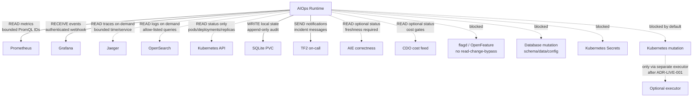

```mermaid
flowchart TD
    AIOPS["AIOps Runtime"]

    AIOPS -->|READ metrics<br/>bounded PromQL IDs| PROM["Prometheus"]
    AIOPS -->|RECEIVE events<br/>authenticated webhook| GRAFANA["Grafana"]
    AIOPS -.->|READ traces on demand<br/>bounded time/service| JAEGER["Jaeger"]
    AIOPS -.->|READ logs on demand<br/>allow-listed queries| OS["OpenSearch"]
    AIOPS -.->|READ status only<br/>pods/deployments/replicas| K8S["Kubernetes API"]
    AIOPS -->|WRITE local state<br/>append-only audit| SQLITE["SQLite PVC"]
    AIOPS -->|SEND notifications<br/>incident messages| ONCALL["TF2 on-call"]
    AIOPS -.->|READ optional status<br/>freshness required| AIE["AIE correctness"]
    AIOPS -.->|READ optional status<br/>cost gates| COST["CDO cost feed"]

    AIOPS -. blocked .-> FLAGS["flagd / OpenFeature<br/>no read-change-bypass"]
    AIOPS -. blocked .-> DB["Database mutation<br/>schema/data/config"]
    AIOPS -. blocked .-> SECRETS["Kubernetes Secrets"]
    AIOPS -. blocked by default .-> MUTATE["Kubernetes mutation"]

    MUTATE -. only via separate executor<br/>after ADR-LIVE-001 .-> EXEC["Optional executor"]
```

## cần liệt kê các json schema của từng API vào trong này