# Engine AIOps: từ dữ liệu đến thông báo

> Mô tả code đang chạy trên nhánh `feat/aio/v0.1.0` ngày 30/07/2026. Ngưỡng trong tài liệu lấy từ `aio/config/hyperparameters.json` và sẽ thay đổi khi cấu hình được tune.

## 1. Tổng quan

Engine có hai đường phát hiện:

1. **Instant:** giá trị hiện tại dùng cho SLO, threshold, dependency và no-data.
2. **Time-series:** chuỗi theo thời gian dùng cho anomaly và RCA.

Hai đường cùng tạo incident. Chỉ Incident Store mới quyết định thông báo có được gửi hay bị dedup/suppress.

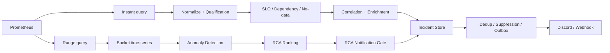

### 1.1 Bản đồ thuật ngữ

Các object dưới đây là những “phiếu thông tin” được truyền qua từng bước. Chúng không có cùng ý nghĩa và không nên gọi chung là alert.

| Thuật ngữ | Nghĩa dễ hiểu | Được tạo ở đâu | Dùng để làm gì |
| --- | --- | --- | --- |
| **Signal** | Một phép đo có tên ổn định, ví dụ `checkout_error_rate_5m` | Query registry | Nối PromQL với service, metric, unit và window |
| **Observation** | Một ảnh chụp giá trị hiện tại của signal | Instant collector | Đầu vào cho qualification và detector threshold/no-data |
| **MetricSeries** | Lịch sử nhiều điểm của một metric | Range collector | Đầu vào cho anomaly, drift, shape và RCA |
| **Feature** | Observation đã được gắn trạng thái và vai trò | Feature Builder | Cho detector biết dữ liệu có sẵn sàng và được phép dùng không |
| **Detector** | Một luật hoặc thuật toán kiểm tra dữ liệu | Detector engine | Quyết định một dấu hiệu có đáng chú ý hay không |
| **CandidateEvent** | Một sự kiện nghi ngờ, chưa phải incident cuối | Threshold/dependency/no-data detector hoặc RCA gate | Mang detector, service, severity, signal, reason, confidence, evidence và runbook sang correlation/incident store |
| **Correlation** | Ghép các CandidateEvent có liên quan trong cùng service/flow/window | Correlator | Giảm nhiều tín hiệu rời thành một câu chuyện chung và đánh giá dependency nghi phạm |
| **Correlated CandidateEvent** | CandidateEvent sau khi correlation bổ sung dependency, confidence và contributing signals | Correlator | Là đầu vào cho enrichment và Incident Store; đây không phải một class riêng |
| **likely_dependency** | Dependency bị nghi đang gây ảnh hưởng cho service của candidate | Dependency detector + Correlator | Chọn nơi enrich, đặt tiêu đề/runbook, xác định fingerprint scope và hỗ trợ suppression |
| **AnomalyFinding** | Kết quả anomaly của một `service + metric + signal_id` | Anomaly engine | Là bằng chứng đầu vào cho RCA; chưa phải incident và chưa chắc được notify |
| **Impact finding** | Tín hiệu cho biết nơi đang chịu ảnh hưởng, thường chuyển từ SLO incident | Pipeline analysis | Cho RCA biết “hệ quả cần được giải thích” |
| **RootCauseCandidate** | Một service được RCA xếp hạng là nguyên nhân gốc | RCA engine | Mang RCA score, root metrics và evidence sang notification gate |
| **Evidence/Corroboration** | Bằng chứng hỗ trợ từ metric, log, trace hoặc Kubernetes | Enricher/RCA | Tăng, giảm hoặc giải thích độ tin cậy; không tự động đồng nghĩa với root cause |
| **Incident** | Bản ghi bền vững đại diện cho một vấn đề qua nhiều lần chạy | Incident Store | Theo dõi `open/ongoing/recovered`, occurrence và dedup |
| **Fingerprint** | Khóa ổn định nhận diện “đây có phải cùng vấn đề cũ không” | Incident Store | Tìm incident cũ mà không phụ thuộc timestamp, value hoặc trace ID |
| **NotificationMessage** | Nội dung đã sẵn sàng gửi ra ngoài | Notification Builder | Contract chung cho Discord hoặc generic webhook |
| **Outbox** | Hàng đợi notification lưu trong SQLite | Incident Store | Không mất thông báo khi gửi lỗi; hỗ trợ retry và suppression |

### 1.2 Những khái niệm dễ nhầm

#### CandidateEvent không phải Incident

`CandidateEvent` chỉ nói rằng **một detector vừa thấy dấu hiệu đáng chú ý**. Nhiều CandidateEvent có thể được correlation gom lại và nhiều lần chạy có thể cập nhật cùng một Incident.

```text
Detector fire -> CandidateEvent
CandidateEvent + fingerprint/dedup -> Incident
Incident + notification gate/outbox -> NotificationMessage
```

#### likely_dependency không phải RCA root cause

Ví dụ:

```text
service = checkout
likely_dependency = payment
```

Ý nghĩa là: **checkout đang chịu ảnh hưởng và payment là dependency nghi phạm**. Đây là kết luận cục bộ từ dependency signal, topology và correlation.

RCA root cause lại được tính từ toàn bộ anomaly, thời gian, topology, shape, downstream coverage và evidence. RCA có thể đồng ý rằng `payment` là root, nhưng cũng có thể chọn service khác hoặc không tạo root nào.

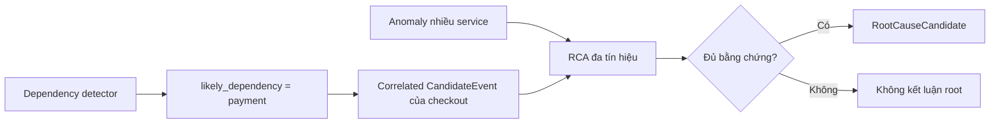

#### Correlation không phải Anomaly Detection

Correlation không đọc trực tiếp hình dạng chuỗi để phát hiện drift. Nó làm việc trên CandidateEvent đã có, nhằm:

    - Gom tín hiệu cùng vụ việc.
    - Tìm dependency nghi phạm.
    - Tính confidence từ thời gian, topology và evidence.
    - Giảm alert rời rạc trước khi tạo incident.

Anomaly Detection làm việc trên MetricSeries và trả AnomalyFinding. Hai luồng chỉ gặp nhau khi pipeline xây dựng incident và RCA.

---

## 2. Nạp cấu hình

Mỗi lần chạy, engine nạp:

    - `runtime.json`: service, flow, topology, detector và policy.
    - `prometheus_queries.json`: PromQL, lookback, step và detector bucket.
    - `hyperparameters.json`: ngưỡng, trọng số, dedup và retry.
    - Schema normalization và qualification.

Nếu bật self-heal thì bắt buộc phải có `live-approved`, executor URL và approval ID. Thiếu một điều kiện, pipeline dừng thay vì tự mutate production.

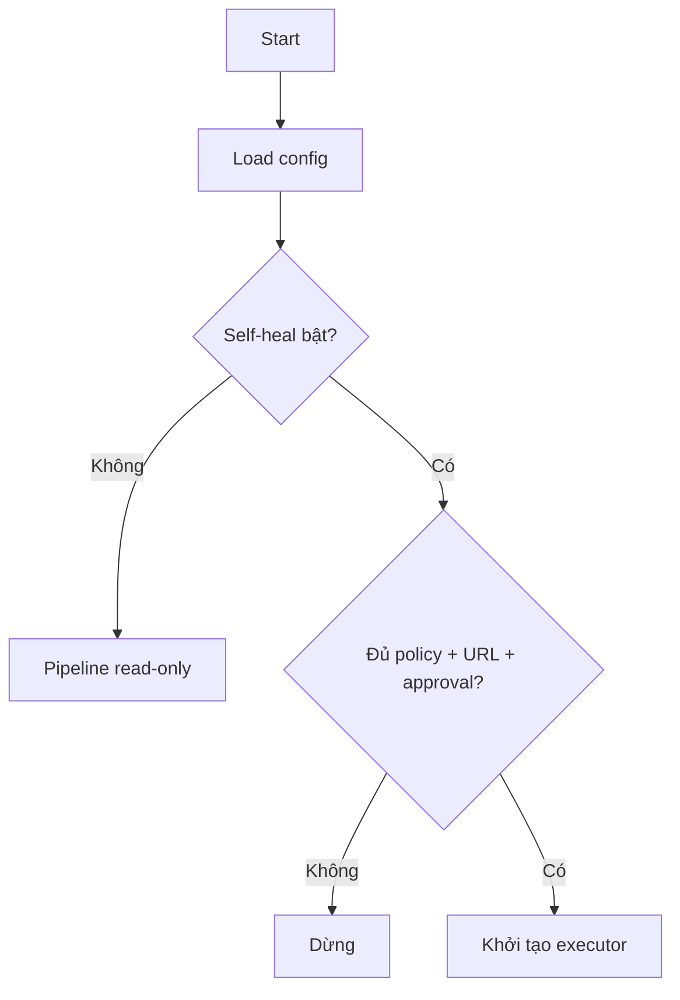

---

## 3. Lấy dữ liệu Prometheus

### 3.1 Instant query

Mỗi signal tạo một object:

```text
Observation = signal_id + value + unit + window + quality + labels
```

Đường này phục vụ threshold, SLO, dependency và no-data. Với latency, collector lấy giá trị lớn nhất trong window để không bỏ mất thời điểm xấu.

### 3.2 Range query

Mỗi metric tạo một chuỗi:

```text
MetricSeries = service + metric + signal_id + points[] + quality
MetricPoint  = timestamp + value
```

Đường này phục vụ anomaly và RCA. Lookback, step và bucket lấy từ query registry.

### 3.3 Phân loại lỗi dữ liệu

    - Query lỗi hoặc không có series: `MISSING`.
    - Vượt `max_series`: `INVALID / CardinalityExceeded`.
    - Sample sai định dạng: `INVALID / InvalidSample`.
    - NaN hoặc vô cực: `INVALID / NonFiniteSample`.
    - Chuỗi có gap không hợp lệ: `INVALID`.
    - Dữ liệu đúng: chuyển tiếp sang qualification.

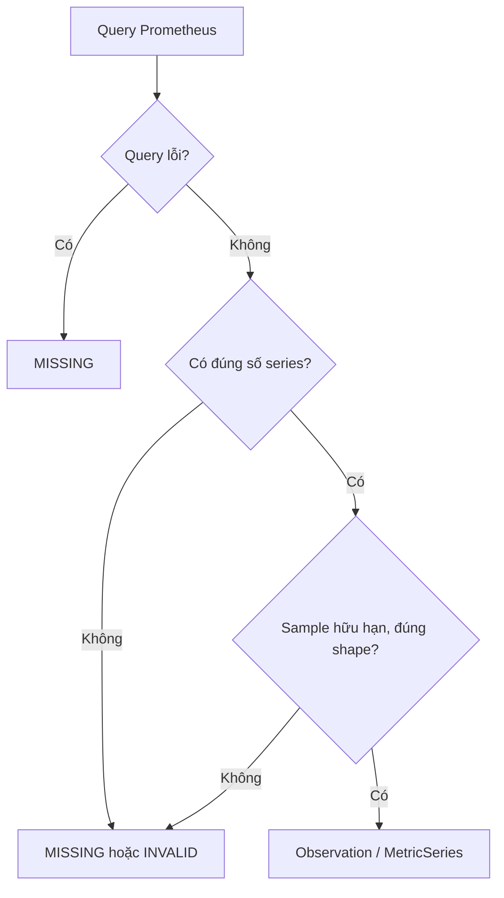

---

## 4. Normalize

Normalizer chỉ chuẩn hóa, không phát hiện lỗi:

    - Đổi alias label và window.
    - Sắp xếp label ổn định.
    - Chuyển unit.

Công thức đổi unit:

```text
normalized_value = raw_value × conversion_factor
```

Mục tiêu là để hai tín hiệu cùng ý nghĩa không bị hiểu thành hai loại dữ liệu khác nhau.

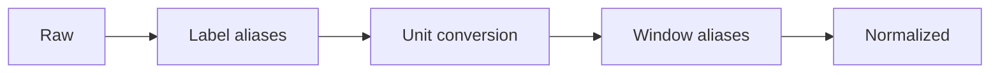

---

## 5. Qualification Gate

Gate trả lời: **“Dữ liệu có đủ tin cậy để detector sử dụng không?”**

Một observation thành `VERIFIED` khi signal tồn tại trong registry, value hữu hạn, unit/window/labels đúng và sample chưa cũ.

```text
sample_age = current_time - sample_timestamp
```

Nếu `sample_age > 300 giây`, quality trở thành `STALE`.

### Kết quả

    - `VERIFIED`: detector được dùng giá trị.
    - `FALLBACK_ONLY`: chỉ làm bằng chứng phụ.
    - `MISSING`, `STALE`, `INVALID`, `UNQUALIFIED`: value thành `None`.

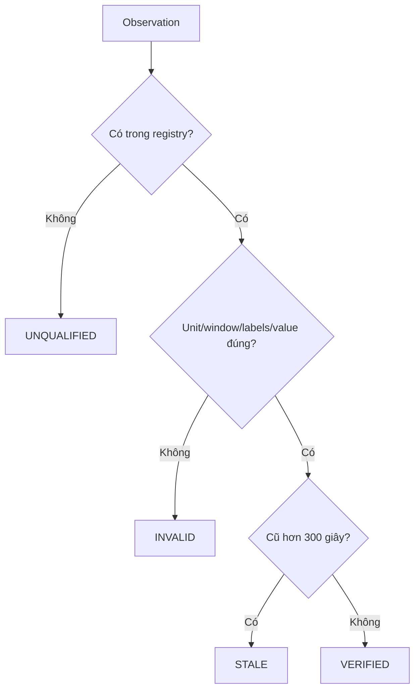

---

## 6. Feature Builder

| Quality | Status | Ý nghĩa |
| --- | --- | --- |
| `VERIFIED` | `ready` | Có thể so threshold |
| `FALLBACK_ONLY` | `fallback` | Evidence phụ |
| Còn lại | `unknown` | Không dùng như giá trị thật |

Feature còn có role: `official_slo`, `anomaly_input`, `diagnostic` hoặc `dependency_signal`.

---

## 7. Detector instant

### 7.1 Threshold/SLO

```text
status = ready
AND role ∈ {official_slo, anomaly_input}
AND value >= threshold
```

Khi đạt, detector tạo CandidateEvent với confidence `1.0` và reason `threshold_breached`.

    - Error rate mặc định: `0.05`, riêng từng detector có thể override.
    - Burn rate mặc định: `1.0`.
    - Latency dùng override theo service.

### 7.2 Dependency

```text
status = ready
AND role ∈ {diagnostic, dependency_signal}
AND value > threshold
```

Candidate được gắn `likely_dependency`, nhưng đây mới là nghi phạm, chưa phải RCA cuối.

### 7.3 No-data

Signal bắt buộc có status `unknown` sẽ tạo no-data candidate:

    - Missing/stale confidence: `1.0`.
    - Unknown/invalid confidence: `0.7`.

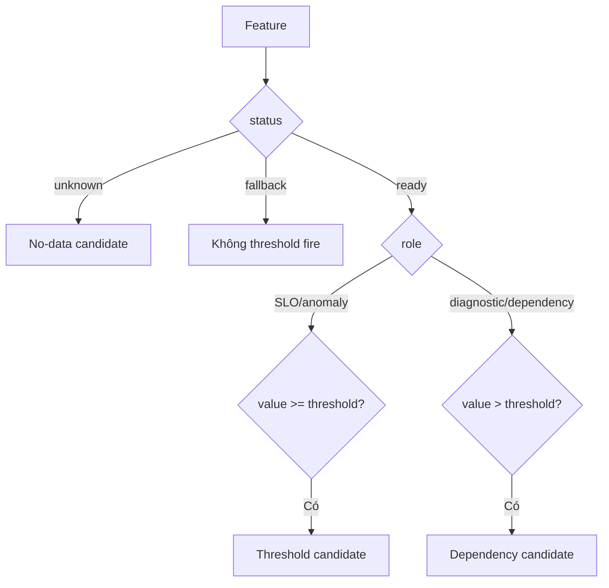

---

## 8. Correlation của CandidateEvent

### 8.1 Correlation dùng để làm gì?

Giả sử trong cùng 5 phút, checkout có ba CandidateEvent:

```text
checkout latency vượt ngưỡng
checkout error rate vượt ngưỡng
checkout -> payment dependency signal vượt ngưỡng
```

Nếu không correlation, ba sự kiện có thể trở thành ba câu chuyện rời. Correlator gom chúng theo service/flow/window, chọn một primary event và ghi các signal còn lại vào `contributing_signals`.

Kết quả vẫn là một `CandidateEvent`, nhưng đã được bổ sung:

    - `likely_dependency`: dependency nghi phạm mạnh nhất, ví dụ `payment`.
    - `confidence`: độ tin cậy của kết luận dependency.
    - `contributing_signals`: các signal cùng đóng góp.
    - `severity`: severity mạnh nhất trong nhóm.
    - `correlation_components`: lý do tạo confidence.

Correlated CandidateEvent được dùng để:

    1. Chọn service/dependency cần query log, trace và Kubernetes.
    2. Tạo fingerprint theo service hoặc dependency scope.
    3. Gắn tiêu đề, runbook và evidence cho incident.
    4. Hỗ trợ suppression các notification cùng blast radius.

Nó **không trực tiếp tạo RCA score** và cũng không chứng minh quan hệ nhân quả.

### 8.2 Cách gom nhóm

Candidate được gom theo:

```text
(environment, flow, service, timestamp // 300)
```

### 8.3 Cách chọn likely_dependency

Trong mỗi nhóm, event không có dependency được ưu tiên làm primary. Các dependency candidate được chấm điểm; candidate có `max(configured_confidence, component_sum)` cao nhất được chọn.

Correlation score là tổng component thỏa điều kiện:

| Component | Weight |
| --- | ---: |
| Primary verified | 0.25 |
| Dependency xuất hiện trước | 0.20 |
| Nằm trên topology path | 0.25 |
| Có operation/rpc/method/span | 0.10 |
| Có trace/log/Kubernetes evidence | 0.20 |
| Evidence stale/missing | -0.30 |

```text
confidence = clamp(max(configured_confidence, Σ component_weight), 0, 1)
```

Chỉ gắn dependency khi confidence đạt `0.5`. Không đạt ngưỡng thì CandidateEvent vẫn được giữ, nhưng `likely_dependency = unknown` để engine không giả vờ biết dependency.

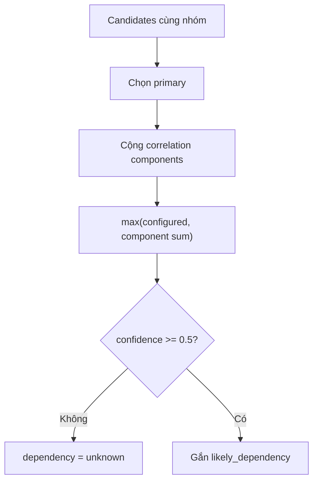

---

## 9. Candidate Enrichment

Candidate được bổ sung:

    - Feature: window, unit, quality.
    - Jaeger: trace, operation, status, duration và URL.
    - OpenSearch: log count và excerpt đã redact.
    - Kubernetes: restart, ready pods, replicas và rollout.

Lỗi enrichment không dừng pipeline; engine lưu `enrichment_failure`.

---

## 10. Chuẩn bị time-series

Chỉ series `VERIFIED` và có point được giữ. Sau đó engine gom dữ liệu về detector bucket:

    - Error/latency: `max(bucket)`.
    - CPU/memory/request rate/socket I/O: `mean(bucket)`.
    - Metric khác: `last(bucket)`.

Việc bucket hóa giúp CUSUM và detector không nhạy hơn chỉ vì Prometheus scrape dày hơn.

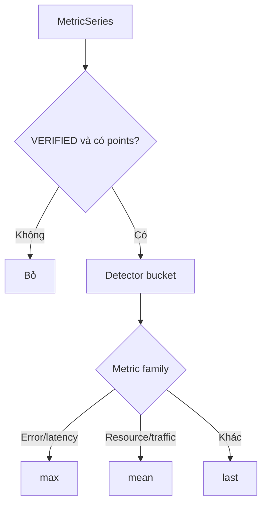

---

## 11. Growth Gate

Gate hỏi: **“Resource tăng vì lỗi hay vì traffic tăng hợp lý?”**

Engine so request rate với CPU và socket I/O, cho phép lệch tối đa 5 bucket.

```text
traffic_score = Σ(shape_score × weight) / Σ(active_weight)
```

Trọng số: CPU `0.45`, socket I/O `0.35`.

Traffic được giải thích khi:

```text
traffic_score >= 0.65
AND max(cpu_score, socket_score) >= 0.55
```

### Rẽ nhánh

    - OOM counter tăng: breakout, luôn giữ cho RCA.
    - Error tăng: breakout.
    - Resource đi ngược request rate: shape mismatch.
    - Thiếu request/CPU/socket: không kết luận traffic explained.
    - Series toàn 0: ghi rõ `zero_metrics`.

**Lưu ý code hiện tại:** growth gate ghi `explained_metrics` nhưng vẫn trả series cho anomaly detector. Các metric đó được lọc khỏi root cause sau khi RCA chạy. Đây là bộ lọc RCA muộn, không phải bộ lọc tuyệt đối trước anomaly.

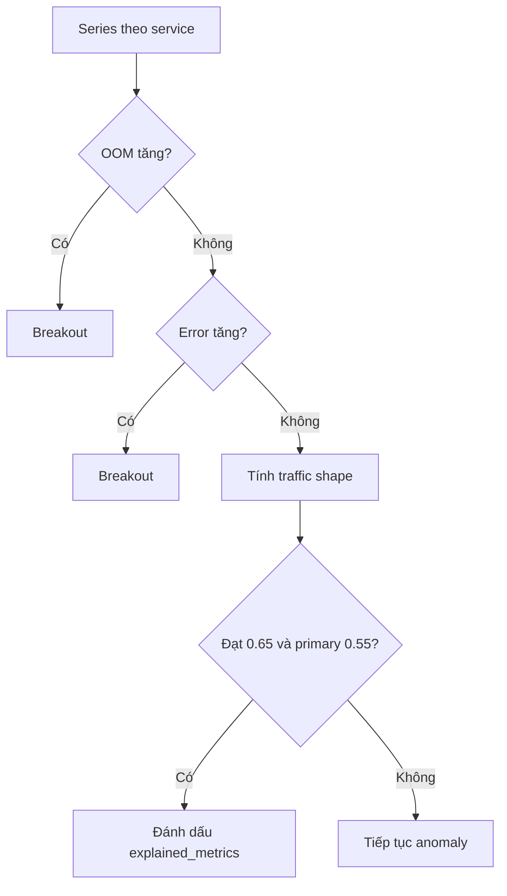

---

## 12. Significant Tail Gate

Mỗi metric phải chứng minh phần cuối chuỗi còn thay đổi.

### 12.1 Basic-tail

```text
baseline = median(values_before_tail)
delta = |value - baseline|
```

Một bucket changed khi:

```text
delta >= min_absolute
AND (baseline = 0 ? delta > 0 : delta / |baseline| >= min_relative)
```

Tail significant khi:

```text
changed_buckets >= min_tail_anomaly_buckets
```

Ví dụ memory cần tối thiểu 6 bucket, lệch ít nhất 10 MiB và 5% baseline.

### 12.2 Slow-drift

Trong cửa sổ 1 giờ:

```text
slope = Σ((x-x̄)(y-ȳ)) / Σ((x-x̄)²)
projected_change = direction × slope × time_span
positive_ratio = số bước đúng hướng / tổng số bước
```

Significant khi:

```text
projected_change >= min_total_change
AND positive_ratio >= 0.45
```

Tối thiểu 12 point. Ngưỡng tổng thay đổi nổi bật: memory 5 MiB, CPU 100 millicores, socket I/O 512,000 byte/s.

### 12.3 CUSUM

CUSUM chỉ áp dụng cho CPU, latency và socket I/O, không áp dụng cho memory.

```text
limit = max(min_absolute, |baseline| × min_relative) × max(2, min_buckets)
cumulative = max(0, cumulative + value - baseline)
```

Significant khi lệch dương liên tục đủ `min_buckets` và cumulative đạt limit. Khi chuỗi ngừng lệch dương, cumulative reset.

### 12.4 Page-Hinkley

```text
threshold = max(min_absolute, |baseline| × min_relative)
tolerance = threshold / max(2, min_buckets)
delta = value - baseline - tolerance
```

`delta <= 0` làm reset. Nếu dương liên tục đủ bucket và cumulative vượt threshold thì significant.

### 12.5 OOM

OOM không dùng phần trăm. Counter chỉ cần tăng ở một trong 3 bucket gần nhất:

```text
oom_t > oom_(t-1)
```

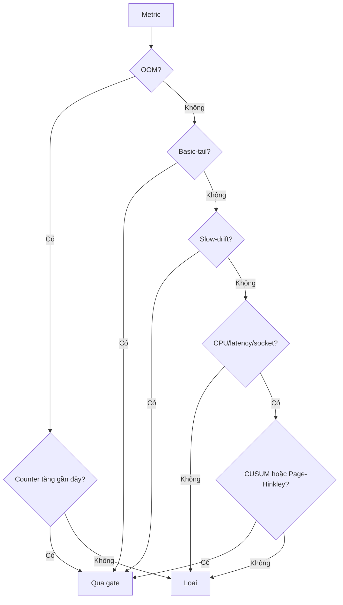

---

## 13. Anomaly Detectors

### 13.1 Robust Drift

```text
center = median(baseline)
MAD spread = median(|x-center|) × 1.4826
IQR spread = (Q75-Q25) / 1.349
spread = max(MAD spread, IQR spread, fallback 1)
score = |value-center| / spread
```

Fire khi score `>= 4.0`.

### 13.2 EWMA + STL

EWMA dùng alpha `0.1`. Vì `seasonal_period = 1`, hiện tại residual chủ yếu là:

```text
residual = value - EWMA
z = |residual - mean(baseline_residual)| / stdev(baseline_residual)
```

Fire khi z `>= 4.0`.

### 13.3 Isolation Forest

Model dùng nhiều metric cùng service tại timestamp chung. Mỗi cột được normalize:

```text
normalized = (value - baseline_min) / (baseline_max - baseline_min)
service_score = -score_samples(row) × 10
```

Fire khi service score `>= 5.0`. Finding đầu ra gắn với metric lệch baseline nhiều nhất.

### 13.4 Slow-drift finding

Slow-drift đạt gate tạo finding score `1.0`, timestamp tại đầu cửa sổ drift.

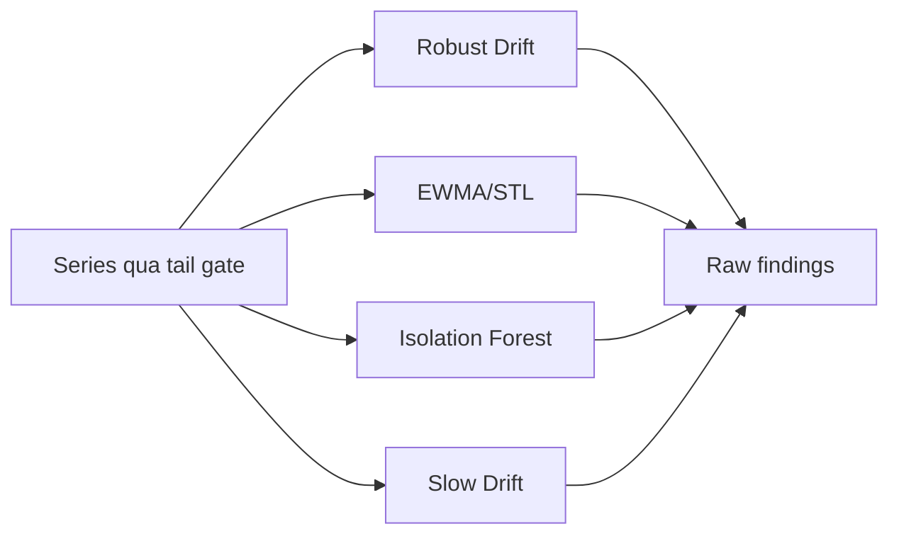

---

## 14. Tổng hợp AnomalyFinding

Raw finding được gom theo:

```text
(service, metric, signal_id)
```

Vì vậy AnomalyFinding là **theo metric của từng service**, chưa phải root cause cấp service.

```text
normalized_i = detector_score_i / detector_threshold_i
anomaly_score = Σ weight_i × min(normalized_i, 1)
```

| Detector | Weight |
| --- | ---: |
| Robust Drift | 0.8 |
| EWMA/STL | 0.8 |
| Isolation Forest | 0.2 |
| Slow Drift | 1.0 |

Giữ finding khi `anomaly_score >= 1.0`.

Ngoại lệ: một detector có `normalized >= 2.0` được tự nâng lên 1.0.

```text
Robust vừa đạt:       0.8 -> chưa đủ
Robust + EWMA đạt:    1.6 -> anomaly
Slow Drift đạt:       1.0 -> anomaly
```

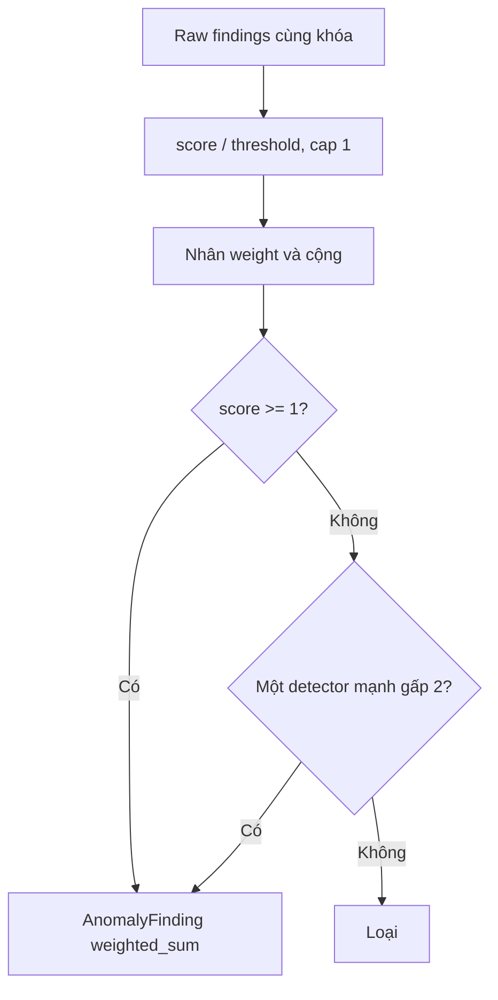

---

## 15. Log/Trace Corroboration

Log được gom template và đếm theo bucket 60 giây. Log anomaly chỉ được giữ nếu có metric anomaly cùng service trong 300 giây.

RCA query evidence theo thứ tự:

    1. Root service đứng đầu.
    2. Nếu chưa mạnh, dependency trực tiếp.
    3. Nếu RCA dưới 0.45 hoặc nhiều root cạnh tranh, các anomaly service còn lại.

Điều chỉnh anomaly score:

```text
Có nguồn nhưng không failure: score × 0.5
Một nguồn failure:            min(1, score + 0.15)
Log và trace cùng failure:    min(1, score + 0.30)
```

Error/OOM và hard failure không bị phạt vì thiếu evidence.

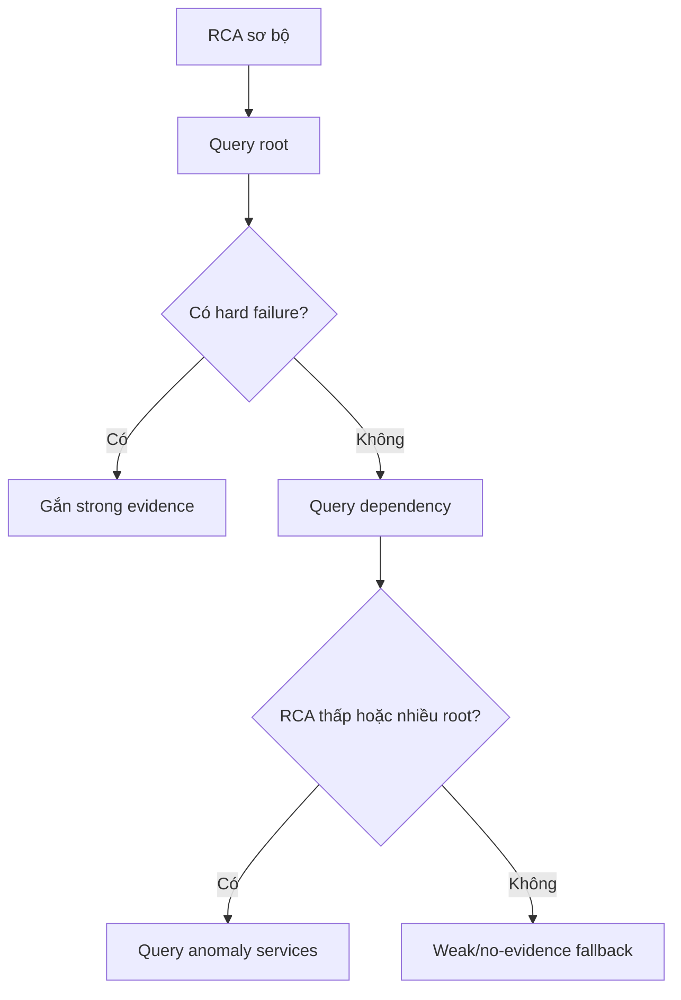

---

## 16. Tạo ứng viên RCA

Đầu vào RCA gồm anomaly findings, SLO impact, drift metric trực tiếp và trace/log root mạnh.

Request rate, latency, burn rate, error và log template là context metric, không được chọn làm `root_cause_metric`. Resource/OOM/default metric có thể làm root metric.

Protected/non-actionable service bị loại; PostgreSQL là ngoại lệ vẫn được quan sát.

---

## 17. Bốn RCA ranker

### 17.1 Graph

```text
graph_raw = max_seed × (0.7 × personalized_pagerank + 0.3 × timestamp_score)
timestamp_score = 1 - (timestamp-oldest)/(newest-oldest)
graph_score = graph_raw / max(graph_raw)
```

### 17.2 Earliest drift

Engine tìm bucket đầu có robust score `>= 4.0` và tail significant:

```text
earliest_score = 1 - drift_index / latest_drift_index
```

### 17.3 Shape correlation

Primary là SLO series nếu có, nếu không là anomaly mạnh nhất:

```text
shape_score = max(|Spearman(primary, metric, lag)|), lag = 0..5 bucket
```

### 17.4 Downstream coverage

Root được điểm khi downstream phụ thuộc nó trong tối đa 2 hop và đỏ sau nó:

```text
coverage_raw(root) = Σ anomaly_strength(downstream)
coverage_score = coverage_raw / max(coverage_raw)
```

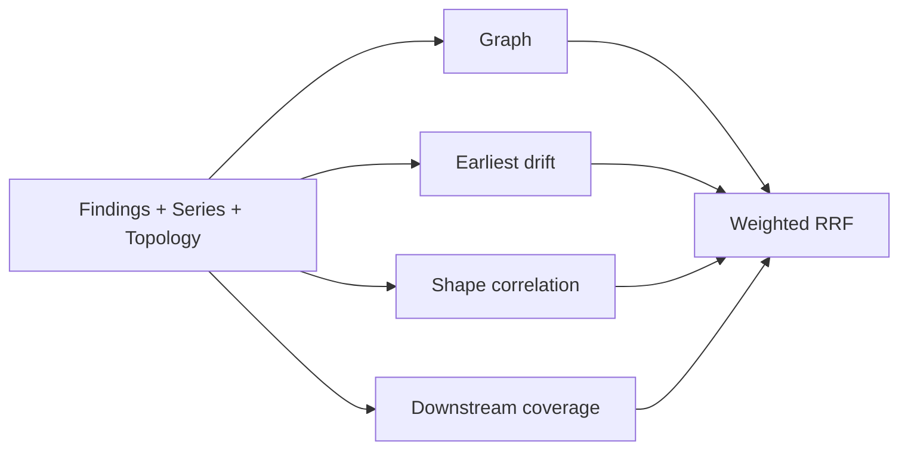

---

## 18. Tổng hợp RCA score

| Ranker | Weight |
| --- | ---: |
| Graph | 0.15 |
| Earliest drift | 0.55 |
| Shape correlation | 0.15 |
| Downstream coverage | 0.15 |

### Weighted RRF

Mỗi ranker sắp service theo score:

```text
RRF_raw(service) = Σ weight_ranker / (20 + rank_position)
weighted_rrf = RRF_raw / Σ(weight_active_ranker / 21)
```

### Support

```text
support = Σ(weight_ranker × clamp(component_score, 0, 1)) / Σ(weight_ranker)
```

### Evidence strength

```text
evidence_strength = min(1, anomaly_score mạnh nhất của service)
```

### RCA score cuối

```text
RCA score = weighted_rrf × evidence_strength × support
```

Ví dụ:

```text
weighted_rrf = 0.90
evidence     = 0.80
support      = 0.40
RCA score    = 0.90 × 0.80 × 0.40 = 0.288
```

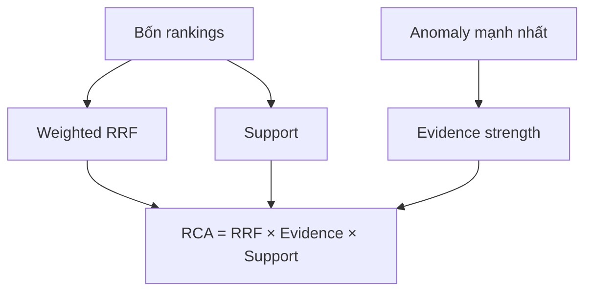

---

## 19. Lọc root cause

### Downstream symptom

Loại candidate nếu có parent:

```text
candidate phụ thuộc parent
AND parent xuất hiện sớm hơn
AND parent.score >= candidate.score
```

### Traffic explained

Xóa metric đã được growth gate giải thích khỏi `root_cause_metrics`. Không còn root metric thì loại service.

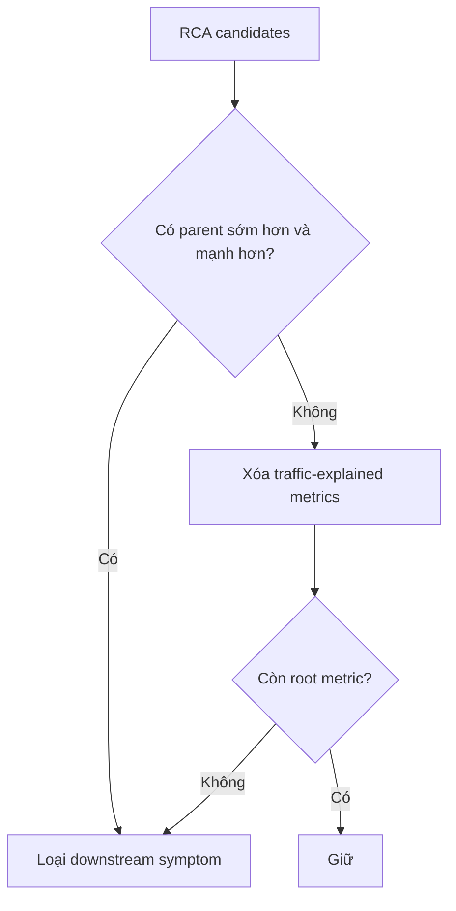

---

## 20. RCA Notification Gate

Root phải qua ba lớp:

1. `RCA score >= 0.24`.
2. Root metric có significant current tail; memory/OOM được phép qua nếu OOM counter tăng.
3. Nếu không có anomaly/SLO context thì cần `metric_score >= 1.8` hoặc `shape_score >= 0.95`.

Nếu tail đã đảo về baseline, RCA không được notify dù ranking từng cao.

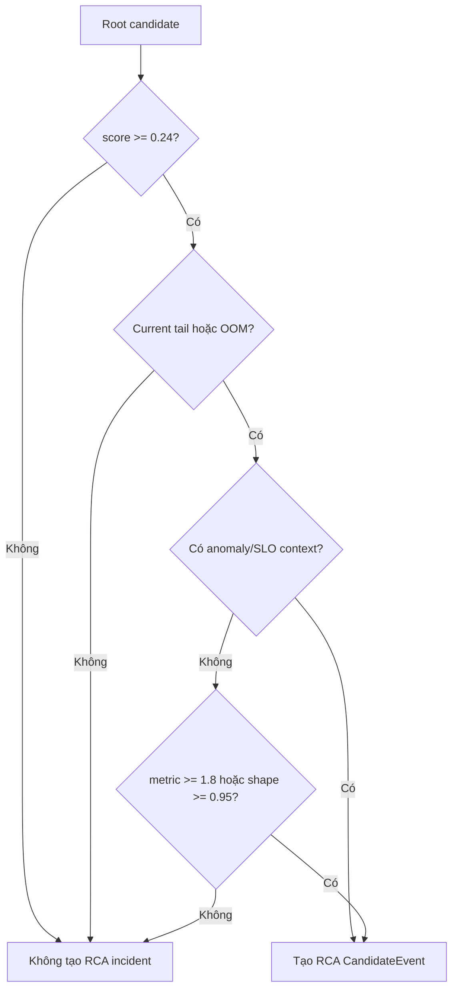

RCA event có `value = RCA score`, `threshold = 0.24`, `quality = FALLBACK_ONLY` và detector `rca_root_cause`.

---

## 21. Incident fingerprint và lifecycle

Fingerprint SHA-256 dùng:

```text
environment + detector_id + flow + service/dependency scope + likely_dependency
```

RCA thêm signal ID để metric root khác nhau không bị ép thành một incident. Timestamp, value, pod và trace ID không nằm trong fingerprint.

### Lifecycle

    - Fingerprint mới: `open`, occurrence 1.
    - Thấy lại: `ongoing`, tăng occurrence.
    - Quá 900 giây: reset occurrence/event window.
    - Vắng 30 lần chạy liên tiếp: `recovered`.
    - Recovered xuất hiện lại: mở lại.

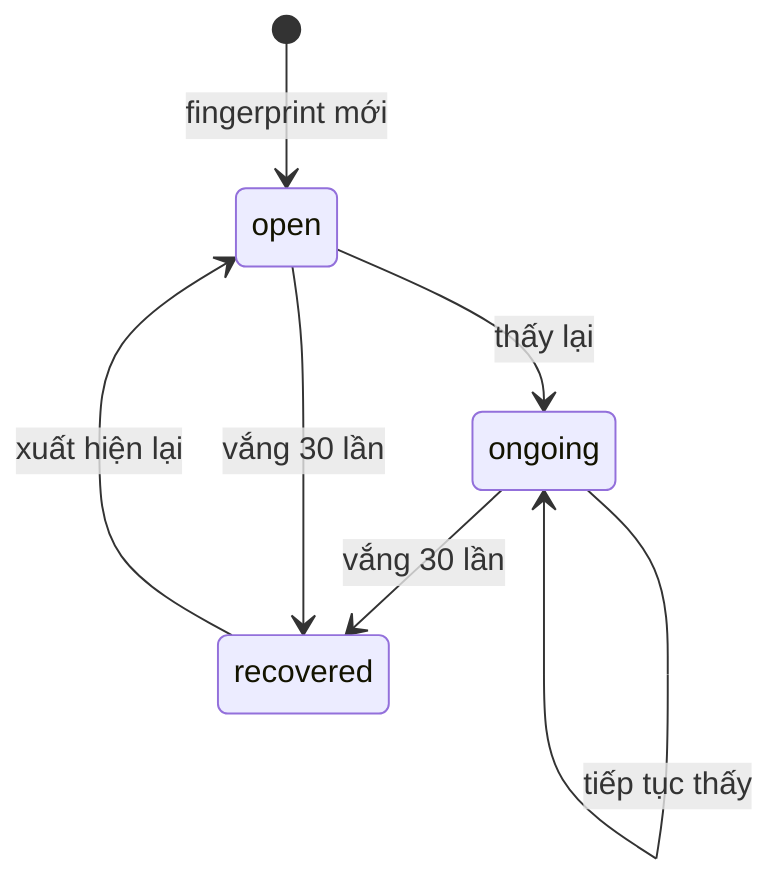

---

## 22. Dedup và suppression

Các window hiện tại đều 900 giây: notification cooldown, RCA dedup, SLO dedup, count reset và active-root suppression.

    - `incident_fingerprint`: cập nhật incident cũ.
    - `incident_cooldown`: chưa hết thời gian thì không enqueue.
    - `service_notification_cooldown`: cùng service và loại notification bị giữ.
    - `notification_outbox`: pending/retry chưa xong thì không tạo bản trùng.
    - `same_blast_radius`: downstream bị suppress khi root đã giải thích.
    - `active_root_cause`: incident mới trong blast radius của root active bị suppress.
    - Severity tăng: có thể vượt cooldown.

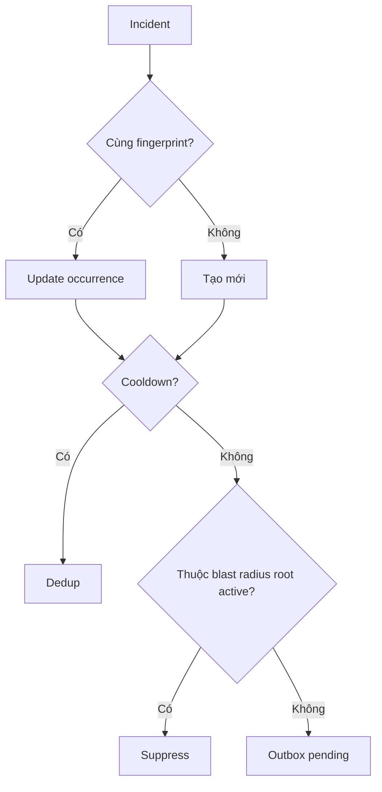

---

## 23. Tạo notification

Notification gồm title, state, service, flow, signal/metric, value, threshold, RCA score, evidence, action hint và runbook. Evidence được giữ theo marker, tối đa 20 dòng.

### Bổ sung strong evidence

Nếu RCA đầu đã gửi với weak/no evidence nhưng strong log/trace xuất hiện trong 15 phút:

    - Bản đầu còn pending/retry: cập nhật bản đó.
    - Bản đầu đã sent: gửi đúng một supplemental notification trong cycle.
    - Bản đầu đã có strong evidence: không gửi bổ sung.

```mermaid
flowchart TD
    E["Strong evidence mới"] --> P{"Bản đầu pending/retry?"}
    P -- "Có" --> U["Update bản pending"]
    P -- "Không" --> S{"Đã sent trong 15 phút và chưa bổ sung?"}
    S -- "Có" --> N["Supplement notification"]
    S -- "Không" --> X["Không gửi thêm"]
```

---

## 24. Outbox và gửi webhook

Trạng thái:

```text
pending -> sent
pending -> retry -> sent
pending/retry -> suppressed
```

Retry theo exponential backoff:

```text
retry_seconds = min(60 × 2^(attempt_count - 1), 3600)
```

Discord nhận embed; generic webhook nhận JSON. Dev/user channels được gửi song song nếu cùng cấu hình.

```mermaid
flowchart TD
    O["Outbox pending"] --> D["Dispatch"]
    D --> H{"HTTP thành công?"}
    H -- "Có" --> S["sent"]
    H -- "Không" --> R["retry"]
    R --> B["Backoff"]
    B --> D
    O --> X["RCA suppression"]
    X --> SP["suppressed"]
```

---

## 25. Ví dụ end-to-end

Giả sử memory `cart` tăng dần và checkout bắt đầu lỗi:

    1. Prometheus trả memory series của cart và checkout error instant/series.
    2. Series được gom bucket.
    3. Memory phải qua basic-tail hoặc slow-drift; CUSUM không áp dụng cho memory.
    4. Các detector tạo raw findings và weighted anomaly.
    5. Checkout SLO tạo impact finding nếu vượt threshold.
    6. RCA đánh giá graph, thời điểm, shape và downstream coverage.
    7. RRF, evidence và support tạo RCA score.
    8. Cart chỉ thành root nếu score đạt 0.24 và memory tail vẫn còn lệch.
    9. Engine query log/trace cart rồi dependency nếu cần.
    10. Incident Store fingerprint, dedup và kiểm tra suppression.
    11. Notification được ghi outbox rồi gửi webhook.

```mermaid
sequenceDiagram
    participant P as Prometheus
    participant A as Anomaly
    participant R as RCA
    participant E as Enrichment
    participant S as Incident Store
    participant N as Notification

    P->>A: cart memory series
    A->>A: tail + detectors + weighted sum
    A->>R: cart.memory anomaly
    P->>R: checkout SLO impact
    R->>R: graph + temporal + shape + coverage
    R->>E: query root/dependency
    E-->>R: log/trace evidence
    R->>S: RCA CandidateEvent
    S->>S: fingerprint + dedup + suppression
    S->>N: outbox pending
    N-->>S: sent hoặc retry
```

---

## 26. Công thức tóm tắt

```text
Tail point:
delta >= absolute_min AND delta/|baseline| >= relative_min

Slow drift:
projected_change = direction × slope × span

Robust score:
|value - median(baseline)| / robust_spread

EWMA residual z-score:
|residual - mean(baseline_residual)| / stdev(baseline_residual)

Weighted anomaly:
Σ detector_weight × min(detector_score/detector_threshold, 1)

Correlation confidence:
clamp(max(configured_confidence, Σ component_weight), 0, 1)

Weighted RRF:
Σ ranker_weight / (20 + rank_position)

Support:
Σ ranker_weight × component_score / Σ ranker_weight

RCA score:
weighted_rrf × evidence_strength × support

Retry:
min(60 × 2^(attempt-1), 3600) giây
```

---

## 27. File nguồn

| Phần | File |
| --- | --- |
| Live pipeline | `aio/aiops/api/app.py` |
| Collector | `aio/aiops/collectors/prometheus.py` |
| Normalize/qualification | `aio/aiops/normalization/`, `aio/aiops/qualification/` |
| Instant detectors | `aio/aiops/detectors/` |
| Correlation | `aio/aiops/correlation/correlator.py` |
| Anomaly | `aio/aiops/anomaly/v001.py` |
| Tail/growth/CUSUM | `aio/aiops/shared/tail.py` |
| Bucket series | `aio/aiops/shared/series.py` |
| RCA | `aio/aiops/rca/engine.py`, `graph.py` |
| Enrichment | `aio/aiops/enrichment/enricher.py` |
| Incident/dedup/outbox | `aio/aiops/storage/sqlite.py` |
| Notification | `aio/aiops/notifications/builder.py` |
| Webhook | `aio/aiops/integrations/notification.py` |
| Config | `aio/config/hyperparameters.json` |

## 28. Kết luận

```text
Dữ liệu hợp lệ
-> tail còn thay đổi
-> detector đủ mạnh hoặc đồng thuận
-> RCA rankers cùng ủng hộ service
-> RCA score và root metric qua gate
-> không phải traffic hợp lệ/downstream symptom
-> không bị dedup/suppression
-> ghi outbox
-> gửi notification
```

**AnomalyFinding nằm ở cấp service + metric; RCA tổng hợp lên cấp service; Incident Store quyết định có gửi notification hay không.**
