# Engine AIOps: từ dữ liệu đến thông báo

> Mô tả code đang chạy trên nhánh `feat/aio/v0.1.0` ngày 30/07/2026. Ngưỡng trong tài liệu lấy từ `aio/config/hyperparameters.json` và sẽ thay đổi khi cấu hình được tune.

## 1. Tổng quan

Engine có hai đường phát hiện:

1. **Instant:** giá trị hiện tại dùng cho SLO, threshold, dependency và no-data.
2. **Time-series:** chuỗi theo thời gian dùng cho anomaly và RCA.

Hai đường cùng tạo incident. Chỉ Incident Store mới quyết định thông báo có được gửi hay bị dedup/suppress.

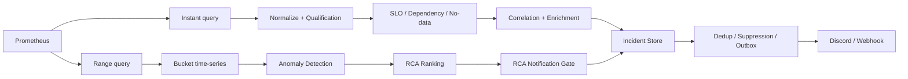

### 1.1 Bản đồ thuật ngữ

Các object dưới đây là những “phiếu thông tin” được truyền qua từng bước. Chúng không có cùng ý nghĩa và không nên gọi chung là alert.

| Thuật ngữ | Nghĩa dễ hiểu | Được tạo ở đâu | Dùng để làm gì |
| --- | --- | --- | --- |
| **Signal** | Một phép đo có tên ổn định, ví dụ `checkout_error_rate_5m` | Query registry | Nối PromQL với service, metric, unit và window |
| **Observation** | Một ảnh chụp giá trị hiện tại của signal | Instant collector | Đầu vào cho qualification và detector threshold/no-data |
| **MetricSeries** | Lịch sử nhiều điểm của một metric | Range collector | Đầu vào cho anomaly, drift, shape và RCA |
| **Feature** | Observation đã được gắn trạng thái và vai trò | Feature Builder | Cho detector biết dữ liệu có sẵn sàng và được phép dùng không |
| **Detector** | Một luật hoặc thuật toán kiểm tra dữ liệu | Detector engine | Quyết định một dấu hiệu có đáng chú ý hay không |
| **CandidateEvent** | Một sự kiện nghi ngờ, chưa phải incident cuối | Threshold/dependency/no-data detector hoặc RCA gate | Mang detector, service, severity, signal, reason, confidence, evidence và runbook sang correlation/incident store |
| **Correlation** | Ghép các CandidateEvent có liên quan trong cùng service/flow/window | Correlator | Giảm nhiều tín hiệu rời thành một câu chuyện chung và đánh giá dependency nghi phạm |
| **Correlated CandidateEvent** | CandidateEvent sau khi correlation bổ sung dependency, confidence và contributing signals | Correlator | Là đầu vào cho enrichment và Incident Store; đây không phải một class riêng |
| **likely_dependency** | Dependency bị nghi đang gây ảnh hưởng cho service của candidate | Dependency detector + Correlator | Chọn nơi enrich, đặt tiêu đề/runbook, xác định fingerprint scope và hỗ trợ suppression |
| **AnomalyFinding** | Kết quả anomaly của một `service + metric + signal_id` | Anomaly engine | Là bằng chứng đầu vào cho RCA; chưa phải incident và chưa chắc được notify |
| **Impact finding** | Tín hiệu cho biết nơi đang chịu ảnh hưởng, thường chuyển từ SLO incident | Pipeline analysis | Cho RCA biết “hệ quả cần được giải thích” |
| **RootCauseCandidate** | Một service được RCA xếp hạng là nguyên nhân gốc | RCA engine | Mang RCA score, root metrics và evidence sang notification gate |
| **Evidence/Corroboration** | Bằng chứng hỗ trợ từ metric, log, trace hoặc Kubernetes | Enricher/RCA | Tăng, giảm hoặc giải thích độ tin cậy; không tự động đồng nghĩa với root cause |
| **Incident** | Bản ghi bền vững đại diện cho một vấn đề qua nhiều lần chạy | Incident Store | Theo dõi `open/ongoing/recovered`, occurrence và dedup |
| **Fingerprint** | Khóa ổn định nhận diện “đây có phải cùng vấn đề cũ không” | Incident Store | Tìm incident cũ mà không phụ thuộc timestamp, value hoặc trace ID |
| **NotificationMessage** | Nội dung đã sẵn sàng gửi ra ngoài | Notification Builder | Contract chung cho Discord hoặc generic webhook |
| **Outbox** | Hàng đợi notification lưu trong SQLite | Incident Store | Không mất thông báo khi gửi lỗi; hỗ trợ retry và suppression |

### 1.2 Những khái niệm dễ nhầm

#### CandidateEvent không phải Incident

`CandidateEvent` chỉ nói rằng **một detector vừa thấy dấu hiệu đáng chú ý**. Nhiều CandidateEvent có thể được correlation gom lại và nhiều lần chạy có thể cập nhật cùng một Incident.

```text
Detector fire -> CandidateEvent
CandidateEvent + fingerprint/dedup -> Incident
Incident + notification gate/outbox -> NotificationMessage
```

#### likely_dependency không phải RCA root cause

Ví dụ:

```text
service = checkout
likely_dependency = payment
```

Ý nghĩa là: **checkout đang chịu ảnh hưởng và payment là dependency nghi phạm**. Đây là kết luận cục bộ từ dependency signal, topology và correlation.

RCA root cause lại được tính từ toàn bộ anomaly, thời gian, topology, shape, downstream coverage và evidence. RCA có thể đồng ý rằng `payment` là root, nhưng cũng có thể chọn service khác hoặc không tạo root nào.

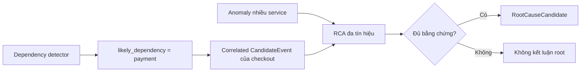

#### Correlation không phải Anomaly Detection

Correlation không đọc trực tiếp hình dạng chuỗi để phát hiện drift. Nó làm việc trên CandidateEvent đã có, nhằm:

    - Gom tín hiệu cùng vụ việc.
    - Tìm dependency nghi phạm.
    - Tính confidence từ thời gian, topology và evidence.
    - Giảm alert rời rạc trước khi tạo incident.

Anomaly Detection làm việc trên MetricSeries và trả AnomalyFinding. Hai luồng chỉ gặp nhau khi pipeline xây dựng incident và RCA.

---

## 2. Nạp cấu hình

Mỗi lần chạy, engine nạp:

    - `runtime.json`: service, flow, topology, detector và policy.
    - `prometheus_queries.json`: PromQL, lookback, step và detector bucket.
    - `hyperparameters.json`: ngưỡng, trọng số, dedup và retry.
    - Schema normalization và qualification.

Nếu bật self-heal thì bắt buộc phải có `live-approved`, executor URL và approval ID. Thiếu một điều kiện, pipeline dừng thay vì tự mutate production.

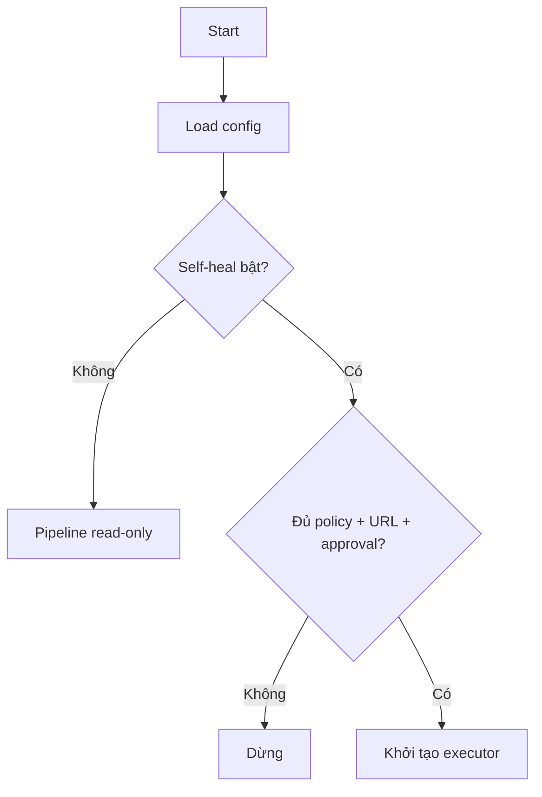

---

## 3. Lấy dữ liệu Prometheus

### 3.1 Instant query

Mỗi signal tạo một object:

```text
Observation = signal_id + value + unit + window + quality + labels
```

Đường này phục vụ threshold, SLO, dependency và no-data. Với latency, collector lấy giá trị lớn nhất trong window để không bỏ mất thời điểm xấu.

### 3.2 Range query

Mỗi metric tạo một chuỗi:

```text
MetricSeries = service + metric + signal_id + points[] + quality
MetricPoint  = timestamp + value
```

Đường này phục vụ anomaly và RCA. Lookback, step và bucket lấy từ query registry.

### 3.3 Phân loại lỗi dữ liệu

    - Query lỗi hoặc không có series: `MISSING`.
    - Vượt `max_series`: `INVALID / CardinalityExceeded`.
    - Sample sai định dạng: `INVALID / InvalidSample`.
    - NaN hoặc vô cực: `INVALID / NonFiniteSample`.
    - Chuỗi có gap không hợp lệ: `INVALID`.
    - Dữ liệu đúng: chuyển tiếp sang qualification.

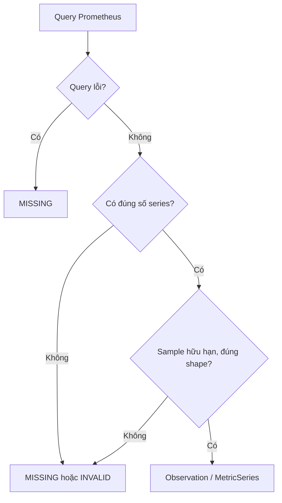

---

## 4. Normalize

Normalizer chỉ chuẩn hóa, không phát hiện lỗi:

    - Đổi alias label và window.
    - Sắp xếp label ổn định.
    - Chuyển unit.

Công thức đổi unit:

```text
normalized_value = raw_value × conversion_factor
```

Mục tiêu là để hai tín hiệu cùng ý nghĩa không bị hiểu thành hai loại dữ liệu khác nhau.

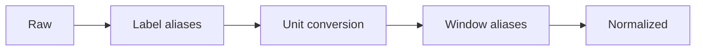

---

## 5. Qualification Gate

Gate trả lời: **“Dữ liệu có đủ tin cậy để detector sử dụng không?”**

Một observation thành `VERIFIED` khi signal tồn tại trong registry, value hữu hạn, unit/window/labels đúng và sample chưa cũ.

```text
sample_age = current_time - sample_timestamp
```

Nếu `sample_age > 300 giây`, quality trở thành `STALE`.

### Kết quả

    - `VERIFIED`: detector được dùng giá trị.
    - `FALLBACK_ONLY`: chỉ làm bằng chứng phụ.
    - `MISSING`, `STALE`, `INVALID`, `UNQUALIFIED`: value thành `None`.

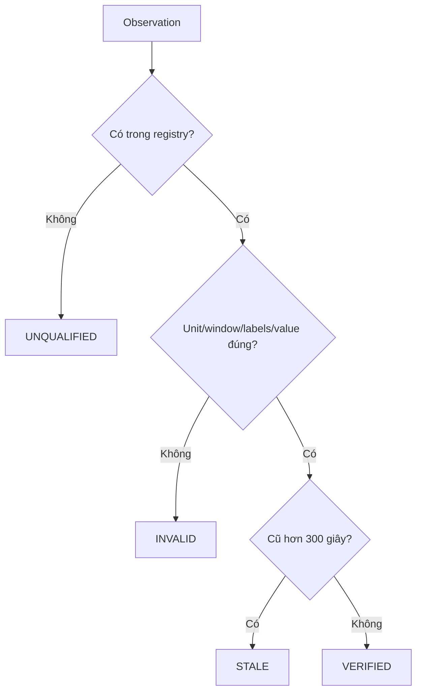

---

## 6. Feature Builder

| Quality | Status | Ý nghĩa |
| --- | --- | --- |
| `VERIFIED` | `ready` | Có thể so threshold |
| `FALLBACK_ONLY` | `fallback` | Evidence phụ |
| Còn lại | `unknown` | Không dùng như giá trị thật |

Feature còn có role: `official_slo`, `anomaly_input`, `diagnostic` hoặc `dependency_signal`.

---

## 7. Detector instant

### 7.1 Threshold/SLO

```text
status = ready
AND role ∈ {official_slo, anomaly_input}
AND value >= threshold
```

Khi đạt, detector tạo CandidateEvent với confidence `1.0` và reason `threshold_breached`.

    - Error rate mặc định: `0.05`, riêng từng detector có thể override.
    - Burn rate mặc định: `1.0`.
    - Latency dùng override theo service.

### 7.2 Dependency

```text
status = ready
AND role ∈ {diagnostic, dependency_signal}
AND value > threshold
```

Candidate được gắn `likely_dependency`, nhưng đây mới là nghi phạm, chưa phải RCA cuối.

### 7.3 No-data

Signal bắt buộc có status `unknown` sẽ tạo no-data candidate:

    - Missing/stale confidence: `1.0`.
    - Unknown/invalid confidence: `0.7`.

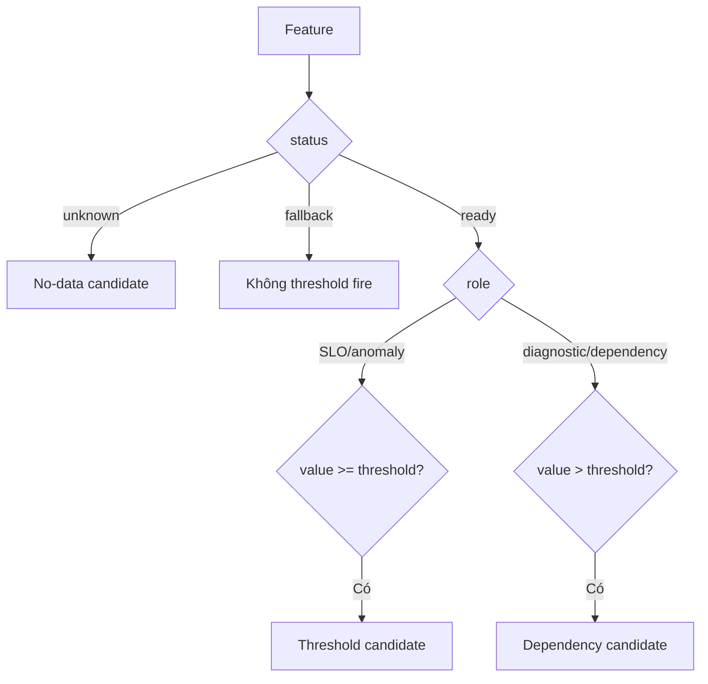

---

## 8. Correlation của CandidateEvent

### 8.1 Correlation dùng để làm gì?

Giả sử trong cùng 5 phút, checkout có ba CandidateEvent:

```text
checkout latency vượt ngưỡng
checkout error rate vượt ngưỡng
checkout -> payment dependency signal vượt ngưỡng
```

Nếu không correlation, ba sự kiện có thể trở thành ba câu chuyện rời. Correlator gom chúng theo service/flow/window, chọn một primary event và ghi các signal còn lại vào `contributing_signals`.

Kết quả vẫn là một `CandidateEvent`, nhưng đã được bổ sung:

    - `likely_dependency`: dependency nghi phạm mạnh nhất, ví dụ `payment`.
    - `confidence`: độ tin cậy của kết luận dependency.
    - `contributing_signals`: các signal cùng đóng góp.
    - `severity`: severity mạnh nhất trong nhóm.
    - `correlation_components`: lý do tạo confidence.

Correlated CandidateEvent được dùng để:

    1. Chọn service/dependency cần query log, trace và Kubernetes.
    2. Tạo fingerprint theo service hoặc dependency scope.
    3. Gắn tiêu đề, runbook và evidence cho incident.
    4. Hỗ trợ suppression các notification cùng blast radius.

Nó **không trực tiếp tạo RCA score** và cũng không chứng minh quan hệ nhân quả.

### 8.2 Cách gom nhóm

Candidate được gom theo:

```text
(environment, flow, service, timestamp // 300)
```

### 8.3 Cách chọn likely_dependency

Trong mỗi nhóm, event không có dependency được ưu tiên làm primary. Các dependency candidate được chấm điểm; candidate có `max(configured_confidence, component_sum)` cao nhất được chọn.

Correlation score là tổng component thỏa điều kiện:

| Component | Weight |
| --- | ---: |
| Primary verified | 0.25 |
| Dependency xuất hiện trước | 0.20 |
| Nằm trên topology path | 0.25 |
| Có operation/rpc/method/span | 0.10 |
| Có trace/log/Kubernetes evidence | 0.20 |
| Evidence stale/missing | -0.30 |

```text
confidence = clamp(max(configured_confidence, Σ component_weight), 0, 1)
```

Chỉ gắn dependency khi confidence đạt `0.5`. Không đạt ngưỡng thì CandidateEvent vẫn được giữ, nhưng `likely_dependency = unknown` để engine không giả vờ biết dependency.

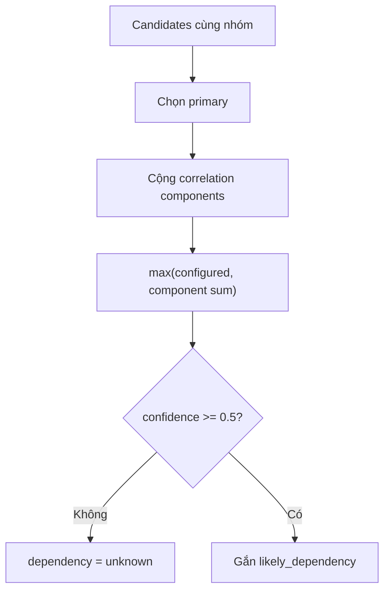

---

## 9. Candidate Enrichment

Candidate được bổ sung:

    - Feature: window, unit, quality.
    - Jaeger: trace, operation, status, duration và URL.
    - OpenSearch: log count và excerpt đã redact.
    - Kubernetes: restart, ready pods, replicas và rollout.

Lỗi enrichment không dừng pipeline; engine lưu `enrichment_failure`.

---

## 10. Chuẩn bị time-series

Chỉ series `VERIFIED` và có point được giữ. Sau đó engine gom dữ liệu về detector bucket:

    - Error/latency: `max(bucket)`.
    - CPU/memory/request rate/socket I/O: `mean(bucket)`.
    - Metric khác: `last(bucket)`.

Việc bucket hóa giúp CUSUM và detector không nhạy hơn chỉ vì Prometheus scrape dày hơn.

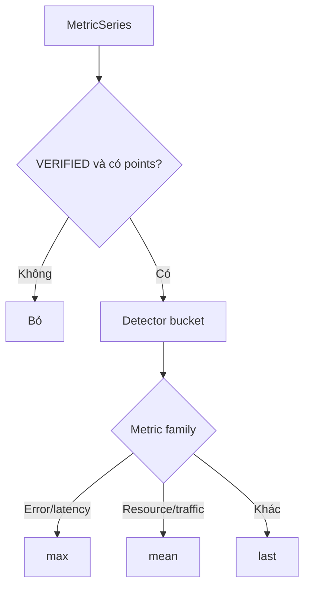

---

## 11. Growth Gate

Gate hỏi: **“Resource tăng vì lỗi hay vì traffic tăng hợp lý?”**

Engine so request rate với CPU và socket I/O, cho phép lệch tối đa 5 bucket.

```text
traffic_score = Σ(shape_score × weight) / Σ(active_weight)
```

Trọng số: CPU `0.45`, socket I/O `0.35`.

Traffic được giải thích khi:

```text
traffic_score >= 0.65
AND max(cpu_score, socket_score) >= 0.55
```

### Rẽ nhánh

    - OOM counter tăng: breakout, luôn giữ cho RCA.
    - Error tăng: breakout.
    - Resource đi ngược request rate: shape mismatch.
    - Thiếu request/CPU/socket: không kết luận traffic explained.
    - Series toàn 0: ghi rõ `zero_metrics`.

**Lưu ý code hiện tại:** growth gate ghi `explained_metrics` nhưng vẫn trả series cho anomaly detector. Các metric đó được lọc khỏi root cause sau khi RCA chạy. Đây là bộ lọc RCA muộn, không phải bộ lọc tuyệt đối trước anomaly.

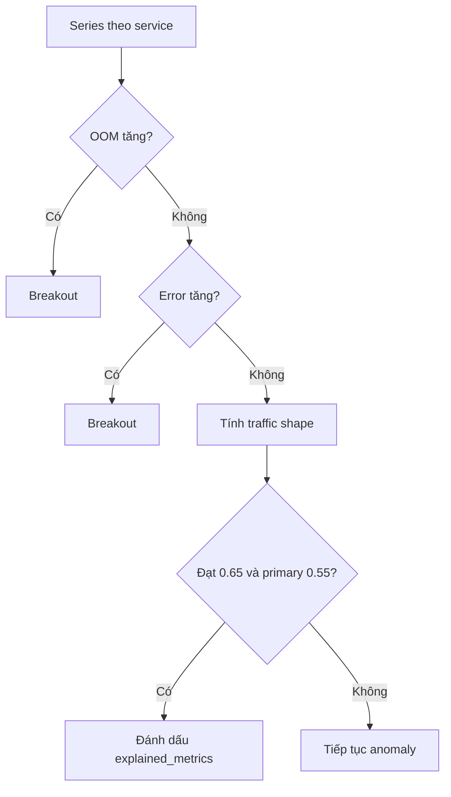

---

## 12. Significant Tail Gate

Mỗi metric phải chứng minh phần cuối chuỗi còn thay đổi.

### 12.1 Basic-tail

```text
baseline = median(values_before_tail)
delta = |value - baseline|
```

Một bucket changed khi:

```text
delta >= min_absolute
AND (baseline = 0 ? delta > 0 : delta / |baseline| >= min_relative)
```

Tail significant khi:

```text
changed_buckets >= min_tail_anomaly_buckets
```

Ví dụ memory cần tối thiểu 6 bucket, lệch ít nhất 10 MiB và 5% baseline.

### 12.2 Slow-drift

Trong cửa sổ 1 giờ:

```text
slope = Σ((x-x̄)(y-ȳ)) / Σ((x-x̄)²)
projected_change = direction × slope × time_span
positive_ratio = số bước đúng hướng / tổng số bước
```

#### Ý nghĩa từng biến

| Biến | Ý nghĩa | Đơn vị |
| --- | --- | --- |
| `x` | Timestamp của từng bucket | Giây |
| `x̄` | Timestamp trung bình của các bucket | Giây |
| `y` | Giá trị metric tại bucket tương ứng | Đơn vị metric, ví dụ byte hoặc millicore |
| `ȳ` | Giá trị trung bình của metric trong cửa sổ | Đơn vị metric |
| `Σ` | Cộng kết quả của tất cả bucket trong cửa sổ | Không có đơn vị riêng |
| `slope` | Tốc độ thay đổi của đường xu hướng | Đơn vị metric/giây |
| `direction` | Chiều engine quan tâm: `1` cho tăng, `-1` cho giảm | Không có đơn vị |
| `time_span` | Timestamp cuối trừ timestamp đầu | Giây |
| `projected_change` | Tổng mức thay đổi được ước lượng từ đường xu hướng | Đơn vị metric |
| `positive_ratio` | Tỷ lệ bước liên tiếp đi đúng hướng cấu hình | Từ `0` đến `1` |
| `min_total_change` | Mức thay đổi tối thiểu để coi drift có ý nghĩa | Đơn vị metric |

#### `slope` nói điều gì?

`slope` là độ dốc của đường thẳng đại diện tốt nhất cho toàn bộ chuỗi:

    - `slope > 0`: metric có xu hướng tăng.
    - `slope < 0`: metric có xu hướng giảm.
    - `slope` gần `0`: chưa có xu hướng rõ ràng.

Phần tử `(x-x̄)(y-ȳ)` kiểm tra thời gian và giá trị có cùng di chuyển khỏi trung bình hay không. Nếu các điểm về sau thường cao hơn, tổng này dương và slope dương. Mẫu số `Σ((x-x̄)²)` chuẩn hóa theo độ dài thời gian, để cùng một mức tăng trong 5 phút được hiểu là nhanh hơn mức tăng trong 1 giờ.

#### `projected_change` nói điều gì?

```text
projected_change = direction × slope × time_span
```

Giá trị này trả lời: **“Theo đường xu hướng, metric đã thay đổi tổng cộng khoảng bao nhiêu trong cửa sổ?”**

Nó không nhất thiết bằng `giá trị cuối - giá trị đầu`. Vì được tính từ đường hồi quy của toàn bộ chuỗi, một spike hoặc dip đơn lẻ ít có khả năng chi phối kết quả.

`direction` giúp cùng một công thức xử lý metric cần theo dõi chiều khác nhau:

    - Memory, CPU, latency: thường cấu hình `up`, nên `direction = 1`.
    - Metric cần bắt giảm: cấu hình `down`, nên `direction = -1`.

#### `positive_ratio` nói điều gì?

`positive_ratio` kiểm tra xu hướng có đủ đều không:

```text
positive_ratio = số lần (y tiếp theo - y hiện tại) đi đúng direction
                 / tổng số cặp bucket liên tiếp
```

Ví dụ chuỗi memory:

```text
100 -> 105 : tăng, đúng hướng
105 -> 103 : giảm, sai hướng
103 -> 110 : tăng, đúng hướng
110 -> 115 : tăng, đúng hướng

positive_ratio = 3 / 4 = 0.75
```

Nếu chỉ có một spike lớn còn phần lớn chuỗi đi ngang hoặc giảm, `projected_change` có thể cao nhưng `positive_ratio` thấp. Điều kiện thứ hai ngăn spike đó bị gọi nhầm là slow-drift.

#### Ví dụ đầy đủ với memory

Giả sử sau khi bucket hóa, memory có xu hướng:

```text
Thời gian:   0    10    20    30 phút
Memory:    100   110   120   130 MiB
```

Đường xu hướng tăng khoảng:

```text
slope ≈ 1 MiB/phút
direction = 1
time_span = 30 phút

projected_change = 1 × 1 × 30 = 30 MiB
```

Ba trên ba bước đều tăng:

```text
positive_ratio = 3 / 3 = 1.0
```

Với cấu hình memory hiện tại:

```text
min_total_change = 5 MiB
positive_bucket_ratio = 0.45

30 MiB >= 5 MiB
1.0 >= 0.45
```

Cả hai điều kiện đều đạt, vì vậy slow-drift significant.

Nếu chuỗi là `100 -> 140 -> 101 -> 100`, spike lên 140 MiB có thể rất lớn nhưng xu hướng cuối không tăng đều. `positive_ratio` thấp và slope toàn cửa sổ gần phẳng, nên slow-drift không nên trigger; spike sẽ được các detector cục bộ như EWMA hoặc Robust Drift xem xét.

Significant khi:

```text
projected_change >= min_total_change
AND positive_ratio >= 0.45
```

Tối thiểu 12 point. Ngưỡng tổng thay đổi nổi bật: memory 5 MiB, CPU 100 millicores, socket I/O 512,000 byte/s.

### 12.3 CUSUM

CUSUM chỉ áp dụng cho CPU, latency và socket I/O, không áp dụng cho memory.

```text
limit = max(min_absolute, |baseline| × min_relative) × max(2, min_buckets)
cumulative = max(0, cumulative + value - baseline)
```

Significant khi lệch dương liên tục đủ `min_buckets` và cumulative đạt limit. Khi chuỗi ngừng lệch dương, cumulative reset.

### 12.4 Page-Hinkley

```text
threshold = max(min_absolute, |baseline| × min_relative)
tolerance = threshold / max(2, min_buckets)
delta = value - baseline - tolerance
```

`delta <= 0` làm reset. Nếu dương liên tục đủ bucket và cumulative vượt threshold thì significant.

### 12.5 OOM

OOM không dùng phần trăm. Counter chỉ cần tăng ở một trong 3 bucket gần nhất:

```text
oom_t > oom_(t-1)
```

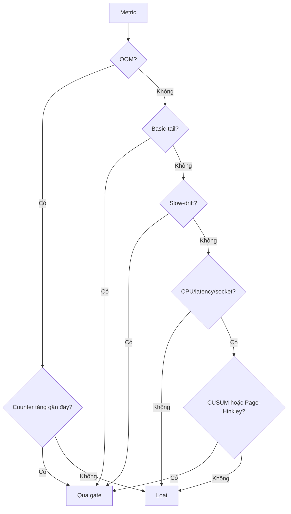

---

## 13. Anomaly Detectors

### 13.0 Feature extraction cho anomaly

Trong code hiện tại không có một class `FeatureExtractor` chung. Mỗi detector tự chuyển `MetricSeries` thành loại feature mà thuật toán của nó cần. Đây là chủ ý hợp lý vì một vector đa biến của Isolation Forest không giống residual đơn biến của EWMA.

#### Tiền xử lý chung

Trước khi tách feature riêng cho detector, mọi series đi qua:

```text
MetricSeries thô
-> chỉ giữ quality VERIFIED
-> gom detector bucket
-> growth gate ghi explained/breakout metrics
-> significant-tail gate
-> detector-specific feature extraction
```

| Bước | Đầu vào | Đầu ra | Mục đích |
| --- | --- | --- | --- |
| Quality filter | MetricSeries | Series verified | Không học từ dữ liệu missing/invalid |
| Bucket | Các sample trong bucket | Một giá trị/bucket | Giảm phụ thuộc scrape interval |
| Fixed baseline/tail | Toàn bộ points | Baseline + tail indexes | Tách phần “bình thường cũ” khỏi phần cần kiểm tra |
| Tail gate | Baseline + tail | Pass/drop | Không chạy detector trên thay đổi quá nhỏ hoặc đã kết thúc |

#### Feature của Robust Drift

Robust Drift dùng **một metric tại một thời điểm**:

```text
Input feature tại bucket t = raw metric value y_t
Reference features          = rolling baseline trước bucket t
Output feature              = robust_score_t
```

Ví dụ:

```text
cart.memory_usage_bytes
baseline: [130, 131, 130, 132, ...] MiB
tail:     [145, 147, 149] MiB

Mỗi tail value được đổi thành một robust score so với baseline trước nó.
```

Detector lấy cặp `(score, bucket_index)` lớn nhất làm raw finding.

#### Feature của EWMA/STL

EWMA không chấm trực tiếp raw value. Nó tạo residual:

```text
smoothed_t = EWMA(raw_values)_t
seasonal_t = STL seasonal component, chỉ khi seasonal_period > 1
residual_t = raw_t - smoothed_t - seasonal_t
```

Feature thực sự đưa vào z-score là `residual_t`.

Ví dụ:

```text
raw latency      = 1.20 s
EWMA dự kiến     = 0.80 s
seasonal         = 0.05 s
residual feature = 1.20 - 0.80 - 0.05 = 0.35 s
```

Config hiện tại có `seasonal_period = 1`, nên seasonal bằng 0 và feature chủ yếu là `raw - EWMA`.

#### Feature của Isolation Forest

Isolation Forest là detector đa biến cấp service. Quy trình trích xuất feature:

1. Gom các MetricSeries theo service.
2. Chỉ giữ service có ít nhất hai metric đủ `min_points`.
3. Lấy giao timestamp giữa các metric, để mọi hàng có đủ cột.
4. Mỗi timestamp trở thành một feature vector.
5. Tách các hàng baseline và tail.
6. Robust-scale từng cột bằng median và robust spread của **baseline**.
7. Fit Isolation Forest trên baseline rows.
8. Score tail rows và chọn hàng bất thường nhất.

Ví dụ service `cart` có ba metric:

```text
timestamp   cpu   memory   socket_io
t1           15     130         20
t2           16     131         21
t3           55     150         80
```

Feature vector tại `t3` là:

```text
X_t3 = [55, 150, 80]
```

Mỗi cột được robust-scale riêng:

```text
x_scaled = (x - median_baseline) / robust_spread_baseline
robust_spread = max(MAD × 1.4826, IQR / 1.349, fallback 1)
```

Các hệ số nằm tại `rca.anomaly.robust_scaling` trong `hyperparameters.json`:

```json
{
  "mad_scale": 1.4826,
  "iqr_scale": 1.349,
  "min_spread": 1.0
}
```

`min_spread` ngăn chia cho 0 khi baseline phẳng; tăng giá trị này sẽ làm Isolation Forest ít nhạy hơn với thay đổi nhỏ trên cột đó.

Giả sử baseline CPU có median `15`, robust spread `5`, CPU tại `t3 = 55`:

```text
cpu_scaled = (55 - 15) / 5 = 8
```

Giá trị có thể lớn hơn 1 hoặc âm vì đây là số đơn vị robust spread mà tail cách median baseline. Scaler không bị một min/max outlier kéo giãn và không clip tail.

Sau khi service-level row bị đánh dấu bất thường, engine vẫn cần một metric để tạo `AnomalyFinding`. Nó chọn cột có độ lệch tuyệt đối lớn nhất so với baseline center làm metric đại diện.

#### Feature của Slow-drift

Slow-drift dùng hai feature tổng hợp từ toàn cửa sổ:

```text
trend feature       = projected_change
consistency feature = positive_ratio
```

Nó không dùng một bucket cực trị. Vì vậy slow-drift phù hợp với xu hướng dài, còn Robust/EWMA phù hợp hơn với thay đổi cục bộ.

#### Feature của log anomaly

Log text được đổi thành template bằng Drain3 hoặc regex fallback, sau đó thành time-series:

```text
feature = số lần template xuất hiện trong mỗi bucket 60 giây
```

Ví dụ:

```text
"payment timeout order=123"
"payment timeout order=456"
-> template "payment timeout order=<*>"
-> [0, 1, 2, 8, 10, ...] lần/bucket
```

Chuỗi template count được đưa vào EWMA và Isolation Forest, nhưng log finding chỉ được giữ khi gần một metric anomaly cùng service.

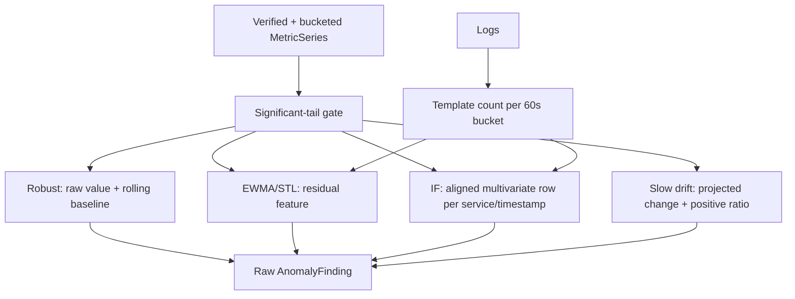

### 13.1 Robust Drift

**Tác dụng:** phát hiện một bucket đang cách xa vùng giá trị gần đây của chính metric đó. Detector này phù hợp với level shift, spike, drop hoặc drift đã đủ xa baseline, kể cả khi baseline có vài outlier.

```text
center = median(baseline)
MAD spread = median(|x-center|) × 1.4826
IQR spread = (Q75-Q25) / 1.349
spread = max(MAD spread, IQR spread, fallback 1)
score = |value-center| / spread
```

| Thành phần | Vai trò |
| --- | --- |
| `median(baseline)` | Mức bình thường trung tâm, ít bị spike kéo lệch hơn mean |
| `MAD` | Độ dao động điển hình quanh median |
| `IQR` | Độ rộng của 50% dữ liệu nằm giữa baseline |
| `spread` | Mẫu số robust; càng lớn thì detector càng ít nhạy |
| `score` | Tail cách baseline bao nhiêu đơn vị robust spread |

Engine không dùng mãi một baseline cố định. Với mỗi tail bucket `t`, nó lấy rolling baseline đứng trước `t`:

```text
baseline_t = values[max(0, t-window_size) : t]
score_t = |value_t - median(baseline_t)| / robust_spread(baseline_t)
finding_score = max(score_t trong tail)
```

Ví dụ:

```text
baseline median = 100
MAD spread      = 3
IQR spread      = 4
fallback        = 1
spread          = max(3, 4, 1) = 4
tail value      = 120
score           = |120-100|/4 = 5
```

`5 >= 4.0`, vì vậy detector fire. Score `5` có nghĩa tail cách mức bình thường khoảng năm robust spread, không phải xác suất lỗi 500%.

**Bắt tốt:** spike, level shift và giá trị cực đoan trên từng metric.

**Không tự chứng minh:** nguyên nhân nghiệp vụ, chiều tăng có xấu hay không, hoặc thay đổi có do traffic hợp lệ hay không. Growth gate và RCA giải quyết các phần đó.

**Giới hạn:** rolling baseline có thể dần hấp thụ một incident kéo dài. Slow-drift và incident lifecycle tồn tại để giảm khoảng câm này.

### 13.2 EWMA + STL

**Tác dụng:** phát hiện giá trị hiện tại không còn khớp với đường kỳ vọng đã làm mượt. Nó nhạy với biến động cục bộ nhanh hơn Robust Drift khi raw level vẫn chưa cách baseline quá xa.

EWMA dùng công thức lặp:

```text
EWMA_t = alpha × value_t + (1-alpha) × EWMA_(t-1)
```

Sau đó engine loại phần dự kiến và phần mùa vụ:

```text
residual_t = value_t - EWMA_t - seasonal_t
center = mean(baseline_residuals)
spread = stdev(baseline_residuals), hoặc 1 nếu stdev = 0
z_t = |residual_t - center| / spread
finding_score = max(z_t trong tail)
```

| Thành phần | Vai trò |
| --- | --- |
| `alpha` | Tốc độ EWMA thích nghi với dữ liệu mới |
| `EWMA_t` | Giá trị kỳ vọng ngắn hạn tại bucket `t` |
| `seasonal_t` | Chu kỳ lặp lại do STL tách ra |
| `residual_t` | Phần biến động chưa được trend/seasonality giải thích |
| `z_t` | Residual cách vùng residual bình thường bao nhiêu standard deviation |

Config hiện dùng `alpha = 0.1`: dữ liệu mới đóng góp 10%, lịch sử EWMA đóng góp 90%. Giả sử:

```text
value_t                  = 130
EWMA_t                   = 110
seasonal_t               = 0
residual_t               = 20
baseline residual mean   = 2
baseline residual stdev  = 3
z_t                      = |20-2|/3 = 6
```

`6 >= 4.0`, vì vậy detector fire.

Với `seasonal_period = 1` hiện tại, STL không chạy và `seasonal_t = 0`. Tên detector vẫn là `EWMA+STL`, nhưng hành vi production lúc này chủ yếu là EWMA residual z-score.

**Bắt tốt:** spike, đổi nhịp đột ngột và sai lệch cục bộ khỏi trend ngắn hạn.

**Không bắt tốt:** drift rất đều kéo dài; EWMA dần đi theo level mới và residual giảm. Slow-drift chịu trách nhiệm chính cho trường hợp này.

**Rủi ro:** z-score dùng mean/stdev nên baseline residual có outlier có thể làm spread lớn và giảm độ nhạy. Tail gate phía trước ngăn một residual lớn nhưng thay đổi thực tế quá nhỏ tự đi tới notification.

### 13.3 Isolation Forest

**Tác dụng:** phát hiện trạng thái đa biến lạ của cả service. Một metric riêng lẻ có thể chưa vượt ngưỡng, nhưng tổ hợp CPU, memory và socket I/O đồng thời lệch theo một hình dạng chưa từng có trong baseline vẫn có thể bị bắt.

Với service có `m` metric tại timestamp `t`:

```text
X_t = [x_(t,1), x_(t,2), ..., x_(t,m)]
```

Engine chỉ giữ timestamp có mặt trong tất cả metric, rồi robust-scale từng cột bằng **baseline của chính cột đó**:

```text
x_scaled_(t,j) = (x_(t,j) - median(baseline_j)) / robust_spread(baseline_j)
X_scaled_t = [x_scaled_(t,1), ..., x_scaled_(t,m)]
```

Isolation Forest tạo nhiều cây phân hoạch ngẫu nhiên. Điểm nằm tách khỏi đám baseline chỉ sau ít lần chia sẽ có đường đi trung bình ngắn và được xem là bất thường. Phần toán học chuẩn của model có thể biểu diễn:

```text
s(x, n) = 2^(-E[h(x)] / c(n))
c(n) = 2H_(n-1) - 2(n-1)/n
```

| Thành phần | Vai trò |
| --- | --- |
| `h(x)` | Độ dài đường đi để cô lập row `x` trong một cây |
| `E[h(x)]` | Độ dài đường đi trung bình qua các cây |
| `n` | Số baseline row dùng để fit |
| `H` | Harmonic number dùng chuẩn hóa độ sâu cây |
| `s(x,n)` | Điểm anomaly lý thuyết; đường đi càng ngắn thì điểm càng cao |

Code không tự tính công thức cây; nó dùng `sklearn.ensemble.IsolationForest`. Điểm engine thực sự lưu là:

```text
raw = IsolationForest.score_samples(X_scaled_t)
service_score = -raw × isolation_score_scale
```

Hiện `isolation_score_scale = 10` và fire khi `service_score >= 5.0`.

Ví dụ baseline thường nằm quanh:

```text
CPU scaled     ≈ -1..1
Memory scaled  ≈ -1..1
Socket scaled  ≈ -1..1
```

Tail row `[4, 3, 5]` bị model trả `score_samples = -0.62`:

```text
service_score = -(-0.62) × 10 = 6.2
6.2 >= 5.0 -> fire
```

`6.2` là điểm ranking đã đổi chiều và scale, không phải xác suất 62%.

Finding schema chỉ chứa một metric, nên engine gắn finding với cột có:

```text
max |tail_scaled_value_j - mean(baseline_scaled_j)|
```

Đó chỉ là metric đại diện nổi bật nhất; toàn bộ vector vẫn tham gia model.

**Bắt tốt:** tổ hợp đa metric lạ, anomaly hình dạng mới và quan hệ giữa metric bị phá vỡ.

**Không chạy khi:** service có dưới hai metric đủ điểm, số timestamp giao nhau dưới `min_points`, hoặc không có tail row.

**Giới hạn:** IF cho biết trạng thái lạ chứ không chứng minh metric nào gây ra metric nào. Topology, temporal ordering và trace nằm ở RCA mới xử lý attribution.

### 13.4 Slow-drift finding

**Tác dụng:** phát hiện xu hướng nhỏ nhưng tích lũy lâu, ví dụ memory leak, CPU tăng chậm, queue hoặc socket I/O leo dần. Nó dùng toàn cửa sổ thay vì chỉ một bucket cực trị.

Đường xu hướng tuyến tính:

```text
x_mean = Σx_i / n
y_mean = Σy_i / n
slope = Σ((x_i-x_mean)(y_i-y_mean)) / Σ((x_i-x_mean)^2)
span = max(x_i) - min(x_i)
projected_change = direction × slope × span
```

Độ nhất quán của hướng:

```text
delta_i = direction × (y_i - y_(i-1))
positive_ratio = count(delta_i > 0) / (n-1)
```

Significant khi đồng thời:

```text
n >= min_points
projected_change >= min_total_change
positive_ratio >= positive_bucket_ratio
```

Ví dụ socket I/O tăng từ khoảng 4.0 MiB/s lên 4.7 MiB/s trong một giờ:

```text
projected_change ≈ 0.7 MiB/s ≈ 734003 byte/s
min_total_change = 512000 byte/s
positive_ratio   = 0.65
required ratio   = 0.45
```

Cả độ lớn và độ đều đạt ngưỡng, nên slow-drift fire.

Khi significant, detector tạo raw finding:

```text
algorithm = slow_drift
score = 1.0
timestamp = bucket đầu của cửa sổ drift
```

Score cố định `1.0` là quyết định pass/fail, không biểu diễn drift mạnh gấp bao nhiêu. Với weight `1.0`, slow-drift một mình đủ đạt weighted anomaly threshold hiện tại.

**Bắt tốt:** leak hoặc saturation tăng từ từ và có hướng nhất quán.

**Không bắt tốt:** spike ngắn, zig-zag mạnh, hoặc chuỗi tăng tổng cộng đủ lớn nhưng ít hơn tỷ lệ bucket đi đúng hướng.

**Giới hạn:** linear slope chỉ mô tả xu hướng tuyến tính trung bình. Nó không phân biệt tự nhiên giữa leak và workload tăng; growth gate dùng request-rate shape để giải thích traffic hợp lệ.

### 13.5 Gate detector không trực tiếp tạo AnomalyFinding

Basic-tail, CUSUM, Page-Hinkley và OOM counter nằm trong `significant_tail_change()`. Chúng quyết định series có được đưa vào bốn detector phía trên hay không:

```text
pass_tail = basic_tail
            OR slow_drift
            OR (metric_group cho phép AND (CUSUM OR Page-Hinkley))
            OR OOM_counter_increased
```

| Gate | Tác dụng chính | Công thức quyết định |
| --- | --- | --- |
| Basic-tail | Xác nhận nhiều bucket hiện tại lệch đủ lớn | `absolute AND relative AND changed_count >= N` |
| CUSUM | Cộng các lệch dương nhỏ liên tiếp | `cumulative >= limit AND consecutive >= N` |
| Page-Hinkley | Bắt mean shift kéo dài sau khi trừ tolerance | `cumulative-minimum >= threshold AND consecutive >= N` |
| OOM | Không bỏ sót sự kiện counter hiếm nhưng chắc | `counter_t > counter_(t-1)` trong các bucket gần nhất |

Điểm quan trọng: các gate này không có weight riêng trong weighted anomaly. Chúng mở đường cho detector chính; riêng Slow-drift vừa là một nhánh pass tail vừa tạo raw finding.

### 13.6 Chọn detector theo hình dạng anomaly

| Hình dạng dữ liệu | Detector chịu trách nhiệm chính | Detector bổ trợ |
| --- | --- | --- |
| Một spike lớn rồi về bình thường | EWMA/STL, Robust Drift | Basic-tail có thể chặn notify nếu tail đã hồi phục |
| Level nhảy lên và còn giữ nguyên | Robust Drift, EWMA/STL | Basic-tail |
| Tăng rất chậm trong 30-60 phút | Slow-drift | CUSUM/Page-Hinkley cho nhóm được bật |
| Lệch nhỏ liên tục từng bucket | CUSUM/Page-Hinkley gate | Robust Drift hoặc EWMA phải tạo finding sau khi qua gate |
| CPU, memory, socket cùng tạo tổ hợp lạ | Isolation Forest | Robust/EWMA cho từng metric |
| OOM counter tăng | OOM gate | Detector chính và RCA evidence |
| Traffic tăng kéo resource tăng cùng shape | Có thể vẫn bị detector nhìn thấy | Growth gate đánh dấu explained để RCA không chọn nhầm root |

Không detector nào tự kết luận root cause. Kết quả của chúng chỉ là bằng chứng bất thường; RCA mới dùng topology, thời gian, shape và downstream coverage để chọn service gốc.

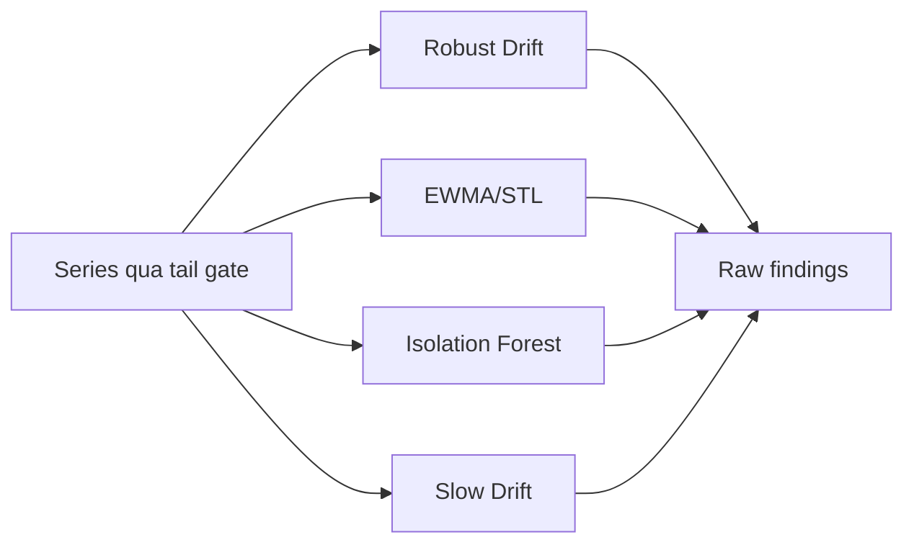

---

## 14. Tổng hợp AnomalyFinding

Raw finding được gom theo:

```text
(service, metric, signal_id)
```

Vì vậy AnomalyFinding là **theo metric của từng service**, chưa phải root cause cấp service.

```text
normalized_i = detector_score_i / detector_threshold_i
anomaly_score = Σ weight_i × min(normalized_i, 1)
```

| Detector | Weight |
| --- | ---: |
| Robust Drift | 0.8 |
| EWMA/STL | 0.8 |
| Isolation Forest | 0.2 |
| Slow Drift | 1.0 |

Giữ finding khi `anomaly_score >= 1.0`.

Ngoại lệ: một detector có `normalized >= 2.0` được tự nâng lên 1.0.

```text
Robust vừa đạt:       0.8 -> chưa đủ
Robust + EWMA đạt:    1.6 -> anomaly
Slow Drift đạt:       1.0 -> anomaly
```

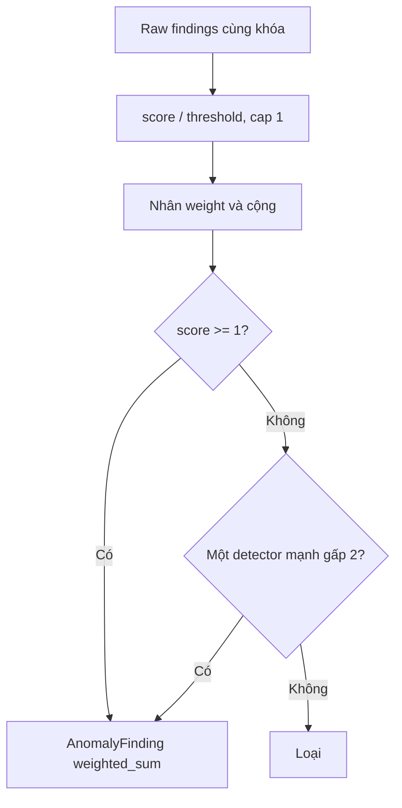

---

## 15. Log/Trace Corroboration

Log được gom template và đếm theo bucket 60 giây. Log anomaly chỉ được giữ nếu có metric anomaly cùng service trong 300 giây.

RCA query evidence theo thứ tự:

    1. Root service đứng đầu.
    2. Nếu chưa mạnh, dependency trực tiếp.
    3. Nếu RCA dưới 0.45 hoặc nhiều root cạnh tranh, các anomaly service còn lại.

Điều chỉnh anomaly score:

```text
Có nguồn nhưng không failure: score × 0.5
Một nguồn failure:            min(1, score + 0.15)
Log và trace cùng failure:    min(1, score + 0.30)
```

Error/OOM và hard failure không bị phạt vì thiếu evidence.

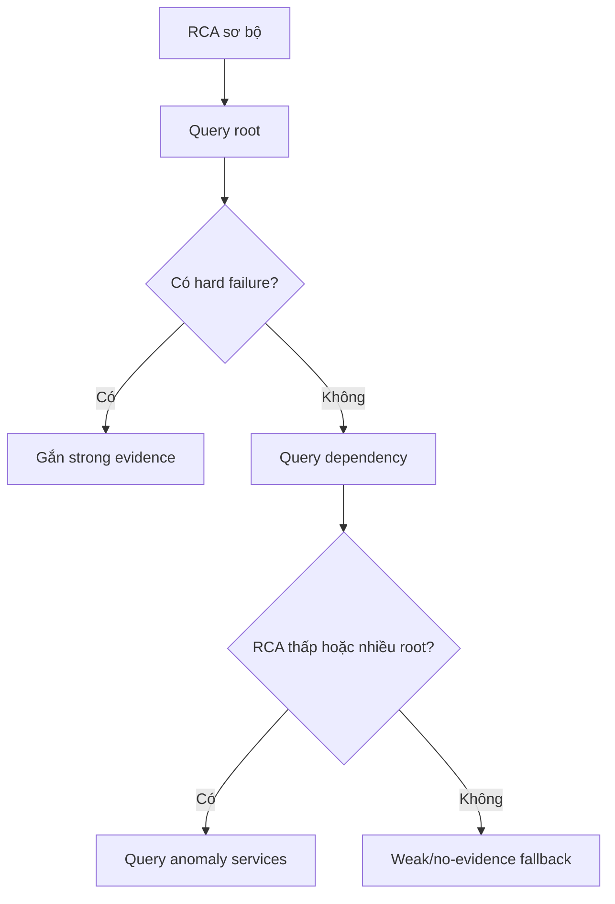

---

## 16. Tạo ứng viên RCA

### 16.1 RCA dùng để làm gì?

Anomaly detector trả lời:

```text
Metric hoặc service nào đang có hành vi bất thường?
```

RCA trả lời câu hỏi khó hơn:

```text
Trong các service đang bất thường, service nào có nhiều bằng chứng nhất để là nguồn khởi phát?
```

Ví dụ `checkout`, `payment` và `postgresql` cùng đỏ:

```text
checkout lỗi sau
checkout phụ thuộc payment
payment phụ thuộc postgresql
postgresql drift trước và trace chỉ lỗi ở database
```

RCA cố xếp `postgresql` lên trước, thay vì chỉ thông báo cả ba service đỏ. Kết quả là một **ranking có lý lẽ**, không phải chứng minh nhân quả tuyệt đối.

### 16.2 Đầu vào và điều kiện thành ứng viên

Đầu vào RCA gồm:

    - Weighted anomaly findings theo service + metric.
    - SLO/threshold findings để mô tả impact.
    - Metric series dùng tìm drift, shape và thời điểm.
    - Service dependency topology.
    - Trace/log corroboration nếu đã query được.
    - Breakout metrics do growth gate cung cấp.

Request rate, latency, burn rate, error và log template là context metric, không được chọn làm `root_cause_metric`. Resource/OOM/default metric có thể làm root metric.

Protected hoặc non-actionable service bị loại; PostgreSQL là ngoại lệ vẫn được quan sát.

Nếu có SLO finding nhưng chưa có resource anomaly, engine quét `drift_metrics`. Metric phải đồng thời:

```text
robust_score >= drift_score_threshold
AND significant_tail_change = true
```

mới được thêm làm ứng viên drift. Vì vậy một SLO breach không tự tạo ra root cause khi không tìm thấy resource evidence.

Trace/log chỉ tự tạo root finding khi cùng có:

```text
trace_failure
AND log_failure
AND log_classification = hard_failure
AND trace root hợp lệ theo topology
```

### 16.3 RCA không làm gì?

RCA hiện không đọc nội dung source code, không chạy causal intervention và không chứng minh rằng “tắt service A thì service B hồi phục”. Nó kết hợp topology, temporal order, shape và blast radius để đưa ra nghi phạm hợp lý nhất.

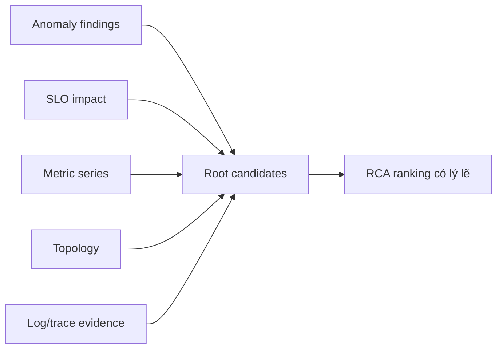

---

## 17. Bốn RCA ranker

Bốn ranker nhìn cùng một service dưới bốn câu hỏi khác nhau:

| Ranker | Câu hỏi |
| --- | --- |
| Graph | Service có nằm ở vị trí topology hợp lý và được anomaly seed ủng hộ không? |
| Earliest drift | Service nào bắt đầu lệch sớm hơn? |
| Shape correlation | Resource metric nào biến động cùng hình dạng với impact? |
| Downstream coverage | Service nào giải thích được nhiều downstream anomaly xuất hiện sau nó? |

### 17.1 Graph

#### Tác dụng

Graph ranker đưa anomaly score vào dependency graph rồi lan ảnh hưởng bằng Personalized PageRank. Cạnh topology có chiều:

```text
service -> dependency
```

Ví dụ `checkout -> payment -> postgresql`: anomaly seed ở checkout có thể truyền trọng số về các dependency có khả năng nằm sâu hơn trong chuỗi gọi.

#### Personalized PageRank

Vector seed được chuẩn hóa:

```text
p_i = seed_i / Σseed
```

PageRank lặp theo dạng:

```text
PR_(t+1) = damping × P^T × PR_t + (1-damping) × p
```

| Biến | Ý nghĩa |
| --- | --- |
| `P` | Ma trận chuyển tiếp của dependency graph |
| `PR_t` | Điểm graph tại vòng lặp `t` |
| `p` | Personalization vector từ anomaly seeds |
| `damping` | Tỷ lệ tiếp tục đi theo graph; hiện `0.85` |
| `1-damping` | Tỷ lệ quay lại anomaly seed |

Engine còn kết hợp timestamp:

```text
timestamp_score = 1 - (timestamp-oldest)/(newest-oldest)
graph_raw = max_seed × (0.7 × personalized_pagerank + 0.3 × timestamp_score)
graph_score = graph_raw / max(graph_raw)
```

`timestamp_score = 1` cho service có timestamp cũ nhất và `0` cho service mới nhất. Nếu mọi service cùng timestamp, tất cả nhận `1`.

Code hiện lấy timestamp lớn nhất của findings trong mỗi service trước khi so giữa service. Do đó đây là “latest evidence timestamp của service”, không hoàn toàn là first anomaly time.

Sau cùng chia cho `max(graph_raw)` để service mạnh nhất có `graph_score = 1`. Vì vậy graph score là điểm tương đối trong batch RCA hiện tại, không phải xác suất root cause.

**Bắt tốt:** root nằm trên đường dependency và được nhiều anomaly seed ủng hộ.

**Giới hạn:** topology sai hoặc thiếu cạnh sẽ làm ranking sai. PageRank mô tả khả năng theo graph, chưa chứng minh causality.

### 17.2 Earliest drift

#### Tác dụng

Sự cố thường xuất hiện ở root trước rồi mới lan downstream. Ranker này ưu tiên service có resource drift sớm.

Với mỗi metric, engine trước tiên yêu cầu tail significant, sau đó tìm bucket đầu:

```text
robust_score_t = |value_t - median(baseline)| / robust_spread(baseline)
robust_score_t >= drift_score_threshold
```

Mỗi service lấy `drift_index` nhỏ nhất trong các metric. Sau đó:

```text
latest = max(drift_index của các service)
earliest_score(service) = 1 - drift_index(service) / latest
```

Ví dụ:

```text
postgresql drift_index = 10
payment    drift_index = 20
checkout   drift_index = 25
latest                 = 25

postgresql = 1 - 10/25 = 0.60
payment    = 1 - 20/25 = 0.20
checkout   = 1 - 25/25 = 0.00
```

Service drift muộn nhất nhận `0`; drift càng sớm càng gần `1`.

**Bắt tốt:** propagation có thứ tự rõ ràng.

**Giới hạn:** index chỉ so được khi các series có bucket alignment và lookback tương đương. Nếu root metric không được collect hoặc baseline đã nhiễm incident, điểm có thể bằng 0 dù service thực sự là root.

### 17.3 Shape correlation

#### Tác dụng

Ranker kiểm tra hình dạng resource metric có đi cùng impact hay không. Primary là SLO series nếu có; nếu không, engine dùng series của finding mạnh nhất.

Spearman chuyển raw values thành ranks rồi tính Pearson correlation trên ranks:

```text
rho = cov(rank(X), rank(Y)) / (std(rank(X)) × std(rank(Y)))
```

Nếu không có tied rank, có thể hình dung bằng:

```text
rho = 1 - 6Σd_i^2 / (n(n^2-1))
```

| Biến | Ý nghĩa |
| --- | --- |
| `rank(X)` | Thứ hạng các bucket của primary series |
| `rank(Y)` | Thứ hạng các bucket của candidate metric |
| `d_i` | Chênh lệch rank tại bucket `i` |
| `rho` | Tương quan đơn điệu từ `-1` đến `1` |

Engine thử nhiều lag:

```text
shape_score = max(|Spearman(primary, metric, lag)|), lag = 0..5 bucket
```

Dùng trị tuyệt đối nên cùng tăng (`rho > 0`) và một tăng một giảm (`rho < 0`) đều có thể là evidence nếu hình dạng đủ mạnh. Service lấy shape score lớn nhất trong các root-cause metric của nó.

Ví dụ các lag cho payment CPU:

```text
lag 0: rho = 0.55
lag 1: rho = 0.81
lag 2: rho = 0.72
shape_score = max(|rho|) = 0.81
```

**Bắt tốt:** impact xuất hiện trễ vài bucket nhưng giữ cùng hình dạng.

**Giới hạn:** correlation cao có thể do workload chung hoặc trùng hợp. Ranker này không được dùng một mình; graph, earliest drift và support phải cùng kiềm chế nó.

### 17.4 Downstream coverage

#### Tác dụng

Root tốt phải giải thích được blast radius. Với mỗi candidate `root`, engine tìm service khác thỏa mãn:

```text
service != root
AND service có dependency path tới root
AND distance <= topology_max_hops
AND first_seen(root) < first_seen(service)
```

Sau đó cộng anomaly strength của downstream:

```text
coverage_raw(root) = Σ anomaly_strength(downstream)
coverage_score = coverage_raw / max(coverage_raw)
```

Ví dụ:

```text
postgresql giải thích payment 0.8 + checkout 0.7 = 1.5
payment giải thích checkout 0.7                   = 0.7
maximum                                             = 1.5

postgresql coverage = 1.5/1.5 = 1.00
payment coverage    = 0.7/1.5 = 0.47
```

**Bắt tốt:** một root upstream gây ảnh hưởng cho nhiều caller downstream.

**Giới hạn:** root không có downstream anomaly sẽ nhận 0; điều này không có nghĩa nó bình thường. Sự cố cô lập vẫn có thể được graph, drift và shape giữ lại.

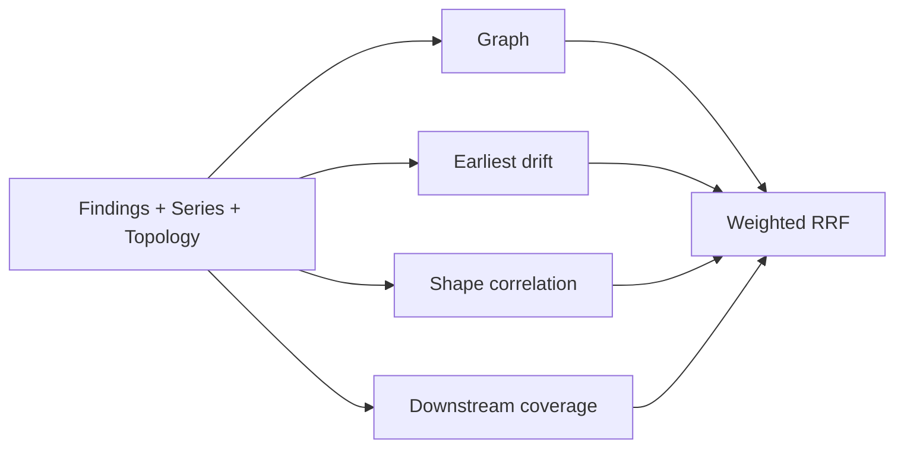

---

## 18. Tổng hợp RCA score

RCA không cộng thẳng bốn component score. Engine tạo hai kết quả khác nhau từ cùng các ranker:

```text
Weighted RRF = các ranker xếp service cao đến đâu?
Support      = độ lớn score tuyệt đối của các ranker mạnh đến đâu?
```

| Ranker | Weight |
| --- | ---: |
| Graph | 0.15 |
| Earliest drift | 0.55 |
| Shape correlation | 0.15 |
| Downstream coverage | 0.15 |

### Weighted RRF

Mỗi ranker sắp service theo component score giảm dần. Với `k = 20`:

```text
RRF_raw(service) = Σ weight_ranker / (20 + rank_position)
RRF_max = Σ weight_active_ranker / (20 + 1)
weighted_rrf = RRF_raw / RRF_max
```

| Biến | Ý nghĩa |
| --- | --- |
| `rank_position` | Vị trí service trong từng ranker, bắt đầu từ 1 |
| `weight_ranker` | Mức tin cậy dành cho ranker |
| `20` | `rrf_k`, làm chênh lệch giữa rank 1 và rank 2 bớt cực đoan |
| `RRF_max` | Điểm tối đa giả định service đứng rank 1 ở mọi ranker active |
| `weighted_rrf` | Mức đồng thuận về thứ hạng, đã normalize |

RRF dùng **vị trí**, không dùng khoảng cách raw score. Vì vậy graph `1.0` không thể áp đảo shape `0.8` chỉ vì thang số khác nhau.

### Support

```text
support = Σ(weight_ranker × clamp(component_score, 0, 1))
          / Σ(weight của tất cả bốn ranker)
```

Khác RRF, support dùng độ lớn component score. Ranker không có score cho service đóng góp `0`, nhưng weight của nó vẫn nằm trong mẫu số.

Ví dụ component của service:

```text
graph      = 1.00 × 0.15 = 0.150
earliest   = 0.60 × 0.55 = 0.330
shape      = 0.80 × 0.15 = 0.120
coverage   = 1.00 × 0.15 = 0.150
support                    = 0.750 / 1.00 = 0.750
```

Support thấp khi service chỉ được một ranker ủng hộ. Đây là lớp chống một tín hiệu đơn lẻ chi phối RCA.

### Evidence strength

```text
evidence_strength = min(1, anomaly_score mạnh nhất của service)
```

Engine lấy finding mạnh nhất, không cộng tất cả findings. Cap `1` ngăn số detector hoặc score lớn làm RCA vượt khỏi thang dự kiến.

Ví dụ service có anomaly scores `0.6`, `0.9`, `1.4`:

```text
max = 1.4
evidence_strength = min(1, 1.4) = 1.0
```

### RCA score cuối

```text
RCA score = weighted_rrf × evidence_strength × support
```

Phép nhân buộc ba câu hỏi cùng có câu trả lời tốt:

    - Service có được các ranker xếp cao không?
    - Service có anomaly evidence đủ mạnh không?
    - Component score tuyệt đối có đủ support không?

Một factor gần 0 sẽ kéo score cuối xuống, dù hai factor còn lại cao.

### 18.1 Ví dụ tính đầy đủ

Giả sử `postgresql` có:

```text
graph_score              = 1.00
earliest_drift_score     = 0.60
shape_correlation_score  = 0.80
downstream_coverage      = 1.00
evidence_strength        = 0.90
```

Trong bốn ranking, nó lần lượt đứng vị trí `1, 1, 2, 1`:

```text
RRF_raw = 0.15/21 + 0.55/21 + 0.15/22 + 0.15/21
        = 0.04729

RRF_max = (0.15+0.55+0.15+0.15)/21
        = 0.04762

weighted_rrf = 0.04726/0.04762 = 0.993
```

Support:

```text
support = 0.15×1.00 + 0.55×0.60 + 0.15×0.80 + 0.15×1.00
        = 0.750
```

RCA score:

```text
RCA score = 0.993 × 0.90 × 0.750
          = 0.670
```

`0.670 >= rca_notification_min_score 0.24`, nên candidate qua score gate. Nó vẫn phải qua root metric tail gate, context gate, dedup và downstream suppression trước khi notification được gửi.

### 18.2 Vì sao cần cả RRF và support?

Giả sử một service đứng đầu mọi bảng vì các service khác còn yếu hơn, nhưng component thực tế chỉ là:

```text
graph=0.10, earliest=0.05, shape=0.08, coverage=0.00
```

RRF có thể vẫn cao vì thứ hạng đẹp. Support sẽ thấp và kéo RCA score xuống. Ngược lại, một service có một component rất cao nhưng xếp kém ở các ranker khác sẽ bị RRF và support cùng hạn chế.

### 18.3 Cách đọc Evidence trong notification

```text
graph_score               -> topology + PageRank + timestamp
earliest_drift_score      -> service drift sớm đến đâu
shape_correlation_score   -> resource và impact giống shape đến đâu
downstream_coverage_score -> giải thích được bao nhiêu downstream anomaly
weighted_rrf_score        -> đồng thuận thứ hạng của bốn ranker
evidence_strength         -> anomaly mạnh nhất của service
support_score             -> độ lớn bằng chứng có trọng số
RCA score                 -> RRF × evidence × support
```

Không nên đọc riêng `graph_score=1.0` thành “chắc chắn 100%”. Nó chỉ có nghĩa candidate đang mạnh nhất theo graph trong batch hiện tại.

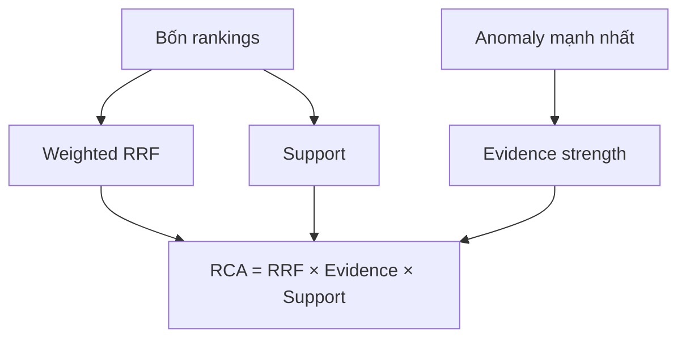

---

## 19. Lọc root cause

### Downstream symptom

Loại candidate nếu có parent:

```text
candidate phụ thuộc parent
AND parent xuất hiện sớm hơn
AND parent.score >= candidate.score
```

### Traffic explained

Xóa metric đã được growth gate giải thích khỏi `root_cause_metrics`. Không còn root metric thì loại service.

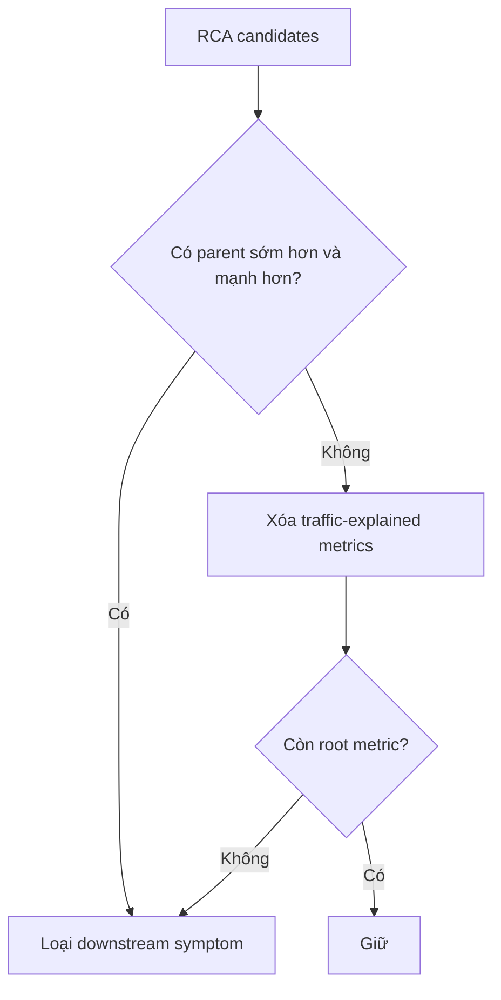

---

## 20. RCA Notification Gate

Root phải qua ba lớp:

1. `RCA score >= 0.24`.
2. Root metric có significant current tail; memory/OOM được phép qua nếu OOM counter tăng.
3. Nếu không có anomaly/SLO context thì cần `metric_score >= 1.8` hoặc `shape_score >= 0.95`.

Nếu tail đã đảo về baseline, RCA không được notify dù ranking từng cao.

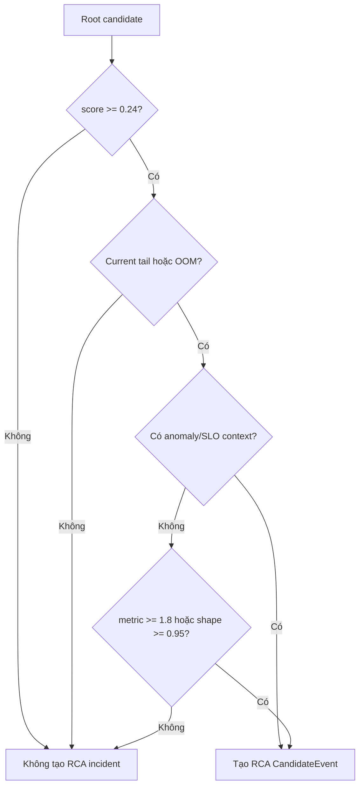

RCA event có `value = RCA score`, `threshold = 0.24`, `quality = FALLBACK_ONLY` và detector `rca_root_cause`.

---

## 21. Incident fingerprint và lifecycle

Fingerprint SHA-256 dùng:

```text
environment + detector_id + flow + service/dependency scope + likely_dependency
```

RCA thêm signal ID để metric root khác nhau không bị ép thành một incident. Timestamp, value, pod và trace ID không nằm trong fingerprint.

### Lifecycle

    - Fingerprint mới: `open`, occurrence 1.
    - Thấy lại: `ongoing`, tăng occurrence.
    - Quá 900 giây: reset occurrence/event window.
    - Vắng 30 lần chạy liên tiếp: `recovered`.
    - Recovered xuất hiện lại: mở lại.

```mermaid
stateDiagram-v2
    [*] --> open: fingerprint mới
    open --> ongoing: thấy lại
    ongoing --> ongoing: tiếp tục thấy
    ongoing --> recovered: vắng 30 lần
    open --> recovered: vắng 30 lần
    recovered --> open: xuất hiện lại
```

---

## 22. Dedup và suppression

Các window hiện tại đều 900 giây: notification cooldown, RCA dedup, SLO dedup, count reset và active-root suppression.

    - `incident_fingerprint`: cập nhật incident cũ.
    - `incident_cooldown`: chưa hết thời gian thì không enqueue.
    - `service_notification_cooldown`: cùng service và loại notification bị giữ.
    - `notification_outbox`: pending/retry chưa xong thì không tạo bản trùng.
    - `same_blast_radius`: downstream bị suppress khi root đã giải thích.
    - `active_root_cause`: incident mới trong blast radius của root active bị suppress.
    - Severity tăng: có thể vượt cooldown.

```mermaid
flowchart TD
    I["Incident"] --> F{"Cùng fingerprint?"}
    F -- "Có" --> U["Update occurrence"]
    F -- "Không" --> N["Tạo mới"]
    U --> C{"Cooldown?"}
    N --> C
    C -- "Có" --> D["Dedup"]
    C -- "Không" --> B{"Thuộc blast radius root active?"}
    B -- "Có" --> X["Suppress"]
    B -- "Không" --> O["Outbox pending"]
```

---

## 23. Tạo notification

Notification gồm title, state, service, flow, signal/metric, value, threshold, RCA score, evidence, action hint và runbook. Evidence được giữ theo marker, tối đa 20 dòng.

### Bổ sung strong evidence

Nếu RCA đầu đã gửi với weak/no evidence nhưng strong log/trace xuất hiện trong 15 phút:

    - Bản đầu còn pending/retry: cập nhật bản đó.
    - Bản đầu đã sent: gửi đúng một supplemental notification trong cycle.
    - Bản đầu đã có strong evidence: không gửi bổ sung.

```mermaid
flowchart TD
    E["Strong evidence mới"] --> P{"Bản đầu pending/retry?"}
    P -- "Có" --> U["Update bản pending"]
    P -- "Không" --> S{"Đã sent trong 15 phút và chưa bổ sung?"}
    S -- "Có" --> N["Supplement notification"]
    S -- "Không" --> X["Không gửi thêm"]
```

---

## 24. Outbox và gửi webhook

Trạng thái:

```text
pending -> sent
pending -> retry -> sent
pending/retry -> suppressed
```

Retry theo exponential backoff:

```text
retry_seconds = min(60 × 2^(attempt_count - 1), 3600)
```

Discord nhận embed; generic webhook nhận JSON. Dev/user channels được gửi song song nếu cùng cấu hình.

```mermaid
flowchart TD
    O["Outbox pending"] --> D["Dispatch"]
    D --> H{"HTTP thành công?"}
    H -- "Có" --> S["sent"]
    H -- "Không" --> R["retry"]
    R --> B["Backoff"]
    B --> D
    O --> X["RCA suppression"]
    X --> SP["suppressed"]
```

---

## 25. Ví dụ end-to-end

Giả sử memory `cart` tăng dần và checkout bắt đầu lỗi:

    1. Prometheus trả memory series của cart và checkout error instant/series.
    2. Series được gom bucket.
    3. Memory phải qua basic-tail hoặc slow-drift; CUSUM không áp dụng cho memory.
    4. Các detector tạo raw findings và weighted anomaly.
    5. Checkout SLO tạo impact finding nếu vượt threshold.
    6. RCA đánh giá graph, thời điểm, shape và downstream coverage.
    7. RRF, evidence và support tạo RCA score.
    8. Cart chỉ thành root nếu score đạt 0.24 và memory tail vẫn còn lệch.
    9. Engine query log/trace cart rồi dependency nếu cần.
    10. Incident Store fingerprint, dedup và kiểm tra suppression.
    11. Notification được ghi outbox rồi gửi webhook.

```mermaid
sequenceDiagram
    participant P as Prometheus
    participant A as Anomaly
    participant R as RCA
    participant E as Enrichment
    participant S as Incident Store
    participant N as Notification

    P->>A: cart memory series
    A->>A: tail + detectors + weighted sum
    A->>R: cart.memory anomaly
    P->>R: checkout SLO impact
    R->>R: graph + temporal + shape + coverage
    R->>E: query root/dependency
    E-->>R: log/trace evidence
    R->>S: RCA CandidateEvent
    S->>S: fingerprint + dedup + suppression
    S->>N: outbox pending
    N-->>S: sent hoặc retry
```

---

## 26. Công thức tóm tắt

```text
Tail point:
delta >= absolute_min AND delta/|baseline| >= relative_min

Slow drift:
projected_change = direction × slope × span

Robust score:
|value - median(baseline)| / robust_spread

EWMA residual z-score:
|residual - mean(baseline_residual)| / stdev(baseline_residual)

Weighted anomaly:
Σ detector_weight × min(detector_score/detector_threshold, 1)

Correlation confidence:
clamp(max(configured_confidence, Σ component_weight), 0, 1)

Weighted RRF:
Σ ranker_weight / (20 + rank_position)

Support:
Σ ranker_weight × component_score / Σ ranker_weight

RCA score:
weighted_rrf × evidence_strength × support

Retry:
min(60 × 2^(attempt-1), 3600) giây
```

### 26.1 Basic-tail

```text
baseline = median(values_before_tail)
delta = |value - baseline|
changed = delta >= min_absolute
          AND delta / |baseline| >= min_relative
```

| Biến | Ý nghĩa |
| --- | --- |
| `values_before_tail` | Các bucket cũ dùng làm vùng bình thường |
| `baseline` | Trung vị vùng bình thường, ít bị spike kéo lệch |
| `value` | Giá trị bucket đang kiểm tra |
| `delta` | Khoảng cách tuyệt đối tới baseline |
| `min_absolute` | Chặn thay đổi rất nhỏ về đơn vị thực |
| `min_relative` | Chặn thay đổi nhỏ so với quy mô baseline |

Ví dụ memory baseline 100 MiB, value 112 MiB, absolute minimum 10 MiB, relative minimum 5%:

```text
delta = |112 - 100| = 12 MiB
relative = 12 / 100 = 12%

12 >= 10 và 12% >= 5% -> bucket changed
```

Cả hai ngưỡng cùng tồn tại để tránh hai lỗi:

    - Chỉ dùng phần trăm: baseline nhỏ làm thay đổi rất nhỏ có phần trăm lớn.
    - Chỉ dùng tuyệt đối: cùng 10 MiB có ý nghĩa khác nhau với service 100 MiB và 10 GiB.

### 26.2 CUSUM

```text
base_limit = max(min_absolute, |baseline| × min_relative)
limit = base_limit × max(2, min_buckets)
delta_t = value_t - baseline
cumulative_t = max(0, cumulative_(t-1) + delta_t)
```

| Biến | Ý nghĩa |
| --- | --- |
| `base_limit` | Độ lệch tối thiểu có ý nghĩa của một metric |
| `min_buckets` | Số bucket dương liên tiếp bắt buộc |
| `delta_t` | Bucket hiện tại cao hơn baseline bao nhiêu |
| `cumulative_t` | Tổng độ lệch dương còn tích lũy |
| `limit` | Tổng độ lệch cần đạt để trigger |

Ví dụ baseline CPU 100 millicores, `base_limit = 10`, `min_buckets = 3`:

```text
limit = 10 × 3 = 30
tail = [105, 108, 112]
deltas = [5, 8, 12]
cumulative = 5 + 8 + 12 = 25 < 30 -> chưa trigger
```

Nếu bucket tiếp theo là 110:

```text
cumulative = 25 + 10 = 35 >= 30
```

Khi đã đủ số bucket liên tiếp, CUSUM trigger. Nếu một delta không dương, engine reset cumulative về 0, nên các lệch rời rạc không cộng mãi.

### 26.3 Page-Hinkley

```text
threshold = max(min_absolute, |baseline| × min_relative)
tolerance = threshold / max(page_hinkley_factor, min_buckets)
adjusted_delta_t = value_t - baseline - tolerance
```

| Biến | Ý nghĩa |
| --- | --- |
| `threshold` | Tổng thay đổi tối thiểu cần xác nhận |
| `tolerance` | Phần nhiễu nhỏ bị trừ khỏi mỗi bucket |
| `adjusted_delta_t` | Độ lệch còn lại sau khi bỏ tolerance |
| `cumulative - minimum` | Mức mean-shift tích lũy kể từ đáy gần nhất |

Ví dụ threshold 10, min buckets 5:

```text
tolerance = 10 / 5 = 2
value - baseline = 3 mỗi bucket
adjusted_delta = 3 - 2 = 1
```

Mỗi bucket chỉ đóng góp 1 thay vì 3. Engine cần độ lệch nhỏ này tồn tại liên tục đủ lâu mới vượt threshold. Bucket có adjusted delta không dương sẽ reset chuỗi.

### 26.4 Robust score

```text
center = median(baseline)
MAD = median(|x-center|) × 1.4826
IQR_spread = (Q75-Q25) / 1.349
spread = max(MAD, IQR_spread, 1)
robust_score = |value-center| / spread
```

| Biến | Ý nghĩa |
| --- | --- |
| `center` | Trung tâm robust của baseline |
| `MAD` | Độ phân tán dựa trên median absolute deviation |
| `Q25`, `Q75` | Phân vị 25% và 75% |
| `spread` | Độ rộng bình thường dùng làm mẫu số |
| `robust_score` | Số “đơn vị phân tán” mà value cách baseline |

Ví dụ center 100, spread 4, value 120:

```text
robust_score = |120 - 100| / 4 = 5
5 >= threshold 4 -> Robust Drift fire
```

Hệ số `1.4826` và `1.349` đưa MAD/IQR về thang gần với standard deviation khi dữ liệu gần phân phối chuẩn, nhưng vẫn bền hơn trước outlier.

### 26.5 EWMA residual z-score

EWMA có thể hình dung bằng công thức lặp:

```text
EWMA_t = alpha × value_t + (1-alpha) × EWMA_(t-1)
residual_t = value_t - EWMA_t - seasonal_t
z_t = |residual_t - mean(baseline_residual)| / stdev(baseline_residual)
```

| Biến | Ý nghĩa |
| --- | --- |
| `alpha` | Mức ưu tiên dữ liệu mới; hiện là 0.1 |
| `EWMA_t` | Mức dự kiến đã làm mượt tại thời điểm t |
| `seasonal_t` | Thành phần chu kỳ từ STL; hiện bằng 0 vì period 1 |
| `residual_t` | Phần raw value không được trend/seasonal giải thích |
| `z_t` | Residual cách baseline residual bao nhiêu độ lệch chuẩn |

Ví dụ:

```text
value = 1.20 s
EWMA = 0.80 s
seasonal = 0.05 s
residual = 0.35 s

baseline residual mean = 0.05 s
baseline residual stdev = 0.05 s
z = |0.35 - 0.05| / 0.05 = 6
6 >= 4 -> EWMA/STL fire
```

`alpha = 0.1` làm đường dự kiến thay đổi chậm; spike mới sẽ tạo residual lớn. Alpha cao hơn bám dữ liệu mới nhanh hơn và thường làm residual ngắn hơn.

### 26.6 Isolation Forest feature và score

Robust-scale từng metric bằng baseline:

```text
x_scaled = (x - median_baseline) / robust_spread_baseline
robust_spread = max(MAD × 1.4826, IQR / 1.349, fallback 1)
```

Feature vector của service tại thời điểm t:

```text
X_t = [cpu_scaled_t, memory_scaled_t, socket_scaled_t, ...]
```

Điểm engine dùng:

```text
service_score = -IsolationForest.score_samples(X_t) × 10
```

| Biến | Ý nghĩa |
| --- | --- |
| `median_baseline` | Trung tâm robust của riêng metric trong baseline |
| `robust_spread_baseline` | Độ phân tán lấy từ MAD/IQR, ít bị outlier kéo lệch |
| `X_t` | Một hàng đa biến mô tả trạng thái service tại timestamp t |
| `score_samples` | Điểm normality do sklearn trả về; thấp hơn nghĩa là lạ hơn |
| Dấu `-` | Đổi hướng để điểm anomaly cao hơn dễ hiểu hơn |
| `× 10` | Đưa score về thang threshold hiện tại |

Ví dụ CPU có median baseline 15, spread 5; memory có median 110, spread 10; tail CPU 55, memory 150:

```text
cpu_scaled = (55-15)/5 = 8
mem_scaled = (150-110)/10 = 4
X_tail = [8, 4]
```

Vector này nằm xa vùng baseline. Nếu model trả `score_samples = -0.62`:

```text
service_score = -(-0.62) × 10 = 6.2
6.2 >= 5.0 -> Isolation Forest fire
```

`6.2` **không phải xác suất lỗi 62%**. Đây chỉ là điểm anomaly đã scale để so threshold.

### 26.7 Weighted anomaly

```text
normalized_i = detector_score_i / detector_threshold_i
capped_i = min(normalized_i, 1)
anomaly_score = Σ detector_weight_i × capped_i
```

| Biến | Ý nghĩa |
| --- | --- |
| `detector_score_i` | Điểm thô của detector i |
| `detector_threshold_i` | Ngưỡng fire riêng của detector i |
| `normalized_i` | Mức detector đã đạt bao nhiêu lần ngưỡng |
| `capped_i` | Giới hạn đóng góp tại 1 để detector cực lớn không áp đảo |
| `detector_weight_i` | Mức đóng góp được cấu hình |

Ví dụ Robust score 5, threshold 4; EWMA score 3, threshold 4:

```text
robust_norm = min(5/4, 1) = 1
ewma_norm = min(3/4, 1) = 0.75

anomaly_score = 0.8×1 + 0.8×0.75 = 1.4
1.4 >= 1 -> tạo AnomalyFinding
```

### 26.8 Correlation confidence

```text
component_sum = Σ component_weight thỏa điều kiện
confidence = clamp(max(configured_confidence, component_sum), 0, 1)
```

Ví dụ dependency candidate có confidence cấu hình 0.4, signal verified 0.25, topology path 0.25 và xảy ra trước 0.20:

```text
component_sum = 0.25 + 0.25 + 0.20 = 0.70
confidence = max(0.4, 0.70) = 0.70
0.70 >= 0.5 -> gắn likely_dependency
```

Nếu evidence stale, penalty `-0.30` được cộng vào component sum.

### 26.9 Graph và timestamp score

```text
timestamp_score = 1 - (timestamp-oldest)/(newest-oldest)
graph_raw = max_seed × (0.7×pagerank + 0.3×timestamp_score)
graph_score = graph_raw / max(graph_raw)
```

| Biến | Ý nghĩa |
| --- | --- |
| `oldest/newest` | Thời điểm sớm nhất và muộn nhất trong findings |
| `timestamp_score` | 1 cho service sớm nhất, 0 cho service muộn nhất |
| `pagerank` | Độ quan trọng của service trong topology, được seed bằng anomaly strength |
| `max_seed` | Anomaly strength lớn nhất dùng giữ tỷ lệ graph raw |
| `graph_score` | Graph raw đã normalize về 0..1 |

Ví dụ A đỏ lúc phút 0, B phút 5, C phút 10:

```text
timestamp_A = 1 - 0/10 = 1.0
timestamp_B = 1 - 5/10 = 0.5
timestamp_C = 1 - 10/10 = 0.0
```

### 26.10 Earliest drift và shape correlation

```text
earliest_score = 1 - drift_index/latest_drift_index
shape_score = max(|Spearman(primary, candidate, lag)|)
```

`drift_index` là vị trí bucket đầu đạt robust drift. Index nhỏ hơn nghĩa là xảy ra sớm hơn.

Spearman không so trực tiếp độ lớn; nó so thứ hạng tăng/giảm của hai chuỗi. Shape score gần 1 nghĩa là hình dạng biến động rất giống nhau, kể cả khác đơn vị. Engine thử lag 0..5 bucket để chấp nhận dependency phản ứng trễ.

Ví dụ request latency tăng theo `[1, 2, 3, 4]`, CPU tăng theo `[10, 20, 30, 40]`: Spearman gần 1 dù hai metric khác thang đo.

### 26.11 Weighted RRF

```text
RRF_raw(service) = Σ weight_ranker/(20 + rank_position)
weighted_rrf = RRF_raw / maximum_possible
```

| Biến | Ý nghĩa |
| --- | --- |
| `rank_position` | Vị trí service trong từng bảng xếp hạng, bắt đầu từ 1 |
| `20` | `rrf_k`, làm chênh lệch giữa các hạng bớt cực đoan |
| `weight_ranker` | Trọng số graph/earliest/shape/coverage |
| `maximum_possible` | Điểm nếu service đứng hạng 1 ở mọi ranker đang có dữ liệu |

Ví dụ service đứng hạng 1 ở earliest và hạng 2 ở graph:

```text
RRF_raw = 0.55/(20+1) + 0.15/(20+2)
        ≈ 0.02619 + 0.00682
        ≈ 0.03301
```

RRF dùng thứ hạng để một graph score thô cực lớn không tự chi phối kết quả.

### 26.12 Support và RCA score

```text
support = Σ(weight_ranker × clamp(component_score, 0, 1)) / Σ(weight_ranker)
evidence_strength = min(1, max anomaly score của service)
RCA score = weighted_rrf × evidence_strength × support
```

Ví dụ:

```text
weighted_rrf = 0.90
evidence_strength = 0.80
support = 0.40

RCA score = 0.90 × 0.80 × 0.40 = 0.288
```

RRF trả lời **“service xếp hạng tốt đến đâu?”**; support trả lời **“các phương pháp có cùng đồng ý không?”**; evidence strength trả lời **“service có anomaly mạnh thật không?”**. Phép nhân buộc cả ba yếu tố cùng tồn tại.

### 26.13 Retry backoff

```text
retry_seconds = min(base × 2^(attempt-1), maximum)
```

Với base 60 giây và maximum 3600 giây:

```text
attempt 1 -> 60 giây
attempt 2 -> 120 giây
attempt 3 -> 240 giây
attempt 4 -> 480 giây
...
tối đa 3600 giây
```

Backoff tránh webhook lỗi làm pipeline gửi request liên tục, nhưng vẫn giữ notification trong outbox để thử lại.

### 26.14 Chuyển unit, tuổi sample và time bucket

#### Chuyển unit

```text
normalized_value = raw_value × conversion_factor
```

| Biến | Ý nghĩa |
| --- | --- |
| `raw_value` | Giá trị collector nhận từ nguồn dữ liệu |
| `conversion_factor` | Hệ số đổi từ unit nguồn sang unit chuẩn |
| `normalized_value` | Giá trị detector nhìn thấy sau chuyển đổi |

Ví dụ đổi byte sang MiB:

```text
raw_value = 104,857,600 byte
conversion_factor = 1 / 1,048,576
normalized_value = 100 MiB
```

Chỉ đổi thang đo, không làm thay đổi hình dạng chuỗi hoặc ý nghĩa dữ liệu.

#### Tuổi sample

```text
sample_age = current_time - sample_timestamp
```

Ví dụ hiện tại là `10:05:30`, sample cuối ở `10:00:00`:

```text
sample_age = 330 giây
330 > 300 -> STALE
```

Sample stale không được dùng như giá trị hiện tại, dù bản thân số đo có vẻ hợp lệ.

#### Time bucket

```text
bucket_id = floor(timestamp / bucket_seconds)
bucket_timestamp = bucket_id × bucket_seconds
```

Ví dụ bucket 30 giây:

```text
12:00:04 -> bucket 12:00:00
12:00:19 -> bucket 12:00:00
12:00:31 -> bucket 12:00:30
```

Correlation dùng ý tưởng tương tự với bucket 300 giây để gom CandidateEvent cùng khoảng thời gian.

### 26.15 Hàm tổng hợp trong detector bucket

Giả sử một bucket chứa `n` sample `x_1...x_n`:

```text
mean_bucket = Σx_i / n
max_bucket = max(x_1...x_n)
last_bucket = x_n theo timestamp
```

| Metric | Hàm | Lý do |
| --- | --- | --- |
| Error/latency | `max` | Giữ lại thời điểm xấu nhất |
| CPU/memory/request/socket | `mean` | Giảm nhiễu scrape và phụ thuộc tần suất lấy mẫu |
| Metric khác | `last` | Bảo toàn trạng thái cuối/counter |

Ví dụ latency trong 30 giây là `[0.2, 0.3, 2.0, 0.4]`:

```text
max_bucket = 2.0 giây
```

Nếu lấy mean `0.725`, spike 2 giây sẽ bị làm mờ; vì vậy latency dùng max.

### 26.16 DTW shape similarity và traffic score

Growth gate cần so **hình dạng**, không so trực tiếp đơn vị. Trước DTW, mỗi chuỗi được Min-Max normalize độc lập:

```text
z_i = (x_i - min(x)) / (max(x) - min(x))
```

Min-Max ở đây chỉ dùng cho DTW shape comparison. Isolation Forest đã dùng Robust Scaling. DTW cần bỏ khác biệt “CPU là millicore, request là req/s”; IF cần giữ mức tail đi xa baseline robust bao nhiêu.

DTW tìm đường ghép các điểm có tổng cost nhỏ nhất:

```text
DP(i,j) = |left_i-right_j| + min(
    DP(i-1,j),
    DP(i,j-1),
    DP(i-1,j-1)
)
```

Trong đó:

    - Đi lên: một điểm bên phải ghép với nhiều điểm bên trái.
    - Đi ngang: một điểm bên trái ghép với nhiều điểm bên phải.
    - Đi chéo: hai điểm cùng tiến một bước.
    - `max_warp_buckets = 5`: không cho đường ghép lệch quá xa.

Cost được đổi thành similarity:

```text
normalized_cost = total_DTW_cost / max(len(left), len(right))
similarity = 1 / (1 + cost_scale × normalized_cost)
```

Với `cost_scale = 2`:

```text
cost = 0   -> similarity = 1.00
cost = 0.1 -> similarity = 1/(1+0.2) = 0.833
cost = 0.5 -> similarity = 1/(1+1.0) = 0.500
```

CPU/socket còn phải có onset gần request rate. Nếu điểm bắt đầu tăng lệch quá 5 bucket, similarity bị trả về 0 dù hình dạng tổng thể giống nhau.

Traffic score tổng hợp:

```text
traffic_score = Σ(shape_score_group × weight_group) / Σ(active_weight)
```

Ví dụ CPU shape 0.8, socket shape 0.6:

```text
traffic_score = (0.8×0.45 + 0.6×0.35) / (0.45+0.35)
              = 0.7125
primary_score = max(0.8, 0.6) = 0.8
```

`0.7125 >= 0.65` và `0.8 >= 0.55`, nên biến động resource có thể được request rate giải thích.

### 26.17 Evidence multiplier và bonus

Evidence adjustment chỉ chạy khi RCA sơ bộ yếu hoặc có nhiều root cạnh tranh:

```text
không có hard failure = anomaly_score × no_evidence_multiplier
một nguồn failure     = min(1, anomaly_score + single_evidence_bonus)
hai nguồn failure     = min(1, anomaly_score + dual_evidence_bonus)
```

Config hiện tại là `0.5`, `0.15`, `0.30`.

Ví dụ anomaly score 0.8:

```text
log/trace đều không failure -> 0.8 × 0.5 = 0.4
chỉ log failure             -> min(1, 0.8+0.15) = 0.95
log và trace failure        -> min(1, 0.8+0.30) = 1.0
```

`min(1, ...)` giữ evidence strength trong miền 0..1. Error/OOM hard failure không bị giảm chỉ vì nguồn external evidence chưa có dữ liệu.

### 26.18 Personalized PageRank

PageRank phân phối “độ nghi ngờ” qua topology. Dạng khái niệm:

```text
PR(v) = (1-d) × personalization(v)
        + d × Σ(PR(u) / out_degree(u)) với mọi u trỏ tới v
```

| Biến | Ý nghĩa |
| --- | --- |
| `PR(v)` | Điểm PageRank của service v |
| `d` | Damping, hiện là 0.85 |
| `personalization(v)` | Anomaly seed của v chia tổng seed |
| `u trỏ tới v` | Service u khai báo v là dependency |
| `out_degree(u)` | Số dependency mà u gọi |

Ví dụ checkout gọi payment và shipping, anomaly seed tập trung ở checkout/payment. Personalized PageRank không bắt đầu từ mọi node như nhau mà ưu tiên node đã có evidence, sau đó lan điểm theo cạnh dependency.

Engine lặp tới khi thay đổi nhỏ hơn `1e-8` hoặc tối đa 100 vòng. PageRank sau đó chỉ đóng góp 70% vào graph raw; timestamp đóng góp 30% để node trung tâm nhưng đỏ muộn không tự động thắng.

### 26.19 Earliest drift chi tiết

```text
earliest_score(service) = 1 - first_drift_index(service) / latest_drift_index
```

| Biến | Ý nghĩa |
| --- | --- |
| `first_drift_index` | Bucket đầu tiên của service có robust score >= 4 và tail significant |
| `latest_drift_index` | Index muộn nhất trong các service có drift |
| `earliest_score` | Điểm ưu tiên thời gian; index nhỏ nhận điểm lớn |

Ví dụ:

```text
payment first drift index = 10
checkout first drift index = 20
latest drift index = 20

payment score = 1 - 10/20 = 0.5
checkout score = 1 - 20/20 = 0.0
```

Điểm này là **điểm tương đối giữa các service**, không phải độ mạnh anomaly. Khi chỉ có một drift index, công thức hiện tại có thể cho service đó điểm 0; graph, shape, coverage và evidence vẫn tham gia RCA.

### 26.20 Spearman shape correlation

Spearman đổi giá trị thành thứ hạng rồi tính tương quan. Khi không có tie, có thể hình dung:

```text
rho = 1 - 6×Σd_i² / (n×(n²-1))
```

| Biến | Ý nghĩa |
| --- | --- |
| `d_i` | Chênh lệch rank của cặp điểm thứ i |
| `n` | Số cặp timestamp đã căn chỉnh |
| `rho` | Từ -1 đến 1 |

Engine dùng `abs(rho)`:

    - Gần 1: hai chuỗi có thứ tự biến động rất giống hoặc đảo ngược rất đều.
    - Gần 0: không có quan hệ đơn điệu rõ.

Ví dụ:

```text
latency = [1, 2, 3, 4]
cpu     = [10, 20, 30, 40]
rank hai chuỗi đều [1,2,3,4] -> rho = 1
```

Engine thử lag 0..5 bucket và lấy giá trị lớn nhất. Vì dùng trị tuyệt đối, correlation âm mạnh cũng có score cao; điều này chỉ nói shape liên quan, chưa chứng minh cùng chiều hay quan hệ nhân quả.

### 26.21 Downstream coverage

```text
coverage_raw(root) = Σ anomaly_strength(service)
```

Chỉ cộng service thỏa cả ba điều kiện:

    - Khác root.
    - Có dependency path từ service đó tới root trong tối đa 2 hop.
    - Root xuất hiện trước service đó.

Sau đó:

```text
coverage_score(root) = coverage_raw(root) / max_coverage_raw
```

Ví dụ payment đỏ trước, checkout anomaly strength 0.8 và frontend 0.6 đều phụ thuộc payment:

```text
coverage_raw(payment) = 0.8 + 0.6 = 1.4
```

Nếu đây là coverage lớn nhất thì `coverage_score(payment) = 1.0`. Service có coverage bằng 0 không nhận điểm từ ranker này.

### 26.22 Chuẩn hóa score về 0..1

Nhiều RCA component dùng cùng công thức:

```text
normalized_score(service) = raw_score(service) / max(raw_scores)
```

Ví dụ graph raw:

```text
payment = 4
cart = 2
checkout = 1

normalized = [1.0, 0.5, 0.25]
```

Chuẩn hóa giữ nguyên thứ hạng nhưng đưa các component về cùng thang. Nếu maximum bằng 0, engine trả tập score rỗng để tránh chia cho 0.

### 26.23 Fingerprint hash

Fingerprint không phải score mà là khóa định danh:

```text
stable_text = environment | detector_id | flow | scope | likely_dependency
fingerprint = "sha256:" + SHA256(stable_text)
```

RCA thêm signal ID vào `stable_text`.

Ví dụ cùng checkout/payment nhưng value hoặc timestamp đổi vẫn tạo cùng stable text, nên cập nhật incident cũ. Nếu detector hoặc root metric đổi, fingerprint đổi và có thể tạo incident khác.

---

## 27. File nguồn

| Phần | File |
| --- | --- |
| Live pipeline | `aio/aiops/api/app.py` |
| Collector | `aio/aiops/collectors/prometheus.py` |
| Normalize/qualification | `aio/aiops/normalization/`, `aio/aiops/qualification/` |
| Instant detectors | `aio/aiops/detectors/` |
| Correlation | `aio/aiops/correlation/correlator.py` |
| Anomaly | `aio/aiops/anomaly/v001.py` |
| Tail/growth/CUSUM | `aio/aiops/shared/tail.py` |
| Bucket series | `aio/aiops/shared/series.py` |
| RCA | `aio/aiops/rca/engine.py`, `graph.py` |
| Enrichment | `aio/aiops/enrichment/enricher.py` |
| Incident/dedup/outbox | `aio/aiops/storage/sqlite.py` |
| Notification | `aio/aiops/notifications/builder.py` |
| Webhook | `aio/aiops/integrations/notification.py` |
| Config | `aio/config/hyperparameters.json` |

## 28. Deep-dive: baseline, feature, grouping và ordering

### 28.1 Baseline được tạo như thế nào?

Engine hiện không lưu một baseline model lâu dài. Mỗi lần chạy, baseline được dựng lại từ range series Prometheus của lần đó.

Với detection window:

```text
cutoff = last_timestamp - detection_window_seconds + series_step_seconds
first_tail_index = index đầu tiên có timestamp >= cutoff
baseline = values trước first_tail_index
tail = values từ first_tail_index tới điểm cuối
```

`start` còn buộc tail không bắt đầu trước số điểm baseline tối thiểu. Ví dụ:

```text
lookback series = 90 phút
detection window = 30 phút
step = 30 giây

baseline xấp xỉ 60 phút đầu
tail xấp xỉ 30 phút cuối
```

Nếu không đủ ít nhất bốn baseline point, basic-tail không kết luận significant. Robust Drift và RCA drift còn yêu cầu số baseline point cao hơn theo config, hiện thường là 30.

```mermaid
flowchart LR
    S["Range series"] --> C["Tính cutoff theo điểm cuối"]
    C --> B["Points trước cutoff = baseline"]
    C --> T["Points từ cutoff = tail"]
    B --> M{"Đủ baseline points?"}
    M -- "Không" --> X["Không chấm detector"]
    M -- "Có" --> D["Fit/score detector"]
    T --> D
```

### 28.2 Mỗi detector sử dụng baseline khác nhau ra sao?

| Detector/gate | Baseline | Tail | Baseline có cập nhật trong cùng lần chạy? |
| --- | --- | --- | --- |
| Basic-tail | Median của phần trước cutoff | Detection window | Không |
| CUSUM/Page-Hinkley | Cùng fixed baseline median | Detection window | Không; cumulative chỉ chạy trên tail |
| EWMA/STL | Mean/stdev của residual trước cutoff | Residual trong tail | Đường EWMA chạy tuần tự trên toàn chuỗi nên tail trước ảnh hưởng kỳ vọng của tail sau |
| Robust Drift | Rolling window trước mỗi tail point | Từng tail point | Có; cửa sổ trượt có thể chứa các tail point trước đó |
| Isolation Forest | Các multivariate row trước tail | Các row trong tail | Không; fit model đúng một lần trên baseline rows |
| Slow-drift | Không có baseline tách riêng | Toàn cửa sổ slow-drift | Không áp dụng; dùng slope và consistency |
| RCA earliest/drift | Fixed baseline trước detection tail | Detection tail | Không |

Điểm cần hiểu: “baseline” không phải một khái niệm duy nhất trong engine. Basic-tail và IF dùng split cố định; Robust Drift dùng rolling baseline; Slow-drift không cần baseline level.

### 28.3 Các lớp đang bảo vệ baseline khỏi nhiễm bẩn

#### 1. Chỉ nhận series verified

Missing, stale, invalid và chuỗi có gap không được đưa vào anomaly model. Điều này ngăn số 0 giả hoặc sample cũ trở thành “bình thường”.

#### 2. Tách baseline khỏi current tail

Các detector chính không fit trực tiếp trên detection tail đang được đánh giá. Isolation Forest đặc biệt fit `baseline_rows` rồi mới score `tail_rows`.

#### 3. Dùng thống kê robust

Median, MAD và IQR giảm ảnh hưởng của vài spike cũ:

```text
center = median(baseline)
spread = max(MAD×1.4826, IQR/1.349, min_spread)
```

Một hoặc hai outlier khó kéo center mạnh như mean/stddev.

#### 4. Yêu cầu nhiều bucket và current tail

Engine không chỉ tìm một điểm từng bất thường. Nó yêu cầu số bucket, absolute/relative change và kiểm tra điểm cuối chưa quay về baseline trước khi notify RCA.

#### 5. Growth gate

Thay đổi resource có shape giống request rate được đánh dấu explained, giảm khả năng workload hợp lệ trở thành root cause và sau đó bị hiểu nhầm thành baseline sự cố.

#### 6. Không online-fit model vào persistent state

Isolation Forest được fit lại cho từng lần chạy và không lưu model đã học từ incident trước. Vì vậy một lần anomaly không vĩnh viễn sửa model production.

### 28.4 Những trường hợp baseline vẫn có thể bị nhiễm bẩn

Đây là giới hạn thực tế của code hiện tại:

#### Sự cố kéo dài trượt vào baseline

Range query dùng cửa sổ trượt. Nếu sự cố kéo dài, ở lần chạy sau các điểm sự cố cũ có thể nằm trước cutoff và trở thành baseline mới.

```text
Run 1: [healthy baseline][incident tail]
Run N: [incident đã kéo dài -> baseline][incident tail]
```

Hậu quả: detector giảm score hoặc xuất hiện khoảng câm dù incident chưa hết.

#### Robust Drift hấp thụ tail trước

Rolling baseline trước bucket hiện tại có thể chứa các tail bucket bất thường trước đó. Cách này giúp detector thích nghi, nhưng cũng có thể làm drift dài bị giảm điểm. Slow-drift và incident lifecycle đang bù một phần, không loại bỏ hoàn toàn rủi ro.

#### EWMA thích nghi với level mới

EWMA chạy tuần tự. Khi level mới tồn tại lâu, smoothed value tiến gần raw value, residual giảm. EWMA phù hợp change cục bộ hơn sự cố kéo dài.

#### Không có quarantine theo incident/deploy

Engine chưa đánh dấu khoảng thời gian incident, deploy, load test hoặc maintenance để loại khỏi baseline của lần chạy sau.

#### Không có baseline theo mùa dài hạn

Config hiện tại `seasonal_period = 1`; engine chưa học riêng baseline theo giờ trong ngày/ngày trong tuần. Workload có mùa dài có thể bị xem là drift hoặc bị hấp thụ tùy cửa sổ.

#### Prometheus query trả nhiều series

Collector kiểm tra cardinality nhưng khi kết quả không vượt `max_series`, nó đọc `result[0]`; nó không tự cộng nhiều pod/instance series. Vì vậy PromQL phải aggregate đúng ở nguồn (`sum`, `max`, `avg` theo service). Nếu không, baseline có thể đại diện cho pod đầu tiên thay vì toàn service.

### 28.5 Cách làm baseline sạch hơn nếu cần hardening

Các bước nên ưu tiên theo thứ tự, chưa cần triển khai tất cả ngay:

1. **Freeze baseline khi incident active:** tiếp tục score tail nhưng không cho sample thuộc incident đi vào baseline mới.
2. **Recovery buffer:** chỉ nhận sample vào baseline sau N bucket healthy liên tiếp.
3. **Exclude deploy/maintenance/load-test windows:** lấy marker từ Kubernetes/GitOps/Flagd.
4. **Baseline bank theo service + metric + time-of-day:** chỉ cần khi có ít nhất một tuần telemetry ổn định.
5. **Theo dõi baseline health:** log baseline point count, median, spread, incident overlap ratio và age.

Phương án tối thiểu phù hợp engine hiện tại là freeze theo active incident và recovery buffer. Baseline bank theo mùa chỉ cần khi dữ liệu production chứng minh có seasonality rõ.

---

### 28.6 Feature được xử lý và kết hợp như thế nào?

#### Cấp 1: sample thành bucket feature

```text
Prometheus samples
-> quality filter
-> timestamp bucket
-> max/mean/last theo metric family
-> một MetricSeries chuẩn cho service + metric + signal
```

Engine không impute series missing. Series không verified bị bỏ, thay vì điền 0 hoặc forward-fill và vô tình tạo shape giả.

#### Cấp 2: feature riêng từng detector

| Detector | Feature đầu vào | Số chiều |
| --- | --- | ---: |
| Basic-tail/CUSUM/Page-Hinkley | Raw bucket value so với baseline | 1 metric |
| Robust Drift | Robust score của raw bucket | 1 metric |
| EWMA/STL | Residual sau smoothing/seasonal | 1 metric |
| Slow-drift | Projected change + positive ratio | 2 feature tổng hợp |
| Isolation Forest | Vector các metric cùng service và timestamp | N metric |
| Log anomaly | Template count theo bucket | 1 template series hoặc nhiều template trong IF |

#### Cấp 3: kết hợp nhiều metric cho Isolation Forest

Ví dụ service cart có CPU, memory và socket:

```text
X_t = [cpu_scaled_t, memory_scaled_t, socket_scaled_t]
```

Chỉ timestamp tồn tại trong **tất cả** eligible metric mới được giữ:

```text
common_timestamps = intersection(
    timestamps(cpu),
    timestamps(memory),
    timestamps(socket)
)
```

Ưu điểm: mỗi row luôn đủ cột, không cần imputation.

Đổi lại, một metric thiếu nhiều timestamp có thể làm giảm mạnh số row chung; nếu còn dưới `min_points`, IF không chạy cho service đó. No-data detector phải chịu trách nhiệm báo vấn đề dữ liệu.

#### Cấp 4: kết hợp detector cho cùng metric

Raw finding chỉ cộng với nhau khi cùng:

```text
(service, metric, signal_id)
```

Do đó Robust CPU của cart không cộng trực tiếp với EWMA memory của cart. Mỗi metric phải tự qua weighted anomaly gate; RCA mới gom nhiều metric lên cấp service.

#### Cấp 5: metric đại diện của Isolation Forest

IF phát hiện row đa biến cấp service, nhưng schema AnomalyFinding cần một metric. Engine chọn cột có:

```text
max |tail_scaled_value - baseline_scaled_mean|
```

Metric đó là “cột đóng góp nổi bật nhất”, không có nghĩa các cột còn lại không tham gia IF.

```mermaid
flowchart TD
    P["Prometheus samples"] --> B["Bucket features"]
    B --> U["Univariate features: raw, residual, robust score, trend"]
    B --> M["Multivariate rows theo service cho IF"]
    U --> AF["Raw finding theo service+metric+signal"]
    M --> IF["IF service anomaly + metric đại diện"]
    IF --> AF
    AF --> W["Weighted anomaly theo cùng metric"]
    W --> RCA["RCA gom findings lên cấp service"]
```

---

### 28.7 Metrics được phân loại và group như thế nào?

#### Metric family

`metric_group()` phân loại bằng marker trong tên metric, theo thứ tự:

```text
error_rate/error_ratio -> error
latency                 -> latency
cpu                     -> cpu
memory                  -> memory
disk                    -> disk
socket_io               -> socket_io
request_rate            -> request_rate
còn lại                 -> default
```

Tên metric quyết định absolute threshold, relative threshold, bucket count và slow-drift config. Metric đặt tên sai có thể rơi vào `default` và dùng ngưỡng không phù hợp.

#### Root-cause metric và context metric

Context metric gồm request rate, latency, burn rate, error và log template. Chúng giải thích impact/shape nhưng không được chọn làm resource root metric.

```text
Context: checkout latency tăng
Root metric: payment CPU hoặc OOM tăng
```

#### Group trong Growth Gate

Series được group theo `service`, sau đó tìm request rate, CPU và socket I/O trong cùng service. Explained/breakout metrics cũng được lưu theo service.

#### Group trong Anomaly weighted sum

```text
key = (service, metric, signal_id)
```

Các detector chỉ đồng thuận nếu nói về đúng cùng một series.

#### Group log template

```text
key = (service, normalized_log_template)
```

Mỗi service chỉ giữ các template có tổng count cao nhất tới giới hạn config, rồi tạo một MetricSeries cho từng template.

#### Group CandidateEvent trong correlation

```text
key = (environment, flow, service, timestamp // 300)
```

Dependency khác nhau có thể cạnh tranh trong cùng nhóm; correlator chọn dependency có confidence cao nhất.

#### Group RCA theo service

RCA canonicalize tên service theo suffix config, hiện suffix list rỗng nên giữ nguyên tên runtime. Với mỗi service:

    - Graph seed lấy anomaly score lớn nhất.
    - Evidence strength lấy finding score lớn nhất và cap 1.
    - Earliest drift lấy index sớm nhất trong các metric.
    - Shape lấy correlation lớn nhất trong các metric.
    - Root metrics giữ danh sách metric evidence của service.

#### Group Incident

Incident không group theo mỗi service đơn thuần mà theo fingerprint gồm environment, detector, flow, service/dependency scope và likely dependency; RCA thêm signal ID.

---

### 28.8 Service và metric được sắp xếp như thế nào?

#### Xếp hạng trong từng RCA ranker

Mỗi ranker sort service theo component score giảm dần. Weighted RRF sau đó dùng `rank_position`, không dùng trực tiếp độ chênh score.

#### Xếp root candidate trước khi tính score cuối

Service được duyệt theo:

```text
weighted_rrf × evidence_strength
```

Sau đó RCA score đầy đủ mới là:

```text
weighted_rrf × evidence_strength × support
```

#### Xếp root metric trong một service

Metric sort giảm dần theo tuple:

```text
(is_breakout_metric, metric_priority, metric_score)
```

Trong đó:

    - Breakout metric đứng trước.
    - Error priority 2, resource/OOM priority 1, metric khác priority 0.
    - Cùng loại thì score cao đứng trước.

Context/error metric thường đã bị loại khỏi root-cause metric trước bước này; priority vẫn bảo vệ các trường hợp breakout/alias đặc biệt.

#### Top-K

Engine dừng sau tối đa `top_k = 5` root candidates trước downstream suppression. Notification gate và suppression có thể làm số root cuối ít hơn 5.

#### Severity

Khi nhiều event cùng incident, engine giữ severity mạnh nhất. Với naming hiện tại, `SEV1` mạnh hơn `SEV2`, nên phép chọn giá trị nhỏ nhất cho kết quả đúng.

---

### 28.9 Bộ câu hỏi kiểm tra hiểu sâu engine

| Câu hỏi | Câu trả lời phải chạm tới |
| --- | --- |
| Baseline lấy từ đâu? | Range series hiện tại, phần trước detection cutoff; không phải model persistent |
| Vì sao baseline ít bị spike bẩn? | Verified-only, fixed split, median/MAD/IQR, min points |
| Sự cố dài có thể biến thành baseline không? | Có; sliding lookback chưa có incident quarantine/freeze |
| Detector nào dễ thích nghi với level lỗi mới? | Rolling Robust Drift và EWMA; IF fit baseline cố định trong từng run |
| IF kết hợp metric thế nào? | Group theo service, giao timestamp, robust-scale từng cột, một row mỗi timestamp |
| Missing metric trong IF xử lý sao? | Không impute; timestamp không chung bị bỏ, thiếu row thì IF skip |
| Anomaly score có cộng CPU và memory không? | Không; weighted sum chỉ cùng service+metric+signal |
| Khi nào metrics được gom lên service? | Isolation Forest và RCA; weighted anomaly còn ở cấp metric |
| likely_dependency khác root cause thế nào? | Dependency nghi phạm cục bộ từ candidate correlation, chưa phải RCA đa tín hiệu |
| Graph score có phải RCA score không? | Không; graph là một ranker, RCA còn RRF, evidence và support |
| Vì sao RRF dùng rank? | Giảm việc một score thô hoặc thang đo chi phối |
| Traffic tăng có bị bỏ anomaly ngay không? | Không hoàn toàn; hiện đánh dấu explained rồi lọc root metric sau RCA |
| Vì sao memory không dùng CUSUM? | Current gate chỉ bật CUSUM/Page-Hinkley cho CPU, latency, socket I/O |
| Vì sao IF score không phải xác suất? | Là `-score_samples × scale`, chỉ dùng so threshold |
| Query nhiều pod được combine ở đâu? | Phải aggregate trong PromQL; collector hiện đọc result đầu nếu cardinality hợp lệ |
| Khi nào notification không gửi dù có RCA? | Score/tail/context gate, fingerprint cooldown, service cooldown, active-root suppression hoặc outbox state |

Toàn bộ công thức và ví dụ số tương ứng nằm ở Mục 26.1-26.23.

---

## 29. Kết luận

```text
Dữ liệu hợp lệ
-> tail còn thay đổi
-> detector đủ mạnh hoặc đồng thuận
-> RCA rankers cùng ủng hộ service
-> RCA score và root metric qua gate
-> không phải traffic hợp lệ/downstream symptom
-> không bị dedup/suppression
-> ghi outbox
-> gửi notification
```

**AnomalyFinding nằm ở cấp service + metric; RCA tổng hợp lên cấp service; Incident Store quyết định có gửi notification hay không.**

---

## 30. Mermaid tổng hợp toàn bộ engine

Sơ đồ dưới đây ghép các Mermaid nhỏ thành một luồng duy nhất. Đọc từ trên xuống; nhánh trái là detector instant, nhánh phải là anomaly/RCA.

```mermaid
flowchart TB
    START["AIOPS_RUN_START"] --> CONFIG["Load runtime, PromQL registry, hyperparameters và topology"]
    CONFIG --> PROM["Prometheus Collector"]

    subgraph COLLECTION["1. Thu thập và kiểm tra dữ liệu"]
        PROM --> INSTANT["Instant query -> Observation"]
        PROM --> RANGE["Range query -> MetricSeries"]

        INSTANT --> RAW_CHECK{"Có dữ liệu, cardinality và sample hợp lệ?"}
        RAW_CHECK -- "Không" --> RAW_BAD["MISSING hoặc INVALID"]
        RAW_CHECK -- "Có" --> NORMALIZE["Normalize label, unit và window"]
        NORMALIZE --> QUALIFY{"Khớp registry và sample <= 300 giây?"}
        QUALIFY -- "Không" --> QUALITY_BAD["UNQUALIFIED / INVALID / STALE"]
        QUALIFY -- "Có" --> VERIFIED["VERIFIED"]
        RAW_BAD --> FEATURE_UNKNOWN["Feature status = unknown"]
        QUALITY_BAD --> FEATURE_UNKNOWN
        VERIFIED --> FEATURE_READY["Feature status = ready"]

        RANGE --> SERIES_CHECK{"Series VERIFIED và có points?"}
        SERIES_CHECK -- "Không" --> SERIES_DROP["Bỏ khỏi anomaly/RCA"]
        SERIES_CHECK -- "Có" --> BUCKET["Gom detector bucket: max / mean / last"]
    end

    subgraph INSTANT_PATH["2A. Đường detector instant"]
        FEATURE_UNKNOWN --> NODATA["No-data CandidateEvent"]
        FEATURE_READY --> ROLE{"Feature role"}
        ROLE -- "official_slo / anomaly_input" --> THRESHOLD{"value >= threshold?"}
        THRESHOLD -- "Không" --> NO_INSTANT["Không tạo threshold candidate"]
        THRESHOLD -- "Có" --> SLO_CANDIDATE["Threshold/SLO CandidateEvent"]
        ROLE -- "diagnostic / dependency_signal" --> DEP_THRESHOLD{"value > dependency threshold?"}
        DEP_THRESHOLD -- "Không" --> NO_INSTANT
        DEP_THRESHOLD -- "Có" --> DEP_CANDIDATE["Dependency CandidateEvent có likely_dependency"]

        NODATA --> GROUP["Gom theo environment + flow + service + bucket 300 giây"]
        SLO_CANDIDATE --> GROUP
        DEP_CANDIDATE --> GROUP
        GROUP --> CORRELATION["Tính confidence từ verified, thời gian, topology, operation và evidence"]
        CORRELATION --> DEP_CONF{"Dependency confidence >= 0.5?"}
        DEP_CONF -- "Không" --> CORRELATED_UNKNOWN["Correlated CandidateEvent; dependency unknown"]
        DEP_CONF -- "Có" --> CORRELATED_DEP["Correlated CandidateEvent; gắn likely_dependency và contributing_signals"]
        CORRELATED_UNKNOWN --> CANDIDATE_ENRICH["Enrich feature + Jaeger + OpenSearch + Kubernetes"]
        CORRELATED_DEP --> CANDIDATE_ENRICH
        CANDIDATE_ENRICH --> DIRECT_EVENT["Enriched CandidateEvent"]
        SLO_CANDIDATE --> SLO_IMPACT["Chuyển thành SLO impact finding cho RCA"]
    end

    subgraph ANOMALY_PATH["2B. Đường time-series anomaly"]
        BUCKET --> GROWTH["Growth Gate: so request rate với CPU và socket I/O"]
        GROWTH --> OOM_CHECK{"OOM counter tăng gần đây?"}
        OOM_CHECK -- "Có" --> BREAKOUT["Breakout metric; không coi là traffic hợp lệ"]
        OOM_CHECK -- "Không" --> ERROR_CHECK{"Error tăng?"}
        ERROR_CHECK -- "Có" --> BREAKOUT
        ERROR_CHECK -- "Không" --> TRAFFIC_SCORE["traffic_score = weighted shape/DTW score"]
        TRAFFIC_SCORE --> TRAFFIC_OK{"score >= 0.65 và primary >= 0.55?"}
        TRAFFIC_OK -- "Có" --> EXPLAINED["Ghi explained_metrics để lọc RCA về sau"]
        TRAFFIC_OK -- "Không" --> DETECT_PATH["Tiếp tục detect"]
        BREAKOUT --> DETECT_PATH
        EXPLAINED --> DETECT_PATH

        DETECT_PATH --> TAIL_OOM{"Metric là OOM?"}
        TAIL_OOM -- "Có" --> OOM_RECENT{"Counter tăng trong 3 bucket?"}
        OOM_RECENT -- "Không" --> TAIL_DROP["Không qua significant-tail"]
        OOM_RECENT -- "Có" --> TAIL_PASS["Qua significant-tail"]
        TAIL_OOM -- "Không" --> BASIC_TAIL{"Basic-tail đủ absolute, relative và N bucket?"}
        BASIC_TAIL -- "Có" --> TAIL_PASS
        BASIC_TAIL -- "Không" --> SLOW_DRIFT{"Slow-drift đủ slope, total change và positive ratio?"}
        SLOW_DRIFT -- "Có" --> TAIL_PASS
        SLOW_DRIFT -- "Không" --> CUSUM_GROUP{"CPU, latency hoặc socket I/O?"}
        CUSUM_GROUP -- "Không" --> TAIL_DROP
        CUSUM_GROUP -- "Có" --> CHANGE_POINT{"CUSUM hoặc Page-Hinkley đủ lệch liên tục?"}
        CHANGE_POINT -- "Không" --> TAIL_DROP
        CHANGE_POINT -- "Có" --> TAIL_PASS

        TAIL_PASS --> ROBUST["Robust Drift"]
        TAIL_PASS --> EWMA["EWMA/STL"]
        TAIL_PASS --> ISOLATION["Isolation Forest"]
        TAIL_PASS --> SLOW_FINDING["Slow-drift finding"]
        ROBUST --> RAW_FINDINGS["Raw findings theo service + metric + signal"]
        EWMA --> RAW_FINDINGS
        ISOLATION --> RAW_FINDINGS
        SLOW_FINDING --> RAW_FINDINGS
        RAW_FINDINGS --> ANOMALY_SUM["Weighted anomaly = sum weight x normalized score"]
        ANOMALY_SUM --> ANOMALY_GATE{"Score >= 1 hoặc một detector mạnh gấp 2?"}
        ANOMALY_GATE -- "Không" --> ANOMALY_DROP["Không tạo AnomalyFinding"]
        ANOMALY_GATE -- "Có" --> ANOMALY["AnomalyFinding theo service + metric"]
    end

    subgraph RCA_PATH["3. RCA đa tín hiệu"]
        ANOMALY --> RCA_INPUT["RCA input"]
        SLO_IMPACT --> RCA_INPUT
        RCA_INPUT --> GRAPH["Graph score: PageRank 0.7 + timestamp 0.3"]
        RCA_INPUT --> EARLIEST["Earliest drift score"]
        RCA_INPUT --> SHAPE["Shape correlation, lag 0..5 bucket"]
        RCA_INPUT --> COVERAGE["Downstream coverage tối đa 2 hop"]
        GRAPH --> RRF["Weighted RRF: graph .15, earliest .55, shape .15, coverage .15"]
        EARLIEST --> RRF
        SHAPE --> RRF
        COVERAGE --> RRF
        GRAPH --> SUPPORT["Weighted support score"]
        EARLIEST --> SUPPORT
        SHAPE --> SUPPORT
        COVERAGE --> SUPPORT
        ANOMALY --> EVIDENCE_STRENGTH["Evidence strength = min(1, max anomaly score)"]
        RRF --> RCA_SCORE["RCA score = weighted RRF x evidence strength x support"]
        SUPPORT --> RCA_SCORE
        EVIDENCE_STRENGTH --> RCA_SCORE

        RCA_SCORE --> PRELIM_ROOTS["RCA candidates, tối đa top 5"]
        PRELIM_ROOTS --> ROOT_ENRICH["Query log/trace root đứng đầu"]
        ROOT_ENRICH --> STRONG_ROOT{"Có hard failure?"}
        STRONG_ROOT -- "Không" --> DEP_ENRICH["Query dependency trực tiếp"]
        STRONG_ROOT -- "Có" --> RERANK["Gắn evidence và xếp hạng lại"]
        DEP_ENRICH --> WEAK_RCA{"RCA < 0.45 hoặc nhiều root?"}
        WEAK_RCA -- "Có" --> ANOMALY_ENRICH["Query thêm anomaly services; boost/penalty evidence"]
        WEAK_RCA -- "Không" --> RERANK
        ANOMALY_ENRICH --> RERANK

        RERANK --> DOWNSTREAM_FILTER{"Có parent sớm hơn và mạnh hơn?"}
        DOWNSTREAM_FILTER -- "Có" --> ROOT_DROP["Suppress downstream symptom"]
        DOWNSTREAM_FILTER -- "Không" --> TRAFFIC_FILTER["Xóa traffic-explained root metrics"]
        TRAFFIC_FILTER --> HAS_ROOT_METRIC{"Còn root metric?"}
        HAS_ROOT_METRIC -- "Không" --> ROOT_DROP
        HAS_ROOT_METRIC -- "Có" --> ROOT_SCORE_GATE{"RCA score >= 0.24?"}
        ROOT_SCORE_GATE -- "Không" --> ROOT_DROP
        ROOT_SCORE_GATE -- "Có" --> CURRENT_TAIL{"Root metric còn significant/current hoặc có OOM?"}
        CURRENT_TAIL -- "Không" --> ROOT_DROP
        CURRENT_TAIL -- "Có" --> CONTEXT_GATE{"Có anomaly/SLO context?"}
        CONTEXT_GATE -- "Có" --> RCA_EVENT["RCA CandidateEvent"]
        CONTEXT_GATE -- "Không" --> STRONG_METRIC{"metric >= 1.8 hoặc shape >= 0.95?"}
        STRONG_METRIC -- "Không" --> ROOT_DROP
        STRONG_METRIC -- "Có" --> RCA_EVENT
    end

    subgraph INCIDENT_PATH["4. Incident, dedup và lifecycle"]
        DIRECT_EVENT --> UPSERT["Tính fingerprint và upsert Incident"]
        RCA_EVENT --> UPSERT
        UPSERT --> EXISTING{"Fingerprint đã tồn tại?"}
        EXISTING -- "Không" --> OPEN["Incident open, occurrence = 1"]
        EXISTING -- "Có" --> ONGOING["Incident ongoing, tăng occurrence"]
        OPEN --> NOTIFY_DUE{"Notification đến hạn hoặc severity tăng?"}
        ONGOING --> NOTIFY_DUE
        NOTIFY_DUE -- "Không" --> DEDUP["Dedup theo incident cooldown"]
        NOTIFY_DUE -- "Có" --> SERVICE_COOLDOWN{"Service/type cooldown còn hiệu lực?"}
        SERVICE_COOLDOWN -- "Có" --> DEDUP
        SERVICE_COOLDOWN -- "Không" --> ACTIVE_ROOT{"Thuộc blast radius của active root?"}
        ACTIVE_ROOT -- "Có" --> SUPPRESS["Suppress notification"]
        ACTIVE_ROOT -- "Không" --> OUTBOX["Build NotificationMessage và ghi outbox pending"]

        OPEN --> RECOVERY_COUNT{"Không xuất hiện ở lần chạy sau?"}
        ONGOING --> RECOVERY_COUNT
        RECOVERY_COUNT -- "Có, chưa đủ 30 lần" --> ACTIVE["Giữ active, tăng recovery_count"]
        RECOVERY_COUNT -- "Có, đủ 30 lần" --> RECOVERED["Incident recovered + recovery notification"]
        RECOVERY_COUNT -- "Không" --> ONGOING
    end

    subgraph NOTIFICATION_PATH["5. Gửi notification"]
        OUTBOX --> DISPATCH["Notification adapter dispatch"]
        DISPATCH --> HTTP_OK{"HTTP thành công?"}
        HTTP_OK -- "Có" --> SENT["Outbox status = sent"]
        HTTP_OK -- "Không" --> RETRY["status = retry; backoff min(60 x 2^(n-1), 3600)"]
        RETRY --> DISPATCH
        SENT --> NEW_STRONG{"Strong log/trace xuất hiện trong 15 phút?"}
        NEW_STRONG -- "Không" --> END["AIOPS_RUN_END"]
        NEW_STRONG -- "Có, chưa bổ sung" --> SUPPLEMENT["Gửi một Supplemental RCA notification"]
        SUPPLEMENT --> END
        RECOVERED --> OUTBOX
        DEDUP --> END
        SUPPRESS --> END
        SERIES_DROP --> END
        TAIL_DROP --> END
        ANOMALY_DROP --> END
        ROOT_DROP --> END
        NO_INSTANT --> END
    end
```
