# Engine AIOps: từ dữ liệu đến thông báo

> Mô tả code đang chạy trên nhánh `feat/aio/v0.1.0` ngày 30/07/2026. Ngưỡng trong tài liệu lấy từ `aio/config/hyperparameters.json` và sẽ thay đổi khi cấu hình được tune.

## 1. Tổng quan

Engine có hai đường phát hiện:

1. **Instant:** giá trị hiện tại dùng cho SLO, threshold, dependency và no-data.
2. **Time-series:** chuỗi theo thời gian dùng cho anomaly và RCA.

Hai đường cùng tạo incident. Chỉ Incident Store mới quyết định thông báo có được gửi hay bị dedup/suppress.

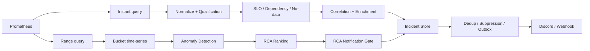

### 1.1 Bản đồ thuật ngữ

Các object dưới đây là những “phiếu thông tin” được truyền qua từng bước. Chúng không có cùng ý nghĩa và không nên gọi chung là alert.

| Thuật ngữ | Nghĩa dễ hiểu | Được tạo ở đâu | Dùng để làm gì |
| --- | --- | --- | --- |
| **Signal** | Một phép đo có tên ổn định, ví dụ `checkout_error_rate_5m` | Query registry | Nối PromQL với service, metric, unit và window |
| **Observation** | Một ảnh chụp giá trị hiện tại của signal | Instant collector | Đầu vào cho qualification và detector threshold/no-data |
| **MetricSeries** | Lịch sử nhiều điểm của một metric | Range collector | Đầu vào cho anomaly, drift, shape và RCA |
| **Feature** | Observation đã được gắn trạng thái và vai trò | Feature Builder | Cho detector biết dữ liệu có sẵn sàng và được phép dùng không |
| **Detector** | Một luật hoặc thuật toán kiểm tra dữ liệu | Detector engine | Quyết định một dấu hiệu có đáng chú ý hay không |
| **CandidateEvent** | Một sự kiện nghi ngờ, chưa phải incident cuối | Threshold/dependency/no-data detector hoặc RCA gate | Mang detector, service, severity, signal, reason, confidence, evidence và runbook sang correlation/incident store |
| **Correlation** | Ghép các CandidateEvent có liên quan trong cùng service/flow/window | Correlator | Giảm nhiều tín hiệu rời thành một câu chuyện chung và đánh giá dependency nghi phạm |
| **Correlated CandidateEvent** | CandidateEvent sau khi correlation bổ sung dependency, confidence và contributing signals | Correlator | Là đầu vào cho enrichment và Incident Store; đây không phải một class riêng |
| **likely_dependency** | Dependency bị nghi đang gây ảnh hưởng cho service của candidate | Dependency detector + Correlator | Chọn nơi enrich, đặt tiêu đề/runbook, xác định fingerprint scope và hỗ trợ suppression |
| **AnomalyFinding** | Kết quả anomaly của một `service + metric + signal_id` | Anomaly engine | Là bằng chứng đầu vào cho RCA; chưa phải incident và chưa chắc được notify |
| **Impact finding** | Tín hiệu cho biết nơi đang chịu ảnh hưởng, thường chuyển từ SLO incident | Pipeline analysis | Cho RCA biết “hệ quả cần được giải thích” |
| **RootCauseCandidate** | Một service được RCA xếp hạng là nguyên nhân gốc | RCA engine | Mang RCA score, root metrics và evidence sang notification gate |
| **Evidence/Corroboration** | Bằng chứng hỗ trợ từ metric, log, trace hoặc Kubernetes | Enricher/RCA | Tăng, giảm hoặc giải thích độ tin cậy; không tự động đồng nghĩa với root cause |
| **Incident** | Bản ghi bền vững đại diện cho một vấn đề qua nhiều lần chạy | Incident Store | Theo dõi `open/ongoing/recovered`, occurrence và dedup |
| **Fingerprint** | Khóa ổn định nhận diện “đây có phải cùng vấn đề cũ không” | Incident Store | Tìm incident cũ mà không phụ thuộc timestamp, value hoặc trace ID |
| **NotificationMessage** | Nội dung đã sẵn sàng gửi ra ngoài | Notification Builder | Contract chung cho Discord hoặc generic webhook |
| **Outbox** | Hàng đợi notification lưu trong SQLite | Incident Store | Không mất thông báo khi gửi lỗi; hỗ trợ retry và suppression |

### 1.2 Những khái niệm dễ nhầm

#### CandidateEvent không phải Incident

`CandidateEvent` chỉ nói rằng **một detector vừa thấy dấu hiệu đáng chú ý**. Nhiều CandidateEvent có thể được correlation gom lại và nhiều lần chạy có thể cập nhật cùng một Incident.

```text
Detector fire -> CandidateEvent
CandidateEvent + fingerprint/dedup -> Incident
Incident + notification gate/outbox -> NotificationMessage
```

#### likely_dependency không phải RCA root cause

Ví dụ:

```text
service = checkout
likely_dependency = payment
```

Ý nghĩa là: **checkout đang chịu ảnh hưởng và payment là dependency nghi phạm**. Đây là kết luận cục bộ từ dependency signal, topology và correlation.

RCA root cause lại được tính từ toàn bộ anomaly, thời gian, topology, shape, downstream coverage và evidence. RCA có thể đồng ý rằng `payment` là root, nhưng cũng có thể chọn service khác hoặc không tạo root nào.

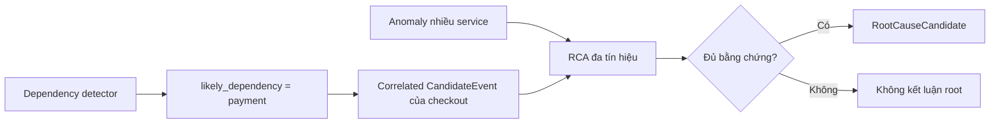

#### Correlation không phải Anomaly Detection

Correlation không đọc trực tiếp hình dạng chuỗi để phát hiện drift. Nó làm việc trên CandidateEvent đã có, nhằm:

    - Gom tín hiệu cùng vụ việc.
    - Tìm dependency nghi phạm.
    - Tính confidence từ thời gian, topology và evidence.
    - Giảm alert rời rạc trước khi tạo incident.

Anomaly Detection làm việc trên MetricSeries và trả AnomalyFinding. Hai luồng chỉ gặp nhau khi pipeline xây dựng incident và RCA.

---

## 2. Nạp cấu hình

Mỗi lần chạy, engine nạp:

    - `runtime.json`: service, flow, topology, detector và policy.
    - `prometheus_queries.json`: PromQL, lookback, step và detector bucket.
    - `hyperparameters.json`: ngưỡng, trọng số, dedup và retry.
    - Schema normalization và qualification.

Nếu bật self-heal thì bắt buộc phải có `live-approved`, executor URL và approval ID. Thiếu một điều kiện, pipeline dừng thay vì tự mutate production.

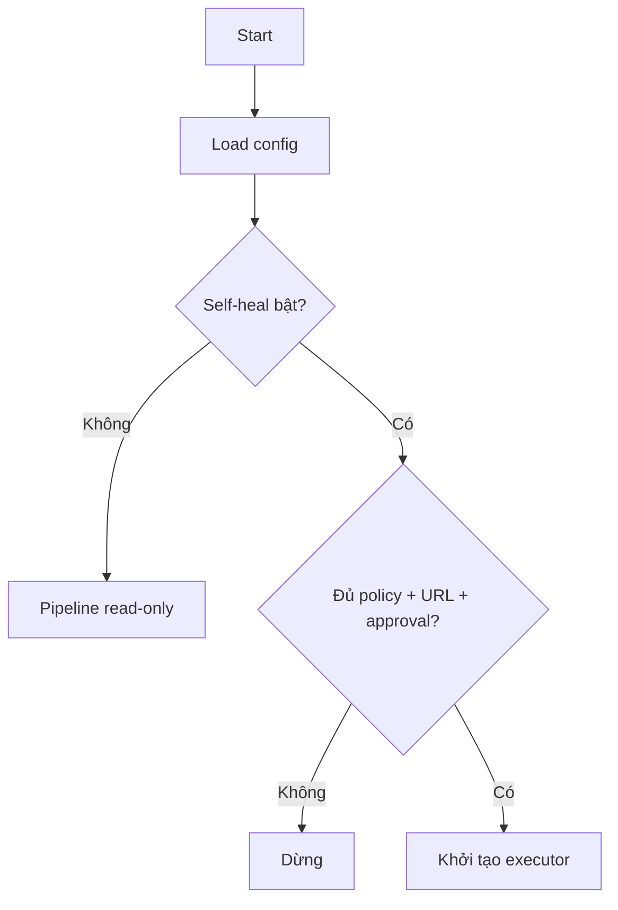

---

## 3. Lấy dữ liệu Prometheus

### 3.1 Instant query

Mỗi signal tạo một object:

```text
Observation = signal_id + value + unit + window + quality + labels
```

Đường này phục vụ threshold, SLO, dependency và no-data. Với latency, collector lấy giá trị lớn nhất trong window để không bỏ mất thời điểm xấu.

### 3.2 Range query

Mỗi metric tạo một chuỗi:

```text
MetricSeries = service + metric + signal_id + points[] + quality
MetricPoint  = timestamp + value
```

Đường này phục vụ anomaly và RCA. Lookback, step và bucket lấy từ query registry.

### 3.3 Phân loại lỗi dữ liệu

    - Query lỗi hoặc không có series: `MISSING`.
    - Vượt `max_series`: `INVALID / CardinalityExceeded`.
    - Sample sai định dạng: `INVALID / InvalidSample`.
    - NaN hoặc vô cực: `INVALID / NonFiniteSample`.
    - Chuỗi có gap không hợp lệ: `INVALID`.
    - Dữ liệu đúng: chuyển tiếp sang qualification.

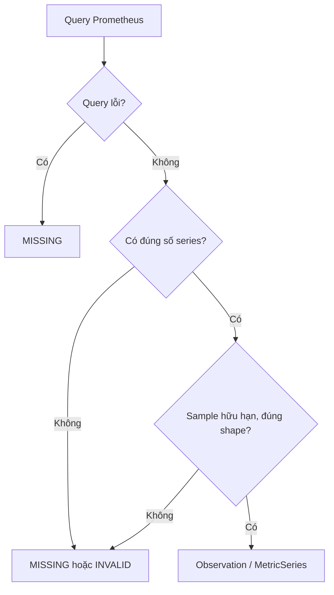

---

## 4. Normalize

Normalizer chỉ chuẩn hóa, không phát hiện lỗi:

    - Đổi alias label và window.
    - Sắp xếp label ổn định.
    - Chuyển unit.

Công thức đổi unit:

```text
normalized_value = raw_value × conversion_factor
```

Mục tiêu là để hai tín hiệu cùng ý nghĩa không bị hiểu thành hai loại dữ liệu khác nhau.

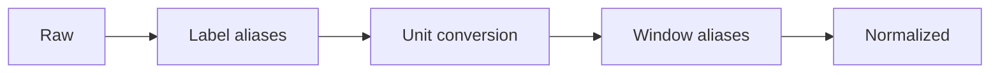

---

## 5. Qualification Gate

Gate trả lời: **“Dữ liệu có đủ tin cậy để detector sử dụng không?”**

Một observation thành `VERIFIED` khi signal tồn tại trong registry, value hữu hạn, unit/window/labels đúng và sample chưa cũ.

```text
sample_age = current_time - sample_timestamp
```

Nếu `sample_age > 300 giây`, quality trở thành `STALE`.

### Kết quả

    - `VERIFIED`: detector được dùng giá trị.
    - `FALLBACK_ONLY`: chỉ làm bằng chứng phụ.
    - `MISSING`, `STALE`, `INVALID`, `UNQUALIFIED`: value thành `None`.

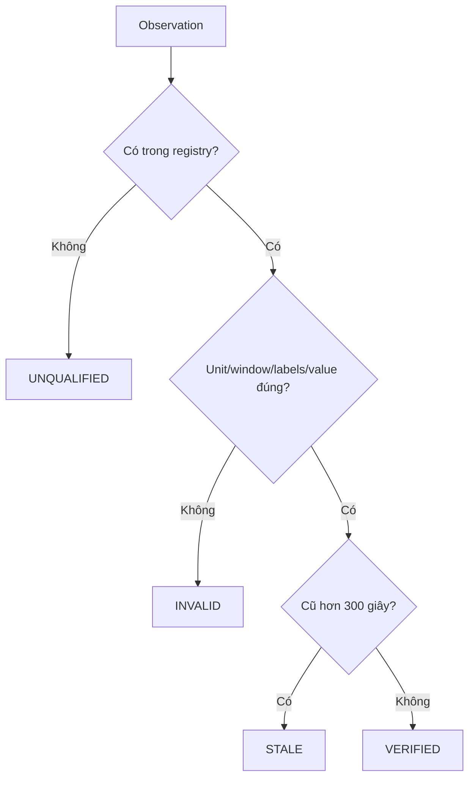

---

## 6. Feature Builder

| Quality | Status | Ý nghĩa |
| --- | --- | --- |
| `VERIFIED` | `ready` | Có thể so threshold |
| `FALLBACK_ONLY` | `fallback` | Evidence phụ |
| Còn lại | `unknown` | Không dùng như giá trị thật |

Feature còn có role: `official_slo`, `anomaly_input`, `diagnostic` hoặc `dependency_signal`.

---

## 7. Detector instant

### 7.1 Threshold/SLO

```text
status = ready
AND role ∈ {official_slo, anomaly_input}
AND value >= threshold
```

Khi đạt, detector tạo CandidateEvent với confidence `1.0` và reason `threshold_breached`.

    - Error rate mặc định: `0.05`, riêng từng detector có thể override.
    - Burn rate mặc định: `1.0`.
    - Latency dùng override theo service.

### 7.2 Dependency

```text
status = ready
AND role ∈ {diagnostic, dependency_signal}
AND value > threshold
```

Candidate được gắn `likely_dependency`, nhưng đây mới là nghi phạm, chưa phải RCA cuối.

### 7.3 No-data

Signal bắt buộc có status `unknown` sẽ tạo no-data candidate:

    - Missing/stale confidence: `1.0`.
    - Unknown/invalid confidence: `0.7`.

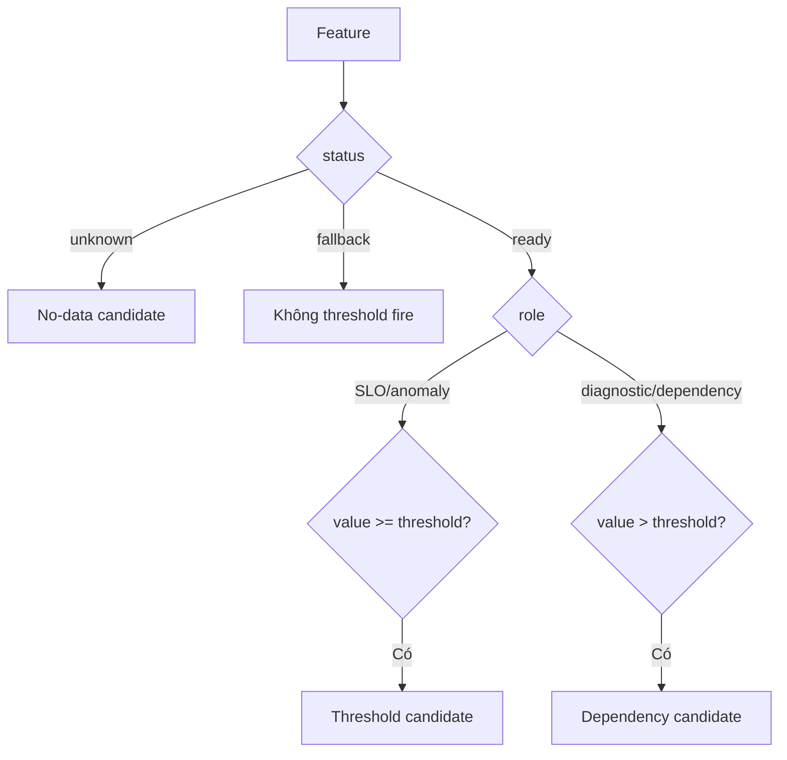

---

## 8. Correlation của CandidateEvent

### 8.1 Correlation dùng để làm gì?

Giả sử trong cùng 5 phút, checkout có ba CandidateEvent:

```text
checkout latency vượt ngưỡng
checkout error rate vượt ngưỡng
checkout -> payment dependency signal vượt ngưỡng
```

Nếu không correlation, ba sự kiện có thể trở thành ba câu chuyện rời. Correlator gom chúng theo service/flow/window, chọn một primary event và ghi các signal còn lại vào `contributing_signals`.

Kết quả vẫn là một `CandidateEvent`, nhưng đã được bổ sung:

    - `likely_dependency`: dependency nghi phạm mạnh nhất, ví dụ `payment`.
    - `confidence`: độ tin cậy của kết luận dependency.
    - `contributing_signals`: các signal cùng đóng góp.
    - `severity`: severity mạnh nhất trong nhóm.
    - `correlation_components`: lý do tạo confidence.

Correlated CandidateEvent được dùng để:

    1. Chọn service/dependency cần query log, trace và Kubernetes.
    2. Tạo fingerprint theo service hoặc dependency scope.
    3. Gắn tiêu đề, runbook và evidence cho incident.
    4. Hỗ trợ suppression các notification cùng blast radius.

Nó **không trực tiếp tạo RCA score** và cũng không chứng minh quan hệ nhân quả.

### 8.2 Cách gom nhóm

Candidate được gom theo:

```text
(environment, flow, service, timestamp // 300)
```

### 8.3 Cách chọn likely_dependency

Trong mỗi nhóm, event không có dependency được ưu tiên làm primary. Các dependency candidate được chấm điểm; candidate có `max(configured_confidence, component_sum)` cao nhất được chọn.

Correlation score là tổng component thỏa điều kiện:

| Component | Weight |
| --- | ---: |
| Primary verified | 0.25 |
| Dependency xuất hiện trước | 0.20 |
| Nằm trên topology path | 0.25 |
| Có operation/rpc/method/span | 0.10 |
| Có trace/log/Kubernetes evidence | 0.20 |
| Evidence stale/missing | -0.30 |

```text
confidence = clamp(max(configured_confidence, Σ component_weight), 0, 1)
```

Chỉ gắn dependency khi confidence đạt `0.5`. Không đạt ngưỡng thì CandidateEvent vẫn được giữ, nhưng `likely_dependency = unknown` để engine không giả vờ biết dependency.

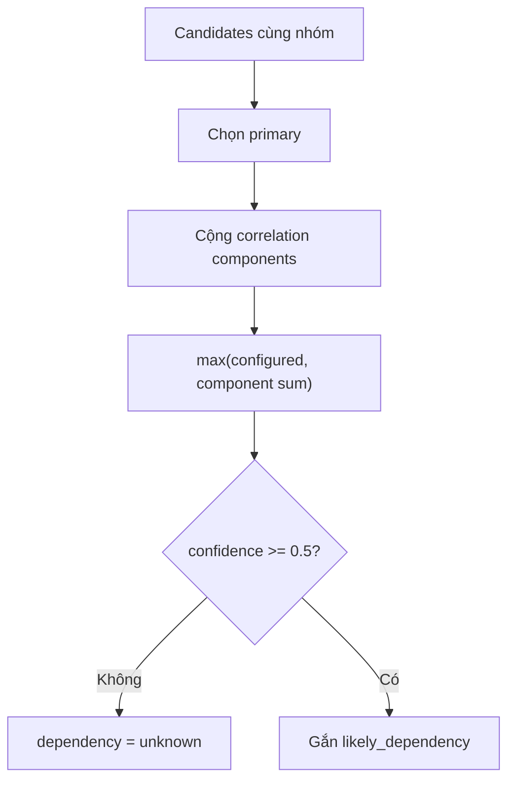

---

## 9. Candidate Enrichment

Candidate được bổ sung:

    - Feature: window, unit, quality.
    - Jaeger: trace, operation, status, duration và URL.
    - OpenSearch: log count và excerpt đã redact.
    - Kubernetes: restart, ready pods, replicas và rollout.

Lỗi enrichment không dừng pipeline; engine lưu `enrichment_failure`.

---

## 10. Chuẩn bị time-series

Chỉ series `VERIFIED` và có point được giữ. Sau đó engine gom dữ liệu về detector bucket:

    - Error/latency: `max(bucket)`.
    - CPU/memory/request rate/socket I/O: `mean(bucket)`.
    - Metric khác: `last(bucket)`.

Việc bucket hóa giúp CUSUM và detector không nhạy hơn chỉ vì Prometheus scrape dày hơn.

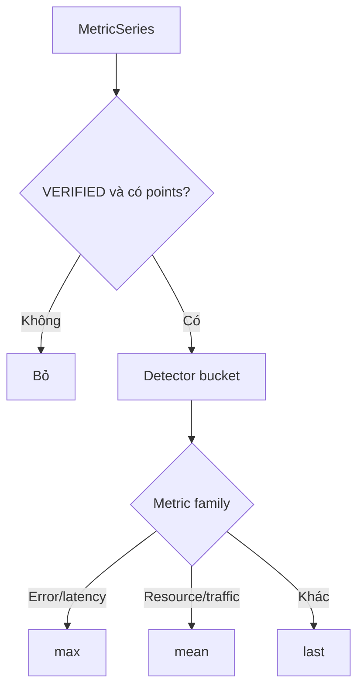

---

## 11. Growth Gate

Gate hỏi: **“Resource tăng vì lỗi hay vì traffic tăng hợp lý?”**

Engine so request rate với CPU và socket I/O, cho phép lệch tối đa 5 bucket.

```text
traffic_score = Σ(shape_score × weight) / Σ(active_weight)
```

Trọng số: CPU `0.45`, socket I/O `0.35`.

Traffic được giải thích khi:

```text
traffic_score >= 0.65
AND max(cpu_score, socket_score) >= 0.55
```

### Rẽ nhánh

    - OOM counter tăng: breakout, luôn giữ cho RCA.
    - Error tăng: breakout.
    - Resource đi ngược request rate: shape mismatch.
    - Thiếu request/CPU/socket: không kết luận traffic explained.
    - Series toàn 0: ghi rõ `zero_metrics`.

**Lưu ý code hiện tại:** growth gate ghi `explained_metrics` nhưng vẫn trả series cho anomaly detector. Các metric đó được lọc khỏi root cause sau khi RCA chạy. Đây là bộ lọc RCA muộn, không phải bộ lọc tuyệt đối trước anomaly.

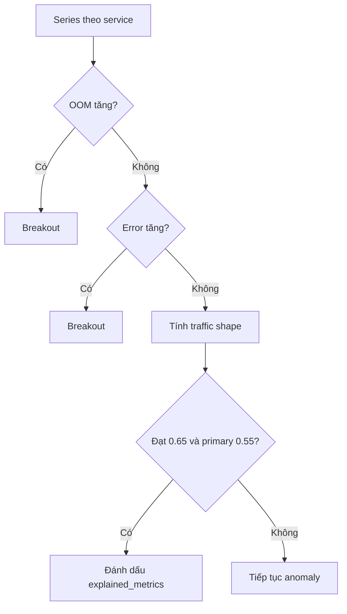

---

## 12. Significant Tail Gate

Mỗi metric phải chứng minh phần cuối chuỗi còn thay đổi.

### 12.1 Basic-tail

```text
baseline = median(values_before_tail)
delta = |value - baseline|
```

Một bucket changed khi:

```text
delta >= min_absolute
AND (baseline = 0 ? delta > 0 : delta / |baseline| >= min_relative)
```

Tail significant khi:

```text
changed_buckets >= min_tail_anomaly_buckets
```

Ví dụ memory cần tối thiểu 6 bucket, lệch ít nhất 10 MiB và 5% baseline.

### 12.2 Slow-drift

Trong cửa sổ 1 giờ:

```text
slope = Σ((x-x̄)(y-ȳ)) / Σ((x-x̄)²)
projected_change = direction × slope × time_span
positive_ratio = số bước đúng hướng / tổng số bước
```

#### Ý nghĩa từng biến

| Biến | Ý nghĩa | Đơn vị |
| --- | --- | --- |
| `x` | Timestamp của từng bucket | Giây |
| `x̄` | Timestamp trung bình của các bucket | Giây |
| `y` | Giá trị metric tại bucket tương ứng | Đơn vị metric, ví dụ byte hoặc millicore |
| `ȳ` | Giá trị trung bình của metric trong cửa sổ | Đơn vị metric |
| `Σ` | Cộng kết quả của tất cả bucket trong cửa sổ | Không có đơn vị riêng |
| `slope` | Tốc độ thay đổi của đường xu hướng | Đơn vị metric/giây |
| `direction` | Chiều engine quan tâm: `1` cho tăng, `-1` cho giảm | Không có đơn vị |
| `time_span` | Timestamp cuối trừ timestamp đầu | Giây |
| `projected_change` | Tổng mức thay đổi được ước lượng từ đường xu hướng | Đơn vị metric |
| `positive_ratio` | Tỷ lệ bước liên tiếp đi đúng hướng cấu hình | Từ `0` đến `1` |
| `min_total_change` | Mức thay đổi tối thiểu để coi drift có ý nghĩa | Đơn vị metric |

#### `slope` nói điều gì?

`slope` là độ dốc của đường thẳng đại diện tốt nhất cho toàn bộ chuỗi:

    - `slope > 0`: metric có xu hướng tăng.
    - `slope < 0`: metric có xu hướng giảm.
    - `slope` gần `0`: chưa có xu hướng rõ ràng.

Phần tử `(x-x̄)(y-ȳ)` kiểm tra thời gian và giá trị có cùng di chuyển khỏi trung bình hay không. Nếu các điểm về sau thường cao hơn, tổng này dương và slope dương. Mẫu số `Σ((x-x̄)²)` chuẩn hóa theo độ dài thời gian, để cùng một mức tăng trong 5 phút được hiểu là nhanh hơn mức tăng trong 1 giờ.

#### `projected_change` nói điều gì?

```text
projected_change = direction × slope × time_span
```

Giá trị này trả lời: **“Theo đường xu hướng, metric đã thay đổi tổng cộng khoảng bao nhiêu trong cửa sổ?”**

Nó không nhất thiết bằng `giá trị cuối - giá trị đầu`. Vì được tính từ đường hồi quy của toàn bộ chuỗi, một spike hoặc dip đơn lẻ ít có khả năng chi phối kết quả.

`direction` giúp cùng một công thức xử lý metric cần theo dõi chiều khác nhau:

    - Memory, CPU, latency: thường cấu hình `up`, nên `direction = 1`.
    - Metric cần bắt giảm: cấu hình `down`, nên `direction = -1`.

#### `positive_ratio` nói điều gì?

`positive_ratio` kiểm tra xu hướng có đủ đều không:

```text
positive_ratio = số lần (y tiếp theo - y hiện tại) đi đúng direction
                 / tổng số cặp bucket liên tiếp
```

Ví dụ chuỗi memory:

```text
100 -> 105 : tăng, đúng hướng
105 -> 103 : giảm, sai hướng
103 -> 110 : tăng, đúng hướng
110 -> 115 : tăng, đúng hướng

positive_ratio = 3 / 4 = 0.75
```

Nếu chỉ có một spike lớn còn phần lớn chuỗi đi ngang hoặc giảm, `projected_change` có thể cao nhưng `positive_ratio` thấp. Điều kiện thứ hai ngăn spike đó bị gọi nhầm là slow-drift.

#### Ví dụ đầy đủ với memory

Giả sử sau khi bucket hóa, memory có xu hướng:

```text
Thời gian:   0    10    20    30 phút
Memory:    100   110   120   130 MiB
```

Đường xu hướng tăng khoảng:

```text
slope ≈ 1 MiB/phút
direction = 1
time_span = 30 phút

projected_change = 1 × 1 × 30 = 30 MiB
```

Ba trên ba bước đều tăng:

```text
positive_ratio = 3 / 3 = 1.0
```

Với cấu hình memory hiện tại:

```text
min_total_change = 5 MiB
positive_bucket_ratio = 0.45

30 MiB >= 5 MiB
1.0 >= 0.45
```

Cả hai điều kiện đều đạt, vì vậy slow-drift significant.

Nếu chuỗi là `100 -> 140 -> 101 -> 100`, spike lên 140 MiB có thể rất lớn nhưng xu hướng cuối không tăng đều. `positive_ratio` thấp và slope toàn cửa sổ gần phẳng, nên slow-drift không nên trigger; spike sẽ được các detector cục bộ như EWMA hoặc Robust Drift xem xét.

Significant khi:

```text
projected_change >= min_total_change
AND positive_ratio >= 0.45
```

Tối thiểu 12 point. Ngưỡng tổng thay đổi nổi bật: memory 5 MiB, CPU 100 millicores, socket I/O 512,000 byte/s.

### 12.3 CUSUM

CUSUM chỉ áp dụng cho CPU, latency và socket I/O, không áp dụng cho memory.

```text
limit = max(min_absolute, |baseline| × min_relative) × max(2, min_buckets)
cumulative = max(0, cumulative + value - baseline)
```

Significant khi lệch dương liên tục đủ `min_buckets` và cumulative đạt limit. Khi chuỗi ngừng lệch dương, cumulative reset.

### 12.4 Page-Hinkley

```text
threshold = max(min_absolute, |baseline| × min_relative)
tolerance = threshold / max(2, min_buckets)
delta = value - baseline - tolerance
```

`delta <= 0` làm reset. Nếu dương liên tục đủ bucket và cumulative vượt threshold thì significant.

### 12.5 OOM

OOM không dùng phần trăm. Counter chỉ cần tăng ở một trong 3 bucket gần nhất:

```text
oom_t > oom_(t-1)
```

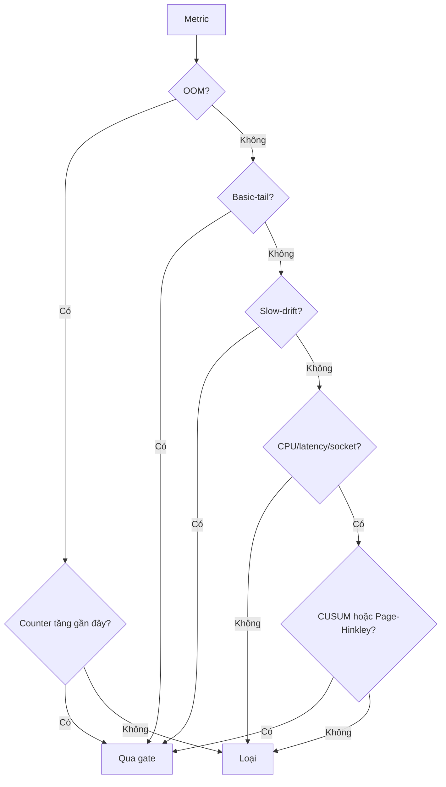

---

## 13. Anomaly Detectors

### 13.0 Feature extraction cho anomaly

Trong code hiện tại không có một class `FeatureExtractor` chung. Mỗi detector tự chuyển `MetricSeries` thành loại feature mà thuật toán của nó cần. Đây là chủ ý hợp lý vì một vector đa biến của Isolation Forest không giống residual đơn biến của EWMA.

#### Tiền xử lý chung

Trước khi tách feature riêng cho detector, mọi series đi qua:

```text
MetricSeries thô
-> chỉ giữ quality VERIFIED
-> gom detector bucket
-> growth gate ghi explained/breakout metrics
-> significant-tail gate
-> detector-specific feature extraction
```

| Bước | Đầu vào | Đầu ra | Mục đích |
| --- | --- | --- | --- |
| Quality filter | MetricSeries | Series verified | Không học từ dữ liệu missing/invalid |
| Bucket | Các sample trong bucket | Một giá trị/bucket | Giảm phụ thuộc scrape interval |
| Fixed baseline/tail | Toàn bộ points | Baseline + tail indexes | Tách phần “bình thường cũ” khỏi phần cần kiểm tra |
| Tail gate | Baseline + tail | Pass/drop | Không chạy detector trên thay đổi quá nhỏ hoặc đã kết thúc |

#### Feature của Robust Drift

Robust Drift dùng **một metric tại một thời điểm**:

```text
Input feature tại bucket t = raw metric value y_t
Reference features          = rolling baseline trước bucket t
Output feature              = robust_score_t
```

Ví dụ:

```text
cart.memory_usage_bytes
baseline: [130, 131, 130, 132, ...] MiB
tail:     [145, 147, 149] MiB

Mỗi tail value được đổi thành một robust score so với baseline trước nó.
```

Detector lấy cặp `(score, bucket_index)` lớn nhất làm raw finding.

#### Feature của EWMA/STL

EWMA không chấm trực tiếp raw value. Nó tạo residual:

```text
smoothed_t = EWMA(raw_values)_t
seasonal_t = STL seasonal component, chỉ khi seasonal_period > 1
residual_t = raw_t - smoothed_t - seasonal_t
```

Feature thực sự đưa vào z-score là `residual_t`.

Ví dụ:

```text
raw latency      = 1.20 s
EWMA dự kiến     = 0.80 s
seasonal         = 0.05 s
residual feature = 1.20 - 0.80 - 0.05 = 0.35 s
```

Config hiện tại có `seasonal_period = 1`, nên seasonal bằng 0 và feature chủ yếu là `raw - EWMA`.

#### Feature của Isolation Forest

Isolation Forest là detector đa biến cấp service. Quy trình trích xuất feature:

1. Gom các MetricSeries theo service.
2. Chỉ giữ service có ít nhất hai metric đủ `min_points`.
3. Lấy giao timestamp giữa các metric, để mọi hàng có đủ cột.
4. Mỗi timestamp trở thành một feature vector.
5. Tách các hàng baseline và tail.
6. Normalize từng cột bằng min/max của **baseline**.
7. Fit Isolation Forest trên baseline rows.
8. Score tail rows và chọn hàng bất thường nhất.

Ví dụ service `cart` có ba metric:

```text
timestamp   cpu   memory   socket_io
t1           15     130         20
t2           16     131         21
t3           55     150         80
```

Feature vector tại `t3` là:

```text
X_t3 = [55, 150, 80]
```

Mỗi cột được normalize riêng:

```text
x_norm = (x - baseline_min) / (baseline_max - baseline_min)
```

Giả sử baseline CPU nằm trong `[10, 20]`, CPU tại `t3 = 55`:

```text
cpu_norm = (55 - 10) / (20 - 10) = 4.5
```

Giá trị có thể lớn hơn 1 vì tail được so với min/max baseline và không bị clip. Điều này giúp model thấy tail đã đi xa vùng đã học.

Sau khi service-level row bị đánh dấu bất thường, engine vẫn cần một metric để tạo `AnomalyFinding`. Nó chọn cột có độ lệch tuyệt đối lớn nhất so với baseline center làm metric đại diện.

#### Feature của Slow-drift

Slow-drift dùng hai feature tổng hợp từ toàn cửa sổ:

```text
trend feature       = projected_change
consistency feature = positive_ratio
```

Nó không dùng một bucket cực trị. Vì vậy slow-drift phù hợp với xu hướng dài, còn Robust/EWMA phù hợp hơn với thay đổi cục bộ.

#### Feature của log anomaly

Log text được đổi thành template bằng Drain3 hoặc regex fallback, sau đó thành time-series:

```text
feature = số lần template xuất hiện trong mỗi bucket 60 giây
```

Ví dụ:

```text
"payment timeout order=123"
"payment timeout order=456"
-> template "payment timeout order=<*>"
-> [0, 1, 2, 8, 10, ...] lần/bucket
```

Chuỗi template count được đưa vào EWMA và Isolation Forest, nhưng log finding chỉ được giữ khi gần một metric anomaly cùng service.

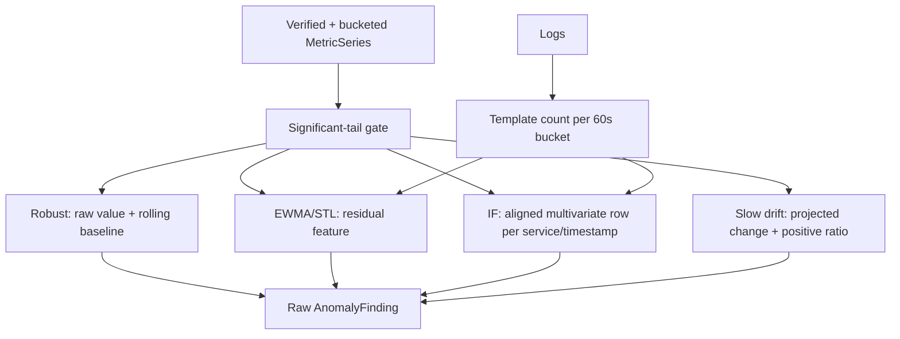

### 13.1 Robust Drift

```text
center = median(baseline)
MAD spread = median(|x-center|) × 1.4826
IQR spread = (Q75-Q25) / 1.349
spread = max(MAD spread, IQR spread, fallback 1)
score = |value-center| / spread
```

Fire khi score `>= 4.0`.

### 13.2 EWMA + STL

EWMA dùng alpha `0.1`. Vì `seasonal_period = 1`, hiện tại residual chủ yếu là:

```text
residual = value - EWMA
z = |residual - mean(baseline_residual)| / stdev(baseline_residual)
```

Fire khi z `>= 4.0`.

### 13.3 Isolation Forest

Model dùng nhiều metric cùng service tại timestamp chung. Mỗi cột được normalize:

```text
normalized = (value - baseline_min) / (baseline_max - baseline_min)
service_score = -score_samples(row) × 10
```

Fire khi service score `>= 5.0`. Finding đầu ra gắn với metric lệch baseline nhiều nhất.

### 13.4 Slow-drift finding

Slow-drift đạt gate tạo finding score `1.0`, timestamp tại đầu cửa sổ drift.

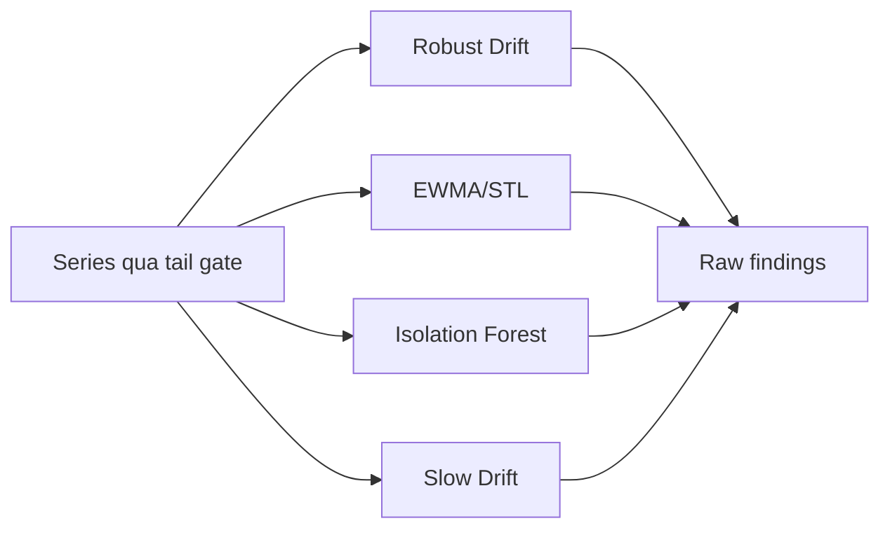

---

## 14. Tổng hợp AnomalyFinding

Raw finding được gom theo:

```text
(service, metric, signal_id)
```

Vì vậy AnomalyFinding là **theo metric của từng service**, chưa phải root cause cấp service.

```text
normalized_i = detector_score_i / detector_threshold_i
anomaly_score = Σ weight_i × min(normalized_i, 1)
```

| Detector | Weight |
| --- | ---: |
| Robust Drift | 0.8 |
| EWMA/STL | 0.8 |
| Isolation Forest | 0.2 |
| Slow Drift | 1.0 |

Giữ finding khi `anomaly_score >= 1.0`.

Ngoại lệ: một detector có `normalized >= 2.0` được tự nâng lên 1.0.

```text
Robust vừa đạt:       0.8 -> chưa đủ
Robust + EWMA đạt:    1.6 -> anomaly
Slow Drift đạt:       1.0 -> anomaly
```

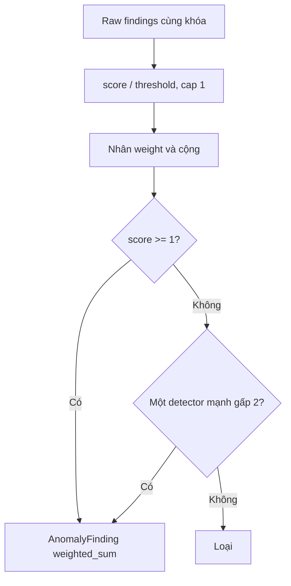

---

## 15. Log/Trace Corroboration

Log được gom template và đếm theo bucket 60 giây. Log anomaly chỉ được giữ nếu có metric anomaly cùng service trong 300 giây.

RCA query evidence theo thứ tự:

    1. Root service đứng đầu.
    2. Nếu chưa mạnh, dependency trực tiếp.
    3. Nếu RCA dưới 0.45 hoặc nhiều root cạnh tranh, các anomaly service còn lại.

Điều chỉnh anomaly score:

```text
Có nguồn nhưng không failure: score × 0.5
Một nguồn failure:            min(1, score + 0.15)
Log và trace cùng failure:    min(1, score + 0.30)
```

Error/OOM và hard failure không bị phạt vì thiếu evidence.

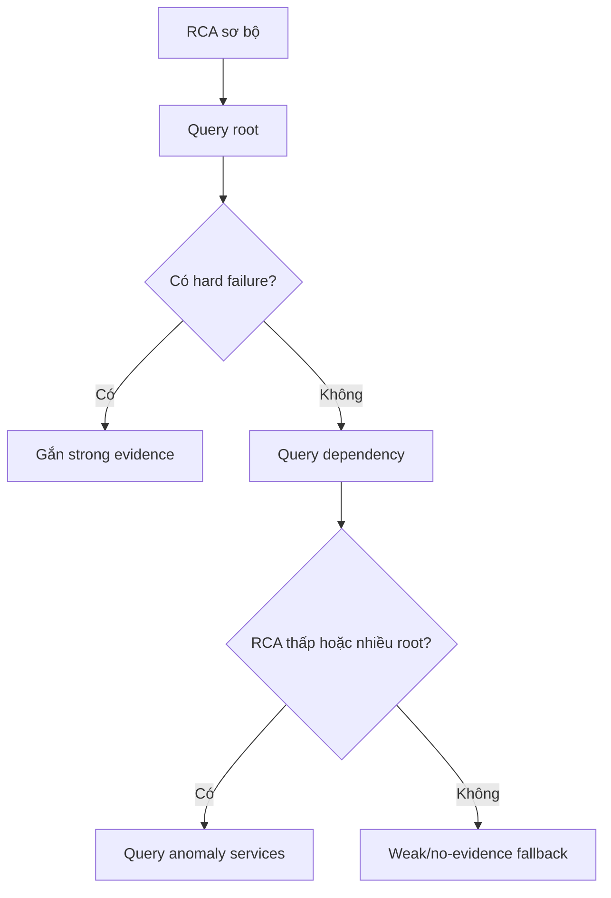

---

## 16. Tạo ứng viên RCA

Đầu vào RCA gồm anomaly findings, SLO impact, drift metric trực tiếp và trace/log root mạnh.

Request rate, latency, burn rate, error và log template là context metric, không được chọn làm `root_cause_metric`. Resource/OOM/default metric có thể làm root metric.

Protected/non-actionable service bị loại; PostgreSQL là ngoại lệ vẫn được quan sát.

---

## 17. Bốn RCA ranker

### 17.1 Graph

```text
graph_raw = max_seed × (0.7 × personalized_pagerank + 0.3 × timestamp_score)
timestamp_score = 1 - (timestamp-oldest)/(newest-oldest)
graph_score = graph_raw / max(graph_raw)
```

### 17.2 Earliest drift

Engine tìm bucket đầu có robust score `>= 4.0` và tail significant:

```text
earliest_score = 1 - drift_index / latest_drift_index
```

### 17.3 Shape correlation

Primary là SLO series nếu có, nếu không là anomaly mạnh nhất:

```text
shape_score = max(|Spearman(primary, metric, lag)|), lag = 0..5 bucket
```

### 17.4 Downstream coverage

Root được điểm khi downstream phụ thuộc nó trong tối đa 2 hop và đỏ sau nó:

```text
coverage_raw(root) = Σ anomaly_strength(downstream)
coverage_score = coverage_raw / max(coverage_raw)
```

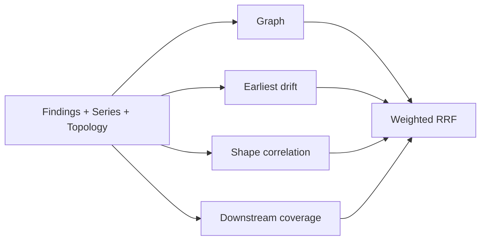

---

## 18. Tổng hợp RCA score

| Ranker | Weight |
| --- | ---: |
| Graph | 0.15 |
| Earliest drift | 0.55 |
| Shape correlation | 0.15 |
| Downstream coverage | 0.15 |

### Weighted RRF

Mỗi ranker sắp service theo score:

```text
RRF_raw(service) = Σ weight_ranker / (20 + rank_position)
weighted_rrf = RRF_raw / Σ(weight_active_ranker / 21)
```

### Support

```text
support = Σ(weight_ranker × clamp(component_score, 0, 1)) / Σ(weight_ranker)
```

### Evidence strength

```text
evidence_strength = min(1, anomaly_score mạnh nhất của service)
```

### RCA score cuối

```text
RCA score = weighted_rrf × evidence_strength × support
```

Ví dụ:

```text
weighted_rrf = 0.90
evidence     = 0.80
support      = 0.40
RCA score    = 0.90 × 0.80 × 0.40 = 0.288
```

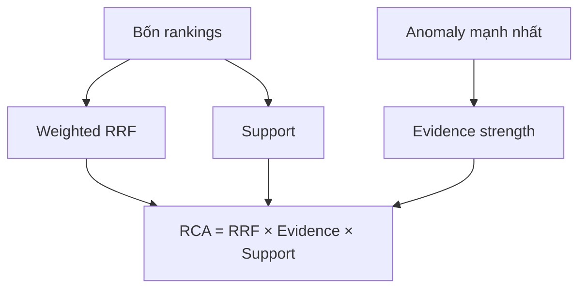

---

## 19. Lọc root cause

### Downstream symptom

Loại candidate nếu có parent:

```text
candidate phụ thuộc parent
AND parent xuất hiện sớm hơn
AND parent.score >= candidate.score
```

### Traffic explained

Xóa metric đã được growth gate giải thích khỏi `root_cause_metrics`. Không còn root metric thì loại service.

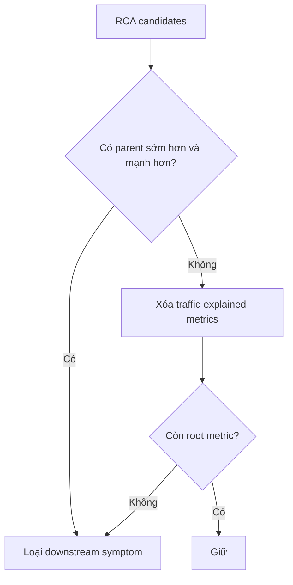

---

## 20. RCA Notification Gate

Root phải qua ba lớp:

1. `RCA score >= 0.24`.
2. Root metric có significant current tail; memory/OOM được phép qua nếu OOM counter tăng.
3. Nếu không có anomaly/SLO context thì cần `metric_score >= 1.8` hoặc `shape_score >= 0.95`.

Nếu tail đã đảo về baseline, RCA không được notify dù ranking từng cao.

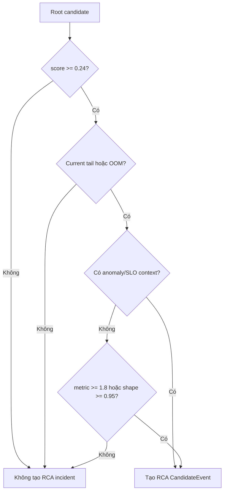

RCA event có `value = RCA score`, `threshold = 0.24`, `quality = FALLBACK_ONLY` và detector `rca_root_cause`.

---

## 21. Incident fingerprint và lifecycle

Fingerprint SHA-256 dùng:

```text
environment + detector_id + flow + service/dependency scope + likely_dependency
```

RCA thêm signal ID để metric root khác nhau không bị ép thành một incident. Timestamp, value, pod và trace ID không nằm trong fingerprint.

### Lifecycle

    - Fingerprint mới: `open`, occurrence 1.
    - Thấy lại: `ongoing`, tăng occurrence.
    - Quá 900 giây: reset occurrence/event window.
    - Vắng 30 lần chạy liên tiếp: `recovered`.
    - Recovered xuất hiện lại: mở lại.

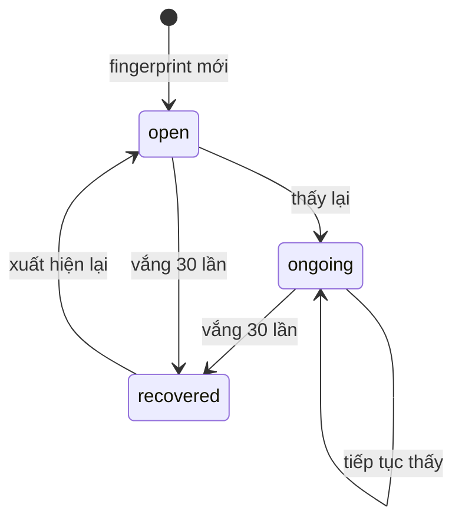

---

## 22. Dedup và suppression

Các window hiện tại đều 900 giây: notification cooldown, RCA dedup, SLO dedup, count reset và active-root suppression.

    - `incident_fingerprint`: cập nhật incident cũ.
    - `incident_cooldown`: chưa hết thời gian thì không enqueue.
    - `service_notification_cooldown`: cùng service và loại notification bị giữ.
    - `notification_outbox`: pending/retry chưa xong thì không tạo bản trùng.
    - `same_blast_radius`: downstream bị suppress khi root đã giải thích.
    - `active_root_cause`: incident mới trong blast radius của root active bị suppress.
    - Severity tăng: có thể vượt cooldown.

```mermaid
flowchart TD
    I["Incident"] --> F{"Cùng fingerprint?"}
    F -- "Có" --> U["Update occurrence"]
    F -- "Không" --> N["Tạo mới"]
    U --> C{"Cooldown?"}
    N --> C
    C -- "Có" --> D["Dedup"]
    C -- "Không" --> B{"Thuộc blast radius root active?"}
    B -- "Có" --> X["Suppress"]
    B -- "Không" --> O["Outbox pending"]
```

---

## 23. Tạo notification

Notification gồm title, state, service, flow, signal/metric, value, threshold, RCA score, evidence, action hint và runbook. Evidence được giữ theo marker, tối đa 20 dòng.

### Bổ sung strong evidence

Nếu RCA đầu đã gửi với weak/no evidence nhưng strong log/trace xuất hiện trong 15 phút:

    - Bản đầu còn pending/retry: cập nhật bản đó.
    - Bản đầu đã sent: gửi đúng một supplemental notification trong cycle.
    - Bản đầu đã có strong evidence: không gửi bổ sung.

```mermaid
flowchart TD
    E["Strong evidence mới"] --> P{"Bản đầu pending/retry?"}
    P -- "Có" --> U["Update bản pending"]
    P -- "Không" --> S{"Đã sent trong 15 phút và chưa bổ sung?"}
    S -- "Có" --> N["Supplement notification"]
    S -- "Không" --> X["Không gửi thêm"]
```

---

## 24. Outbox và gửi webhook

Trạng thái:

```text
pending -> sent
pending -> retry -> sent
pending/retry -> suppressed
```

Retry theo exponential backoff:

```text
retry_seconds = min(60 × 2^(attempt_count - 1), 3600)
```

Discord nhận embed; generic webhook nhận JSON. Dev/user channels được gửi song song nếu cùng cấu hình.

```mermaid
flowchart TD
    O["Outbox pending"] --> D["Dispatch"]
    D --> H{"HTTP thành công?"}
    H -- "Có" --> S["sent"]
    H -- "Không" --> R["retry"]
    R --> B["Backoff"]
    B --> D
    O --> X["RCA suppression"]
    X --> SP["suppressed"]
```

---

## 25. Ví dụ end-to-end

Giả sử memory `cart` tăng dần và checkout bắt đầu lỗi:

    1. Prometheus trả memory series của cart và checkout error instant/series.
    2. Series được gom bucket.
    3. Memory phải qua basic-tail hoặc slow-drift; CUSUM không áp dụng cho memory.
    4. Các detector tạo raw findings và weighted anomaly.
    5. Checkout SLO tạo impact finding nếu vượt threshold.
    6. RCA đánh giá graph, thời điểm, shape và downstream coverage.
    7. RRF, evidence và support tạo RCA score.
    8. Cart chỉ thành root nếu score đạt 0.24 và memory tail vẫn còn lệch.
    9. Engine query log/trace cart rồi dependency nếu cần.
    10. Incident Store fingerprint, dedup và kiểm tra suppression.
    11. Notification được ghi outbox rồi gửi webhook.

```mermaid
sequenceDiagram
    participant P as Prometheus
    participant A as Anomaly
    participant R as RCA
    participant E as Enrichment
    participant S as Incident Store
    participant N as Notification

    P->>A: cart memory series
    A->>A: tail + detectors + weighted sum
    A->>R: cart.memory anomaly
    P->>R: checkout SLO impact
    R->>R: graph + temporal + shape + coverage
    R->>E: query root/dependency
    E-->>R: log/trace evidence
    R->>S: RCA CandidateEvent
    S->>S: fingerprint + dedup + suppression
    S->>N: outbox pending
    N-->>S: sent hoặc retry
```

---

## 26. Công thức tóm tắt

```text
Tail point:
delta >= absolute_min AND delta/|baseline| >= relative_min

Slow drift:
projected_change = direction × slope × span

Robust score:
|value - median(baseline)| / robust_spread

EWMA residual z-score:
|residual - mean(baseline_residual)| / stdev(baseline_residual)

Weighted anomaly:
Σ detector_weight × min(detector_score/detector_threshold, 1)

Correlation confidence:
clamp(max(configured_confidence, Σ component_weight), 0, 1)

Weighted RRF:
Σ ranker_weight / (20 + rank_position)

Support:
Σ ranker_weight × component_score / Σ ranker_weight

RCA score:
weighted_rrf × evidence_strength × support

Retry:
min(60 × 2^(attempt-1), 3600) giây
```

### 26.1 Basic-tail

```text
baseline = median(values_before_tail)
delta = |value - baseline|
changed = delta >= min_absolute
          AND delta / |baseline| >= min_relative
```

| Biến | Ý nghĩa |
| --- | --- |
| `values_before_tail` | Các bucket cũ dùng làm vùng bình thường |
| `baseline` | Trung vị vùng bình thường, ít bị spike kéo lệch |
| `value` | Giá trị bucket đang kiểm tra |
| `delta` | Khoảng cách tuyệt đối tới baseline |
| `min_absolute` | Chặn thay đổi rất nhỏ về đơn vị thực |
| `min_relative` | Chặn thay đổi nhỏ so với quy mô baseline |

Ví dụ memory baseline 100 MiB, value 112 MiB, absolute minimum 10 MiB, relative minimum 5%:

```text
delta = |112 - 100| = 12 MiB
relative = 12 / 100 = 12%

12 >= 10 và 12% >= 5% -> bucket changed
```

Cả hai ngưỡng cùng tồn tại để tránh hai lỗi:

    - Chỉ dùng phần trăm: baseline nhỏ làm thay đổi rất nhỏ có phần trăm lớn.
    - Chỉ dùng tuyệt đối: cùng 10 MiB có ý nghĩa khác nhau với service 100 MiB và 10 GiB.

### 26.2 CUSUM

```text
base_limit = max(min_absolute, |baseline| × min_relative)
limit = base_limit × max(2, min_buckets)
delta_t = value_t - baseline
cumulative_t = max(0, cumulative_(t-1) + delta_t)
```

| Biến | Ý nghĩa |
| --- | --- |
| `base_limit` | Độ lệch tối thiểu có ý nghĩa của một metric |
| `min_buckets` | Số bucket dương liên tiếp bắt buộc |
| `delta_t` | Bucket hiện tại cao hơn baseline bao nhiêu |
| `cumulative_t` | Tổng độ lệch dương còn tích lũy |
| `limit` | Tổng độ lệch cần đạt để trigger |

Ví dụ baseline CPU 100 millicores, `base_limit = 10`, `min_buckets = 3`:

```text
limit = 10 × 3 = 30
tail = [105, 108, 112]
deltas = [5, 8, 12]
cumulative = 5 + 8 + 12 = 25 < 30 -> chưa trigger
```

Nếu bucket tiếp theo là 110:

```text
cumulative = 25 + 10 = 35 >= 30
```

Khi đã đủ số bucket liên tiếp, CUSUM trigger. Nếu một delta không dương, engine reset cumulative về 0, nên các lệch rời rạc không cộng mãi.

### 26.3 Page-Hinkley

```text
threshold = max(min_absolute, |baseline| × min_relative)
tolerance = threshold / max(page_hinkley_factor, min_buckets)
adjusted_delta_t = value_t - baseline - tolerance
```

| Biến | Ý nghĩa |
| --- | --- |
| `threshold` | Tổng thay đổi tối thiểu cần xác nhận |
| `tolerance` | Phần nhiễu nhỏ bị trừ khỏi mỗi bucket |
| `adjusted_delta_t` | Độ lệch còn lại sau khi bỏ tolerance |
| `cumulative - minimum` | Mức mean-shift tích lũy kể từ đáy gần nhất |

Ví dụ threshold 10, min buckets 5:

```text
tolerance = 10 / 5 = 2
value - baseline = 3 mỗi bucket
adjusted_delta = 3 - 2 = 1
```

Mỗi bucket chỉ đóng góp 1 thay vì 3. Engine cần độ lệch nhỏ này tồn tại liên tục đủ lâu mới vượt threshold. Bucket có adjusted delta không dương sẽ reset chuỗi.

### 26.4 Robust score

```text
center = median(baseline)
MAD = median(|x-center|) × 1.4826
IQR_spread = (Q75-Q25) / 1.349
spread = max(MAD, IQR_spread, 1)
robust_score = |value-center| / spread
```

| Biến | Ý nghĩa |
| --- | --- |
| `center` | Trung tâm robust của baseline |
| `MAD` | Độ phân tán dựa trên median absolute deviation |
| `Q25`, `Q75` | Phân vị 25% và 75% |
| `spread` | Độ rộng bình thường dùng làm mẫu số |
| `robust_score` | Số “đơn vị phân tán” mà value cách baseline |

Ví dụ center 100, spread 4, value 120:

```text
robust_score = |120 - 100| / 4 = 5
5 >= threshold 4 -> Robust Drift fire
```

Hệ số `1.4826` và `1.349` đưa MAD/IQR về thang gần với standard deviation khi dữ liệu gần phân phối chuẩn, nhưng vẫn bền hơn trước outlier.

### 26.5 EWMA residual z-score

EWMA có thể hình dung bằng công thức lặp:

```text
EWMA_t = alpha × value_t + (1-alpha) × EWMA_(t-1)
residual_t = value_t - EWMA_t - seasonal_t
z_t = |residual_t - mean(baseline_residual)| / stdev(baseline_residual)
```

| Biến | Ý nghĩa |
| --- | --- |
| `alpha` | Mức ưu tiên dữ liệu mới; hiện là 0.1 |
| `EWMA_t` | Mức dự kiến đã làm mượt tại thời điểm t |
| `seasonal_t` | Thành phần chu kỳ từ STL; hiện bằng 0 vì period 1 |
| `residual_t` | Phần raw value không được trend/seasonal giải thích |
| `z_t` | Residual cách baseline residual bao nhiêu độ lệch chuẩn |

Ví dụ:

```text
value = 1.20 s
EWMA = 0.80 s
seasonal = 0.05 s
residual = 0.35 s

baseline residual mean = 0.05 s
baseline residual stdev = 0.05 s
z = |0.35 - 0.05| / 0.05 = 6
6 >= 4 -> EWMA/STL fire
```

`alpha = 0.1` làm đường dự kiến thay đổi chậm; spike mới sẽ tạo residual lớn. Alpha cao hơn bám dữ liệu mới nhanh hơn và thường làm residual ngắn hơn.

### 26.6 Isolation Forest feature và score

Normalize từng metric bằng baseline:

```text
x_norm = (x - baseline_min) / (baseline_max - baseline_min)
```

Feature vector của service tại thời điểm t:

```text
X_t = [cpu_norm_t, memory_norm_t, socket_norm_t, ...]
```

Điểm engine dùng:

```text
service_score = -IsolationForest.score_samples(X_t) × 10
```

| Biến | Ý nghĩa |
| --- | --- |
| `baseline_min/max` | Khoảng đã thấy trong baseline của riêng metric |
| `X_t` | Một hàng đa biến mô tả trạng thái service tại timestamp t |
| `score_samples` | Điểm normality do sklearn trả về; thấp hơn nghĩa là lạ hơn |
| Dấu `-` | Đổi hướng để điểm anomaly cao hơn dễ hiểu hơn |
| `× 10` | Đưa score về thang threshold hiện tại |

Ví dụ baseline CPU `[10, 20]`, memory `[100, 120]`; tail CPU 55, memory 150:

```text
cpu_norm = (55-10)/(20-10) = 4.5
mem_norm = (150-100)/(120-100) = 2.5
X_tail = [4.5, 2.5]
```

Vector này nằm xa vùng baseline. Nếu model trả `score_samples = -0.62`:

```text
service_score = -(-0.62) × 10 = 6.2
6.2 >= 5.0 -> Isolation Forest fire
```

`6.2` **không phải xác suất lỗi 62%**. Đây chỉ là điểm anomaly đã scale để so threshold.

### 26.7 Weighted anomaly

```text
normalized_i = detector_score_i / detector_threshold_i
capped_i = min(normalized_i, 1)
anomaly_score = Σ detector_weight_i × capped_i
```

| Biến | Ý nghĩa |
| --- | --- |
| `detector_score_i` | Điểm thô của detector i |
| `detector_threshold_i` | Ngưỡng fire riêng của detector i |
| `normalized_i` | Mức detector đã đạt bao nhiêu lần ngưỡng |
| `capped_i` | Giới hạn đóng góp tại 1 để detector cực lớn không áp đảo |
| `detector_weight_i` | Mức đóng góp được cấu hình |

Ví dụ Robust score 5, threshold 4; EWMA score 3, threshold 4:

```text
robust_norm = min(5/4, 1) = 1
ewma_norm = min(3/4, 1) = 0.75

anomaly_score = 0.8×1 + 0.8×0.75 = 1.4
1.4 >= 1 -> tạo AnomalyFinding
```

### 26.8 Correlation confidence

```text
component_sum = Σ component_weight thỏa điều kiện
confidence = clamp(max(configured_confidence, component_sum), 0, 1)
```

Ví dụ dependency candidate có confidence cấu hình 0.4, signal verified 0.25, topology path 0.25 và xảy ra trước 0.20:

```text
component_sum = 0.25 + 0.25 + 0.20 = 0.70
confidence = max(0.4, 0.70) = 0.70
0.70 >= 0.5 -> gắn likely_dependency
```

Nếu evidence stale, penalty `-0.30` được cộng vào component sum.

### 26.9 Graph và timestamp score

```text
timestamp_score = 1 - (timestamp-oldest)/(newest-oldest)
graph_raw = max_seed × (0.7×pagerank + 0.3×timestamp_score)
graph_score = graph_raw / max(graph_raw)
```

| Biến | Ý nghĩa |
| --- | --- |
| `oldest/newest` | Thời điểm sớm nhất và muộn nhất trong findings |
| `timestamp_score` | 1 cho service sớm nhất, 0 cho service muộn nhất |
| `pagerank` | Độ quan trọng của service trong topology, được seed bằng anomaly strength |
| `max_seed` | Anomaly strength lớn nhất dùng giữ tỷ lệ graph raw |
| `graph_score` | Graph raw đã normalize về 0..1 |

Ví dụ A đỏ lúc phút 0, B phút 5, C phút 10:

```text
timestamp_A = 1 - 0/10 = 1.0
timestamp_B = 1 - 5/10 = 0.5
timestamp_C = 1 - 10/10 = 0.0
```

### 26.10 Earliest drift và shape correlation

```text
earliest_score = 1 - drift_index/latest_drift_index
shape_score = max(|Spearman(primary, candidate, lag)|)
```

`drift_index` là vị trí bucket đầu đạt robust drift. Index nhỏ hơn nghĩa là xảy ra sớm hơn.

Spearman không so trực tiếp độ lớn; nó so thứ hạng tăng/giảm của hai chuỗi. Shape score gần 1 nghĩa là hình dạng biến động rất giống nhau, kể cả khác đơn vị. Engine thử lag 0..5 bucket để chấp nhận dependency phản ứng trễ.

Ví dụ request latency tăng theo `[1, 2, 3, 4]`, CPU tăng theo `[10, 20, 30, 40]`: Spearman gần 1 dù hai metric khác thang đo.

### 26.11 Weighted RRF

```text
RRF_raw(service) = Σ weight_ranker/(20 + rank_position)
weighted_rrf = RRF_raw / maximum_possible
```

| Biến | Ý nghĩa |
| --- | --- |
| `rank_position` | Vị trí service trong từng bảng xếp hạng, bắt đầu từ 1 |
| `20` | `rrf_k`, làm chênh lệch giữa các hạng bớt cực đoan |
| `weight_ranker` | Trọng số graph/earliest/shape/coverage |
| `maximum_possible` | Điểm nếu service đứng hạng 1 ở mọi ranker đang có dữ liệu |

Ví dụ service đứng hạng 1 ở earliest và hạng 2 ở graph:

```text
RRF_raw = 0.55/(20+1) + 0.15/(20+2)
        ≈ 0.02619 + 0.00682
        ≈ 0.03301
```

RRF dùng thứ hạng để một graph score thô cực lớn không tự chi phối kết quả.

### 26.12 Support và RCA score

```text
support = Σ(weight_ranker × clamp(component_score, 0, 1)) / Σ(weight_ranker)
evidence_strength = min(1, max anomaly score của service)
RCA score = weighted_rrf × evidence_strength × support
```

Ví dụ:

```text
weighted_rrf = 0.90
evidence_strength = 0.80
support = 0.40

RCA score = 0.90 × 0.80 × 0.40 = 0.288
```

RRF trả lời **“service xếp hạng tốt đến đâu?”**; support trả lời **“các phương pháp có cùng đồng ý không?”**; evidence strength trả lời **“service có anomaly mạnh thật không?”**. Phép nhân buộc cả ba yếu tố cùng tồn tại.

### 26.13 Retry backoff

```text
retry_seconds = min(base × 2^(attempt-1), maximum)
```

Với base 60 giây và maximum 3600 giây:

```text
attempt 1 -> 60 giây
attempt 2 -> 120 giây
attempt 3 -> 240 giây
attempt 4 -> 480 giây
...
tối đa 3600 giây
```

Backoff tránh webhook lỗi làm pipeline gửi request liên tục, nhưng vẫn giữ notification trong outbox để thử lại.

---

## 27. File nguồn

| Phần | File |
| --- | --- |
| Live pipeline | `aio/aiops/api/app.py` |
| Collector | `aio/aiops/collectors/prometheus.py` |
| Normalize/qualification | `aio/aiops/normalization/`, `aio/aiops/qualification/` |
| Instant detectors | `aio/aiops/detectors/` |
| Correlation | `aio/aiops/correlation/correlator.py` |
| Anomaly | `aio/aiops/anomaly/v001.py` |
| Tail/growth/CUSUM | `aio/aiops/shared/tail.py` |
| Bucket series | `aio/aiops/shared/series.py` |
| RCA | `aio/aiops/rca/engine.py`, `graph.py` |
| Enrichment | `aio/aiops/enrichment/enricher.py` |
| Incident/dedup/outbox | `aio/aiops/storage/sqlite.py` |
| Notification | `aio/aiops/notifications/builder.py` |
| Webhook | `aio/aiops/integrations/notification.py` |
| Config | `aio/config/hyperparameters.json` |

## 28. Kết luận

```text
Dữ liệu hợp lệ
-> tail còn thay đổi
-> detector đủ mạnh hoặc đồng thuận
-> RCA rankers cùng ủng hộ service
-> RCA score và root metric qua gate
-> không phải traffic hợp lệ/downstream symptom
-> không bị dedup/suppression
-> ghi outbox
-> gửi notification
```

**AnomalyFinding nằm ở cấp service + metric; RCA tổng hợp lên cấp service; Incident Store quyết định có gửi notification hay không.**

---

## 29. Mermaid tổng hợp toàn bộ engine

Sơ đồ dưới đây ghép các Mermaid nhỏ thành một luồng duy nhất. Đọc từ trên xuống; nhánh trái là detector instant, nhánh phải là anomaly/RCA.

```mermaid
flowchart TB
    START["AIOPS_RUN_START"] --> CONFIG["Load runtime, PromQL registry, hyperparameters và topology"]
    CONFIG --> PROM["Prometheus Collector"]

    subgraph COLLECTION["1. Thu thập và kiểm tra dữ liệu"]
        PROM --> INSTANT["Instant query -> Observation"]
        PROM --> RANGE["Range query -> MetricSeries"]

        INSTANT --> RAW_CHECK{"Có dữ liệu, cardinality và sample hợp lệ?"}
        RAW_CHECK -- "Không" --> RAW_BAD["MISSING hoặc INVALID"]
        RAW_CHECK -- "Có" --> NORMALIZE["Normalize label, unit và window"]
        NORMALIZE --> QUALIFY{"Khớp registry và sample <= 300 giây?"}
        QUALIFY -- "Không" --> QUALITY_BAD["UNQUALIFIED / INVALID / STALE"]
        QUALIFY -- "Có" --> VERIFIED["VERIFIED"]
        RAW_BAD --> FEATURE_UNKNOWN["Feature status = unknown"]
        QUALITY_BAD --> FEATURE_UNKNOWN
        VERIFIED --> FEATURE_READY["Feature status = ready"]

        RANGE --> SERIES_CHECK{"Series VERIFIED và có points?"}
        SERIES_CHECK -- "Không" --> SERIES_DROP["Bỏ khỏi anomaly/RCA"]
        SERIES_CHECK -- "Có" --> BUCKET["Gom detector bucket: max / mean / last"]
    end

    subgraph INSTANT_PATH["2A. Đường detector instant"]
        FEATURE_UNKNOWN --> NODATA["No-data CandidateEvent"]
        FEATURE_READY --> ROLE{"Feature role"}
        ROLE -- "official_slo / anomaly_input" --> THRESHOLD{"value >= threshold?"}
        THRESHOLD -- "Không" --> NO_INSTANT["Không tạo threshold candidate"]
        THRESHOLD -- "Có" --> SLO_CANDIDATE["Threshold/SLO CandidateEvent"]
        ROLE -- "diagnostic / dependency_signal" --> DEP_THRESHOLD{"value > dependency threshold?"}
        DEP_THRESHOLD -- "Không" --> NO_INSTANT
        DEP_THRESHOLD -- "Có" --> DEP_CANDIDATE["Dependency CandidateEvent có likely_dependency"]

        NODATA --> GROUP["Gom theo environment + flow + service + bucket 300 giây"]
        SLO_CANDIDATE --> GROUP
        DEP_CANDIDATE --> GROUP
        GROUP --> CORRELATION["Tính confidence từ verified, thời gian, topology, operation và evidence"]
        CORRELATION --> DEP_CONF{"Dependency confidence >= 0.5?"}
        DEP_CONF -- "Không" --> CORRELATED_UNKNOWN["Correlated CandidateEvent; dependency unknown"]
        DEP_CONF -- "Có" --> CORRELATED_DEP["Correlated CandidateEvent; gắn likely_dependency và contributing_signals"]
        CORRELATED_UNKNOWN --> CANDIDATE_ENRICH["Enrich feature + Jaeger + OpenSearch + Kubernetes"]
        CORRELATED_DEP --> CANDIDATE_ENRICH
        CANDIDATE_ENRICH --> DIRECT_EVENT["Enriched CandidateEvent"]
        SLO_CANDIDATE --> SLO_IMPACT["Chuyển thành SLO impact finding cho RCA"]
    end

    subgraph ANOMALY_PATH["2B. Đường time-series anomaly"]
        BUCKET --> GROWTH["Growth Gate: so request rate với CPU và socket I/O"]
        GROWTH --> OOM_CHECK{"OOM counter tăng gần đây?"}
        OOM_CHECK -- "Có" --> BREAKOUT["Breakout metric; không coi là traffic hợp lệ"]
        OOM_CHECK -- "Không" --> ERROR_CHECK{"Error tăng?"}
        ERROR_CHECK -- "Có" --> BREAKOUT
        ERROR_CHECK -- "Không" --> TRAFFIC_SCORE["traffic_score = weighted shape/DTW score"]
        TRAFFIC_SCORE --> TRAFFIC_OK{"score >= 0.65 và primary >= 0.55?"}
        TRAFFIC_OK -- "Có" --> EXPLAINED["Ghi explained_metrics để lọc RCA về sau"]
        TRAFFIC_OK -- "Không" --> DETECT_PATH["Tiếp tục detect"]
        BREAKOUT --> DETECT_PATH
        EXPLAINED --> DETECT_PATH

        DETECT_PATH --> TAIL_OOM{"Metric là OOM?"}
        TAIL_OOM -- "Có" --> OOM_RECENT{"Counter tăng trong 3 bucket?"}
        OOM_RECENT -- "Không" --> TAIL_DROP["Không qua significant-tail"]
        OOM_RECENT -- "Có" --> TAIL_PASS["Qua significant-tail"]
        TAIL_OOM -- "Không" --> BASIC_TAIL{"Basic-tail đủ absolute, relative và N bucket?"}
        BASIC_TAIL -- "Có" --> TAIL_PASS
        BASIC_TAIL -- "Không" --> SLOW_DRIFT{"Slow-drift đủ slope, total change và positive ratio?"}
        SLOW_DRIFT -- "Có" --> TAIL_PASS
        SLOW_DRIFT -- "Không" --> CUSUM_GROUP{"CPU, latency hoặc socket I/O?"}
        CUSUM_GROUP -- "Không" --> TAIL_DROP
        CUSUM_GROUP -- "Có" --> CHANGE_POINT{"CUSUM hoặc Page-Hinkley đủ lệch liên tục?"}
        CHANGE_POINT -- "Không" --> TAIL_DROP
        CHANGE_POINT -- "Có" --> TAIL_PASS

        TAIL_PASS --> ROBUST["Robust Drift"]
        TAIL_PASS --> EWMA["EWMA/STL"]
        TAIL_PASS --> ISOLATION["Isolation Forest"]
        TAIL_PASS --> SLOW_FINDING["Slow-drift finding"]
        ROBUST --> RAW_FINDINGS["Raw findings theo service + metric + signal"]
        EWMA --> RAW_FINDINGS
        ISOLATION --> RAW_FINDINGS
        SLOW_FINDING --> RAW_FINDINGS
        RAW_FINDINGS --> ANOMALY_SUM["Weighted anomaly = sum weight x normalized score"]
        ANOMALY_SUM --> ANOMALY_GATE{"Score >= 1 hoặc một detector mạnh gấp 2?"}
        ANOMALY_GATE -- "Không" --> ANOMALY_DROP["Không tạo AnomalyFinding"]
        ANOMALY_GATE -- "Có" --> ANOMALY["AnomalyFinding theo service + metric"]
    end

    subgraph RCA_PATH["3. RCA đa tín hiệu"]
        ANOMALY --> RCA_INPUT["RCA input"]
        SLO_IMPACT --> RCA_INPUT
        RCA_INPUT --> GRAPH["Graph score: PageRank 0.7 + timestamp 0.3"]
        RCA_INPUT --> EARLIEST["Earliest drift score"]
        RCA_INPUT --> SHAPE["Shape correlation, lag 0..5 bucket"]
        RCA_INPUT --> COVERAGE["Downstream coverage tối đa 2 hop"]
        GRAPH --> RRF["Weighted RRF: graph .15, earliest .55, shape .15, coverage .15"]
        EARLIEST --> RRF
        SHAPE --> RRF
        COVERAGE --> RRF
        GRAPH --> SUPPORT["Weighted support score"]
        EARLIEST --> SUPPORT
        SHAPE --> SUPPORT
        COVERAGE --> SUPPORT
        ANOMALY --> EVIDENCE_STRENGTH["Evidence strength = min(1, max anomaly score)"]
        RRF --> RCA_SCORE["RCA score = weighted RRF x evidence strength x support"]
        SUPPORT --> RCA_SCORE
        EVIDENCE_STRENGTH --> RCA_SCORE

        RCA_SCORE --> PRELIM_ROOTS["RCA candidates, tối đa top 5"]
        PRELIM_ROOTS --> ROOT_ENRICH["Query log/trace root đứng đầu"]
        ROOT_ENRICH --> STRONG_ROOT{"Có hard failure?"}
        STRONG_ROOT -- "Không" --> DEP_ENRICH["Query dependency trực tiếp"]
        STRONG_ROOT -- "Có" --> RERANK["Gắn evidence và xếp hạng lại"]
        DEP_ENRICH --> WEAK_RCA{"RCA < 0.45 hoặc nhiều root?"}
        WEAK_RCA -- "Có" --> ANOMALY_ENRICH["Query thêm anomaly services; boost/penalty evidence"]
        WEAK_RCA -- "Không" --> RERANK
        ANOMALY_ENRICH --> RERANK

        RERANK --> DOWNSTREAM_FILTER{"Có parent sớm hơn và mạnh hơn?"}
        DOWNSTREAM_FILTER -- "Có" --> ROOT_DROP["Suppress downstream symptom"]
        DOWNSTREAM_FILTER -- "Không" --> TRAFFIC_FILTER["Xóa traffic-explained root metrics"]
        TRAFFIC_FILTER --> HAS_ROOT_METRIC{"Còn root metric?"}
        HAS_ROOT_METRIC -- "Không" --> ROOT_DROP
        HAS_ROOT_METRIC -- "Có" --> ROOT_SCORE_GATE{"RCA score >= 0.24?"}
        ROOT_SCORE_GATE -- "Không" --> ROOT_DROP
        ROOT_SCORE_GATE -- "Có" --> CURRENT_TAIL{"Root metric còn significant/current hoặc có OOM?"}
        CURRENT_TAIL -- "Không" --> ROOT_DROP
        CURRENT_TAIL -- "Có" --> CONTEXT_GATE{"Có anomaly/SLO context?"}
        CONTEXT_GATE -- "Có" --> RCA_EVENT["RCA CandidateEvent"]
        CONTEXT_GATE -- "Không" --> STRONG_METRIC{"metric >= 1.8 hoặc shape >= 0.95?"}
        STRONG_METRIC -- "Không" --> ROOT_DROP
        STRONG_METRIC -- "Có" --> RCA_EVENT
    end

    subgraph INCIDENT_PATH["4. Incident, dedup và lifecycle"]
        DIRECT_EVENT --> UPSERT["Tính fingerprint và upsert Incident"]
        RCA_EVENT --> UPSERT
        UPSERT --> EXISTING{"Fingerprint đã tồn tại?"}
        EXISTING -- "Không" --> OPEN["Incident open, occurrence = 1"]
        EXISTING -- "Có" --> ONGOING["Incident ongoing, tăng occurrence"]
        OPEN --> NOTIFY_DUE{"Notification đến hạn hoặc severity tăng?"}
        ONGOING --> NOTIFY_DUE
        NOTIFY_DUE -- "Không" --> DEDUP["Dedup theo incident cooldown"]
        NOTIFY_DUE -- "Có" --> SERVICE_COOLDOWN{"Service/type cooldown còn hiệu lực?"}
        SERVICE_COOLDOWN -- "Có" --> DEDUP
        SERVICE_COOLDOWN -- "Không" --> ACTIVE_ROOT{"Thuộc blast radius của active root?"}
        ACTIVE_ROOT -- "Có" --> SUPPRESS["Suppress notification"]
        ACTIVE_ROOT -- "Không" --> OUTBOX["Build NotificationMessage và ghi outbox pending"]

        OPEN --> RECOVERY_COUNT{"Không xuất hiện ở lần chạy sau?"}
        ONGOING --> RECOVERY_COUNT
        RECOVERY_COUNT -- "Có, chưa đủ 30 lần" --> ACTIVE["Giữ active, tăng recovery_count"]
        RECOVERY_COUNT -- "Có, đủ 30 lần" --> RECOVERED["Incident recovered + recovery notification"]
        RECOVERY_COUNT -- "Không" --> ONGOING
    end

    subgraph NOTIFICATION_PATH["5. Gửi notification"]
        OUTBOX --> DISPATCH["Notification adapter dispatch"]
        DISPATCH --> HTTP_OK{"HTTP thành công?"}
        HTTP_OK -- "Có" --> SENT["Outbox status = sent"]
        HTTP_OK -- "Không" --> RETRY["status = retry; backoff min(60 x 2^(n-1), 3600)"]
        RETRY --> DISPATCH
        SENT --> NEW_STRONG{"Strong log/trace xuất hiện trong 15 phút?"}
        NEW_STRONG -- "Không" --> END["AIOPS_RUN_END"]
        NEW_STRONG -- "Có, chưa bổ sung" --> SUPPLEMENT["Gửi một Supplemental RCA notification"]
        SUPPLEMENT --> END
        RECOVERED --> OUTBOX
        DEDUP --> END
        SUPPRESS --> END
        SERIES_DROP --> END
        TAIL_DROP --> END
        ANOMALY_DROP --> END
        ROOT_DROP --> END
        NO_INSTANT --> END
    end
```
