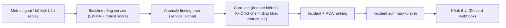

# Jira Ticket Draft — AI MANDATE #15

Source files:

- `docs/mandates/MANDATE-15-aiops-detection-standard.md` (bản gốc mandate, đường dẫn thực tế: `xbrain-phase3/phase3/mandates/`)
- `docs/mandates/15/MANDATE-15-detection-standard-analysis.md`
- `docs/mandates/15/ADR-DETECT-002.md`
- `docs/mandates/AI_MANDATE_EVIDENCE.md` (quy tắc format ticket)

Dùng file này làm nguồn copy trực tiếp vào Jira.

---

## Summary

`AI MANDATE #15`

## Type

Task

## Labels (bắt buộc)

`ai-mandate`, `m15`, `aiops`, `detection`, `reliability`, `tf2`

## Priority

High (mandate đang chạy, hạn 25/07)

## Assignee

TODO — điền tên người đại diện nộp (có thể ghi thêm đồng đội trong Description)

## Due Date

2026-07-25

---

## Description (dán nguyên khối này vào Jira)

### Context

Mandate #15 nâng chuẩn so với Mandate #7: detector không chỉ cần chạy được mà phải **đáng tin** — phân biệt được "bận" (tải cao nhưng healthy) với "hỏng" (sự cố thật), không bị nhiễu che (masking), chạy liên tục trong cụm, tự sinh incident summary, và chứng minh MTTD nhanh hơn trước. Ngày chấm, BTC sẽ bơm bộ kịch bản ẩn gồm 3 ca: sự cố thật / masking / tải-cao-healthy.

### Definition of Done Checklist

- [ ] Link PR/commit đã merge trunk.
- [x] Cửa replay nhận kịch bản từ ngoài — `aiops/replay.py` + `aiops/capture.py`, chạy qua `python -m aiops.cli replay --dataset <path>` / `python -m aiops.cli capture`.
- [ ] Bằng chứng detector chạy liên tục trong cụm (screenshot/log uptime).
- [ ] Bộ sự cố có nhãn **thật** (kèm case masking + case tải-cao-healthy), capture từ Prometheus sống — làm theo `docs/mandates/15/LIVE-CAPTURE-RUNBOOK.md`, commit vào `evaluate/dataset/mandate15_live/`. (`evaluate/dataset/mandate15/` chỉ là fixture giả để test code, không tính là evidence.)
- [ ] MTTD after đo trên dữ liệu thật + MTTD before điền số (`docs/mandates/15/MTTD-before-after.md`).
- [x] `repro` — lệnh chạy lại (xem bên dưới).
- [ ] ADR ký tên (baseline/ngưỡng, cách sinh summary) — nội dung có sẵn ở `ADR-DETECT-002.md`, cần điền tên người ký.
- [ ] (Ngày chấm) Output detector + incident summary cho cả 3 ca của bộ kịch bản ẩn, dán vào comment ticket.

### Kiến trúc / Phân tích

Toàn bộ bảng đối chiếu yêu cầu ↔ bằng chứng ↔ việc còn thiếu: xem `docs/mandates/15/MANDATE-15-detection-standard-analysis.md` (mục 2 – Scorecard, mục 3 – chi tiết từng yêu cầu).

Tóm tắt kiến trúc detection (kế thừa Mandate #7a, không đổi):



### Evidence trước hạn (điền link khi có)

| # | Hạng mục | Evidence |
|---|---|---|
| 1 | PR/commit merged trunk | TODO |
| 2 | Cửa replay/capture | `aiops/replay.py` + `aiops/capture.py` — lệnh: `python -m aiops.cli capture ...` rồi `python -m aiops.cli replay --dataset <path>` |
| 3 | Continuous-run trong cụm | TODO — screenshot `docker compose ps` / K8s Deployment |
| 4 | Bộ sự cố có nhãn commit (dữ liệu THẬT) | TODO — `evaluate/dataset/mandate15_live/` sau khi làm theo `LIVE-CAPTURE-RUNBOOK.md` |
| 5 | MTTD before/after (thật) | TODO — đo bằng `aiops.cli replay --dataset evaluate/dataset/mandate15_live`, điền vào `MTTD-before-after.md` |
| 6 | `repro` | Xem mục "Cách chạy lại" bên dưới |
| 7 | ADR ký tên | `docs/mandates/15/ADR-DETECT-002.md` — nội dung xong, cần chữ ký |

### Cách chạy lại (repro)

```bash
cd tf2-corp-platform/src/aio
conda run -n capstone python -B -m unittest discover -s tests

# Smoke test code (bo demo gia, chi chung minh code khong loi - KHONG phai evidence):
conda run -n capstone python -m aiops.cli replay --dataset evaluate/dataset/mandate15

# Evidence that (sau khi lam theo LIVE-CAPTURE-RUNBOOK.md):
conda run -n capstone python -m aiops.cli replay --dataset evaluate/dataset/mandate15_live --out evaluate/mandate15_live_report.json

docker compose up -d aiops && docker compose ps aiops
```

Dán output thật của lệnh `replay --dataset evaluate/dataset/mandate15_live` (precision/recall/lead-time thật) vào đây làm bằng chứng, thay vì số liệu demo.

### Evidence ngày chấm (điền sau khi BTC bơm bộ ẩn)

| Ca | Kỳ vọng | Output detector (dán ảnh/log) | Đạt? |
|---|---|---|---|
| Sự cố thật | Kêu ≤ 1 chu kỳ + summary + severity đúng | TODO | TODO |
| Masking (nhiễu + sự cố nhẹ) | Vẫn bắt được sự cố nhẹ | TODO | TODO |
| Tải cao nhưng healthy | Không kêu | TODO | TODO |

### Scope Notes

Không thay đổi phạm vi an toàn đã duyệt ở Mandate #7 / ADR-DETECT-001: không auto-remediation production, không mutate `flagd`, không thêm cụm nặng, không tăng tải/độ trễ hệ thống vì việc đo.
