# AI MANDATE #22 - Closed-loop Auto-Mitigation Evidence Draft

Status: **DRAFT - fill after live test**

Owner: TF2 AIOps

Jira ticket: `AI MANDATE #22 - TF2 AIOps closed-loop mitigation`

Evidence date: `2026-07-30 Asia/Bangkok`

Cluster: `arn:aws:eks:us-east-1:493499579600:cluster/techx-tf2-prod`

Namespace: `techx-corp-prod`

## 1. Submission Summary

Mandate #22 asks for one safe closed-loop mitigation path:

```text
detect -> safety check -> act -> verify with real telemetry -> pass or rollback/escalate -> audit log
```

This draft currently contains the screenshots captured so far. The current evidence proves the live environment was prepared, the executor endpoint was reachable, load/fault UI was available, frontend-proxy incidents were detected/notified, and Kubernetes/Grafana showed frontend-proxy scale/telemetry movement during the load-generator flood. It does **not yet** claim final closed-loop pass because the self-heal executor audit rows (`plan`, `execute`, `verification_sample`, `verification_passed`, `rollback`) have not been captured.

Final result: `DRAFT / PARTIAL EVIDENCE ONLY`

Observed scenario: `local-loadGeneratorFloodHomepage` against `frontend-proxy` with Locust load.

Observed detector path: `frontend-proxy` latency/resource anomalies and notification screenshots.

Observed K8s behavior: `frontend` / `frontend-proxy` replica movement is visible in K8s and Grafana screenshots, but this is not claimed as AIOps closed-loop action until executor audit proves it.

Expected AIOps action for final test: `scale_frontend_proxy`.

Rollback branch: `NOT CAPTURED YET`.

## 2. Scope Locked For Test

| Field | Value |
| --- | --- |
| Runtime | `aiops-runtime` |
| Live executor | `aiops-live-executor` |
| Executor apply mode | `AIOPS_LIVE_EXECUTOR_ALLOW_LIVE_APPLY=true` |
| Policy mode | `live-approved` |
| Safety policy | `phase3-scale-policy-v1` |
| Approval / ADR | `adr-live-001` configured for the local Mandate 22 run; Jira/ADR link still to attach |
| Local runtime URL | `http://127.0.0.1:8540` |
| Local executor URL | `http://127.0.0.1:18081` |
| Prometheus via port-forward | `http://127.0.0.1:9090` |
| Kubernetes proxy via port-forward | `http://127.0.0.1:8001` |
| Locust UI | `http://internal-k8s-techxcor-frontend-ae4ef3a99c-646743387.us-east-1.elb.amazonaws.com/loadgen/` |
| Feature flag UI | `http://internal-k8s-techxcor-frontend-ae4ef3a99c-646743387.us-east-1.elb.amazonaws.com/feature` |

Preflight observed before final live test:

| Check | Observed |
| --- | --- |
| Current context | `arn:aws:eks:us-east-1:493499579600:cluster/techx-tf2-prod` |
| `aiops-runtime` deployment | `1/1` ready |
| `aiops-live-executor` deployment | `1/1` ready |
| Executor token secret | `aiops-live-executor-token`, `DATA=2` |
| Live apply gate | `AIOPS_LIVE_EXECUTOR_ALLOW_LIVE_APPLY=true` |

## 3. Definition Of Done Mapping

| Mandate #22 DoD | Current status | Evidence currently linked |
| --- | --- | --- |
| Detect one concrete live incident type | `PARTIAL / SAVED` | Runtime anomaly/RCA screenshots, frontend-proxy notification, Grafana telemetry. |
| Safety check before action | `NOT CAPTURED` | Need executor `plan` / policy / blast-radius audit row. |
| AIOps acts without a human mitigation click | `NOT CAPTURED` | K8s/HPA movement is saved, but executor `execute` audit is still missing. |
| Verify after action using telemetry | `PARTIAL / SAVED` | Grafana telemetry is saved; verifier audit event is still missing. |
| Rollback or escalate when verify fails | `NOT CAPTURED` | Needs forced verify-fail or rollback/escalation evidence. |
| Audit log reconstructs the loop | `NOT CAPTURED` | Current diagnostic query showed no self-heal audit rows for earlier runs. |
| Repro is documented | `DRAFTED` | Port-forward/runtime/test commands in section 10. |
| MTTR before/after is included | `NOT CAPTURED` | Final successful-run timestamps are not visible in the supplied screenshots. |

## 4. Evidence Checklist

Save screenshots under:

```text
src/aio/docs/mandates/22/evidence/
```

| # | Evidence | File(s) | Status |
| --- | --- | --- | --- |
| 1 | Preflight deploy/context/token/live gate | `01-preflight-deploy-ready.png` | `SAVED` |
| 2 | `.\scripts\port_forward.ps1` running and forwarding executor `18081:8080` | `02-port-forward-ready.png` | `SAVED` |
| 3 | Executor health/ready checks | `03-executor-health-ready.png` | `SAVED` |
| 4 | Baseline flags all off before fault | `04-baseline-flags-off.png` | `SAVED` |
| 5 | Locust/load generator visible | `05-loadgen-running.png`, `08-loadgen-flood-running.png`, `19-preflag-locust-100-users.png` | `SAVED` |
| 6 | Flood flag enabled/disabled | `07-flag-load-generator-flood-on.png`, `13-flag-flood-off-cleanup.png` | `SAVED` |
| 7 | Runtime detector/RCA logs | `06-runtime-baseline-after-reset.png`, `15-rerun-runtime-anomaly-rca.png`, `20-preflag-runtime-noisy-baseline.png` | `SAVED / detector only` |
| 8 | Notification for detected incident | `09-notification-frontend-proxy-incident.png` | `SAVED` |
| 9 | K8s target before/after scale movement | `10-k8s-deploy-hpa-flood-snapshot.png`, `12-k8s-after-scale-frontend-proxy.png` | `SAVED / not executor proof` |
| 10 | Grafana telemetry / ready pods | `11-grafana-frontend-flood-telemetry.png`, `18-preflag-grafana-noisy-baseline.png`, `21-grafana-frontend-proxy-ready-pods.png`, `22-grafana-frontend-proxy-service-observability.png` | `SAVED` |
| 11 | Runtime remediation decision / safety policy | `24-remediation-dry-run-recorded.png` | `SAVED / dry-run decision only` |
| 12 | Self-heal wait gate / recurrence threshold | `23-self-heal-wait-threshold-not-met.png` | `SAVED / wait gate only` |
| 13 | Forced verify failure / rollback | `Not captured` | `NOT CAPTURED` |

## 4.1 Evidence Index

Use this table as the file index. Screenshots are previewed once in the relevant test sections below, rather than collected into one large gallery.

| # | Evidence | File |
| --- | --- | --- |
| 1 | Preflight deploy/context/token/live gate | [`01-preflight-deploy-ready.png`](./evidence/01-preflight-deploy-ready.png) |
| 2 | Port-forward ready with executor on `18081` | [`02-port-forward-ready.png`](./evidence/02-port-forward-ready.png) |
| 3 | Executor health/ready checks | [`03-executor-health-ready.png`](./evidence/03-executor-health-ready.png) |
| 4 | Baseline flags off | [`04-baseline-flags-off.png`](./evidence/04-baseline-flags-off.png) |
| 5 | Locust running | [`05-loadgen-running.png`](./evidence/05-loadgen-running.png) |
| 6 | Runtime baseline after reset | [`06-runtime-baseline-after-reset.png`](./evidence/06-runtime-baseline-after-reset.png) |
| 7 | Flood flag enabled | [`07-flag-load-generator-flood-on.png`](./evidence/07-flag-load-generator-flood-on.png) |
| 8 | Flood load running | [`08-loadgen-flood-running.png`](./evidence/08-loadgen-flood-running.png) |
| 9 | Notification for frontend-proxy incident | [`09-notification-frontend-proxy-incident.png`](./evidence/09-notification-frontend-proxy-incident.png) |
| 10 | K8s deploy/HPA flood snapshot | [`10-k8s-deploy-hpa-flood-snapshot.png`](./evidence/10-k8s-deploy-hpa-flood-snapshot.png) |
| 11 | Grafana frontend flood telemetry | [`11-grafana-frontend-flood-telemetry.png`](./evidence/11-grafana-frontend-flood-telemetry.png) |
| 12 | K8s after scale snapshot | [`12-k8s-after-scale-frontend-proxy.png`](./evidence/12-k8s-after-scale-frontend-proxy.png) |
| 13 | Flood flag off cleanup | [`13-flag-flood-off-cleanup.png`](./evidence/13-flag-flood-off-cleanup.png) |
| 14 | Locust reduced cleanup | [`14-loadgen-reduced-cleanup.png`](./evidence/14-loadgen-reduced-cleanup.png) |
| 15 | Rerun runtime anomaly/RCA | [`15-rerun-runtime-anomaly-rca.png`](./evidence/15-rerun-runtime-anomaly-rca.png) |
| 18 | Pre-flag noisy Grafana baseline | [`18-preflag-grafana-noisy-baseline.png`](./evidence/18-preflag-grafana-noisy-baseline.png) |
| 19 | Pre-flag Locust 100 users | [`19-preflag-locust-100-users.png`](./evidence/19-preflag-locust-100-users.png) |
| 20 | Pre-flag noisy runtime baseline | [`20-preflag-runtime-noisy-baseline.png`](./evidence/20-preflag-runtime-noisy-baseline.png) |
| 21 | Grafana frontend-proxy ready pods | [`21-grafana-frontend-proxy-ready-pods.png`](./evidence/21-grafana-frontend-proxy-ready-pods.png) |
| 22 | Grafana frontend-proxy service observability | [`22-grafana-frontend-proxy-service-observability.png`](./evidence/22-grafana-frontend-proxy-service-observability.png) |
| 23 | Self-heal wait threshold not met | [`23-self-heal-wait-threshold-not-met.png`](./evidence/23-self-heal-wait-threshold-not-met.png) |
| 24 | Remediation decision dry-run recorded | [`24-remediation-dry-run-recorded.png`](./evidence/24-remediation-dry-run-recorded.png) |


## 5. Test Timeline

Use absolute timestamps in Asia/Bangkok. This table only references screenshots already captured; final self-heal timestamps still need a successful executor-audited run.

| Step | Timestamp | Evidence | Notes |
| --- | --- | --- | --- |
| Preflight ready | `2026-07-30` | `01`, `02`, `03` | Cluster context, deployments ready, executor `healthz/readyz`, port-forward ready. |
| Baseline / flags off | `2026-07-30` | `04`, `05`, `18`, `19`, `20` | Baseline was noisy in later reruns because Locust/load was still active. |
| Flood flag enabled | `2026-07-30` | `07`, `08` | `local-loadGeneratorFloodHomepage=on`. |
| Detector / notification observed | `2026-07-30` | `09`, `15`, `20` | Frontend-proxy incident/RCA/notification captured. |
| K8s/Grafana scale movement observed | `2026-07-30` | `10`, `11`, `12`, `21`, `22` | Replica/ready-pod movement visible, but not claimed as AIOps executor action without audit. |
| Cleanup | `2026-07-30` | `13`, `14` | Flood flag off and load reduced. |
| Runtime wait / dry-run decision | `2026-07-30` | `23`, `24` | Self-heal gate and remediation decision captured; execution and verification still require executor audit rows. |
| Rollback branch | `Not captured` | `Not captured` | Requires forced verify-fail / rollback evidence from a future run. |

### 5.1 Preflight And Connectivity

Cluster deployments, live-apply gate, executor health, and the complete local port-forward set were available before fault injection.

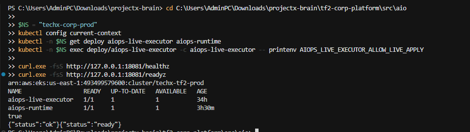

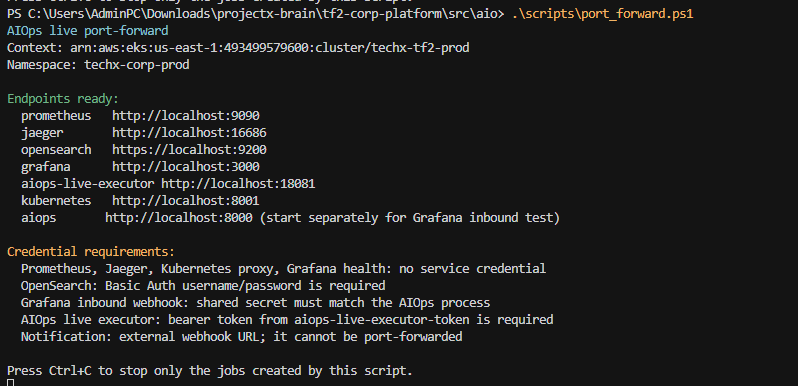

Additional executor health capture: [`03-executor-health-ready.png`](./evidence/03-executor-health-ready.png).

### 5.2 Baseline And Load

The feature flags were off while Locust supplied the baseline workload.

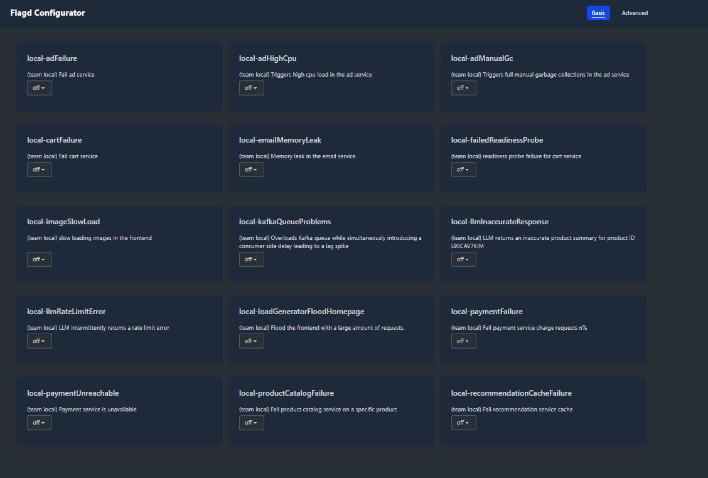

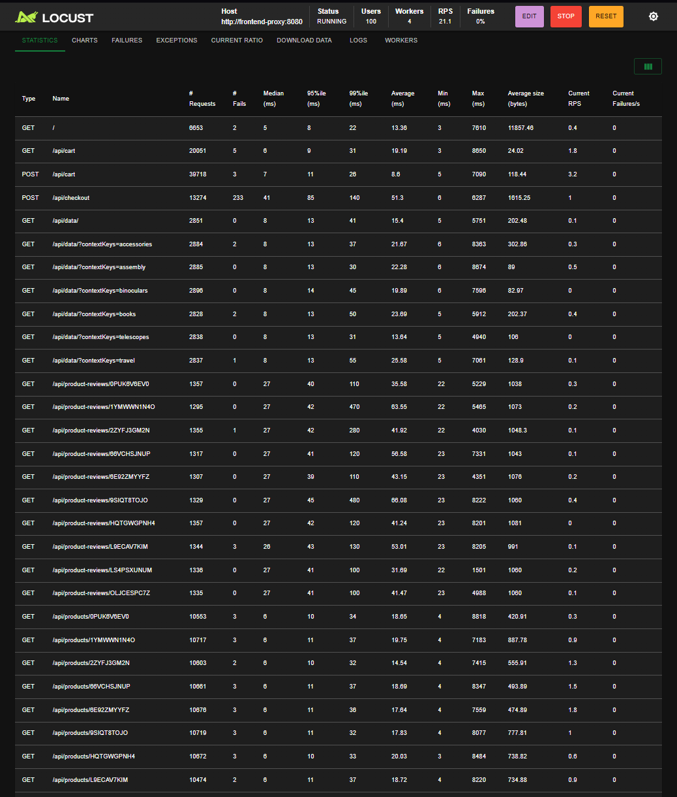

Supporting rerun captures: [`18-preflag-grafana-noisy-baseline.png`](./evidence/18-preflag-grafana-noisy-baseline.png), [`19-preflag-locust-100-users.png`](./evidence/19-preflag-locust-100-users.png), and [`20-preflag-runtime-noisy-baseline.png`](./evidence/20-preflag-runtime-noisy-baseline.png).

### 5.3 Fault Injection

`local-loadGeneratorFloodHomepage` was enabled while Locust continued to drive traffic.

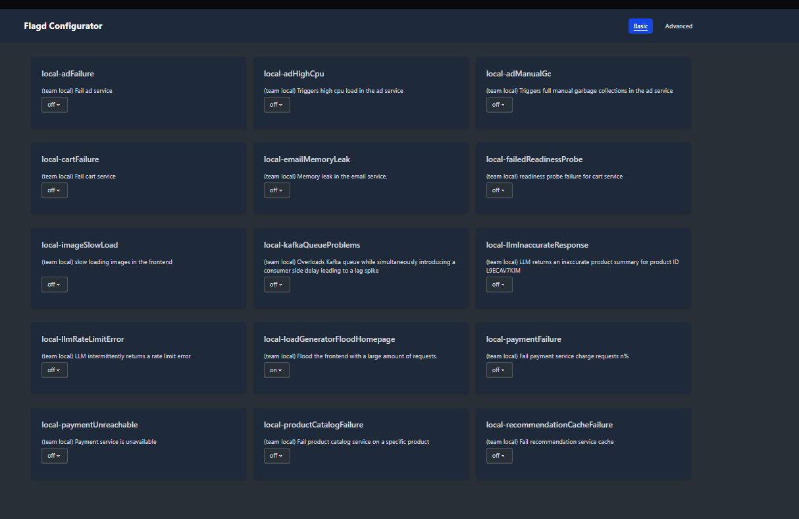

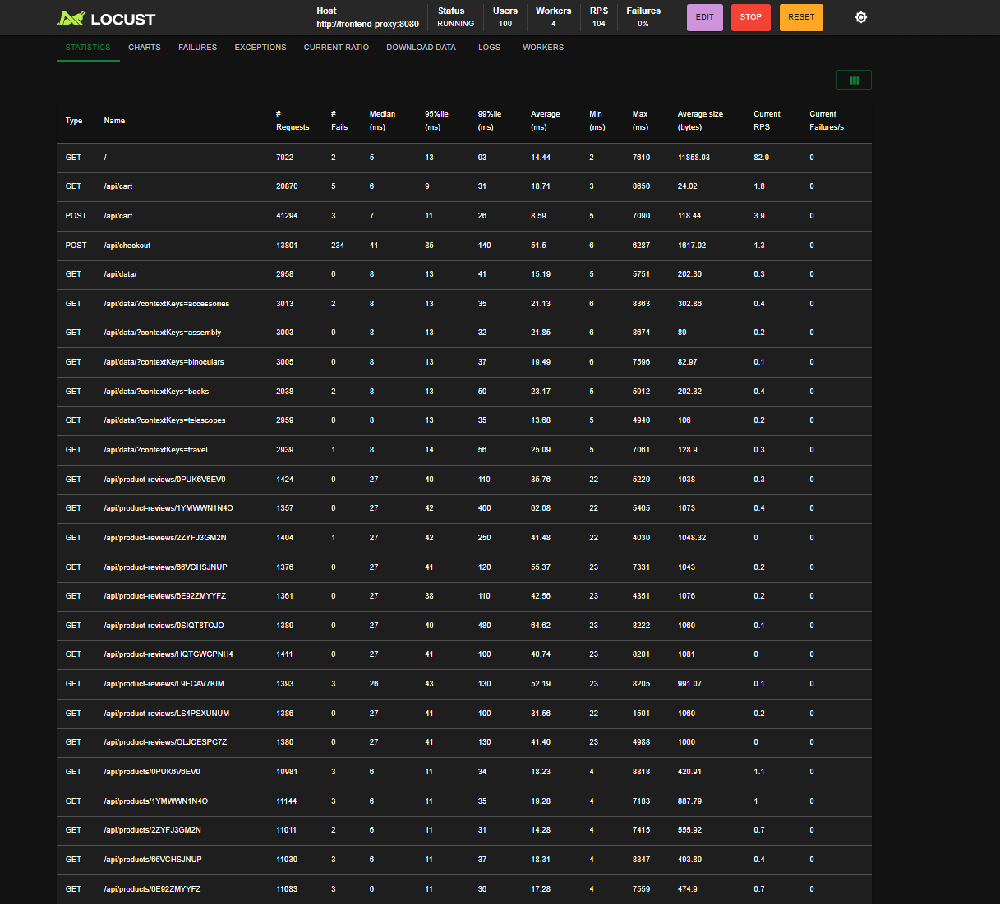


### 5.4 Detection And Notification

The runtime produced anomaly/RCA output and emitted the frontend-proxy incident notification. The follow-up remediation captures show the self-heal gate holding until recurrence is high enough, then recording the allowed action as a dry-run decision.

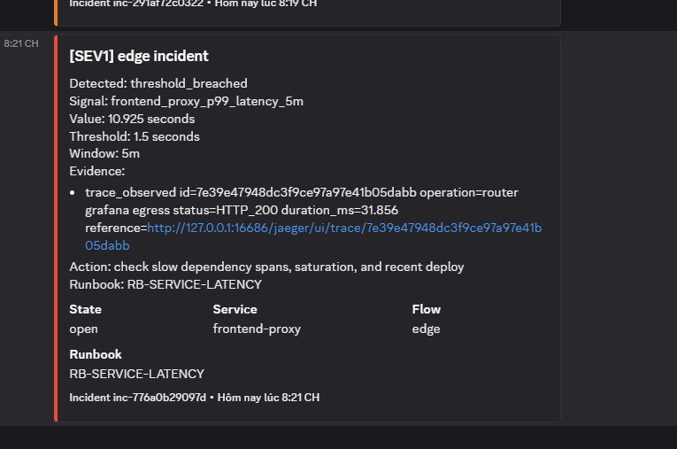

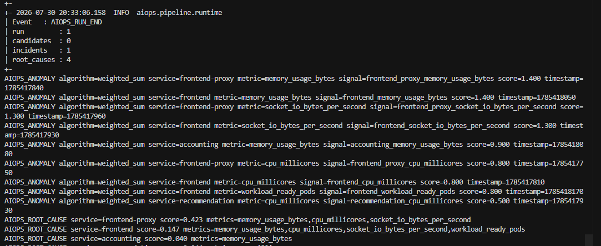

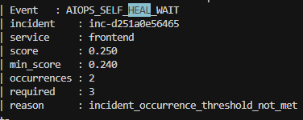

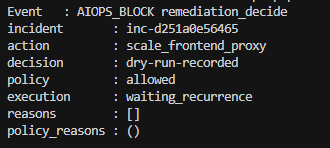

Baseline runtime capture after reset: [`06-runtime-baseline-after-reset.png`](./evidence/06-runtime-baseline-after-reset.png).

### 5.5 Cleanup

The fault flag was turned off and load was reduced after the observation window.

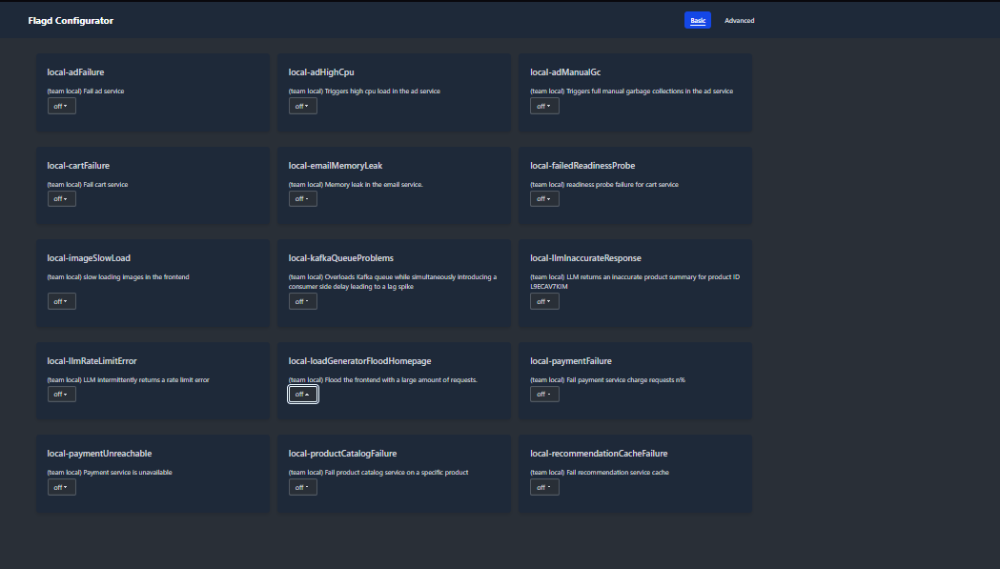

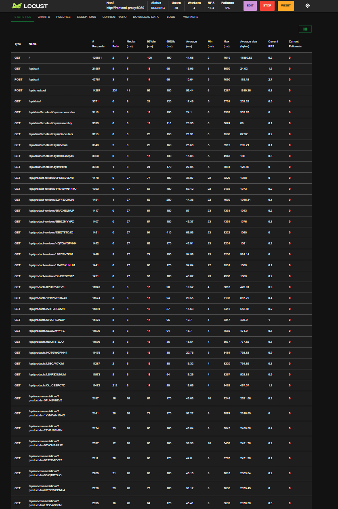

## 6. Closed-loop Success Path

Current captured evidence is **not yet a complete closed-loop pass**. Use this section as the fill area for the next successful run.

### 6.1 Captured Signals So Far

| Area | Current evidence | Status |
| --- | --- | --- |
| Preflight / executor readiness | `01`, `02`, `03` | `SAVED` |
| Fault/load setup | `07`, `08`, `19` | `SAVED` |
| Detection / notification | `09`, `15`, `20` | `SAVED` |
| Self-heal recurrence gate | `23` | `SAVED / threshold not met` |
| Runtime remediation decision | `24` | `SAVED / dry-run-recorded` |
| Grafana/K8s movement | `10`, `11`, `12`, `21`, `22` | `SAVED` |
| Executor `plan` audit | `Not visible in supplied screenshots` | `NOT CAPTURED` |
| Executor `execute` audit | `Not visible in supplied screenshots` | `NOT CAPTURED` |
| Verification audit | `Not visible in supplied screenshots` | `NOT CAPTURED` |
| Rollback audit | `Not visible in supplied screenshots` | `NOT CAPTURED` |

### 6.2 Kubernetes Movement

These screenshots show replica/HPA movement during the test window. They are supporting infrastructure evidence only; without executor audit rows, they are not proof that AIOps initiated the scale action.

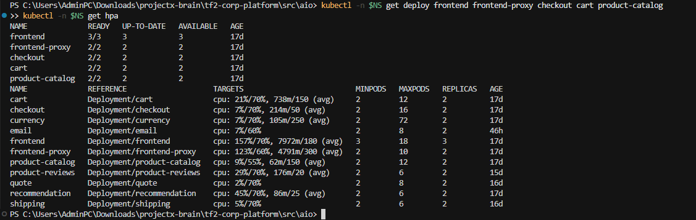

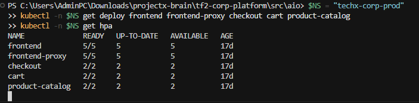

### 6.3 Telemetry Verification

Grafana shows the frontend/frontend-proxy resource, latency, and ready-pod changes across the same observation window. Verifier audit events are still required for a final closed-loop pass.

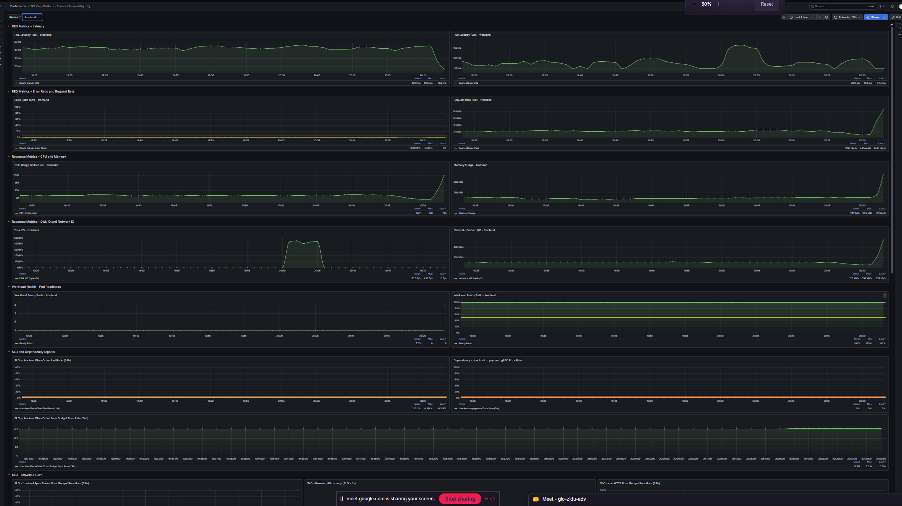

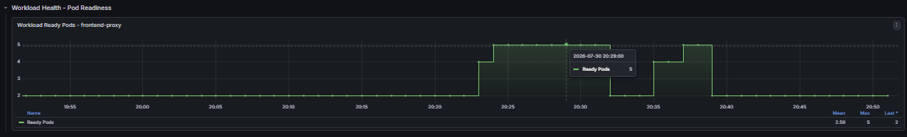

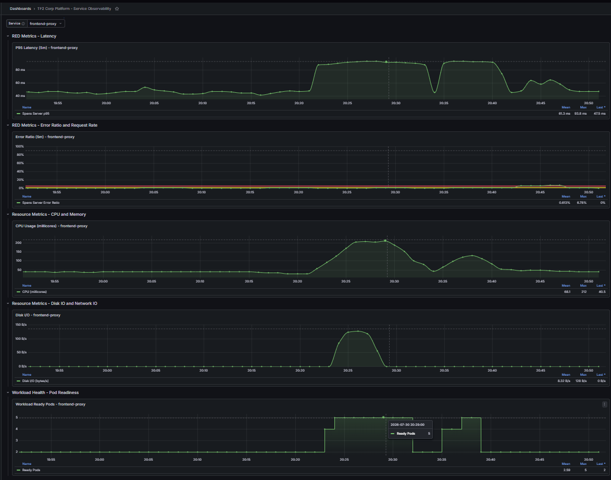

### 6.4 Final Run Fields To Fill

| Field | Value |
| --- | --- |
| Fault flag | `local-loadGeneratorFloodHomepage` |
| Load level | `100 users / 4 workers` |
| Incident id | `inc-976dc58ce2b2` shown in the notification; `inc-d251a0e56465` shown in the self-heal/remediation captures |
| Service | `frontend` in the wait-gate capture; target workload remains `frontend-proxy` for the remediation action |
| Detector id | `rca_root_cause`; signal/metric `socket_io_bytes_per_second` |
| Self-heal event | `AIOPS_SELF_HEAL_WAIT` |
| Self-heal score / minimum | `0.250` observed vs `0.240` minimum |
| Self-heal occurrences / required | `2` observed vs `3` required |
| Wait reason | `incident_occurrence_threshold_not_met` |
| Remediation event | `AIOPS_BLOCK remediation_decide` |
| Executor action | `scale_frontend_proxy` selected by policy; execution is not shown |
| Decision | `dry-run-recorded` |
| Policy result | `allowed` |
| Execution state | `waiting_recurrence` |
| Before replicas | `2` |
| After replicas | `5` during the captured load/HPA movement |
| Executor request / execution id | No execution id is visible in the supplied screenshots |
| Verification result | No verification result is visible in the supplied screenshots |

### 6.5 Safety Check

| Safety gate | Result | Evidence |
| --- | --- | --- |
| Recurrence gate | `waiting_recurrence`; `2` occurrences observed and `3` required | `23-self-heal-wait-threshold-not-met.png` |
| Dry-run/plan exists before apply | Runtime shows `decision=dry-run-recorded` | `24-remediation-dry-run-recorded.png`; accepted executor plan is not visible. |
| Action in allow-list | Runtime shows `policy=allowed` | `24-remediation-dry-run-recorded.png`; executor catalog/plan payload is not visible. |
| Blast radius within policy | Not visible | Requires the executor plan payload. |
| Cooldown allows action | Not visible | Requires the executor plan/execute response. |
| Protected services untouched | Kubernetes target snapshot captured | The protected-target decision is not visible in the supplied screenshots. |
## 7. Rollback / Verify-Fail Branch

Purpose: prove a bad action or failed verification does not leave production in the wrong state.

| Field | Value |
| --- | --- |
| Forced failure method | Not shown in supplied screenshots |
| Trigger incident id | Not shown in supplied screenshots |
| Initial action | Not shown in supplied screenshots |
| Verify failure reason | Not shown in supplied screenshots |
| Rollback or escalation event | Not shown in supplied screenshots |
| Final target state | `2 replicas` after load cleanup |

Expected proof:

```text
trigger -> action_attempted -> verification_failed -> rollback_started/escalated -> rollback_verified/final_state_recorded
```

No rollback claim is made from the current evidence. Attach audit rows and a screenshot showing rollback/escalation after the dedicated verify-fail run.

## 8. MTTR Before / After

Before baseline is the manual operator path for this incident class.

| Mode | Start | End | MTTR | Notes |
| --- | --- | --- | ---: | --- |
| Manual before baseline | Not shown | Not shown | `N/A` | No measured manual run is visible in the supplied screenshots. |
| AIOps closed-loop success path | Not shown | Not shown | `N/A` | A completed verification timestamp is not visible in the supplied screenshots. |
| AIOps rollback branch | Not shown | Not shown | `N/A` | A rollback completion timestamp is not visible in the supplied screenshots. |

MTTR reduction:

```text
TODO — compute only after a completed run has real Start/End timestamps
in self_heal_audit_events (trigger -> verification_passed) and, separately,
a real manual-path timestamp for the same incident class.
Formula: reduction % = (manual_MTTR - aiops_MTTR) / manual_MTTR * 100
Do not estimate or fabricate this number; leave as TODO until measured.
```

## 9. Audit Evidence

Audit storage paths for the test:

```text
state/m22/aiops.sqlite3
state/m22/remediation_audit.jsonl
state/m22/rca_history.jsonl
```

Required audit fields:

| Field | Present | Notes |
| --- | --- | --- |
| Incident id / trigger | `Yes` | Incident ids are visible in the notification and remediation screenshots. |
| Detector id / signal | `Yes` | `rca_root_cause` and `socket_io_bytes_per_second` are visible. |
| Candidate action | `Yes` | Runtime selected `scale_frontend_proxy` in `24-remediation-dry-run-recorded.png`. |
| Safety decision | `Yes` | Runtime shows `policy=allowed`, `decision=dry-run-recorded`, and `execution=waiting_recurrence`; self-heal wait shows occurrence threshold not met. |
| Executor request/result | `No` | No executor result or execution id is visible in the supplied screenshots. |
| Verification result | `No` | No verification result is visible. |
| Rollback/escalation result | `No` | No rollback or escalation result is visible. |
| Timestamp sequence | `Incomplete` | Detection/remediation timestamps are visible; execute-to-verification and rollback completion are not. |

Paste current audit/runtime excerpt here:

```text
Event       : AIOPS_SELF_HEAL_WAIT
incident    : inc-d251a0e56465
service     : frontend
score       : 0.250
min_score   : 0.240
occurrences : 2
required    : 3
reason      : incident_occurrence_threshold_not_met

Event          : AIOPS_BLOCK remediation_decide
incident       : inc-d251a0e56465
action         : scale_frontend_proxy
decision       : dry-run-recorded
policy         : allowed
execution      : waiting_recurrence
reasons        : []
policy_reasons : ()
```

Current interpretation: the runtime reached remediation decisioning for `scale_frontend_proxy`, passed the allow-list policy check, and intentionally held execution because the recurrence gate had not reached the required threshold. No completed executor audit sequence is visible in the supplied screenshots.


## 10. Repro Commands

### 10.1 Port-forward

Run from:

```powershell
cd C:\Users\AdminPC\Downloads\projectx-brain\tf2-corp-platform\src\aio
.\scripts\port_forward.ps1
```

Expected includes:

```text
prometheus             http://127.0.0.1:9090
jaeger                 http://127.0.0.1:16686
opensearch             http://127.0.0.1:9200
grafana                http://127.0.0.1:3000
kubernetes-api-proxy   http://127.0.0.1:8001
aiops-live-executor    http://127.0.0.1:18081
```

### 10.2 Preflight

```powershell
$NS = "techx-corp-prod"
kubectl config current-context
kubectl -n $NS get deploy aiops-live-executor aiops-runtime
kubectl -n $NS get secret aiops-live-executor-token
kubectl -n $NS exec deploy/aiops-live-executor -c aiops-live-executor -- printenv AIOPS_LIVE_EXECUTOR_ALLOW_LIVE_APPLY
curl.exe -fsS http://127.0.0.1:18081/healthz
curl.exe -fsS http://127.0.0.1:18081/readyz
```

### 10.3 Local runtime for evidence run

Do not paste token values into Jira.

The local `.env` is prepared for Mandate 22:

```text
AIOPS_POLICY_MODE=live-approved
AIOPS_SELF_HEAL_ENABLED=true
AIOPS_LIVE_EXECUTOR_URL=http://127.0.0.1:18081
AIOPS_LIVE_EXECUTOR_ACCOUNT=aiops-runtime
AIOPS_SELF_HEAL_APPROVAL_ID=adr-live-001
AIOPS_PROMETHEUS_BASE_URL=http://127.0.0.1:9090
AIOPS_KUBERNETES_API_URL=http://127.0.0.1:8001
AIOPS_AUTO_RUN_ENABLED=true
AIOPS_AUTO_RUN_INTERVAL_SECONDS=15
AIOPS_STATE_STORE_PATH=state/m22/aiops.sqlite3
AIOPS_REMEDIATION_AUDIT_PATH=state/m22/remediation_audit.jsonl
AIOPS_RCA_HISTORY_PATH=state/m22/rca_history.jsonl
```

Load the live executor token into the current terminal session only:

```powershell
cd C:\Users\AdminPC\Downloads\projectx-brain\tf2-corp-platform\src\aio

$NS = "techx-corp-prod"
$env:AIOPS_LIVE_EXECUTOR_TOKEN = kubectl -n $NS get secret aiops-live-executor-token -o jsonpath="{.data.token}" | ForEach-Object {
  [Text.Encoding]::UTF8.GetString([Convert]::FromBase64String($_))
}

.\.venv\Scripts\python.exe -m uvicorn aiops.api.app:create_app --factory --host 127.0.0.1 --port 8540
```

### 10.4 Audit query

```powershell
cd C:\Users\AdminPC\Downloads\projectx-brain\tf2-corp-platform\src\aio
.\.venv\Scripts\python.exe -c "import sqlite3; con=sqlite3.connect('state/m22/aiops.sqlite3'); [print(r) for r in con.execute('select event_id,incident_id,event_type,execution_id,created_at from self_heal_audit_events order by created_at,event_id')]"
```

### 10.5 Useful live checks

```powershell
$NS = "techx-corp-prod"
kubectl -n $NS get deploy
kubectl -n $NS get hpa
kubectl -n $NS get pods -o wide
curl.exe -fsS http://127.0.0.1:8540/health/ready
```

## 11. Jira Paste Block

```text
AI MANDATE #22 - TF2 AIOps closed-loop mitigation

Status: DRAFT / PARTIAL EVIDENCE ONLY

Summary
- Captured preflight proof: cluster context, aiops-runtime and aiops-live-executor ready, executor live apply gate true.
- Captured port-forward proof including local executor endpoint on 18081.
- Captured Locust, feature flag UI, frontend-proxy detection/notification, Grafana telemetry, and K8s/HPA replica movement.
- Current runtime captures show self-heal wait and dry-run remediation decisioning for `scale_frontend_proxy`, including `policy=allowed` and `execution=waiting_recurrence`.

Chosen scenario under test
- Fault: local-loadGeneratorFloodHomepage
- Service: frontend-proxy
- Expected action: scale_frontend_proxy
- Verification metric: Not captured in supplied screenshots; requires final executor-audited run
- Rollback method: Not captured in supplied screenshots; requires verify-fail or rollback branch

MTTR
- Before/manual: Not measured in supplied screenshots
- After/AIOps: Not measured in supplied screenshots
- Reduction: Not calculable from supplied screenshots

Evidence screenshots currently linked
- 01-preflight-deploy-ready.png
- 02-port-forward-ready.png
- 03-executor-health-ready.png
- 04-baseline-flags-off.png
- 05-loadgen-running.png
- 06-runtime-baseline-after-reset.png
- 07-flag-load-generator-flood-on.png
- 08-loadgen-flood-running.png
- 09-notification-frontend-proxy-incident.png
- 10-k8s-deploy-hpa-flood-snapshot.png
- 11-grafana-frontend-flood-telemetry.png
- 12-k8s-after-scale-frontend-proxy.png
- 13-flag-flood-off-cleanup.png
- 14-loadgen-reduced-cleanup.png
- 15-rerun-runtime-anomaly-rca.png
- 18-preflag-grafana-noisy-baseline.png
- 19-preflag-locust-100-users.png
- 20-preflag-runtime-noisy-baseline.png
- 21-grafana-frontend-proxy-ready-pods.png
- 22-grafana-frontend-proxy-service-observability.png
- 23-self-heal-wait-threshold-not-met.png
- 24-remediation-dry-run-recorded.png

Remaining evidence needed for final PASS
- self_heal_audit_events rows for plan, execute, verification_sample, verification_passed.
- Forced verify-fail or rollback/escalation branch.
- Final MTTR before/after numbers.
- PR/commit link and final ADR/approval link.

Caveats / notes
- Token values are not pasted into Jira.
- K8s native HPA/restart alone is not claimed as closed-loop.
- Current screenshots are useful supporting evidence but final pass requires TF2 AIOps runtime/executor audit proof.
```
## 12. Mandate Deliverables Mapping (Direct From Directive #22)

This section maps 1:1 to the "Phải nộp (artifact)" / "Deliverables" list in
`MANDATE-22-closed-loop-mitigation.md`, so nothing on that list gets lost
inside the DoD/evidence sections above.

| Mandate deliverable | Status | Placeholder / Link |
| --- | --- | --- |
| PR / commit link | `NOT ADDED` | `TODO: <link>` |
| Replay entry accepting external scenarios ("cửa replay nhận kịch bản từ ngoài") | `NOT REFERENCED ANYWHERE IN CURRENT EVIDENCE` | `TODO: confirm whether this endpoint exists yet; if not built, this blocks grading day since BTC injects hidden scenarios through it. Link/path: <TBD>` |
| Audit log (own team's) | `PARTIAL` — see Section 9 | Link: `state/m22/aiops.sqlite3`, `state/m22/remediation_audit.jsonl` |
| MTTR before/after (own numbers) | `NOT CAPTURED` — see Section 8 | See Section 8 TODO block |
| `repro` | `DRAFTED` — see Section 10 | Needs one clean re-run per Section 12 |
| Signed ADR | `NOT SIGNED` — `adr-live-001` is only a configured approval id, not a signed/linked document | `TODO: <signed ADR link>` |

Grading-day requirement (separate from above, for awareness — not something
to fill now): BTC injects a hidden real incident **and** a forced-wrong-action
case on grading day itself; the team must capture auto-mitigate + verify +
rollback live at that time. Nothing to pre-fill here.

## 13. Final Fill Checklist

Before marking Jira ready:

- Capture executor audit rows for `plan`, `execute`, `verification_sample`, and `verification_passed`.
- Capture forced verify-fail / rollback or escalation evidence.
- Fill final incident id, action id, execution id, timestamps, and MTTR numbers.
- Add PR/commit link.
- Add ADR/approval id.
- Keep diagnostic screenshots separate from pass evidence.
- Re-run repro once from a clean terminal and note any deviation.


