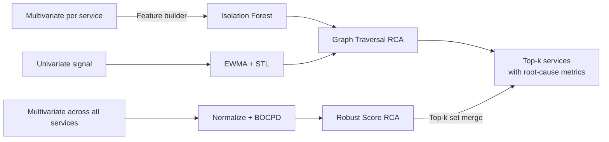
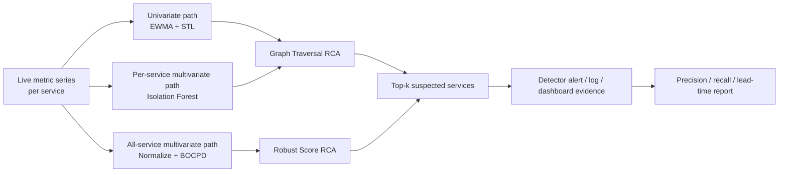

# Jira Ticket Drafts - AI MANDATE #7 Detection

Source files:

- `docs/mandates/MANDATE-07-aiops-detection.md`
- `docs/mandates/7a/MANDATE-07a-detection-analysis.md`
- `docs/mandates/7a/ADR-DETECT-001.md`
- `docs/pipelines/v0.0.1.md`

---

## Ticket 1

### Summary

AI MANDATE #7a - Detection: implement detector + baseline analysis

### Type

Task

### Labels

`ai-mandate`, `m7`, `aiops`, `detection`, `baseline`, `tf2`

### Due Date

2026-07-18

### Description

## Context

Mandate #7 requires AIOps to build automated "eyes" for the platform: incidents should surface through detector output instead of waiting for a human to watch Grafana or for users to complain. Stage #7a is the implementation-and-analysis stage. It does not require a live production run yet; that evidence belongs to #7b.

This ticket documents the first baseline anomaly detection approach for TF2 AIOps. The implementation is intentionally lightweight and repository-reviewable: it reuses the current Python AIOps runtime, reads telemetry-shaped metric series, computes baseline/deviation signals, and passes evidence into the existing incident/RCA path.

## Implementation Evidence

Current implementation evidence exists in `src/aio`:

- `aiops/anomaly/v001.py` implements the v0.0.1 anomaly engine, including EWMA/STL-style residual detection, service-level robust scoring, and BARO BOCPD integration.
- `aiops/anomaly/stats.py` provides statistical helpers: mean, standard deviation, median, IQR, and robust score.
- `aiops/detectors/threshold.py` provides SLO-style threshold detection.
- `aiops/detectors/dependency.py` detects dependency signal breaches and attaches likely dependency evidence.
- `aiops/detectors/no_data.py` detects missing, stale, or invalid required signals.
- `aiops/pipeline/runtime.py` wires the runtime flow: collect -> qualify -> normalize -> feature build -> detect -> correlate -> enrich -> incident -> notify -> policy -> verify -> RCA/remediation.
- `aiops/rca/engine.py` combines topology and metric evidence into ranked root-cause candidates.
- `config/runtime.json` owns topology, signal definitions, detector definitions, thresholds, policy, and RCA enablement.

## Detection / RCA Architecture

The detector architecture follows `docs/pipelines/v0.0.1.md`: run lightweight anomaly detection on univariate and multivariate metric shapes, then feed anomaly evidence into RCA ranking.



For #7a, this architecture is used as implementation evidence and analysis scope. The minimum required floor is univariate detection per service/signal; multivariate correlation and BOCPD improve confidence but are not required as the only detection path.

## Metrics Analysis

The #7a analysis covers three important metrics across three signal types: latency, error rate, and saturation. These metrics were selected because they cover user-visible symptoms and early-warning resource pressure on the checkout path.

| Metric | Service | Signal Type | Why It Matters | Baseline | Anomaly Rule | Method |
|---|---|---|---|---|---|---|
| p95 latency | `checkout` | Latency | Checkout is the revenue path and naturally aggregates dependency slowness. | Normal load p95 around 62-87 ms; idle around 4.5-5 ms. | Warning above 200 ms for 3 cycles; critical above 500 ms for 2 cycles; statistical anomaly when EWMA residual z-score >= 3.0. | EWMA + STL-style residual scoring, backed by hard threshold. |
| HTTP 5xx error rate | `cart` | Error rate | Cart is required before checkout; its SLO is 99.5%, so the error budget is only 0.5%. | Normal baseline around 0.0% 5xx under current load. | Warning above 0.5% for 2 cycles; critical above 2.0% for 2 cycles; robust score >= 4.0 vs recent baseline. | Median/IQR robust score plus SLO threshold. |
| CPU usage | `product-catalog` | Saturation | Product catalog is a critical shared read path; saturation can precede latency and error symptoms. | Normal usage around 2-4 millicores per pod; total around 6 millicores for 2 pods. | Warning above 20 millicores for 3 cycles; critical above 50 millicores for 2 cycles; EWMA z-score >= 3.0. | EWMA z-score, with BARO BOCPD as bonus correlation signal. |

Full analysis is available in:

- `docs/mandates/7a/MANDATE-07a-detection-analysis.md`

## ADR

Architecture decision record:

- `docs/mandates/7a/ADR-DETECT-001.md`

The ADR selects the in-repository Python detector as the Mandate #7a architecture. The detector is observe-only, evaluation-first, and does not approve production auto-remediation. Production readiness, live alerting, and mutation boundaries remain separate future decisions.

## Evidence To Attach In Jira

- PR/commit link: `TBD`
- Analysis doc: `docs/mandates/7a/MANDATE-07a-detection-analysis.md`
- ADR: `docs/mandates/7a/ADR-DETECT-001.md`
- Optional local verification command, when dependencies are available:

```bash
cd tf2-corp-platform/src/aio
conda run -n capstone python -B -m unittest discover -s tests
```

## Scope Notes

This ticket is for #7a only. It proves implementation plus analysis. It does not need a live e2e screenshot, precision/recall numbers, or lead-time numbers. Those belong to #7b.

The detector must remain lightweight. This ticket does not approve Kubernetes mutation, production auto-remediation, disabling `flagd`, or creating a new heavy telemetry/ML cluster.

---

## Ticket 2

### Summary

AI MANDATE #7b - Detection: live e2e run, alert evidence, and measurement

### Type

Task

### Labels

`ai-mandate`, `m7`, `aiops`, `detection`, `e2e`, `measurement`, `tf2`

### Due Date

2026-07-25

### Description

## Context

Mandate #7b is the live-evidence stage for AIOps detection. After #7a proves the detector implementation and analysis, #7b must show that the detection path actually fires when an incident is injected or replayed through an approved labeled scenario.

The goal is to demonstrate that incidents surface automatically through alert/log/dashboard evidence and to measure detection quality with precision, recall, and lead-time over a labeled incident set.

## Planned Detection Flow

The detector should run against live telemetry or an approved replay/evaluation source. The expected flow is:

```text
Telemetry / labeled incident period
  -> metric collection
  -> baseline and anomaly scoring
  -> incident detection
  -> RCA ranking
  -> alert/log/dashboard evidence
  -> measurement report
```

The architecture to validate during #7b is the v0.0.1 Detection/RCA flow:



For the first #7b run, use the same core metrics documented in #7a:

- `checkout` p95 latency
- `cart` HTTP 5xx error rate
- `product-catalog` CPU usage

These should be expanded only after the initial e2e path is reproducible.

## Required Evidence

The Jira ticket should include a visible detector-firing proof from an injected or mentor-approved incident. Acceptable evidence can be a screenshot, detector log, dashboard panel, or alert payload, as long as it shows the detector firing end-to-end and includes enough timestamp/context to reproduce the run.

The ticket should also include:

- Exact reproduction steps.
- The labeled incident set or replay source used for measurement.
- Precision: correct fires / total fires.
- Recall: caught incidents / total injected incidents.
- Lead-time: incident start time -> detector fire time.
- Notes about false positives, missed incidents, and anti-spam behavior.

## Measurement Notes

Precision and recall should be measured over the labeled incident set, not as isolated per-service anecdotes.

Lead-time should be reported from incident start to detector fire. If the incident start time comes from mentor injection, use that timestamp as the source of truth.

Alerting should prioritize user-visible impact and error-budget/burn-rate style signals where available. The detector should avoid spam through consecutive-cycle requirements, warm-up suppression, thresholding, correlation, or equivalent controls.

## Proposed Execution Steps

1. Confirm live or replay source for the three #7a metrics.
2. Confirm Prometheus queries and units for each metric.
3. Capture a normal period to verify baseline/no-alert behavior.
4. Run the detector during an approved injected incident or labeled replay.
5. Save detector output, alert/log/dashboard evidence, and timestamps.
6. Compute precision, recall, and lead-time.
7. Attach evidence and final numbers to this ticket.

## Evidence To Attach In Jira

- Alert screenshot or detector log: `TBD`
- Reproduction command/runbook: `TBD`
- Labeled incident set or replay source: `TBD`
- Precision: `TBD`
- Recall: `TBD`
- Lead-time: `TBD`
- False-positive / spam-control notes: `TBD`

## Scope Notes

This ticket proves live detection and measurement. It does not approve production auto-remediation or any mutating live executor action.

The detector must not add user-facing latency, must not require a heavy new cluster, and must not disable or mutate the `flagd` incident mechanism.
