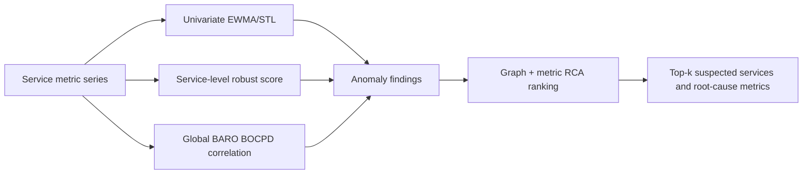
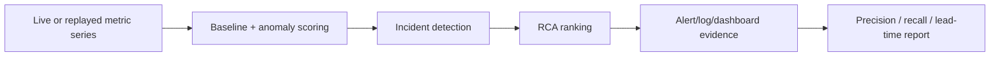

# Jira Ticket Drafts - AI MANDATE #7 Detection

Source files:

- `docs/mandates/MANDATE-07-aiops-detection.md`
- `docs/mandates/7a/MANDATE-07a-detection-analysis.md`
- `docs/mandates/7a/ADR-DETECT-001.md`
- `docs/pipelines/v0.0.1.md`

Use this file as the Jira copy source for the two required Mandate #7 tickets.

---

## Grading Coverage Map

| Mandate requirement | Covered by | Status |
|---|---|---|
| Submit 2 separate Jira tickets | Ticket 1 `#7a`, Ticket 2 `#7b` | Ready |
| #7a has detector + baseline implementation evidence | Ticket 1: Implementation Evidence | Ready, attach PR/commit before submit |
| #7a analyzes at least 3 metrics | Ticket 1: Metrics Analysis | Ready |
| Each metric has why, baseline, anomaly rule, method | Ticket 1: Metrics Analysis table | Ready |
| #7a has signed ADR | Ticket 1: ADR | Needs owner/reviewer signature |
| #7b shows detector firing end-to-end | Ticket 2: Required Evidence | Planned |
| #7b includes reproduction steps | Ticket 2: Execution Plan + Evidence | Planned |
| #7b reports precision/recall/lead-time over labeled incidents | Ticket 2: Measurement Plan | Planned |
| Alerts are impact-based and non-spammy | Both tickets: Anti-spam controls | Ready/planned |
| No heavy infra, no request-path latency, no `flagd` mutation | Both tickets: Safety / Scope | Ready |

---

## Ticket 1

### Summary

AI MANDATE #7a - Detection: implement detector + baseline analysis

### Type

Task

### Labels

`ai-mandate`, `m7`, `m7a`, `aiops`, `detection`, `baseline`, `rca`, `tf2`

### Due Date

2026-07-18

### Description

## Context

Mandate #7 requires TF2 AIOps to build automated detection so incidents surface through detector output instead of waiting for a human to watch Grafana or for users to complain.

This ticket is the #7a submission: implementation evidence plus baseline/metric analysis. It does not claim a live production run yet. Live detector firing, screenshots/logs, precision, recall, and lead-time belong to #7b.

## Definition Of Done Checklist

- [ ] PR/commit link attached showing detector + baseline code.
- [x] Analysis covers at least 3 important metrics.
- [x] Each metric documents why it was chosen.
- [x] Each metric documents the normal baseline.
- [x] Each metric documents the anomaly rule/threshold.
- [x] Each metric documents the detection method.
- [ ] ADR signed by owner/reviewer.
- [x] Scope explicitly excludes production auto-remediation and `flagd` mutation.

## Implementation Evidence

Implementation exists in `src/aio` and follows the v0.0.1 AIOps detection/RCA path.

| Area | File | Evidence |
|---|---|---|
| Anomaly engine | `aiops/anomaly/v001.py` | `V001AnomalyEngine` runs EWMA/STL-style residual detection, service-level robust scoring, and BARO BOCPD correlation. |
| Baseline/stat helpers | `aiops/anomaly/stats.py` | Mean, standard deviation, median, IQR, and `robust_score()` helpers. IQR has a non-zero fallback for flat baselines. |
| SLO threshold detector | `aiops/detectors/threshold.py` | Rule-based guard for hard SLO/burn-rate style thresholds. |
| Dependency detector | `aiops/detectors/dependency.py` | Detects dependency breach evidence and attaches likely dependency context. |
| No-data detector | `aiops/detectors/no_data.py` | Detects missing/stale/invalid required telemetry signals. |
| Pipeline runtime | `aiops/pipeline/runtime.py` | Orchestrates collect -> qualify -> normalize -> feature build -> detect -> correlate -> enrich -> incident -> notify -> policy -> verify -> RCA/remediation. |
| RCA engine | `aiops/rca/engine.py` | Ranks root-cause candidates from topology and metric evidence. |
| Runtime config | `config/runtime.json` | Owns topology, signals, detector definitions, thresholds, policy, and RCA enablement. |
| Regression tests | `tests/test_v001_anomaly_rca.py`, `tests/test_runtime_pipeline.py` | Exercise anomaly/RCA behavior and pipeline path. |
| Evaluation runner | `evaluate/e2e_pipeline.py` | Computes incident/RCA evaluation metrics on labeled datasets. |

PR/commit evidence to attach in Jira: `TODO: paste PR or commit URL`.

## Detection / RCA Architecture

The architecture follows `docs/pipelines/v0.0.1.md`: score metric anomalies, then feed evidence into RCA ranking.



Minimum floor for #7a is univariate detection per service/signal. Multivariate correlation is included as bonus confidence, not as the only detection path.

## Metrics Analysis

The #7a analysis selects three metrics across latency, error rate, and saturation. They cover both user-visible symptoms and early resource pressure on the checkout path.

| Metric | Service | Signal type | Why selected | Normal baseline | Anomaly rule | Detection method |
|---|---|---|---|---|---|---|
| p95 latency | `checkout` | Latency | Checkout is the revenue path and aggregates dependency slowness across cart, product-catalog, currency, shipping, payment, email, accounting, and fraud-detection. It maps to prior incident history where checkout p95 rose before full failure. | Normal load p95 around 62-87 ms; idle around 4.5-5 ms. Measured with `rpc_server_duration_milliseconds_bucket` because checkout uses gRPC. | Warning: > 200 ms for 3 cycles. Critical: > 500 ms for 2 cycles. Statistical anomaly: EWMA residual z-score >= 3.0. | EWMA/STL-style residual scoring plus hard latency guard. |
| HTTP 5xx error rate | `cart` | Error rate | Cart is required before checkout. Its SLO is >= 99.5%, so the error budget is only 0.5%. Cart also depends on `valkey-cart`, a known risk from incident history. | Normal baseline around 0.0% 5xx under current load. Short deploy/restart spikes up to about 1.0% are expected noise. | Warning: > 0.5% for 2 cycles. Critical: > 2.0% for 2 cycles. Statistical anomaly: robust score >= 4.0 vs recent baseline. Only evaluate when traffic is present. | Median/IQR robust score plus SLO threshold. |
| CPU usage | `product-catalog` | Saturation | Product-catalog is a critical shared read path used by frontend, recommendation, product-reviews, and checkout. CPU saturation can precede latency and error symptoms. | Normal usage around 2-4 millicores per pod; total around 6 millicores for 2 pods. No CPU limit is configured, so absolute millicores are used instead of percent utilization. | Warning: > 20 millicores for 3 cycles. Critical: > 50 millicores for 2 cycles. Statistical anomaly: EWMA z-score >= 3.0. Correlate with QPS to avoid alerting on normal load growth. | EWMA z-score, with BARO BOCPD as corroborating cross-service signal. |

Full supporting analysis: `docs/mandates/7a/MANDATE-07a-detection-analysis.md`.

## Anti-Spam Controls

- Warm-up suppression through `min_points` before scoring.
- Consecutive-cycle requirements so a single spike does not page.
- Hard SLO guards only for meaningful thresholds.
- Robust median/IQR scoring to avoid baselines being pulled by old spikes.
- Correlation/RCA ranking so alerts include likely affected service and root-cause metric, not just "metric high".
- #7b will measure false positives over a labeled incident set rather than isolated anecdotes.

## ADR

ADR file: `docs/mandates/7a/ADR-DETECT-001.md`.

Decision: use the in-repository Python detector as the Mandate #7a architecture. It is lightweight, observe-only, evaluation-first, and does not approve production auto-remediation.

Signature status:

| Role | Name | Date | Status |
|---|---|---|---|
| Owner | Nguyen Quy Hung | 2026-07-15 | Proposed |
| Reviewer | TODO | TODO | Pending sign-off |

## Verification Commands

Run all local tests:

```bash
cd tf2-corp-platform/src/aio
conda run -n capstone python -B -m unittest discover -s tests
```

Run focused anomaly/RCA test:

```bash
cd tf2-corp-platform/src/aio
conda run -n capstone python -B -m unittest tests.test_v001_anomaly_rca
```

Run evaluation on a labeled dataset when available:

```bash
cd tf2-corp-platform/src/aio
conda run -n capstone python -B evaluate/e2e_pipeline.py --limit 10 --out evaluate/report.json
```

## Evidence To Attach Before Submit

- PR/commit link: `TODO`
- Test output: `TODO`
- Signed ADR confirmation: `TODO`
- Analysis doc: `docs/mandates/7a/MANDATE-07a-detection-analysis.md`
- ADR: `docs/mandates/7a/ADR-DETECT-001.md`

## Scope Notes

This ticket is only for #7a. It proves implementation plus analysis.

Out of scope for #7a:

- Live detector screenshot/log.
- Production alert routing.
- Precision/recall/lead-time numbers.
- Production auto-remediation.
- Kubernetes mutation.
- Disabling or mutating `flagd`.
- Adding a heavy telemetry/ML cluster.

---

## Ticket 2

### Summary

AI MANDATE #7b - Detection: live e2e run, alert evidence, and measurement

### Type

Task

### Labels

`ai-mandate`, `m7`, `m7b`, `aiops`, `detection`, `e2e`, `measurement`, `precision-recall`, `tf2`

### Due Date

2026-07-25

### Description

## Context

Mandate #7b is the live-evidence stage. After #7a proves detector implementation and baseline analysis, #7b must show that the detector actually fires during an injected or replayed incident and must report detection quality over a labeled incident set.

## Definition Of Done Checklist

- [ ] Detector runs against live telemetry or approved replay data.
- [ ] One injected/replayed incident causes visible detector output.
- [ ] Evidence includes screenshot, detector log, dashboard panel, or alert payload.
- [ ] Evidence includes timestamps and enough context to reproduce the run.
- [ ] Precision is reported as correct fires / total fires.
- [ ] Recall is reported as caught incidents / total labeled incidents.
- [ ] Lead-time is reported as incident start time -> detector fire time.
- [ ] False positives, missed incidents, and anti-spam behavior are documented.
- [ ] Detector does not mutate production state or `flagd`.

## Planned Detection Flow

```text
Live telemetry or labeled replay
  -> metric collection
  -> baseline and anomaly scoring
  -> incident detection
  -> RCA ranking
  -> alert/log/dashboard evidence
  -> precision/recall/lead-time report
```



Use the #7a core metrics for the first reproducible #7b run:

- `checkout` p95 latency
- `cart` HTTP 5xx error rate
- `product-catalog` CPU usage

Expand to more services only after this path is reproducible.

## Required Evidence

Attach one visible proof that the detector fired end-to-end during an injected or approved replayed incident.

Acceptable evidence:

- Detector log line showing timestamp, service, metric, severity, score, and RCA candidate.
- Alert payload showing detector output and incident context.
- Dashboard screenshot showing anomaly and alert state.
- Terminal output from a replay/evaluation run, if it includes timestamps and detector result.

Evidence must include:

- Incident scenario name.
- Incident start timestamp.
- Detector fire timestamp.
- Metric(s) that triggered the detector.
- Severity.
- Root-cause candidate(s).
- Reproduction command or runbook.

## Measurement Plan

Measure over a labeled incident set, not one anecdotal service example.

| Metric | Formula | Required source |
|---|---|---|
| Precision | correct detector fires / total detector fires | Detector output + incident labels |
| Recall | caught labeled incidents / total labeled incidents | Labeled incident set |
| Lead-time | detector fire timestamp - incident start timestamp | Mentor injection timestamp or replay label |

Also report:

- False positives: detector fired during normal period.
- False negatives: labeled incident not detected.
- Duplicate/spam behavior: repeated alerts for the same incident window.
- RCA top-k result: whether expected root cause appears in top-k.

## Proposed Execution Steps

1. Confirm live Prometheus or approved replay source for the three #7a metrics.
2. Confirm PromQL queries and units for each metric.
3. Capture a normal period to prove no-alert behavior.
4. Inject or replay at least one approved incident.
5. Save detector output, alert/log/dashboard evidence, and timestamps.
6. Run measurement over the labeled incident set.
7. Attach precision, recall, lead-time, false-positive notes, and reproduction steps.

## Evidence To Attach In Jira

- Alert screenshot or detector log: `TODO`
- Reproduction command/runbook: `TODO`
- Labeled incident set or replay source: `TODO`
- Normal-period no-alert evidence: `TODO`
- Precision: `TODO`
- Recall: `TODO`
- Lead-time: `TODO`
- False-positive / spam-control notes: `TODO`
- RCA top-k result: `TODO`

## Scope Notes

This ticket proves live detection and measurement. It does not approve production auto-remediation or any mutating live executor action.

The detector must not add user-facing latency, must not require a heavy new cluster, and must not disable or mutate the `flagd` incident mechanism.
