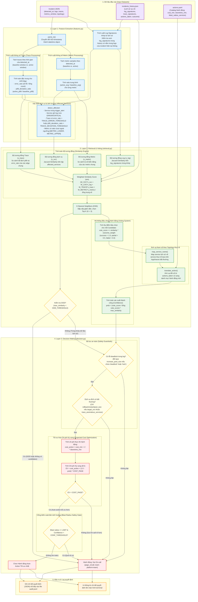

```mermaid
graph TD
    %% Định nghĩa các lớp CSS để tô màu trực quan
    classDef input fill:#efe5ff,stroke:#8e24aa,stroke-width:2px;
    classDef step1 fill:#e3f2fd,stroke:#1e88e5,stroke-width:2px;
    classDef step2 fill:#e8f5e9,stroke:#43a047,stroke-width:2px;
    classDef step3 fill:#ffebee,stroke:#e53935,stroke-width:2px;
    classDef output fill:#fff3e0,stroke:#fb8c00,stroke-width:2px;
    classDef decision fill:#fffde7,stroke:#fbc02d,stroke-width:2px;

    %% 1. Tầng dữ liệu đầu vào
    subgraph INPUTS ["1. Dữ liệu đầu vào (Input Datasets)"]
        incident["Incident JSON<br>(detected_at, logs, traces, metrics_window, topology)"]:::input
        history["incidents_history.json<br>(Lịch sử sự cố: log_signatures, trace_signatures, actions_taken, outcome)"]:::input
        actions_cat["actions.yaml<br>(Catalog hành động: cost_min, downtime_min, blast_radius_services)"]:::input
    end

    %% 2. Tầng trích xuất đặc trưng
    subgraph LAYER1 ["2. Layer 1: Feature Extraction (features.py)"]
        parse_ts["parse_ts()<br>Chuyển đổi ISO-timestamp thành datetime object"]:::step1
        log_match["Trích xuất Log Signatures khớp từ lịch sử<br>Kiểm tra xem log_signatures trong history có nằm trong logs của incident hiện tại không"]:::step1
        
        subgraph trace_proc ["Trích xuất thông số Trace (Trace Processing)"]
            split_traces["Tách traces theo thời gian của detected_at<br>(baseline window vs. active window)"]:::step1
            calc_trace_metrics["Tính toán đặc trưng cho mỗi Edge:<br>- error_rate (số lỗi / tổng count)<br>- p99_deviation_ratio (active_p99 / baseline_p99)"]:::step1
        end

        subgraph metric_proc ["Trích xuất thông số Metric (Metric Processing)"]
            split_metrics["Tách metric samples theo detected_at<br>(baseline vs. active)"]:::step1
            calc_metric_ratios["Tính ratio trung bình (active_avg / baseline_avg)<br>cho từng metric"]:::step1
        end

        subgraph affected_svc_detection ["Xác định dịch vụ bị ảnh hưởng (Affected Services)"]
            detect_affected["detect_affected:<br>- Service trong trigger_alert<br>- Service ghi log mức ERROR/CRITICAL<br>- Trace có error_rate > TRACE_ERROR_THRESHOLD<br>hoặc p99_deviation_ratio > TRACE_DEVIATION_THRESHOLD<br>- Metric có ratio vượt ngoài ngưỡng [METRIC_LOWER, METRIC_UPPER]"]:::step1
        end
    end

    incident --> parse_ts
    parse_ts --> split_traces
    parse_ts --> split_metrics
    
    incident --> log_match
    history --> log_match
    
    split_traces --> calc_trace_metrics
    split_metrics --> calc_metric_ratios
    
    log_match --> detect_affected
    calc_trace_metrics --> detect_affected
    calc_metric_ratios --> detect_affected

    %% 3. Tầng truy vấn và bầu chọn hành động
    subgraph LAYER2 ["3. Layer 2: Retrieval & Voting (retrieval.py)"]
        subgraph similarity_scoring ["Tính toán độ tương đồng (Similarity Engine)"]
            jaccard_svc["Độ tương đồng dịch vụ (s_svc)<br>Jaccard Similarity trên tập affected_services"]:::step2
            jaccard_logs["Độ tương đồng Log (s_log)<br>Jaccard Similarity trên log_signatures trùng khớp"]:::step2
            sim_traces["Độ tương đồng Trace (s_trace)<br>So sánh độ lệch p99 và error_rate của các edge chung"]:::step2
            sim_metrics["Độ tương đồng Metric (s_metric)<br>So sánh tỷ số biến động của các metric chung"]:::step2
            combined_sim["Weighted Similarity Score (sim)<br>(W_SVC*s_svc + W_LOG*s_log + W_TRACE*s_trace + W_METRIC*s_metric) / tổng trọng số"]:::step2
        end

        knn_selection["K-Nearest Neighbors (KNN)<br>Sắp xếp giảm dần, chọn Top K (K = 3)"]:::step2
        
        ood_decision{"Kiểm tra OOD?<br>(max_similarity < OOD_THRESHOLD)"}:::decision
        
        subgraph translation ["Ánh xạ tham số theo Topology thực tế"]
            map_svc_name["map_service_name()<br>Map service lịch sử về service thực tế dựa trên logs/traces bất thường"]:::step2
            trans_action["translate_action()<br>Ánh xạ đối số từ actions_taken cũ sang danh mục hành động mới"]:::step2
        end
        
        subgraph action_voting ["Hệ thống Bầu chọn Hành động (Voting System)"]
            vote_score["Tích lũy điểm bầu chọn cho mỗi Candidate:<br>vote_score += similarity * outcome_weight<br>(success = 1.0, partial = 0.5, failed = 0.0)"]:::step2
            calc_prob["Tính toán xác suất thành công (Confidence)<br>prob = (vote_score / tổng vote_score) * max_similarity"]:::step2
        end
    end

    detect_affected --> jaccard_svc
    log_match --> jaccard_logs
    calc_trace_metrics --> sim_traces
    calc_metric_ratios --> sim_metrics
    history --> combined_sim
    
    jaccard_svc --> combined_sim
    jaccard_logs --> combined_sim
    sim_traces --> combined_sim
    sim_metrics --> combined_sim

    combined_sim --> knn_selection
    knn_selection --> ood_decision
    
    knn_selection --> vote_score
    vote_score --> map_svc_name
    map_svc_name --> trans_action
    actions_cat --> trans_action
    trans_action --> calc_prob

    %% 4. Tầng ra quyết định khắc phục sự cố
    subgraph LAYER3 ["4. Layer 3: Decision Making (decision.py)"]
        subgraph safety_guardrails ["Bộ lọc an toàn (Safety Guardrails)"]
            deadlock_gate{"Có lỗi deadlock trong log?<br>(Bỏ qua increase_pool_size nếu chứa 'deadlock' hoặc 'lock')"}:::decision
            anomaly_gate{"Dịch vụ đích có bất thường?<br>(Chỉ rollback/restart/pool_size nếu target_svc thuộc trace_anomalous_services)"}:::decision
        end

        subgraph ev_optimization ["Tối ưu hóa Chi phí Kỳ vọng (Expected Cost Optimization)"]
            calc_cost_action["Tính chi phí thực thi hành động:<br>cost_action = cost_min + 2 * downtime_min"]:::step3
            calc_expected_cost["Tính Chi phí Kỳ vọng (EV):<br>EV = cost_action + (1.0 - prob) * COST_PAGE"]:::step3
            cmp_page_cost{"EV < COST_PAGE?"}:::decision
        end

        subgraph safety_gate ["Cổng kiểm soát tầm ảnh hưởng (Blast Radius Safety Gate)"]
            blast_check{"Blast radius >= LIMIT &<br>Confidence < CONF_THRESHOLD?"}:::decision
        end
        
        action_fallback_page["Hành động: Gọi On-call<br>(page_oncall, team: platform-team)"]:::step3
        action_execute["Chọn Hành động Auto-Action Tối ưu nhất"]:::step3
    end

    ood_decision -- "Có (OOD hoặc không có candidates)" --> action_fallback_page
    ood_decision -- "Không (Trùng khớp dữ liệu lịch sử)" --> deadlock_gate
    
    calc_prob --> deadlock_gate
    deadlock_gate -- "Đạt" --> anomaly_gate
    deadlock_gate -- "Không đạt" --> action_fallback_page
    
    anomaly_gate -- "Đạt" --> calc_cost_action
    anomaly_gate -- "Không đạt" --> action_fallback_page
    
    calc_cost_action --> calc_expected_cost
    calc_expected_cost --> cmp_page_cost
    
    cmp_page_cost -- "Có (Auto-action tối ưu hơn)" --> blast_check
    cmp_page_cost -- "Không (Gọi On-call rẻ hơn)" --> action_fallback_page
    
    blast_check -- "Không (An toàn)" --> action_execute
    blast_check -- "Có (Quá rủi ro)" --> action_fallback_page

    %% 5. Tầng đầu ra
    subgraph OUTPUTS ["5. Đầu ra & Log quyết định"]
        write_audit["Ghi chi tiết quyết định (JSON) nối tiếp vào file audit.jsonl"]:::output
        stdout_print["In thông tin chi tiết quyết định lên màn hình terminal"]:::output
    end

    action_execute --> write_audit
    action_execute --> stdout_print
    action_fallback_page --> write_audit
    action_fallback_page --> stdout_print
```
