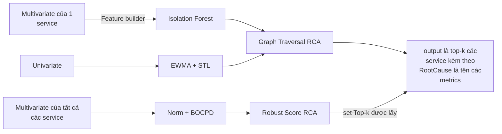

```mermaid
graph LR
    A[Multivariate của 1<br>service] -- Feature builder --> D[Isolation Forest]
    B[Univariate] --> E[EWMA + STL]
    C[Multivariate của tất cả<br>các service] --> F[Norm + BOCPD]
    
    D --> G[Graph Traversal RCA]
    E --> G
    
    F --> H[Robust Score RCA]
    
    G --> I[output là top-k các<br>service kèm theo<br>RootCause là tên các<br>metrics]
    H -- set Top-k được lấy --> I
```
