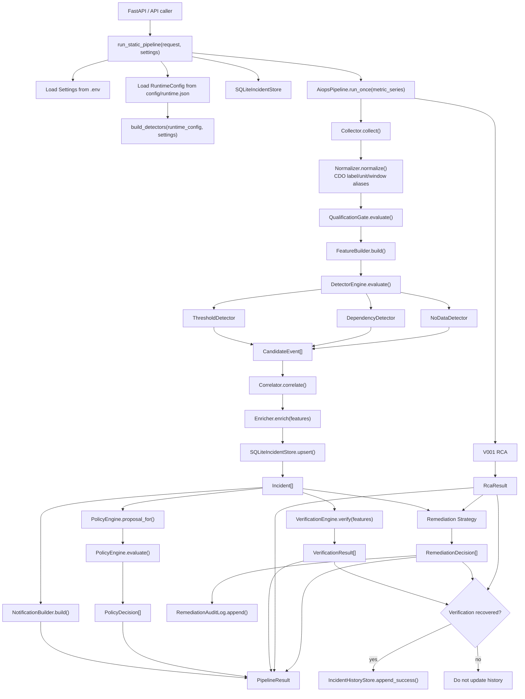
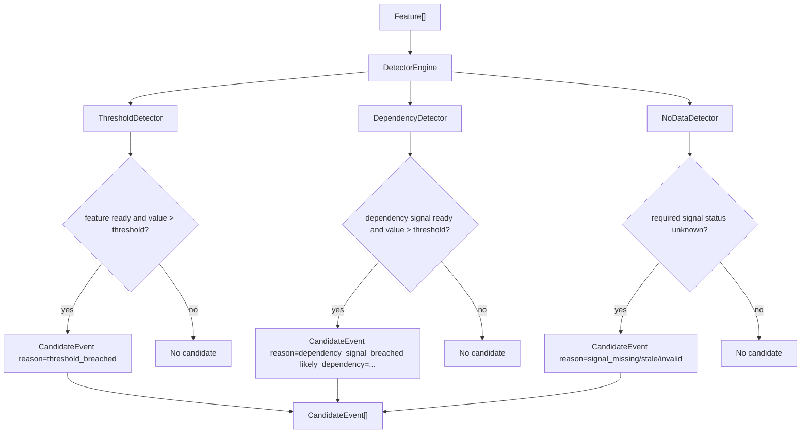
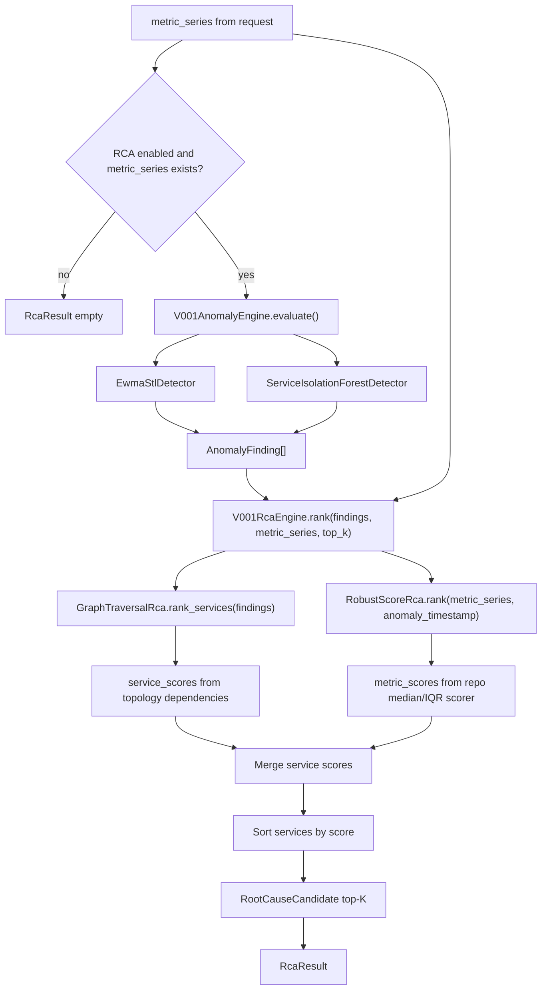
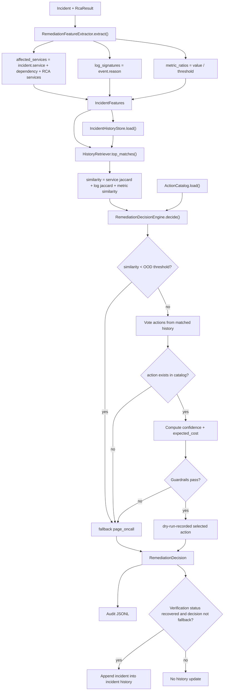
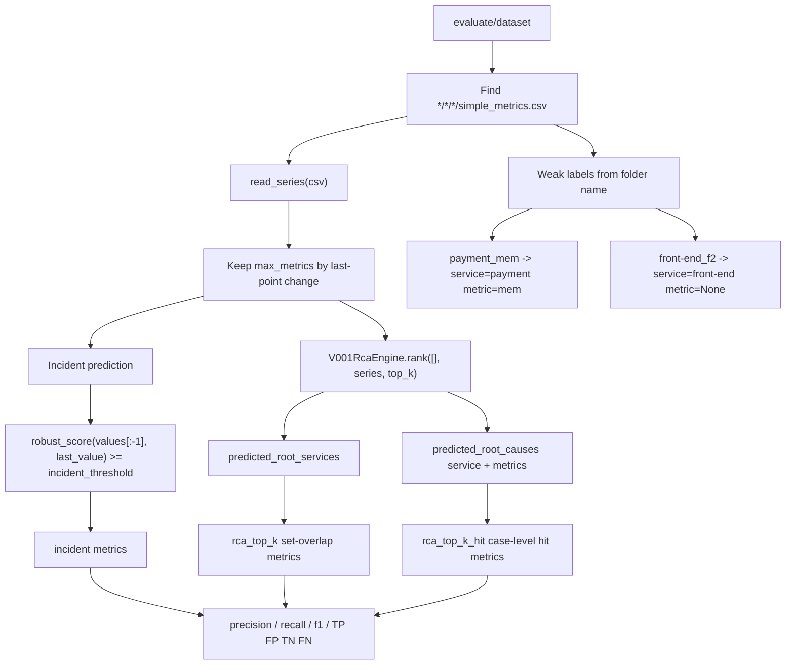

Dưới đây là pipeline hiện tại của codebase theo code trong [aiops/pipeline/runtime.py](/home/duckq1u/Documents/Aiops-g4/tf2-corp-platform/src/aio/aiops/pipeline/runtime.py).

**Runtime Pipeline**

**Detector Flow**

**RCA Pipeline**

**Remediation Pipeline**

**Evaluation Pipeline**

