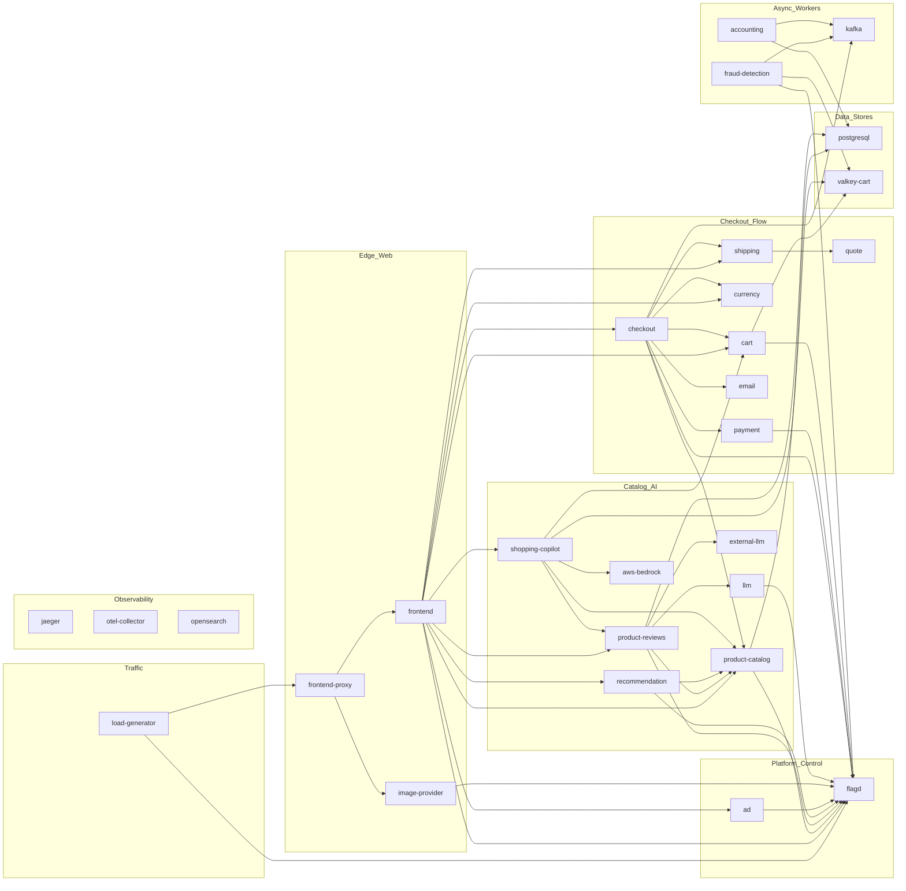

```mermaid
flowchart LR
  subgraph Traffic
    load_generator["load-generator"]
  end

  subgraph Edge_Web
    frontend_proxy["frontend-proxy"]
    frontend["frontend"]
    image_provider["image-provider"]
  end

  subgraph Checkout_Flow
    checkout["checkout"]
    cart["cart"]
    payment["payment"]
    currency["currency"]
    shipping["shipping"]
    quote["quote"]
    email["email"]
  end

  subgraph Catalog_AI
    product_catalog["product-catalog"]
    product_reviews["product-reviews"]
    recommendation["recommendation"]
    shopping_copilot["shopping-copilot"]
    llm["llm"]
    external_llm["external-llm"]
    aws_bedrock["aws-bedrock"]
  end

  subgraph Platform_Control
    flagd["flagd"]
    ad["ad"]
  end

  subgraph Async_Workers
    fraud_detection["fraud-detection"]
    accounting["accounting"]
    kafka["kafka"]
  end

  subgraph Data_Stores
    postgresql["postgresql"]
    valkey_cart["valkey-cart"]
  end

  subgraph Observability
    jaeger["jaeger"]
    otel_collector["otel-collector"]
    opensearch["opensearch"]
  end

  load_generator --> frontend_proxy
  load_generator --> flagd

  frontend_proxy --> frontend
  frontend_proxy --> image_provider

  frontend --> product_catalog
  frontend --> product_reviews
  frontend --> recommendation
  frontend --> checkout
  frontend --> cart
  frontend --> ad
  frontend --> currency
  frontend --> shipping
  frontend --> shopping_copilot
  frontend --> flagd

  checkout --> cart
  checkout --> currency
  checkout --> product_catalog
  checkout --> shipping
  checkout --> payment
  checkout --> email
  checkout --> kafka
  checkout --> flagd

  shipping --> quote
  payment --> flagd

  product_catalog --> postgresql
  product_catalog --> flagd

  product_reviews --> product_catalog
  product_reviews --> postgresql
  product_reviews --> flagd
  product_reviews --> llm
  product_reviews --> external_llm

  recommendation --> product_catalog
  recommendation --> flagd

  shopping_copilot --> product_catalog
  shopping_copilot --> product_reviews
  shopping_copilot --> cart
  shopping_copilot --> valkey_cart
  shopping_copilot --> aws_bedrock

  cart --> flagd
  cart --> valkey_cart

  ad --> flagd
  image_provider --> flagd
  llm --> flagd

  fraud_detection --> flagd
  fraud_detection --> kafka
  fraud_detection --> valkey_cart

  accounting --> kafka
  accounting --> postgresql
```
