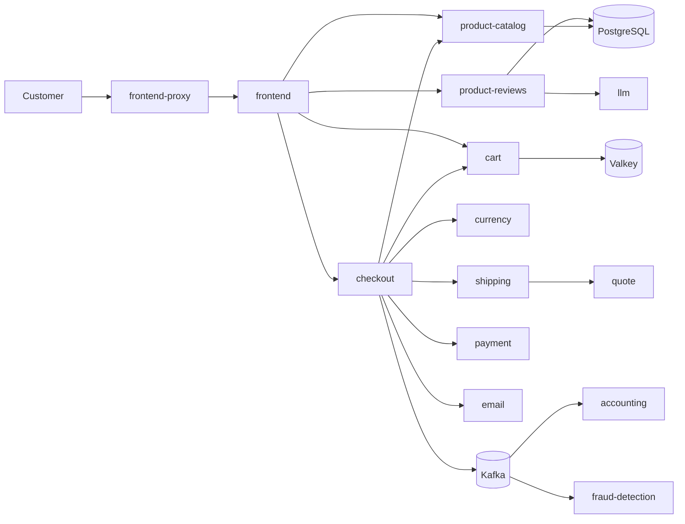
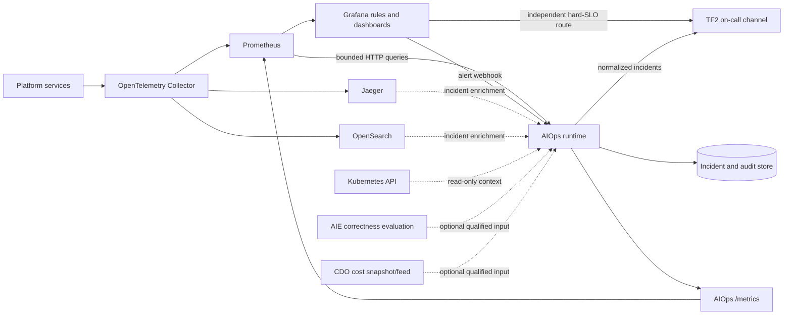
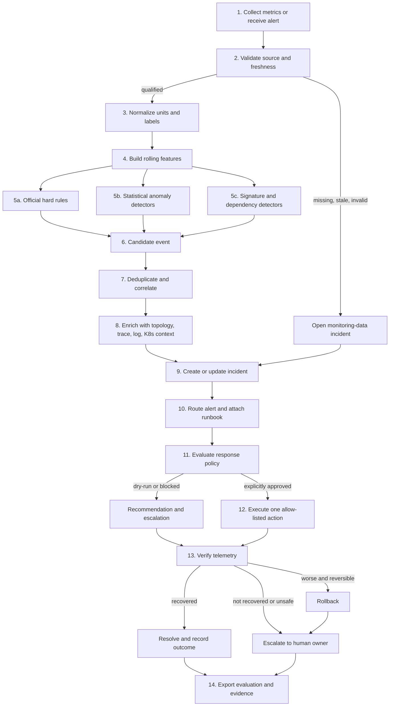
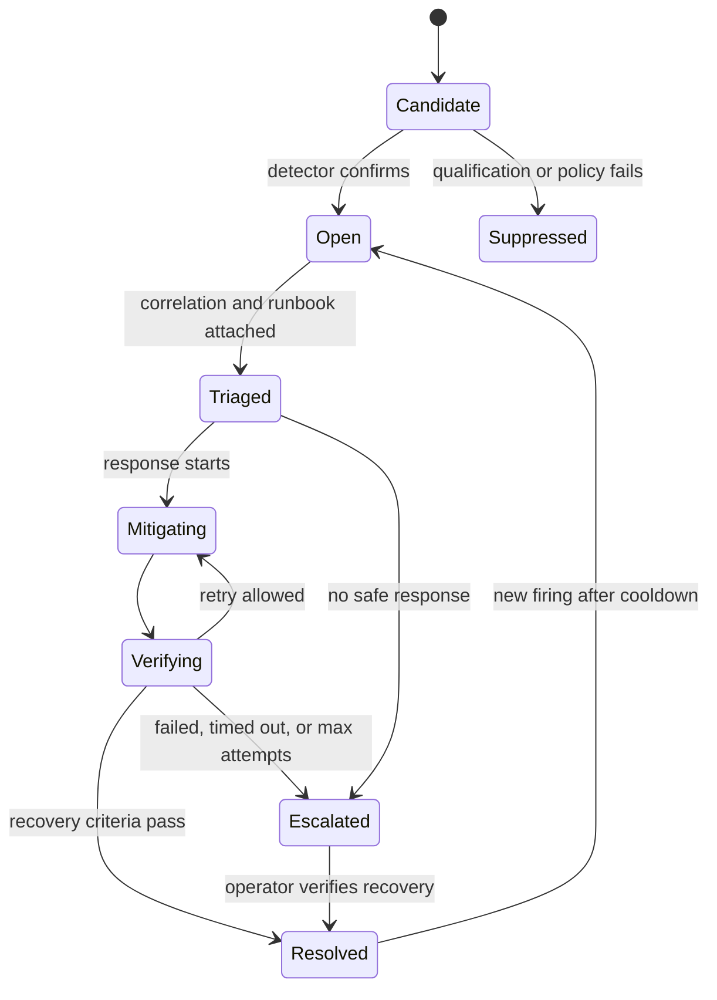
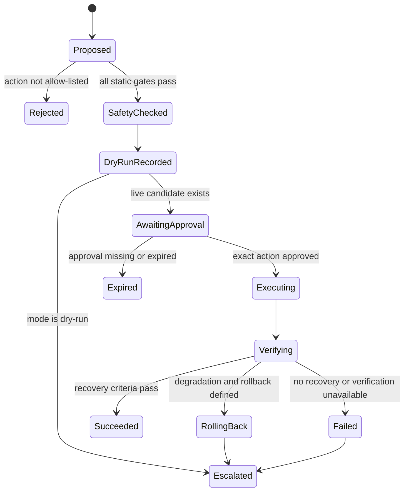

# TF2 / AIO4 AIOps Architecture

> **Status:** Proposed implementation baseline  
> **Owners:** AIO4 AIOps sub-team (3 members)  
> **Target environment:** TF2 on AWS EKS  
> **Planning window:** July 6-24, 2026  
> **Last updated:** July 10, 2026

This document defines the complete AIOps pipeline, runtime boundaries, safety model, data contracts, deployment model, and target folder structure for AIO4 in TF2. The matching delivery sequence is in [implement_plan.md](implement_plan.md).

## 1. Source of truth and conflict resolution

The repository contains discovery notes written at different times, so they do not all have equal authority. Use this precedence whenever two documents disagree:

1. Active BTC mandates in `phase3/mandates/`, then [Phase 3 rules](../phase3/RULES.md), [SLO](../phase3/onboarding/SLO.md), [budget](../phase3/onboarding/BUDGET.md), and [architecture](../phase3/onboarding/ARCHITECTURE.md).
2. Evidence from the currently deployed TF2 environment, provided the metric, labels, time window, and capture time are recorded.
3. The corrected [AIOps backlog](aiops/AIO_BACKLOG.md) and [AIOps task plan](aiops_task_plan.md).
4. Team discovery inputs: [baseline metrics](aiops/w1/baseline_metrics.md), [signal catalog](aiops/w1/signal_for_anomoly.md), [weakness assessment](aiops/w1/weakness.md), and [AI findings](aiops/w1/AI_FINDINGS_AIOPS.md).
5. The older [multi-source prioritized backlog](aiops/w1/AIOPS_PRIORITIZED_BACKLOG.md), which remains useful as discovery history but is superseded where it conflicts with the corrected backlog.

The resulting non-negotiable interpretations are:

- Checkout **success >= 99.0%** is an official SLO. Checkout p50/p95/p99 latency is diagnostic and is **not** an official Phase 3 SLO.
- The official daily SLO window is rolling 24 hours; five- or fifteen-minute queries are operational diagnostics and anomaly inputs.
- P0 order is `OPS-01 -> OPS-03 -> OPS-02`. `OPS-04`, `OPS-07`, and `OPS-05` are P1. `OPS-06` is conditional P2 unless evidence, a live incident, or a BTC mandate promotes it.
- A missing, stale, or unverified series is never interpreted as zero or healthy.
- BTC-owned flagd and OpenFeature incident paths are protected. The AIOps system may observe their symptoms but must never disable, redirect, mutate, or bypass them.

## 2. Scope

### 2.1 In scope

- Continuously collect and qualify operational signals from Prometheus.
- Receive hard-rule alert events from Grafana.
- Detect official SLO breaches, missing telemetry, checkout dependency failures, and PostgreSQL pressure.
- Detect explainable multi-signal anomalies with a rolling statistical baseline.
- Correlate signals with the checkout topology and enrich incidents with bounded Jaeger and OpenSearch evidence.
- Deduplicate, route, track, and audit incidents.
- Match incidents to versioned runbooks.
- Produce guarded remediation recommendations in dry-run mode.
- Optionally execute **one explicitly approved, stateless, reversible action** only after every safety gate passes.
- Verify recovery, roll back when a predefined rollback exists, or escalate.
- Expose runtime health and AIOps metrics, and produce reproducible evaluation/evidence artifacts.
- Run continuously as a resource-bounded workload on EKS.

### 2.2 Out of scope

- Shopping Copilot, review-summary correctness evaluation, prompt-injection guardrails, or other AIE product work.
- Fixing application connection pools, readiness logic, replica count, or managed-service migrations directly; those changes are owned or approved by CDO/application owners.
- Treating an LLM-generated explanation as evidence or allowing an LLM to authorize an action.
- Autonomous stateful restarts, database changes, secret changes, flag changes, broad scaling, or multi-service mutations.
- Replacing Prometheus, Grafana, Jaeger, OpenSearch, or the OpenTelemetry Collector.
- Running uncontrolled load or exercising BTC flags without explicit authorization.

## 3. Requirements and design decisions

| Area | Requirement | Architecture decision |
|---|---|---|
| Delivery | Three people, three weeks | Build one Python modular-monolith service with configuration-driven detectors; avoid a new microservice fleet. |
| Official SLOs | Rolling 24-hour numeric SLOs | Keep hard SLO evaluation in Grafana/Prometheus rules so it continues even if the AIOps runtime is unavailable. |
| Anomaly detection | Multi-signal and explainable | Use deterministic rules plus robust rolling statistics such as median/MAD or EWMA. Persist every input and contribution. |
| Telemetry quality | Metrics are not fully verified | Put a qualification gate before every detector and track `verified`, `fallback-only`, `missing`, `stale`, and `invalid`. |
| RCA | Cross-service checkout diagnosis | Use a versioned topology plus temporal and dependency correlation; call the output “likely cause,” never proven root cause without evidence. |
| Traces/logs | Useful but potentially expensive and sensitive | Query Jaeger/OpenSearch only after a candidate incident or on operator request; store links and bounded excerpts, not bulk raw data. |
| Response | Safe automation required | Start in `dry-run`; separate recommendation, approval, execution, verification, rollback, and escalation. |
| Kubernetes access | Least privilege | Default service account is read-only. A separate optional live-action Role is absent unless CDO approves one exact action. |
| State | Must survive restart without adding costly infrastructure | Use a storage interface with SQLite WAL on a small PVC for the three-week baseline, plus structured logs to OpenSearch. Hard SLO alerts remain independent. |
| Runtime topology | SQLite permits one writer | Run one active AIOps pod with `Recreate`; alert on its absence. Replace storage before scaling horizontally. |
| Cost | TF budget is about $300/week | Reuse existing telemetry services, bound polling/query ranges, set pod resources, and block cost-changing actions when no current cost evidence exists. |
| AI correctness | Best-effort but must not be inaccurate | Consume an AIE-owned evaluation status when available; otherwise expose `N/A / dependency missing`, never infer correctness from latency. |
| Auditability | Decisions and incidents must be attributable | Version configuration/runbooks, persist append-only incident/action events, emit structured audit logs, and link ADR/approver identity. |

### 3.1 Realness and configuration guardrails

These rules keep the design from becoming a template-only or mock implementation:

- The EKS runtime must use real TF2 endpoints, query IDs, namespaces, image digests, secrets, alert routes, runbooks, and contact points supplied through Helm values, ConfigMaps, Secrets, and signed ADRs.
- Python code must not hardcode environment URLs, AWS account IDs, namespaces, alert channels, Prometheus metric names, service label values, thresholds, or remediation targets. Code accepts typed configuration and rejects unresolved values such as `<...>`, `TODO`, `TBD`, `REPLACE_ME`, `localhost`, and `example`.
- Candidate metric names and YAML fragments in this document show the expected contract shape only. Examples remain `unqualified` and disabled. A signal becomes active only after `ADR-SLI-001` links live TF2 evidence: expression, labels, units, window, capture time, owner, and reviewer.
- Test doubles and synthetic/redacted fixtures are allowed only for unit, contract, replay, and evaluation tests. Production images and production configuration must not import test collectors, read fixture data, or route synthetic scenarios as real incidents.
- Dry-run recommendations are real operational outputs from real telemetry. They are non-mutating by policy, not mock incidents.
- Phase 3 policy constants such as official SLO objectives are intentionally versioned as policy-as-code. Environment facts such as endpoints, metric mappings, labels, deployment topology, evidence-derived thresholds, resource sizes, and action targets are configuration backed by deployment evidence, never Python constants.

### 3.2 Later implementation decisions and gates

These integration decisions are intentionally left for later consideration because they require deployed evidence or CDO ownership that is not available in this repository. They must not be replaced with mocks, guessed values, or silent fallbacks:

1. **AIOps self-metrics ingestion.** Before P0 self-observability is accepted, `ADR-DEPLOY-001` must select and prove one real path: either the deployed OpenTelemetry Collector scrapes the AIOps `/metrics` endpoint with a Prometheus receiver, or the runtime exports its metrics through OTLP to the existing collector. Merely exposing `/metrics` is insufficient. Verification must query real `aiops_*` series in TF2 Prometheus and fire the independent runtime-loss alert.
2. **TF2 deployment-chart ownership.** Before EKS deployment, `ADR-DEPLOY-001` must identify the actual CDO-owned chart repository, immutable revision, owner, and checkout used to deploy TF2. Deployment source files may be developed under `tf2-corp-platform/src/aio/`, but they cannot be treated as active until the real chart consumes them. The `phase3/techx-corp-chart` reference copy must never be edited or deployed by assumption.
3. **Live-remediation approval and execution identity.** Mandatory P0 remains dry-run-first and may finish dry-run-only with a signed safety decision. Before `live-approved` is enabled, `ADR-LIVE-001` must define one exact action, an auditable expiring approval provider, and the Kubernetes execution boundary. Prefer a separate narrowly scoped executor workload and ServiceAccount; any alternative must prove that the ordinary runtime remains read-only. A boolean setting, fixture approval, or temporarily broad RoleBinding is not valid.

## 4. System context

The protected customer platform remains unchanged:



All services emit OpenTelemetry signals through the existing collector. AIOps is a consumer of that observability plane, not a proxy in the customer request path.



The direct Grafana-to-on-call route is deliberate. A broken AIOps runtime must not hide an official SLO breach.

## 5. End-to-end pipeline



### 5.1 Pipeline invariants

- Hard SLO rules do not wait for multi-signal confirmation or RCA.
- Statistical anomalies cannot override a hard SLO result.
- An unqualified signal cannot open a customer-impact incident; it opens a telemetry-gap incident instead.
- Trace/log enrichment failure reduces confidence but does not suppress a hard SLO alert.
- Every incident is linked to the exact detector/config revision used.
- No response action runs before the incident and action audit records are durably created.
- Verification uses predeclared queries and windows; it is not based on a human-looking dashboard screenshot alone.
- If a dependency, policy, cost state, approval, or verification query is unavailable, the system fails closed and escalates.

## 6. Runtime component design

The implementation is a single deployable service with strict internal module boundaries.

### 6.1 API and scheduler

Responsibilities:

- Expose `/health/live`, `/health/ready`, `/metrics`, and read-only incident endpoints.
- Receive Grafana webhooks at `/api/v1/events/grafana`.
- Run collection, evaluation, recovery-check, notification-retry, and evidence-export jobs.
- Reject startup when configuration schemas or cross-references are invalid.

The checked-in local Prometheus configuration currently uses a 60-second interval, but the EKS interval must be discovered from deployed configuration or sample timestamps. The environment profile sets detector cadence at or above that verified freshness; polling faster does not create fresher evidence.

### 6.2 Collectors

| Adapter | Mode | Required behavior |
|---|---|---|
| Prometheus | Periodic pull | Query only registered expressions; enforce timeouts, response-size limits, and query budgets. |
| Grafana webhook | Event push | Verify an in-cluster shared secret, normalize firing/resolved events, and retain original alert identity. |
| Jaeger | On-demand | Search within the incident time bounds and services; return trace IDs/links and a small evidence summary. |
| OpenSearch | On-demand | Run allow-listed, time-bounded queries; redact sensitive fields and cap hits. |
| Kubernetes | On-demand read | Read Deployment/Pod/ReplicaSet status, restarts, readiness, and replica counts in the TF2 namespace. |
| AIE evaluation | Optional | Accept only an agreed, timestamped correctness artifact/metric with owner and freshness. |
| Cost status | Optional | Accept a CDO-owned timestamped budget/headroom value; `unknown` blocks cost-changing actions. |

Collectors return a common envelope containing source, query ID, observed time, query window, value(s), labels, unit, source revision, and collection status.

### 6.3 Signal registry and qualification gate

Every usable signal is declared in versioned YAML. Qualification is an operational state, not a comment in code.

| State | Meaning | Detector behavior |
|---|---|---|
| `unqualified` | Candidate definition has not passed live TF2 semantic review | Disabled; usable only by discovery/evaluation tooling. |
| `verified` | Series, labels, units, route/RPC semantics, and freshness were proven in TF2 | May be a primary alert input. |
| `fallback-only` | Useful supporting evidence but not proven to represent the customer event | May corroborate or enrich; cannot define an official SLI. |
| `missing` | Expected series was not found | Raise/display a telemetry gap; never use zero. |
| `stale` | Last sample exceeds `stale_after` | Raise/display monitoring loss and suppress dependent anomaly conclusions. |
| `invalid` | Unit, label cardinality, semantics, or query result failed validation | Quarantine the signal and notify its owner. |

Qualification checks include:

- Prometheus response success and query timeout.
- Exact expected unit and scalar/vector shape.
- Required labels and allowed label cardinality.
- Timestamp freshness.
- Minimum request/sample count for ratios and percentiles.
- Counter reset-safe functions (`rate`/`increase`).
- Customer-flow semantic proof recorded in the SLI mapping.
- Known exclusions such as flagd EventStream long-poll spans.

### 6.4 Feature builder

The feature builder produces typed rolling observations:

- Official rolling-24-hour success/error ratio and storefront p95.
- Diagnostic 5-minute and 15-minute QPS, error ratio, p50/p95/p99, and saturation values.
- Signal freshness and sample volume.
- Robust baseline statistics: median, MAD, EWMA, deviation score, trend, and change from the previous window.
- Correlation features: common time window, topology distance, and shared affected flow.

Raw values remain available in the incident evidence so an operator can reproduce each derived feature.

### 6.5 Detector engine

Detector classes are registered from configuration:

1. `SloRuleDetector` — official numeric SLO status and error-budget consumption.
2. `NoDataDetector` — missing/stale collector, series, or evaluation dependency.
3. `DependencyDetector` — checkout downstream error/latency signatures from qualified span/RPC metrics.
4. `SaturationDetector` — PostgreSQL active backend pressure plus supporting service symptoms.
5. `RobustAnomalyDetector` — median/MAD or EWMA deviation for non-official early warning.
6. `SignatureDetector` — versioned metric/log/trace combinations for high-risk flags without reading or changing flag state.
7. Conditional `KafkaLagDetector` and `LlmVisibilityDetector` — enabled only after their inputs are qualified.

For robust anomalies, the preferred score is:

```text
robust_z = 0.6745 * (current_value - rolling_median) / MAD
```

If MAD is zero or insufficient history exists, the detector reports `warming_up` or uses an explicitly configured EWMA fallback. Thresholds, minimum history, consecutive cycles, and required corroborating signals are configuration values approved in the threshold ADR; they are not hidden constants.

### 6.6 Correlation and likely-cause ranking

Correlation groups candidate events when they share an environment and customer flow within a configured time window. It ranks a likely dependency using:

- Temporal ordering: dependency symptom before or with the parent-flow symptom.
- Topology: the dependency is on the affected customer path.
- Signal quality: verified inputs weigh more than fallback inputs.
- Specificity: a named failing downstream span weighs more than host-wide CPU noise.
- Corroboration: metric plus bounded trace/log/Kubernetes evidence.

The output includes a transparent list of contributing signals and a confidence value. It must say `likely_dependency` or `unknown`, not claim a root cause that has not been verified.

### 6.7 Incident manager

The incident manager owns fingerprinting, deduplication, state, recovery checks, and timelines.

The default fingerprint is a stable hash of:

```text
environment + detector_id + customer_flow + primary_service + likely_dependency
```

Repeated events update one incident and increment its occurrence count. A resolved incident may reopen only after a new firing transition outside the configured cooldown.



Recovery requires consecutive successful checks and fresh telemetry. A Grafana `resolved` webhook is evidence but does not alone close an incident if other required checks are still failing.

### 6.8 Runbook matcher

Runbooks are versioned Markdown with machine-readable front matter:

The only canonical runbook location is `tf2-corp-platform/src/aio/runbooks/`. Runtime matching, validation, packaging, operator links, and documentation references must resolve to that directory. `aio-docs` must link to canonical runbooks rather than maintain copies.

- `runbook_id`, title, owner, severity, flows, services, detector IDs.
- Preconditions and evidence queries.
- First-response steps.
- Safe dry-run recommendation.
- Prohibited actions.
- Verification and rollback criteria.
- Escalation owner/channel.

P0 runbooks cover official SLO breach, checkout dependency failure, DB saturation, and monitoring-pipeline failure.

### 6.9 Notification router

The router produces a normalized incident message containing:

- Incident ID and state.
- Severity, environment, flow, service, and likely dependency.
- Signal value, unit, threshold/baseline, and measurement window.
- Official SLO/error-budget context when applicable.
- Confidence and contributing evidence.
- Dashboard, trace, log-query, runbook, and ADR links.
- Current action mode (`observe`, `dry-run`, or approved `live`).
- Owner, escalation target, first seen, last seen, and occurrence count.

It retries with bounded exponential backoff, records delivery outcomes, and exposes delivery failures as AIOps health signals. Deduplication is enforced before notification and at the receiver grouping key.

### 6.10 Policy and remediation engine

The response engine is deterministic. It may optionally generate a human-readable incident summary later, but an LLM must never choose, approve, execute, or verify an action.



#### Always allowed

- Read metrics and Kubernetes status.
- Collect bounded evidence.
- Create/update incidents.
- Route alerts.
- Recommend a runbook step.
- Evaluate and record a non-mutating action proposal against current real resource state in dry-run mode.

#### Always blocked

- Mutating flagd, OpenFeature hooks, flag sources, or BTC incident delivery.
- Restarting or deleting stateful or single-replica workloads.
- Database/schema/data mutation.
- Secret or credential mutation.
- Broad namespace/cluster mutation.
- Multiple simultaneous live actions.
- Scaling without current cost evidence, human approval, and CDO ownership.
- Any action whose verification or rollback is undefined.

#### Optional live-action gates

All gates must pass for the **same exact action request**:

1. CDO signed ADR and explicit action allow-list entry.
2. Target proven stateless, multi-replica, ready, and outside protected incident infrastructure.
3. Dedicated least-privilege Role grants only the required verb/resource/name.
4. Current mode is `live-approved`; default remains `dry-run`.
5. A human approval record includes action ID, approver, reason, and expiry.
6. Official error-budget policy permits the change.
7. Cost status is current when the action may affect cost.
8. Blast radius is one service and no other live action is running.
9. Cooldown and maximum-attempt checks pass.
10. Pre-action snapshot, verification query, timeout, and rollback are present.

If no action satisfies these gates, “dry-run only” is a successful and expected safety outcome.

## 7. Official SLI and detector mapping

All metric expressions below are **candidates until validated against TF2**. Do not copy them into enabled configuration before the final mapping is stored in configuration and a signed SLI ADR.

| Official flow | Objective | Candidate primary evidence | Required validation | Hard behavior |
|---|---:|---|---|---|
| Browse/search availability | non-5xx success >= 99.5% | Customer-facing frontend/frontend-proxy HTTP route or catalog search RPC counter | Prove exact route/RPC represents customer attempts; exclude long-poll/control traffic | Fire when rolling-24h failure ratio is > 0.5% |
| Storefront browse latency | p95 < 1s | Customer-facing storefront HTTP histogram | Confirm unit and route; exclude flagd EventStream and unrelated API traffic | Fire when rolling-24h p95 is >= 1s |
| Cart operations | success >= 99.5% | Qualified cart RPC operation counters/status | Define included cart methods and customer attempt semantics | Fire when rolling-24h failure ratio is > 0.5% |
| Checkout | success >= 99.0% | `rpc_server_duration_milliseconds_count` for `checkout` / `PlaceOrder` | Prove gRPC status and method completion represent end-to-end checkout attempts | Fire when rolling-24h failure ratio is > 1% |
| AI review summary | Best-effort; must not be inaccurate | AIE-owned correctness evaluation status | Agree artifact/metric, owner, freshness, and failure semantics | Show evaluation result or `N/A`; never infer correctness |

For each success SLO:

```text
bad_ratio = bad_events_24h / total_events_24h
error_budget_consumption = bad_ratio / allowed_bad_ratio
remaining_budget_ratio = max(0, 1 - error_budget_consumption)
```

Low or absent traffic is shown distinctly from missing telemetry. Division-by-zero guards may make a query safe, but they must not turn “no data” into “healthy.”

### 7.1 P0 detector coverage

| Detector | Primary signals | Supporting evidence | Output |
|---|---|---|---|
| Official SLO | Qualified rolling-24h SLI queries | 5m/15m diagnostics, request volume | Immediate hard alert with error-budget context |
| Checkout dependency | Checkout/dependency span or RPC error by operation | Jaeger trace, OpenSearch errors, K8s readiness/restarts | Likely failing dependency and checkout blast radius |
| DB saturation | `postgresql_backends` against discovered `max_connections` and approved threshold | Deadlocks, client pool metrics if present, service latency/errors | Early pressure incident and DB client list |
| Monitoring loss | Collector/runtime health, query success, sample freshness | Grafana/Prometheus availability | `UNKNOWN`, never green; monitoring runbook |

### 7.2 Conditional P1/P2 coverage

- High-risk flag signatures use symptoms only. They do not poll, mutate, or suppress flag state.
- LLM visibility starts from `product-reviews` request counters and `get_ai_assistant_response` span metrics. `gen_ai_client_*` and token data remain `N/A` until verified.
- Kafka lag uses only metric names/labels discovered in TF2; otherwise a documented log fallback is evidence, not a fabricated numeric signal.
- Full topology enrichment follows the minimum checkout topology.

## 8. Data contracts

### 8.1 Signal definition

```yaml
apiVersion: aiops.techx.io/v1alpha1
kind: SignalDefinition
metadata:
  id: checkout_place_order_error_ratio_24h
  owner: member-a
spec:
  source: prometheus
  queryRef: queries/checkout.yaml#place_order_error_ratio_24h
  unit: ratio
  cadence: 60s
  window: 24h
  requiredLabels: []
  qualification: unqualified
  staleAfter: 180s
  minimumSamples: 1
  officialSli: checkout_success
  evidenceRef: null
```

The real `qualification` value cannot become `verified` merely by editing YAML; the associated evidence record and reviewer must exist.

### 8.2 Detector definition

```yaml
apiVersion: aiops.techx.io/v1alpha1
kind: DetectorDefinition
metadata:
  id: ops01_checkout_slo
spec:
  type: slo-rule
  priority: P0
  signal: checkout_place_order_error_ratio_24h
  condition:
    operator: gt
    threshold: 0.01
  severity: SEV1
  runbook: RB-CHECKOUT-SLO
  recovery:
    consecutivePasses: 3
  enabled: false
```

### 8.3 Normalized incident event

```json
{
  "schema_version": "1.0",
  "event_id": "evt-...",
  "incident_id": "inc-...",
  "fingerprint": "sha256:...",
  "environment": "tf2-eks",
  "detector_id": "ops03_checkout_dependency",
  "priority": "P0",
  "severity": "SEV1",
  "state": "open",
  "flow": "checkout",
  "service": "checkout",
  "likely_dependency": "payment",
  "signal": {
    "id": "checkout_payment_error_rate_5m",
    "value": 0.12,
    "unit": "ratio",
    "window": "5m",
    "quality": "verified"
  },
  "threshold_or_baseline": "configured detector revision",
  "confidence": 0.88,
  "contributing_signals": ["..."],
  "first_seen": "RFC3339",
  "last_seen": "RFC3339",
  "owner": "tf2-on-call",
  "runbook_id": "RB-CHECKOUT-DEPENDENCY",
  "action_mode": "dry-run",
  "links": {
    "dashboard": "...",
    "trace": "...",
    "logs": "..."
  },
  "config_revision": "git-sha"
}
```

### 8.4 Audit event

Every state transition, notification attempt, recommendation, approval, action, verification, rollback, and operator override records:

```text
event_id, incident_id, action_id, event_type, actor_type, actor_id,
timestamp, previous_state, new_state, reason, inputs_digest,
config_revision, policy_revision, result, error, evidence_links
```

Audit events are append-only. Corrections are new events, never in-place history edits.

## 9. API surface

The baseline service has no public ingress.

| Method/path | Purpose | Access |
|---|---|---|
| `GET /health/live` | Process liveness | Cluster health probes |
| `GET /health/ready` | Config, store, scheduler, and required dependency readiness | Cluster health probes |
| `GET /metrics` | `aiops_*` Prometheus metrics | Prometheus/collector |
| `POST /api/v1/events/grafana` | Firing/resolved alert webhook | In-cluster secret-authenticated Grafana only |
| `GET /api/v1/incidents` | Filtered incident list | Read-only operator access |
| `GET /api/v1/incidents/{id}` | Incident timeline and evidence links | Read-only operator access |
| `GET /api/v1/runtime` | Mode, config revision, collection freshness, queue state | Read-only operator access |

No live-action approval endpoint is exposed in the baseline. If a live action is approved, use an audited, expiring approval provider agreed with CDO; do not turn the AIOps API into an unauthenticated mutation surface.

## 10. Persistence and evidence

### 10.1 Baseline persistence

- SQLite in WAL mode on a small encrypted persistent volume.
- Tables: `incidents`, `incident_events`, `observations`, `notification_attempts`, `actions`, `approvals`, `audit_events`, and `scheduler_checkpoints`.
- Keep derived observations needed for current incidents and evaluation; Prometheus remains the time-series source of truth.
- Emit the same lifecycle events as structured JSON logs to OpenSearch for an independent operational trail.
- Back up/export redacted incident bundles before the weekly Ops Review and final readout.

### 10.2 Evidence policy

Each evidence item records source, query, absolute time range, capture time, environment, result digest, and collector status. Do not store secrets, raw prompts, `app.product.question`, full LLM messages, customer PII, or unlimited log/trace bodies. Prefer links and allow-listed fields.

Suggested incident bundle:

```text
evidence/incidents/<incident-id>/
├── incident.json
├── timeline.jsonl
├── observations.json
├── notifications.json
├── actions.jsonl
├── verification.json
├── queries.md
├── links.md
└── redaction-report.json
```

Only redacted summaries and indexes belong in Git. Runtime evidence and secrets do not.

## 11. Deployment architecture

### 11.1 Kubernetes resources

| Resource | Purpose | Ownership |
|---|---|---|
| Deployment `aiops-runtime` | One active runtime pod; `Recreate` while SQLite/PVC is used | AIOps code; CDO Helm integration |
| ClusterIP Service | Health, metrics, and Grafana webhook inside cluster | CDO |
| ConfigMap | Versioned signal/detector/topology/policy configuration | AIOps content; CDO mount |
| Secret | Prometheus/Grafana/OpenSearch credentials if required and notification webhook | CDO; never Git |
| PVC | SQLite incident/audit state | CDO |
| ServiceAccount `aiops-reader` | Namespace-scoped read-only discovery | CDO/RBAC owner |
| Optional executor workload, ServiceAccount, Role, and RoleBinding | One exact live action only; separate from the read-only runtime | CDO; absent by default until `ADR-LIVE-001` |
| Grafana ConfigMaps | SLO rules, contact point integration, dashboards | Member C + CDO |
| NetworkPolicy | Restrict ingress/egress to required services | CDO/security owner |

### 11.2 Pod defaults

- `AIOPS_MODE=dry-run`.
- Non-root, read-only root filesystem, dropped Linux capabilities, seccomp default.
- Configuration mounted read-only.
- Secret mounted only into the notifier/collector process environment as needed.
- No production CPU, memory, or PVC size is accepted as a built-in default. `ADR-DEPLOY-001` must record the measured EKS evidence, CDO approval, and final values used in Helm.
- Disabled local/development values may include example resource and PVC sizes, but production configuration validation must reject missing, placeholder, unbounded, or unexplained sizing.
- No public LoadBalancer or Ingress.
- Graceful shutdown stops scheduling, finishes or checkpoints current evaluation, flushes audit events, and never begins a new action.

### 11.3 Deployment modes

| Mode | Kubernetes writes | Notifications | Intended stage |
|---|---|---|---|
| `observe` | None | Test/internal only | Local and initial integration |
| `dry-run` | None | Real TF2 channel | Default EKS operation |
| `live-approved` | One allow-listed action through separate Role | Real TF2 channel | Optional only after the full gate review |

The emergency safe switch is a Helm/config change back to `dry-run` plus removal of the optional mutation RoleBinding. This does not touch flagd or customer incident mechanisms.

## 12. Security and safety controls

- Validate and cap every remote query; do not interpolate untrusted alert text into PromQL, Jaeger, or OpenSearch queries.
- Authenticate the Grafana webhook and use constant-time secret comparison.
- Do not log authorization headers, tokens, webhook URLs, prompts, questions, or unredacted log bodies.
- Use an allow-list of services, namespaces, PromQL IDs, evidence queries, and action types.
- Validate all YAML/JSON against a versioned schema before startup.
- Pin container dependencies and run dependency/image scanning in CI where available.
- Separate read-only and mutation RBAC. The normal pod must not receive broad verbs such as wildcard `*`, pod deletion, secret access, or cluster-wide scope.
- Record human approver identity from an auditable system; a boolean environment variable is not approval.
- Treat alert payloads and log text as untrusted data. They may describe an action but cannot invoke one.
- Preserve protected flagd/OpenFeature code and traffic paths exactly as required by Phase 3.

## 13. Reliability and fail-safe behavior

| Failure | Required behavior |
|---|---|
| Prometheus query fails | Retry with bounded backoff; mark dependent signal unknown; open/update monitoring-loss incident after policy duration. |
| Series disappears or is stale | Never substitute zero; suppress statistical conclusion and surface the gap. |
| Grafana webhook is unavailable | Direct Grafana-to-on-call route still delivers hard SLO alerts; AIOps runtime health alert fires independently. |
| Jaeger/OpenSearch unavailable | Keep incident open, lower enrichment confidence, attach failed-query evidence, and route the primary alert. |
| Kubernetes API unavailable | Block any live action; retain read-independent detection and escalate. |
| SQLite/PVC unavailable | Readiness fails; no action executes; hard Grafana alerts remain active. |
| Notification channel fails | Retry, record failure, expose metric, and use the documented backup escalation path. |
| Config is invalid | Fail startup/readiness and keep the last known deployment running through normal Helm rollback. |
| Runtime restarts | Resume scheduler checkpoints and open incident state; never replay a live action automatically. |
| Cost status is missing/stale | Block cost-changing recommendations from execution and request CDO review. |
| AIE correctness status missing/stale | Display `N/A / dependency missing`; do not display “correct.” |
| Verification is inconclusive | Mark action failed/inconclusive and escalate; do not claim recovery. |

## 14. AIOps self-observability

All runtime metrics use the `aiops_` prefix. Minimum metrics:

- `aiops_build_info{version,revision}`.
- `aiops_collection_total{source,status}` and `aiops_collection_duration_seconds`.
- `aiops_signal_last_success_timestamp_seconds{signal_id}` and `aiops_signal_quality{signal_id,state}`.
- `aiops_detector_evaluations_total{detector_id,result}` and evaluation duration.
- `aiops_incidents_open{severity,flow}` and incident transition counter.
- `aiops_notifications_total{channel,status}`.
- `aiops_actions_total{mode,action_type,result}` and `aiops_live_action_in_progress`.
- `aiops_scheduler_last_success_timestamp_seconds{job}`.
- `aiops_store_errors_total{operation}` and PVC usage where available.
- `aiops_config_revision_info{revision}`.

The AIOps operations dashboard shows runtime mode, last collection, signal freshness, detector status, unresolved incidents, dedup state, notification delivery, dry-run recommendations, action outcomes, MTTD/MTTR fields, store health, and config revision.

## 15. Target folder structure
```
workspace-root/
├── tf2-corp-platform/
│   ├── src/
│   │   ├── aiops/
│   │   ├── grafana/provisioning/
│   │   │   ├── alerting/aiops-slo-rules.yaml
│   │   │   └── dashboards/demo/
│   │   │       ├── aiops-slo-dashboard.json
│   │   │       └── aiops-operations-dashboard.json
│   │   └── prometheus/
│   │       └── prometheus-config.yaml
│   └── Makefile
├── ${TF2_CHART_ROOT}/                       # actual TF2 chart checkout; CDO-owned
│   ├── values.yaml
│   ├── values.schema.json
│   ├── templates/
│   │   ├── aiops-rbac.yaml
│   │   ├── aiops-pvc.yaml
│   │   └── component.yaml
│   └── grafana/provisioning/
│       ├── alerting/
│       └── dashboards/
└── aio-docs/
    ├── architect.md
    ├── implement_plan.md
    └── aiops/
        ├── adr/
        ├── topology/
        ├── eval/
        ├── ops-reviews/
        ├── postmortems/
        ├── runbook-index.md             # links only; canonical runbooks live under tf2-corp-platform/src/aio/runbooks/
        └── evidence-index.md
```
The application belongs in the TF2 platform source tree as one new service. This folder design intentionally shows only `tf2-corp-platform/src/aio/` while preserving the complete planned application structure. External chart integration remains governed by Section 3.2.

```text
tf2-corp-platform/src/aio/
├── README.md
├── pyproject.toml
├── Dockerfile
├── .dockerignore
├── aiops/
│   ├── __init__.py
│   ├── main.py
│   ├── api/
│   │   ├── health.py
│   │   ├── events.py
│   │   └── incidents.py
│   ├── core/
│   │   ├── settings.py
│   │   ├── clock.py
│   │   ├── errors.py
│   │   └── scheduler.py
│   ├── models/
│   │   ├── signals.py
│   │   ├── detectors.py
│   │   ├── incidents.py
│   │   ├── actions.py
│   │   └── audit.py
│   ├── collectors/
│   │   ├── base.py
│   │   ├── prometheus.py
│   │   ├── grafana.py
│   │   ├── jaeger.py
│   │   ├── opensearch.py
│   │   └── kubernetes.py
│   ├── qualification/
│   │   ├── registry.py
│   │   ├── validators.py
│   │   └── freshness.py
│   ├── features/
│   │   ├── windows.py
│   │   ├── slo.py
│   │   └── robust_stats.py
│   ├── detectors/
│   │   ├── base.py
│   │   ├── slo.py
│   │   ├── no_data.py
│   │   ├── dependency.py
│   │   ├── saturation.py
│   │   ├── anomaly.py
│   │   └── signature.py
│   ├── correlation/
│   │   ├── engine.py
│   │   ├── confidence.py
│   │   └── topology.py
│   ├── incidents/
│   │   ├── fingerprint.py
│   │   ├── manager.py
│   │   ├── state_machine.py
│   │   └── runbooks.py
│   ├── remediation/
│   │   ├── policy.py
│   │   ├── registry.py
│   │   ├── engine.py
│   │   ├── approvals.py
│   │   ├── verification.py
│   │   └── actions/
│   │       ├── base.py
│   │       ├── recommend_only.py
│   │       └── kubernetes_live.py
│   ├── notifications/
│   │   ├── router.py
│   │   ├── templates.py
│   │   └── webhook.py
│   ├── evidence/
│   │   ├── builder.py
│   │   ├── redaction.py
│   │   └── exporter.py
│   ├── storage/
│   │   ├── base.py
│   │   ├── sqlite.py
│   │   ├── migrations.py
│   │   └── repositories.py
│   └── telemetry/
│       ├── metrics.py
│       ├── logging.py
│       └── tracing.py
├── config/
│   ├── schemas/
│   ├── environments/tf2.yaml
│   ├── queries/
│   │   ├── official_slos.yaml
│   │   ├── checkout.yaml
│   │   ├── postgresql.yaml
│   │   ├── kafka.yaml
│   │   └── llm.yaml
│   ├── signals/
│   ├── detectors/
│   ├── topology/services.yaml
│   ├── policies/actions.yaml
│   └── notification/routes.yaml
├── runbooks/
│   ├── RB-CHECKOUT-SLO.md
│   ├── RB-CHECKOUT-DEPENDENCY.md
│   ├── RB-DB-SATURATION.md
│   └── RB-MONITORING-LOSS.md
├── scripts/
│   ├── discover_signals.py
│   ├── validate_config.py
│   ├── replay_scenario.py
│   └── export_evidence.py
└── tests/
    ├── unit/
    ├── contract/
    ├── integration/
    ├── replay/
    ├── e2e/
    └── fixtures/
```

### 15.1 Folder rules

- Business logic cannot import FastAPI, SQLite, or Kubernetes directly; use ports/adapters so unit tests can run from fixtures.
- PromQL is referenced by stable query IDs, not duplicated across detector code.
- Detector and action registration is explicit. Dynamic imports from alert text are forbidden.
- Environment URLs and secrets are not embedded in queries or runbooks.
- Generated runtime evidence is ignored by Git; checked-in evaluation fixtures are synthetic or redacted.
- Runtime code and canonical runbooks live under `tf2-corp-platform/src/aio`. `aio-docs` may contain planning, ADRs, evaluation reports, Ops Reviews, postmortems, and evidence indexes, but no duplicate runbooks. Runtime startup must not read code, runbooks, or fixture data from `aio-docs`.
- Test fixtures, fake adapters, and replay scenarios must stay under `tf2-corp-platform/src/aio/tests/` and cannot be referenced by enabled production signal, detector, route, or policy configuration.
- Grafana hard SLO rules remain useful without the Python runtime.
- The EKS source of deployed Grafana assets is `${TF2_CHART_ROOT}/grafana/provisioning/`; `tf2-corp-platform/src/grafana/provisioning/` is the local/Docker counterpart. Keep identically named AIOps assets synchronized and verify their digests in CI so the two environments cannot drift silently.
- `kubernetes_live.py` must be disabled in ordinary dry-run deployments and must never give the ordinary runtime mutation credentials. If P1 live execution is approved, it acts only as a typed client to the separate executor boundary defined by `ADR-LIVE-001`.

## 16. Key operational flows

### 16.1 Official SLO breach

1. Grafana evaluates the qualified rolling-24-hour rule.
2. The direct contact point notifies TF2 on-call.
3. A second contact point sends the event to AIOps.
4. AIOps validates the alert mapping, fingerprints it, and opens/updates the incident.
5. It attaches current 5m/15m diagnostics and a runbook without delaying the original alert.
6. The response engine records a dry-run recommendation and escalation owner.
7. Recovery checks require fresh official SLI data for configured consecutive cycles.
8. The final timeline feeds the Ops Review and any required COE.

### 16.2 Checkout dependency failure

1. Qualified checkout error signals or a hard checkout SLO alert create a candidate.
2. The dependency detector compares errors/latency by downstream span/operation.
3. The topology engine filters candidates to the checkout path.
4. Bounded Jaeger/OpenSearch/Kubernetes enrichment confirms or weakens the likely dependency.
5. A single incident includes the parent checkout impact and downstream evidence, avoiding an alert storm.
6. The matching dependency runbook recommends containment and owner escalation.

### 16.3 PostgreSQL pressure

1. The runtime reads active backend usage and the environment's discovered `max_connections`.
2. It evaluates the ADR-approved threshold and trend.
3. Checkout/browse errors, connection-wait data, traces, and logs corroborate when present.
4. AIOps recommends investigation or load containment; it never changes the DB or restarts a stateful pod.
5. CDO/application owners decide any pool, capacity, or managed-service change.

### 16.4 Missing telemetry

1. Collection fails, a series is absent, or the last sample becomes stale.
2. Dependent detectors report `unknown`, not healthy.
3. The no-data detector opens one deduplicated monitoring-loss incident.
4. Direct Grafana routes and runtime self-metrics provide independent visibility.
5. Once data is fresh again, recovery is verified and the incident closes with gap duration recorded.

## 17. Verification strategy

The pipeline must be testable without touching protected incident controls.

| Layer | Verification |
|---|---|
| Configuration | Schema validation, reference validation, duplicate IDs, units, unsafe action policy checks |
| PromQL/Grafana | Rule tests with synthetic time series; controlled storefront requests prove counters move |
| Collectors | Contract tests from recorded, redacted API responses including timeout/error/no-data cases |
| Detectors | Unit tests for threshold boundaries, warm-up, zero MAD, low volume, stale data, and recovery |
| Correlation | Topology/time fixtures with known likely dependency and unknown-cause cases |
| Incident manager | Dedup, reopen, cooldown, restart recovery, and concurrent event tests |
| Remediation | Allow-list, every rejection gate, real-state dry-run output, cooldown, max attempts, verification, and rollback-path tests |
| Notifications | Payload contract, grouping key, retries, and channel failure |
| E2E | Replay DB pressure, checkout dependency, SLO breach, and monitoring loss from fixtures through alert/audit/escalation |
| EKS | Runtime health, resource bounds, real test alert delivery, persistence across pod restart, and no mutation RBAC in dry-run |

Evaluation reports:

- Scenario coverage/recall.
- False alerts per normal observation hour.
- MTTD from injected fixture timestamp to incident creation.
- Runbook-match accuracy.
- Missing/stale-data behavior.
- Dry-run recommendation correctness.
- Guardrail rejection rate for prohibited actions.
- Verification/escalation correctness and timeline completeness.
- Precision only when labeled positive and negative windows exist.

No numeric performance claim is accepted without the fixture/run ID, environment, time window, and result artifact.

## 18. Acceptance criteria

### 18.1 Mandatory P0 acceptance

The mandatory Phase 3 AIOps baseline is implemented when all of the following are true:

- Official SLI mapping for browse/search availability, storefront p95, cart success, and checkout success is validated and signed; AI correctness is integrated or explicitly `N/A`.
- Independent Grafana rules display rolling-24-hour SLO/error-budget state and reach the real TF2 channel.
- The AIOps runtime continuously runs on EKS with health, freshness, resource, and mode telemetry.
- P0 detectors cover official SLOs, checkout dependency failure, DB pressure, and monitoring loss using qualified signals.
- Multi-signal anomaly results are explainable and do not delay hard alerts.
- Incidents are deduplicated, correlated, linked to evidence/runbooks, and durably audited.
- The default response loop completes `detect -> safety check -> dry-run -> verify/escalate`.
- Prohibited actions are proven rejected; no broad mutation RBAC exists.
- Live action is absent by default. A signed dry-run-only safety decision is an acceptable P0 result.
- Controlled replay tests reproduce detection, routing, recommendation, verification, audit, and escalation.
- At least one authenticated controlled event traverses the deployed EKS production wiring with real Prometheus/Grafana, notification, persistence, and verification adapters; replay-only success is insufficient.
- The production image and rendered manifests prove that test adapters/fixtures are absent from runtime packaging and that every enabled value has a recorded configuration or evidence source.
- ADRs, runbooks, Ops Reviews, incident COEs, evidence index, runtime endpoint, and alert channel are ready for the Service Health Readout.

### 18.2 Conditional P1 acceptance

P1 begins only after every mandatory P0 item passes. Its acceptance is reported separately and includes only evidence-qualified capabilities actually admitted into the iteration:

- High-risk flag symptom signatures and canonical runbooks for enabled signatures.
- LLM operational visibility from verified signals, with unavailable token/GenAI series shown as `N/A`.
- Extended checkout topology enrichment and cross-service likely-cause ranking beyond the minimum P0 dependency evidence.
- One optional live action only when `ADR-LIVE-001`, the real approval provider, the separate execution identity, least-privilege RBAC, verification, rollback, cost, and error-budget gates all pass.

### 18.3 Conditional P2 and stretch acceptance

P2/stretch work is never required for P0 completion. It is accepted only when live evidence justifies and qualifies it:

- Kafka lag/error detection from verified TF2 series; otherwise it remains disabled and `N/A`.
- Broader topology, capacity/cost forecasting, drift detection, seasonal baselines, or other deferred extensions.
- Each delivered item has its own reproducible evaluation and does not weaken P0 SLO, safety, budget, or operational evidence.

## 19. Deferred extensions

These are intentionally outside the three-week critical path:

- Horizontally available runtime with an external state store and leader election.
- Learned seasonal baselines or forecasting after enough clean history exists.
- Automated capacity/cost forecasting after a reliable cost and workload feed exists.
- Direct LLM service instrumentation and token/cost signals, owned with AIE.
- Full service topology beyond the minimum checkout path.
- Broad remediation catalog or multi-service orchestration.
- LLM-assisted incident summaries, unless fully grounded, redacted, and kept outside the decision path.

## 20. Required ADRs and remaining decisions

Before production dry-run, sign and index:

1. `ADR-SLI-001` — exact customer-event-to-metric mapping and exclusions.
2. `ADR-DETECT-001` — detector methods, baseline windows, warm-up, thresholds, recovery, and no-data behavior.
3. `ADR-SAFETY-001` — dry-run default, blocked actions, optional live-action gates, and rollback policy.
4. `ADR-ROUTING-001` — severity, fingerprint/grouping, real contact point, retries, and backup route.
5. `ADR-DEPLOY-001` — actual TF2 chart repository/revision, EKS namespace, URLs, PVC/storage trade-off, resources, security context, and ownership.
6. `ADR-THRESHOLD-DB-001` — discovered PostgreSQL `max_connections`, baseline, approved warning threshold, and evidence.
7. Optional `ADR-LIVE-001` — the one exact live action, or a signed conclusion that the project remains dry-run only.

Open values that must come from deployment evidence rather than guesswork are the final Prometheus metric/label mappings, DB threshold, statistical anomaly thresholds, alert channel, namespace URLs, resource sizing, AIE correctness interface, cost freshness interface, and any live-action candidate.
