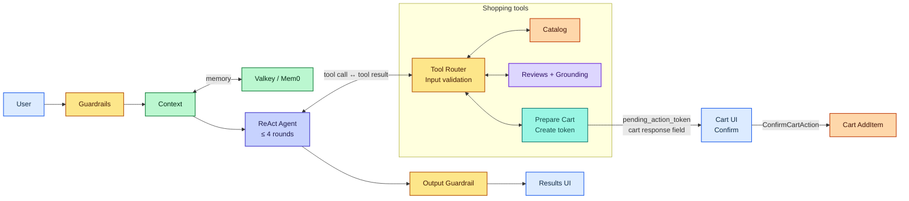
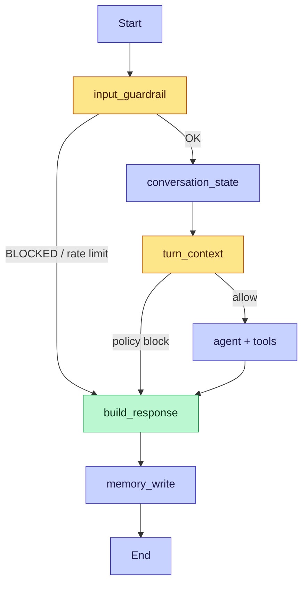
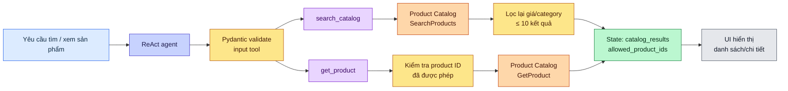

# Phân tích luồng Shopping Copilot

## Mục đích và phạm vi

`shopping-copilot` là dịch vụ gRPC hỗ trợ tìm và đánh giá sản phẩm, đồng thời chuẩn bị thao tác thêm giỏ hàng. Dịch vụ không cho mô hình AI ghi vào giỏ trực tiếp. Việc ghi chỉ xảy ra sau một RPC xác nhận riêng từ phía người dùng.

Phân tích này dựa trên mã nguồn trong `src/shopping-copilot`, gồm luồng xử lý yêu cầu, các phụ thuộc, rào chắn an toàn và cơ chế bộ nhớ.

## Thành phần chính

| Thành phần | Trách nhiệm |
| --- | --- |
| `copilot_server.py` | Khởi động gRPC server; cung cấp `Search`, `ConfirmCartAction` và health check; ghi telemetry. |
| `copilot_graph.py` | Định nghĩa LangGraph, trạng thái một lượt hội thoại, timeout 15 giây và giới hạn đệ quy 10. |
| `react_agent.py` | Vòng ReAct tối đa 4 lượt gọi tool; dùng AWS Bedrock hoặc API tương thích OpenAI. |
| `catalog_tool.py` | Tìm kiếm/lấy chi tiết từ Product Catalog qua gRPC; áp lại bộ lọc và giới hạn 10 kết quả. |
| `review_tool.py` | Trả lời dựa trên review đã làm sạch và được kiểm chứng nguồn. |
| `cart_tool.py` | Tạo token chờ xác nhận trong Valkey; xác nhận token rồi mới gọi Cart `AddItem`. |
| `conversation_store.py` | Lưu ngữ cảnh điều hướng hội thoại trong Valkey, TTL mặc định 24 giờ. |
| `memory_retrieval.py`, `memory_extractor.py`, `mem0_client.py` | Phân loại ý định/tool access, đọc và ghi bộ nhớ dài hạn Mem0 khi được bật. |
| `copilot_contracts.py` | Hợp đồng Pydantic cho input tool, trạng thái, memory và pending cart action. |

## Luồng tổng quan

## Chi tiết luồng `Search`

1. Client gọi `Search` với `user_message`, `user_id`, `conversation_id` và `turn_id`. Hai ID hội thoại chỉ được dùng khi là UUID v4 hợp lệ.
2. Graph kiểm tra rate limit: tối đa 10 yêu cầu/phút với cooldown 2 giây cho mỗi `user_id`. Sau đó nó làm sạch hoặc chặn nội dung đầu vào bằng guardrail.
3. Nếu có hội thoại hợp lệ, dịch vụ lấy Valkey state, tăng số thứ tự lượt và dựng context từ truy vấn, category, danh sách sản phẩm gần nhất và sản phẩm đã chọn.
4. Bước `turn_context` dùng LLM để trả về `RetrievalHint`: truy vấn ngữ nghĩa, quyền dùng tool (`none`/`shopping`) và quyết định policy (`allow`/`block`). Khi Mem0 read được bật, hệ thống lấy tối đa 5 memory trong đúng `conversation_id` và coi chúng là dữ liệu không đáng tin cậy.
5. ReAct agent nhận system prompt, tin nhắn đã làm sạch, conversation context và memory. Nó chỉ cung cấp tool khi `tool_access=shopping`, giới hạn tối đa 4 vòng gọi và dừng fallback nếu phát hiện một tool call lặp lại.
6. Agent có thể tìm catalog, lấy chi tiết, hỏi review hoặc chuẩn bị add-to-cart. Tất cả input tool đều được Pydantic xác thực; các trường ngoài schema bị từ chối.
7. Graph dựng phản hồi. Với Q&A review, câu trả lời cuối lấy từ kết quả grounded thay vì văn bản tự do của agent. Output được quét guardrail trước khi trả về.
8. Nếu trạng thái là `GROUNDED` và Mem0 write được bật, dịch vụ trích xuất tối đa 5 facts bền vững do người dùng nêu và ghi vào Mem0. Lỗi memory không làm hỏng phản hồi.
9. Server chuyển state thành `CopilotSearchResponse`: status, criteria đã hiểu, reason, sản phẩm, claims/sources review và token pending nếu có.

### File và hàm theo thứ tự thực thi

| Bước | File · hàm | Đầu vào | Xử lý và đầu ra |
| --- | --- | --- | --- |
| 1 | `copilot_server.py` · `ShoppingCopilotServicer.Search()` | `CopilotSearchRequest` | Tạo trace `copilot_search`, gắn user/session telemetry, gọi `run_copilot()`, rồi map state thành `CopilotSearchResponse`. |
| 2 | `copilot_graph.py` · `run_copilot()` | Message và các ID từ RPC | Chỉ giữ `conversation_id`/`turn_id` là UUID v4, tạo `initial_state`, build LangGraph, chạy với timeout 15 giây và recursion limit 10. Timeout hoặc exception trả `FALLBACK`. |
| 3 | `copilot_graph.py` · `input_guardrail_node()` | `user_message`, `user_id` | `check_rate_limit()` kiểm tra Valkey; `sanitize_request()` chặn hoặc làm sạch message. Chặn thì graph đi thẳng đến `build_response`. |
| 4 | `copilot_graph.py` · `conversation_state_node()` | `conversation_id`, `turn_id` | `conversation_store.begin_turn()` lấy/tạo state Valkey, tăng sequence idempotent theo `turn_id`; dựng danh sách product ID được phép và context lượt trước. |
| 5 | `copilot_graph.py` · `turn_context_node()` | `safe_message`, context hội thoại | `memory_retrieval.parse_retrieval_hint()` gọi LLM để phân loại follow-up, semantic query, policy và `tool_access`. Policy block dừng graph. Nếu Mem0 read bật, `mem0_client.search()` trả tối đa 5 memory làm context. |
| 6 | `copilot_graph.py` · `agent_node()` | State đã được bảo vệ | Gọi `react_agent.run_react_agent()`. Các tool cập nhật trực tiếp state của lượt hiện tại. Exception đưa state về `FALLBACK`. |
| 7 | `react_agent.py` · `_run_bedrock()` hoặc `_run_openai()` | System prompt + `_context(state)` | Chọn provider theo `is_bedrock_provider()`. Tool chỉ được gửi cho model khi `tool_access == "shopping"`; loop tối đa 4 vòng, chặn tool call lặp. |
| 8 | `react_agent.py` · `_run_tool()` → `_run_tool_impl()` | Tên tool và JSON arguments từ model | Chọn Pydantic contract trong `_TOOL_MODELS`, xác thực input, tạo span `execute_tool ...`, rồi gọi implementation tương ứng. Lỗi tool trả về model, không làm chết request. |
| 9 | `copilot_graph.py` · `build_response_node()` | `reason`, `qa_result`, `status` | Nếu có review Q&A, chọn câu trả lời grounded. `scan_output()` kiểm tra output, có thể block/sanitize. Trả `GROUNDED`, `NO_RESULTS` hoặc `ABSTAINED`. |
| 10 | `copilot_graph.py` · `memory_write_node()` | Safe message, status, IDs | Khi Mem0 write bật và status là `GROUNDED`, `memory_extractor.extract_memories()` trích facts; `mem0_client.add()` ghi từng fact. Valkey đánh dấu turn đã ghi để tránh lặp. |

### Dữ liệu được mang qua graph

`CopilotState` trong `copilot_graph.py` là dữ liệu chung giữa các node. Các trường quan trọng thay đổi theo luồng như sau:

| Trường state | Nơi ghi | Mục đích |
| --- | --- | --- |
| `safe_message` | `input_guardrail_node` | Phiên bản message sau khi làm sạch. |
| `conversation_context`, `turn_sequence`, `allowed_product_ids` | `conversation_state_node` | Bám ngữ cảnh, theo dõi lượt và giới hạn sản phẩm được tham chiếu. |
| `retrieval_hint`, `tool_access`, `memory_context` | `turn_context_node` | Quyết định quyền tool và bổ sung memory. |
| `catalog_results`, `interpreted_criteria` | `search_catalog` qua `_remember_results` | Sản phẩm để UI hiển thị và bộ lọc đã hiểu. |
| `qa_result`, `safe_reviews` | `answer_with_reviews` | Câu trả lời review có nguồn và review đã làm sạch. |
| `pending_action` | `prepare_cart_action` | Token chờ frontend xác nhận, chưa ghi giỏ. |
| `status`, `reason`, `error` | Các node graph và agent | Kết quả cuối, thông điệp trả người dùng và mã lỗi nội bộ. |

### Phân rã tool trong bước agent

`react_agent.py` cho phép bốn tool. Model không có quyền gọi gRPC tùy ý; mọi call phải qua `_run_tool_impl()`.

| Tool | Chuỗi hàm | Kiểm soát chính |
| --- | --- | --- |
| Tìm sản phẩm | `_run_tool_impl("search_catalog")` → `catalog_tool.search_catalog()` → `ProductCatalogService.SearchProducts()` | `CatalogSearchInput` chỉ nhận query, category trong allow-list và giá không âm; kết quả tối đa 10, category/giá được lọc lại ở service. |
| Lấy chi tiết | `_resolve_product_id()` → `catalog_tool.get_product()` → `ProductCatalogService.GetProduct()` | Chỉ nhận ID trong `allowed_product_ids`; nếu dùng tên, phải tìm được một tên khớp chính xác duy nhất. |
| Hỏi review | `_resolve_product_id()` → `review_tool.answer_with_reviews()` → `ProductReviewService.GetProductReviews()` | ID bắt buộc thuộc danh sách sản phẩm của request; review được `sanitize_reviews()`, sinh câu trả lời rồi `validate_grounded_summary()`. |
| Chuẩn bị giỏ | `_resolve_product_id()` → `cart_tool.create_pending_token()` | Quantity 1–10; token ngẫu nhiên được lưu Valkey 300 giây. Hàm này không gọi Cart service. |

### Nhánh điều hướng trong LangGraph

Lưu ý: `build_response_node()` không tự tạo nội dung mới khi review Q&A đã có kết quả; nó ưu tiên `qa_result.answer`. Vì vậy nội dung review trả về giữ liên kết với claims/sources thay vì để ReAct agent diễn giải thêm.

## Các nhánh tool

| Tool | Điều kiện và xử lý | Kết quả |
| --- | --- | --- |
| `search_catalog` | Nhận query/category/max price hợp lệ; gọi Catalog và kiểm lại category, giá ở local. | Cập nhật kết quả và danh sách product ID được phép; status là `GROUNDED` hoặc `NO_RESULTS`. |
| `get_product` | Product ID phải thuộc kết quả đã biết, hoặc tên phải khớp chính xác duy nhất qua catalog. | Rehydrate chi tiết sản phẩm từ Catalog. |
| `answer_with_reviews` | Chỉ cho product ID thuộc danh sách kết quả của request hiện tại. | Lấy review, sanitize, tạo/validate grounded answer; có thể `ABSTAINED`. |
| `prepare_cart_action` | Áp dụng cùng quy tắc xác định product. | Lưu `user_id`, product ID, quantity và token ngẫu nhiên vào Valkey trong 5 phút; chưa ghi giỏ. |

## Luồng theo chức năng

### 1. Catalog: tìm sản phẩm hoặc lấy chi tiết

`get_product` chỉ được gọi với product ID nằm trong `allowed_product_ids`. Khi người dùng đưa tên thay cho ID, hệ thống search catalog trước và chỉ chấp nhận một tên khớp chính xác duy nhất.

### 2. Review: grounding trước khi trả lời

```mermaid
flowchart LR
    U["Câu hỏi review"]:::client --> A["ReAct agent"]:::ai
    A --> I["Xác định product ID"]:::guard
    I -->|"ID không thuộc kết quả catalog"| X["Từ chối fetch review"]:::output
    I -->|"Hợp lệ"| R["Product Reviews\nGetProductReviews"]:::service
    R --> S["sanitize_reviews"]:::guard
    S -->|"Không có review an toàn"| AB["ABSTAINED"]:::output
    S -->|"Có dữ liệu"| G["Sinh câu trả lời\ngrounded"]:::grounding
    G --> V["validate_grounded_summary\nclaims + sources"]:::grounding
    V --> O["Output guardrail"]:::guard
    O --> UI["UI hiển thị\nanswer + claims + sources"]:::output

    classDef client fill:#DCEBFF,stroke:#2563EB,color:#102A43;
    classDef ai fill:#C7D2FE,stroke:#4338CA,color:#1E1B4B;
    classDef guard fill:#FDE68A,stroke:#B45309,color:#451A03;
    classDef service fill:#FED7AA,stroke:#C2410C,color:#431407;
    classDef grounding fill:#DDD6FE,stroke:#6D28D9,color:#2E1065;
    classDef output fill:#E5E7EB,stroke:#4B5563,color:#111827;
```

### 3. Cart: chuẩn bị rồi xác nhận tách biệt

```mermaid
flowchart LR
    U["Yêu cầu thêm giỏ"]:::client --> A["ReAct agent"]:::ai
    A --> V["Xác thực product\nvà quantity 1–10"]:::guard
    V --> P["prepare_cart_action"]:::tool
    P --> VK["Valkey\npending token, TTL 5 phút"]:::memory
    VK --> UI["UI nhận token\nhiển thị xác nhận"]:::output
    UI --> C["ConfirmCartAction"]:::confirm
    C --> GD["GETDEL token\nkiểm tra user"]:::confirm
    GD -->|"Hợp lệ"| CART["CartService\nAddItem"]:::service
    GD -->|"Sai/hết hạn"| NO["Không ghi giỏ"]:::output
    CART --> OK["success=true"]:::output

    classDef client fill:#DCEBFF,stroke:#2563EB,color:#102A43;
    classDef ai fill:#C7D2FE,stroke:#4338CA,color:#1E1B4B;
    classDef guard fill:#FDE68A,stroke:#B45309,color:#451A03;
    classDef tool fill:#E9D5FF,stroke:#7E22CE,color:#3B0764;
    classDef memory fill:#BBF7D0,stroke:#15803D,color:#052E16;
    classDef confirm fill:#99F6E4,stroke:#0F766E,color:#134E4A;
    classDef service fill:#FED7AA,stroke:#C2410C,color:#431407;
    classDef output fill:#E5E7EB,stroke:#4B5563,color:#111827;
```

### 4. Conversation và memory: hỗ trợ follow-up

```mermaid
flowchart LR
    Q["Search request\nconversation_id + turn_id"]:::client --> B["begin_turn"]:::memory
    B --> VK["Valkey conversation state\nsequence + product IDs"]:::memory
    VK --> H["Retrieval hint\npolicy + tool access"]:::ai
    H -->|"MEM0_READ_ENABLED"| M["Mem0 search\n≤ 5 memories"]:::memory
    M --> A["Agent context"]:::ai
    H -->|"Memory tắt"| A
    A --> W["Build response\nGROUNDED"]:::output
    W --> E["extract_memories"]:::ai
    E -->|"MEM0_WRITE_ENABLED"| MW["Mem0 add\nmemories bền vững"]:::memory
    E -->|"Memory write tắt"| O["gRPC response"]:::output
    MW --> O

    classDef client fill:#DCEBFF,stroke:#2563EB,color:#102A43;
    classDef ai fill:#C7D2FE,stroke:#4338CA,color:#1E1B4B;
    classDef memory fill:#BBF7D0,stroke:#15803D,color:#052E16;
    classDef output fill:#E5E7EB,stroke:#4B5563,color:#111827;
```

## Luồng xác nhận giỏ hàng

Luồng này độc lập với LangGraph. Sau khi `Search` trả `pending_action_token`, frontend phải yêu cầu người dùng xác nhận và gọi `ConfirmCartAction`.

1. Dịch vụ đọc và xóa token bằng `GETDEL` atomic, nên token không thể dùng lại, kể cả khi có request đồng thời.
2. Dịch vụ kiểm tra token còn hạn và `user_id` trong token trùng caller.
3. Chỉ khi hai điều kiện đạt, service mới gọi `CartService.AddItem`.
4. Token hết hạn, không tồn tại, payload lỗi hoặc sai user đều trả failure và không ghi giỏ.

Đây là ranh giới an toàn quan trọng nhất: AI graph không có đường gọi trực tiếp tới `CartService.AddItem`.

## Trạng thái và xử lý lỗi

| Status | Ý nghĩa |
| --- | --- |
| `GROUNDED` | Hoàn tất bình thường; dữ liệu tool/grounding hợp lệ. |
| `NO_RESULTS` | Catalog không tìm thấy sản phẩm. |
| `ABSTAINED` | Review an toàn hiện có không đủ để trả lời. |
| `BLOCKED` | Input, policy hoặc output guardrail chặn yêu cầu. |
| `FALLBACK` | Lỗi agent/graph, quá timeout 15 giây, hoặc vượt giới hạn vòng tool. |

Mem0 và conversation store xử lý fail-open: lỗi đọc/ghi context hoặc memory thường làm hệ thống tiếp tục ở chế độ single-turn hoặc không dùng tool, thay vì làm hỏng toàn bộ yêu cầu. Lỗi tool được trả lại cho agent dưới dạng lỗi tạm thời; lỗi bao ngoài agent/graph đưa request về `FALLBACK`.

## Phụ thuộc và vận hành

- Transport: gRPC; `Search`, `ConfirmCartAction`, health `Check`.
- External services: Product Catalog, Product Reviews, Cart, Valkey, Mem0 (tùy cờ cấu hình), LLM qua Bedrock hoặc OpenAI-compatible endpoint.
- Quan sát: OpenTelemetry trace cho request, tool call và Mem0 retrieval; fallback được ghi metric/log qua `techx_ai_common`.
- Docker khởi tạo guardrail model trước khi nhận traffic và chạy ứng dụng bằng user không phải root.
- Test hiện có bao phủ graph, ReAct agent, catalog, cart, Bedrock runtime và output guardrail; thư mục `evals/` chứa case kiểm tra faithfulness và prompt injection.

## Điểm cần nhớ khi tích hợp UI

- UI nên tự render danh sách sản phẩm từ trường `products`; agent được hướng dẫn không lặp lại catalog trong văn bản `reason`.
- UI chỉ hiển thị review claims/sources từ response đã grounded.
- Không coi pending token là thao tác đã thành công. Chỉ cập nhật giỏ sau `ConfirmCartActionResponse.success=true`.
- Để follow-up hoạt động ổn định, gửi cùng `conversation_id` và một `turn_id` UUID v4 mới cho mỗi lượt; retry cùng lượt dùng lại `turn_id` để giữ idempotency cho state/memory marker.
